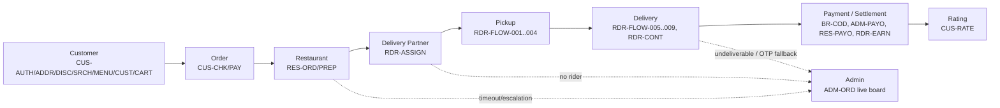
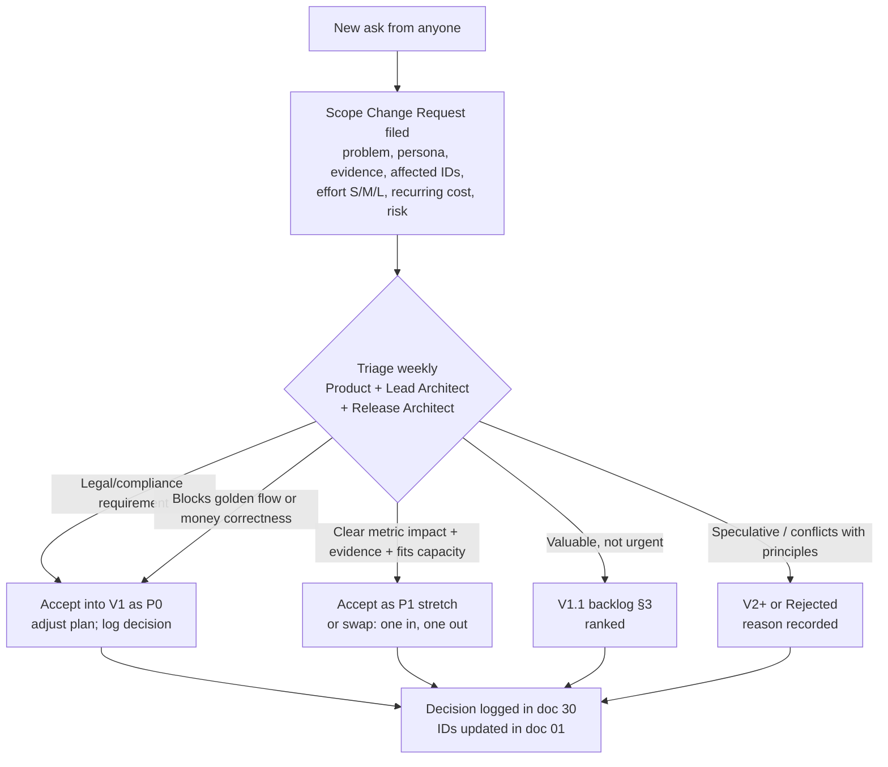

# 02 — V1 Scope

| Field | Value |
|---|---|
| **Purpose** | Draw a hard line around what rovo V1 ships, what it explicitly does not, what is queued for V1.1, how new asks are triaged, and when the product is ready to launch. Release planning (27–29) builds the backlog and milestones from this document. |
| **Owner** | Product Architect |
| **Status** | Draft v1.1 — reconciled with review (31) and rulings R1–R48, 2026-10-04 |
| **Depends on** | `00-planning-baseline.md` (§1 deferred list, §4a environments, §5 commercial defaults, §8 R1–R26, §9 R27–R48 with scope cuts C1–C20 and missing items M1–M17); `01-product-requirements.md` (requirement IDs and priorities); `03-user-personas.md` (who each scope item serves). |
| **Feeds** | 04–07 (journeys limited to in-scope), 27 (backlog), 28 (milestones), 29 (production readiness), 30 (risks/decisions). |

**Changes in v1.1**
- New §2.3 lists the accepted scope cuts **C1–C20** (deferred to V1.1+); §1.2 drops RES-ANLY-002 (C13) and ADM-COUP-004 (C16) and adds the accepted missing items (M3, M5–M9) and P1 rulings (R33 share pages, R37 passkeys, R43 voice escalation).
- RES-MENU-009 ops-side bulk CSV import is P0 for Gate B (M7); ops-assisted phone ordering ADM-ORD-011 is a committed P1 (M8).
- Launch gates per **R47** (Gate A ≥ 10 restaurants, ≥ 10 riders, 1 zone; Gate B ≥ 40 restaurants, riders from demand model ≈ 1 online rider per 3 peak-hour orders); pilot minimum guarantee and insurance decision added; Multi-AZ trigger per **R32**; load test per doc 20 (**R45**); budget per doc 25 §15 (**R46**); support phone line (M9), counter devices (M3), CERT-In log archive (M1), legal critical path (M16), ≥ 2 named money approvers (R31) added as gate items.
- §4: dev/preview is local Docker only (**R24**, register row 46); volumes per R45.
- Capability map wording aligned with R1, R2, R12, R13, R14, R34, R40.

**Rule of interpretation:** *In scope for V1* = every **P0** requirement in doc 01, plus the **P1** requirements listed in §1.2. Everything marked **P2** in doc 01 is out of V1. A P1 not listed in §1.2 is a stretch item: built only if it does not endanger the launch date.

---

## 1. In scope for V1

### 1.1 Capability map (P0 = launch blocker)

| Area | In-scope capability | Requirement IDs (P0) |
|---|---|---|
| **Customer — access** | Phone OTP sign-in/up, minimal profile, consent & 18+ declaration, en/te language, session persistence, browse before login, account deletion | CUS-AUTH-001…007 |
| **Customer — location** | Geolocation / locality / pin-drop; Indian address form with **required landmark + pin, optional building/street** (R13); serviceability check; saved addresses; delivery instructions | CUS-ADDR-001…005 |
| **Customer — discovery** | Serviceable restaurant listing with deterministic ranking; cards with fee/ETA/rating/FSSAI-ready data; closed/paused handling; service hours | CUS-DISC-001…004 |
| **Customer — search** | Restaurant + dish search (en/te, typo-tolerant), filters, sort, cuisine chips | CUS-SRCH-001…004 |
| **Customer — menu** | Restaurant header (incl. FSSAI no.), categorised menu, dietary markers, veg toggle, out-of-stock display, GST-exclusive price note | CUS-MENU-001…005 |
| **Customer — customisation** | Single variant group; add-on groups with min/max; dietary integrity; line merging; repeat-last | CUS-CUST-001…005 |
| **Customer — cart** | Single-restaurant cart with replace prompt; device-only persistence (no server cart, R12); full bill preview; change detection; small-cart nudge; closing guard | CUS-CART-001…006 |
| **Customer — checkout** | Server-side signed quote (`quoteId`, R12); idempotent placement; validation; ETA range; order code | CUS-CHK-001…006 |
| **Customer — payment** | PA online payment (UPI first), COD within rules, payment status clarity, late-capture auto-refund, receipt/tax invoice | CUS-PAY-001…005 |
| **Customer — tracking** | Milestone timeline via SSE + polling; ETA updates; rider details; delivery OTP (prepaid ≥ ₹300, R39); cancel while `PLACED` or within 60 s of placement (R2); Web Push | CUS-TRK-001…006 |
| **Customer — history** | Order list, order details with invoice, reorder | CUS-HIST-001…003 |
| **Customer — ratings** | Separate restaurant & delivery ratings, 7-day window, prompt, low-rating follow-up | CUS-RATE-001…004 |
| **Customer — coupons** | Apply one coupon (code/list), eligibility reasons, discount line | CUS-COUP-001…003 |
| **Customer — support** | Order help categories → ticket (photos), ticket status, help centre with grievance officer and **staffed support phone line** (M9) | CUS-SUPP-001…003 |
| **Restaurant — onboarding** | Self-registration + **assisted onboarding by ops**; KYC (FSSAI, PAN, bank/UPI, optional GSTIN, shop photo, agreement); application states; go-live checklist; **counter-device provisioning** (M3) | RES-ONB-001…005, RES-ONB-008 |
| **Restaurant — profile & hours** | Profile, radius, pure-veg flag, packaging mode; weekly slots, holidays, temporary pause, last-order buffer, effective open state | RES-PROF-001…003, RES-HOUR-001…005 |
| **Restaurant — menu** | Categories, items, single variant group, reusable add-on groups, images, Telugu names, price-change rules, admin moderation; **ops-side bulk CSV import (P0 for Gate B, M7)** | RES-MENU-001…009 |
| **Restaurant — availability** | Item/variant/add-on/category stock toggles with auto-restore | RES-AVAIL-001…002 |
| **Restaurant — orders** | Unmissable alert (repeats every 30 s), accept with prep time, reject with reasons, 180 s accept window → `CANCELLED`/`RESTAURANT_UNRESPONSIVE` (R1), order board, ops-mediated cannot-fulfil (R40), handover, no customer PII; device-heartbeat auto-pause (R1); device-bound sessions (R44) | RES-ORD-001…008, RES-HOUR-005, X-006 |
| **Restaurant — prep** | ACCEPTED→PREPARING (auto after 60 s or tap, R3)→READY, prep extensions, default prep time, ready reminder | RES-PREP-001…004 |
| **Restaurant — money & insight** | Today/week summary; payout statements with per-order breakdown; CSV download; masked payout account | RES-ANLY-001, RES-PAYO-001…003 |
| **Rider — onboarding** | Registration, KYC images (DL, RC, insurance image, PAN, bank/UPI; **no Aadhaar**), review with induction, agreement, **gig-worker registration fields [LEGAL]** (M5) | RDR-ONB-001…004, RDR-ONB-007 |
| **Rider — availability & offers** | Online/offline with foreground location; dispatch tiers (fresh ≤ 3 min / stale ≤ 15 min via push) and auto-offline at 15 min (R34); offer card; 45 s timeout & cascade; accept/decline; one active delivery; manual assignment; offer alert | RDR-AVAIL-001…003, RDR-ASSIGN-001…006 |
| **Rider — delivery flow** | Navigate (external maps), arrived/picked up/at drop, order verification, delivery OTP with admin fallback, COD collection confirmation, undeliverable flow, resilient retries | RDR-FLOW-001…010 |
| **Rider — contact** | `tel:` calling within active windows; support call; PII hidden afterwards | RDR-CONT-001…004 |
| **Rider — money** | History, earnings, cash-in-hand, deposit declaration, payout statement with netting; **pilot minimum guarantee `MG_TOPUP`** (M6, ops) | RDR-HIST-001, RDR-EARN-001…004, RDR-EARN-007 |
| **Admin — access & dashboard** | Email+password+TOTP, role/city scope, sensitive-reveal logging; live ops summary; today's KPIs | ADM-AUTH-001…003, ADM-DASH-001…002 |
| **Admin — users/restaurants/riders** | Customer search/block/COD toggle/DPDP requests; restaurant & rider application queues, suspend/reinstate, assisted edits, health/performance views, force pause | ADM-USER-001…004, ADM-REST-001…005, ADM-RDR-001…004 |
| **Admin — orders** | Live board, order timeline, **accept on behalf**, status on behalf, manual assign/reassign, cancel with refund decision & fault, post-delivery refund with maker-checker, notes, call shortcuts | ADM-ORD-001…009 |
| **Admin — commercial** | Commission with effective dates & snapshot (second approver, R31); coupons (create, report, preview; platform/restaurant funding only, C16) | ADM-COMM-001…002, ADM-COUP-001…003 |
| **Admin — support** | Ticket inbox with SLA timers, resolution actions, grievance escalation | ADM-TKT-001…003 |
| **Admin — reports & audit** | CSV exports, GST working report, daily ops report, **gig-worker export** (M5); append-only audit log (DB grants, no hash chain, C6) & viewer; order event log | ADM-RPT-001…003, ADM-RPT-005, ADM-AUDIT-001…003 |
| **Admin — config** | Zones (polygons) & localities, fee config effective-dated, zone pause, city settings & feature flags, legal documents versioning | ADM-ZONE-001…003, ADM-CFG-001…002 |
| **Admin — money** | Settlement runs with maker-checker (limited to the five R31 families) and manual transfer recording, bank-statement CSV matching for rider deposits, ledger, PA reconciliation, holds, rider cash deposits, manual adjustments, COD refunds to customers | ADM-PAYO-001…007 |
| **Cross-cutting** | Notification matrix (push/SMS/in-app), localisation, consent-gated marketing, contextual push permission, order code, time/currency formats, localised errors, feature flags | NOT-001…010, NOT-013…015, X-001…006 |
| **Quality bars** | Performance budgets, production availability/RPO/RTO on managed cloud, WCAG 2.2 AA, en+te 100%, DPDP privacy, security, auditability, retention, cost tracking | NFR-PERF-001…006 (load per doc 20, R45), NFR-AVAIL-001…008, NFR-A11Y-001…007, NFR-I18N-001…005, NFR-PRIV-*, NFR-SEC-*, NFR-AUD-001…005, NFR-RET, M-60…M-62 |
| **Rules & compliance** | All BR-* rules; all P0 LEG-* items closed or formally risk-accepted by counsel | BR-*, LEG-* (P0) |

### 1.2 P1 items committed to V1 (built before launch)

These are P1 in doc 01 but are pulled into the committed V1 because a persona depends on them for launch-day viability.

| ID | Item | Why committed (persona, see doc 03) |
|---|---|---|
| RES-PROF-004 | Multiple devices/staff for one restaurant | Venkatesh's counter phone + owner phone must both ring |
| RES-ONB-007 / BR-RES-004 | FSSAI expiry reminders & auto-pause | Compliance (LEG-FSSAI-002) |
| RES-ORD-009 | Printable KOT (browser print) | Farhan's kitchen runs on paper KOTs |
| RDR-FLOW-013 | SOS button | Rider safety at night (Kiran, Mahesh) |
| RDR-EARN-005 | On-demand rider payout request (manual) | Mahesh's weekly cash-flow need; low build cost |
| CUS-CHK-007 | Ordering for someone else | Ravi orders for his parents (Narasimha) |
| CUS-PAY-006 | Switch to COD on payment retry | Failed UPI is a top drop-off for Sravani |
| NOT-011 | Cash-limit warnings | COD reconciliation (M-20…M-22) |
| ADM-TKT-004 | Canned responses en/te | Anusha's ticket throughput |
| ADM-ORD-010 | Incident bulk actions (zone pause, COD off, banner) | Monsoon/outage handling |
| ADM-PAYO-008 | TDS computation report | Only if counsel confirms applicability (LEG-TAX-001) |
| NFR-AVAIL-009 | Incident banner | Trust during incidents |
| ADM-ORD-011 | Ops-assisted phone ordering, COD (M8) | Narasimha (P3) and other low-literacy customers |
| ADM-AUTH-004 | Admin passkeys (R37) | Phishing resistance for money roles |
| NOT-016 | Automated voice-call escalation — built only if the pilot shows > 5% of orders reaching 90 s (R43) | Venkatesh (P4) noisy kitchen |
| — | Restaurant share-preview pages `/r/{slug}` (static OG tags served by a small Go handler; no build-time prerender, R33/C3) | WhatsApp word-of-mouth sharing |

Stretch P1 (only if on schedule): CUS-AUTH-008/009, CUS-ADDR-006, CUS-DISC-005/006, CUS-SRCH-005, CUS-MENU-006/007, CUS-CUST-006, CUS-CART-007, CUS-HIST-004, CUS-RATE-005 (filter + admin hide only, C14), CUS-COUP-004, CUS-SUPP-004, RES-ONB-006, RES-MENU-009 (owner-side), RES-MENU-010, RES-AVAIL-003, RES-ANLY-003, RES-PAYO-002 (PDF), RES-PAYO-004, RDR-ONB-005/006, RDR-ASSIGN-007, RDR-FLOW-011/012, RDR-HIST-002, ADM-DASH-003, ADM-REST-006, ADM-COMM-003, ADM-TKT-005, ADM-CONT-001, ADM-CFG-003, NOT-012, NFR-PERF-007, NFR-A11Y-008.

Removed from V1 by the accepted scope cuts: RES-ANLY-002 (C13) and ADM-COUP-004 (C16) are now P2 — see §2.3.

### 1.3 Golden-flow coverage check

Every arrow has P0 requirements; every exception path has an admin intervention (ADM-ORD-003…006).

---

## 2. Explicitly out of scope / deferred

Decision key: **V1.1** = next release after launch stabilises (target: within ~3 months of launch); **V2+** = needs product/market evidence or larger investment; **Never/No plan** = conflicts with principles or law.

### 2.1 Mandatory deferrals (baseline §1)

| Item | Decision | Justification |
|---|---|---|
| Multi-city operations | **V2+** | One city's ops must be proven first. Data model is multi-city-ready (`city_id` everywhere, city-scoped admin roles, per-city config) — but no city switcher, cross-city reporting, city launch tooling or multi-city ops staffing in V1. |
| AI recommendations / personalisation | **V2+** | Needs order history volume we won't have; deterministic ranking (CUS-DISC-001) is explainable and satisfies ranking-disclosure (LEG-CP-007). |
| Loyalty programmes / points / referrals | **V2+** | Adds liability accounting and fraud surface; coupons cover acquisition in V1. |
| Subscriptions (free-delivery membership) | **V2+** | Needs stable delivery economics first; adds recurring-billing and dark-pattern risk (subscription traps). |
| Advanced analytics / BI / cohorts | **V2+** | CSV exports (ADM-RPT-001) + daily report suffice; BI tooling is a cost line. |
| Complex route optimisation / batching | **V2+** | Compact city + one active delivery per rider; haversine × road factor is adequate. Revisit if p90 delivery > 50 min with riders idle. |
| Live GPS fleet tracking / customer live map | **V2+** | PWA can't track in background (baseline P12); milestone tracking meets need. Admin sees last-known location distance only. |
| Native mobile apps (Android/iOS) | **V2+** | PWA meets needs; API is native-ready (bearer tokens). Trigger to revisit: Web Push/background reliability for restaurants/riders measurably hurting M-02/M-05. |
| Unnecessary microservices | **No plan** | Modular monolith (baseline P1); split only on proven scaling/team need. |

### 2.2 Additional scope-creep decisions

| Item | Decision | Justification |
|---|---|---|
| **Scheduled orders** (order now, deliver at 8 pm) | **V2+** | Needs capacity reservation, restaurant pre-confirmation, timers hours ahead, reminder flows; low demand signal in a small city where "now" deliveries are ~35 min. |
| **Group orders / shared carts** | **V2+** | Multi-user cart sync and split payments; niche (office/hostel use) — handled today by one person ordering. |
| **Multi-restaurant carts** | **V2+** | Breaks the single-restaurant cart rule (CUS-CART-001), requires multi-pickup batching (deferred) and split refunds. |
| **Tipping riders** | **V1.1** | Valuable for rider earnings (M-54) and low build cost (100% pass-through ledger line), but must be designed without dark patterns (never pre-selected, LEG-CP-005) and with clear tax/accounting treatment [LEGAL]. Kept out of V1 to protect the checkout's simplicity and the launch date. |
| **Masked calling** | **V1.1** | Recurring telephony cost + provider integration; V1 uses time-boxed `tel:` reveal with logging (BR-CONT-001). Trigger: any rider-harassment or customer-privacy incident, or rider/customer survey demand. |
| **Automated payouts** (PA payout/route APIs) | **V1.1** | Manual weekly transfers are fine for ≤ 60 restaurants and ≤ 60 riders; automation needs PA product onboarding and additional KYC. Trigger: > 100 payees/week or > 2 h/week finance effort. |
| **Dynamic UPI QR at doorstep** (pay-on-delivery via UPI) | **V1.1** | Cuts cash handling and COD variance; needs PA QR API + webhook to flip payment method on a placed COD order. |
| **Dine-in / table reservations / takeaway (self-pickup)** | Dine-in: **No plan**; takeaway: **V1.1 candidate** | Dine-in is a different product. Takeaway is cheap (skip delivery) but changes state paths (no delivery) — after launch. |
| **Grocery / pharmacy / pick-and-drop / "Genie"** | **No plan for V1/V1.1** | Different catalogue, inventory, regulation (Drugs & Cosmetics for pharmacy), and ops. |
| **Wallet / stored value / rovo cash** | **No plan** | RBI PPI regulation; refunds go to source (BR-REF-001). |
| **Alcohol** | **No plan** | Separate state excise licensing; online alcohol delivery is not, to our knowledge, permitted for food aggregators in Telangana [LEGAL – unverified; out of scope regardless]. |
| **Surge / rain / peak pricing** | **V2+** (R30, C1) | Price-sensitive market, fee transparency is a differentiator; use zone pause (ADM-ZONE-003) plus a manual rider peak bonus as a ledger adjustment. |
| **Rider incentives (automated peak bonus schemes, streaks)** | **V1.1** | Needed when supply is short at peaks; requires incentive ledger rules. V1 has only the manual peak bonus (R30) and the pilot minimum guarantee `MG_TOPUP` (M6). |
| **Rider shifts / slot booking** | **V2+** | Free online/offline works at small scale. |
| **Rider batching (2 orders per trip)** | **V2+** | See route optimisation. |
| **Restaurant self-delivery mode** | **V1.1 candidate** | Could expand supply where rovo riders are thin, but splits delivery accountability and tracking; evaluate after pilot. |
| **Partial order edits** (remove OOS item with partial refund) | **V1.1** | V1 rejects with `ITEM_OUT_OF_STOCK` + full refund (simpler money paths); measure M-56 first. |
| **Bluetooth thermal printer integration** | **V2+** | Browser print (RES-ORD-009) covers V1. |
| **Restaurant replies to reviews, photo reviews, dish ratings** | **V1.1** (replies) / V2+ (others) | Moderation load. |
| **Sponsored listings / restaurant ads** | **V2+** | Conflicts with transparent ranking at V1; revenue line later with disclosure. |
| **Item-level strike-through discounts, combos** | **V1.1** | Coupons cover offers in V1. |
| **Live chat / WhatsApp integration / chatbots** | **V1.1** (WhatsApp OTP, notifications & support — C2), chatbots **V2+** | Staffed phone line (M9) + in-app tickets + SMS suffice at launch volumes. |
| **Customer referral programme** | **V2+** | Fraud surface; part of loyalty family. |
| **Voice ordering / IVR ordering (automated)** | **V2+** | Interesting for Telugu-first elderly users (Narasimha); research first. V1 covers this persona with ops-assisted phone ordering (ADM-ORD-011, P1, M8). |
| **Urdu / Hindi locales** | **V1.1 candidate** (Urdu) | Architecture allows (NFR-I18N-006); needs RTL QA. Measure demand in pilot. |
| **Reverse geocoding / address autocomplete / paid maps** | **V2+** | Cost; pin + locality list adequate (baseline P13). |
| **Corporate / bulk catering orders** | **V2+** | Different flow (quotes, invoices). |
| **ONDC integration** (Open Network for Digital Commerce) | **V2+ — strategic** [OPEN] | Natural fit for an open-source local platform (discovery by other buyer apps); requires protocol compliance and network onboarding. |
| **Public developer API / third-party POS integration (e.g. Petpooja-style)** | **V2+** | API is spec-first so this is not blocked. |
| **Multi-currency / international phones** | **No plan for V1** | Data model allows; India only. |
| **Admin map of riders (static last-known)** | **V1.1** | Distance list in assign dialog is enough at V1 scale (`geo/live` endpoint cut, C20). |

### 2.3 Accepted scope cuts from the review (31 §13.1, baseline §9) — all deferred to V1.1+

| # | Cut / deferral | Effect on product docs |
|---|---|---|
| C1 | Surge (zone surge fee, rain factor, rider surge bonus) | BR-FEE-006, ADM-ZONE-004 (P2); 07 §9 surcharge removed |
| C2 | WhatsApp OTP and WhatsApp notifications | SMS only (+ email for admin); CUS-AUTH-010 stays P2 |
| C3 | Build-time prerendering | Replaced by `/r/{slug}` OG share pages (R33, P1) |
| C4 | Identity-aware proxy for admin | TOTP + WAF rules; passkeys P1 (R37) |
| C5 | ClamAV and PDF KYC uploads | KYC images only (R38) |
| C6 | Hash-chained audit log | Append-only table with DB grants |
| C7 | Maker-checker beyond the five R31 families | 07 §3 narrowed |
| C8 | Day-one partitioning; outbox table and fan-out hop | Technical (docs 08/10) |
| C9 | Custom table-owner/event-schema CI tools | Technical (docs 08/26) |
| C10 | DR pre-provisioning and region game days before Gate B | Cross-region backups + IaC only |
| C11 | Second error tracker | Grafana Faro only, no Sentry (R36) |
| C12 | Rider shifts / `ON_BREAK` | Free online/offline (RDR-AVAIL-004 stays P2) |
| C13 | Restaurant 7/30-day trend analytics | RES-ANLY-002 → P2; today/week summary only |
| C14 | Review moderation queue and replies | Text reviews with profanity filter + admin hide |
| C15 | Zone GeoJSON import/export, impact dry-run, heat maps | Zone editor without impact preview |
| C16 | Coupon `SHARED` funding, cuisine/user targets, per-day budgets, bulk codes | ADM-COUP-004 → P2 |
| C17 | Telugu romanisation search | CUS-SRCH-006 stays P2; synonym table in V1 |
| C18 | Six-account AWS organisation | Technical (4 accounts) |
| C19 | Static-QR COD-UPI at the door | Cash only at door in V1; dynamic QR stays V1.1 |
| C20 | Admin broadcasts, live geo map endpoint, tax-rule CRUD UI | Tax rules seeded by migration |

---

## 3. V1.1 candidates (prioritised backlog after launch)

Ranked by expected impact on §4 metrics of doc 01 versus effort. Re-ranked with pilot data.

| Rank | Candidate | Metric it moves | Effort (rough) |
|---|---|---|---|
| 1 | Dynamic UPI QR at doorstep (CUS-PAY-007) | M-20/21/22 (COD risk), M-23 | M |
| 2 | Tipping (opt-in, never pre-selected) | M-54/M-55 rider earnings & retention | S |
| 3 | Automated payouts via PA (ADM-PAYO-009) | Finance effort, M-26 | M |
| 4 | Masked calling (RDR-CONT-005) | Privacy incidents, trust | M (+ recurring cost) |
| 5 | Partial order edits (RES-ORD-010) | M-56, M-09 | M |
| 6 | Rider incentives (RDR-EARN-006) | M-04/M-05 at peaks | M |
| 7 | Takeaway / self-pickup | M-50 orders/day | M |
| 8 | WhatsApp notifications & support | M-43, SMS cost (BR-COST) | M |
| 9 | Restaurant review replies (CUS-RATE-006 part) | M-40 | S |
| 10 | Urdu locale | Reach | S–M |
| 11 | Admin rider map (ADM-RDR-005) | M-04 manual assign speed | S |
| 12 | Item discounts & combos (CUS-MENU-008, RES-MENU-011) | AOV | M |
| 13 | Restaurant self-delivery mode | Supply coverage | L |
| 14 | Remaining stretch P1 items not delivered in V1 | various | S each |
| 15 | Restaurant 7/30-day trends (RES-ANLY-002, C13) | Restaurant retention (Farhan) | S–M |
| 16 | Other accepted scope cuts (§2.3), re-ranked with pilot data | various | various |

---

## 4. Assumptions behind the scope

- [ASSUMPTION] Launch team: 1 ops lead + 2–3 ops/support agents (≥ 2 shifts covering all service hours, staffing the support phone line M9 and the ops desk that calls unaccepted orders at 90 s, R43), 1 finance admin (part-time in the pilot; **one finance FTE from Gate B**, RV-068), 1–2 field onboarding staff. **≥ 2 named people able to approve money actions** (R31 go-live gate).
- [ASSUMPTION] Launch supply is mostly small independents; < 5 multi-outlet brands.
- Volumes per R45 (doc 20 owns the load model): closed pilot ≈ 30 orders/day, month 1 ≈ 80/day, month 3 ≈ 250/day — manual payouts, deposit confirmation (with bank-statement CSV matching) and phone escalation are sustainable at this volume.
- [ASSUMPTION] ≥ 80% of restaurants will operate on one Android phone with the PWA installed; restaurants without a suitable device get a pre-configured counter device from rovo (M3, ≈ 20 devices budgeted in doc 25); ops calls are the safety net.
- Production runs on AWS ap-south-1 (R23) with `closed-pilot` and `public-launch` IaC profiles (R32); staging mirrors production; **development and demos use local Docker Compose only** — no card-requiring free tiers (R24); synthetic data only outside production.

---

## 5. Launch-readiness criteria (product standpoint)

Launch happens in two gates. Technical production-readiness is owned by doc 29; these are the **product** gates that doc 29 must include.

### 5.1 Gate A — Closed pilot start ("friends & family", invite-only)

| # | Criterion |
|---|---|
| A1 | All P0 requirements in the golden flow (CUS-*, RES-ORD/PREP, RDR-ASSIGN/FLOW, ADM-ORD, ADM-PAYO-001/002/005) pass QA acceptance in **staging** for COD and UPI, in en and te. |
| A2 | ≥ 10 restaurants live with complete menus, each with a registered and sound-tested order-receiver device (provisioned by rovo where needed, M3), in 1 active zone (R47). |
| A3 | ≥ 10 riders approved and inducted (R47); pilot minimum-guarantee terms (`MG_TOPUP`, M6) and the accident-insurance decision [LEGAL] communicated to riders. |
| A4 | PA in live mode with a real settlement to rovo's bank account observed; DLT header and templates approved; real OTPs delivered on Jio, Airtel, Vi and BSNL numbers. |
| A5 | Production on AWS ap-south-1 provisioned via IaC with the `closed-pilot` profile; Single-AZ DB acceptable for the pilot (R32, NFR-AVAIL-003); backups + PITR + cross-region backups verified by a restore test; CERT-In 180-day India log archive active (M1). |
| A6 | Ops runbook for: unaccepted orders (call script), no-rider, undeliverable, payment pending/failed, refund, COD deposit, restaurant pause. |
| A7 | Privacy notice, T&Cs, refund/cancellation policy, partner and rider agreements published (en + te) after counsel review. |
| A8 | Legal critical path closed (M16): legal entity, GST ECO registration, FSSAI e-commerce licence, DLT, PA onboarding; legal opinion on the settlement model obtained (R35). |
| A9 | Support phone line live and staffed for pilot service hours (M9); ≥ 2 named people able to approve money actions (R31). |

### 5.2 Gate B — Public launch

**Supply**

| # | Criterion | Target |
|---|---|---|
| B1 | Restaurants live (approved, menu complete, payout account verified, FSSAI valid, order-receiver device registered) | **≥ 40** (R47); ops-side bulk CSV menu import in use (M7) |
| B2 | Category coverage | ≥ 8 biryani/non-veg mains, ≥ 6 South Indian tiffins/meals, ≥ 5 fast food/Chinese, ≥ 4 bakery/desserts/juices, **≥ 8 pure-veg** |
| B3 | Late coverage | ≥ 10 restaurants open until ≥ 23:00 |
| B4 | Menu quality | 100% items have dietary marker & price; ≥ 50% of items have photos; top-20 items of each restaurant have Telugu names (ops-assisted) |
| B5 | Riders approved, inducted, kitted | **Sized from the demand model, not a fixed count** (R47): ≈ 1 online rider per 3 peak-hour orders forecast for launch, plus a bench for absences |
| B6 | Peak coverage | Online riders at lunch (12:30–14:30) and dinner (19:30–21:30) peaks ≥ demand-model requirement, demonstrated on ≥ 5 pilot days; minimum-guarantee (`MG_TOPUP`) budget approved for launch weeks (M6) [OPEN] |
| B7 | Zone coverage | Active zone(s) cover the core urban area (initial locality list signed off by ops [ASSUMPTION: e.g. New Town, Padmavathi Colony, Christianpally, Yenugonda, Boyapally, Shasab Gutta, bus-stand/clock-tower area]); ≥ 70% of zone area has ≥ 15 serviceable restaurants |

**Pilot performance (measured over the last 14 days of pilot, ≥ 300 orders)**

| # | Criterion | Target |
|---|---|---|
| B8 | Restaurant acceptance rate (M-01) | ≥ 90% |
| B9 | Time-to-accept (M-03) | p50 ≤ 90 s |
| B10 | Delivery time (M-06) | p50 ≤ 40 min, p90 ≤ 60 min |
| B11 | Cancellation rate (M-09) | ≤ 10% |
| B12 | COD reconciliation (M-20/M-21) | 100% / ₹0 unexplained variance for 2 consecutive weekly closes |
| B13 | Settlement | 2 consecutive weekly restaurant and rider payout cycles completed with 0 statement-vs-payout mismatches (M-26) |
| B14 | Crash-free sessions (M-30) | ≥ 99.5% customer & partner |
| B15 | No open Sev-1/Sev-2 defects in golden flow | 0 |

**Compliance, operations, platform**

| # | Criterion |
|---|---|
| B16 | All P0 `LEG-*` items closed or formally risk-accepted in writing by counsel/CA (GST registration as ECO, FSSAI e-commerce licence, DLT, grievance officer appointed & published, DPDP notice/consent, CP E-commerce disclosures). |
| B17 | Accessibility audit of P0 flows: 0 critical/serious issues (M-35); Telugu copy reviewed by native speakers. |
| B18 | Production switched to the `public-launch` profile: **Multi-AZ database before Gate B or > 100 orders/day, whichever first** (R32), one NAT Gateway (R28), ≥ 2 API replicas, ≥ 2 workers, synthetic monitoring + alerting live, restore drill and AZ-failover test documented (doc 23/29). |
| B19 | Monthly cloud budget per doc 25 §15 approved with alerts configured (R46, M-62); cost-per-order dashboard live (M-60). |
| B20 | Support staffed for all service hours (≥ 2 shifts) with the support phone line (M9) and ticket inbox; ops desk staffed to call unaccepted orders at 90 s (R43); on-call rota for technical incidents. |
| B21 | Load test per the doc 20 load model (R45: 3× = 1,500 orders/h + 3,000 concurrent SSE, CGNAT scenario) passed on production-like staging. |
| B22 | Gig-worker registration export available (M5) and accident-insurance decision implemented (R47) [LEGAL]. |
| B23 | Voice-escalation decision taken from pilot data: build NOT-016 if > 5% of orders reached the 90 s mark (R43). |

---

## 6. Scope-creep guard policy

### 6.1 Principles

1. **The golden flow is sacred.** Nothing enters V1 unless it is needed for the golden flow to work, for compliance, or to protect money correctness.
2. **Evidence over opinion.** New asks need evidence from a persona (doc 03) — pilot data, ≥ 3 independent restaurant/rider/customer reports, or a legal requirement.
3. **Every addition has a price**: build effort, test effort, ops burden, *recurring cost* (cloud, SMS, telephony — BR-COST-005) and risk to the launch date.
4. **One in, one out after scope freeze.** After the scope freeze milestone (set by Release Architect in doc 28), adding a P0/P1 item requires removing or deferring an item of equal or larger effort.

### 6.2 Process

### 6.3 Triage criteria (scored)

| Question | Yes → |
|---|---|
| Is it legally required for launch? | Accept (P0) |
| Does the golden flow or money reconciliation break without it? | Accept (P0) |
| Which §4 metric (doc 01) does it move, by how much, with what evidence? | No metric → reject/defer |
| Which persona needs it on day one? | No persona → defer |
| Effort ≤ S and no new external dependency or recurring cost? | Can be P1 stretch |
| Does it add a new third-party provider, a new state, or a new money path? | Default **defer** — these multiply test and ops cost |
| Does it constrain later multi-city/native expansion if *not* done now? | Consider a design hook (e.g. a column or interface) rather than the feature |

### 6.4 Hard "no" list for V1 (rejected without triage)

Anything in §2.1; new order/delivery statuses not in the baseline; new payment providers beyond the one PA; new message brokers/datastores beyond the baseline; paid map/geocoding APIs; paid telephony beyond the support phone line (M9) and the conditional P1 voice escalation (R43); features that pre-select paid add-ons (tips, donations, insurance) at checkout.

### 6.5 Who can say yes

- P0 additions: Lead Architect + Product Architect (both), recorded in doc 30.
- P1 stretch: Product Architect with Release Architect confirming capacity.
- V1.1/V2+ ranking: Product Architect.
- Emergency (legal/security) changes bypass the weekly cadence but are logged retroactively within 48 h.
