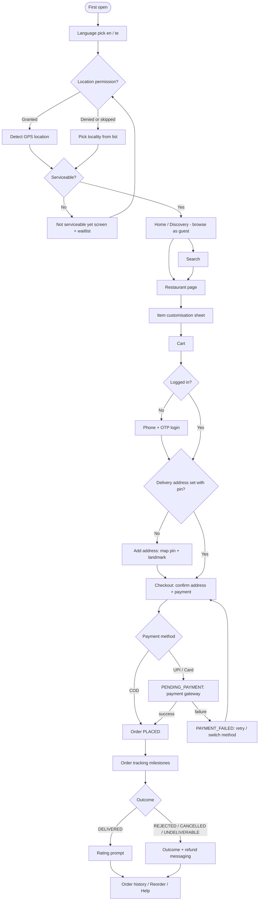
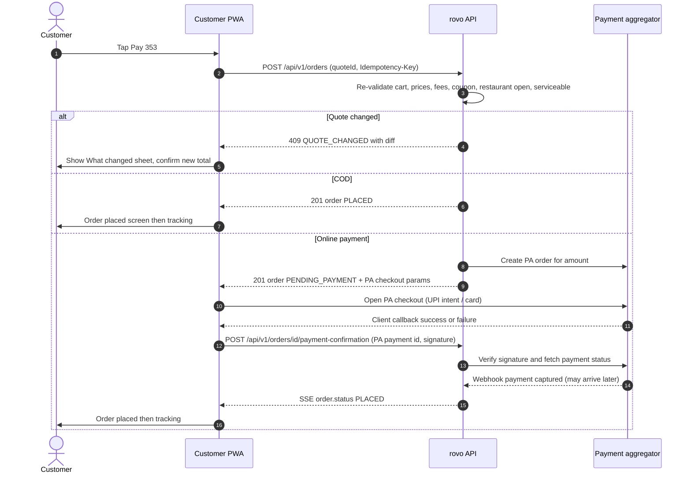
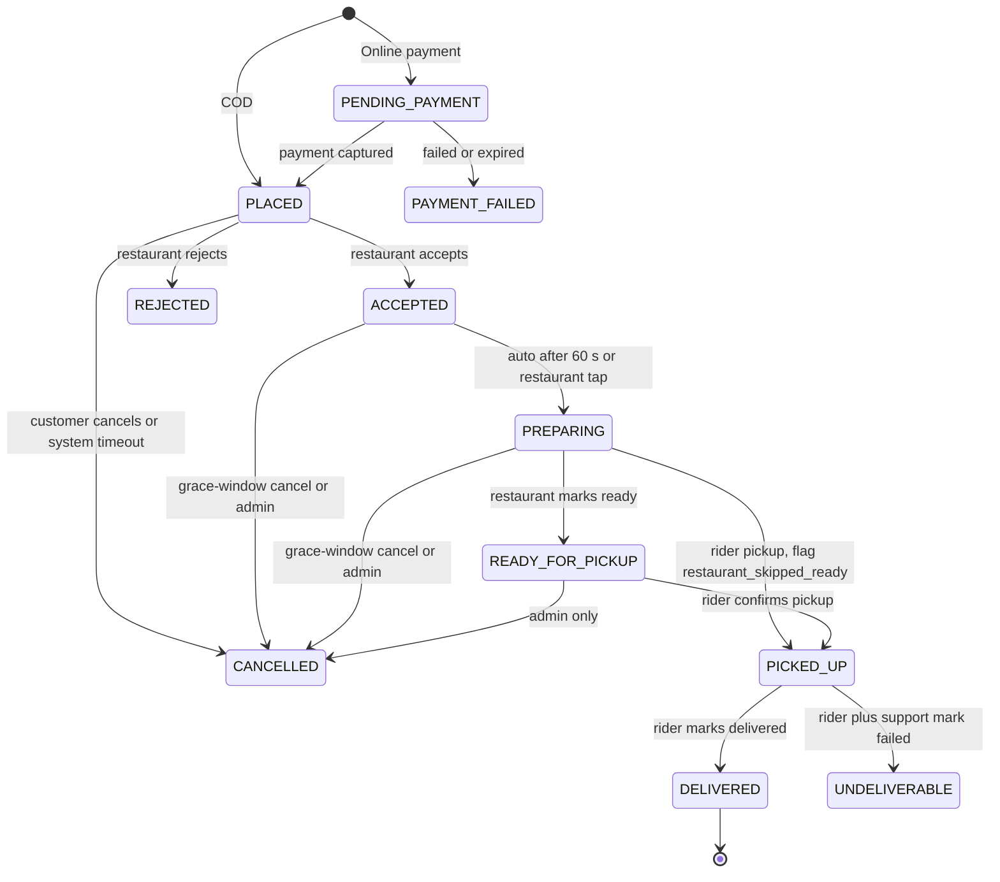
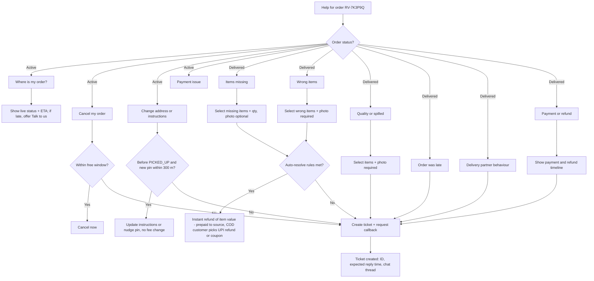

# 04 — Customer Journey (End-to-End UX)

| Field | Value |
|---|---|
| **Purpose** | Defines the full customer experience of the `customer` app (React SPA/PWA). It covers everything from first open to rating, reorder and support. It also fixes the UX principles shared by all rovo apps. |
| **Owner** | UX Architect |
| **Status** | Draft v1.1 — reconciled with review (31) and rulings R1–R48, 2026-10-04 |
| **Depends on** | `00-planning-baseline.md` (vocabulary, statuses, commercial defaults) · `01-product-requirements.md` / `02-v1-scope.md` (scope) · `03-user-personas.md` · `13-order-state-machine.md` (transition rules) · `14-payment-architecture.md` (payment/refund behaviour) · `15-notification-architecture.md` (channels) · `16-delivery-zone-architecture.md` (serviceability) · `17-frontend-architecture.md` / `18-mobile-pwa-strategy.md` (implementation constraints) |
| **Consumed by** | Frontend Architect (screens and states), Backend Architect (API and real-time needs, see §14), QA Architect (journey tests), Release Architect (backlog) |

**Changes in v1.1**
- Restaurant non-response per **R1** (E6, §9.2, §10): "taking longer" at 90 s, `CANCELLED` by `SYSTEM` with `RESTAURANT_UNRESPONSIVE` at 180 s; grace cancel per **R2**; auto-preparing and implicit-ready per **R3/R4** (§9.3).
- No server cart / guest-cart merge (**R12**, §6.2); quote and order endpoints under `/api/v1` with `quoteId` (§8.3, §17).
- Address: landmark + pin required, building/street optional, **no "Skip map" pinless path** (**R13**, §8.1, C-12).
- SSE: single stream, 20 s heartbeat (**R52**), no `Last-Event-ID` replay — refetch snapshot on reconnect (**R10**, §1.5, E11, §17).
- Bill example reworked to **R8** (GST on food as its own line, GST-inclusive fees, whole-rupee To pay with round-off line); COD caps per **R6**; COD compensation is the customer's choice of manual UPI refund or coupon (**R29**, §13.2, §17); 2 customer-fault COD failures → COD disabled (**R5**).
- Delivery OTP for prepaid ≥ ₹300 (**R39**); customer↔rider call window from `PICKED_UP` (01 BR-CONT-001, RV-035); "New" rating threshold per 01; Telugu names via `*_i18n` (**R17**); romanisation search deferred (C17); review moderation queue cut (C14); static-QR at door cut (C19); WhatsApp deferred (C2).
- Added: staffed support phone line (M9) and ops-assisted phone ordering (M8, §13.5); combined consent + 18+ screen and at-risk-only bot challenge (RV-057/034); reopen pending payment on app start (RV-060). Four apps per **R14**.

Tags used: `[ASSUMPTION]` = believed true, needs validation · `[OPEN]` = decision pending · `[LEGAL]` = needs legal/tax review before launch.

This document uses the canonical order statuses (`PENDING_PAYMENT`, `PLACED`, `ACCEPTED`, `PREPARING`, `READY_FOR_PICKUP`, `PICKED_UP`, `DELIVERED`, `PAYMENT_FAILED`, `REJECTED`, `CANCELLED`, `UNDELIVERABLE`) and delivery statuses (`UNASSIGNED`, `OFFERED`, `ASSIGNED`, `AT_RESTAURANT`, `PICKED_UP`, `AT_DROP`, `DELIVERED`, `FAILED`, `CANCELLED`) exactly as given in the baseline.

---

## 1. UX principles (apply to all rovo apps: customer, restaurant, rider, admin — R14)

These principles are written once here. Docs 05, 06 and 07 refer back to them.

### 1.1 Mobile-first at 360 px
- Every customer, restaurant and rider screen is designed at **360 × 640 CSS px** first. This is the common viewport of low-cost Android phones in the launch market `[ASSUMPTION]`. Layouts then scale up to 412 px phones, 768 px tablets (restaurant counter devices) and 1280 px+ desktops (admin console).
- No horizontal page scroll at 360 px. Horizontal carousels are allowed only for chips and cards, and must show a visible peek of the next card.
- One primary action per screen. It sits in a **sticky bottom bar** inside the thumb zone and respects `env(safe-area-inset-bottom)`.
- Touch targets are **at least 48 × 48 px** for primary actions and at least 44 × 44 px elsewhere, with at least 8 px between targets. This is stricter than WCAG 2.2 SC 2.5.8, which asks for 24 × 24 px.
- Text inputs use the right `inputmode` / `autocomplete` (`tel`, `numeric`, `one-time-code`, `postal-code`) so Android shows the right keyboard and offers autofill.

### 1.2 Low bandwidth and low-end devices
- **Skeleton screens**, never blank spinners, for lists, the restaurant page and order tracking. The skeleton has the same shape as the content so the layout does not shift (CLS ≈ 0).
- **Image discipline:** the server returns several image sizes (e.g. 160 / 320 / 640 px wide, WebP with JPEG fallback). Clients use `srcset` + `sizes`, `loading="lazy"` below the fold, fixed aspect-ratio boxes and a dominant-colour or tiny blurred placeholder. Menu item images are optional; an item card without an image must still look complete.
- **Lite mode:** automatically on when `navigator.connection.saveData` is true or `effectiveType` is `2g`/`slow-2g`, and can be switched on manually in Profile. In lite mode, images load only on tap, offer banners become text cards, and polling intervals get longer. `[ASSUMPTION]` Network Information API is available on Android Chrome but not on Safari/Firefox, so the manual toggle is required.
- Offer carousel uses **text-and-colour cards** by default, not heavy banner images. Images are an optional enhancement.
- Performance budget is owned by Frontend (doc 17). UX asks for: interactive home within **5 s on a mid-range Android over "Fast 3G"**, and a fixed menu page header even while the menu is still loading.

### 1.3 Telugu typography and bilingual content
- Font stack: **Noto Sans Telugu** for Telugu script and **Noto Sans** (or system UI) for Latin. Fonts are self-hosted and subset (Telugu + Latin + ₹), use `font-display: swap`, and are preloaded only when the active locale is `te`.
- Telugu glyphs with vowel signs and conjuncts are taller. Use **line-height ≥ 1.6** for Telugu body text (1.4 for Latin). Body text is **≥ 16 px**, and never below 14 px even for captions.
- Plan for **30–40 % text expansion** in Telugu. Buttons wrap to two lines instead of truncating. Never use CSS ellipsis in the middle of a Telugu word, because it can split a grapheme cluster. Use `Intl.Segmenter` where truncation is unavoidable.
- No all-caps styling, since it has no meaning in Telugu, and no letter-spacing on Telugu text.
- **Colloquial Telugu with common English loanwords** (e.g. "ఆర్డర్", "డెలివరీ", "రెడీ") is preferred over formal Sanskritised vocabulary, because it is what users actually read. All Telugu copy is reviewed by a native speaker from the region before launch `[ASSUMPTION]`.
- Numbers and currency use `Intl.NumberFormat('en-IN' | 'te-IN', { style: 'currency', currency: 'INR' })`. Digits stay Western Arabic (0–9) in both locales, as is common in Telangana `[ASSUMPTION]`.
- User-generated names (restaurant and dish) show the Telugu name (`nameI18n.te`; the API also returns a resolved `displayName` per `Accept-Language`, R17) when locale is `te` and it exists, otherwise `name` (English). When both exist on a dish card, show the secondary name small underneath ("Chicken Biryani / చికెన్ బిర్యానీ"), because users search in both scripts.

### 1.4 Accessibility — WCAG 2.2 AA
- Colour contrast ≥ 4.5:1 for text and ≥ 3:1 for UI components and focus rings, in both light and dark themes.
- **Veg / non-veg markers never rely on colour alone.** They follow the FSSAI shape convention: veg = green square outline with a filled green **circle**; non-veg = brown square outline with a filled brown **triangle**. The FSS (Labelling and Display) Regulations, 2020 changed the non-veg symbol to a triangle so colour-blind users can tell them apart by shape. Each marker also has an accessible name ("Vegetarian" / "Non-vegetarian").
- SC 2.5.7 Dragging Movements: every swipe interaction (e.g. "slide to confirm") also has a **tap + confirm** alternative.
- SC 2.4.11 Focus Not Obscured: sticky cart bars and bottom sheets must not cover the focused element. Scroll-padding is set to match the sticky bar height.
- SC 3.3.7 Redundant Entry: saved addresses, the phone number and the last payment method are pre-filled.
- SC 3.3.8 Accessible Authentication: OTP fields allow paste and support WebOTP / `autocomplete="one-time-code"` autofill. No CAPTCHA puzzles in V1; the bot challenge runs invisibly and only when risk rules trigger (RV-034, doc 12).
- SC 3.2.6 Consistent Help: the "Help" entry point is in the same place on every order-related screen.
- Live status changes on the tracking screen are announced through an `aria-live="polite"` region. Timers do not announce every tick.
- Respect `prefers-reduced-motion`: no confetti or rider animations in that mode.
- Screen-reader smoke test on Android TalkBack is part of QA (doc 20).

### 1.5 Offline and poor-network messaging
- A global **connection banner**: "You're offline. We'll retry when you're back." It appears after more than 3 s offline, and on reconnect shows "Back online" for 2 s.
- Every write action (add address, apply coupon, place order, cancel, rate) shows an **inline pending state** and is **idempotent** (the client sends an `Idempotency-Key`). If the network fails, the button becomes "Retry" and **never** creates a duplicate order or payment.
- The PWA shell, the last viewed home list, active-order details and order history are cached for **read-only offline viewing**, with a "Last updated 2 min ago" timestamp.
- Real-time status uses the single SSE stream `GET /api/v1/stream` (heartbeat every 20 s, R10). When SSE drops, the client falls back to **polling every 15 s** (30 s in lite mode), reconnects with jitter, and on reconnect **refetches the order snapshot** (there is no server replay / `Last-Event-ID`; REST is the source of truth). The user sees only "Updating…", never a technical error.
- Error copy explains what happened, what it means for their money, and what to do next. Example: "Payment not confirmed yet. No double charge will happen. We'll update you in 2 min."

### 1.6 Fee transparency (non-negotiable) `[LEGAL]`
- The Central Consumer Protection Authority's **Guidelines for Prevention and Regulation of Dark Patterns, 2023** prohibit *drip pricing*, meaning price components that are not revealed upfront or are revealed only after purchase is confirmed. They also prohibit *basket sneaking*, meaning items or charges added at checkout without consent. rovo therefore:
  - Discloses the **delivery fee for this address** and "packaging charges may apply" **on the restaurant page**, before anything is added to the cart.
  - Shows the full **bill breakdown** in the cart (§7.3). Nothing new appears between cart and payment.
  - Never pre-selects tips, donations or add-ons.
  - Charges **exactly** the amount the user confirmed. Any server-side change triggers a re-confirmation (§8.4).
- The cancellation and refund policy is visible before order placement (Consumer Protection (E-Commerce) Rules, 2020) `[LEGAL]`.
- Strikethrough "original" prices only when that price was actually charged recently `[LEGAL]`.

### 1.7 Tone and trust
- Short, plain sentences in both languages. Money and time are always concrete ("₹40 refund to your UPI", "in about 25–35 min").
- ETAs are always shown as a **range**. Clock times are 12-hour format with "am/pm" in English and the Telugu equivalent in `te`.

---

## 2. Journey overview

**Key principle — login is deferred.** A guest can open the app, set a location, browse, search, customise items and build a cart **without logging in**. Login (phone + OTP) is requested only when the guest taps **"Proceed to checkout"**, or when they open Orders, Profile or Help, which need identity. The guest cart is kept on the device and merged into the account after login (§6.2).

---

## 3. First open

### 3.1 Language pick (C-01)
- A full-screen, bilingual choice on first launch: **"English"** and **"తెలుగు"** as two large cards. Each card shows its own name in its own script, plus a one-line sample ("Order food from local restaurants" / "లోకల్ రెస్టారెంట్ల నుంచి ఫుడ్ ఆర్డర్ చేయండి" `[ASSUMPTION — native review]`).
- Pre-highlighted based on `navigator.languages` (`te*` → Telugu, otherwise English), but **always shown once** because many Telugu speakers run their phone in English.
- Choice is stored on the device and, after login, in the profile. It can be changed anytime in Profile → Language. Switching applies immediately, with no reload of data.

### 3.2 Location (C-02, C-03)
1. **Pre-permission explainer** (C-02): "rovo needs your location to show restaurants that deliver to you." Primary button: **"Use my current location"**. Secondary: **"Choose area manually"**.
   - The browser permission prompt is triggered only after the user taps the primary button. A cold prompt on load is never shown.
2. **If granted:** call `getCurrentPosition` with `enableHighAccuracy: true` and a 10 s timeout. If accuracy is worse than 500 m, show "Location looks approximate" and ask the user to confirm on the map.
3. **If denied, timed out or skipped → manual pick (C-03):** a searchable list of **localities** (from the `locality` table), in English and Telugu, grouped A–Z, with popular localities at the top (e.g. "New Town", "Padmavathi Colony" `[ASSUMPTION — seed list from ops]`). After choosing a locality, the user lands on Home using the **locality centroid** for serviceability. A precise pin is collected later, at address time.
4. If the permission is permanently denied, the "Use my current location" button shows short instructions for re-enabling it in Chrome site settings, with an illustration.

### 3.3 Serviceability check
- Server call: `point → {serviceable, zone_id, city_id, locality_id?, message}`.
- **Serviceable** = the point is inside an active zone. Restaurant-level reachability (each restaurant's max radius, default 7 km) is evaluated per listing (§4.4).
- **Zone paused** (ops paused the zone, e.g. heavy rain): "Deliveries in your area are paused right now. We'll be back soon." Users can still browse restaurant pages, but add-to-cart is disabled. This is a distinct copy from "not serviceable".
- **All restaurants closed** (e.g. 2 am): "Restaurants near you are closed now. Most open by 7 am." `[ASSUMPTION]` Closed restaurants appear below a "Closed now" divider with their opening times.

### 3.4 "Not serviceable yet" state + waitlist (C-04)
- Headline: "We're not in {locality or 'this area'} yet". Supporting text: "rovo currently delivers in parts of Mahabubnagar." A small static image shows the covered area. It is a static image, not an interactive map, to save bandwidth.
- Actions:
  - **"Try another location"** (primary) → back to location choice.
  - **"Notify me when you arrive"** → phone number field + **unticked** consent checkbox: "I agree to receive one SMS when rovo starts delivering here" `[LEGAL — DPDP: specific, purpose-limited consent; retention: delete after launch-in-area or 12 months]`. On submit: "Thanks! We'll text you once." Waitlist rows are counted by lat/lng and locality so ops can plan expansion.
- No login is needed for the waitlist.

---

## 4. Home / discovery (C-05)

### 4.1 Layout (top → bottom at 360 px)
1. **Header:** delivery location chip ("Deliver to ▾ Home · Bandameedipally" or the locality name), and a profile avatar icon. Tapping the chip opens the address switcher sheet.
2. **Search bar** (tap → C-06), with placeholder that rotates through examples such as "Search 'biryani' or 'బిర్యానీ'".
3. **Active order banner** (only when an order is in a non-terminal status): "Your order from Hotel X is being prepared · Track". Persistent and high priority.
4. **Veg only toggle** (global, sticky with the filter row). When on, it hides non-veg items everywhere and hides restaurants with no veg items. The choice is remembered on the device and in the profile.
5. **Offers carousel:** platform and restaurant offers as text cards ("50% off up to ₹100 · code WELCOME50"). Each tap goes to the relevant restaurant list or restaurant.
6. **Category / cuisine row:** circular chips with small icons — Biryani, Meals/Thali, Tiffins (idli/dosa), Chinese, Pizza, Burgers, Sweets, Cakes, Juices… The list is driven by ops-curated cuisines with Telugu names.
7. **Sort + filter row** (sticky on scroll): `Sort ▾` · `Rating 4.0+` · `Fast delivery (≤ 30 min)` · `Offers` · `Pure veg` · `Cost for two ▾` · `Cuisines ▾`.
8. **Restaurant list** (infinite scroll, 10 per page). Each card shows: cover image (16:9, lazy), name (+ secondary-script name), cuisines, rating with count ("4.2 ★ (120+)" or **"New"** if fewer than 5 ratings, per 01 BR-RATE-002), ETA range ("25–35 min"), distance ("2.1 km"), cost for two, the best offer line, a "Pure veg" badge, and a status overlay when closed or paused.

### 4.2 Sort options
| Sort | Rule (server-side) |
|---|---|
| Relevance (default) | Open first → serviceable → distance/ETA blend → rating. Ops can pin up to N "featured" restaurants, which carry a visible "Featured" label `[LEGAL — disclose paid placement if it is ever paid]`. |
| Rating | Bayesian-adjusted rating (prevents a 5.0 from 2 ratings ranking first). |
| Delivery time | Lowest estimated ETA. |
| Cost: low → high / high → low | `cost_for_two_paise`. |

### 4.3 Filters
Rating 4.0+, delivery time ≤ 30 min, has offers, pure veg, cost-for-two bands (< ₹200, ₹200–400, > ₹400), cuisines (multi-select). Applied filters show as removable chips with a "Clear all" action. **Empty result state:** "No restaurants match these filters" with a "Clear filters" button.

### 4.4 Restaurant availability states in lists
| State | Presentation | Can open menu? | Can add to cart? |
|---|---|---|---|
| Open | Normal | Yes | Yes |
| Paused ("busy") | Greyscale image, label "Not accepting orders · back in ~20 min" | Yes | No |
| Closed (outside hours) | Under the "Closed now" divider, label "Opens at 7:00 pm" or "Opens tomorrow 11:00 am" | Yes | No (scheduled orders deferred) |
| Out of delivery radius for this address | Hidden on home. In search: greyed, "Doesn't deliver to your location" | Yes (read-only) | No |
| Suspended / not live | Hidden everywhere | — | — |

---

## 5. Search (C-06)

### 5.1 Behaviour
- Opens with **recent searches** (stored on device, max 8, each removable) and **popular searches** in the user's zone (from the server).
- Query starts at 2 characters with a 300 ms debounce. Results come back in two tabs/sections: **Restaurants** and **Dishes**. A dish result shows the dish, its restaurant, price and veg marker. Tapping it opens the restaurant page scrolled to that item, with the item highlighted.
- Search respects the Veg only toggle and serviceability. Unserviceable restaurants appear greyed at the bottom of the results, not hidden, because the user explicitly searched for them.

### 5.2 Telugu and transliteration
Users will type in at least three ways: English ("chicken biryani"), romanised Telugu or spelling variants ("biriyani", "biryani", "pulihora", "pulihoura"), and Telugu script ("బిర్యానీ"). V1 approach (no ML):
1. Index the English and Telugu names (`name_i18n`), cuisine names (en + te) and a **curated synonym / transliteration table** managed by ops. Examples: `biryani ↔ biriyani ↔ briyani ↔ బిర్యానీ`, `dosa ↔ dosai ↔ దోస`, `pesarattu ↔ పెసరట్టు`, `chicken 65`.
2. Use fuzzy matching (Postgres `pg_trgm` similarity) on normalised Latin text: lowercased, diacritics removed, repeated letters collapsed.
3. For Telugu-script queries, match the Telugu name directly and use the curated synonym table to reach English-only menus. **Automatic romanisation of Telugu names is deferred to V1.1** (C17, 01 CUS-SRCH-006). The UX requirement stands: "biriyani", "biryani" and "బిర్యానీ" return the same results for seeded dishes.
4. **No-results state:** "No results for 'xyz'". Show suggestions ("Did you mean biryani?") when a trigram match exists, then popular cuisines. Log zero-result queries for ops to add synonyms (feedback loop).
- Voice search is deferred (Web Speech API support for Telugu is inconsistent) `[ASSUMPTION]`.

---

## 6. Login (deferred) and profile

### 6.1 Phone + OTP (C-08, C-09)
- Triggered by: Proceed to checkout, Orders, Profile, Help, or Waitlist (which only needs the phone number — no OTP).
- **C-08 Phone entry:** "+91" fixed prefix with a 10-digit numeric input. Validation: an Indian mobile number starting with 6–9, with an inline error message. Below it: "By continuing, you agree to the Terms and Privacy Policy" (links) `[LEGAL — DPDP notice must be linked and available in Telugu]`.
- **C-09 OTP:** 6-digit input (`autocomplete="one-time-code"`). On Android Chrome, the **WebOTP API** auto-reads the code if the SMS has the domain-bound format for the customer host (`@app.rovo.example #123456`, R14; DLT template design in doc 15) — a requirement for Notification/Backend. Paste is allowed. "Resend OTP" unlocks after 30 s; resend/attempt limits are owned by doc 12 §2.2 and shown as plain messages ("Try again in 10 minutes."). "Edit number" link. Wrong OTP → shake + "Incorrect code, 2 attempts left."
- **First-time users:** one extra field, **"Your name"** (needed for the rider and the restaurant), on **one combined screen** with the privacy notice summary, the 18+ declaration and the separate unticked marketing opt-in (01 CUS-AUTH-003, RV-057). Email is optional and is collected later in Profile. No password.
- After login, the user returns to exactly where they were (checkout), with the cart intact.

### 6.2 Guest cart merge
- The cart lives **only on the device** (single restaurant); there is no server-side cart (R12), so there is nothing to merge. After login the device cart is kept as is and re-quoted (`POST /api/v1/cart/quote`) before checkout.

### 6.3 Profile (C-20)
Name, phone (change requires OTP on the new number), email (optional), language, Veg only default, saved addresses, lite mode, notification preferences, "Help & support", "Privacy: download my data / delete my account" `[LEGAL — DPDP data principal rights; deletion must keep financial records for statutory retention]`, Terms, Privacy, Grievance officer contact `[LEGAL — Consumer Protection (E-Commerce) Rules 2020 require grievance officer details]`, app version, and logout.

---

## 7. Restaurant page, customisation, cart

### 7.1 Restaurant page (C-07)
- **Header:** name (+ secondary script), cuisines, locality, rating ("4.2 ★ · 1.2k ratings" or "New"), **ETA range for the current address**, distance, **"Delivery fee ₹30 for your address"** and "Packaging charges may apply" (fee disclosure, §1.6), "Pure veg" badge, FSSAI licence number (in an "About / Info" expandable section) `[LEGAL — FSSAI requires display of licence number on e-commerce platforms]`, and opening hours.
- **State banners:**
  - Closed: "Closed now · Opens at 7:00 pm". Menu stays visible and "Add" buttons are disabled with an accessible reason.
  - Paused: "Not accepting orders right now. Try again in ~20 min." The menu is viewable.
  - Item-level: an unavailable item shows "Out of stock" (or "Available from 12:00 pm" if a time slot is set), greyed, with "Add" disabled. Unavailable items sort to the bottom of their category.
- **Restaurant offers strip** (e.g. "20% off up to ₹60 above ₹249").
- **Menu:** a sticky category tab bar (horizontal scroll) plus a floating "Menu" button that opens a category jump list with item counts. Per-page Veg only toggle (inherits the global setting). Search within the menu.
- **Item card:** veg marker, name (+ secondary), price (or "from ₹120" when variants exist), short description (2 lines, expandable), optional image (right side, 88 px), a "Bestseller" tag (rule-based, top-N by orders), a "Customisable" hint, and an **"Add"** button that becomes a `− qty +` stepper.
- **Sticky cart bar** (once the cart has items from this restaurant): "2 items · ₹358 | View cart →".

### 7.2 Item customisation sheet (C-07a)
A bottom sheet that opens when an item has variants or add-on groups.
- **Variant group** (e.g. Size: Half / Full): radio buttons, **required**, with the price shown on each option. The default selection is the cheapest option `[OPEN — or no default + required]`. Recommendation: **no default** for size, to avoid basket sneaking at a higher price; the CTA stays disabled until a size is chosen.
- **Add-on groups** each have `min` and `max` (e.g. "Choose up to 2 extras", "Choose 1 gravy (required)"):
  - `max = 1` → radio. `max > 1` → checkboxes; when `max` is reached, the rest become disabled with "Max 2 selected".
  - `min ≥ 1` → the group header shows "Required" and an inline error appears if the user tries to submit without it: "Select at least 1".
  - Each option shows its price delta ("+ ₹20") and veg marker. A non-veg add-on on a veg item is allowed but clearly marked.
- **Special instructions are deferred** at item level (abuse and restaurant-literacy concerns). There is one order-level note to the restaurant at checkout, max 100 characters.
- **Sticky CTA:** "Add item · ₹240" — the price updates live. A quantity stepper sits inside the sheet.
- **Repeat customisation:** tapping "+" on an already customised item opens a small dialog: "Repeat last: Full, Extra raita" **[Repeat]** / **[I'll choose]**.
- Loading state: the sheet skeleton. Error: "Couldn't load options. Retry".

### 7.3 Cart (C-10)

**Single-restaurant rule.** A cart holds items from exactly one restaurant. If the user adds an item from a different restaurant, a **replace-cart dialog** appears:
> **Replace cart items?**
> Your cart has items from *Hotel A*. Do you want to discard them and add items from *Hotel B*?
> **[No]** **[Replace]**
- Focus starts on **No** (the safe default). "Replace" empties the cart and adds the new item. Any applied coupon is cleared, with a toast message.

**Layout:**
1. Restaurant name and ETA for the selected address.
2. Line items: veg marker, name, customisation summary ("Full · Extra raita"), "Edit" link (re-opens the sheet), `− qty +` stepper, line price. Quantity 0 removes the item, with an "Undo" snackbar for 5 s.
3. "Add more items" link → back to the restaurant page.
4. **Note to restaurant** (optional, 100 characters, e.g. "less spicy").
5. **Offers:** "Apply coupon" row → coupon sheet (C-10a) listing applicable coupons, with the reason each inapplicable one fails ("Add ₹51 more to unlock"), plus a manual code field. A successful apply shows a ✓ toast: "WELCOME50 applied · You save ₹100". An invalid code shows an inline error with the specific reason (expired, minimum order not met, not valid for this restaurant, usage limit reached, new users only).
6. **Delivery address** summary (or "Add address" if none) and **delivery instructions** (shown after an address is chosen; also editable at checkout).
7. **Bill details** (always visible, not collapsed):

| Line | Example | Notes |
|---|---|---|
| Item total | ₹378.00 | Sum of line prices (incl. variant/add-on deltas). Menu prices exclude GST (R8). |
| Packaging charges | ₹20.00 | Restaurant-set, per item or per order. Shown only if > 0. ⓘ "Set by the restaurant". |
| Delivery fee | ₹30.00 | ⓘ "2–4 km from restaurant". Shows ~~₹30~~ **FREE** only when a free-delivery campaign or coupon applies. |
| Platform fee | ₹5.00 | ⓘ "Helps us run rovo". |
| Small cart fee | — | Not applied in this example. Shown only if item total is below ₹149: ⓘ "Add ₹12 more to avoid this fee" with a link back to the menu. |
| GST on food & packaging (5%) | ₹19.90 | Own line (R8, 01 BR-FEE-007/008); ⓘ "Restaurant service via e-commerce operator, CGST §9(5)". Delivery, platform and small-cart fees are **GST-inclusive** by default; the ⓘ on each fee shows the GST it contains. Fee-GST presentation is configurable pending CA advice; rates come from config — never hard-coded `[LEGAL — verify current rates; local delivery via ECO notified under §9(5) at 18 % from 22-Sep-2025 per GST Council 56th meeting reporting, see Sources]`. |
| Discount (coupon) | −₹100.00 | Green, with the coupon code. |
| Round off | +₹0.10 | Always shown when non-zero: To pay is rounded to the whole rupee (R8, 01 BR-FEE-009). |
| **To pay** | **₹353.00** | Bold. ₹378 + ₹20 + ₹19.90 + ₹30 + ₹5 − ₹100 + ₹0.10. The same number appears on the checkout CTA and the payment sheet. |

- **"You save ₹100 on this order"** banner when discounts apply.
- **Cancellation policy** short text with a link (§10).
- **Sticky CTA:** "Proceed to checkout · ₹353". If the user is not logged in, this starts login (§6.1) and then returns here.

**Empty cart (C-10, empty):** "Your cart is empty" with a "Browse restaurants" button.

**Cart revalidation:** every time the cart is opened (and at checkout), the server re-quotes it. Items that became unavailable are flagged inline ("Out of stock — remove to continue"). Price changes are highlighted (§8.4).

---

## 8. Checkout and payment

### 8.1 Address add / select (C-11, C-12)
**Select (C-11):** a list of saved addresses (label icon, first line, landmark). Unserviceable ones are shown disabled with "Doesn't deliver here for {Restaurant}". "+ Add new address".

**Add new address (C-12) — pin first, then details:**
1. **Map step:** MapLibre map with a **fixed centre pin**; the user drags the map, not the pin. It starts at the GPS fix, or at the locality centroid if GPS is unavailable. A "Use current location" button recentres it. Hint: "Move the map to place the pin on your doorstep." The locality is derived from the pin server-side (PostGIS, no paid reverse geocoding) and shown as "Area: Shasabgutta ✓" with a change option.
   - Out-of-zone pin → inline "We don't deliver to this pin yet", and the confirm button is disabled.
   - Pin more than 1 km from the current GPS fix while the user chooses label "Home" → soft warning: "This pin is far from where you are. Is it correct?" (not blocking).
   - Low-bandwidth fallback (R13 — **no pinless addresses**): if map tiles fail to load within 8 s, offer **"Use my current location as the pin"** (GPS fix, accuracy shown) or a lightweight fallback that places the pin on a static locality image. A locality centroid alone is never saved as a delivery pin.
2. **Details step:**
   - House / flat no. *(required)*
   - Building / street *(optional, R13)*
   - **Landmark** *(required, R13, with helper "e.g. Opp. Clock Tower, near SBI ATM")* — Indian addressing relies on landmarks.
   - Locality *(prefilled from pin, editable from list)*
   - PIN code *(prefilled from locality, 6 digits, editable)*
   - Label: Home / Work / Other (+ name)
   - Receiver name and phone (prefilled with the user's own; "Ordering for someone else?" toggle)
   - Delivery instructions *(optional, 100 chars, e.g. "2nd floor, ring bell twice")*
3. **Save** → back to checkout. Fees and ETA are re-quoted for the new pin.

### 8.2 Checkout screen (C-13)
Sections:
1. **Deliver to:** selected address card with a "Change" option. ETA range.
2. **Bill summary** (collapsed to "To pay ₹353 ▾", expandable to the full breakdown from §7.3).
3. **Payment method** (radio list):
   - **UPI** (recommended; top) — handed off to the payment aggregator's (PA) checkout. On Android the PA typically shows UPI intent apps (PhonePe / GPay / Paytm) and UPI collect / QR `[ASSUMPTION — depends on PA, doc 14]`.
   - **Cards / Netbanking** — PA checkout.
   - **Cash on Delivery** — hidden or disabled with a reason when not eligible:
     - order total above the COD limit (R6: ₹1,000 per order, ₹600 on a first order; `cod_max_order_paise`, doc 10): "Cash not available above ₹1,000"
     - the user has COD disabled after 2 customer-fault COD failures (R5): "Cash on delivery unavailable for your account. Pay online."
     - the restaurant or zone has COD disabled
   - The last used method is pre-selected (SC 3.3.7). **COD is never pre-selected for a first order** `[OPEN — product]`.
4. **Cancellation policy** line (§10), always visible above the CTA.
5. **Sticky CTA:** "Pay ₹353" (online) or "Place order · ₹353 (Cash)".

### 8.3 Place order and payment sequence

**Rules:**
- The client **never** decides that an order is paid. It shows "Confirming payment…" until the server moves the order to `PLACED`.
- Backend requirement: on a client callback, the server **verifies with the PA API immediately** and does not wait for the webhook. The webhook is the backstop. Whichever arrives first wins, idempotently.

### 8.4 Price-change handling (C-13b "What changed" sheet)
Triggered by `409 QUOTE_CHANGED` at place-order, or by revalidation when the cart is opened.
> **A few things changed**
> • Chicken Biryani (Full): ₹220 → ₹240
> • Gulab Jamun is now out of stock — removed
> • Delivery fee: ₹30 → ₹40 (new address is 4.3 km away)
> • Coupon SAVE20 no longer applies (minimum ₹299 not met)
> **New total: ₹381** (was ₹353)
> **[Review cart]** **[Confirm & pay ₹381]**
- The user must confirm explicitly before any amount is charged. **No silent increases.** A decrease is applied automatically with an info toast.

### 8.5 Payment failure and retry (C-14)
- **`PAYMENT_FAILED`** (or the user dismissed the PA sheet): "Payment didn't go through. No money was taken. If money was debited, it will be refunded automatically within 5–7 working days `[ASSUMPTION — confirm PA timelines, doc 14]`."
  - Actions: **[Retry payment]** (same method), **[Choose another method]**, **[Pay with cash instead]** (if COD eligible; converts the same cart into a COD order through a new order request).
- The cart is **preserved** after a failure. The user can return to it.
- **App restart during payment** (low-RAM phones often kill the tab after the UPI app returns): on start, any own order in `PENDING_PAYMENT` younger than the payment timeout opens C-14 automatically (RV-060).
- `PENDING_PAYMENT` expires after the payment timeout (15 min default; `payments.pending_timeout_s`, doc 13 T-PAY) → `PAYMENT_FAILED` (system). If a payment for that PA order later succeeds, it is **auto-refunded**, and the user gets "We received ₹353 after your order expired. Refund started" (push + in-app + SMS).

### 8.6 Order placed confirmation (C-15)
- A short success moment (static ✓ icon; no animation in reduced-motion mode): "Order placed! RV-7K3P9Q". It auto-advances to tracking after 2 s, or on tap.
- **Contextual push permission ask** (only here, first order only): "Get live updates when your food is on the way" **[Turn on updates]** / **[Not now]**. The browser prompt appears only after the user taps "Turn on". On iOS, Web Push works only for PWAs installed to the Home Screen (iOS 16.4+), so on iOS this card instead says "Add rovo to Home Screen for updates" with instructions `[ASSUMPTION — small iOS share in market]`.
- **PWA install prompt:** shown after the **first delivered order**, not before (`beforeinstallprompt` is deferred until then).

---

## 9. Order tracking (C-16)

### 9.1 Layout
- **Top:** status headline (large), sub-text, **ETA range** ("Arriving in 18–25 min" or "Arriving by 8:40–8:50 pm"), and a **progress stepper** with 4 visible milestones: *Order placed → Preparing → On the way → Delivered*.
- **No live map in V1** (baseline P12). Instead, a simple static illustration for the current milestone (an SVG under 5 KB, no external tiles).
- **Delivery partner card** (from `ASSIGNED` onward): first name, photo, vehicle type and the last 4 characters of the plate ("Bike · …4521"), rating hidden. The **[Call]** button (`tel:`) appears only from `PICKED_UP` until `DELIVERED` + 15 min (01 BR-CONT-001; privacy notes in doc 06 §9).
- **Order details:** restaurant name, items (collapsible), bill (collapsible), payment method ("Paid via UPI" / "Pay ₹353 cash on delivery"), and delivery address with instructions.
- **Drop OTP card** (only when the drop OTP is required — prepaid orders with To pay ≥ ₹300, R39 — from `PICKED_UP`): "Share this code with your delivery partner: **4 8 2 1**".
- **Help** button (top right, consistent placement) and **Cancel order** (only while allowed, §10).
- Real-time: SSE subscription to the order channel, with polling fallback (§1.5). The ETA updates only at milestones and never jumps backwards by more than 5 min without a message.

### 9.2 What the customer sees for each status combination

Customer copy is driven by **order status first**, refined by **delivery status**. Internal states that would alarm the customer without helping them (e.g. `OFFERED`) are not exposed.

| Order status | Delivery status | Stepper | Headline (en) | Sub-text / extras | Customer actions |
|---|---|---|---|---|---|
| `PENDING_PAYMENT` | (none) | — | Confirming your payment… | "This usually takes a few seconds. Don't close the app." After 60 s: "Still confirming with your bank. No double charge will happen." | Retry payment (if the PA reports failure), Help |
| `PAYMENT_FAILED` | (none) | — | Payment failed | Refund reassurance (§8.5) | Retry, Change method, Pay cash (if eligible) |
| `PLACED` | (none) | 1 active | Waiting for {Restaurant} to accept | "Restaurants usually accept within 2 minutes." From 90 s: "Taking a little longer — we're contacting the restaurant." (R1) | **Cancel (free)**, Help |
| `ACCEPTED` | `UNASSIGNED` / `OFFERED` | 2 | Order accepted! | "{Restaurant} will start preparing now." ETA appears. | Cancel (only within grace window §10), Help |
| `PREPARING` | `UNASSIGNED` / `OFFERED` | 2 | Preparing your food | "We'll assign a delivery partner soon." (If still unassigned within 5 min of the food ready time: "Finding a delivery partner nearby…") | Help |
| `PREPARING` | `ASSIGNED` | 2 | Preparing your food | "{Ravi} will pick up your order." + partner card | Help |
| `PREPARING` | `AT_RESTAURANT` | 2 | Preparing your food | "{Ravi} has reached the restaurant and is waiting for your food." | Help |
| `READY_FOR_PICKUP` | `UNASSIGNED` / `OFFERED` | 2 | Food is ready | "Assigning a delivery partner…" (ops alert raised internally) | Help |
| `READY_FOR_PICKUP` | `ASSIGNED` | 2 | Food is ready | "{Ravi} is on the way to the restaurant." | Help |
| `READY_FOR_PICKUP` | `AT_RESTAURANT` | 2 | Food is ready | "{Ravi} is picking up your order." | Help |
| `PICKED_UP` | `PICKED_UP` | 3 | On the way | ETA range. COD: "Keep ₹353 ready. Exact change helps!" Drop OTP card if required. | Call partner, Help |
| `PICKED_UP` | `AT_DROP` | 3 | {Ravi} has arrived | "Your delivery partner is at your location." COD amount repeated. Drop OTP prominent. | Call partner, Help |
| `DELIVERED` | `DELIVERED` | 4 ✓ | Delivered! Enjoy your meal | Delivered at 8:42 pm. → Rating card (§11). | Rate, Reorder, Help, View bill |
| `REJECTED` | (none / `CANCELLED`) | — | {Restaurant} couldn't accept your order | Reason in friendly form ("Some items are out of stock" / "Restaurant is too busy" / "Restaurant is closing"). Refund block (§13.3). Suggest 3 similar open restaurants. If the reason is out-of-stock: **[Reorder without unavailable items]**. | Browse similar, Reorder, Help |
| `CANCELLED` (by customer) | `CANCELLED` / none | — | Order cancelled | "You cancelled this order." Refund block if prepaid. | Reorder, Help |
| `CANCELLED` (by `SYSTEM`, reason `RESTAURANT_UNRESPONSIVE`, 180 s — R1) | none | — | Order cancelled | "{Restaurant} didn't respond in time. Sorry about that." Full refund. | Browse similar, Help |
| `CANCELLED` (by admin) | `CANCELLED` | — | Order cancelled | Admin-chosen customer-facing reason (from a reason catalog). Refund block with the amount decided. | Help |
| `UNDELIVERABLE` | `FAILED` | — | We couldn't deliver your order | Reason ("We couldn't reach you at the address"). Policy text on refund (§10). | Help |

**Lateness:** when `now > promised_eta_max + 10 min` and the order is not yet `DELIVERED`, show an apology banner ("Running late — sorry! Your food is on its way.") and pre-select "Order is late" as the first Help option. Compensation for lateness is **not** automatic in V1 `[OPEN — product/finance]`.

### 9.3 Tracking flow (customer-visible milestones)

This diagram is illustrative only; the authoritative transitions live in doc 13. The former UX asks are now rulings: **ACCEPTED → PREPARING after 60 s or on tap** (R3) and **pickup from `PREPARING` with `restaurant_skipped_ready`** (R4); customer cancel inside the 60 s grace even after acceptance (R2).

---

## 10. Cancellation rules (UX)

| When | Who | UX | Refund |
|---|---|---|---|
| `PENDING_PAYMENT` | Customer | "Cancel" on the payment-pending screen. | Nothing captured. If a late capture happens → auto refund. |
| `PLACED` (before restaurant accepts) | Customer | **[Cancel order]** button → confirm dialog: "Cancel this order? You'll get a full refund." Reason picker (optional): changed my mind / ordered by mistake / taking too long / wrong address / other. | **Full refund** (prepaid). |
| Within **60 s grace** of placement, even if `ACCEPTED`/`PREPARING` (R2) | Customer | Same button, with a visible countdown "Free cancellation for 0:42". | Full refund. The restaurant gets a loud "CANCELLED — do not prepare" alert (doc 05). |
| After grace, `ACCEPTED` → `READY_FOR_PICKUP` | Customer cannot self-cancel | The Cancel button is replaced by "Need to cancel? Contact support". Support may cancel with fault attribution. | Per 01 BR-CAN: no refund of food value if preparation has started and the fault is the customer's; full refund when the fault is on the restaurant/rovo side `[LEGAL — policy must be shown before order placement and be fair under consumer law]`. |
| `PICKED_UP`, `AT_DROP` | — | No cancellation. Refusal at the door → `UNDELIVERABLE` (support-approved, R5). | Prepaid: no refund unless fault on the rovo side. COD: counts as a customer-fault COD failure; **2 failures → COD disabled** (R5, 01 BR-COD-004). |
| Restaurant rejects / system cancels after 180 s without response (`RESTAURANT_UNRESPONSIVE`, R1) / admin cancels | Restaurant / system / admin | Outcome screen (§9.2). | **Full automatic refund**. COD: nothing to refund. |

- The cancellation policy is shown as a one-liner at the cart and checkout ("Free cancellation until the restaurant accepts or within 60 seconds"), with a link to the full policy.

---

## 11. Delivered → rating (C-17)

**Decision:** Two **separate, independent** ratings: restaurant and delivery partner. Each can be skipped. **Review text is allowed for restaurants only**, max 500 characters. **Photos are not allowed in V1 reviews.** Reasons: moderation cost, storage and bandwidth, and personal data appearing in images. Photos **are** allowed in Help tickets, where they serve as evidence and are not public (§13).

- **Trigger points:** (1) the tracking screen turns into a rating card at `DELIVERED`; (2) a push 30 min after delivery if not rated; (3) once on the next app open, as a dismissible card at the top of Home. It is never shown again after it is dismissed twice. Ratings are accepted up to 7 days after delivery.
- **Restaurant rating:** 1–5 stars (large tap targets with text labels: Terrible, Bad, Okay, Good, Loved it). Then context tags depending on the score (≤ 3: "Cold food", "Small portion", "Poor packaging", "Not as described", "Too spicy"; ≥ 4: "Tasty", "Good portion", "Good packaging", "Value for money"). Optional text. Optional per-dish 👍/👎 for up to 5 dishes `[OPEN — nice-to-have]`.
- **Delivery partner rating:** 👍 / 👎 (simpler than stars, less noisy). 👎 tags: "Late", "Rude behaviour", "Food spilled", "Asked for extra money", "Didn't follow instructions", "Unsafe driving". 👍 tags: "Polite", "On time", "Handled food well". "Asked for extra money" and "Rude behaviour" **auto-create a support ticket** for ops review.
- **Public display:** the restaurant's average rating and count. Review texts appear after an automatic filter (profanity, phone numbers, URLs, names); ops can hide a review with a reason. There is **no moderation queue and no restaurant reply in V1** (C14). Rider ratings are **never public** and are used internally only.
- **Low rating (≤ 2):** after submit, offer "Sorry! Want to report an issue with this order?" → Help.

---

## 12. Order history and reorder (C-18, C-19)

- **C-18 Orders list:** newest first, paginated. Each card: restaurant, date/time, items summary ("Chicken Biryani × 2, Raita…"), total, status chip (Delivered / Cancelled / Refunded / In progress), **[Reorder]**, **[Rate]** (if pending). Active orders are pinned at the top with **[Track]**.
- **C-19 Order details:** full item list, bill breakdown as charged, payment method + reference, refund status timeline (if any), delivery address, delivery partner first name, **download/view invoice** `[LEGAL — tax invoice requirements under §9(5) for food; doc 14]`, Help.
- **Reorder:** adds the same items and customisations to the cart (replace-cart dialog if needed), then opens the cart with a summary toast: "Added 3 of 4 items. Paneer Tikka is unavailable. Prices updated for 1 item." **Never jump directly to payment.**
- **Empty state:** "No orders yet" with "Order your first meal" (and any first-order offer).

---

## 13. Help and support for an order (C-21)

### 13.1 Entry points
Tracking screen (top right), order details, orders list (per card), Profile → Help (general: account, payments, other).

### 13.2 Order-specific issue tree (self-serve first)

**Auto-resolve rules (V1, configurable)** `[OPEN — product/finance to set]`:
- Missing or wrong item, claim value ≤ ₹200, raised within 2 h of delivery, customer has ≤ 1 auto-refund in the last 30 days, and the account is older than 7 days or has ≥ 3 delivered orders → **instant refund of the affected items' value** (incl. their tax share) to the original payment method. For COD orders the customer **chooses** (R29): a manual UPI refund (customer enters a VPA; finance pays and records the UTR, 01 ADM-PAYO-007) **or** a single-user coupon of equal value. Never coupon-only `[LEGAL]`.
- Everything else → ticket for `ADMIN_SUPPORT` (doc 07).

### 13.3 Refund messaging (standard block)
"**₹353 refund initiated** to your {UPI / card ending 4242} on {date}. It usually reaches your account in 5–7 working days; UPI refunds are often faster. Refund ID: {PA refund id}." Plus a timeline: Initiated → Processed by rovo → Credited (when the PA reports it, if available). `[ASSUMPTION — timelines per PA]`

### 13.4 Ticket UI (C-22)
- Ticket header: ID, order, category, status (Open / Waiting for you / Resolved).
- An **async message thread** (text + up to 3 photos per message, each compressed on the device to ≤ 300 KB).
- **"Request a call back"** button for active orders. The **support phone line** (`tel:`, staffed in all service hours, Telugu and English — M9) is shown on every Help screen.
- Status labels (Open / Waiting for you / Resolved) map onto the doc 10 ticket statuses (`OPEN`, `IN_PROGRESS`, `AWAITING_REQUESTER`, `AWAITING_APPROVAL`, `RESOLVED`, `CLOSED`, `REOPENED`).
- Live chat (agent typing in real time) is deferred. The thread updates via SSE/polling.
- Expected response shown: "We usually reply within 15 min for active orders, 4 h otherwise" (SLAs in doc 07).
- After resolution: a 2-question CSAT (👍/👎 + optional text).

### 13.5 Ops-assisted phone ordering (P1, M8; 01 ADM-ORD-011)
For customers who cannot or will not use the app (persona P3):
1. The customer calls the support line. The agent finds the account by phone or creates one (customer confirms with the OTP sent to their phone, or verbal consent is recorded `[LEGAL]`).
2. The agent picks the restaurant and items in the admin console, confirms the saved address pin and landmark (or captures them with the customer), and **reads out the full bill** before placing (fee transparency, §1.6).
3. Payment is **COD only** (normal COD caps apply, R6). The order follows the normal quote/placement rules and is tagged `assisted`.
4. The customer gets an SMS with the order code and help number; if they have the app, the order also appears there for tracking.

---

## 14. Notification touchpoints

Channels: **In-app** (SSE / tracking UI, always), **Web Push** (if permission granted), **SMS** (DLT-registered templates; paid, kept minimal), **Email** (receipts only, if an email is on file; optional). WhatsApp OTP and notifications are deferred to V1.1 (C2).

| Event | In-app | Web Push | SMS | Copy (en, short) |
|---|---|---|---|---|
| OTP | — | — | ✅ (WebOTP format) | "{code} is your rovo code. Don't share it. @app.rovo.example #{code}" |
| Order placed (COD) / payment confirmed | ✅ | ✅ | ❌ | "Order placed with {Restaurant}." |
| Restaurant accepted | ✅ | ✅ | ❌ | "{Restaurant} accepted your order. Arriving 8:40–8:50 pm." |
| Delivery partner assigned | ✅ | ❌ (avoid noise) | ❌ | — |
| Picked up / on the way | ✅ | ✅ | ❌ | "{Ravi} picked up your order. Arriving in 15–20 min." |
| Arrived at drop (`AT_DROP`) | ✅ | ✅ (high priority) | ✅ only if no push permission **and** COD `[OPEN — cost]` | "Your delivery partner has arrived." |
| Rider can't find address / waiting | ✅ | ✅ | ✅ | "Your delivery partner is trying to reach you. Please answer their call." |
| Delivered | ✅ | ✅ | ❌ | "Delivered! Rate your order." |
| Rejected / cancelled by system or admin | ✅ | ✅ | ✅ (if prepaid → refund info) | "{Restaurant} couldn't accept your order. Full refund of ₹353 started." |
| Refund initiated / credited | ✅ | ✅ | ✅ (initiated only) | "₹353 refund initiated to your UPI." |
| Ticket reply | ✅ | ✅ | ❌ | "rovo support replied about order RV-7K3P9Q." |
| Rating reminder | ✅ (home card) | ✅ (once, 30 min) | ❌ | "How was your food from {Restaurant}?" |
| Marketing / offers | Home only | Only with **separate opt-in** | ❌ in V1 | `[LEGAL — DPDP + TRAI: separate consent for promotional messages]` |
| Waitlist launch | — | — | ✅ (once, consented) | "rovo now delivers in {Locality}!" |

Push payloads carry **no PII beyond first names**, plus a deep link (`/orders/{id}`). Notifications are grouped per order (`tag = order_id`) so updates replace each other instead of stacking.

---

## 15. Edge cases and resilience

| # | Situation | UX behaviour | Backend/Frontend requirement |
|---|---|---|---|
| E1 | **Network lost while tapping "Place order"** | The button shows "Placing order…". On timeout it shows "We're checking whether your order went through…". On reconnect, the client re-sends **the same request with the same Idempotency-Key** → it gets the original result (order created or not). If the user kills the app, on next open the client checks for an order created in the last 30 min with that key (or "active order" lookup) and goes straight to tracking or payment. | `POST /api/v1/orders` idempotent per key for ≥ 24 h. Client persists the key in IndexedDB until resolved. |
| E2 | **Network lost inside PA checkout** | The PA sheet handles retry. When the user returns, the app shows "Confirming payment…" and polls `GET /orders/{id}`. Never offers "Pay again" while status is `PENDING_PAYMENT` and the PA reports the payment as "processing". | Server-side PA status fetch on demand. |
| E3 | **Payment succeeded but webhook delayed** | "Payment received by your bank, confirming with rovo… (usually under 1 min)". The client callback triggers server verification (§8.3). If still unconfirmed after 3 min: "Still confirming. Your money is safe — if we can't confirm in 15 min, it'll be refunded automatically." A notification follows when it resolves either way. Restaurant does **not** see the order until `PLACED`. | Server verification on client callback; reconciliation job polls PA for `PENDING_PAYMENT` orders older than 2 min; late capture after expiry → auto refund. |
| E4 | **Double tap / two tabs** | The second tap is a no-op (button disabled + idempotency). A second tab shows the same active order. | Idempotency + one active checkout per cart. |
| E5 | **Restaurant rejects after payment** | `REJECTED` screen: reason, "**Full refund of ₹353 started** to your UPI. Reaches you in 5–7 working days, often sooner.", refund ID once available, 3 similar open restaurants, **[Reorder without unavailable items]** (for out-of-stock). Push + SMS. | Refund auto-triggered on `REJECTED` / system `CANCELLED` (doc 14). Expose `refund.status` + `refund.reference` on the order. |
| E6 | **Restaurant doesn't respond** (no accept within the 180 s window, R1) | Customer sees "Waiting for restaurant…". From **90 s**: "Taking longer than usual. We're contacting the restaurant." At **180 s**: `CANCELLED` by `SYSTEM`, reason `RESTAURANT_UNRESPONSIVE` + full refund + similar restaurants. | Timers T-ACC-* in doc 13 §5 (ops flagged at 90 s; doc 05 §4.3). |
| E7 | **Rider cannot find address** | The rider taps "Can't find address" (doc 06) → customer gets push + SMS + in-app sheet: "Your delivery partner can't find your location. **[Call partner]** **[Adjust pin]**". "Adjust pin" allows moving the pin ≤ 300 m (no fee change) and editing the landmark; the rider gets the update via SSE. Beyond 300 m → "Contact support". | Endpoint to patch drop pin/instructions during `PICKED_UP`/`AT_DROP` with a distance cap; SSE event to rider. |
| E8 | **Customer unreachable at door** | Customer sees "{Ravi} is waiting at your location · 7:32 left" countdown, a **[Call partner]** button, and repeated push + SMS. At timeout the rider and support mark `UNDELIVERABLE` (doc 06 §8); the customer sees the outcome + policy. | Wait-timer timestamps on delivery; notification fan-out. |
| E9 | **Restaurant closes or pauses while the user is in the cart** | Cart banner: "{Restaurant} just stopped taking orders." CTA disabled. "Browse similar restaurants". The device cart is kept for 24 h. | SSE/poll restaurant availability on the cart screen or revalidate on checkout. |
| E10 | **Coupon becomes invalid at checkout** | Shown in the "What changed" sheet (§8.4). The user confirms the new total. | Quote diff includes coupon reason. |
| E11 | **App closed or phone restarted during tracking** | Home shows the active order banner. Tracking resumes from the server state: the client reconnects SSE and refetches the order snapshot. | No server replay (R10); REST snapshot is the source of truth. |
| E12 | **Address outside a restaurant's radius after an address switch** | The cart shows "{Restaurant} doesn't deliver to {Home}. Choose another address or restaurant." | Quote returns `UNSERVICEABLE_FOR_RESTAURANT`. |
| E13 | **COD order, rider has no change** | The tracking screen says "Exact change helps" from `PICKED_UP`. Cash only at the door in V1; no static QR (C19). Dynamic PA UPI QR is V1.1 (02 §2.2); never pay to a rider's personal UPI. | — |
| E14 | **Duplicate SMS OTP abuse** | Rate limits are shown as plain messages ("Too many attempts. Try again in 10 min"). | Rate limiting per phone, IP and device (Postgres-backed, R21; limits in doc 12). |
| E15 | **Item price changed between menu view and add** | The cart re-quote highlights the line ("Price updated ₹220 → ₹240"). | Quote diff. |
| E16 | **Rider cancelled or reassigned mid-way** | The partner card changes: "Your order has a new delivery partner: {Suresh}." ETA updated. No alarm wording. | `delivery.rider_changed` event. |
| E17 | **Delivered but customer says not received** | Help → "I didn't receive my order" (shown for 2 h after `DELIVERED`) → ticket with high priority; never auto-refunded. | Ticket priority rules (doc 07). |

---

## 16. Screen inventory (customer app)

| ID | Screen | Purpose | Key components | Loading | Empty | Error |
|---|---|---|---|---|---|---|
| C-01 | Language pick | Choose en/te | Two language cards, continue | — | — | — |
| C-02 | Location permission | Explain + request GPS | Explainer, "Use current location", "Choose manually" | "Finding you…" spinner, max 10 s | — | Denied → instructions + manual; timeout → manual |
| C-03 | Locality picker | Manual area selection | Search, A–Z list (en/te), popular | Skeleton list | "No area found. Try another spelling" | Load failure → Retry |
| C-04 | Not serviceable | Expectation + waitlist | Message, static coverage image, waitlist form (phone + consent) | — | — | Submit error → Retry |
| C-05 | Home / discovery | Browse restaurants | Location chip, search, active-order banner, veg toggle, offers, cuisines, sort/filter, restaurant cards | Skeleton cards ×4 | "No restaurants open right now" + opening times / "No matches — clear filters" | Offline cached list + banner; hard error → Retry |
| C-06 | Search | Find restaurants/dishes | Input, recent, popular, tabs Restaurants/Dishes | Inline skeleton rows | No results + suggestions | Retry inline |
| C-07 | Restaurant page | Menu + fee disclosure | Header (ETA, delivery fee, rating, FSSAI), state banner, offers, category tabs, item cards, sticky cart bar | Header + 6 item skeletons | "Menu coming soon" (no items) | Retry; closed/paused banners |
| C-07a | Item customisation sheet | Variants/add-ons | Radio/checkbox groups with min/max, qty, live-price CTA | Sheet skeleton | — | Validation errors per group; load failure → Retry |
| C-07b | Replace-cart dialog | Enforce single restaurant | Text, No / Replace | — | — | — |
| C-08 | Login — phone | Identify user | +91 field, terms text, continue | Button spinner | — | Invalid number, rate limited |
| C-09 | Login — OTP | Verify | 6-digit OTP, resend timer, edit number | Verifying | — | Wrong OTP (attempts left), expired, locked |
| C-09a | Name capture | First-time profile | Name field | — | — | Validation |
| C-10 | Cart | Review + bill | Items, note, coupon row, address summary, full bill, policy, CTA | Re-quote skeleton on bill only | Empty cart → browse | Unavailable items inline; quote failure → Retry |
| C-10a | Coupon sheet | Apply offers | Applicable list, ineligible with reasons, manual code | Skeleton | "No offers right now" | Invalid code reason |
| C-11 | Address select | Choose drop address | Saved list (disabled if unserviceable), add new | Skeleton | "Add your first address" | Retry |
| C-12 | Address add/edit | Pin + details | Map with fixed centre pin, locality chip, form fields (landmark + pin required, building/street optional) | Map tiles placeholder; after 8 s offer "Use my current location as the pin" | — | Out-of-zone pin; tile load failure fallback (GPS pin or static locality image — never pinless); validation |
| C-13 | Checkout | Confirm + pay | Address, ETA, bill summary, payment methods (COD eligibility reasons), policy, CTA | Re-quote state | — | Quote changed (C-13b), restaurant closed, unserviceable |
| C-13b | What-changed sheet | Price/availability diff | Diff list, new total, confirm | — | — | — |
| C-14 | Payment status | Pending / failed | Status, reassurance copy, retry/switch/COD | "Confirming payment…" | — | Failed copy; expiry copy |
| C-15 | Order placed | Confirmation + push ask | Code, ✓, push opt-in card | — | — | — |
| C-16 | Order tracking | Milestones | Headline, ETA, stepper, partner card + call, drop OTP, details, help, cancel | Skeleton header | — | Offline: last known state + "Updating…"; terminal outcome variants |
| C-17 | Rating | Rate restaurant + partner | Stars + tags + text; 👍/👎 + tags | — | — | Submit retry (queued offline) |
| C-18 | Orders list | History | Active pinned, cards with reorder/rate | Skeleton | "No orders yet" | Offline cached |
| C-19 | Order details | Receipt + refund status | Items, bill, payment ref, refund timeline, invoice, help | Skeleton | — | Retry |
| C-20 | Profile | Account settings | Name, phone, language, veg default, addresses, lite mode, notifications, privacy, grievance, logout | — | — | Save errors |
| C-21 | Help — issue picker | Self-serve support | Status-aware issue tree, item selector, photo upload | Skeleton | — | Upload failure → retry per photo |
| C-22 | Ticket thread | Async support | Messages, photos, callback request, status, CSAT | Skeleton | "No messages yet" | Send failure → retry (queued) |
| C-23 | Offline / error page | Global fallback | Illustration, Retry, cached content link | — | — | — |

---

## 17. Requirements for Backend / Frontend / other docs

1. **Quote model (R12):** `POST /api/v1/cart/quote` returns line-level prices, every fee line, tax breakdown, discount, round-off, total, a signed `quoteId` (stored quote, 10-min validity), `expires_at`, plus `eta_min/max` and `cod_eligible` with reason. No server cart. `POST /api/v1/orders` needs `quoteId` + `Idempotency-Key`; an outdated quote returns **409 with a machine-readable diff** (§8.4).
2. **Idempotency-Key** on all customer writes, especially `POST /orders` and payment confirmation (§15 E1).
3. **Server-side PA verification on client callback** + reconciliation job + auto-refund for late captures (§8.3, E3).
4. **SSE (R10):** single `GET /api/v1/stream` carrying the customer's order events — `order.status`, `delivery.status`, `delivery.rider` (first name, photo URL, vehicle, plate last 4), `eta_min/max`, `refund.status` (event names per doc 11 §4.2). Heartbeat every 20 s, `reauth` event, **no replay buffer** — clients refetch snapshots on reconnect; polling endpoint with the same payload.
5. **Customer-facing reason catalogs** for `REJECTED`, `CANCELLED` and `UNDELIVERABLE` (code → en/te text), separate from internal reason codes.
6. **Search** with trigram + synonym table + Telugu-script matching (§5.2), and zero-result logging.
7. **Serviceability API** returning zone state (active / paused / none) and locality from a point (§3.3).
8. **Drop-pin nudge endpoint** with a 300 m cap during active delivery (§15 E7).
9. **Order cancel endpoint** that encodes the grace-window rule server-side (R2: `PLACED`, or ≤ 60 s from placement); the client only shows what the server allows (`allowed_actions` on the order resource is recommended).
10. **Images in multiple sizes** (WebP + fallback) with dominant colour (§1.2).
11. **WebOTP-compatible SMS template** (DLT-registered) (§6.1).
12. **Frontend:** device-only cart persistence, IndexedDB queue for idempotent writes, `aria-live` status region, font subsetting per locale, lite mode.

### Challenges / proposals to the baseline (summary) — now resolved by rulings
- **ACCEPTED → PREPARING** auto-advance → **R3** (after 60 s or on tap).
- **PREPARING → PICKED_UP** allowed → **R4** (flag `restaurant_skipped_ready`).
- **60 s customer grace cancel** after `ACCEPTED` → **R2**.
- **Landmark + pin required**, building/street optional → **R13**.
- **Display rounding** to the whole rupee with a "Round off" line → **R8**.
- **No wallet / rovo credits in V1** (R9). Goodwill is issued as single-user coupons; **COD compensation is the customer's choice** of a manual UPI refund (finance records the UTR) or a coupon — never coupon-only (**R29**) `[LEGAL]`.
- **COD limits per order and per user** → **R6** (₹1,000 cap, ₹600 first order) and **R5** (2 customer-fault failures → COD disabled).

---

## 18. Sources (accessed 2026-10-04)

- FSSAI non-veg symbol (brown filled triangle in brown square, FSS (Labelling and Display) Regulations 2020): https://www.freyrsolutions.com/blog/decode-the-fssais-new-labeling-display-regulations ; https://blog.petpooja.com/finance-compliance/fssai-logo-rules-packaging-menu/ — secondary sources; verify against the Gazette text `[LEGAL]`.
- CCPA Guidelines for Prevention and Regulation of Dark Patterns, 2023 (drip pricing, basket sneaking): https://www.jsalaw.com/newsletters-and-updates/ccpa-issues-guidelines-for-prevention-and-regulation-of-dark-patterns-2023/ ; https://en.vikaspedia.in/viewcontent/social-welfare/social-awareness/consumer-education/the-guidelines-for-prevention-and-regulation-of-dark-patterns-2023?lgn=en
- GST on local delivery via e-commerce operators under §9(5) at 18 % from 22-Sep-2025 (secondary reporting; verify CBIC notification): https://a2ztaxcorp.net/gst-alert-local-delivery-services-to-attract-18-tax-from-september-22-says-cbic/ ; https://inc42.com/buzz/zomato-swiggy-deliveries-to-get-costlier-with-new-18-gst ; PIB document: https://static.pib.gov.in/WriteReadData/specificdocs/documents/2025/sep/doc2025921642801.pdf
- WCAG 2.2: https://www.w3.org/TR/WCAG22/ (not re-fetched in this session).
- WebOTP API, Network Information API, iOS Web Push for Home Screen web apps (iOS 16.4) — general platform knowledge; **not re-verified in this session**. Frontend Architect to confirm in doc 18.
