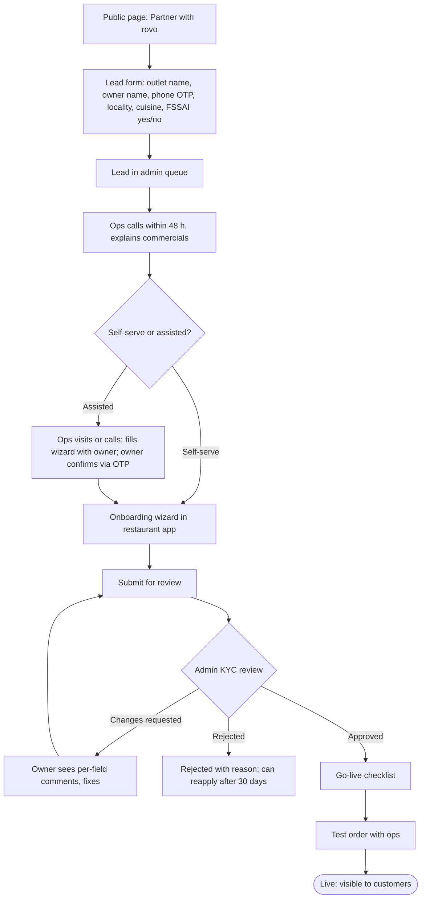
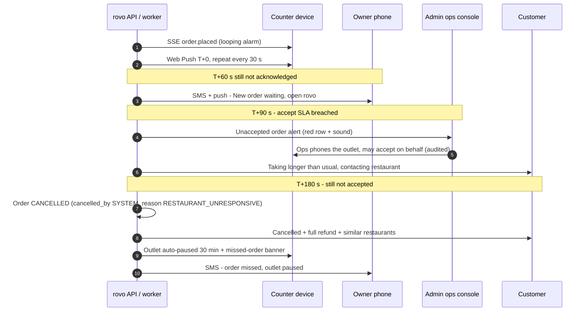
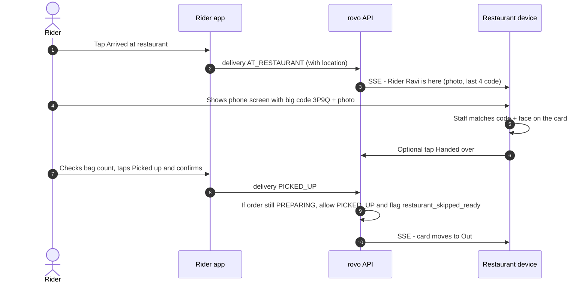

# 05 — Restaurant Partner Workflow

| Field | Value |
|---|---|
| **Purpose** | Defines how restaurant partners (`RESTAURANT_OWNER`, `RESTAURANT_STAFF`) sign up, onboard, go live and run daily operations in the `restaurant` app (PWA at the `restaurant.` host, R14). It covers the order inbox, menu management, analytics, payouts and support. |
| **Owner** | UX Architect |
| **Status** | Draft v1.1 — reconciled with review (31) and rulings R1–R48, 2026-10-04 |
| **Depends on** | `00-planning-baseline.md` · `04-customer-journey.md` §1 (UX principles — apply here) · `07-admin-workflow.md` (approval, escalation, settlements) · `06-delivery-workflow.md` (handover) · `13-order-state-machine.md` · `14-payment-architecture.md` (payouts, commission, tax) · `15-notification-architecture.md` (alerts, push, SMS) · `17-frontend-architecture.md` / `18-mobile-pwa-strategy.md` (wake lock, audio, push) · `12-auth-rbac.md` (session length, staff roles) |

**Changes in v1.1**
- Accept ladder per **R1** (§4.3 diagram and text, §11): alarm/push every 30 s, owner SMS + push at 60 s, ops flagged and phones at 90 s (may accept on behalf), `CANCELLED` by `SYSTEM` with reason `RESTAURANT_UNRESPONSIVE` at 180 s, 30-min auto-pause, 2 consecutive misses → paused until the owner resumes; automated voice call is P1 (**R43**). Timer values owned by doc 13 §5 (**R48**).
- Payout day referenced as an `app_config` key (**R53**); SSE heartbeat 20 s (**R52**).
- `ACCEPTED → PREPARING` after 60 s or on tap (**R3**); implicit ready flag renamed `restaurant_skipped_ready` (**R4**); restaurant cancel after accept is ops-mediated (**R40**, unchanged, now ruled).
- Separate `restaurant` app/host (**R14**); device-bound counter sessions 30-day idle / 90-day absolute (**R44**); heartbeat every 60 s, SSE presence counts (**R27**); SSE single stream, 20 s heartbeat, no replay (**R10**).
- Counter-device provisioning by rovo (M3); ops bulk menu CSV import (M7); KYC uploads images only (**R38**); PA linked-account KYC if split settlement (**R35**); price-change flag at 30 % (register row 55); FSSAI expiry → auto-paused (01 BR-RES-004); analytics limited to today/this week (C13); support phone line (M9).

Tags: `[ASSUMPTION]`, `[OPEN]`, `[LEGAL]`. Canonical statuses as defined in the baseline.

---

## 1. Design constraints specific to restaurants

| Constraint | Design response |
|---|---|
| A **cheap shared Android phone or tablet** (2–3 GB RAM, Android 9+, Chrome) sits on the counter, plugged in, open all day `[ASSUMPTION]`. Restaurants without a suitable device get a **pre-configured counter device from rovo** (01 RES-ONB-008, M3) | A single "Orders" screen is the home and stays open. Screen Wake Lock keeps it awake. Large fonts. Few routes. Low memory use (no heavy maps or images in the inbox). |
| Noisy kitchen; staff not watching the screen | **Loud, looping alarm** that repeats until someone acts. A full-screen colour takeover. Vibration where supported. Web Push + SMS escalation when the app is in the background or the device is off. |
| Low digital literacy; Telugu-first staff; minimal typing | **Icons + Telugu labels** on every action (bilingual where helpful). Buttons ≥ 56 px tall. Choices are chips, not text fields. Numbers come from a big numpad. Destructive actions need a confirmation. **No text entry needed to run an order** end-to-end. |
| Several staff share one device | One **device-bound long-lived session** for the counter device (§3.6, R44). Per-staff attribution is not required in V1. |
| Power cuts and patchy broadband/4G | A device-liveness heartbeat plus **auto-pause** when the device is unreachable (§8). A clear "Connected / Not connected" indicator. |
| Owner may not be on site | The owner's own phone gets SMS / push for escalations, a daily summary, and payout information. |

### 1.1 Indicative Telugu labels (key actions) `[ASSUMPTION — native-speaker review required]`

| Action | English | Telugu (colloquial) | Icon |
|---|---|---|---|
| New order | New order | కొత్త ఆర్డర్ | 🔔 bell |
| Accept | Accept | ఒప్పుకోండి / Accept | ✓ green |
| Reject | Reject | వద్దు / Reject | ✕ red |
| Food ready | Food ready | ఫుడ్ రెడీ | 🛍 bag |
| Out of stock | Out of stock | స్టాక్ లేదు | ⊘ |
| Busy / pause | Busy — pause orders | బిజీ — ఆర్డర్లు ఆపండి | ⏸ |
| Open | Open | ఓపెన్ | 🟢 |
| Closed | Closed | క్లోజ్ | ⚫ |
| Handed over | Given to rider | రైడర్‌కి ఇచ్చాం | 🤝 |
| Call support | Call rovo | rovo కి కాల్ | 📞 |

The new-order alarm includes a short pre-recorded Telugu voice line ("కొత్త ఆర్డర్ వచ్చింది", one precached asset) for staff who do not read (RV-058) `[ASSUMPTION — native review]`.

---

## 2. Roles and permissions (restaurant side)

| Capability | `RESTAURANT_OWNER` | `RESTAURANT_STAFF` |
|---|---|---|
| Accept / reject orders, set prep time, mark ready, mark out of stock | ✅ | ✅ |
| Open / pause / close the outlet | ✅ | ✅ |
| Toggle item availability | ✅ | ✅ |
| Edit menu (names, descriptions, images, categories, add-ons) | ✅ | ❌ (request via owner) `[OPEN — allow "menu editor" staff flag]` |
| Edit **prices** and packaging charges | ✅ (audit-logged; increases > 30 % flagged to ops, 01 RES-MENU-008) | ❌ |
| Operating hours | ✅ | ❌ |
| Bank details, documents, commission agreement | ✅ (bank change → admin verification, doc 07 §10) | ❌ |
| Payout statements, invoices | ✅ | ❌ |
| Analytics | ✅ | Today's summary only |
| Add / remove staff phone numbers | ✅ | ❌ |
| Support tickets | ✅ | ✅ (order-related) |

One owner can own several outlets (each is a `restaurant` row). An outlet switcher appears at the top when there is more than one outlet.

---

## 3. Signup → onboarding → approval → go-live

### 3.1 Flow overview

### 3.2 Lead form (P-01, public, no account needed)
Fields: outlet name, owner name, mobile (OTP verified to prevent spam), locality (dropdown), cuisine type (chips), "Do you have an FSSAI licence/registration?" (Yes / No / Applied), and preferred call time. On submit: "Thanks! Our team will call you within 2 working days." `[ASSUMPTION — ops SLA]`. A "No FSSAI" lead gets guidance text with a link to the FoSCoS portal. Onboarding cannot complete without FSSAI `[LEGAL]`.

### 3.3 Onboarding wizard (P-02 … P-09)
Rules: a progress bar ("Step 3 of 8"); **save and resume** at every step (server-side draft); each step works on a 360 px phone; documents can be photographed with the camera (`<input type="file" accept="image/*" capture="environment">`); **images only** (JPEG/PNG/WebP) — a PDF the partner already has is converted to an image on the device; images are compressed on the device to ≤ 1600 px and ≤ 500 KB and re-encoded by the server (R38, C5).

| Step | Screen | Fields | Validation / notes |
|---|---|---|---|
| 1 | P-02 Outlet basics | Outlet name (en) *, name in Telugu (optional; Gboard Telugu keyboard tip), outlet phone *, cuisines (chips, max 3), food type: Pure veg / Veg & non-veg *, cost for two (₹ numpad) | Name uniqueness warning within locality. |
| 2 | P-03 Location | Map with fixed centre pin ("Place pin on your shop entrance"), address fields (shop no., street, **landmark** *, locality *, PIN *), storefront photo * | Pin must be inside a zone; else "rovo doesn't cover this area yet" (lead stays in queue). |
| 3 | P-04 Documents | **FSSAI** licence/registration number * (14 digits) + certificate photo * + expiry date *; **PAN** * (owner or business; format check `AAAAA9999A`) + photo; **GSTIN** (optional; format check; if present, legal name captured); business type (proprietor / partnership / company) | FSSAI format check only. Validity is checked manually by ops on the FoSCoS portal `[ASSUMPTION — no API in V1]`. **No Aadhaar collected.** `[LEGAL]` |
| 4 | P-05 Bank details | Account holder name *, account number * (entered twice, masked), IFSC * (lookup shows bank and branch name `[ASSUMPTION — static IFSC dataset]`), cancelled cheque or passbook photo * | Name mismatch with PAN → ops review. Penny-drop verification through the PA if available `[OPEN — doc 14]`. |
| 5 | P-06 Operating hours | Per day: Open/Closed toggle + one or two slots (e.g. 11:00–15:00, 18:30–23:00). "Copy Monday to all days" button. A time picker with large wheels, not typing | Stored as local wall-clock time + day of week (baseline). |
| 6 | P-07 Photos | Cover photo * (16:9 crop guide), logo (optional), up to 5 food photos | Guidance: "Natural light, top view, no text on photos". |
| 7 | P-08 Menu | Option A: **"Upload photos of your paper menu"** (ops digitises it with the ops-side bulk CSV import, 01 RES-MENU-009, M7 — recommended for low-literacy partners). Option B: build the menu in the app (§5) | Minimum 5 items with prices before go-live. |
| 8 | P-09 Agreement & submit | Commission %, payout cycle, packaging policy, cancellation/penalty rules, rovo partner terms (scrollable, Telugu + English) → "I agree" checkbox + OTP confirmation `[LEGAL — e-acceptance validity; IT Act 2000; terms reviewed by counsel]` | Submit → status "Under review". |

### 3.4 Application status (P-10)
A status tracker with plain steps: **Submitted → Under review → Changes needed → Approved → Go-live checklist → Live**.
- "Changes needed" lists **per-field comments** from the reviewer (e.g. "FSSAI certificate photo blurred — please retake"). Tapping one jumps to that field.
- Push + SMS on each status change.

### 3.5 Go-live checklist (P-11)
All items must be ✅ before the owner can tap "Go live". Ops can override any item with a reason.

| # | Item | How it is verified |
|---|---|---|
| 1 | Menu has ≥ 5 available items with prices, veg/non-veg marked, packaging set | Automatic |
| 2 | Operating hours set | Automatic |
| 3 | **Counter device set up:** restaurant app installed to home screen (PWA) on the outlet's device or a rovo-provisioned counter device (M3), registered as order-receiver, notifications allowed, battery optimisation disabled | Device reports `display-mode: standalone` + push subscription; ops records provisioned device model/serial |
| 4 | **Sound test passed** — "Did you hear the alarm?" Yes | Device reports a successful audio unlock |
| 5 | **Screen-awake test** — wake lock acquired | Device reports |
| 6 | Staff phone numbers added (optional) | — |
| 7 | **Test order** placed by ops and completed: accept → ready → handover (to an ops "test rider") | Automatic on completion |
| 8 | Owner watched the 3-minute training video (Telugu) or ops marked it trained | Checkbox |
| 9 | **PA linked-account KYC complete** — only if the PA split-settlement model is chosen (R25/R35) `[LEGAL]` | PA status |

### 3.6 Login and sessions
- Phone + OTP (baseline P9). **Counter device:** after OTP, ask "Is this the shop's order device?" If **Yes**, the device is registered as an order-receiver `restaurant_device` with a name ("Counter tablet") and gets a **device-bound long-lived session: sliding 30-day idle, 90-day absolute, revocable by owner or admin** (R44); any forced re-auth is scheduled outside service hours. The owner can see and revoke devices.
- Staff do not need their own login on the counter device. Actions on the counter device are attributed to "Counter tablet (staff)". Owner actions on the owner's phone are attributed to the owner.

---

## 4. Daily operations

### 4.1 Start of day — "Start taking orders" (P-20)
Browsers block audio until the user interacts with the page, so the day **must** start with one tap:
1. Big button: **"Start taking orders / ఆర్డర్లు మొదలుపెట్టండి"**.
2. On tap: unlock the audio context, play a 1 s test chime, acquire the Screen Wake Lock, request notification permission (if not yet granted), and set the outlet to **Open** (if within hours).
3. Health strip at the top (always visible): 🟢 Connected · 🔊 Sound on · 🔆 Screen awake · 🔋 Charging. Each red item has a one-tap fix or an illustrated instruction (e.g. "Volume is low — turn it up").
- If the device reloads or Chrome restarts, the app shows a **full-screen "Tap to resume orders"** card (audio must be unlocked again). It also beeps with a vibration pattern if the system allows it.

### 4.2 Outlet status: Open / Busy (paused) / Closed (P-21)
A large three-state control at the top of the Orders screen:

| State | Meaning | How set | Customer impact |
|---|---|---|---|
| **Open** 🟢 | Accepting orders | Auto at opening time (if "Start taking orders" was done today), or manual | Normal |
| **Busy** ⏸ | Temporarily not accepting new orders | Tap "Busy" → chips: **15 min · 30 min · 60 min · Until I resume**. Optional reason: Too many orders / Staff shortage / Kitchen issue | "Not accepting orders · back in ~N min". Auto-resumes at the end, with a chime and a "You're open again" banner. |
| **Closed** ⚫ | Closed for the rest of today | Auto at closing time; or "Close for today" (confirm) | "Closed · opens {next slot}" |

- Orders already in progress are **not** affected by Busy or Closed.
- Pausing more than 3 times or for more than 2 hours a day is visible to ops (quality signal), not punitive in V1.

### 4.3 New order alert and accept / reject (P-22, P-23)

**Alert behaviour:**
- When a new order arrives (`PLACED`) via SSE: a **full-screen takeover** (high-contrast amber background) with a **looping alarm sound** (Web Audio; ~85 % volume; a distinct two-tone pattern different from the other alerts) and `navigator.vibrate` pattern (where supported). It repeats until the order is accepted or rejected. **Tapping elsewhere does not silence it.** A "Mute 30 s" button exists for phone calls but re-arms automatically.
- Several new orders stack as cards ("2 new orders"), each with its own countdown.
- If the app is **in the background or the screen is locked** (Wake Lock released): the server sends **Web Push** (`requireInteraction: true`, `renotify: true`, same `tag` per order) at T+0 and re-sends every 30 s until the order is acknowledged (R1; doc 13 T-ACC-RING). A system notification cannot loop a sound, which is why the re-sends are needed `[ASSUMPTION — Android Chrome behaviour; Frontend to verify in doc 18]`.

**Order card content (big type, scannable in 3 seconds):**
- Order code with the **last 4 characters enlarged** (`RV-7K·3P9Q` → "**3P9Q**") for handover matching.
- Item lines: qty × name (Telugu name if the device language is `te` and one exists), variant / add-ons on a sub-line, veg markers. Quantities above 1 are bold and highlighted.
- Customer note ("less spicy") in a yellow box.
- Item total (restaurant's view: item total + packaging), plus a payment label: "Prepaid" or "Cash — rider collects". The label tells staff that the **restaurant never collects cash** (aligned with doc 01 RES-ORD-001).
- Customer first name only. **No phone number or address** (privacy; the rider handles delivery).
- **Accept countdown** from the 180 s window (R1): "Accept in 2:41".

**Accept (P-22):**
- **Prep time chips** (required, one tap): **10 · 15 · 20 · 30 · 45 min**. The default pre-selected chip = the outlet's rolling median prep time for a similar cart size. **Accept** is a big green button labelled with the time: "Accept · 20 min".
- On accept: the order moves to `ACCEPTED` with the chosen prep time, and moves to `PREPARING` **automatically after 60 s or when staff tap "Start preparing"** (R3; `ordering.auto_preparing_after_s`). The card moves to the "Preparing" column.
- The sound stops only when no unacknowledged orders remain.

**Reject (P-23):**
- Red "Reject" (smaller, on the left) → a reason sheet with big icon buttons:
  1. **Items out of stock** → item checklist from this order (multi-select). The selected items are **also marked out of stock on the menu**, with "Until: 2 h / end of today / I'll turn it on".
  2. **Too busy** → suggests "Pause new orders for 30 min?" (pre-checked, user-visible, can be unticked).
  3. **Closing soon / closed**.
  4. **Kitchen problem** (gas, power, etc.).
  5. **Other** (optional voice-free short text; not required).
- Confirm: "Reject this order? The customer will get a full refund." → **[Go back]** **[Reject]**.
- Result: `REJECTED` with `reject_reason` from the doc 13 §6.3 `ORDER_REJECT` catalogue (`ITEMS_OUT_OF_STOCK`, `TOO_BUSY`, `CLOSING_SOON`, `KITCHEN_ISSUE`, `RESTAURANT_OTHER`). The customer sees a friendly reason (doc 04 §9.2).
- **Partial fulfilment (accept without one item) is not supported in V1.** Out-of-stock → reject + item marked out of stock + the customer gets a one-tap "Reorder without unavailable items". Reason: modifying an order mid-flow needs customer consent, partial refunds and re-quoting — too complex for V1 `[OPEN — revisit in V1.1]`.

**Accept timeout and escalation (R1, R43; timer keys and defaults owned by doc 13 §5 `T-ACC-*`):**

- The device always shows the remaining accept time. At T+90 s the takeover turns **red** with "Accept now or the order will be cancelled".
- **Pause after misses (R1):** each missed order pauses the outlet for 30 min; **2 consecutive misses** pause it until the owner taps Resume (owner SMS). A missed order counts as `RESTAURANT_UNRESPONSIVE`, not as a rejection, but still counts against the restaurant in quality metrics.
- **Voice escalation (R43):** V1 has no automated call; ops calls manually at 90 s (ops desk staffed during service hours). An automated IVR call to the counter device and owner is a P1 add-on if the pilot shows > 5 % of orders reaching 90 s.
- Accept rate and accept latency feed partner analytics and ops quality dashboards.

### 4.4 Customer cancels during the grace window
A distinct **"CANCELLED — do not prepare / ఆర్డర్ క్యాన్సల్ — వండకండి"** full-screen alert with a different sound (a falling tone). The staff must tap "OK, seen". The card moves to History with a strike-through.

### 4.5 Preparing → Ready (P-24)
- **Orders board** (tabs on a phone, columns on a tablet ≥ 768 px): **New · Preparing · Ready · Out (picked up)**.
- Each Preparing card shows: last-4 code, item summary, **prep countdown** ("Ready in 12 min"), and the **rider status line**:
  - "Finding rider…" (`UNASSIGNED` / `OFFERED`)
  - "Rider Ravi assigned · arriving ~6 min" (`ASSIGNED`)
  - "**Rider Ravi is here**" with the rider's photo and a pulsing highlight (`AT_RESTAURANT`)
- **"Food ready / ఫుడ్ రెడీ"** — a full-width button on each card → order `READY_FOR_PICKUP`. A 5 s undo snackbar is available, because a mis-tap would mislead the rider.
- **Need more time:** "+5 min" / "+10 min" chips on the card. A maximum of 2 extensions; each extension updates the customer's ETA and is counted in analytics.
- **Prep overrun nudge:** when the countdown reaches 0 and the order is not marked ready, the card turns amber and a soft chime plays every 2 min: "Is {3P9Q} ready?" with **[Ready]** **[+5 min]** shortcuts. Ops is alerted at +15 min overrun.
- **Out of stock from the order screen (after accepting):** in the order detail, "Item problem" → choose the item → options: **"Call rovo support"** (ops calls the customer: cancel, or substitute in V1.1) and **"Mark item out of stock on menu"** for future orders. The restaurant **cannot self-cancel** an accepted order in V1 — it raises an urgent ops ticket ("Can't make this order") with a reason, and ops decides (doc 07). This prevents silent cancellations after the customer has waited.

### 4.6 Rider arrival and handover (P-25)

**Verification decision (V1):**
- **Visual match** of the **last 4 characters of the order code** plus the **rider name and photo** shown on both screens. The restaurant does not type anything.
- The **rider's "Picked up"** is the authoritative transition. It is server-enforced to come only from the assigned rider with the delivery in `AT_RESTAURANT`.
- The restaurant's "Handed over" tap is **optional**. It is recorded as a timestamp for disputes but does not change status.
- A **config flag `pickup_pin_required`** (off by default) can later require the restaurant to enter a 4-digit PIN shown on the rider app, if mis-handovers become a problem `[OPEN]`.
- If an unknown rider (not the one on the card) asks for an order: the card shows only the assigned rider. Staff should hand over **only** when the code **and** the photo match; otherwise tap "Wrong rider?" → call ops.

### 4.7 Order history (P-26)
- Today by default; date picker for older days. Filters: Delivered / Rejected / Cancelled.
- Row: time, last-4 code, items count, item total, status, rating (if given).
- Detail: items, timeline (placed, accepted, ready, picked up, delivered — with times), prep-time promised vs actual, rider name, customer rating and review (read-only; **replying to reviews is deferred**), and the effect on payout ("You earn ₹304.30 from this order", with a breakdown link).

---

## 5. Menu management (P-30 … P-34)

### 5.1 Menu home (P-30) — designed for quick availability changes
- Categories as collapsible sections, each with **item count** and a **category toggle** ("Turn off all Biryanis").
- Item rows: veg marker, name (+ Telugu), price, and a large **availability switch**. When switched off: a sheet asks **"Turn back on: in 2 hours · tomorrow morning · I'll do it myself"**. Auto re-enable happens at the chosen time, evaluated in the city timezone.
- **Bulk mode:** "Select" → checkboxes → "Turn off selected / Turn on selected".
- Search box (both scripts) and filter chips: "Off right now", "No photo", "No Telugu name".
- Staff see this screen as availability-only; edit controls are hidden.

### 5.2 Item editor (P-31) — owner
| Field | Input | Notes |
|---|---|---|
| Name (English) * | Text | Max 60 characters |
| Name (Telugu) | Text (Telugu keyboard) | A "Suggest" button is `[OPEN]` (rule-based transliteration). Ops can fill it in for the partner. |
| Description | Text, max 200 | Optional |
| Category * | Picker / create | — |
| Food type * | Veg / Non-veg / Egg | Icons. Egg shows as non-veg in the FSSAI marker plus a visible "Contains egg" tag `[OPEN — product]` |
| Price * | ₹ numpad | Changes are audit-logged. An increase > 30 % (01 RES-MENU-008) triggers a "Are you sure?" confirmation and an ops flag |
| Packaging charge | ₹ numpad | Per item. Or set per order in outlet settings |
| Image | Camera / gallery, 4:3 crop guide | Compressed to ≤ 1280 px, ≤ 250 KB WebP on the device |
| Variants | Variant editor (P-32) | e.g. Half / Full, each with its own price |
| Add-on groups | Add-on editor (P-33) | — |
| Availability | Switch + "Available only between" times `[OPEN — V1.1]` | — |
| Bestseller / recommended | Read-only (system computed) | — |

### 5.3 Variant and add-on editor (P-32, P-33)
- **Variant group** (max 1 per item in V1 `[ASSUMPTION — enough for Half/Full, Small/Medium/Large]`): options with name (en/te) and **absolute price**. Exactly one option is chosen by the customer.
- **Add-on groups** (0..n per item; reusable across items, e.g. "Extra toppings" attached to 10 pizzas):
  - Group name (en/te), **Min** and **Max** (number steppers with plain-language preview: "Customer must choose 1" / "Customer can choose up to 3" / "Optional").
  - Options: name, price delta (₹0 allowed), veg marker, availability switch.
  - Validation: `0 ≤ min ≤ max ≤ number of options`; min ≥ 1 marks the group as required.
- A **"Preview as customer"** button shows the doc 04 customisation sheet exactly as a customer would see it.
- The complexity is real. **Ops-assisted menu setup is the default for launch**, and owners mainly use the availability toggles day to day `[ASSUMPTION]`.

### 5.4 Image upload rules (P-34)
Camera-first with in-app guidance overlay. A 4:3 crop. Uploaded images go through a moderation queue. They are visible immediately to the partner, but to customers only after automatic checks (size, not blank) and spot-checks by ops `[OPEN — moderation depth]`. Images may not contain text, prices or phone numbers.

---

## 6. Analytics (P-40) — "How is my shop doing?"
Kept simple, with plain-language cards and one chart per card. Period switch: **Today · This week** (01 RES-ANLY-001). 7/30-day trends are deferred to V1.1 (RES-ANLY-002, C13).

| Card | Content |
|---|---|
| Orders & sales | Delivered orders count, item sales (₹), average order value; a bar chart by day |
| Missed & rejected | Rejected count + top reasons, missed orders (cancelled as `RESTAURANT_UNRESPONSIVE`), accept time median. Coaching tip: "Each missed order is a lost customer — keep the sound on." |
| Kitchen speed | Prep time promised vs actual (median), % orders ready on time |
| Ratings | Average rating (30 days), count, tag cloud ("Tasty", "Small portion"), latest 10 reviews |
| Top items | Top 5 items by quantity; items most often marked out of stock |
| Hours | Open hours vs scheduled hours (pause time) |

Data refreshes at most every 15 min. No real-time analytics in V1.

---

## 7. Payouts and statements (P-41, P-42)
- **Payout list (P-41):** weekly cycles (Mon–Sun; payout day is an `app_config` key owned by doc 10 — default restaurant settlement on Tuesday, R53; settlement model PA split vs collect-and-payout decided with counsel, R35), each with status **Upcoming → Processing → Paid** (with **UTR / reference** and paid date) or **On hold** (with reason, e.g. "Bank details under verification").
- **Statement detail (P-42), per cycle:**
  - Orders delivered (count), **item total**, **packaging charges**, restaurant-funded discounts (−), **commission** at X % (−), **GST on commission** (−), **TCS / TDS** deductions if applicable (−) `[LEGAL — e-commerce operator TCS under CGST §52 and TDS under Income-tax §194-O; verify applicability for §9(5) restaurant services]`, refunds or penalties attributable to the restaurant (−, each with an order code and reason), adjustments (±) → **Net payout**.
  - Per-order breakdown table (scrollable; CSV/PDF download).
  - **Commission tax invoice** from rovo (PDF) `[LEGAL]`.
- **Disputing a line:** "Raise an issue" on any line → support ticket pre-filled with the order and line.

---

## 8. Support (P-50)
- **Big "Call rovo" button** (the staffed support/ops phone line, `tel:`, M9) on every screen's overflow menu, plus inline on order cards that have a problem.
- Ticket categories: order problem (pre-filled from the card), rider problem, payout question, menu change help, app/device help, documents/licence renewal.
- Ticket thread like the customer's (doc 04 §13.4), with photos allowed.
- **FSSAI expiry reminders:** at 30, 15, 7 and 1 days before expiry → banner + SMS. **At expiry the outlet is auto-paused** (01 BR-RES-004) until a renewed licence is uploaded and approved `[LEGAL]`.

---

## 9. Edge cases

| # | Situation | Behaviour |
|---|---|---|
| R1 | **Power cut / phone dies / Chrome killed with orders pending** | The server tracks **device liveness** (an open SSE connection counts as presence, plus a 60 s heartbeat from the foreground app — R27). If **no live order-receiver device for 3 min** while the outlet is Open (R1, doc 13 T-DEVICE-HB): (a) **auto-pause** new orders ("Busy — device offline"); (b) SMS + push to the owner; (c) ops board shows "Outlet offline" with its count of active orders. Orders already `PLACED` follow the normal accept-timeout (§4.3), so ops calls the outlet. Orders already `PREPARING` continue — the rider still arrives and the rider's "Picked up" works without the restaurant device. **On reconnect:** a full-screen "You were offline 14 min — 1 order was cancelled, 2 orders are in progress" summary, then "Resume taking orders?" (manual resume, so a shop that is still in the dark doesn't re-open by accident). |
| R2 | **Restaurant forgets to mark ready** | Prep overrun nudges (§4.5). When the rider is `AT_RESTAURANT`, the card shows "Rider waiting · 4 min". The rider's "Picked up" sets the order to ready implicitly (`PREPARING → READY_FOR_PICKUP → PICKED_UP`, both timestamps written, flagged `restaurant_skipped_ready`, R4). This counts against the "ready on time" metric. |
| R3 | **Rider late or no rider assigned when food is ready** | The card shows "Rider delayed — rovo is on it" (no action expected from the restaurant). If `READY_FOR_PICKUP` for more than 10 min with no rider at the restaurant: ops alert (doc 07). The restaurant can tap **"Rider not here"** to ping ops. Food quality concerns are ops' responsibility; no restaurant penalty. |
| R4 | **Two riders arrive for one order** (e.g. after a reassignment) | Only the **current** assigned rider appears on the card. The previous rider's app shows "Order reassigned — do not pick up" (doc 06). Staff hand over only on a code + photo match. "Wrong rider?" → ops. |
| R5 | **Order accepted by mistake, cannot be made** | "Can't make this order" → urgent ops ticket with a reason; ops cancels (admin cancel, refund). Counts toward the outlet's quality metrics. |
| R6 | **Wrong prep time chosen** | "+5 / +10 min" extensions (max 2). The customer's ETA updates. |
| R7 | **Several orders at once** | Stacked takeovers. Each must be acted on. The sound continues until all are acknowledged. On a tablet, the New column shows all at once. |
| R8 | **Device language Telugu, menu item has no Telugu name** | Show the English name. The "No Telugu name" filter helps the owner fill it in. |
| R9 | **Outlet still "Open" after closing time** | Auto-close at the end of the hours slot. Orders placed within the last slot minute are still accepted normally. |
| R10 | **Price edit while orders are in flight** | In-flight orders keep their original prices (order line snapshot). Only new quotes use the new price. |
| R11 | **Staff accidentally rejects** | No undo after the confirmation (the customer has already been refunded). Coaching: rejection reasons are reviewed weekly by ops. |
| R12 | **Phone storage / browser data cleared** | Session lost → OTP login again. Device registration re-prompt. Go-live checklist items 3–5 are re-run as "device setup" automatically. |

---

## 10. Screen inventory (`restaurant` app)

| ID | Screen | Purpose | Key components | Loading | Empty | Error |
|---|---|---|---|---|---|---|
| P-01 | Lead form (public) | Capture interest | Fields, OTP, submit | Submit spinner | — | OTP/validation |
| P-02 | Wizard: Outlet basics | Identity | Name en/te, phone, cuisines, food type, cost for two | — | — | Validation |
| P-03 | Wizard: Location | Pin + address | Map fixed pin, address fields, storefront photo | Tile placeholder | — | Out-of-zone; tile failure → "use current location" as pin + ops verifies on visit |
| P-04 | Wizard: Documents | KYC | FSSAI no. + photo + expiry, PAN + photo, GSTIN optional (images only) | Upload progress per file | — | Format errors, upload retry |
| P-05 | Wizard: Bank | Payout destination | Holder, account × 2, IFSC lookup, cheque photo | IFSC lookup | — | Mismatch, IFSC not found |
| P-06 | Wizard: Hours | Timings | Day toggles, slots, copy-to-all | — | — | Overlapping slots |
| P-07 | Wizard: Photos | Visuals | Cover, logo, food photos | Upload progress | Placeholder tiles | Upload retry |
| P-08 | Wizard: Menu | Initial menu | Upload menu photos or build | — | "Add at least 5 items" | — |
| P-09 | Wizard: Agreement | Accept terms | Commercial summary, terms (en/te), OTP accept | — | — | OTP |
| P-10 | Application status | Track review | Stepper, per-field comments | Skeleton | — | Retry |
| P-11 | Go-live checklist | Readiness | Checklist with auto/manual ticks, "Go live" | — | — | Failed device checks with fixes |
| P-20 | Start shift | Unlock audio, wake lock | Big start button, health strip | — | — | Permission denied guidance |
| P-21 | Outlet status control | Open/Busy/Closed | 3-state control, pause duration chips | — | — | Change failed → retry |
| P-22 | New order takeover + accept | Accept with prep time | Code (last 4 big), items, note, countdown, prep chips, Accept | — | — | Accept failed (order already cancelled/timeout) → explanatory card |
| P-23 | Reject sheet | Reject with reason | Reason icons, item checklist, pause suggestion, confirm | — | — | — |
| P-24 | Orders board | Run the kitchen | Tabs/columns New/Preparing/Ready/Out, rider status, Ready button, +time | Skeleton cards | "No orders right now — you're Open 🟢" | Offline banner (red) + last known board |
| P-25 | Order detail | Full info + handover | Items, timeline, rider card, Handed over, Item problem, Call rovo | Skeleton | — | Retry |
| P-26 | Order history | Past orders | Date picker, filters, rows | Skeleton | "No orders on this day" | Retry |
| P-30 | Menu home | Availability | Category toggles, item switches, bulk, search, filters | Skeleton | "No items — add your first item" | Toggle failed → revert + toast |
| P-31 | Item editor | Edit item | Fields table §5.2, preview | — | — | Validation, upload |
| P-32 | Variant editor | Half/Full etc. | Options with prices | — | "No variants" | Validation |
| P-33 | Add-on group editor | Extras | Group min/max, options, attach to items | — | — | min/max validation |
| P-34 | Image capture | Photos | Camera guide, crop, compress | Processing | — | Too large/blurred hint |
| P-40 | Analytics | Performance | Today / this week switch, cards | Skeleton cards | "Not enough data yet" | Retry |
| P-41 | Payouts list | Cycles | Status, amount, UTR | Skeleton | "First payout after your first week" | Retry |
| P-42 | Statement detail | Breakdown | Summary lines, per-order table, downloads, raise issue | Skeleton | — | Retry |
| P-43 | Outlet settings | Hours, packaging, devices, staff | Sections | — | — | Save errors |
| P-50 | Support | Help | Call rovo, ticket list, new ticket | Skeleton | "No tickets" | Retry |

---

## 11. Requirements for Backend / Frontend and challenges to the baseline

**Requirements**
1. **Restaurant inbox events** on the single SSE stream `GET /api/v1/stream` (R10; event names per doc 11 §4.2: order placed/cancelled, delivery status, rider), heartbeat every 20 s, **no server replay** — the device refetches the inbox snapshot on reconnect. Polling fallback every 10 s while any order is `PLACED`.
2. **Device liveness**: record the last heartbeat per `restaurant_device` (60 s heartbeat; SSE presence counts, R27). Worker rule: auto-pause after 3 min with no live order-receiver while Open (R1; `restaurant.device_offline_pause_s`).
3. **Escalation timers** per R1 / doc 13 §5 (repeat every 30 s, owner SMS at 60 s, ops flag at 90 s, `CANCELLED`/`RESTAURANT_UNRESPONSIVE` at 180 s + 30-min auto-pause; 2 consecutive → paused until resume) as durable jobs that re-check state.
4. **Web Push re-notify** every 30 s for unacknowledged orders (server-driven), with a per-order `tag`.
5. **Prep-time default** = the outlet's rolling median, returned with the order.
6. **Auto-advance `ACCEPTED → PREPARING`** after 60 s or on tap (R3), keeping both timestamps.
7. **Implicit ready**: the rider's pickup is allowed from `PREPARING`, flagged `restaurant_skipped_ready` (R4; exact transition per doc 13).
8. **Item availability with an auto re-enable time** (`unavailable_until`).
9. **Reject reasons** as an enum with an optional item list; selecting items marks them unavailable.
10. **Device sessions** (R44): device-bound sessions for registered order-receiver devices — sliding 30-day idle, 90-day absolute, revocable by owner/admin (doc 12).
11. **Frontend:** Screen Wake Lock re-acquired on `visibilitychange`; an audio unlock gate; Web Audio looping alarm with Telugu voice line; vibration; a separate `restaurant` app with its own manifest, icons and host (R14; doc 18).

**Challenges / proposals to the baseline — now resolved by rulings**
- **`ACCEPTED` is short-lived** for restaurants: kept in the state machine, auto-advanced after 60 s (R3).
- **Restaurant timeout cancellations** are `CANCELLED` with `cancelled_by=SYSTEM`, reason `RESTAURANT_UNRESPONSIVE`, not `REJECTED` (R1). Analytics still count them against the restaurant.
- **Partial fulfilment is deferred.** Out-of-stock → reject + one-tap reorder for the customer.
- **Restaurants cannot self-cancel after accepting** in V1 — ops-mediated (R40).
