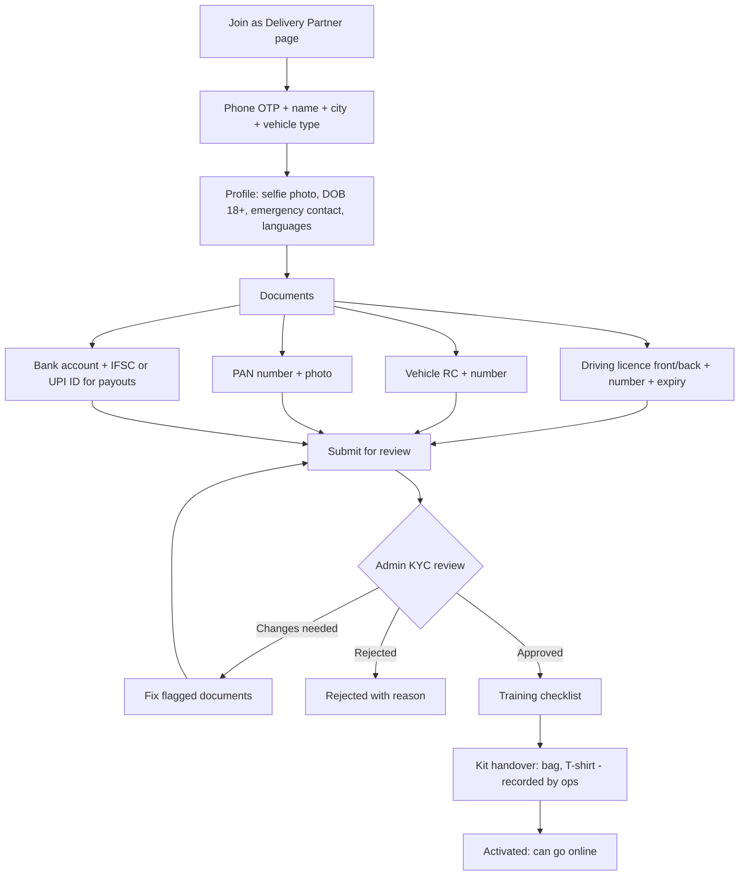
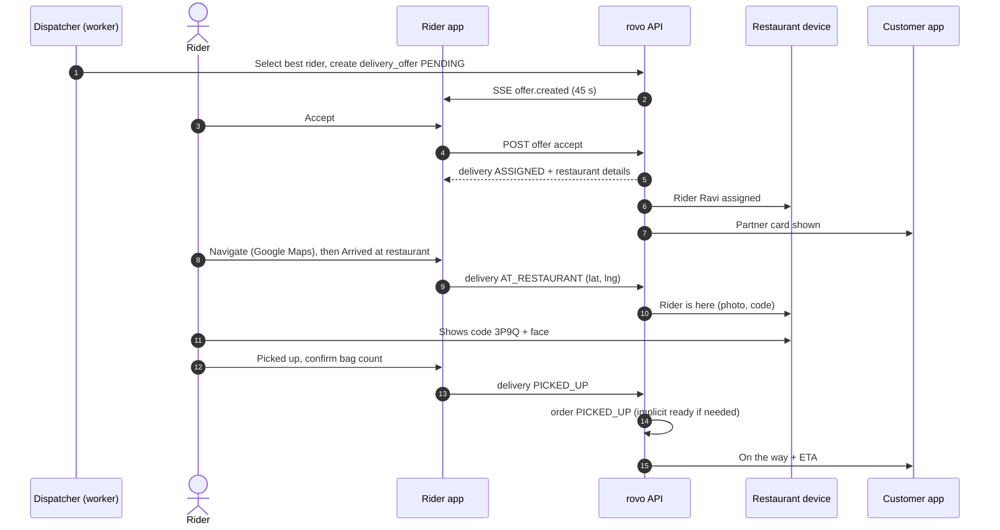
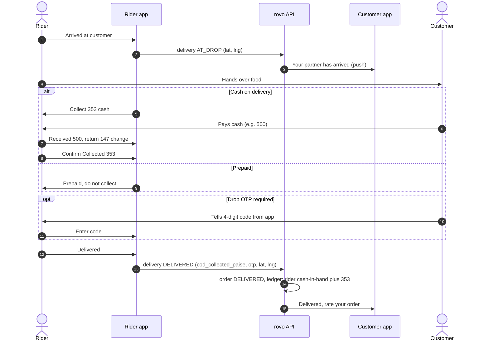
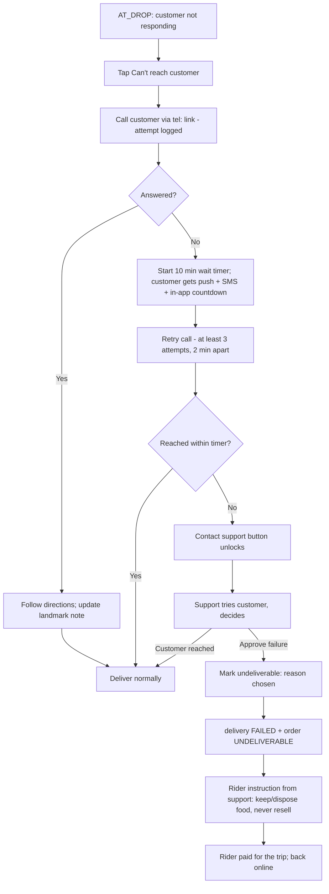

# 06 — Delivery Partner (Rider) Workflow

| Field | Value |
|---|---|
| **Purpose** | Defines how delivery partners (`RIDER`) register, complete KYC and training, go online, and receive and accept order requests (`delivery_offer`). It covers pickup and drop, cash on delivery, delivery failures, earnings, cash deposits, history and safety, all in the rider mode of the `partner` PWA. |
| **Owner** | UX Architect |
| **Status** | Draft v1 |
| **Depends on** | `00-planning-baseline.md` (P11 dispatch, P12 foreground location, commercial defaults) · `04-customer-journey.md` §1 (UX principles) · `05-restaurant-workflow.md` (handover) · `07-admin-workflow.md` (approval, manual assign, deposits) · `13-order-state-machine.md` · `14-payment-architecture.md` (COD, ledger, payouts) · `15-notification-architecture.md` · `16-delivery-zone-architecture.md` · `18-mobile-pwa-strategy.md` (geolocation, wake lock, push) · `12-auth-rbac.md` / `19-security-threat-model.md` (privacy of phone numbers) |

Tags: `[ASSUMPTION]`, `[OPEN]`, `[LEGAL]`. Canonical statuses as defined in the baseline. In UI copy, "Delivery Partner" is the user-facing term and "Order request" is the UI name for a `delivery_offer`.

---

## 1. Rider context and design constraints

| Constraint | Design response |
|---|---|
| Rider on a two-wheeler with a low-end Android phone, often in a phone mount, in sunlight, with gloves or wet hands | **High-contrast "outdoor" theme** for the active-delivery screens. Primary buttons are ≥ 64 px tall and full width. A **tap-then-confirm** pattern for irreversible steps, so the rider never has to swipe precisely while riding (WCAG 2.5.7). |
| PWA: **no background geolocation**, and Android may throttle or kill background tabs | **Foreground-only** location while online (baseline P12). Screen Wake Lock. Clear "keep rovo open" messaging. Rules for when the app goes to the background (§4). |
| Navigation happens in the **Google Maps app**, not in rovo | One-tap deep link. rovo shows big "Arrived" buttons when the rider comes back. Location is captured at each status tap. |
| Mixed literacy; Telugu / Hindi / Urdu speakers `[ASSUMPTION — Urdu & Hindi common in Mahabubnagar; V1 ships en + te only]` | Icons + short labels + numbers. Colour-coded steps. Telugu audio cues for offers are deferred `[OPEN]`. |
| Cash handling risk | Exact COD amount shown in huge type. Change calculator. Cash-in-hand limit enforced (₹2,000 default). |
| Safety | An SOS control is always reachable during active deliveries. No in-app interaction is required while moving (status taps only when stopped). |

---

## 2. Registration, KYC, approval, training

### 2.1 Flow

### 2.2 Documents and data rules
| Item | Required? | Notes |
|---|---|---|
| Phone (OTP verified) | ✅ | Login identity |
| Full name, selfie | ✅ | The selfie is shown to restaurants and customers (first name + photo). The reviewer compares it with the DL photo. |
| Date of birth (18+) | ✅ | Must be 18 or older `[LEGAL]` |
| Vehicle type | ✅ | Motorcycle / Scooter / Electric scooter / Bicycle. **DL + RC are required for motorised vehicles.** Low-speed e-scooters may be exempt from DL/RC under Indian motor-vehicle rules `[LEGAL — verify; default V1: require DL + RC for all motorised]`. Bicycles are allowed only within a short-radius zone `[OPEN]`. |
| Driving licence | ✅ (motorised) | Number, expiry, front/back photos. Expiry reminders at 30/7 days. Auto-suspension at expiry. |
| RC (registration certificate) | ✅ (motorised) | Vehicle number is shown to the customer as the last 4 digits only. The rider may use a vehicle registered to a family member (common); recorded as "owner name ≠ rider" `[ASSUMPTION]`. |
| PAN | ✅ | Needed for payouts / TDS `[LEGAL — verify TDS applicability on rider payouts]` |
| Bank account (IFSC) **or** UPI ID | ✅ (one) | Payout destination. Name match checked by ops. Penny-drop through the PA if available `[OPEN — doc 14]` |
| **Aadhaar** | ❌ **Not collected in V1** | Baseline forbids storing full Aadhaar. If address proof is later needed: masked Aadhaar (last 4 digits only) or DigiLocker-based verification `[LEGAL]` |
| Police verification | `[OPEN]` | Common practice in Indian delivery; may be a requirement under state rules `[LEGAL]`. V1 proposal: self-declaration + ops discretion |
| Emergency contact | ✅ | Name + phone. Used only for SOS (§10) |
| Insurance | `[OPEN / LEGAL]` | Accident cover for gig workers — check the Code on Social Security 2020 gig-worker provisions and any Telangana state gig-worker legislation |

**Privacy:** documents are stored encrypted in private object storage, viewable only by admin roles with KYC permission, and each view is audit-logged (doc 07) `[LEGAL — DPDP retention schedule]`.

### 2.3 Training checklist (D-08)
Every module must be completed before activation. Short videos (≤ 3 min, Telugu with English subtitles, ≤ 5 MB each, downloadable on Wi-Fi) + a 5-question quiz:
1. Using the rovo app: go online, accept, statuses, navigation hand-off, keeping the screen on.
2. Pickup etiquette: show the code, check the bag count, sealed packaging, never open food packaging.
3. Cash on delivery: exact amount, giving change, **never accept payment to a personal UPI**, cash-in-hand limit, deposits.
4. Customer interaction: call etiquette, privacy (don't save or misuse customer numbers — a violation means suspension), the doorstep handover.
5. Safety: helmet, traffic rules, never using the phone while riding, the SOS button, monsoon guidance.
6. Food hygiene: bag cleaning, no food in sunlight, handling spills.
- Ops can mark "trained in person" instead (it counts the same).

---

## 3. Rider availability model (UX proposal for Backend)

The baseline defines delivery and offer statuses, but not rider availability. UX needs these **rider availability states** (field name `[OPEN — doc 10]`):

| State | Meaning | Gets offers? |
|---|---|---|
| `OFFLINE` | The rider is not working | No |
| `ONLINE_IDLE` | Online, foreground, with a fresh location (≤ 90 s old) | ✅ |
| `ONLINE_STALE` | Online, but no heartbeat or location for more than 90 s (app in background, no network, phone locked) | ❌ (excluded until fresh) |
| `ON_DELIVERY` | Has an active delivery (one at a time, baseline P11) | ❌ (batching deferred) |
| `BLOCKED_COD` | Cash in hand ≥ limit | Prepaid offers only |
| `SUSPENDED` | Admin-suspended or documents expired | No (cannot go online) |

---

## 4. Going online / offline (D-10, D-11)

### 4.1 Pre-flight checks when the rider taps "Go online"
A checklist sheet. All items must be green before the rider is online:

| Check | Why | Fix UI |
|---|---|---|
| Location permission granted | Dispatch needs the rider's position | Request it; if denied, show illustrated steps for Chrome site settings |
| GPS fix with accuracy ≤ 100 m within 20 s | A stale or coarse location breaks dispatch | "Move to open sky" + retry |
| Inside the city service area (or within 2 km of a zone) | Avoid offers to far-away riders | Message only |
| Screen Wake Lock acquired | Keeps the app in the foreground while idle | Automatic; if unsupported, "Set screen timeout to 10 min" tip |
| Notification permission (recommended, not blocking) | Order requests while briefly in the background | Request |
| Not over the cash-in-hand limit (warning only) | COD offers are paused at the limit | Show "Deposit cash to get cash orders" |
| Documents valid | DL/RC not expired | Blocks; links to document update |
| Sound test (first time each day) | Order request alert must be audible | Plays a chime (this also unlocks audio) |

### 4.2 PWA constraints — what we tell riders, and why
- **Browsers do not allow a web app to track location in the background.** rovo can only read the location while it is open and on screen. So, while **waiting for orders**, the rider must keep rovo **open with the screen on**. A **phone mount + charger** is strongly recommended (ops kit) `[ASSUMPTION]`.
- **Background behaviour:**
  - App hidden (`visibilitychange` → hidden) **while idle** → after 90 s with no heartbeat, the server marks the rider `ONLINE_STALE` (no offers). If push is allowed, a push says "You're not getting orders — open rovo." After **15 min** stale → automatic `OFFLINE`, with a push saying so.
  - **During an active delivery** the rider will spend most of the time in **Google Maps**, so rovo will be in the background. **This is expected and fine.** Customers see milestones, not a live map (P12), and the rider is `ON_DELIVERY` (not dispatchable). A location fix is captured whenever the rider returns to rovo and taps a status. No push nagging during active deliveries.
- **Split-screen** (rovo + Maps) is suggested in training for phones that support it `[ASSUMPTION]`.
- The **heartbeat** while foreground and online sends location every **30 s** if moved more than 50 m, otherwise every 60 s (baseline: 30–60 s). Battery tip: keep brightness low and the charger on.

### 4.3 Online home (D-11)
- A big status pill: **"Online — waiting for orders"** (green pulse) or **"Offline"**. Below it: today's earnings, deliveries count, online time, cash in hand (with a progress bar to the limit).
- A static zone hint: "Busy areas right now: Clock Tower, New Town" (ops-set text, not a heatmap) `[OPEN — V1.1 heatmap]`.
- **"Go offline"** button (confirm). It is disabled during an active delivery, with the message "Finish your current delivery first".

---

## 5. Order request (offer) screen (D-12)

**Trigger:** SSE `offer.created` for this rider. A full-screen takeover with a loud, distinct sound (looping) and vibration. If the app is hidden, Web Push is sent: "New order request — ₹42 · open rovo". Tapping the push opens the offer if it is still valid; otherwise "This request expired."

**Content (top → bottom):**
1. **Countdown ring: 45 s** (baseline P11), with large numerals.
2. **Estimated earnings: ₹42** (large). Below it: "Base ₹25 + distance ₹17". Waiting pay is extra if it applies.
3. **Pickup:** restaurant name, locality, and **distance from you: 1.2 km**.
4. **Drop:** **locality only** (e.g. "Drop: Shasabgutta · 3.1 km from restaurant"). The exact address and customer name are revealed **only after acceptance** (privacy).
5. **Payment:** "**Cash order — collect ₹353**" (amber badge) or "**Paid online — don't collect cash**" (green badge).
6. Food readiness hint: "Food ready in ~12 min".
7. Buttons: **ACCEPT** (huge, green, bottom) and **Decline** (secondary, top-left text button). Decline asks for an optional reason (one tap): Too far · Low pay · Taking a break · Vehicle issue · Other.

**Rules:**
- Expiry → offer `EXPIRED`; the screen closes with "Missed request". 3 consecutive expiries → the rider is automatically moved to `OFFLINE` with "Are you still working?" (avoids sending dead offers) `[OPEN — thresholds]`.
- Declines are **not penalised in V1**, but the acceptance rate is shown to the rider for transparency and used in dispatch tie-breaks `[OPEN]`.
- Accepting when the server says the offer was already cancelled or expired (a race) → "This order is no longer available". No penalty.
- Accept → delivery `ASSIGNED`. The rider moves to `ON_DELIVERY` and the active delivery screen opens.

---

## 6. Active delivery (D-13 … D-17)

### 6.1 Screen structure
A persistent **stepper**: **Go to restaurant → At restaurant → Go to customer → At customer → Done**. One giant primary action per step. Secondary actions sit in a row: Call, Navigate, Help, **SOS** (red shield, always visible).

### 6.2 Step actions

| Delivery status | Screen | Primary action | Secondary / info |
|---|---|---|---|
| `ASSIGNED` | D-13 Go to restaurant | **"Navigate"** (opens Google Maps) and then **"Arrived at restaurant"** (tap → confirm) | Restaurant name, address, landmark, phone (call button), order code **3P9Q** big, item count, "Food ready in ~8 min". Cancel delivery (reason; before pickup only, §8.4). |
| `AT_RESTAURANT` | D-14 At restaurant | **"Picked up"** (tap → confirm sheet: "Check: 3 items/packets, sealed?" with bag-count checkbox) | Big **order code + rider photo** to show the staff. Wait timer ("Waiting 6 min"; waiting pay starts at 10 min). "Food not ready" help (§8.3). |
| `PICKED_UP` | D-15 Go to customer | **"Navigate"** then **"Arrived at customer"** | Customer first name, **full address with landmark**, delivery instructions, "Pin approximate — call customer" warning if flagged, **Call customer**, payment badge ("Collect ₹353 cash" / "Prepaid"). |
| `AT_DROP` | D-16 At customer | COD: **"Collect ₹353"** flow (§7) → **"Delivered"**. Prepaid: **"Delivered"** (enter drop OTP if required) | Call customer, wait timer, "Can't reach customer" (§8.1), "Customer refused" |
| `DELIVERED` | D-17 Done | **"Back to orders"** (auto-return to Online in 5 s) | Trip earnings breakdown, cash-in-hand update, "Rate this restaurant pickup" (optional 👍/👎: food ready on time? staff behaviour) `[OPEN]` |

**Geofence sanity checks** (soft, not blocking): when "Arrived" is tapped more than 300 m from the restaurant or drop pin, show "You seem far from {place}. Arrived?" with **[Yes, I'm here]** / **[Not yet]**. The tap location is logged for disputes. Hard blocking is avoided because GPS in dense lanes is unreliable `[ASSUMPTION]`.

### 6.3 Navigation hand-off (no in-app routing)
- Primary deep link (cross-platform, documented "Maps URLs"): `https://www.google.com/maps/dir/?api=1&destination={lat},{lng}&travelmode=driving`. On Android this opens the Google Maps app if it is installed, and otherwise the browser.
- Google Maps offers a **two-wheeler mode in India**, but the public Maps URLs and Android intent documentation found while preparing this doc list only driving, walking, bicycling (and transit). Using an undocumented `mode` value is therefore **not** planned. The rider can switch to two-wheeler mode inside Maps `[ASSUMPTION — re-check docs before build]`.
- The **destination is the lat/lng pin**, not the address text, because the text addresses are not geocodable reliably. Landmark and instructions are shown in rovo before hand-off. Training covers coming back to rovo to tap "Arrived".

### 6.4 Pickup sequence

### 6.5 Drop sequence (COD and prepaid)

---

## 7. Cash on delivery (D-16a)

- **Amount due** in huge numerals: **"Collect ₹353"**. If product adopts rupee rounding (doc 04 §17), it is always a whole rupee, which makes change easier.
- **Change helper:** quick chips for the note the customer hands over: **₹353 (exact) · ₹400 · ₹500 · ₹2000 · Other**. The app shows "**Give back ₹147**". This is for convenience only; the ledger records **₹353 collected**.
- **Confirm:** "I collected ₹353" → then **Delivered**.
- **Customer has no change / partial cash:** not supported. The rider must collect the full amount. If the customer cannot pay → "Customer can't pay" → **support call** → support decides (wait for the customer to arrange cash, or mark undeliverable with reason "Refused / couldn't pay").
- **UPI at the door:** riders **must never** accept money to a personal UPI ID (training + T&C). V1 option: an in-app **dynamic UPI QR generated through the PA** for the exact order amount, so the order flips to paid via webhook and the rider confirms "Paid by UPI" `[OPEN — depends on PA support, doc 14]`. If not available at launch: cash only.
- **Cash-in-hand** updates immediately and is visible on the home screen (§9.2).

---

## 8. Failure flows

### 8.1 Customer unreachable or not at location (D-18)

- **Reasons (enum):** Customer unreachable · Wrong / incomplete address · Customer refused · Customer couldn't pay (COD) · Unsafe location · Other.
- **"Mark undeliverable" needs support approval in V1.** The rider cannot do it alone, which prevents abuse such as riders keeping prepaid food. Support approves from the ops console (doc 07), or support grants an in-app override to the rider. If support does not respond within 5 min of the request, the rider can self-mark with a mandatory reason. This is auto-flagged for review `[OPEN]`.
- **Rider earnings:** paid in full for undeliverable trips not caused by the rider. **Prepaid refund** policy for the customer is per doc 04 §10.

### 8.2 Rider can't find the address
"Can't find address" → **Call customer** + a push to the customer offering **Adjust pin** (≤ 300 m, doc 04 §15 E7). The updated pin and landmark arrive on the rider screen via SSE with a highlight: "Customer updated location". The **Navigate** button points to the new pin.

### 8.3 Restaurant not ready
- The wait timer runs at `AT_RESTAURANT`. **Waiting pay accrues after 10 min** (baseline). The rider sees "Waiting pay: ₹4 so far" `[OPEN — rate per minute]`.
- After 10 min: a **"Remind restaurant"** button sends a nudge to the restaurant device ("Rider waiting for 3P9Q"). After 20 min: the **"Contact support"** button is highlighted. Ops may **unassign** the rider with compensation and re-dispatch later (§11).

### 8.4 Rider cancels an accepted delivery (before pickup only)
"Can't do this order" → reasons: vehicle breakdown · accident · personal emergency · restaurant closed · other. Delivery → `UNASSIGNED` and re-dispatch starts immediately. The restaurant card updates. The customer sees a rider change (doc 04 E16). This counts in the rider's cancellation rate, and repeated use is reviewed by ops. **After pickup the rider cannot cancel**; they must use Help / SOS.

---

## 9. Contacting customer and restaurant — V1 recommendation

**Options considered**

| Option | Cost | Privacy | Complexity |
|---|---|---|---|
| A. Direct `tel:` link with the real number | Free | Weak — the number appears in the rider's dialer and call log | Trivial |
| B. Masked / bridged calling (virtual number via a telephony provider; both parties see only the virtual number) | Per-minute + rental `[ASSUMPTION — not priced in this session; Solution Architect to quote]` | Strong | Provider integration, number pools, DLT/telecom compliance |
| C. In-app VoIP (WebRTC) | Infra + TURN server costs | Strong | Poor on weak networks; heavy for low-end phones |
| D. Call only via support | Support headcount | Strong | Slow; poor UX at the door |

**Recommendation for V1: Option A, with mitigations. Masked calling (B) is the first post-launch privacy upgrade.**
Justification: a single small city, low order volume at launch, zero budget for telephony, and the call is critical at the door (Indian addressing relies on landmarks and calls). Mitigations:
1. **Purpose-limited reveal:** the call button is available only while the delivery is `ASSIGNED`…`AT_DROP`, and is removed **60 min after `DELIVERED`**, `FAILED` or `CANCELLED`. The number is **never displayed as text** in rovo (button only, plus a masked display like `+91 98••• ••210`). The API returns it only during that window.
2. **Logging:** every call-button tap is logged (rider, order, timestamp) for abuse investigations.
3. **Receiver override:** customers can set a different contact number at checkout (doc 04 §8.1).
4. **Code of conduct + enforcement:** the T&C and training forbid saving or using customer numbers. A "contacted me after delivery" report from the customer leads to immediate suspension pending review.
5. **Two-way:** the customer sees a call button for the rider under the same window rules, and riders (especially women riders) can choose **"Calls via rovo support only"** at the cost of slower contact `[OPEN]`.
6. **Disclosure:** the privacy notice explicitly states that the phone number is shared with the assigned delivery partner for the purpose of delivery `[LEGAL — DPDP purpose limitation / notice]`.
7. **Upgrade trigger:** move to masked calling when ≥ N orders/day `[OPEN]` **or** after the first verified misuse complaint, whichever comes first. The phone abstraction (`ContactChannel`) must be designed now so the switch is a config change.
- **Restaurant contact:** the outlet's business phone (not personal), via `tel:`, always available during an active delivery.
- **Support contact:** a fixed support line via `tel:` + in-app ticket.

---

## 10. Earnings, cash-in-hand, deposits, history

### 10.1 Earnings (D-20, D-21)
- **Today** card: deliveries, earnings, online hours, average per delivery.
- **Per delivery** (in history detail): base ₹25 + distance pay (₹6/km beyond 2 km, restaurant→customer) + waiting pay (after 10 min at the restaurant) + adjustments (e.g. reassignment compensation) = **trip earnings**. Distance shown as the "estimated road distance" (haversine × road factor, baseline) with an ⓘ explaining how it is calculated (transparency builds trust).
- **Weekly** view: Mon–Sun bars, totals, and the **payout statement**:
  `Earnings ₹4,320 − Cash not yet deposited ₹650 ± Adjustments = Payout ₹3,670`
  (netting of undeposited cash against payouts, §10.2) → status Upcoming / Processing / Paid (UTR).
- **On-demand payout** (baseline allows weekly or on-demand): V1 = **request payout** button, processed manually by finance within 1 working day, with a minimum of ₹500 and a maximum of 1 request per day `[OPEN — finance capacity]`.

### 10.2 Cash-in-hand and deposit (D-22, D-23)
- **Cash in hand** = COD collected − deposits recorded − amounts netted from payouts. Shown with a progress bar against the **limit (₹2,000 default)**.
  - At 80 %: amber banner, "Deposit soon to keep getting cash orders."
  - At ≥ 100 %: rider becomes `BLOCKED_COD`. Only prepaid offers are sent, with the banner "Cash orders paused until you deposit."
- **Deposit methods:**
  1. **UPI to rovo** (preferred): "Deposit ₹1,850" → PA payment link / QR for that amount → webhook confirms → cash-in-hand reduces automatically. No manual reconciliation.
  2. **Cash at rovo office/hub:** the rider shows the "Deposit" screen with a reference code. Ops records amount + receipt number in the admin console (doc 07). The rider sees "Pending verification" until finance verifies (same day), then "Deposited".
  3. **Netting at payout** (automatic, shown in the statement).
- Deposit history list with status: Pending / Verified / Rejected (with reason).

### 10.3 Delivery history (D-24)
A list by day: time, restaurant → locality, status (Delivered / Undeliverable / Cancelled), earnings, COD collected. Detail: timeline with timestamps, earnings breakdown, and any issue tickets. Customer phone and address are **not** shown in history (privacy).

---

## 11. Safety and SOS (D-30)

- A **red shield SOS** button is visible on every active-delivery screen and in the online home. Tapping it opens a sheet (no long press needed — a long press is hard while panicking):
  1. **Call 112 (emergency)** — a `tel:112` link.
  2. **Call rovo support** — `tel:` support line.
  3. **"I had an accident / I'm unsafe"** → sends an alert to ops with the last known location (a fresh fix is attempted), the active order, and the emergency contact. Ops board shows a red **SOS** banner with a sound. Ops calls the rider and the emergency contact if needed, and **reassigns the order** (doc 07).
  4. **Share with emergency contact** — an SMS (pre-filled via an `sms:` link) with location to the emergency contact.
- After an SOS: the delivery is protected — the rider is not penalised, and the trip is paid if the pickup had happened `[OPEN — policy]`.

---

## 12. Delivery status ↔ order status map

| Delivery status | Typical order status(es) | Who/what triggers | Customer sees (doc 04 §9.2) | Restaurant sees (doc 05) |
|---|---|---|---|---|
| *(no delivery yet)* | `PENDING_PAYMENT`, `PLACED` | — | Payment / waiting for restaurant | New order alert (`PLACED`) |
| `UNASSIGNED` | `ACCEPTED`, `PREPARING`, `READY_FOR_PICKUP` | Delivery created when the order is `ACCEPTED`; dispatch starts per timing rule (§13) | "We'll assign a partner soon" | "Finding rider…" |
| `OFFERED` | same | Dispatcher creates a `delivery_offer` (`PENDING`) | Same as `UNASSIGNED` (not exposed) | "Finding rider…" |
| `ASSIGNED` | `PREPARING`, `READY_FOR_PICKUP` | Rider accepts the offer, or admin manual assign | Partner card | "Rider X assigned · ~N min" |
| `AT_RESTAURANT` | `PREPARING`, `READY_FOR_PICKUP` | Rider taps Arrived | "Partner at restaurant" | "Rider X is here" |
| `PICKED_UP` | `PICKED_UP` | Rider taps Picked up (sets order `READY_FOR_PICKUP` implicitly if needed) | On the way + ETA | Moves to "Out" |
| `AT_DROP` | `PICKED_UP` | Rider taps Arrived at customer | "Partner has arrived" | — |
| `DELIVERED` | `DELIVERED` | Rider taps Delivered (+ COD amount / OTP) | Delivered + rating | History |
| `FAILED` | `UNDELIVERABLE` | Rider + support approval (§8.1) | Couldn't deliver + reason | History |
| `CANCELLED` | `CANCELLED` (order), or delivery replaced while order continues | Order cancelled by customer/admin/system; or delivery cancelled for reassignment (a new delivery row or a reset to `UNASSIGNED` — Backend decides) | Order cancelled / new partner | "Rider changed" / order cancelled alert |

Offer statuses (`PENDING | ACCEPTED | DECLINED | EXPIRED`) are visible only to the rider (their own offers) and to admins (offer log per delivery).

---

## 13. Edge cases

| # | Situation | Behaviour |
|---|---|---|
| D1 | **Rider phone dies mid-delivery** (after pickup) | The server sees no heartbeat or status for the active delivery. If more than 10 min past the expected step time → ops alert "Rider silent" with the last location and the rider's phone + emergency contact. Ops calls. The rider can **log in on another phone** (OTP) and the active delivery resumes exactly where it was (server state). Ops can **mark statuses on the rider's behalf** (reason required, audit-logged). If the rider is unreachable for more than 20 min after pickup → ops informs the customer, offers cancellation with a full refund (rovo-borne), and opens an investigation. |
| D2 | **Phone dies before pickup** | Same detection. Ops **reassigns** (manual assign or re-dispatch). The original rider, on reconnect, sees "Order reassigned — do not go to the restaurant". |
| D3 | **Accident / SOS** | §11. Ops reassigns the order. If the food was picked up and damaged → re-order is handled by support for the customer (refund or a new order at rovo's cost) `[OPEN]`. |
| D4 | **Two riders arrive** (after a reassignment the original rider didn't see) | The server only allows the **current** assigned rider to tap Picked up. The original rider's app shows a full-screen notice "Order reassigned — do not pick up" with a sound, plus a **travel compensation** if the reassignment was not their fault `[OPEN — amount]`. The restaurant card shows only the current rider (doc 05 §4.6). |
| D5 | **Restaurant not ready** | §8.3: waiting pay, nudges, escalation, unassign + compensation if more than 25 min `[OPEN]`. |
| D6 | **Restaurant closed / refuses when the rider arrives** | "Restaurant problem" → support. Ops cancels the order (refund) and the rider gets base pay for the trip. |
| D7 | **Wrong / damaged items noticed at pickup** | "Problem with food" → photo → restaurant asked to fix. If not fixable → support. |
| D8 | **Food spilled in transit** | Help → "Food damaged" → photo → support decides (deliver anyway with the customer's consent, or cancel + refund). The rider may be liable per policy `[OPEN — avoid harsh penalties in V1]`. |
| D9 | **COD: customer pays with a ₹2,000 note, rider lacks change** | The change helper shows the change due. Training: carry ₹200 float. If impossible: the customer arranges change or pays via UPI QR (if available, §7). Support as last resort. |
| D10 | **Offer arrives while the rider is mid-tap elsewhere / weak network on accept** | Accept is idempotent. If the response is lost, the app shows "Confirming…" and re-queries. The countdown is computed from server time (avoids clock skew). |
| D11 | **Rider goes offline with a pending offer** | The offer is auto-declined, with the reason "went offline". |
| D12 | **Rider over the cash limit while carrying a COD order** | The current delivery continues. The block applies to new offers only. |
| D13 | **Customer changes pin mid-delivery** | Rider screen highlights "Location updated by customer". Navigate uses the new pin (≤ 300 m cap). |
| D14 | **Drop OTP: customer can't find it** | "Customer can't find code" → support can verify by phone and authorise completion (audit). |

---

## 14. Screen inventory (rider mode of `partner` app)

| ID | Screen | Purpose | Key components | Loading | Empty | Error |
|---|---|---|---|---|---|---|
| D-01 | Join / login | Phone OTP | Phone, OTP | Spinner | — | OTP errors |
| D-02 | Basic profile | Identity | Name, selfie capture, DOB, vehicle type, emergency contact | Upload progress | — | Validation |
| D-03 | Documents | KYC | DL, RC, PAN uploads + numbers + expiry | Upload progress | — | Format errors, retry |
| D-04 | Payout details | Bank/UPI | Account/IFSC or UPI ID, name | IFSC lookup | — | Mismatch |
| D-05 | Application status | Review tracking | Stepper, per-doc comments | Skeleton | — | Retry |
| D-08 | Training | Modules + quiz | Video list, quiz, progress | Video buffering; download for offline | — | Video load failure → retry / "Watch on Wi-Fi" |
| D-10 | Go-online checklist | Pre-flight | Permission/GPS/wake lock/sound checks | GPS "Getting location…" | — | Permission denied guidance |
| D-11 | Online home | Waiting state | Status pill, today stats, cash bar, busy areas, go offline | — | "Waiting for orders…" (animated, reduced-motion aware) | Stale/offline banner |
| D-12 | Order request | Accept/decline | Countdown, earnings, pickup, drop locality, payment badge, Accept/Decline | — | — | Expired / already taken |
| D-13 | Go to restaurant | Navigate + arrive | Address, landmark, call, navigate, Arrived | — | — | Far-from-geofence confirm |
| D-14 | At restaurant | Pickup | Big code + photo, wait timer, bag-count confirm, Picked up, food-not-ready help | — | — | Not assigned (reassigned) |
| D-15 | Go to customer | Navigate + arrive | Address, landmark, instructions, call, payment badge | — | — | Pin updated banner |
| D-16 | At customer | Hand over | COD collect / prepaid, OTP entry, delivered, can't reach | — | — | OTP wrong (3 tries → support) |
| D-16a | COD collect | Cash | Amount due, note chips, change due, confirm | — | — | — |
| D-17 | Trip done | Summary | Earnings, cash update, back to orders | — | — | — |
| D-18 | Can't reach customer | Failure flow | Call log, wait timer, contact support, reason picker | — | — | Support unavailable → self-mark after 5 min |
| D-20 | Earnings | Today/week | Cards, bar chart, per-trip list | Skeleton | "No deliveries yet today" | Retry |
| D-21 | Payout statement | Weekly payout | Earnings, netting, adjustments, status, UTR, request payout | Skeleton | "First payout after first week" | Retry |
| D-22 | Cash in hand | Cash status | Amount, limit bar, deposit CTA, history | Skeleton | "No cash in hand" | Retry |
| D-23 | Deposit | Deposit cash | UPI deposit (QR/link) or office deposit code | PA loading | — | Payment failed → retry |
| D-24 | Delivery history | Past trips | List, filters, detail | Skeleton | "No deliveries yet" | Retry |
| D-30 | SOS sheet | Safety | 112, support, accident alert, share location | — | — | Alert send failure → retry + call fallback |
| D-31 | Help / tickets | Support | Categories, ticket thread | Skeleton | — | Retry |
| D-32 | Profile & documents | Manage | Docs + expiry, vehicle, payout details (change → verification), language | — | — | — |

---

## 15. Requirements for Backend / Frontend; challenges

**Requirements**
1. **Rider SSE channel**: `offer.created` / `offer.cancelled` (with `expires_at` in server time), `delivery.updated` (drop pin change, reassignment), `cash.limit_reached`. Heartbeat ≤ 25 s.
2. **Heartbeat/location endpoint** accepting `{lat, lng, accuracy, ts, battery?}` every 30–60 s. Server computes `ONLINE_STALE` after 90 s and `OFFLINE` after 15 min.
3. **Location attached to every status transition** (stored for disputes and geofence checks).
4. **Server-enforced** that only the assigned rider can transition the delivery. All transitions idempotent.
5. **Delivery created at order `ACCEPTED`**. Dispatch **start time** = `max(now, ready_eta − rider_eta_estimate − buffer)` so riders don't wait long at the restaurant (aligns with waiting pay). Rider ETA = haversine × road factor ÷ assumed speed (≈ 18 km/h `[ASSUMPTION]`).
6. **Offer payload** must include estimated earnings, payment type and COD amount, the pickup distance, and the drop **locality only**.
7. **Undeliverable approval** workflow (rider request → support approve, with a timed fallback).
8. **Contact endpoint** returning phone numbers only within the allowed window, behind a `ContactChannel` abstraction (direct now, masked later).
9. **Cash ledger** events per COD delivery and deposit, cash-limit evaluation at dispatch, and a PA payment-link deposit flow.
10. **Admin act-on-behalf** transitions with a reason and audit.

**Challenges / notes on the baseline**
- **P12 + navigation hand-off:** riders will be in Google Maps (background) during most of a delivery, so "foreground-only location while online" effectively means *idle riders only*. This is acceptable because customers see milestones only, but it should be stated explicitly, and dispatch must rely on idle riders' fresh locations.
- **Rider availability states** (§3) are not defined in the baseline. Proposed for doc 10/13.
- **Masked calling deferred** is a conscious DPDP risk; this needs Security/Legal sign-off.
- **One active delivery per rider** is kept. The extra waiting at restaurants from it is mitigated by the dispatch-timing rule above.

---

## 16. Sources (accessed 2026-10-04)
- Google Maps Intents for Android (documented travel modes: driving, walking, bicycling): https://developer.android.com/guide/components/google-maps-intents
- Google Maps two-wheeler mode in India (product feature; not documented as a URL parameter): https://www.androidauthority.com/google-maps-india-motorcycles-820327
- Maps URLs (`https://www.google.com/maps/dir/?api=1…`) — Google Maps Platform "Maps URLs" guide; **not re-fetched in this session**, verify before build.
- Screen Wake Lock API, Geolocation in background tabs, Web Push on Android Chrome — platform knowledge **not re-verified in this session**; Frontend Architect to confirm in doc 18.
