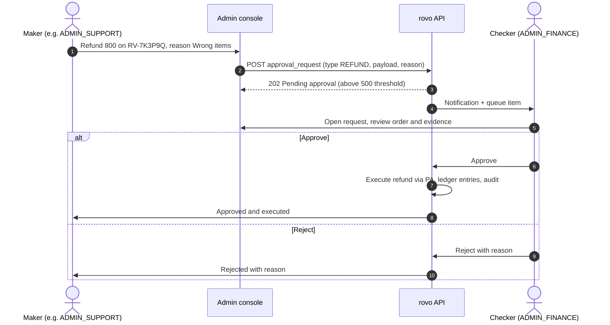
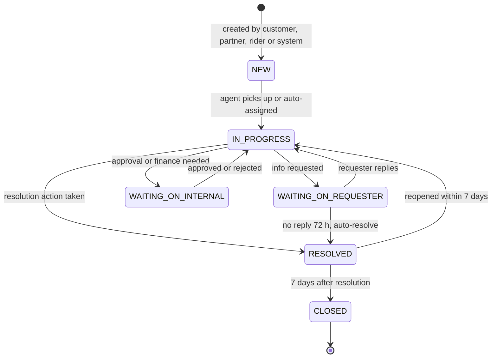
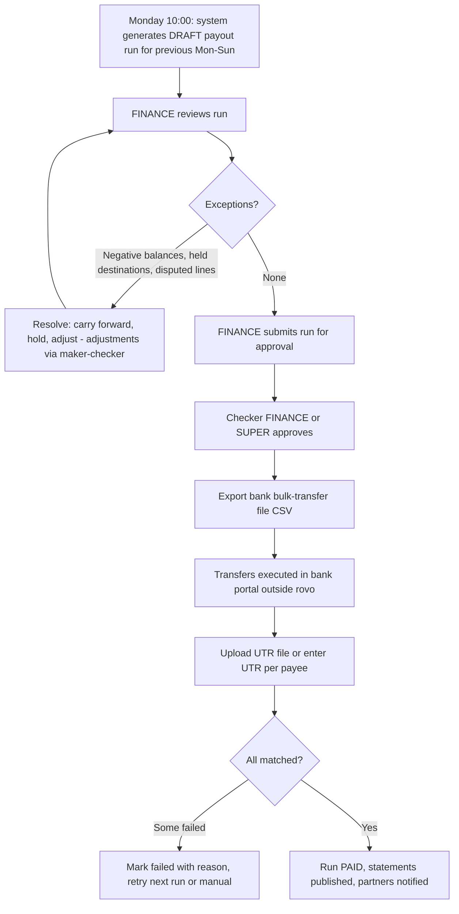

# 07 — Admin Console Workflow

| Field | Value |
|---|---|
| **Purpose** | Defines the `admin` app: who does what (`ADMIN_SUPER`, `ADMIN_OPS`, `ADMIN_SUPPORT`, `ADMIN_FINANCE`), the screens they use, and the intervention, approval, configuration and money workflows. It also says where maker-checker control is required. |
| **Owner** | UX Architect |
| **Status** | Draft v1 |
| **Depends on** | `00-planning-baseline.md` · `04`/`05`/`06` (journeys that admins support) · `12-auth-rbac.md` (admin auth, TOTP, city scoping) · `13-order-state-machine.md` (allowed admin transitions) · `14-payment-architecture.md` (refunds, ledger, settlements) · `16-delivery-zone-architecture.md` (zones, fees) · `19-security-threat-model.md` (audit, PII access) · `24-observability-strategy.md` (KPIs vs technical metrics) |

Tags: `[ASSUMPTION]`, `[OPEN]`, `[LEGAL]`. Canonical statuses as defined in the baseline.

---

## 1. Console principles

- **Desktop-first (≥ 1280 px)**, fully usable on a **tablet (768 px)**. The **Live board, order detail and SOS alerts also work at 360 px**, because ops staff in a small city will often be on a phone in the field `[ASSUMPTION]`. All other screens are allowed to be desktop-only.
- **City scope:** every screen has a city selector, fixed when the admin's `city_id` scope is a single city. All queries are filtered by scope server-side.
- **Real-time:** the dashboard and live board use an **admin SSE stream** (order / delivery / rider / restaurant-device events) with 15 s polling fallback. Alerts come with **sound** (opt-in per browser tab) and browser notifications.
- **PII minimisation:** customer and rider phone numbers are **masked by default** (`+91 98••• ••210`). A **"Reveal" / "Call"** action requires a reason (pick list) and is audit-logged. Document images (KYC) are viewable only by roles with KYC permission. Every view is logged.
- **Every write action** asks for a **reason code** (+ optional note), shows a **preview of consequences** (e.g. "Customer will be refunded ₹353 to UPI; restaurant will not be charged"), and writes an **audit entry** (actor, role, before/after, reason, IP, user agent, timestamp).
- **Keyboard-friendly:** global search (`/`) across order code (`RV-…`), phone, restaurant and rider name. `j/k` navigation on lists.
- Same accessibility baseline as doc 04 §1.4 (WCAG 2.2 AA). Status colour chips always also carry text.

---

## 2. Roles and permissions matrix (UX view; doc 12 is authoritative)

Legend: ✅ can do · 👁 view only · ✍ maker (request needs approval) · ☑ checker (can approve others' requests) · — no access

| Capability | SUPER | OPS | SUPPORT | FINANCE |
|---|---|---|---|---|
| Dashboard & live board | ✅ | ✅ | 👁 | 👁 |
| Call restaurant/rider/customer (reveal number) | ✅ | ✅ | ✅ | — |
| Reassign / manual assign rider | ✅ | ✅ | — | — |
| Cancel order with reason | ✅ | ✅ | ✅ (before `PICKED_UP`) | — |
| Act-on-behalf status changes (mark ready / picked up / delivered) | ✅ | ✅ | — | — |
| Approve rider "undeliverable" | ✅ | ✅ | ✅ | — |
| Refund ≤ threshold (default ₹500) | ✅ | ✅ | ✅ | ✅ |
| Refund > threshold | ✍/☑ | ✍ | ✍ | ☑ |
| Goodwill coupon ≤ ₹150 | ✅ | ✅ | ✅ | ✅ |
| Goodwill coupon > ₹150 | ✍/☑ | ✍ | ✍ | ☑ |
| Users: search, view | ✅ | ✅ | ✅ | 👁 |
| Users: block / disable COD / unblock | ✅ | ✅ | ✍ (OPS ☑) | — |
| Restaurants: approval queue, KYC review | ✅ | ✅ | — | 👁 (bank) |
| Restaurants: suspend / reinstate | ✅ | ✅ | — | — |
| Restaurant menu edit-on-behalf | ✅ | ✅ | — | — |
| Commission settings | ☑ | ✍ | — | ✍/☑ |
| Payout bank-detail change verification | ☑ | ✍ (verify docs) | — | ☑ |
| Riders: approval, suspend | ✅ | ✅ | — | — |
| Record cash deposit | ✅ | ✍ | — | ☑ (verify) |
| Rider cash write-off / ledger adjustment | ☑ | ✍ | — | ✍/☑ |
| Zones (polygons, pause/resume) | ✅ | ✅ | — | — |
| Fee configuration | ✅ | ✅ (versioned, effective-dated) | — | 👁 |
| Coupons: create / edit | ✅ | ✅ | — | ✅ |
| Coupons: budget > ₹10,000 | ☑ | ✍ | — | ✍/☑ |
| Tickets | ✅ | ✅ | ✅ | ✅ (payment/payout tickets) |
| Settlements: generate payout run | ✅ | — | — | ✍ |
| Settlements: approve run, mark paid (UTR) | ☑ | — | — | ☑ (not the same person as maker) |
| Reports / CSV exports | ✅ | ✅ (ops reports) | ✅ (ticket reports) | ✅ (financial) |
| Audit log viewer | ✅ | 👁 (own city, non-finance) | — | 👁 (finance entries) |
| Admin users & role grants | ✅ (☑ by second SUPER) | — | — | — |
| DPDP requests (export/delete user data) | ✅ | — | — | — |

---

## 3. Maker-checker policy

**Where it applies (V1):**

| Action | Threshold | Maker | Checker | Why |
|---|---|---|---|---|
| Manual refund | > ₹500 per order **or** > order total paid − already refunded (never allowed) | SUPPORT / OPS / SUPER | FINANCE / SUPER | Direct money out |
| Goodwill coupon (single-user) | > ₹150 | SUPPORT / OPS | FINANCE / SUPER | Money-equivalent |
| Commission change (any restaurant) | Always | OPS / FINANCE | FINANCE / SUPER | Contractual; affects payouts |
| Payout run (restaurants or riders) | Always | FINANCE | Another FINANCE / SUPER | Money out |
| Payout destination (bank/UPI) change for a partner | Always | OPS (verifies docs) | FINANCE / SUPER | #1 fraud vector; **first payout after a change is held 48 h** `[ASSUMPTION]` |
| Rider cash write-off / manual ledger adjustment | Always | OPS / FINANCE | FINANCE / SUPER | Ledger integrity |
| Cash deposit recorded at office | Always (verification) | OPS | FINANCE | Cash handling |
| Coupon with total budget > ₹10,000 | Above threshold | OPS / FINANCE | FINANCE / SUPER | Budget control |
| Admin role grant / scope change | Always | SUPER | Another SUPER | Privilege escalation |
| User unblock (fraud-blocked) | Always | SUPPORT | OPS / SUPER | Abuse prevention |

**Where it deliberately does *not* apply (speed matters, audit + preview instead):** order cancellations, reassignments, auto/rule-based refunds (system cancellations, auto-resolve ≤ ₹200), zone pause/resume, fee config changes (**effective-dated + preview + audit**; changes take effect at the next whole hour at the earliest, so mistakes can be reverted) `[OPEN — Security may require checker for fee config]`, and restaurant suspensions (safety first).

**Rules:**
- The maker can never approve their own request (enforced server-side, including SUPER).
- **Approval queue** (A-60) shows: request, maker, reason, consequences preview, and age. Actions: Approve / Reject (reason). The maker gets a notification of the outcome.
- **Expiry:** pending requests expire after 72 h.
- **Solo-operator fallback** (a very small launch team may not have two eligible people online): `ADMIN_SUPER` may invoke **"break-glass approve"** with a mandatory reason. The entry is flagged in the audit log and must be **post-reviewed** by a second person within 7 days. A weekly report lists these entries `[OPEN — challenge to baseline staffing assumptions]`.

---

## 4. Dashboard (A-01)

**Top KPI tiles** (live, city-scoped; each tile is clickable → filtered live board):

| Tile | Definition | Alert colour rule (configurable) |
|---|---|---|
| Active orders by status | Counts for `PLACED`, `ACCEPTED`/`PREPARING`, `READY_FOR_PICKUP`, `PICKED_UP` | — |
| **Unaccepted > N min** | `PLACED` for more than 3 min (N configurable) | Red if ≥ 1 |
| **Ready, no rider** | `READY_FOR_PICKUP` and delivery `UNASSIGNED`/`OFFERED` | Red if ≥ 1 for > 5 min |
| **Rider waiting at restaurant** | Delivery `AT_RESTAURANT` for more than 15 min | Amber |
| **Late deliveries** | now > promised ETA max, not `DELIVERED` | Red |
| **Payment pending** | `PENDING_PAYMENT` > 5 min (reconciliation issue) | Amber |
| Riders online | `ONLINE_IDLE` / `ON_DELIVERY` / `ONLINE_STALE` / `BLOCKED_COD` | Red if idle = 0 while unassigned > 0 |
| Restaurants | Open / Busy / Closed / **Device offline (while Open)** | Amber on device offline |
| SLA breaches today | Count by type (accept, prep, pickup, delivery, ticket response) | — |
| Today (business) | Orders delivered, GMV, average delivery time, cancellation % (by `cancelled_by`), rejection % | — |
| Open tickets | By priority, with oldest age | Red if any P1 > 15 min |
| **SOS** | Any open rider SOS | **Full-width red banner + sound** |

- An **alert feed** on the right: chronological events needing action (unaccepted order, rider silent, restaurant device offline, SOS, payment mismatch, undeliverable approval request). Each event can be **Acknowledged**, which assigns it to the admin ("Ravi (OPS) is handling").

---

## 5. Live order board and interventions (A-02, A-03)

### 5.1 Board (A-02)
- **Table view** (default on desktop) with columns: Code · Restaurant · Customer locality · Order status · Delivery status · Rider · Age · **SLA timer** (time left on the current step, red when breached) · Payment (COD/Prepaid) · Flags (🔔 escalated, ⚠ late, 🆘, 💬 ticket).
- **Default sort = risk**: breached first, then nearest to breach.
- Filters: status, delivery status, zone, restaurant, rider, flags, payment type. Saved views ("Unassigned", "Late", "My acknowledged").
- **Kanban view** toggle (columns by order status) for big-screen monitoring.
- Mobile (360 px): card list, sorted by risk.

### 5.2 Order detail drawer (A-03)
- **Header:** code, statuses, age, SLA, flags, quick actions.
- **Timeline:** every order and delivery status change, with actor (customer / restaurant device / rider / system / admin name), timestamp, and location for rider events. Offers log: rider, offer status (`PENDING/ACCEPTED/DECLINED/EXPIRED`), decline reason, time.
- **Items & bill:** as charged, coupon, payment attempts (PA ids, statuses), refunds.
- **Parties:** restaurant (status, device online?, phone [Call]), rider (availability, last location age, cash in hand, phone [Call]), customer (order count, COD eligibility, flags, phone [Call]).
- **Internal notes** (visible to admins only) and linked tickets.

### 5.3 Interventions

| Action | Allowed when | UX | Effects |
|---|---|---|---|
| **Call restaurant / rider / customer** | Any active order | Reason pick → reveal + `tel:` | Audit "PII reveal" |
| **Nudge** (push + sound to restaurant device or rider) | Active | One click | Event logged |
| **Manual assign rider** | Delivery `UNASSIGNED`/`OFFERED` | Panel: eligible riders sorted by distance to the restaurant (straight line × road factor), with availability, last-location age, active jobs, cash-in-hand / COD block. Choose → "Assign directly" (no offer; rider gets a full-screen "Assigned by rovo ops") **or** "Send offer" (45 s). | Pending offers cancelled; delivery `ASSIGNED` |
| **Reassign rider** | Delivery `ASSIGNED`/`AT_RESTAURANT` (not after `PICKED_UP`) | Reason (rider unreachable, rider request, too far, SOS) + compensation toggle for the old rider (default on if not the rider's fault) | Old rider gets "Order reassigned — do not pick up"; delivery back to `UNASSIGNED` or new delivery row (doc 13) |
| **Act on behalf** | Rider/restaurant device unavailable | Choose transition (e.g. mark `READY_FOR_PICKUP`, `PICKED_UP`, `DELIVERED` with COD amount) + mandatory reason | Status change attributed to admin |
| **Cancel order** | Any non-terminal status | Reason code (customer request, restaurant can't fulfil, no rider available, rider accident, payment issue, fraud suspected, other) + **customer-facing reason** (from catalog) + **refund decision** (full / partial / none, with suggested default per reason) + **who bears the cost** (`platform` / `restaurant` / `rider` — feeds settlement) + preview | `CANCELLED` (`cancelled_by=admin`), refund executed (or approval request if > threshold), notifications |
| **Approve undeliverable** | Rider request pending (doc 06 §8.1) | Shows call attempts log, wait time, rider location vs pin distance; Approve (reason) / Reject (instruct rider) | Delivery `FAILED`, order `UNDELIVERABLE` |
| **Issue refund** | Prepaid order, refundable amount > 0 | Full / partial / per-item (select items → auto-computed incl. tax share) + reason + cost bearer | PA refund (or approval request if > threshold) |
| **Issue goodwill coupon** | Any order (incl. COD) | Amount, expiry (default 30 days), min order (default none), message | Single-user coupon created; customer notified |
| **Extend ETA / message customer** | Active | Template picker ("Restaurant is running late, new ETA 9:10 pm") | Push + in-app |
| **Pause restaurant** | Restaurant open | Duration + reason | Outlet Busy |

---

## 6. Users (customers) (A-10, A-11)

- **Search:** phone (exact, full number entry, so no enumeration through partial-match lists), name, order code, email.
- **Profile (A-11):** masked phone, name, joined date, language, orders (count, last 10), cancellations, refunds & auto-resolutions (count, ₹, last 30 days), tickets, devices/sessions, flags (COD disabled, blocked, fraud suspected), addresses (locality + landmark only; full address on reveal).
- **Actions:** **Disable COD** (reason: refusals, fake orders), **Block** (cannot log in or order; reason required, customer sees "Your account is restricted, contact support"), **Unblock** (maker-checker for fraud blocks), **Force logout**, **Add note**, **DPDP: export data / delete account** (SUPER only; deletion anonymises PII while keeping order and financial records for statutory retention) `[LEGAL]`.

---

## 7. Restaurants (A-20 … A-26)

### 7.1 Approval queue (A-20)
Tabs: **Leads** (from the public form; assign to ops, call outcome, convert to application) · **Applications** (submitted wizards) · **Changes requested** · **Go-live pending** · **Live** · **Suspended**. Age column with SLA (review within 2 working days `[ASSUMPTION]`).

### 7.2 KYC review (A-21)
- A side-by-side layout: **document viewer** (zoom, rotate) on the left, **extracted fields + checklist** on the right.
- Checklist: FSSAI number format ✓; **FSSAI verified on the FoSCoS portal manually** (checkbox + screenshot upload) `[ASSUMPTION — no API in V1]`; licence category appropriate and **not expired**; name/address match the outlet; PAN format and name; GSTIN valid (optional, checked on the public GST portal manually); bank holder name matches PAN or business; cheque image legible; pin is on the storefront; photos acceptable.
- Per-field **"Request change"** with comment (visible to partner, doc 05 §3.4). Actions: **Approve** → go-live checklist; **Request changes**; **Reject** (reason, re-apply after 30 days).

### 7.3 Restaurant detail (A-22)
Profile, status (Live/Suspended), hours, device health (last heartbeat, devices list), today's metrics (accept rate, missed orders, average prep delay), ratings, menu (edit-on-behalf A-23, the same editors as doc 05 §5), documents (with expiry), payout destination, commission history, tickets, notes.

### 7.4 Suspend / reinstate (A-24)
Reason (FSSAI expired, hygiene complaint, repeated missed orders, fraud, contract ended, owner request) → immediately hidden from customers; in-flight orders continue unless "Cancel in-flight orders" is ticked. The partner sees a banner with the reason and the next steps. Reinstate requires a reason.

### 7.5 Commission settings with effective dates (A-25)
- A table of commission versions: `rate %`, `effective_from` (date, **must be in the future**, earliest = start of the next settlement cycle by default), `effective_to` (auto-filled when the next version starts), created by, approved by.
- Optional per-restaurant overrides of packaging policy and payout cycle `[OPEN]`.
- **No back-dating.** Corrections to past cycles go through ledger adjustments (maker-checker).
- **Change flow:** maker enters new rate + effective date + reason (+ contract addendum upload) → preview ("Estimated impact last 4 weeks: −₹1,240 for the partner") → approval request → checker approves → the partner is notified (in-app + SMS) at least 7 days before effect `[LEGAL — contractual notice period]`.

### 7.6 Payout destination change (A-26)
Partner-initiated change (doc 05) or ops-entered → document check (cheque/passbook) → maker (OPS) → checker (FINANCE). On approval: the **next payout is held 48 h** and the owner is notified by SMS to their registered phone: "Your bank account for rovo payouts was changed. Not you? Call…".

---

## 8. Delivery partners (A-30 … A-34)

- **Approval queue (A-30):** tabs Applied / Changes requested / Training / Ready to activate / Active / Suspended.
- **KYC review (A-31):** selfie vs DL photo side by side, DL number + expiry + vehicle class, RC number + vehicle type, PAN, payout destination name match. Same request-change/approve/reject pattern as for restaurants.
- **Training & kit (A-32):** module completion, quiz scores, "trained in person" toggle, **kit issued** (bag number, T-shirt size, deposit amount if any `[OPEN]`). **Activate** button enabled when all are complete.
- **Rider detail (A-33):** availability, last location (on a small map — admin only), today's trips, acceptance/cancellation rates, ratings (👍/👎 counts + tags), complaints, **cash in hand** + limit, deposits, earnings, payouts, documents & expiry, SOS history, notes.
- **Actions:** suspend (reason; if the rider has an active delivery → prompt to reassign first), reinstate, adjust cash limit (per rider override, maker-checker if above default), force offline.
- **Cash deposits (A-34):**
  - **Record office deposit** (OPS): rider (search) → amount → receipt number → optional photo of the receipt → submit → status **Pending verification**.
  - **Verify** (FINANCE): daily list; tick against the bank deposit / cash count → Verified (cash-in-hand reduces) or Rejected (reason).
  - UPI deposits via PA auto-verify (listed read-only).
  - **Cash ageing report:** riders with cash in hand > 48 h or above the limit.

---

## 9. Zones and fee configuration (A-40 … A-43)

- **Zones list (A-40):** name, city, status (Active / Paused / Draft), area km², restaurants count, last-7-days orders.
- **Zone editor (A-41):** MapLibre map with polygon draw/edit (vertex drag), **localities overlay**, restaurants as pins. Validation: no self-intersection, overlaps warned (Backend decides precedence). Save as **Draft → Publish** (preview: "This change makes 312 saved addresses unserviceable / 45 newly serviceable") `[ASSUMPTION — computable via PostGIS]`.
- **Zone pause/resume (A-42):** reason (heavy rain, festival crowd, rider shortage, political bandh) + optional auto-resume time + **customer message** (en/te). Customers see "Deliveries paused in your area" (doc 04 §3.3).
- **Fee configuration (A-43)** — versioned and effective-dated per city (with optional zone overrides):
  - Delivery fee slabs (distance from–to km → ₹), default from the baseline (0–2 ₹20 · 2–4 ₹30 · 4–6 ₹40 · 6–8 ₹50)
  - Max delivery radius (default 7 km), road factor (default 1.3)
  - Platform fee (₹5), small-cart fee (₹15 below ₹149)
  - Free-delivery threshold (optional, campaign-bound)
  - COD max order value, COD enabled per zone
  - Rider pay: base, per-km beyond X km, waiting-pay start minute and rate, cash-in-hand limit
  - **Surcharge** (rain / late night) as a manual toggle with a fixed amount and an "always shown as a separate line" rule `[OPEN — V1 nice-to-have; must be disclosed upfront per doc 04 §1.6]`
  - **Fee simulator:** pick a restaurant + drop point (or locality) + cart value → shows the customer bill lines and rider pay. Mandatory step before publishing a fee change.
- **Localities (A-44):** name (en/te), PIN code, centroid or polygon, popular flag, search synonyms.

---

## 10. Coupons (A-50, A-51)

**Coupon create wizard (A-51):**
1. **Basics:** code (uppercase, unique; or "auto-generate single-use codes" for goodwill), title and description (en/te), terms (auto-generated from the rules below, editable).
2. **Benefit:** flat ₹ off · % off with **max cap** · free delivery. Applies to item total (not fees/taxes) `[ASSUMPTION]`.
3. **Conditions:** min item total, valid from/to (date-time, city timezone), days/hours (optional), payment methods (all / online only), first order only (new users), specific restaurants / cuisines / zones.
4. **Limits:** per-user uses (default 1), total redemptions cap, **total budget cap (₹)** — auto-pauses when reached, per-day budget (optional).
5. **Funding:** rovo-funded / restaurant-funded / shared (% split). Restaurant-funded coupons require restaurant consent (an opt-in record from the partner app or a signed addendum) `[LEGAL]`. Funding feeds settlements.
6. **Visibility:** show in offers carousel / restaurant page / hidden (code only).
7. **Preview & publish** (checker if budget > ₹10,000).

**Coupon list/detail (A-50):** status (Scheduled / Active / Paused / Exhausted / Expired), redemptions, budget burn bar, ₹ discount given, orders influenced, top restaurants. Actions: pause/resume, extend end date, raise cap (re-approval above threshold), clone.

**Abuse controls (UX surfacing):** a flag on accounts that redeem first-order coupons from the same device or address multiple times `[OPEN — fraud rules owned by doc 19]`.

---

## 11. Disputes and tickets (A-70, A-71)

### 11.1 Lifecycle

`[OPEN — Backend to confirm ticket status names; proposed here]`

### 11.2 Priority and SLAs (defaults, configurable)

| Priority | Examples | First response | Resolution target |
|---|---|---|---|
| **P1** | Rider SOS, safety, harassment, "didn't receive my order" (within 2 h), active order stuck | 5 min | 1 h |
| **P2** | Active order issues (late, cancel request, address), restaurant "can't make this order" | 15 min | 2 h |
| **P3** | Delivered-order issues (missing/wrong/quality), refunds status, rider payout question | 4 working h | 24 h |
| **P4** | General, account, menu change help, feedback | 1 working day | 3 working days |

Grievance timelines under the Consumer Protection (E-Commerce) Rules, 2020 (acknowledge within 48 h, redress within one month) are the **legal floor**; our SLAs above are stricter `[LEGAL — verify]`.

### 11.3 Ticket workspace (A-71)
- **Left:** ticket queue (my tickets / unassigned / by priority, with SLA timers).
- **Centre:** conversation thread (messages, photos, system events), **macros** (canned replies in en/te), internal notes.
- **Right:** context panel — the order (timeline, items, bill, payments, refunds), customer history (refund frequency, flags), restaurant and rider involved, previous tickets.
- **Resolution actions** (each records a resolution code on the ticket): full/partial/per-item refund (maker-checker over threshold) · goodwill coupon · cancel order · re-deliver (create a replacement order at ₹0 for the customer, cost bearer chosen) `[OPEN — V1.1]` · warn/suspend rider · flag restaurant (quality) · charge-back to restaurant/rider in settlement (cost bearer) · no action (explain).
- **Fault attribution** (required on resolution; codes per doc 01 BR-REF-005): `platform` / `restaurant` / `rider` / `customer` / `unknown`. Feeds settlement deductions and partner quality metrics.
- CSAT result shown after closure.

---

## 12. Commissions and settlements (A-80 … A-83)

### 12.1 Weekly payout run

- **Run screen (A-80):** totals (payees, gross, commission, GST on commission, TCS/TDS, adjustments, net), exceptions panel, per-payee table (restaurant/rider, net, destination masked, status), filters.
- **Payee statement (A-81):** the same view the partner sees (doc 05 §7, doc 06 §10) plus internal ledger links.
- **Mark paid (A-82):** UTR per payee (manual entry or CSV upload `payee_id, amount_paise, utr, paid_on`), validation that amount matches, and the payout destination snapshot at approval time is shown (to detect changes).
- **Rider on-demand payouts (A-83):** request queue (doc 06 §10.1) → same approve → UTR flow, batched daily.
- Negative net payouts (penalties > earnings) are carried forward; never auto-debited in V1.
- `[LEGAL]` Tax invoices for commission, TCS/TDS computations and GST returns are designed in doc 14; this UI only displays and exports them.

---

## 13. Reports and exports (A-90)

Every export: choose report + date range + city/zone → generated asynchronously (job) → download link valid 24 h → **audit-logged**. PII columns are masked unless the role permits and the "include PII" box is ticked with a reason.

| Report | Roles | Key columns |
|---|---|---|
| Orders | SUPER, OPS, FINANCE | code, timestamps per status, restaurant, zone, payment type, item total, fees, taxes, discount, total, cancel/reject reasons, `cancelled_by` |
| Deliveries & SLA | SUPER, OPS | delivery times per step, offers count, declines, wait times, rider, distance |
| Restaurant performance | SUPER, OPS | accept time, missed, rejections, prep delays, ratings, pause minutes |
| Rider performance & earnings | SUPER, OPS, FINANCE | trips, earnings breakdown, acceptance rate, cash collected/deposited |
| Settlements & payouts | SUPER, FINANCE | per payee per cycle, UTRs |
| Refunds & goodwill | SUPER, FINANCE, SUPPORT (own) | order, amount, reason, approver, fault |
| Coupons | SUPER, OPS, FINANCE | redemptions, discount ₹, funding split |
| Tickets | SUPER, SUPPORT | category, priority, SLA met, resolution, CSAT |
| Tax (GST §9(5), TCS) | SUPER, FINANCE | `[LEGAL]` format per doc 14 |
| Cash ledger | SUPER, FINANCE | rider, COD collected, deposits, outstanding, ageing |

---

## 14. Audit log viewer (A-95)

- **Filters:** actor (admin, partner, rider, customer, system), role, action type, entity type + ID (order, restaurant, rider, user, coupon, config, payout), date range, "sensitive only" (PII reveal, money, config, role changes, break-glass).
- **Row:** timestamp, actor + role + city scope, action, entity link, reason, IP/user agent, approval reference (if maker-checker).
- **Detail:** a before/after JSON diff, rendered as a field table.
- **Immutable** (append-only; no edit/delete UI). Export follows the §13 rules.

---

## 15. Screen inventory (admin)

| ID | Screen | Purpose | Key components | Loading | Empty | Error |
|---|---|---|---|---|---|---|
| A-00 | Login | Email + password + TOTP | Form, TOTP, lockout notice | Spinner | — | Invalid creds, TOTP wrong, locked |
| A-01 | Dashboard | Live health | KPI tiles, alert feed, SOS banner | Tile skeletons | "All quiet" | Stream disconnected banner + polling |
| A-02 | Live order board | Monitor & act | Table/kanban, risk sort, filters, saved views | Table skeleton | "No active orders" | Stream lost banner |
| A-03 | Order detail drawer | Context + interventions | Timeline, offers log, bill, parties, actions | Skeleton | — | Action failure with reason (e.g. status changed meanwhile → refresh) |
| A-04 | Manual assign panel | Pick rider | Eligible riders by distance, filters | Skeleton | "No riders online" + suggest broadcast | Assign conflict |
| A-05 | Cancel/refund dialogs | Money-safe actions | Reason, customer reason, refund calc, cost bearer, preview | — | — | Above threshold → approval request notice |
| A-10 | User search | Find customers | Search bar, results | — | "No match" | — |
| A-11 | User profile | Manage customer | History, flags, actions | Skeleton | — | — |
| A-20 | Restaurant queue | Leads & approvals | Tabs, SLA ages | Skeleton | "Queue empty" | — |
| A-21 | Restaurant KYC review | Verify docs | Doc viewer, checklist, request change | Doc loading | — | Doc missing |
| A-22 | Restaurant detail | Manage outlet | Profile, health, metrics, docs, commission history | Skeleton | — | — |
| A-23 | Menu edit-on-behalf | Assisted menu | Partner editors (doc 05) | — | — | — |
| A-24 | Suspend dialog | Suspend/reinstate | Reason, in-flight handling | — | — | — |
| A-25 | Commission settings | Versioned rates | Versions table, new version form, impact preview | — | — | Back-date blocked |
| A-26 | Payout destination change | Bank change verify | Docs, maker/checker | — | — | — |
| A-30 | Rider queue | Approvals | Tabs | Skeleton | — | — |
| A-31 | Rider KYC review | Verify docs | Selfie vs DL, checklist | Doc loading | — | — |
| A-32 | Training & kit | Activation | Modules, kit, activate | — | — | — |
| A-33 | Rider detail | Manage rider | Availability, metrics, cash, docs, actions | Skeleton | — | — |
| A-34 | Cash deposits | Record/verify | Record form, verification list, ageing | Skeleton | "No pending deposits" | Amount mismatch |
| A-40 | Zones list | Overview | Table | Skeleton | "Create first zone" | — |
| A-41 | Zone editor | Draw polygons | Map draw, overlays, impact preview, publish | Tiles | — | Invalid polygon |
| A-42 | Zone pause | Pause/resume | Reason, auto-resume, message | — | — | — |
| A-43 | Fee configuration | Pricing | Versioned form, simulator, effective date | — | — | Validation (slab gaps/overlaps) |
| A-44 | Localities | Address & search data | Table, en/te names, synonyms | — | — | — |
| A-50 | Coupons list | Manage | Status, burn bars | Skeleton | "No coupons" | — |
| A-51 | Coupon wizard | Create/edit | Steps §10 | — | — | Validation (code exists, cap < min) |
| A-60 | Approvals queue | Maker-checker | Pending requests, preview, approve/reject | Skeleton | "Nothing to approve" | Self-approval blocked |
| A-70 | Ticket queue | Support | Queues, SLA timers | Skeleton | "Inbox zero" | — |
| A-71 | Ticket workspace | Resolve | Thread, macros, context, resolution actions | Skeleton | — | — |
| A-80 | Payout run | Settlements | Totals, exceptions, payees | Skeleton | "No run yet this week" | Generation failed → retry |
| A-81 | Payee statement | Detail | Lines, ledger links | Skeleton | — | — |
| A-82 | Mark paid / UTR upload | Close run | UTR entry/CSV, validation | Upload progress | — | Row-level mismatches |
| A-83 | Rider payout requests | On-demand | Queue, approve | Skeleton | — | — |
| A-90 | Reports | Exports | Report picker, jobs list | Job progress | — | Job failed |
| A-95 | Audit log | Accountability | Filters, rows, diff | Skeleton | "No entries" | — |
| A-99 | Admin users | Access mgmt | Users, roles, city scope, TOTP reset (maker-checker) | — | — | — |

---

## 16. Requirements for Backend / Frontend; challenges

**Requirements**
1. **Admin SSE stream** (city-scoped) with order, delivery, rider availability, restaurant device liveness, SOS, ticket and approval events. Polling fallback.
2. **SLA engine** producing per-order "current step deadline" and breach events (used by the board sort and the alert feed).
3. **Generic `approval_request`** entity (type, payload, maker, checker, status, expiry, break-glass flag) used by refunds, coupons, commission, payouts, ledger adjustments, destination changes and role grants. Server-enforced "maker ≠ checker".
4. **Reason-code catalogs** (internal + customer-facing, en/te) for cancel, reject, undeliverable, suspend, refund, block.
5. **Cost-bearer and fault attribution** on cancellations, refunds and ticket resolutions → ledger.
6. **Effective-dated versioning** for commission and fee configs (no back-dating; future-dated only).
7. **PII reveal endpoint** with reason, plus audit. Masked by default in all list APIs.
8. **Async export jobs** with signed, expiring download URLs.
9. **Append-only audit log** with before/after diffs for every admin write.

**Challenges / notes on the baseline**
- **Maker-checker needs two people per role.** A tiny launch team may not have them, hence the proposed **break-glass + post-review** rule.
- **Ticket status names** are not in the baseline; proposed in §11.1 for doc 13/10.
- **Fee config without a checker** (effective-dated + preview instead) keeps ops agile; Security may overrule.
- **No wallet:** goodwill uses single-user coupons (doc 04 §17).
