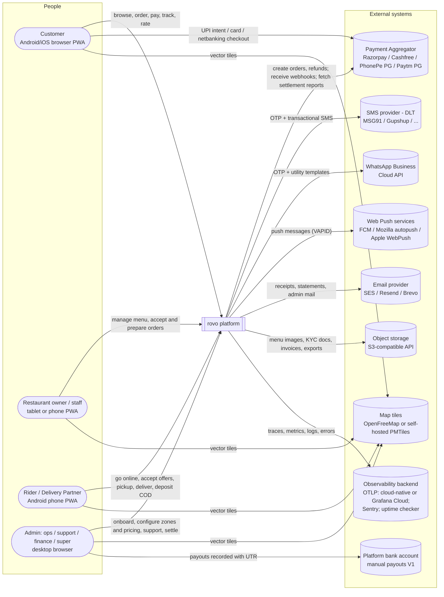
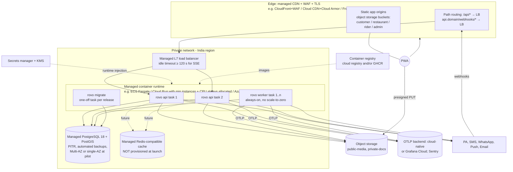
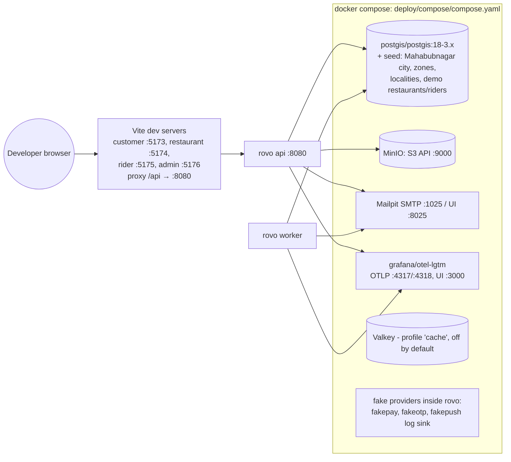
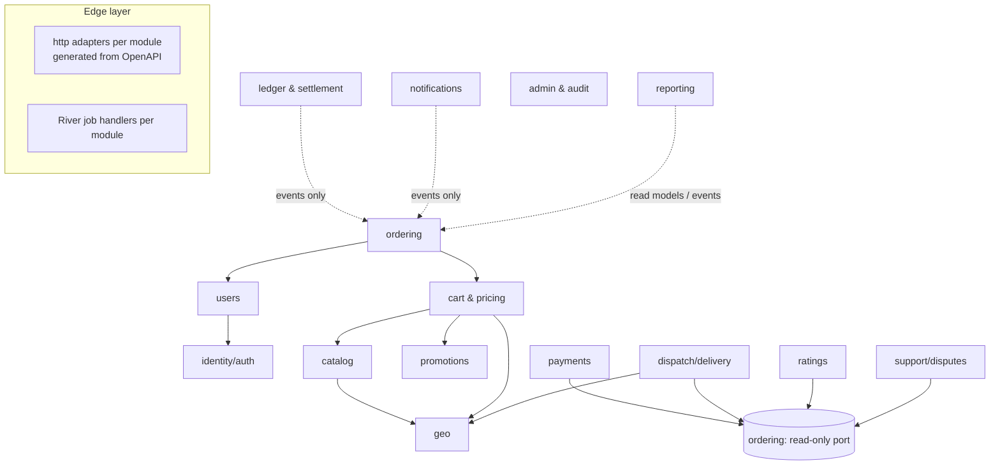
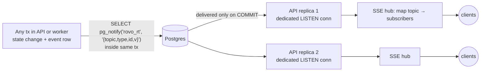

# 08 — System Architecture

| | |
|---|---|
| **Purpose** | Defines the shape of the rovo system: its context, containers, the module layout of the Go modular monolith, key runtime sequences, real-time design, consistency rules, caching, scaling, multi-city expansion and failure handling. |
| **Owner** | Solution Architect |
| **Status** | Draft v1 (Phase 1 — planning only) |
| **Depends on** | `00-planning-baseline.md` (vocabulary, P1–P17) |
| **Feeds / must stay consistent with** | `09-architecture-decision-records.md` (the reasons behind each choice here), `10-database-schema.md` (table names here are indicative; doc 10 is authoritative), `11-api-specification.md`, `12-auth-rbac.md`, `13-order-state-machine.md` (transition tables), `14-payment-architecture.md`, `15-notification-architecture.md`, `16-delivery-zone-architecture.md`, `17-frontend-architecture.md`, `22-deployment-architecture.md`, `24-observability-strategy.md`, `26-repository-structure.md` |

Tags: `[ASSUMPTION]` = believed true, must be validated; `[OPEN]` = needs a decision by the named owner; `[LEGAL]` = needs legal/tax review before launch.

---

## 0. Summary (one screen)

- **One Go binary** (`rovo`), three run modes: `rovo api` (HTTP + SSE), `rovo worker` (River jobs, schedulers, dispatch timers), `rovo migrate` (goose + River migrations, run as a one-off job before each deploy). The same OCI image (amd64 + arm64) runs on a laptop, in CI, in staging and in production.
- **Environments (baseline §4a, user directive 2026-10-04):** *local* = Docker Compose on the developer machine with fakes for every paid provider. *Staging and production* = **managed services on a standard hyperscaler in an India region** (managed container runtime, managed PostgreSQL + PostGIS with PITR, object storage + CDN, secrets manager/KMS, WAF), provisioned with **Terraform/OpenTofu** (ADR-026). DevOps picks the specific cloud (docs 22/25). This document stays cloud-neutral: the application depends only on **standard interfaces** (ADR-025): Postgres wire protocol + PostGIS, S3-compatible object storage, Redis protocol (optional), OTLP, OCI images and env-var config with runtime-injected secrets.
- **One PostgreSQL 18 + PostGIS database** is the only *required* stateful backend. It holds business data, the job queue (River), the event log, idempotency keys, sessions, rate-limit counters and the ledger. **No message broker.** **Redis is not required at launch.** Production can enable a managed Redis-compatible cache by configuration alone when a trigger in ADR-007 fires.
- **Four static PWAs** (customer, restaurant, rider, admin), built with Vite and served from object storage + CDN. Each app host proxies `/api/*` to the Go API (**same-origin API**, per docs 12 and 17), so there is no CORS and each app gets host-only cookies. Clients talk REST/JSON (OpenAPI 3.1 spec-first) and receive live updates via **SSE**. The baseline's combined `partner` app is split into `restaurant` + `rider` (doc 17 decision F2, endorsed in ADR-009).
- **Modules communicate in-process** through Go interfaces (sync) and through **domain events persisted in the same transaction** as the state change, delivered by River jobs (async). No module reads or writes another module's tables.
- **Real-time:** a state change commits → `pg_notify` (transactional, so it is delivered only on commit) → every API replica's SSE hub fans it out to subscribed clients. SSE messages are **invalidation hints plus small payloads**. REST is the source of truth, so a missed SSE message is harmless.
- **Money:** integer paise and an append-only double-entry ledger. A licensed payment aggregator moves all electronic money (doc 14).
- **Scaling path:** production starts at 2 API tasks + 1–2 worker tasks on managed containers with a managed (Multi-AZ, or single-AZ at pilot) Postgres → scale tasks horizontally → bigger DB instance + read replica → managed Redis by config for proven needs → extract dispatch or notifications only if they become hot spots. Kubernetes only if the chosen managed runtime requires it or the criteria in §9.5 are met.

---

## 1. System context (C4 level 1)



**Trust boundaries:**
1. Internet ↔ edge (CDN + WAF).
2. Edge ↔ load balancer ↔ API tasks in a private network. The origin only accepts traffic from the edge (doc 22).
3. API/worker ↔ managed DB and cache over **private networking only**. No public DB endpoint.
4. API/worker ↔ third-party providers. Outbound only, except PA and messaging webhooks, which arrive inbound and are signature-verified on the dedicated `api.<domain>` host (bearer-only, no cookies, per doc 12).
5. Admin surface on `admin.<domain>`: an edge access gate plus admin audience, RBAC and TOTP (doc 12). It is served by the same API process under `/api/v1/admin/*`.

---

## 2. Containers (C4 level 2)

### 2.1 Logical containers (same in every environment)

| Container | Tech | Responsibility | Scales by | State |
|---|---|---|---|---|
| Customer PWA | React + TS, Vite, vite-plugin-pwa | Discovery, cart, checkout, tracking, ratings, support | CDN | none (IndexedDB cache only) |
| Restaurant PWA | same stack | Order inbox with loud alert loop, menu and availability, hours, payouts view | CDN | none |
| Rider PWA | same stack | Online/offline, foreground location ping, offers, pickup and drop flow, COD cash, earnings | CDN | none |
| Admin SPA | same stack (no service worker) | Onboarding, zones, pricing, live ops board, support, finance, audit | CDN | none |
| `rovo api` | Go 1.27, net/http ServeMux, oapi-codegen strict server | Auth, REST, SSE, webhooks, presigned uploads | Horizontal tasks (stateless apart from live SSE connections) | none |
| `rovo worker` | Go, River | Event fan-out, notifications, dispatch offers and expiry, payment polling, reconciliation, settlement statements, cleanups | Horizontal tasks (River coordinates via `SKIP LOCKED`; leader election for periodic jobs) | none |
| `rovo migrate` | same image | goose + River migrations, run as a one-off task/job per deploy | — | none |
| PostgreSQL + PostGIS | PG 18.x, PostGIS 3.x | System of record. Also the River queue, the LISTEN/NOTIFY bus, sessions, rate limits | Instance size → read replica | yes |
| Object storage | S3-compatible API | Public media bucket (images), private docs bucket (KYC, invoices, exports) | n/a | yes |
| Redis-compatible cache | Valkey/Redis protocol | **Optional; disabled at launch** (ADR-007). Enabled by config. | managed | ephemeral |
| Edge | CDN + WAF + TLS | Static apps, `/api/*` path routing to the API, rate limiting, bot protection | managed | none |

**Why the worker is a separate process/service:** a burst of jobs (notification storm, reconciliation) cannot starve HTTP latency. API deploys don't interrupt dispatch timers. The two scale independently. Both come from the same image. Local dev may run `rovo all` (both in one process) for convenience.

### 2.2 Production / staging shape (managed cloud, provider-neutral)



Requirements this shape places on DevOps (docs 22/25):
- **Always-on compute** for both API (SSE) and worker (timers, River). No scale-to-zero in production. On Cloud Run this means min instances ≥ 1 with instance-based billing (CPU always allocated). On Container Apps it means min replicas ≥ 1.
- **Long-lived HTTP streams:** LB/edge idle timeouts must exceed the 20 s SSE heartbeat. Any hard maximum request duration (for example a platform request timeout) only causes a client reconnect, which the design tolerates (§6.2).
- **The LISTEN connection is direct to Postgres.** It must not go through a transaction-pooling proxy (PgBouncer transaction mode, or connection proxies that pin or refuse `LISTEN`). The worker and API pools may use a proxy.
- **Migrations** run as a one-off task before the new task definition rolls out. They follow expand/contract only (doc 21).
- **Secrets** (DB password or IAM auth token, PA keys, provider keys, VAPID private key) are injected as env vars or files by the runtime from the secrets manager. The app never calls a cloud secrets SDK (ADR-025).
- **Object storage** is accessed through the S3 API. On GCP that means GCS XML-API interoperability with HMAC keys. On Azure it means an S3-compatible gateway or a second `BlobStore` adapter. See ADR-025.

### 2.3 Local development shape (Docker Compose)



The full golden flow runs offline. `PAYMENTS_PROVIDER=fake` simulates checkout, delayed webhooks and failures. `OTP_PROVIDER=fake` writes OTPs to logs and a dev-only endpoint. Push and SMS go to log sinks. A PA sandbox (Razorpay test mode) can be enabled with real test keys and a tunnel for webhooks (doc 26 §8).

## 3. Components: the Go modular monolith (C4 level 3)

### 3.1 Module map and dependency direction



**Rules of direction** (enforced in CI, §4.3):
1. Synchronous calls (Go interface calls) go **downward only**: `ordering → pricing → catalog → geo`. A lower module never imports a higher one. No cycles.
2. Reacting to something that happened in another module is always **asynchronous via a domain event**. Examples: ledger posting on `OrderDelivered`, notifications on almost everything, dispatch starting on `OrderAccepted`.
3. `ordering` needs to learn about payment results and dispatch progress, but it must not import `payments` or `dispatch`. Those modules depend on `ordering`'s narrow **command port** (`ordering.Transitions`), or they emit events that ordering consumes. V1 uses events consumed by ordering's handlers, so the dependency arrow stays one-way and the coupling is visible in one place (the event subscription table).
4. `platform/*` packages (db, httpx, auth middleware, otel, config, outbox/events, queue, clock, idgen, money) are importable by everyone and import no module.

### 3.2 Module catalogue

Table names are indicative. `10-database-schema.md` is authoritative. "Public interface" means the exported Go API in the module's root package; everything else lives under the module's nested `internal/` directory, so the **Go compiler** forbids other modules from importing it (see §4.2).

#### identity (auth)
- **Responsibility:** OTP issue/verify, admin password + TOTP, sessions and refresh tokens, device registry, RBAC role grants (scoped by `city_id`), rate limits for auth endpoints.
- **Owned tables:** `auth_identities` (phone/email ↔ user), `otp_challenges`, `sessions`, `refresh_tokens`, `role_grants`, `admin_credentials` (password hash, TOTP secret encrypted), `rate_limit_buckets` (shared platform facility, schema owned here).
- **Public interface:**
  ```go
  type Service interface {
      StartOTP(ctx context.Context, in StartOTPInput) (ChallengeID, error)
      VerifyOTP(ctx context.Context, in VerifyOTPInput) (Session, error)
      Authenticate(ctx context.Context, token string) (Principal, error) // used by middleware
      Refresh(ctx context.Context, refreshToken string) (Session, error)
      Revoke(ctx context.Context, sessionID uuid.UUID) error
      Grant(ctx context.Context, userID uuid.UUID, role Role, cityID *uuid.UUID) error
  }
  type Principal struct { UserID uuid.UUID; Roles []RoleGrant; SessionID uuid.UUID }
  ```
- **Emits:** `UserSignedUp`, `OTPRequested` (consumed by notifications to deliver the OTP), `SessionRevoked`, `RoleGranted`.
- **Consumes:** `RiderSuspended` and `RestaurantStaffRemoved` (revoke sessions).

#### users
- **Responsibility:** customer profiles, saved addresses, rider profiles (vehicle, KYC status, bank/UPI payout details by reference), restaurant staff membership, consent records (DPDP), notification preferences.
- **Owned tables:** `users`, `customer_profiles`, `addresses`, `rider_profiles`, `rider_documents` (object keys only), `restaurant_members`, `consents`, `notification_preferences`, `push_subscriptions`.
- **Public interface:** `GetUser`, `GetAddress(ctx, userID, addressID)` (ownership-checked), `RiderEligibility(ctx, riderID) (Eligibility, error)`, `MembershipOf(ctx, userID) ([]RestaurantMembership, error)`, `Preferences(ctx, userID)`.
- **Emits:** `RiderApproved`, `RiderSuspended`, `AddressCreated`, `ConsentChanged`, `AccountDeletionRequested`.
- **Consumes:** `UserSignedUp`.

#### geo (cities, zones, localities, serviceability)
- **Responsibility:** cities (timezone, currency, config), zone polygons, localities, serviceability checks, distance estimation (haversine × road factor), rider last-known location store, and a geo index for dispatch candidate search.
- **Owned tables:** `cities`, `zones`, `localities`, `rider_locations` (one row per rider, upserted), `rider_location_samples` (sparse history with short retention for disputes, see doc 19/DPDP).
- **Public interface:**
  ```go
  type Service interface {
      Serviceability(ctx context.Context, cityID uuid.UUID, pt LatLng, restaurantID uuid.UUID, maxRadiusM int) (Serviceable, error)
      ZoneFor(ctx context.Context, cityID uuid.UUID, pt LatLng) (*Zone, error)
      EstimateDistance(a, b LatLng, cityID uuid.UUID) Meters // straight-line × city road_factor
      UpsertRiderLocation(ctx context.Context, riderID uuid.UUID, pt LatLng, acc float64, at time.Time) error
      NearbyRiders(ctx context.Context, q NearbyQuery) ([]RiderCandidate, error) // used by dispatch
      City(ctx context.Context, id uuid.UUID) (City, error)
  }
  ```
- **Emits:** `ZoneChanged` (cache invalidation), `CityConfigChanged`.
- **Consumes:** none.
- *Note:* `rider_locations` lives in geo, not dispatch, because it is a spatial index concern. Dispatch reads it only through `NearbyRiders`.

#### catalog (restaurants, menus)
- **Responsibility:** restaurant (outlet) records, FSSAI and GST identifiers, operating hours, open/close and "busy" toggles, prep-time defaults, menu categories, items, variants, add-ons, item availability (in stock), images, Telugu names, listing search (Postgres FTS + `pg_trgm`).
- **Owned tables:** `restaurants`, `restaurant_hours`, `restaurant_status_overrides`, `menu_categories`, `menu_items`, `item_variants`, `addon_groups`, `addons`, `item_availability`.
- **Public interface:** `ListServiceableRestaurants(ctx, cityID, pt, filters)`, `GetMenu(ctx, restaurantID) (Menu, version)`, `PriceItems(ctx, restaurantID, lines) ([]PricedLine, error)` (current prices and availability, used by pricing), `IsOpen(ctx, restaurantID, at)`, `Restaurant(ctx, id)`.
- **Emits:** `RestaurantOnboarded`, `RestaurantOpened` / `RestaurantClosed`, `MenuChanged` (version bump → cache/ETag invalidation), `ItemOutOfStock`.
- **Consumes:** `OrderAccepted` (optional: auto-busy when queue is long, deferred).

#### cart & pricing (quote engine)
- **Responsibility:** server-side cart (one active cart per customer per restaurant), **quote** computation: item subtotal, packaging, delivery fee slab, small-cart fee, platform fee, coupon discount, GST lines and totals. A quote is an immutable snapshot with a short TTL. Order placement must reference a valid quote. Pricing config is versioned per city/zone/restaurant with effective dates.
- **Owned tables:** `carts`, `cart_lines`, `pricing_configs` (fee slabs, platform fee, small-cart rule, tax rates by `tax_code`), `quotes` (JSONB breakdown + hash, `expires_at`).
- **Public interface:**
  ```go
  type Service interface {
      UpsertCart(ctx context.Context, customerID uuid.UUID, in CartInput) (Cart, error)
      Quote(ctx context.Context, customerID uuid.UUID, in QuoteInput) (Quote, error)          // persisted snapshot
      ValidateQuote(ctx context.Context, tx db.Tx, quoteID uuid.UUID, customerID uuid.UUID) (Quote, error) // re-checks TTL and availability inside caller's tx
  }
  ```
- **Emits:** none of business significance (a `QuoteCreated` metric only).
- **Consumes:** `MenuChanged` (invalidate open quotes), `PricingConfigChanged`.

#### promotions (coupons)
- **Responsibility:** coupon definitions (city/zone/restaurant scope, funding split between platform and restaurant, caps, min order, per-user limit, validity), eligibility evaluation, redemption reservation and release.
- **Owned tables:** `coupons`, `coupon_redemptions`.
- **Public interface:** `Evaluate(ctx, CouponContext) (Discount, error)`, `Reserve(ctx, tx, couponID, customerID, orderID) error` (inside the order-placement tx), `Release(ctx, orderID) error`.
- **Emits:** `CouponRedeemed`, `CouponReleased`.
- **Consumes:** `OrderCancelled`, `OrderRejected`, `PaymentFailed` (release reservation), `OrderDelivered` (finalise).

#### ordering (state machine)
- **Responsibility:** order aggregate (header, line snapshot, price snapshot from quote, address snapshot), the canonical **order state machine** (doc 13), cancellation rules, restaurant accept/reject/prep-time, timeouts (accept timeout, payment pending timeout), human-friendly order code `RV-XXXXXX`, customer and restaurant order queries.
- **Owned tables:** `orders` (with `status`, `version`, `cancel_reason`, `cancelled_by`), `order_lines`, `order_status_history`, `order_address_snapshots`.
- **Public interface:**
  ```go
  type Service interface {
      Place(ctx context.Context, in PlaceOrderInput) (Order, error)                // idempotent per Idempotency-Key
      Get(ctx context.Context, viewer Principal, id uuid.UUID) (OrderView, error)
      Transition(ctx context.Context, cmd TransitionCommand) (Order, error)        // CAS on (status, version)
      ListForRestaurant(ctx context.Context, restaurantID uuid.UUID, f Filter) ([]OrderView, error)
  }
  // Read-only port given to payments, dispatch, ratings, support:
  type Reader interface {
      Snapshot(ctx context.Context, id uuid.UUID) (OrderSnapshot, error)
  }
  ```
- **Emits:** `OrderPlaced`, `OrderAccepted`, `OrderRejected`, `OrderPreparing`, `OrderReadyForPickup`, `OrderPickedUp`, `OrderDelivered`, `OrderCancelled`, `OrderUndeliverable`, `OrderPaymentFailed`.
- **Consumes:** `PaymentCaptured` (→ `PLACED`), `PaymentFailed`/`PaymentExpired` (→ `PAYMENT_FAILED`), `DeliveryPickedUp` (→ `PICKED_UP`), `DeliveryDelivered` (→ `DELIVERED`), `DeliveryFailed` (→ `UNDELIVERABLE`), `RestaurantAcceptTimeout` (internal timer job → `REJECTED` with `cancel_reason=RESTAURANT_TIMEOUT`).

#### payments
- **Responsibility:** payment intents/attempts against the PA (doc 14), client-side signature verification, webhook ingestion (verify, store raw, dedupe), payment polling, refunds, COD bookkeeping markers, PA settlement report ingestion, reconciliation exceptions. A `PaymentProvider` interface hides the PA (doc 14 §9).
- **Owned tables:** `payment_intents`, `payment_attempts`, `refunds`, `webhook_events` (raw body, provider event id unique), `pa_settlements`, `pa_settlement_lines`, `recon_exceptions`.
- **Public interface:** `CreateIntent(ctx, orderID) (ClientCheckout, error)`, `ConfirmFromClient(ctx, ClientConfirmation) error`, `HandleWebhook(ctx, provider, headers, rawBody) error`, `Refund(ctx, RefundRequest) (Refund, error)` (idempotent by `refund_key`), `Status(ctx, orderID)`.
- **Emits:** `PaymentCaptured`, `PaymentFailed`, `PaymentExpired`, `RefundInitiated`, `RefundProcessed`, `RefundFailed`, `SettlementReportIngested`, `ReconExceptionRaised`.
- **Consumes:** `OrderRejected`, `OrderCancelled`, `OrderUndeliverable` (→ refund policy), `OrderPlaced` with COD (no-op marker).

#### dispatch (delivery)
- **Responsibility:** delivery task per order, rider availability (online/offline, shift), the **offer cascade** (candidate scoring, 45 s offers, expiry), assignment, pickup and drop milestones (`AT_RESTAURANT`, `PICKED_UP`, `AT_DROP`, `DELIVERED`), delivery proof (OTP from customer for handover `[OPEN]` UX), manual assignment by ops, rider cash limit gate for COD (asks ledger for the balance).
- **Owned tables:** `deliveries`, `delivery_offers`, `rider_availability` (online state, active delivery count), `delivery_events`.
- **Public interface:** `CreateForOrder(ctx, orderID)`, `RiderGoOnline/Offline`, `RespondToOffer(ctx, riderID, offerID, accept bool)`, `Advance(ctx, riderID, deliveryID, milestone)`, `ManualAssign(ctx, adminID, deliveryID, riderID)`.
- **Emits:** `DeliveryCreated`, `DeliveryOffered`, `DeliveryOfferExpired`, `DeliveryAssigned`, `DeliveryAtRestaurant`, `DeliveryPickedUp`, `DeliveryAtDrop`, `DeliveryDelivered`, `DeliveryFailed`, `DispatchExhausted` (ops alert).
- **Consumes:** `OrderAccepted` (create delivery and schedule the dispatch start), `OrderCancelled`/`OrderRejected` (cancel delivery, release rider), `RiderSuspended`, `RiderCashLimitReached`/`RiderCashCleared` (from ledger).

#### ledger & settlement
- **Responsibility:** append-only double-entry ledger (accounts, journals, postings), posting rules per business event, balances, rider cash-in-hand, weekly settlement statements for restaurants and riders, payouts (manual V1, UTR recorded), invoice numbering and issuance (doc 14 §12), GST/TDS liability accounts.
- **Owned tables:** `ledger_accounts`, `ledger_journals`, `ledger_postings`, `account_balances` (derived and locked for checks), `settlement_runs`, `settlement_statements`, `payouts`, `invoices`, `invoice_sequences`.
- **Public interface:** `Post(ctx, tx, Journal) error` (validates balance; idempotent by `(source_type, source_id, rule)`), `Balance(ctx, accountRef) (Paise, error)`, `RiderCashInHand(ctx, riderID)`, `RunSettlement(ctx, period)`, `RecordPayout(ctx, PayoutRecord)`.
- **Emits:** `RiderCashLimitReached`, `RiderCashCleared`, `SettlementStatementReady`, `PayoutRecorded`, `InvoiceIssued`.
- **Consumes:** `PaymentCaptured`, `OrderDelivered`, `RefundProcessed`, `CODCollected` (via `DeliveryDelivered` with payment method COD), `RiderDepositRecorded` (admin action), `SettlementReportIngested`, `CouponRedeemed`.

#### ratings (reviews)
- **Responsibility:** post-delivery ratings for restaurant (1–5 plus tags plus optional text) and rider (1–5 plus tags), moderation flags, aggregates.
- **Owned tables:** `ratings`, `rating_aggregates`.
- **Public interface:** `Submit(ctx, customerID, orderID, RatingInput)`, `AggregatesFor(ctx, restaurantID)`.
- **Emits:** `RatingSubmitted`, `LowRatingFlagged`.
- **Consumes:** `OrderDelivered` (open the rating window, schedule the reminder).

#### notifications
- **Responsibility:** turns domain events into messages for in-app inbox, SSE, Web Push, SMS, WhatsApp and email. Templates (en/te), user preferences and quiet hours, provider abstraction, retries, dedupe, delivery receipts, and the restaurant new-order alert loop with escalation. Full design: doc 15.
- **Owned tables:** `notification_templates`, `notifications` (inbox), `notification_deliveries` (per channel attempt), `provider_receipts`.
- **Public interface:** mostly event-driven. `Inbox(ctx, userID, cursor)`, `MarkRead(ctx, userID, ids)`, `SendDirect(ctx, DirectMessage)` (admin broadcast, OTP path).
- **Emits:** `NotificationDelivered`, `NotificationFailed`, `RestaurantAlertEscalated`.
- **Consumes:** nearly all order, delivery, payment, settlement and identity events.

#### support (disputes)
- **Responsibility:** customer and partner tickets tied to an order (missing item, late, wrong item, payment issue), agent notes, resolution actions (refund request → payments, goodwill credit → ledger), SLA timers.
- **Owned tables:** `tickets`, `ticket_messages`, `ticket_actions`.
- **Public interface:** `Open`, `Reply`, `Resolve(ctx, adminID, ticketID, Resolution)`.
- **Emits:** `TicketOpened`, `TicketResolved`, `GoodwillRefundRequested`.
- **Consumes:** `OrderDelivered` (enables "help with this order"), `RefundProcessed`.

#### admin & audit
- **Responsibility:** admin-only use cases that orchestrate other modules through their public interfaces (onboarding approvals, manual overrides), the **audit log** of every privileged mutation (who, what, before/after, reason), and feature flags/config per city.
- **Owned tables:** `audit_log` (append-only, partitioned monthly), `feature_flags`.
- **Public interface:** `Record(ctx, AuditEntry)` (called by middleware/use cases), `Flags(ctx, cityID)`.
- **Emits:** `FeatureFlagChanged`.
- **Consumes:** none required (the audit trail is written synchronously in the same tx as the change).

#### reporting
- **Responsibility:** operational dashboards and finance exports built from **read-only SQL views** that each owning module publishes (`<module>_report.*` views) plus event-fed summary tables. This is the one sanctioned cross-module read path, and it is read-only.
- **Owned tables:** `daily_city_metrics`, `restaurant_daily_metrics`, `rider_daily_metrics` (rebuilt by periodic jobs).
- **Public interface:** `Dashboard(ctx, cityID, range)`, `Export(ctx, ExportRequest)` (CSV to the private bucket, presigned link).
- **Emits:** none. **Consumes:** `OrderDelivered`, `OrderCancelled`, `PaymentCaptured`, `RatingSubmitted` (counters).

### 3.3 Event catalogue conventions

- **Name:** past-tense PascalCase (`OrderAccepted`). **Type key:** `ordering.order_accepted.v1`.
- **Envelope:** `{event_id (UUIDv7), type, version, occurred_at, city_id, aggregate_type, aggregate_id, aggregate_version, actor {type,id}, trace_id, payload}`.
- **Payloads carry IDs and the minimal facts that consumers need.** Example: `OrderDelivered{order_id, restaurant_id, rider_id, customer_id, payment_method, totals_ref}`. Consumers that need more call the owner's read interface. Payloads are versioned. Breaking changes create `.v2` and run both for one release.
- **Event schemas** are Go structs in the emitting module's root package (`ordering.OrderAccepted`), so the import graph is visible in CI. A JSON Schema export is generated for docs.

---

## 4. Module boundary rules

### 4.1 The rules

1. **No cross-module SQL.** A module's sqlc queries may reference only the tables it owns, plus read-only `*_report` views (reporting module only). No foreign keys **across** module boundaries except to `cities` and `users`. Those two are reference data owned by geo and users and are allowed for integrity. Any other cross-module reference is a plain UUID column with no FK. This lets a module be extracted later without untangling constraints.
2. **Synchronous communication** happens only through the target module's exported Go interface. DTOs are exported structs, never sqlc row types.
3. **Asynchronous communication** happens only through domain events. The emitter writes the event **in the same DB transaction** as the state change. Delivery to subscribers is at-least-once, and **every handler is idempotent** (dedupe on `(handler, event_id)`).
4. **Shared transactions are the exception.** A module method may accept the caller's `db.Tx` only where atomicity is essential and the method is documented as "tx-participating". V1 has exactly these: `pricing.ValidateQuote`, `promotions.Reserve`, `ledger.Post`, `audit.Record`, and the event recorder. Each addition needs an ADR note.
5. **No module touches River directly.** Modules use `platform/queue` (an interface), so job transport is swappable.
6. **HTTP handlers are thin.** Generated strict-server interface → module app service. No business logic in `http` packages.
7. **Time and IDs are injected** (`platform/clock`, `platform/idgen`) for deterministic tests.

### 4.2 Compiler-enforced encapsulation (cheap and strong)

Each module is laid out as:

```
backend/internal/modules/ordering/
  ordering.go        # package ordering: Service, Reader interfaces, DTOs, constructor
  events.go          # exported event structs
  internal/
    domain/          # entities, state machine, invariants (pure Go, no I/O)
    app/             # use cases implementing ordering.Service
    store/           # sqlc-generated code + repository wrapper (owned tables only)
    httpapi/         # adapters from generated OpenAPI interfaces to app
    jobs/            # River workers for events this module consumes
```

Go's `internal/` rule means `modules/dispatch` **cannot** import `modules/ordering/internal/store`. The build fails. The only way in is the root `ordering` package. Most of the boundary is therefore enforced without any linter. See doc 26 for the full tree.

### 4.3 CI checks for what the compiler can't see

| Check | Tool | What it enforces |
|---|---|---|
| Module dependency DAG | **go-arch-lint** (`.go-arch-lint.yml`) *or* golangci-lint **depguard** rules | Allowed module → module imports, matching §3.1. No upward imports, no cycles. `platform/*` imports no module. |
| Table ownership | `tools/tableowner` (small Go program, Phase 2) that parses every module's `queries/*.sql` with the sqlc catalog and a `table_ownership.yaml` manifest | No query touches a table owned by another module. Fails the PR otherwise. |
| Migration ownership | same tool: every `CREATE TABLE` in `migrations/` must appear in the manifest with one owner | Prevents orphan tables. |
| Event schema compat | `tools/eventschema`: generate JSON Schemas from event structs and diff against main | Breaking change to `.v1` payload fails CI. |
| OpenAPI drift | regenerate code from `openapi/` and `git diff --exit-code` | Generated server and TS client always match the spec. |
| sqlc vet / `sqlc diff` | sqlc | Queries compile against migrations. |

`[OPEN]` for DevOps/QA: wire these into the CI pipeline in doc 21.

---

## 5. Key runtime sequences

Conventions: `API` = `rovo api`, `W` = `rovo worker`, `PG` = PostgreSQL, `PA` = payment aggregator. "Event" means "event row + River job inserted in the same transaction" (ADR-006).

### 5.1 Place order: online payment (UPI / card / netbanking)

```mermaid
sequenceDiagram
    autonumber
    actor C as Customer PWA
    participant API as rovo api
    participant PG as Postgres
    participant PA as Payment Aggregator
    participant W as rovo worker
    actor R as Restaurant PWA

    C->>API: POST /api/v1/quotes {cart, address_id, coupon}
    API->>PG: read menu, zones, pricing config; insert quote (TTL 10 min)
    API-->>C: 201 quote {breakdown, total_paise, quote_id}
    C->>API: POST /api/v1/orders {quote_id, payment_method: ONLINE}<br/>Idempotency-Key: k1
    API->>PG: BEGIN; insert idempotency_keys(k1, in_progress)
    API->>PG: ValidateQuote, Reserve coupon,<br/>insert order (PENDING_PAYMENT, v=1), lines, snapshots,<br/>insert payment_intent (CREATED), event OrderCreated; COMMIT
    API->>PA: create PA order {amount, receipt=order_id, notes}<br/>(outside tx, retried with same receipt)
    PA-->>API: pa_order_id
    API->>PG: update payment_intent (pa_order_id); store idempotent response
    API-->>C: 201 {order_id, code RV-7K3P9Q, checkout{pa_order_id, key_id}}
    C->>PA: open checkout (UPI intent / card / netbanking)
    PA-->>C: success {payment_id, signature}
    par Fast path (client)
        C->>API: POST /api/v1/payments/confirm {pa_order_id, payment_id, signature}
        API->>API: verify HMAC(order_id|payment_id) with key secret
        API->>PG: BEGIN; payment_intent CAPTURED (CAS); event PaymentCaptured; COMMIT
    and Authoritative path (webhook)
        PA->>API: POST /webhooks/pa/razorpay (order.paid / payment.captured)
        API->>API: verify X-Razorpay-Signature over raw body
        API->>PG: insert webhook_events (unique provider_event_id) + River job; COMMIT
        API-->>PA: 200 (fast, < 1 s)
        W->>PG: process webhook → payment_intent CAPTURED (CAS: no-op if already)
    end
    W->>PG: handle PaymentCaptured → ordering.Transition(PENDING_PAYMENT→PLACED, v1→v2)<br/>+ event OrderPlaced + pg_notify
    W->>PG: handle OrderPlaced → notifications: create inbox rows, enqueue push + alert loop
    PG-->>API: NOTIFY rt {topic: restaurant:R1:inbox, order_id}
    API-->>R: SSE event: order.placed (+ Web Push if no live SSE)
    API-->>C: SSE event: order.status PLACED
```

Notes:
- Both confirmation paths converge on a **CAS update** (`WHERE status='CREATED'`), so double confirmation is a no-op.
- If the PA create-order call fails after the order commit, the order stays `PENDING_PAYMENT` with no `pa_order_id`. The client retry with the same Idempotency-Key re-attempts PA creation. The payment-timeout job cancels it after N minutes.
- **Payment pending timeout:** when the order is created, a River job `payment.expire_check` is scheduled at `+15 min` `[ASSUMPTION: product to confirm N]`. It polls the PA. If the order is paid, it converges to captured. If not, it moves the order to `PAYMENT_FAILED` and releases the coupon. A **late capture** after that (the webhook arrives later) triggers an automatic full refund (doc 14 §7).

### 5.2 COD order

```mermaid
sequenceDiagram
    autonumber
    actor C as Customer PWA
    participant API as rovo api
    participant PG as Postgres
    participant W as rovo worker
    actor R as Restaurant PWA

    C->>API: POST /api/v1/orders {quote_id, payment_method: COD}<br/>Idempotency-Key: k2
    API->>PG: check COD eligibility: city/zone COD enabled,<br/>total ≤ COD max, customer not COD-blocked (no-show count)
    alt not eligible
        API-->>C: 422 problem+json {code: COD_NOT_AVAILABLE, reason}
    else eligible
        API->>PG: BEGIN; quote+coupon; insert order (PLACED, v=1),<br/>payment_intent(method=COD, status=PENDING_COLLECTION),<br/>event OrderPlaced; pg_notify; COMMIT
        API-->>C: 201 {order_id, status PLACED}
        W->>PG: OrderPlaced → notifications (restaurant alert loop)
        API-->>R: SSE order.placed
    end
```

COD rider-side gating: dispatch only offers COD deliveries to riders whose `cash_in_hand + order_total ≤ cash_limit` (ledger balance). See §5.4 and doc 14 §14.

### 5.3 Restaurant accept (with accept-timeout)

```mermaid
sequenceDiagram
    autonumber
    actor R as Restaurant PWA
    participant API as rovo api
    participant PG as Postgres
    participant W as rovo worker
    actor C as Customer PWA

    Note over W: On OrderPlaced, schedule job ordering.accept_timeout at +N min [ASSUMPTION N=4]
    R->>API: POST /api/v1/restaurant/orders/{id}/accept {prep_minutes: 20}<br/>Idempotency-Key, If-Match: "v2"
    API->>PG: BEGIN; UPDATE orders SET status='ACCEPTED', version=3, prep_eta=...<br/>WHERE id=$1 AND status='PLACED' AND version=2
    alt 1 row updated
        API->>PG: insert order_status_history; event OrderAccepted; pg_notify; COMMIT
        API-->>R: 200 {status ACCEPTED, version 3}
        API-->>C: SSE order.status ACCEPTED (ETA)
        W->>PG: OrderAccepted → notifications: stop alert loop; dispatch: create delivery
    else 0 rows (already rejected by timeout / cancelled)
        API->>PG: ROLLBACK
        API-->>R: 409 problem+json {code: ORDER_STATE_CONFLICT, current_status}
    end
    W->>PG: accept_timeout fires → CAS PLACED→REJECTED (reason RESTAURANT_TIMEOUT)<br/>no-op if already ACCEPTED
```

### 5.4 Dispatch offer cascade with timeout

```mermaid
sequenceDiagram
    autonumber
    participant W as rovo worker (dispatch)
    participant PG as Postgres
    participant API as rovo api
    actor D1 as Rider 1
    actor D2 as Rider 2
    actor OPS as Admin ops

    Note over W: OrderAccepted → delivery UNASSIGNED; schedule dispatch.start at<br/>max(now, accepted_at + prep_eta − est_travel − buffer)
    W->>PG: BEGIN; SELECT delivery FOR UPDATE;<br/>candidates = geo.NearbyRiders(restaurant, radius r0)<br/>filter: online, location age < 3 min, 0 active deliveries,<br/>COD cash headroom, not previously offered;<br/>score = distance + fairness (idle time)
    W->>PG: insert delivery_offer(D1, PENDING, expires_at=now+45s);<br/>delivery → OFFERED; event DeliveryOffered; pg_notify; job dispatch.expire_offer @ +45s; COMMIT
    API-->>D1: SSE offer + Web Push (high urgency), in-app sound
    alt D1 declines or no response
        D1->>API: POST /api/v1/rider/offers/{id}/decline  (or nothing)
        W->>PG: expire_offer: CAS offer PENDING→EXPIRED/DECLINED;<br/>next candidate D2 (exclude D1); new offer +45s
        API-->>D2: SSE offer
        D2->>API: POST /api/v1/rider/offers/{id}/accept
        API->>PG: BEGIN; lock delivery FOR UPDATE; check offer PENDING and now < expires_at;<br/>offer ACCEPTED; delivery ASSIGNED(rider=D2); rider_availability.active=1;<br/>event DeliveryAssigned; COMMIT
        API-->>D2: 200 assigned (restaurant address, pickup code)
    else cascade exhausted (k attempts or T minutes)
        W->>PG: widen radius r1, r2; retry; after max → event DispatchExhausted
        API-->>OPS: SSE ops board alert + push
        OPS->>API: POST /api/v1/admin/deliveries/{id}/assign {rider_id}
    end
```

Parameters (per city config, defaults): offer TTL 45 s; radius steps 2 km → 4 km → 7 km; max 8 offers or 10 min before `DispatchExhausted`. One active delivery per rider (P11). A rider who misses 3 consecutive offers is auto-set offline with a notification `[ASSUMPTION]`.

Concurrency: the accept handler and the expiry job both take `SELECT … FOR UPDATE` on the **delivery** row, so exactly one wins. A rider can hold at most one PENDING offer at a time (partial unique index `delivery_offers(rider_id) WHERE status='PENDING'`).

### 5.5 Pickup → delivery → settlement entries

```mermaid
sequenceDiagram
    autonumber
    actor D as Rider PWA
    participant API as rovo api
    participant PG as Postgres
    participant W as rovo worker
    actor C as Customer PWA

    D->>API: POST /api/v1/rider/deliveries/{id}/arrived-restaurant
    API->>PG: delivery ASSIGNED→AT_RESTAURANT; event
    D->>API: POST .../picked-up {pickup_code?}
    API->>PG: delivery → PICKED_UP; event DeliveryPickedUp; COMMIT
    W->>PG: DeliveryPickedUp → ordering: READY_FOR_PICKUP|PREPARING → PICKED_UP
    API-->>C: SSE order.status PICKED_UP
    D->>API: POST .../arrived-drop
    D->>API: POST .../delivered {delivery_otp?, cod_collected_paise?}
    API->>PG: BEGIN; delivery → DELIVERED; if COD: record cod_collected; event DeliveryDelivered; COMMIT
    W->>PG: DeliveryDelivered → ordering PICKED_UP→DELIVERED; event OrderDelivered
    W->>PG: OrderDelivered → ledger.Post (one journal, idempotent by order_id+rule):<br/>recognise restaurant payable, fees, GST, commission, TDS, rider pay;<br/>COD: Dr rider_cash_in_hand
    W->>PG: if rider cash_in_hand ≥ limit → event RiderCashLimitReached → dispatch blocks COD offers
    W->>PG: OrderDelivered → ratings window, notifications (receipt, rate prompt), invoice issuance
    API-->>C: SSE order.status DELIVERED + rate prompt
```

The exact journal lines are in doc 14 §10.

### 5.6 Refund on rejection (prepaid order)

```mermaid
sequenceDiagram
    autonumber
    actor R as Restaurant PWA
    participant API as rovo api
    participant PG as Postgres
    participant W as rovo worker
    participant PA as Payment Aggregator
    actor C as Customer PWA

    R->>API: POST /api/v1/restaurant/orders/{id}/reject {reason: ITEM_UNAVAILABLE}
    API->>PG: CAS PLACED→REJECTED; event OrderRejected; COMMIT
    API-->>C: SSE order.status REJECTED ("refund initiated")
    W->>PG: OrderRejected → payments: insert refund(key=order:{id}:full, amount=captured, status=PENDING)
    W->>PG: OrderRejected → promotions: release coupon
    W->>PA: POST refund {payment_id, amount, speed: optimum|normal}<br/>X-Idempotency / receipt = refund_id
    PA-->>W: refund_id, status pending|processed
    W->>PG: refund INITIATED; event RefundInitiated
    PA->>API: webhook refund.processed
    API->>PG: webhook_events + job → refund PROCESSED; event RefundProcessed
    W->>PG: ledger.Post refund journal; notifications: "₹X refunded, ref ..."
    Note over W,PA: refund.failed → retry with backoff (3x) → ReconExceptionRaised → finance queue
```

---

## 6. Real-time design

### 6.1 Channels and topics

| Topic | Subscribers | Events (SSE `event:` names) |
|---|---|---|
| `order:{order_id}` | the customer who owns it | `order.status`, `order.eta`, `delivery.milestone`, `payment.status` |
| `restaurant:{restaurant_id}:inbox` | members of that restaurant | `order.placed`, `order.cancelled`, `order.rider_assigned`, `order.rider_arrived` |
| `rider:{rider_id}` | that rider | `offer.new`, `offer.revoked`, `delivery.updated`, `account.cash_limit` |
| `ops:city:{city_id}` | admins scoped to that city | `dispatch.exhausted`, `order.stuck`, `restaurant.alert_escalated` |
| `user:{user_id}` | any logged-in user | `inbox.new` (notification inbox badge) |

Each browser tab opens **one** SSE stream: `GET /api/v1/stream`. The server derives the topics from the principal (customers get `user:` plus their active `order:` topics, and so on). Clients may narrow with `?topics=` within their entitlement. Authorization is checked at subscribe time and again when an event is routed (is the order still owned by this user?).

### 6.2 Delivery path: worker → API process



- **`NOTIFY` is transactional.** A notification issued inside a transaction is delivered only if the transaction commits. That gives "outbox semantics" for the real-time hint at zero cost.
- **Payload ≤ 8000 bytes** (Postgres limit). We send a small envelope `{topic, type, entity_id, entity_version, minimal fields}`. Clients either apply the minimal fields (status, ETA) or invalidate the TanStack Query cache and refetch over REST.
- **Missed events are harmless.** On (re)connect the client refetches the active resources. The SSE `id:` field carries `entity_version`, and `Last-Event-ID` is used only to skip stale duplicates. No server-side replay buffer in V1. This deliberately avoids building a durable stream.
- **The LISTEN connection** is a dedicated pgx connection per API replica, outside the pool and not through PgBouncer in transaction mode (LISTEN does not work there). The connection reconnects with backoff. While it is down, `/readyz` reports degraded, and clients fall back to polling because the server sends `event: degraded`.
- **Heartbeats:** an SSE comment line `: ping` every **20 s**, which is shorter than every idle timeout in the chain. Examples: Cloudflare (if placed in front) closes idle proxied streams after ~100 s on non-Enterprise plans (https://community.cloudflare.com/t/100-second-proxy-read-timeout-524-gateway-error-increase/684447, accessed 2026-10-04). Managed L7 load balancers default to around 60 s idle timeouts, and DevOps should set ≥ 120 s. Any proxy in the path (local Caddy/Vite dev proxy, edge) must not buffer `text/event-stream`. The response sets `Cache-Control: no-store` and `X-Accel-Buffering: no`.
- **Maximum stream duration:** the server closes each stream after 30 min with a `retry: 2000` hint, so connections rebalance across tasks after deploys and scale-outs, and no platform request-duration limit is ever hit unexpectedly.
- **Fallback:** if SSE fails 3 times within 60 s, the client switches to polling `GET /api/v1/orders/{id}` every 10 s (customers) or `GET /api/v1/restaurant/orders?status=PLACED` every 5 s (restaurant inbox) until SSE recovers.
- **HTTP/2** (or HTTP/3) between browser and edge, so the SSE stream does not consume one of the browser's six HTTP/1.1 connections per host.
- **Capacity:** each SSE connection costs one goroutine plus a small buffer (~10–20 KB). 5,000 concurrent streams fit comfortably in a single 1–2 GB API process `[ASSUMPTION: validate in load test, doc 20]`. Per-subscriber send buffers are bounded (16 messages). A slow consumer is disconnected rather than allowed to block the hub.
- **Background delivery:** SSE only works while the PWA is in the foreground. Anything that must reach a backgrounded or closed app (new order for restaurant, new offer for rider, order delivered for customer) is **also** sent via Web Push, with SMS/WhatsApp escalation for restaurants (doc 15).
- **Later (multi-replica at scale):** if `NOTIFY` throughput becomes a bottleneck, the `platform/pubsub` interface switches to Redis/Valkey pub/sub or NATS without touching modules. `NOTIFY` takes a global lock at commit, which matters at roughly thousands of notifies per second. That is far beyond V1 volume.

### 6.3 Rider location ingestion

- The rider PWA posts `POST /api/v1/rider/location {lat,lng,accuracy,ts}` every 30–60 s while online and in the foreground (P12). The write is an upsert into `rider_locations` with no event emission (high frequency, low value). A sparse sample, at most 1 per 5 min, goes to `rider_location_samples` with 30-day retention `[ASSUMPTION; DPDP review in doc 19]`.
- The location is used by dispatch candidate search. It is not streamed to customers in V1 (no live map).

---

## 7. Consistency, idempotency and concurrency

### 7.1 Idempotency-Key on POST

- **Required** on: `POST /api/v1/orders`, `/api/v1/payments/*`, `/api/v1/orders/{id}/cancel`, restaurant accept/reject/ready, rider offer accept/decline and delivery milestones, admin refunds/payouts/manual assign. **Optional but honoured** on all other POSTs. The client generates a UUIDv4/v7 per *user intent*, not per HTTP attempt.
- **Storage:** `idempotency_keys(key, principal_id, method, route, request_hash, status IN ('in_progress','completed'), response_status, response_body JSONB, created_at, expires_at)` with `PRIMARY KEY(principal_id, key)`. TTL is 24 h, swept by a periodic job.
- **Algorithm:**
  1. `INSERT … ON CONFLICT DO NOTHING RETURNING` in its own short transaction.
  2. If there is a conflict and the stored row is `completed` with the same `request_hash`, replay the stored response. If the `request_hash` differs, return `422 IDEMPOTENCY_KEY_REUSED`. If the row is `in_progress`, return `409 REQUEST_IN_PROGRESS` with `Retry-After: 1`.
  3. Otherwise, execute the handler. The final business transaction also writes `completed` and the response in the **same transaction** where possible, so the key and the effect commit atomically.
- **Webhooks** dedupe on `(provider, provider_event_id)` unique in `webhook_events`. **Event handlers** dedupe on `(handler_name, event_id)` in `processed_events`, or by natural idempotency (CAS updates, unique business keys such as `refunds.refund_key`, `ledger_journals(source_type, source_id, rule)`).

### 7.2 Concurrency control

- **Order and delivery transitions:** compare-and-swap on `(status, version)`.
  `UPDATE orders SET status=$to, version=version+1, … WHERE id=$id AND status=$from AND version=$v RETURNING …`
  Zero rows means `409 ORDER_STATE_CONFLICT` and the client refetches. The HTTP API exposes the version as `ETag` and accepts `If-Match` on mutations from partner apps.
- **Contended resources** (a delivery being accepted by a rider while the expiry job runs, rider COD headroom): `SELECT … FOR UPDATE` on the single owning row inside a short transaction. Dispatch candidate selection uses `FOR UPDATE SKIP LOCKED` on `rider_availability` so parallel dispatchers never pick the same rider.
- **Ledger:** postings are append-only. A journal is inserted with its postings in one transaction. A deferred constraint trigger asserts Σ debits = Σ credits per journal. Balance checks that gate behaviour (rider cash limit) lock the `account_balances` row with `FOR UPDATE` and update it in the same transaction as the posting.
- **Isolation level:** `READ COMMITTED` by default, plus explicit row locks and CAS. `SERIALIZABLE` only in settlement runs (rare, retried on `40001`).
- **Timeouts:** every DB transaction has `statement_timeout` (5 s API, 60 s jobs) and `idle_in_transaction_session_timeout` (10 s). No external HTTP call is ever made inside an open DB transaction.

### 7.3 Transactional events (outbox) detail

The emitting code calls `events.Record(ctx, tx, evt)`, which in the same transaction:
1. inserts the envelope into `event_log` (append-only, partitioned by month, 90-day hot retention, then archived to object storage), and
2. calls River `InsertTx` for one `event.fanout` job.

The fan-out worker looks up the static subscription table (code, not config) and enqueues one job per subscriber `(handler, event_id)` with River **unique jobs** to prevent duplicates. Each subscriber job runs its handler in its own transaction and records `processed_events`.

Because River lives in the same database, `InsertTx` **is** the transactional outbox. No separate relay or poller is needed, and there is no dual-write problem (ADR-006).

---

## 8. Caching strategy

| What | Where | TTL / invalidation | Notes |
|---|---|---|---|
| Static PWA assets | CDN + service worker precache | content-hashed filenames, `immutable, max-age=1y`; `index.html` `no-cache` | Workbox precache, versioned SW |
| Menu images | `public-media` bucket behind the CDN (`img.<domain>`) | `max-age=7d`, versioned object keys | The client resizes and compresses (WebP/JPEG, max 1200px) before upload. No server-side image pipeline in V1. |
| Map tiles | provider CDN (OpenFreeMap) + browser HTTP cache | provider headers | Self-hosted PMTiles in object storage as fallback (ADR-015) |
| `GET /api/v1/restaurants/{id}/menu` | in-process LRU in API (keyed by `menu_version`) + HTTP `ETag` + `Cache-Control: private, max-age=30` | invalidated by `MenuChanged` via NOTIFY | Menus are the hottest read |
| Restaurant list for a location | in-process, keyed by `(zone_id, filters)`, TTL 30 s | `RestaurantOpened/Closed` busts zone key | Open/closed must be fresh. Short TTL is fine. |
| Zones, cities, pricing configs | in-process, loaded at boot, refreshed on `ZoneChanged`/`PricingConfigChanged` NOTIFY + 5-min safety refresh | | Small data |
| Session state (partner audience) | in-process LRU (session id → state), TTL ≤ 30 s; admin uncached (doc 12 AUTH-D05) | `SessionRevoked` NOTIFY busts immediately | Customer requests verify the EdDSA JWT only. No DB hit. |
| Quotes | DB (`quotes`), TTL 10 min | n/a | Must survive restarts |
| Rate-limit counters | **edge WAF rate rules** for coarse per-IP limits; in-process token buckets for general per-user API limits (per task); **Postgres** for OTP/auth limits (must survive restarts and be shared across tasks) | | Redis adapter later (ADR-007) |

Not cached: order state, payment state, ledger balances (always read from the primary).

---

## 9. Deployment topology and scaling path

Doc 22 (DevOps) owns concrete services, sizes and costs. This section defines the **architectural stages** and their triggers.

### 9.1 Local and CI

Docker Compose (§2.3). CI uses ephemeral service containers (Postgres+PostGIS, MinIO) for integration tests. Optional free-tier dev/preview environments are allowed for demos only (doc 25).

### 9.2 Production at launch (pilot)

- Edge CDN + WAF → L7 LB → **2 `rovo api` tasks** (for zero-downtime deploys and to survive one task failing, not for load) + **1 `rovo worker` task** (2 once River leader election and job concurrency are proven in staging) on a managed container runtime.
- **Managed PostgreSQL 18 + PostGIS**, automated backups + PITR, encryption with KMS, private networking. **Multi-AZ** is recommended. A documented single-AZ pilot decision is acceptable per baseline §4a, with the upgrade trigger "first paid restaurant payout cycle completed or GMV > ₹10 lakh/month, whichever first" `[OPEN: Lead Architect/DevOps]`.
- **No Redis provisioned.** Object storage + CDN for apps and media. Secrets manager. OTLP to the chosen backend.
- Sizing target: a single small city, ≈ 500–2,000 orders/day, peak ≈ 3–5 orders/min, under 1,000 concurrent SSE streams `[ASSUMPTION; Product to confirm volume in doc 01]`. The smallest task sizes (0.5 vCPU / 1 GB) and a small burstable DB instance are expected to suffice. The load test in doc 20 confirms this.
- Staging uses the same Terraform with smaller sizes, single-AZ, and the PA in sandbox mode. It can be stopped when idle.

### 9.3 Scale horizontally (same architecture)

Triggers: API p95 > 300 ms at peak, task CPU > 60% sustained, or SSE connections per task > ~3,000.
- Autoscale API tasks on CPU/connection count. Every task LISTENs, so SSE works across tasks with **no sticky sessions**.
- Scale worker tasks on River queue latency (oldest available job age).
- Per-task in-process rate limits loosen by a factor of N tasks. Acceptable, because edge WAF and Postgres-backed auth limits remain.

### 9.4 Scale the data tier

Triggers: DB CPU > 60% sustained, connection count near the limit, storage growth, or reporting queries affecting OLTP.
- Vertical scale the DB instance, then add a **read replica** for reporting/exports.
- Add a connection pooler for the worker and API pools (the LISTEN connection stays direct).
- **Enable managed Redis** (by config: `CACHE_BACKEND=redis`, `RATELIMIT_BACKEND=redis`, `PUBSUB_BACKEND=redis`) only when an ADR-007 trigger fires: precise global rate limits, session-cache misses dominating DB load, or NOTIFY contention.

### 9.5 Selective extraction (only if needed)

Candidates, in order: **notifications** (bursty, provider-bound, no transactional coupling) and **dispatch** (latency-sensitive matching). Recipe: the module already owns its tables, consumes events and exposes a Go interface. Swap the interface for an HTTP (or then-justified gRPC) client, move its tables to its own schema/DB, and replace River-in-same-DB with a broker (e.g. NATS JetStream, or the cloud's managed queue behind the `platform/queue` interface) for cross-service events.

**Kubernetes readiness criteria.** Adopt managed Kubernetes (EKS/GKE/AKS) only if:
1. the chosen managed container service can't meet a hard requirement (e.g. always-on workers, long-lived streams, private networking), **or**
2. there are ≥ 3 independently deployed services or ≥ 10 long-running tasks where K8s tooling pays for itself, **and**
3. someone owns platform operations (on-call, upgrades) and the control-plane cost is budgeted.

Images, probes (`/healthz`, `/readyz`), config and graceful shutdown are 12-factor from day one (P14), so a move to K8s is a Terraform/Helm change, not an application change.

## 10. Multi-city expansion path

Designed in from day one (ADR-020):
- `city_id` is on every city-scoped table (zones, localities, restaurants, riders, orders, pricing configs, coupons, feature flags, admin role grants, ledger accounts, settlement runs). Queries filter by `city_id` explicitly. Admin scope is enforced in middleware from `role_grants.city_id`.
- City config (timezone, currency, road factor, COD limits, dispatch params, fee slabs, tax registrations) comes from `cities` + `pricing_configs` + `feature_flags`. **No hard-coded city strings.**
- **Launching city #2** is a configuration and data task: create the city, draw zones, onboard restaurants and riders, set pricing and flags, and register state GST if it is in another state `[LEGAL]` (GST registration is per state; an ECO needs registration in each state it operates, see doc 14).
- **Per-state GST:** ledger GST payable accounts are keyed by `(gstin_state, tax_type)`. Invoice series are per GSTIN.
- **Scale-out triggers per region:** if a far region needs low latency, add an API edge replica there (stateless) talking to the primary DB. Data partitioning by city (separate DBs) only when a single primary is genuinely insufficient. Because of the module and city-key discipline, a city-sharded deployment is possible but explicitly **not** planned.
- **Language:** add locale catalogs (e.g. `kn`, `hi`) per city default. User preference overrides.

---

## 11. Failure modes and graceful degradation

| Failure | Detection | Degraded behaviour | Recovery |
|---|---|---|---|
| **PA down / high failure rate** (create-order errors over 20% in 5 min or webhook silence plus poll failures) | metrics + circuit breaker in `payments` | Circuit opens → checkout offers **COD only** (where COD is enabled), with a banner. Pending online orders keep polling. Admin sees an alert. | Half-open probe every 60 s. Close after 5 successes. |
| **PA webhooks delayed** | `payment_intents` stuck in `CREATED` with a client confirmation | Client fast-path confirmation still promotes. The poll job (1, 3, 7, 15 min) queries the PA. | auto |
| **OTP SMS provider down** | send errors / DLR failure rate | Fallback chain: WhatsApp authentication template → secondary SMS provider → (customers only) voice OTP `[OPEN]` (doc 15 §6) | auto per request |
| **All OTP channels down** | | Existing sessions keep working (sessions last 30+ days). New logins are blocked with a status message. Admin login unaffected (email+password+TOTP). | ops |
| **Web Push service errors** | 4xx/5xx from push endpoints | `410 Gone` deletes the subscription. Others are retried. Restaurant alerts escalate to SMS/WhatsApp/phone call by ops. | auto |
| **Worker down** | River queue depth / oldest job age metric, heartbeat | API continues taking orders. State changes made via the API still NOTIFY, so SSE works. **Event-driven steps stall:** notifications, dispatch, ledger posting. Alert at oldest job over 60 s. The runtime restarts the task. | Jobs are durable and resume. No data loss. |
| **API task(s) down** | uptime check, LB health checks | PWAs show an offline banner and queue nothing that involves money (no offline order placement). Riders can't progress milestones. Their app retries with the same Idempotency-Key. | Runtime replaces unhealthy tasks; rollback to the previous task definition/image |
| **Postgres down** | health checks | Multi-AZ: automatic failover (≈ 1–2 min). In-flight requests fail and clients retry with the same Idempotency-Key. Single-AZ pilot: outage until PITR restore. Static PWAs still load and show a status page. | Managed failover / PITR per doc 23 `[OPEN: DevOps RPO/RTO]` |
| **LISTEN connection lost** | hub metric | Clients receive `event: degraded` and switch to polling. | auto-reconnect |
| **Dispatch exhausted (no riders)** | `DispatchExhausted` | Ops board alert. Customer sees "finding a delivery partner". Restaurant is told to hold. After T2 (e.g. 25 min) ops can cancel with full refund. | manual assign |
| **Restaurant not responding** | accept timeout | Alert loop → escalate to ops after 2 min → auto-reject at 4 min → refund (prepaid) | auto |
| **Maps tiles provider down** | client errors | Address entry falls back to locality picker plus landmark text. Pin optional for that session, flagged for rider call. | auto |
| **Object storage down** | errors | Menu shows placeholders. Uploads disabled. | auto |
| **Clock skew / timezone** | — | All timers are DB-side (`now()`) or River `scheduled_at` (UTC). Restaurant hours are evaluated in the city timezone. | — |
| **Deploy goes bad** | error rate SLO burn | Roll back to the previous image tag. Migrations are expand/contract only, so rollback is safe (doc 21). | scripted |

---

## 12. What we are explicitly *not* doing in V1 (and why)

| Not doing | Why | Revisit when |
|---|---|---|
| Microservices / service mesh | Team of a few, one city. Distributed transactions around money are high risk. | §9.5 triggers |
| gRPC | No internal network boundary. Browsers need REST/JSON anyway. | First extracted service with high-volume internal calls |
| Kafka / NATS / RabbitMQ | River in Postgres gives durable, transactional jobs with no extra infrastructure | > ~1k jobs/s sustained or cross-service events |
| Redis at launch | No proven need. Postgres covers queue, pub/sub and limits. Managed Redis can be enabled by config. | §9.4 / ADR-007 triggers |
| WebSockets | One-way server push is enough. Client → server goes over REST with idempotency. | Two-way chat or high-frequency rider telemetry |
| Live GPS map for customers | PWA background location is unavailable. Privacy and cost. | Native rider app |
| Paid routing / ETA APIs | Cost. Straight-line × road factor is adequate in a compact city. | ETA error complaints exceed threshold |
| Server-side rendering | No proven SEO need. Cost and hosting constraints (ADR-009). | Organic acquisition becomes a goal |
| Event sourcing | Events are an integration mechanism, not the system of record | never planned |
| Elasticsearch / OpenSearch | Postgres FTS + `pg_trgm` is enough for one city's catalog | > ~50k items or relevance complaints |

---

## 13. Version baseline (verified 2026-10-04)

| Component | Version to pin at Phase 2 start | Source (accessed 2026-10-04) |
|---|---|---|
| Go | 1.27.x (1.27.1 released 2026-09-01; 1.26 still supported) | https://go.dev/doc/devel/release |
| PostgreSQL | 18.x (18.6 current minor; 17 also supported). PG18 has native `uuidv7()` | https://www.postgresql.org/support/versioning/ , https://www.postgresql.org/docs/18/functions-uuid.html |
| River | v0.48.0 (2026-10-01). Pre-1.0, so pin exactly and read changelogs. Supports Go 1.26/1.27. | https://proxy.golang.org/github.com/riverqueue/river/@latest , https://github.com/riverqueue/river/releases |
| pgx | v5.11.0 | proxy.golang.org |
| sqlc | v1.31.1 | proxy.golang.org |
| goose | v3.28.0 | proxy.golang.org |
| oapi-codegen | v2.8.0 (2026-07-17, "initial OpenAPI 3.1 support") | proxy.golang.org, https://github.com/oapi-codegen/oapi-codegen/releases |
| ogen (alternative) | v1.24.0 | proxy.golang.org |
| chi (fallback router) | v5.3.2 | proxy.golang.org |
| OpenTelemetry Go | v1.47.0 | proxy.golang.org |
| openapi-typescript | 7.13.0 | registry.npmjs.org |
| Vite | 8.3.2 | registry.npmjs.org |
| pnpm | 12.9.1 | registry.npmjs.org |
| PostGIS | 3.x matching the PG18 image (exact minor unverified) | unverified |

---

## 14. Open items raised by this document

- `[OPEN]` Product: payment-pending timeout N (proposed 15 min) and restaurant accept timeout (proposed 4 min with escalation at 2 min).
- Resolved with Frontend Architect: `partner` is split into `restaurant` and `rider` PWAs (doc 17 F2). Doc 12's host table still lists a single `partner.` host, so doc 12 needs to align `[OPEN → Security Architect]`.
- `[OPEN]` Backend Architect: confirm table names and the "no cross-module FKs except `cities`/`users`" rule in doc 10. Adopt the `version` column on `orders` and `deliveries`.
- `[OPEN]` UX: a delivery handover OTP (customer reads a 4-digit code to the rider) for prepaid orders above ₹X. It reduces "not delivered" disputes.
- `[OPEN]` DevOps (docs 22/25): choose the hyperscaler and the managed container runtime that satisfies always-on API + worker and long-lived SSE. Set LB/edge idle timeouts ≥ 120 s. Make sure the LISTEN connection bypasses any transaction pooler. Decide single-AZ vs Multi-AZ at pilot. Run the S3-compatibility check of the chosen object store (ADR-025).
- Aligned with doc 12: EdDSA JWT access + opaque rotating refresh + server-side session checks for partner/admin (ADR-011).
