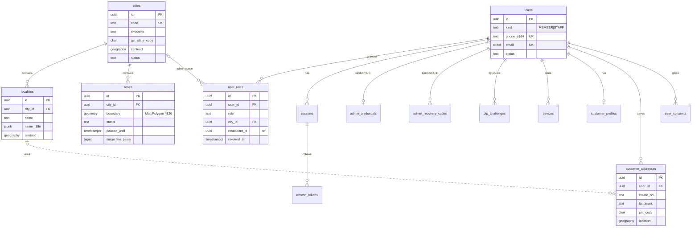
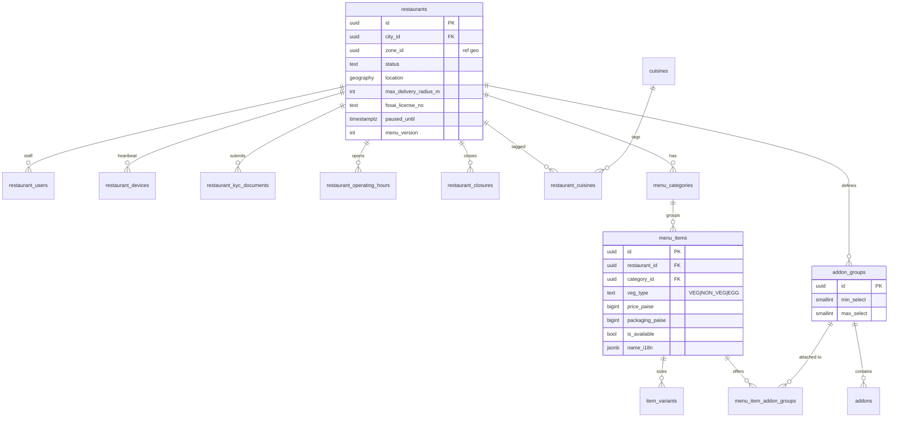
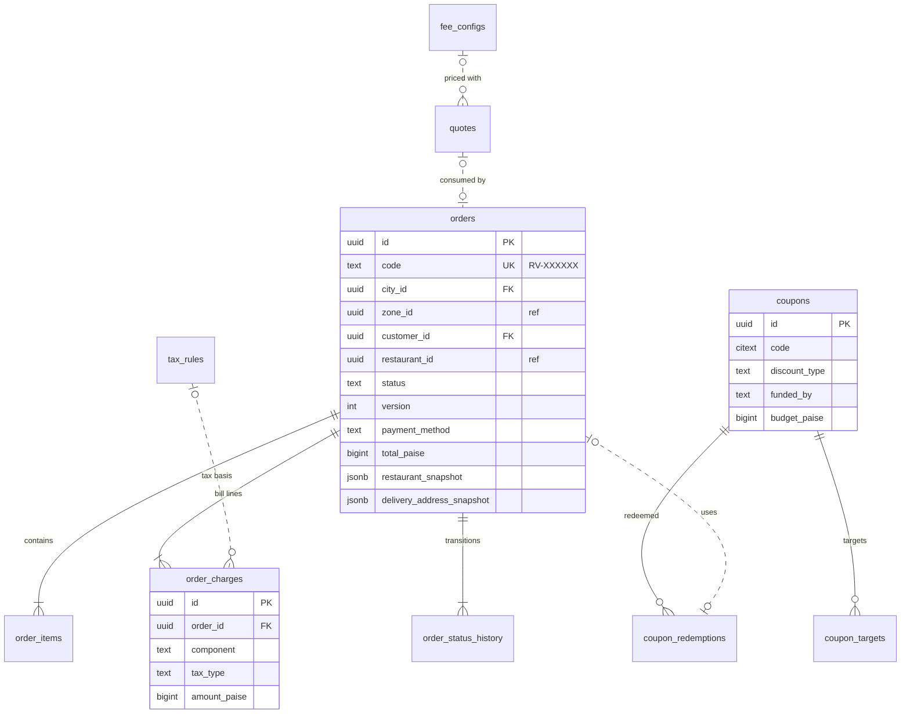
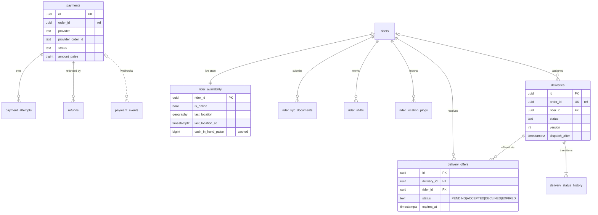
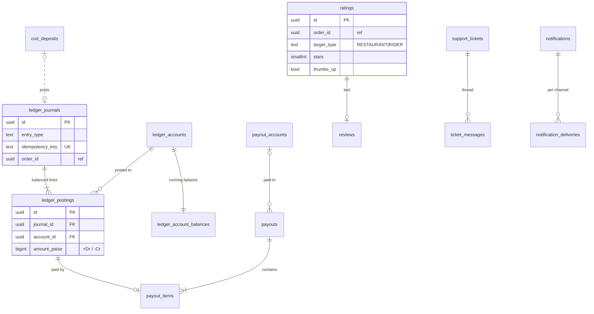

# 10 — Database Schema (logical + physical)

| | |
|---|---|
| **Purpose** | Authoritative logical and physical data model for rovo V1. It covers tables, columns, types, constraints, indexes, module ownership, PII classification, retention, partitioning, seed data, migration rules and multi-city readiness. |
| **Owner** | Backend Architect |
| **Status** | Draft v1 (2026-10-04) |
| **Depends on** | 00 planning baseline (vocabulary, money, IDs, §4a managed cloud); 08 system architecture (module map, boundary rules, outbox via River `InsertTx`, SSE via `NOTIFY`); 12 auth/RBAC (identity model, sessions, maker-checker, audit, KYC storage); 13 order state machine (status values, history rows); 14 payment architecture (PA flows, journal templates, invoices: the detail lives there); 16 delivery zone architecture (geo semantics); 19 threat model (encryption, retention) |
| **Consumed by** | 11 API spec, 13, 14, 16, 20 testing, 22/23 deployment/backup, 26 repo structure, 27 backlog |

> **Design artifacts only.** The SQL below is illustrative DDL for review. It is not a migration file. Phase 2 turns it into `goose` migrations. DDL is grouped by module for reading, **not** in executable order. Migrations order it by dependency (e.g. `users` before `zones.paused_by`, `fee_configs` before `quotes`). Deferred FKs are added with `ALTER TABLE`.

---

## 0. Decision summary

| ID | Decision | Why |
|---|---|---|
| DB-D01 | **PostgreSQL 17 or 18 + PostGIS 3.4+**, run as a **managed service** in an India region (RDS/Aurora PostgreSQL, Cloud SQL, or Azure Database for PostgreSQL Flexible Server, per §4a). Only these extensions are used: `postgis`, `btree_gist`, `citext`, `pg_trgm`, `pgcrypto`. All five are on the supported-extension lists of the three managed offerings `[ASSUMPTION — DevOps re-verifies on the chosen provider and version; on Azure each extension must be allow-listed in `azure.extensions`]`. **Not used:** `h3-pg`, `pg_partman`, `pg_cron`, `timescaledb`, `pgvector`. They are not universally available on managed services, and we don't need them. Partitions are created by a River periodic job instead of `pg_partman`. | Portability across clouds, per baseline §4a rule 1. |
| DB-D02 | **UUIDv7 generated in the application** (`platform/idgen`). The schema never relies on PG 18's native `uuidv7()`, which keeps PG 17 viable. No DB defaults are used for PKs. | PG 18's `uuidv7()` exists ([postgresql.org docs](https://www.postgresql.org/docs/18/functions-uuid.html), accessed 2026-10-04), but managed-service PG 18 + PostGIS availability varies `[OPEN — DevOps]`. |
| DB-D03 | **Enums are `text` + `CHECK`**, not PG `ENUM` types. Values are `UPPER_SNAKE` everywhere, including `veg_type` (`VEG`, `NON_VEG`, `EGG`). | Adding or removing values is a cheap `NOT VALID` constraint swap. Uppercase matches the canonical status names. |
| DB-D04 | **One schema (`public`) and module-owned tables.** Following 08 §4.1: **FKs within a module only, plus FKs to `cities` and `users` from anywhere**. Other cross-module references are plain `uuid` columns marked `-- ref:` in DDL and checked by a nightly orphan-check job plus integration tests. | Keeps modules extractable. The integrity loss is compensated by tests and the orphan check. |
| DB-D05 | **Translations in `*_i18n jsonb`** (`{"te": "…"}`) next to a canonical `name` column, which holds English or what the owner typed. This is not `name_te` columns. | Adding Hindi/Urdu/Kannada for the next city needs no migration. sqlc maps it to a typed Go struct via override. |
| DB-D06 | **No server-side cart in V1** (Lead ruling 12, following 17). The cart lives on the device. `POST /api/v1/cart/quote` is stateless for the client: it takes the cart lines and returns a **signed, short-TTL `quoteId`**. The server **persists the priced quote** (`quotes`, TTL 10 min) so that order creation needs only `quoteId` + `Idempotency-Key` and uses exactly what the customer saw (08 §5.1). | One less mutable aggregate, and offline-friendly. Server price authority is kept via the persisted quote. Lost: cross-device cart and abandoned-cart analytics, deferred to V1.1 as an expand-only `carts` table if wanted. |
| DB-D07 | **Orders snapshot everything they need**: restaurant identity, address, item names/prices/addons, fee config, commission rate, tax rules. History never joins back to mutable catalog rows. | Legal invoices, disputes and settlement must not change when a menu changes. |
| DB-D08 | **Status columns over soft delete.** No blanket `deleted_at`. Lifecycle entities have `status`. Catalog rows referenced by history get `archived_at`. Ephemeral rows are hard-deleted. Users are **anonymised**, not deleted (DPDP erasure vs. tax retention, §13). | Soft-delete everywhere leaks into every query and keeps PII forever. |
| DB-D09 | **Double-entry ledger.** Journals are append-only. Every journal balances to zero (deferred constraint trigger). Corrections are made by reversal journals only. `ledger_account_balances` holds locked running balances for gating checks. | Money correctness (08 §7.2, 14). |
| DB-D10 | **Zones are `geometry(MultiPolygon,4326)`; points are `geography(Point,4326)`.** Point-in-zone uses `ST_Covers(zone.boundary, point::geometry)`. Distances use geography or Go haversine (16). | Admins draw on a Web-Mercator map with straight edges, so planar polygons match what was drawn. Geography is used where metres matter. |
| DB-D11 | **Day-one partitioning** only for `rider_location_pings` (daily), `audit_logs` (monthly) and `outbox_events` (monthly). Other high-volume tables are partition-ready and converted when they cross the thresholds in §14. | Avoids premature complexity, but partitioning these three later would be painful. |
| DB-D12 | **No brand/chain table in V1.** One `restaurants` row per outlet. A future `brands` table is an expand-only migration (new table + nullable `restaurants.brand_id`). Multi-outlet owners are already modelled through `user_roles`. | YAGNI for a single-city launch. Nothing in V1 blocks it. |
| DB-D13 | Object storage is referenced only by **provider-neutral `(bucket, object_key)`** in `file_objects`, never by URL. URLs (CDN or presigned) are built at request time from config. | Works with S3, GCS (S3 interop), Azure via an S3 gateway, and MinIO locally (§4a). |

---

## 1. Conventions

### 1.1 Naming

| Thing | Rule | Example |
|---|---|---|
| Tables | `snake_case`, plural | `menu_items`, `order_status_history` (history tables keep a singular noun) |
| PK | `id uuid` (UUIDv7, app-generated) | |
| FK / ref column | `<singular>_id` | `restaurant_id` |
| Timestamps | `<event>_at timestamptz` (UTC) | `accepted_at` |
| Local wall-clock time | `time` without tz, evaluated in `cities.timezone` | `opens_at` |
| Money | `<name>_paise bigint` + `currency char(3)` on order/ledger-level rows | `total_paise` |
| Rates | basis points `int`, `_bps` (1% = 100 bps) | `commission_bps` |
| Distances / durations | `_m` metres `int`; `_s` seconds; `_min` minutes | `max_delivery_radius_m` |
| Booleans | `is_` / `has_` / adjective | `is_available` |
| Encrypted columns | `<name>_enc bytea` + `pii_key_id text` (KEK version); search via `<name>_last4` or `<name>_hmac` (blind index) | `account_number_enc` |
| JSONB | `_snapshot` (frozen copy), `_i18n` (translations), `metadata` | `restaurant_snapshot` |
| Indexes | `ix_<table>__<cols>`; unique `ux_`; check `ck_`; exclusion `ex_`; FK `fk_` | `ix_orders__city_active` |

### 1.2 Standard columns and triggers

- `created_at timestamptz NOT NULL DEFAULT now()` on every table. `updated_at` on mutable tables, maintained by trigger `set_updated_at()`.
- **Aggregate roots** (`orders`, `deliveries`, `restaurants`, `menu_items`, `carts`, `payments`, `coupons`, `zones`, `fee_configs`, `payouts`, `support_tickets`) carry `version int NOT NULL DEFAULT 1`. The API exposes it as `ETag` (11 §1.9). Transitions use CAS on `(status, version)` (13 §7).
- **Append-only tables** (`*_status_history`, `ledger_journals`, `ledger_postings`, `audit_logs`, `payment_events`, `user_consents`) get trigger `forbid_mutation()`, and the app role lacks `UPDATE/DELETE` on them.

```sql
CREATE EXTENSION IF NOT EXISTS postgis;
CREATE EXTENSION IF NOT EXISTS btree_gist;   -- uuid/text equality inside EXCLUDE constraints
CREATE EXTENSION IF NOT EXISTS citext;       -- case-insensitive email / coupon codes
CREATE EXTENSION IF NOT EXISTS pg_trgm;      -- fuzzy search on restaurant / dish / locality names
CREATE EXTENSION IF NOT EXISTS pgcrypto;     -- digest() in data migrations/backfills only; NOT used for PII encryption (done in app, KMS-backed)

CREATE FUNCTION set_updated_at() RETURNS trigger LANGUAGE plpgsql AS $$
BEGIN NEW.updated_at := now(); RETURN NEW; END $$;

CREATE FUNCTION forbid_mutation() RETURNS trigger LANGUAGE plpgsql AS $$
BEGIN RAISE EXCEPTION '% is append-only', TG_TABLE_NAME USING ERRCODE = 'insufficient_privilege'; END $$;
-- attached as: CREATE TRIGGER trg_<t>_immutable BEFORE UPDATE OR DELETE ON <t> FOR EACH ROW EXECUTE FUNCTION forbid_mutation();
```

### 1.3 Database roles (managed-service friendly: no superuser required)

| Role | Grants | Used by |
|---|---|---|
| `rovo_owner` | Owns all objects. `CREATE` on schema. Member of the provider's admin role (`rds_superuser` / `cloudsqlsuperuser` / `azure_pg_admin`) only for `CREATE EXTENSION`. | `rovo migrate` one-off job (goose + River migrations) |
| `rovo_app` | `SELECT, INSERT, UPDATE, DELETE` on module tables. **`SELECT, INSERT` only** on append-only tables. No DDL. | `rovo api`, `rovo worker` |
| `rovo_report` | `SELECT` on `*_report` views and a read replica | reporting exports, BI |
| `rovo_partition` | `CREATE`/`DROP` on partitioned children only (`SECURITY DEFINER` function owned by `rovo_owner`) | River periodic job `platform.partitions_maintain` |

Row-level security is **not** used in V1 (12 §8). City scoping is enforced in repository queries (12 AUTH-D09).

### 1.4 Soft delete vs. status policy

| Category | Policy | Tables |
|---|---|---|
| Lifecycle entities | `status` column with explicit states, never deleted | restaurants, riders, users, coupons, zones, payouts, support_tickets |
| Catalog referenced by history | `archived_at` (hidden from menus, kept for FK integrity inside the module and for analytics) | menu_categories, menu_items, item_variants, addon_groups, addons |
| Customer-owned convenience data | **hard delete** on user request (orders keep snapshots) | customer_addresses, push_subscriptions, carts, cart_items |
| Financial, order and legal records | never deleted inside the retention period; PII redacted after the dispute window (§9) | orders, payments, refunds, ledger_*, invoices |
| Ephemeral / security | hard delete by TTL sweeper | otp_challenges, idempotency_keys, quotes, refresh_tokens (expired) |

### 1.5 Module ownership (08 §3)

| Module (Go package) | Tables |
|---|---|
| `geo` | cities, localities, zones |
| `users` | users, customer_profiles, customer_addresses, user_consents |
| `identity` | user_roles, otp_challenges, sessions, refresh_tokens, admin_credentials, admin_recovery_codes, phone_change_requests, devices |
| `catalog` | restaurants, restaurant_users, restaurant_devices, restaurant_kyc_documents, restaurant_operating_hours, restaurant_closures, cuisines, restaurant_cuisines, menu_categories, menu_items, item_variants, addon_groups, addons, menu_item_addon_groups |
| `pricing` (quote & pricing) | quotes, fee_configs, tax_rules |
| `promotions` | coupons, coupon_targets, coupon_redemptions |
| `ordering` | orders, order_items, order_charges, order_status_history |
| `payments` | payments, payment_attempts, payment_events, refunds |
| `dispatch` | riders, rider_availability, rider_kyc_documents, rider_shifts, rider_location_pings, deliveries, delivery_offers, delivery_status_history |
| `ledger` (& settlement) | ledger_accounts, ledger_journals, ledger_postings, ledger_account_balances, commission_plans, payout_accounts, payouts, payout_items, cod_deposits, invoices, invoice_sequences |
| `ratings` | ratings, reviews, rating_aggregates |
| `notifications` | notifications, notification_deliveries, notification_templates, push_subscriptions |
| `support` | support_tickets, ticket_messages |
| `admin` (& audit) | audit_logs, approval_requests, reason_codes, feature_flags, app_config, report_exports |
| `platform` (shared infra, importable by all) | outbox_events, processed_events, idempotency_keys, file_objects |
| River (library-managed, via `rivermigrate`) | river_job, river_leader, river_queue, river_client, river_migration… (not counted) |

**Total: 81 application tables** (plus River's own), counted from the DDL below. Doc 14 may add `pa_settlements`, `pa_settlement_lines` and `recon_exceptions` (08 §3.2). They are not specified here.

### 1.6 Name reconciliation with sibling drafts

08 and 12 proposed indicative names. This document is authoritative (both docs say so). Mapping:

| Proposed in | Name there | Canonical name here | Note |
|---|---|---|---|
| 12 | `role_assignments(scope_type, scope_id)` | `user_roles(city_id, restaurant_id)` | Explicit typed scope columns instead of polymorphic `scope_id`. `city_id` gets a real FK. |
| 12 | `recovery_codes` | `admin_recovery_codes` | |
| 12 / 08 | `audit_events` / `audit_log` | `audit_logs` | Columns follow 12 §5.7, including the hash chain. |
| 08 | `event_log` | `outbox_events` | Same role: the event row is written in the business tx, and River `InsertTx` fans it out. |
| 08 | `payment_intents` | `payments` | One row per PA order (intent). Attempts are in `payment_attempts`. |
| 08 | `webhook_events` | `payment_events` | Notification-provider DLR webhooks go to `notification_deliveries`. |
| 08 | `ledger_journals`, `account_balances` | `ledger_journals`, `ledger_account_balances` | |
| 08 | `settlement_runs`, `settlement_statements` | `payouts.batch_id` + `payout_items`; statements are generated documents (`report_exports`) | Fewer tables. A statement is a rendering of payout items. |
| 08 | `rider_locations`, `rider_location_samples` | `rider_availability.last_location`, `rider_location_pings` | |
| 08 | `delivery_events` | `delivery_status_history` | |
| 08 | `order_lines`, `order_address_snapshots` | `order_items`, `orders.delivery_address_snapshot` | |
| 08 | `tickets`, `ticket_actions` | `support_tickets`, `ticket_messages` (`kind='ACTION'`) | |
| 12 | `auth_settings` | `app_config` keys `auth.*` (scope CITY) | |

---

## 2. Entity-relationship diagrams (by module)

Only key columns are shown. The full DDL is in §3–§8. Dashed (non-identifying) relationships across modules are **logical** references without an FK (DB-D04).

### 2.1 Geo, identity, users



### 2.2 Catalog (restaurants and menus)



### 2.3 Quote, pricing, promotions, ordering



### 2.4 Payments, dispatch



### 2.5 Ledger, payouts, engagement, support, notifications, platform



---

## 3. DDL — geo, users, identity

### 3.1 geo

```sql
CREATE TABLE cities (
  id                 uuid PRIMARY KEY,
  code               text NOT NULL UNIQUE CHECK (code ~ '^[A-Z]{3,8}$'),          -- 'MBNR'
  slug               text NOT NULL UNIQUE CHECK (slug ~ '^[a-z0-9-]{2,40}$'),     -- 'mahabubnagar'
  name               text NOT NULL,
  name_i18n          jsonb NOT NULL DEFAULT '{}' CHECK (jsonb_typeof(name_i18n) = 'object'),
  state_name         text NOT NULL,                                               -- 'Telangana'
  gst_state_code     char(2) NOT NULL CHECK (gst_state_code ~ '^[0-9]{2}$'),     -- '36' (place of supply)
  country_code       char(2) NOT NULL DEFAULT 'IN',
  timezone           text NOT NULL DEFAULT 'Asia/Kolkata',                        -- IANA; validated in app
  currency           char(3) NOT NULL DEFAULT 'INR',
  default_locale     text NOT NULL DEFAULT 'en',
  supported_locales  text[] NOT NULL DEFAULT '{en,te}',
  centroid           geography(Point,4326) NOT NULL,
  status             text NOT NULL DEFAULT 'PLANNED' CHECK (status IN ('PLANNED','LIVE','PAUSED','RETIRED')),
  launched_at        timestamptz,
  created_at         timestamptz NOT NULL DEFAULT now(),
  updated_at         timestamptz NOT NULL DEFAULT now()
);

CREATE TABLE localities (
  id               uuid PRIMARY KEY,
  city_id          uuid NOT NULL REFERENCES cities(id),
  slug             text NOT NULL,
  name             text NOT NULL,
  name_i18n        jsonb NOT NULL DEFAULT '{}',
  search_aliases   text[] NOT NULL DEFAULT '{}',          -- spelling variants: Boyapalle/Boyapally/Boyapalli
  pin_codes        text[] NOT NULL DEFAULT '{}',          -- each validated '^[1-9][0-9]{5}$' in app
  centroid         geography(Point,4326) NOT NULL,
  boundary         geometry(MultiPolygon,4326),           -- optional; V1 uses centroid only
  is_active        boolean NOT NULL DEFAULT true,
  sort_order       int NOT NULL DEFAULT 0,
  created_at       timestamptz NOT NULL DEFAULT now(),
  updated_at       timestamptz NOT NULL DEFAULT now(),
  CONSTRAINT ux_localities__city_slug UNIQUE (city_id, slug)
);
CREATE INDEX ix_localities__name_trgm ON localities USING gin (lower(name) gin_trgm_ops);
CREATE INDEX ix_localities__aliases   ON localities USING gin (search_aliases);
CREATE INDEX ix_localities__centroid  ON localities USING gist (centroid);

CREATE TABLE zones (
  id                      uuid PRIMARY KEY,
  city_id                 uuid NOT NULL REFERENCES cities(id),
  code                    text NOT NULL CHECK (code ~ '^[A-Z0-9-]{2,20}$'),      -- 'MBNR-CORE'
  name                    text NOT NULL,
  name_i18n               jsonb NOT NULL DEFAULT '{}',
  boundary                geometry(MultiPolygon,4326) NOT NULL,
  priority                int NOT NULL DEFAULT 0,               -- tie-break if a point is covered by >1 zone (16 §3)
  status                  text NOT NULL DEFAULT 'DRAFT' CHECK (status IN ('DRAFT','ACTIVE','INACTIVE')),
  -- operational pause (rain, rider shortage) — orthogonal to status
  paused_until            timestamptz,
  pause_reason            text CHECK (pause_reason IN ('RAIN','RIDER_SHORTAGE','LAW_AND_ORDER','FESTIVAL','TECHNICAL','OTHER')),
  pause_message_i18n      jsonb NOT NULL DEFAULT '{}',
  paused_by               uuid REFERENCES users(id),
  -- manual surge (16 §6.3): flat surcharge with mandatory expiry
  surge_reason            text CHECK (surge_reason IN ('RAIN','PEAK','LOW_RIDERS','FESTIVAL','OTHER')),
  surge_fee_paise         bigint CHECK (surge_fee_paise BETWEEN 100 AND 5000),
  surge_rider_bonus_paise bigint CHECK (surge_rider_bonus_paise BETWEEN 0 AND 5000),
  surge_expires_at        timestamptz,
  version                 int NOT NULL DEFAULT 1,
  created_by              uuid REFERENCES users(id),
  created_at              timestamptz NOT NULL DEFAULT now(),
  updated_at              timestamptz NOT NULL DEFAULT now(),
  CONSTRAINT ux_zones__city_code UNIQUE (city_id, code),
  CONSTRAINT ck_zones__valid     CHECK (ST_IsValid(boundary) AND ST_SRID(boundary) = 4326),
  CONSTRAINT ck_zones__surge     CHECK ((surge_fee_paise IS NULL) = (surge_expires_at IS NULL)
                                        AND (surge_fee_paise IS NULL) = (surge_reason IS NULL))
);
CREATE INDEX ix_zones__boundary ON zones USING gist (boundary);
CREATE INDEX ix_zones__city_active ON zones (city_id) WHERE status = 'ACTIVE';
```

Zone overlap among `ACTIVE` zones of a city is **rejected by the admin write path** (16 §8.2) and not by a constraint: `EXCLUDE ... &&` would only compare bounding boxes. Zone → fee config resolution is **by effective date** (`fee_configs.zone_id` + range, §5.4), not by a pointer on `zones`. This keeps price history immutable and lets ops schedule a fee change in advance. This is a deliberate deviation from "zones (… fee config ref)".

### 3.2 users

```sql
CREATE TABLE users (
  id                    uuid PRIMARY KEY,
  kind                  text NOT NULL DEFAULT 'MEMBER' CHECK (kind IN ('MEMBER','STAFF')),   -- 12 AUTH-D01
  phone_e164            text CHECK (phone_e164 ~ '^\+[1-9][0-9]{7,14}$'),                    -- Indian-mobile rule in app (00 §3)
  phone_verified_at     timestamptz,
  email                 citext,
  email_verified_at     timestamptz,
  full_name             text CHECK (char_length(full_name) <= 100),
  preferred_locale      text NOT NULL DEFAULT 'en' CHECK (preferred_locale ~ '^[a-z]{2}(-[A-Z]{2})?$'),
  home_city_id          uuid REFERENCES cities(id),
  status                text NOT NULL DEFAULT 'ACTIVE'
                          CHECK (status IN ('ACTIVE','BLOCKED','DELETION_PENDING','DETACHED','ANONYMIZED')),
  status_reason         text,
  adult_declared_at     timestamptz,                    -- 18+ self-declaration (riders/owners), 12 §1.1
  last_active_at        timestamptz,                    -- phone-recycling guard (12 §1.4)
  anonymized_at         timestamptz,
  created_at            timestamptz NOT NULL DEFAULT now(),
  updated_at            timestamptz NOT NULL DEFAULT now(),
  CONSTRAINT ck_users__identifier CHECK (
       status IN ('ANONYMIZED','DETACHED')
    OR (kind = 'MEMBER' AND phone_e164 IS NOT NULL)
    OR (kind = 'STAFF'  AND email IS NOT NULL))
);
-- a phone/email can belong to only one live account; DETACHED/ANONYMIZED rows release it (12 §1.4)
CREATE UNIQUE INDEX ux_users__phone ON users (phone_e164) WHERE kind = 'MEMBER' AND status NOT IN ('DETACHED','ANONYMIZED');
CREATE UNIQUE INDEX ux_users__email ON users (email)      WHERE kind = 'STAFF'  AND status <> 'ANONYMIZED';
CREATE INDEX ix_users__name_trgm ON users USING gin (lower(full_name) gin_trgm_ops);   -- admin search

CREATE TABLE customer_profiles (
  user_id                  uuid PRIMARY KEY REFERENCES users(id),
  cod_status               text NOT NULL DEFAULT 'ENABLED' CHECK (cod_status IN ('ENABLED','DISABLED')),
  cod_disabled_reason      text,
  cod_strike_count         int NOT NULL DEFAULT 0,       -- approved UNDELIVERABLE COD orders; 2 strikes → COD DISABLED (ruling 5)
  delivered_order_count    int NOT NULL DEFAULT 0,       -- new-user coupon eligibility
  first_order_at           timestamptz,
  default_address_id       uuid,                         -- same module; FK added after customer_addresses
  created_at               timestamptz NOT NULL DEFAULT now(),
  updated_at               timestamptz NOT NULL DEFAULT now()
);

CREATE TABLE customer_addresses (
  id                      uuid PRIMARY KEY,
  user_id                 uuid NOT NULL REFERENCES users(id),
  city_id                 uuid NOT NULL REFERENCES cities(id),
  locality_id             uuid,                           -- ref: geo.localities (logical)
  label                   text NOT NULL CHECK (label IN ('HOME','WORK','OTHER')),
  label_custom            text CHECK (char_length(label_custom) <= 30),
  house_no                text NOT NULL CHECK (char_length(house_no) BETWEEN 1 AND 100),     -- house / flat no.
  building_street         text CHECK (char_length(building_street) <= 150),                  -- building / street (optional, ruling 13)
  area_text               text CHECK (char_length(area_text) <= 100),                        -- free-text area if locality not listed
  landmark                text NOT NULL CHECK (char_length(landmark) BETWEEN 3 AND 150),     -- REQUIRED (ruling 13)
  city_name               text NOT NULL,
  state_name              text NOT NULL,
  pin_code                char(6) NOT NULL CHECK (pin_code ~ '^[1-9][0-9]{5}$'),
  location                geography(Point,4326) NOT NULL,                                  -- map pin (required)
  location_accuracy_m     int CHECK (location_accuracy_m >= 0),
  contact_name            text CHECK (char_length(contact_name) <= 100),                     -- "ordering for someone else"
  contact_phone_e164      text CHECK (contact_phone_e164 ~ '^\+[1-9][0-9]{7,14}$'),
  delivery_instructions   text CHECK (char_length(delivery_instructions) <= 200),
  is_default              boolean NOT NULL DEFAULT false,
  last_used_at            timestamptz,
  created_at              timestamptz NOT NULL DEFAULT now(),
  updated_at              timestamptz NOT NULL DEFAULT now()
);
CREATE INDEX ix_customer_addresses__user ON customer_addresses (user_id, last_used_at DESC);
CREATE UNIQUE INDEX ux_customer_addresses__default ON customer_addresses (user_id) WHERE is_default;
ALTER TABLE customer_profiles ADD CONSTRAINT fk_customer_profiles__default_address
  FOREIGN KEY (default_address_id) REFERENCES customer_addresses(id) ON DELETE SET NULL;

CREATE TABLE user_consents (                     -- append-only consent ledger (DPDP §6); current = latest row
  id               uuid PRIMARY KEY,
  user_id          uuid NOT NULL REFERENCES users(id),
  purpose          text NOT NULL CHECK (purpose IN ('TERMS','PRIVACY_NOTICE','MARKETING_SMS','MARKETING_WHATSAPP',
                                                    'MARKETING_PUSH','PRECISE_LOCATION','PARTNER_AGREEMENT')),
  notice_version   text NOT NULL,                 -- e.g. 'privacy-2026-09-en'
  granted          boolean NOT NULL,
  locale           text NOT NULL,
  source           text NOT NULL,                 -- 'customer-web:checkout', 'partner-web:onboarding'
  ip               inet,
  user_agent       text,
  created_at       timestamptz NOT NULL DEFAULT now()
);
CREATE INDEX ix_user_consents__current ON user_consents (user_id, purpose, created_at DESC);
```

### 3.3 identity

```sql
CREATE TABLE user_roles (                        -- = 12's role_assignments; THE authorisation source of truth
  id               uuid PRIMARY KEY,
  user_id          uuid NOT NULL REFERENCES users(id),
  role             text NOT NULL CHECK (role IN ('CUSTOMER','RESTAURANT_OWNER','RESTAURANT_STAFF','RIDER',
                                                 'ADMIN_SUPER','ADMIN_OPS','ADMIN_SUPPORT','ADMIN_FINANCE')),
  city_id          uuid REFERENCES cities(id),   -- ADMIN_*: NULL = all cities; RIDER: rider's city
  restaurant_id    uuid,                          -- ref: catalog.restaurants (logical) — RESTAURANT_* only
  granted_by       uuid REFERENCES users(id),
  approval_id      uuid,                          -- ref: admin.approval_requests (maker-checker for ADMIN_*)
  granted_at       timestamptz NOT NULL DEFAULT now(),
  revoked_at       timestamptz,
  revoked_by       uuid REFERENCES users(id),
  revoke_reason    text,
  CONSTRAINT ck_user_roles__scope CHECK (
       (role IN ('RESTAURANT_OWNER','RESTAURANT_STAFF') AND restaurant_id IS NOT NULL)
    OR (role LIKE 'ADMIN\_%' AND restaurant_id IS NULL)
    OR (role = 'RIDER'    AND restaurant_id IS NULL AND city_id IS NOT NULL)
    OR (role = 'CUSTOMER' AND restaurant_id IS NULL AND city_id IS NULL))
);
CREATE UNIQUE INDEX ux_user_roles__active ON user_roles (user_id, role, city_id, restaurant_id)
  NULLS NOT DISTINCT WHERE revoked_at IS NULL;
CREATE INDEX ix_user_roles__restaurant ON user_roles (restaurant_id) WHERE revoked_at IS NULL AND restaurant_id IS NOT NULL;
-- Trigger trg_user_roles_exclusive (BEFORE INSERT): rejects RIDER + RESTAURANT_* on the same user (12 AUTH-D02)
-- and ADMIN_* on kind=MEMBER / member roles on kind=STAFF (12 AUTH-D01).

CREATE TABLE otp_challenges (
  id                    uuid PRIMARY KEY,
  phone_e164            text NOT NULL,
  purpose               text NOT NULL CHECK (purpose IN ('LOGIN','PHONE_CHANGE_OLD','PHONE_CHANGE_NEW','STEP_UP','PARTNER_AGREEMENT')),
  audience              text NOT NULL CHECK (audience IN ('customer','partner')),
  channel               text NOT NULL CHECK (channel IN ('SMS','WHATSAPP','VOICE')),
  code_hmac             bytea NOT NULL,           -- HMAC-SHA-256(pepper, id || code) (12 AUTH-D07)
  attempts              smallint NOT NULL DEFAULT 0,
  max_attempts          smallint NOT NULL DEFAULT 5,
  resend_count          smallint NOT NULL DEFAULT 0,
  expires_at            timestamptz NOT NULL,
  verified_at           timestamptz,
  invalidated_at        timestamptz,
  provider              text,
  provider_message_id   text,
  request_ip            inet,
  device_id             uuid,
  created_at            timestamptz NOT NULL DEFAULT now(),
  CONSTRAINT ck_otp__attempts CHECK (attempts <= max_attempts)
);
CREATE INDEX ix_otp_challenges__phone ON otp_challenges (phone_e164, created_at DESC);   -- per-phone rate limits
CREATE INDEX ix_otp_challenges__ip    ON otp_challenges (request_ip, created_at DESC);   -- per-IP rate limits

CREATE TABLE devices (
  id               uuid PRIMARY KEY,
  install_id       text NOT NULL UNIQUE,       -- random id from the client (rovo_did cookie / native install id)
  user_id          uuid REFERENCES users(id),  -- last signed-in user
  platform         text NOT NULL CHECK (platform IN ('WEB_ANDROID','WEB_IOS','WEB_DESKTOP','ANDROID','IOS')),
  app              text NOT NULL CHECK (app IN ('customer','partner','admin')),
  app_version      text,
  user_agent       text,
  first_seen_at    timestamptz NOT NULL DEFAULT now(),
  last_seen_at     timestamptz NOT NULL DEFAULT now()
);
CREATE INDEX ix_devices__user ON devices (user_id);

CREATE TABLE sessions (                            -- one row per login = refresh-token family (12 §4.3)
  id                    uuid PRIMARY KEY,           -- = JWT 'sid'
  user_id               uuid NOT NULL REFERENCES users(id),
  audience              text NOT NULL CHECK (audience IN ('customer','partner','admin','customer_native','partner_native')),
  active_context        text,                       -- 'rider' | 'restaurant:<uuid>' (partner only)
  device_id             uuid REFERENCES devices(id),
  device_label          text,
  amr                   text[] NOT NULL,            -- {'otp'} | {'pwd','totp'}
  step_up_at            timestamptz,
  created_ip            inet,
  last_ip               inet,
  last_seen_at          timestamptz NOT NULL DEFAULT now(),
  idle_expires_at       timestamptz NOT NULL,
  absolute_expires_at   timestamptz NOT NULL,
  revoked_at            timestamptz,
  revoke_reason         text CHECK (revoke_reason IN ('LOGOUT','LOGOUT_OTHERS','REFRESH_REUSE','ADMIN_REVOKED',
                                                      'USER_BLOCKED','PHONE_CHANGED','PASSWORD_CHANGED','GLOBAL_NOT_BEFORE')),
  created_at            timestamptz NOT NULL DEFAULT now()
);
CREATE INDEX ix_sessions__user_live ON sessions (user_id) WHERE revoked_at IS NULL;

CREATE TABLE refresh_tokens (
  id              uuid PRIMARY KEY,
  session_id      uuid NOT NULL REFERENCES sessions(id) ON DELETE CASCADE,
  token_sha256    bytea NOT NULL UNIQUE,
  parent_id       uuid REFERENCES refresh_tokens(id),
  issued_at       timestamptz NOT NULL DEFAULT now(),
  used_at         timestamptz,                  -- set on rotation; reuse >15 s later ⇒ revoke family
  expires_at      timestamptz NOT NULL
);
CREATE INDEX ix_refresh_tokens__session ON refresh_tokens (session_id);

CREATE TABLE admin_credentials (
  user_id               uuid PRIMARY KEY REFERENCES users(id),   -- kind = STAFF only (trigger)
  password_hash         text NOT NULL,                           -- argon2id PHC string (12 AUTH-D08)
  totp_secret_enc       bytea,                                   -- AES-256-GCM, DEK wrapped by KMS KEK
  pii_key_id            text,                                    -- KEK version used
  totp_enrolled_at      timestamptz,
  totp_last_step        bigint,                                  -- replay guard
  failed_attempts       int NOT NULL DEFAULT 0,
  locked_until          timestamptz,
  must_change_password  boolean NOT NULL DEFAULT true,
  password_changed_at   timestamptz NOT NULL DEFAULT now(),
  setup_token_sha256    bytea UNIQUE,                            -- one-time setup link (12 §3.3)
  setup_token_expires_at timestamptz,
  created_at            timestamptz NOT NULL DEFAULT now(),
  updated_at            timestamptz NOT NULL DEFAULT now(),
  CONSTRAINT ck_admin_credentials__totp CHECK ((totp_secret_enc IS NULL) = (pii_key_id IS NULL))
);

CREATE TABLE admin_recovery_codes (
  id            uuid PRIMARY KEY,
  user_id       uuid NOT NULL REFERENCES users(id),
  code_hash     text NOT NULL,                   -- argon2id
  used_at       timestamptz,
  created_at    timestamptz NOT NULL DEFAULT now()
);
CREATE INDEX ix_admin_recovery_codes__user ON admin_recovery_codes (user_id) WHERE used_at IS NULL;

CREATE TABLE phone_change_requests (
  id                 uuid PRIMARY KEY,
  user_id            uuid NOT NULL REFERENCES users(id),
  old_phone_e164     text NOT NULL,
  new_phone_e164     text NOT NULL,
  old_otp_id         uuid REFERENCES otp_challenges(id),
  new_otp_id         uuid REFERENCES otp_challenges(id),
  status             text NOT NULL CHECK (status IN ('PENDING','COMPLETED','EXPIRED','CANCELLED','REVIEW')),
  expires_at         timestamptz NOT NULL,
  completed_at       timestamptz,
  created_at         timestamptz NOT NULL DEFAULT now()
);
CREATE UNIQUE INDEX ux_phone_change__pending ON phone_change_requests (user_id) WHERE status = 'PENDING';
```

---

## 4. DDL — catalog (restaurants, menus)

```sql
CREATE TABLE restaurants (                       -- one row per physical outlet (00 §2)
  id                          uuid PRIMARY KEY,
  city_id                     uuid NOT NULL REFERENCES cities(id),
  zone_id                     uuid,              -- ref: geo.zones — zone covering `location`, set on approval
  locality_id                 uuid,              -- ref: geo.localities
  slug                        text NOT NULL CHECK (slug ~ '^[a-z0-9-]{3,80}$'),
  name                        text NOT NULL CHECK (char_length(name) BETWEEN 2 AND 80),
  name_i18n                   jsonb NOT NULL DEFAULT '{}',
  description                 text CHECK (char_length(description) <= 500),
  description_i18n            jsonb NOT NULL DEFAULT '{}',
  legal_name                  text,              -- for tax invoices
  status                      text NOT NULL DEFAULT 'DRAFT' CHECK (status IN
                                ('DRAFT','SUBMITTED','CHANGES_REQUESTED','REJECTED','ACTIVE','SUSPENDED','OFFBOARDED')),
  status_reason               text,
  diet_type                   text NOT NULL DEFAULT 'MIXED' CHECK (diet_type IN ('PURE_VEG','MIXED')),   -- "Pure veg" badge
  phone_e164                  text NOT NULL CHECK (phone_e164 ~ '^\+[1-9][0-9]{7,14}$'),
  email                       citext,
  address_line                text NOT NULL,
  landmark                    text,
  pin_code                    char(6) NOT NULL CHECK (pin_code ~ '^[1-9][0-9]{5}$'),
  location                    geography(Point,4326) NOT NULL,
  max_delivery_radius_m       int NOT NULL DEFAULT 7000 CHECK (max_delivery_radius_m BETWEEN 500 AND 15000),
  avg_prep_time_min           smallint NOT NULL DEFAULT 20 CHECK (avg_prep_time_min BETWEEN 5 AND 90),
  min_order_paise             bigint NOT NULL DEFAULT 0 CHECK (min_order_paise >= 0),
  cost_for_two_paise          bigint CHECK (cost_for_two_paise >= 0),
  packaging_mode              text NOT NULL DEFAULT 'PER_ITEM' CHECK (packaging_mode IN ('PER_ITEM','PER_ORDER','NONE')),
  packaging_per_order_paise   bigint NOT NULL DEFAULT 0 CHECK (packaging_per_order_paise BETWEEN 0 AND 10000),
  fssai_license_no            text CHECK (fssai_license_no ~ '^[0-9]{14}$'),     -- 14-digit FSSAI number [LEGAL]
  fssai_valid_until           date,
  gstin                       text CHECK (gstin ~ '^[0-9]{2}[A-Z0-9]{10}[0-9A-Z]Z[0-9A-Z]$'),  -- nullable: unregistered OK under §9(5)
  pan_enc                     bytea,
  pan_last4                   text,
  pii_key_id                  text,
  accepting_orders            boolean NOT NULL DEFAULT false,   -- partner "Open / Closed" master switch
  paused_until                timestamptz,                      -- "Busy" pause (05 §4.2); NULL = not paused; 'infinity' = until owner resumes
  pause_reason                text CHECK (pause_reason IN ('TOO_MANY_ORDERS','STAFF_SHORTAGE','KITCHEN_ISSUE',
                                                           'AUTO_MISSED_ORDERS','DEVICE_OFFLINE','ADMIN','OTHER')),
  paused_by_user_id           uuid REFERENCES users(id),
  consecutive_missed_orders   smallint NOT NULL DEFAULT 0,      -- reset on accept; 1 → pause 30 min, 2 → pause until resumed (13 §5)
  menu_version                int NOT NULL DEFAULT 1,           -- bumped on any menu change → ETag / cache key (08 §8)
  logo_file_id                uuid,                             -- ref: platform.file_objects
  cover_file_id               uuid,
  approved_at                 timestamptz,
  approved_by                 uuid REFERENCES users(id),
  version                     int NOT NULL DEFAULT 1,
  created_at                  timestamptz NOT NULL DEFAULT now(),
  updated_at                  timestamptz NOT NULL DEFAULT now(),
  CONSTRAINT ux_restaurants__city_slug UNIQUE (city_id, slug),
  CONSTRAINT ck_restaurants__live_requirements CHECK (
    status <> 'ACTIVE' OR (fssai_license_no IS NOT NULL AND fssai_valid_until IS NOT NULL AND zone_id IS NOT NULL))
);
CREATE INDEX ix_restaurants__live_location ON restaurants USING gist (location) WHERE status = 'ACTIVE';
CREATE INDEX ix_restaurants__city_status   ON restaurants (city_id, status);
CREATE INDEX ix_restaurants__name_trgm     ON restaurants USING gin (lower(name) gin_trgm_ops);
CREATE INDEX ix_restaurants__fssai_expiry  ON restaurants (fssai_valid_until) WHERE status = 'ACTIVE';

CREATE TABLE restaurant_users (                -- staff membership + invitation workflow
  id                   uuid PRIMARY KEY,
  restaurant_id        uuid NOT NULL REFERENCES restaurants(id),
  user_id              uuid REFERENCES users(id),           -- NULL until the invite is accepted
  invited_phone_e164   text NOT NULL,
  role                 text NOT NULL CHECK (role IN ('RESTAURANT_OWNER','RESTAURANT_STAFF')),
  permissions          text[] NOT NULL DEFAULT '{}',        -- staff narrowing, e.g. {MENU_EDIT} (12 §5.2)
  display_name         text,
  status               text NOT NULL DEFAULT 'INVITED' CHECK (status IN ('INVITED','ACTIVE','REMOVED')),
  user_role_id         uuid,                                -- ref: identity.user_roles row created on activation
  invited_by           uuid REFERENCES users(id),
  removed_at           timestamptz,
  created_at           timestamptz NOT NULL DEFAULT now(),
  updated_at           timestamptz NOT NULL DEFAULT now()
);
CREATE UNIQUE INDEX ux_restaurant_users__member ON restaurant_users (restaurant_id, invited_phone_e164) WHERE status <> 'REMOVED';
```

```sql
CREATE TABLE restaurant_devices (              -- counter device liveness (ruling 1/11; 05 §8)
  id                  uuid PRIMARY KEY,
  restaurant_id       uuid NOT NULL REFERENCES restaurants(id),
  device_id           uuid NOT NULL,                       -- ref: identity.devices
  user_id             uuid REFERENCES users(id),           -- staff signed in on it
  label               text,                                -- 'Counter tablet'
  is_order_receiver   boolean NOT NULL DEFAULT true,       -- rings for new orders
  last_heartbeat_at   timestamptz NOT NULL DEFAULT now(),  -- POST /restaurant/devices/heartbeat every 30 s + SSE presence
  last_sse_connected_at timestamptz,
  push_ok             boolean NOT NULL DEFAULT false,      -- has a live push subscription
  app_version         text,
  created_at          timestamptz NOT NULL DEFAULT now(),
  updated_at          timestamptz NOT NULL DEFAULT now(),
  CONSTRAINT ux_restaurant_devices__device UNIQUE (restaurant_id, device_id)
);
CREATE INDEX ix_restaurant_devices__liveness ON restaurant_devices (restaurant_id, last_heartbeat_at DESC) WHERE is_order_receiver;
```

Liveness rule (River periodic job every 30 s): an outlet that is **open** (accepting orders, within hours, not paused) and has **no order-receiver heartbeat for 3 min** is auto-paused with `pause_reason='DEVICE_OFFLINE'` and `paused_until='infinity'`. The owner is sent an SMS. It resumes automatically on the next heartbeat plus an explicit "Resume" tap (05 §8).

**Rule:** `user_roles` is the only table read for authorisation. `restaurant_users` holds the invitation and staff profile. Activating or removing a member writes both rows in one transaction (catalog calls `identity.Grant/Revoke`, a tx-participating method added to 08 §4.1's list).

```sql
CREATE TABLE restaurant_kyc_documents (
  id                 uuid PRIMARY KEY,
  restaurant_id      uuid NOT NULL REFERENCES restaurants(id),
  doc_type           text NOT NULL CHECK (doc_type IN ('FSSAI_LICENSE','GST_CERTIFICATE','PAN_CARD','BANK_PROOF',
                                                       'SHOP_ESTABLISHMENT','OWNER_ID_PROOF','TRADE_LICENSE','MENU_CARD','OUTLET_PHOTO')),
  file_id            uuid NOT NULL,                     -- ref: platform.file_objects (bucket 'kyc', app-layer encrypted)
  doc_number_enc     bytea,                             -- PAN etc.; FSSAI/GSTIN are public numbers kept on restaurants
  doc_number_last4   text,
  pii_key_id         text,
  valid_until        date,
  status             text NOT NULL DEFAULT 'PENDING' CHECK (status IN ('PENDING','APPROVED','REJECTED','EXPIRED','SUPERSEDED')),
  reviewed_by        uuid REFERENCES users(id),
  reviewed_at        timestamptz,
  rejection_reason   text,
  created_at         timestamptz NOT NULL DEFAULT now(),
  updated_at         timestamptz NOT NULL DEFAULT now()
);
CREATE UNIQUE INDEX ux_restaurant_kyc__current ON restaurant_kyc_documents (restaurant_id, doc_type)
  WHERE status IN ('PENDING','APPROVED') AND doc_type <> 'OUTLET_PHOTO';
CREATE INDEX ix_restaurant_kyc__expiry ON restaurant_kyc_documents (valid_until) WHERE status = 'APPROVED';

CREATE TABLE restaurant_operating_hours (
  id              uuid PRIMARY KEY,
  restaurant_id   uuid NOT NULL REFERENCES restaurants(id) ON DELETE CASCADE,
  day_of_week     smallint NOT NULL CHECK (day_of_week BETWEEN 1 AND 7),   -- ISO 8601: 1 = Monday
  opens_at        time NOT NULL,                                          -- local wall clock (cities.timezone)
  closes_at       time NOT NULL,                                          -- closes_at < opens_at ⇒ crosses midnight
  created_at      timestamptz NOT NULL DEFAULT now(),
  CONSTRAINT ck_hours__nonzero CHECK (opens_at <> closes_at)
);
CREATE INDEX ix_restaurant_hours__restaurant ON restaurant_operating_hours (restaurant_id, day_of_week);
-- The whole week is replaced atomically via PUT (11); slot overlap is validated in the app.

CREATE TABLE restaurant_closures (               -- holidays / one-off closures
  id              uuid PRIMARY KEY,
  restaurant_id   uuid NOT NULL REFERENCES restaurants(id),
  starts_at       timestamptz NOT NULL,
  ends_at         timestamptz NOT NULL,
  reason          text NOT NULL CHECK (reason IN ('HOLIDAY','FESTIVAL','RENOVATION','LICENCE_ISSUE','OTHER')),
  note            text,
  created_by      uuid REFERENCES users(id),
  created_at      timestamptz NOT NULL DEFAULT now(),
  CONSTRAINT ck_closures__range CHECK (ends_at > starts_at),
  CONSTRAINT ex_closures__overlap EXCLUDE USING gist (restaurant_id WITH =, tstzrange(starts_at, ends_at) WITH &&)
);

CREATE TABLE cuisines (
  id          uuid PRIMARY KEY,
  code        text NOT NULL UNIQUE,              -- 'BIRYANI','SOUTH_INDIAN','TIFFINS','INDO_CHINESE'
  name        text NOT NULL,
  name_i18n   jsonb NOT NULL DEFAULT '{}',
  sort_order  int NOT NULL DEFAULT 0,
  is_active   boolean NOT NULL DEFAULT true
);
CREATE TABLE restaurant_cuisines (
  restaurant_id  uuid NOT NULL REFERENCES restaurants(id) ON DELETE CASCADE,
  cuisine_id     uuid NOT NULL REFERENCES cuisines(id),
  is_primary     boolean NOT NULL DEFAULT false,
  PRIMARY KEY (restaurant_id, cuisine_id)
);
CREATE INDEX ix_restaurant_cuisines__cuisine ON restaurant_cuisines (cuisine_id);

CREATE TABLE menu_categories (
  id              uuid PRIMARY KEY,
  restaurant_id   uuid NOT NULL REFERENCES restaurants(id),
  name            text NOT NULL CHECK (char_length(name) BETWEEN 1 AND 60),
  name_i18n       jsonb NOT NULL DEFAULT '{}',
  sort_order      int NOT NULL DEFAULT 0,
  is_active       boolean NOT NULL DEFAULT true,
  archived_at     timestamptz,
  created_at      timestamptz NOT NULL DEFAULT now(),
  updated_at      timestamptz NOT NULL DEFAULT now(),
  CONSTRAINT ux_menu_categories__id_restaurant UNIQUE (id, restaurant_id)     -- composite-FK target
);
CREATE UNIQUE INDEX ux_menu_categories__name ON menu_categories (restaurant_id, lower(name)) WHERE archived_at IS NULL;

CREATE TABLE menu_items (
  id                  uuid PRIMARY KEY,
  restaurant_id       uuid NOT NULL REFERENCES restaurants(id),
  category_id         uuid NOT NULL,
  name                text NOT NULL CHECK (char_length(name) BETWEEN 1 AND 80),
  name_i18n           jsonb NOT NULL DEFAULT '{}',
  description         text CHECK (char_length(description) <= 300),
  description_i18n    jsonb NOT NULL DEFAULT '{}',
  veg_type            text NOT NULL CHECK (veg_type IN ('VEG','NON_VEG','EGG')),
  price_paise         bigint NOT NULL CHECK (price_paise BETWEEN 0 AND 10000000),   -- base / "from" price
  packaging_paise     bigint NOT NULL DEFAULT 0 CHECK (packaging_paise BETWEEN 0 AND 10000),
  has_variants        boolean NOT NULL DEFAULT false,
  image_file_id       uuid,                          -- ref: platform.file_objects
  is_available        boolean NOT NULL DEFAULT true, -- "Out of stock" toggle
  unavailable_until   timestamptz,                   -- auto back-in-stock (05 §4.3)
  is_recommended      boolean NOT NULL DEFAULT false,
  spice_level         smallint CHECK (spice_level BETWEEN 0 AND 3),
  serves              smallint CHECK (serves BETWEEN 1 AND 20),
  tax_category        text NOT NULL DEFAULT 'RESTAURANT_SERVICE',   -- joins tax_rules.tax_category
  sort_order          int NOT NULL DEFAULT 0,
  archived_at         timestamptz,
  version             int NOT NULL DEFAULT 1,
  created_at          timestamptz NOT NULL DEFAULT now(),
  updated_at          timestamptz NOT NULL DEFAULT now(),
  CONSTRAINT ux_menu_items__id_restaurant UNIQUE (id, restaurant_id),
  CONSTRAINT fk_menu_items__category FOREIGN KEY (category_id, restaurant_id)
    REFERENCES menu_categories (id, restaurant_id)                              -- item & category same restaurant
);
CREATE INDEX ix_menu_items__menu ON menu_items (restaurant_id, category_id, sort_order) WHERE archived_at IS NULL;
CREATE INDEX ix_menu_items__name_trgm ON menu_items USING gin (lower(name) gin_trgm_ops) WHERE archived_at IS NULL;
CREATE INDEX ix_menu_items__name_te_trgm ON menu_items USING gin ((name_i18n->>'te') gin_trgm_ops) WHERE archived_at IS NULL;

CREATE TABLE item_variants (                      -- single dimension (size/portion): Half / Full
  id               uuid PRIMARY KEY,
  menu_item_id     uuid NOT NULL REFERENCES menu_items(id),
  name             text NOT NULL CHECK (char_length(name) BETWEEN 1 AND 40),
  name_i18n        jsonb NOT NULL DEFAULT '{}',
  price_paise      bigint NOT NULL CHECK (price_paise BETWEEN 0 AND 10000000),   -- ABSOLUTE price, not a delta
  packaging_paise  bigint CHECK (packaging_paise BETWEEN 0 AND 10000),           -- NULL = inherit item
  is_default       boolean NOT NULL DEFAULT false,
  is_available     boolean NOT NULL DEFAULT true,
  sort_order       int NOT NULL DEFAULT 0,
  archived_at      timestamptz,
  created_at       timestamptz NOT NULL DEFAULT now(),
  updated_at       timestamptz NOT NULL DEFAULT now()
);
CREATE UNIQUE INDEX ux_item_variants__default ON item_variants (menu_item_id) WHERE is_default AND archived_at IS NULL;
CREATE INDEX ix_item_variants__item ON item_variants (menu_item_id) WHERE archived_at IS NULL;

CREATE TABLE addon_groups (                        -- reusable per restaurant ("Choose your bread", "Extras")
  id             uuid PRIMARY KEY,
  restaurant_id  uuid NOT NULL REFERENCES restaurants(id),
  name           text NOT NULL,
  name_i18n      jsonb NOT NULL DEFAULT '{}',
  min_select     smallint NOT NULL DEFAULT 0,
  max_select     smallint NOT NULL DEFAULT 1,
  archived_at    timestamptz,
  created_at     timestamptz NOT NULL DEFAULT now(),
  updated_at     timestamptz NOT NULL DEFAULT now(),
  CONSTRAINT ux_addon_groups__id_restaurant UNIQUE (id, restaurant_id),
  CONSTRAINT ck_addon_groups__minmax CHECK (min_select >= 0 AND max_select >= 1 AND min_select <= max_select AND max_select <= 20)
);

CREATE TABLE addons (
  id              uuid PRIMARY KEY,
  addon_group_id  uuid NOT NULL REFERENCES addon_groups(id),
  name            text NOT NULL,
  name_i18n       jsonb NOT NULL DEFAULT '{}',
  price_paise     bigint NOT NULL DEFAULT 0 CHECK (price_paise BETWEEN 0 AND 1000000),
  veg_type        text NOT NULL CHECK (veg_type IN ('VEG','NON_VEG','EGG')),
  is_available    boolean NOT NULL DEFAULT true,
  sort_order      int NOT NULL DEFAULT 0,
  archived_at     timestamptz,
  created_at      timestamptz NOT NULL DEFAULT now(),
  updated_at      timestamptz NOT NULL DEFAULT now()
);
CREATE INDEX ix_addons__group ON addons (addon_group_id) WHERE archived_at IS NULL;

CREATE TABLE menu_item_addon_groups (
  menu_item_id    uuid NOT NULL,
  addon_group_id  uuid NOT NULL,
  restaurant_id   uuid NOT NULL,
  sort_order      int NOT NULL DEFAULT 0,
  PRIMARY KEY (menu_item_id, addon_group_id),
  FOREIGN KEY (menu_item_id, restaurant_id)   REFERENCES menu_items (id, restaurant_id) ON DELETE CASCADE,
  FOREIGN KEY (addon_group_id, restaurant_id) REFERENCES addon_groups (id, restaurant_id)  -- no cross-restaurant groups
);
```

Menu design notes:
- A `NON_VEG` addon on a `VEG` item is allowed, but the cart line becomes `NON_VEG` for display. The order snapshot stores the **effective** veg type.
- `PURE_VEG` restaurants: an app rule rejects `NON_VEG`/`EGG` items and addons. This is not a DB constraint because it would be cross-row.
- Any catalog write in a restaurant's menu bumps `restaurants.menu_version` in the same tx.

---

## 5. DDL — quote & pricing, promotions

### 5.1 Cart decision: device cart + persisted quote (Lead ruling 12)

**Decision: no server-side cart in V1.** The cart lives on the device in both the guest and logged-in state (17). The client sends the full cart to `POST /api/v1/cart/quote` (11 §4.3). The server prices it and persists the result in `quotes`. It returns a **signed `quoteId`**: `q1.<uuid>.<HMAC-SHA256(server key, uuid ‖ user_id ‖ expires_at)>`, truncated to 128 bits and base64url-encoded. The signature lets the API reject forged, foreign or expired IDs before any DB read. The persisted row lets `POST /orders` use **exactly** the lines and amounts the customer saw.

| Option | Pro | Con | Verdict |
|---|---|---|---|
| Server cart (`carts`, `cart_items`) | Cross-device, abandoned-cart analytics | Extra aggregate and writes. The frontend has already chosen a device cart (17). | Deferred (expand-only later) |
| Fully stateless signed quote (no table) | No writes | Order create must re-send the cart and re-price, so a price drift between quote and order needs a diff anyway. A large token. | Rejected |
| **Device cart + persisted quote with signed id** | Price lock, small payloads, 409-with-diff on staleness | One insert per quote (TTL-swept) | **Chosen** |

```sql
CREATE TABLE quotes (                               -- persisted price lock (08 §5.1), TTL 10 min, swept after 24 h
  id                     uuid PRIMARY KEY,
  user_id                uuid NOT NULL REFERENCES users(id),     -- guests get a non-persisted preview quote
  city_id                uuid NOT NULL REFERENCES cities(id),
  restaurant_id          uuid NOT NULL,              -- ref: catalog.restaurants
  menu_version           int NOT NULL,               -- restaurants.menu_version at pricing time
  zone_id                uuid NOT NULL,              -- ref: customer's (drop) zone
  address_id             uuid NOT NULL,              -- ref: users.customer_addresses
  payment_method         text NOT NULL CHECK (payment_method IN ('ONLINE','COD')),
  coupon_code            citext,
  fee_config_id          uuid NOT NULL REFERENCES fee_configs(id),
  input_lines            jsonb NOT NULL,             -- the cart as sent: [{menuItemId, variantId, addonIds[], quantity, note}]
  input_hash             bytea NOT NULL,             -- sha256(canonical input) — lets the client detect "same cart"
  priced_lines           jsonb NOT NULL,             -- same shape as order_items snapshot
  charges                jsonb NOT NULL,             -- same shape as order_charges
  straight_distance_m    int NOT NULL,
  est_road_distance_m    int NOT NULL,
  eta_min_minutes        smallint NOT NULL,
  eta_max_minutes        smallint NOT NULL,
  total_paise            bigint NOT NULL CHECK (total_paise >= 0),
  currency               char(3) NOT NULL DEFAULT 'INR',
  issues                 jsonb NOT NULL DEFAULT '[]',  -- [{code:'ITEM_UNAVAILABLE', menuItemId…}] — blocking + advisory
  is_orderable           boolean NOT NULL,
  expires_at             timestamptz NOT NULL,
  consumed_at            timestamptz,
  order_id               uuid,                       -- ref: ordering.orders once consumed
  created_at             timestamptz NOT NULL DEFAULT now()
);
CREATE INDEX ix_quotes__user ON quotes (user_id, created_at DESC);
CREATE INDEX ix_quotes__sweep ON quotes (expires_at) WHERE consumed_at IS NULL;
CREATE UNIQUE INDEX ux_quotes__order ON quotes (order_id) WHERE order_id IS NOT NULL;
```

**Staleness at order creation** (13 §3, 11 §4.3): the quote is re-validated. Checks: restaurant open and serviceable, items available, `menu_version` unchanged (or, if changed, the re-priced total is equal), coupon still reservable, COD eligibility. Any difference returns `409 QUOTE_CHANGED`, and the problem body carries a **new quote and a line-level diff**. An expired quote returns `409 QUOTE_EXPIRED` with a fresh quote.

### 5.2 Fee configs (versioned per city / zone)

```sql
CREATE TABLE fee_configs (
  id                               uuid PRIMARY KEY,
  city_id                          uuid NOT NULL REFERENCES cities(id),
  zone_id                          uuid,              -- ref: geo.zones; NULL = city default
  version                          int NOT NULL,
  effective_from                   timestamptz NOT NULL,
  effective_to                     timestamptz,       -- NULL = open-ended
  -- customer fees (00 §5 defaults)
  delivery_fee_slabs               jsonb NOT NULL,    -- [{"uptoM":2000,"feePaise":2000},{"uptoM":4000,"feePaise":3000},
                                                      --  {"uptoM":6000,"feePaise":4000},{"uptoM":8000,"feePaise":5000}]
  free_delivery_min_order_paise    bigint,            -- NULL = no free-delivery threshold
  platform_fee_paise               bigint NOT NULL DEFAULT 500,
  small_cart_threshold_paise       bigint NOT NULL DEFAULT 14900,
  small_cart_fee_paise             bigint NOT NULL DEFAULT 1500,
  road_factor_milli                int NOT NULL DEFAULT 1300 CHECK (road_factor_milli BETWEEN 1000 AND 3000),
  max_serviceable_distance_m       int NOT NULL DEFAULT 8000,   -- city/zone cap on top of restaurant radius
  cod_enabled                      boolean NOT NULL DEFAULT true,
  cod_max_order_paise              bigint NOT NULL DEFAULT 100000,   -- ₹1,000 per order (ruling 6)
  cod_first_order_max_paise        bigint NOT NULL DEFAULT 60000,    -- ₹600 on a customer's first order (ruling 6)
  -- bill presentation (ruling 8)
  round_payable_to_rupee           boolean NOT NULL DEFAULT true,    -- adds a ROUND_OFF bill line
  -- rider pay (00 §5 defaults)
  rider_base_pay_paise             bigint NOT NULL DEFAULT 2500,
  rider_base_distance_m            int NOT NULL DEFAULT 2000,
  rider_per_km_paise               bigint NOT NULL DEFAULT 600,
  rider_wait_free_s                int NOT NULL DEFAULT 600,
  rider_wait_per_min_paise         bigint NOT NULL DEFAULT 100,      -- [ASSUMPTION] ₹1/min after 10 min
  rider_cash_limit_paise           bigint NOT NULL DEFAULT 200000,
  rider_cancel_comp_bps            int NOT NULL DEFAULT 5000,        -- % of base pay if cancelled after rider reached restaurant [ASSUMPTION]
  -- ETA model (16 §5)
  eta_params                       jsonb NOT NULL,    -- {"pickupBufferMin":5,"handoverMin":2,"speedKmphByBand":[...]}
  status                           text NOT NULL DEFAULT 'DRAFT' CHECK (status IN ('DRAFT','APPROVED','RETIRED')),
  approval_id                      uuid,              -- maker-checker (12 §5.5)
  created_by                       uuid REFERENCES users(id),
  created_at                       timestamptz NOT NULL DEFAULT now(),
  CONSTRAINT ux_fee_configs__version UNIQUE NULLS NOT DISTINCT (city_id, zone_id, version),
  CONSTRAINT ck_fee_configs__range CHECK (effective_to IS NULL OR effective_to > effective_from),
  CONSTRAINT ck_fee_configs__slabs CHECK (jsonb_typeof(delivery_fee_slabs) = 'array'
                                          AND jsonb_array_length(delivery_fee_slabs) BETWEEN 1 AND 20),
  CONSTRAINT ex_fee_configs__no_overlap EXCLUDE USING gist (
      city_id WITH =,
      (coalesce(zone_id, '00000000-0000-0000-0000-000000000000'::uuid)) WITH =,
      tstzrange(effective_from, effective_to) WITH &&) WHERE (status = 'APPROVED')
);
```

Resolution: `zone-specific APPROVED row covering now()` → else `city default (zone_id NULL)`. The resolved `fee_config_id` is stored on the quote and the order.

### 5.3 Tax rules [LEGAL]

```sql
CREATE TABLE tax_rules (
  id                     uuid PRIMARY KEY,
  country_code           char(2) NOT NULL DEFAULT 'IN',
  component              text NOT NULL CHECK (component IN ('ITEM_TOTAL','PACKAGING','DELIVERY_FEE','SURGE_FEE',
                                                            'PLATFORM_FEE','SMALL_CART_FEE','COMMISSION')),
  tax_category           text NOT NULL DEFAULT 'DEFAULT',   -- 'RESTAURANT_SERVICE' for food lines
  rate_bps               int NOT NULL CHECK (rate_bps BETWEEN 0 AND 10000),
  split                  text NOT NULL CHECK (split IN ('CGST_SGST','IGST')),   -- intra-state ⇒ CGST+SGST halves
  liable_party           text NOT NULL CHECK (liable_party IN ('PLATFORM_SEC_9_5','PLATFORM','RESTAURANT')),
  price_inclusive        boolean NOT NULL DEFAULT false,   -- ruling 8: food lines exclusive (false); fee lines inclusive (true) [OPEN — CA]
  sac_code               text,
  legal_basis            text NOT NULL,                     -- notification reference, reviewed by CA
  effective_from         timestamptz NOT NULL,
  effective_to           timestamptz,
  approval_id            uuid,
  created_by             uuid REFERENCES users(id),
  created_at             timestamptz NOT NULL DEFAULT now(),
  CONSTRAINT ex_tax_rules__no_overlap EXCLUDE USING gist (
      country_code WITH =, component WITH =, tax_category WITH =, tstzrange(effective_from, effective_to) WITH &&)
);
```

Seed values are proposals only, **to be confirmed by a chartered accountant before launch [LEGAL]**:

| Component | Rate | Liable | Basis |
|---|---|---|---|
| `ITEM_TOTAL` + `PACKAGING` (category `RESTAURANT_SERVICE`) | 5% (2.5% CGST + 2.5% SGST), no ITC | `PLATFORM_SEC_9_5` | Restaurant services supplied through an e-commerce operator are taxed under CGST §9(5) (since 1 Jan 2022). Verify the current notification. |
| `DELIVERY_FEE`, `SURGE_FEE` | 18%, **inclusive** in the displayed fee (ruling 8, [OPEN — CA]) | `PLATFORM_SEC_9_5` when the rider is unregistered | Local delivery services through an ECO were notified under §9(5) at 18% from 22 Sep 2025 (Notification 17/2025-CT per [a2ztaxcorp summary](https://a2ztaxcorp.net/gst-alert-local-delivery-services-to-attract-18-tax-from-september-22-says-cbic/) and [PIB doc](https://static.pib.gov.in/WriteReadData/specificdocs/documents/2025/sep/doc2025921642801.pdf), accessed 2026-10-04). **[LEGAL] verify.** |
| `PLATFORM_FEE`, `SMALL_CART_FEE` | 18%, inclusive (ruling 8) | `PLATFORM` | Platform's own service. |
| `COMMISSION` (charged to the restaurant, not on the customer bill) | 18% | `PLATFORM` | Appears on the restaurant's commission invoice and settlement. |

### 5.4 Promotions

```sql
CREATE TABLE coupons (
  id                       uuid PRIMARY KEY,
  city_id                  uuid REFERENCES cities(id),     -- NULL = all cities
  kind                     text NOT NULL DEFAULT 'CAMPAIGN' CHECK (kind IN ('CAMPAIGN','GOODWILL')),  -- ruling 9
  owner_user_id            uuid REFERENCES users(id),      -- GOODWILL: the only user who may redeem it
  source_ticket_id         uuid,                           -- ref: support.support_tickets (GOODWILL)
  source_order_id          uuid,                           -- ref: ordering.orders being compensated
  code                     citext NOT NULL CHECK (code ~ '^[A-Za-z0-9]{4,24}$'),
  title                    text NOT NULL,
  title_i18n               jsonb NOT NULL DEFAULT '{}',
  terms                    text NOT NULL,
  terms_i18n               jsonb NOT NULL DEFAULT '{}',
  discount_type            text NOT NULL CHECK (discount_type IN ('FLAT','PERCENT')),
  applies_to               text NOT NULL DEFAULT 'ITEM_TOTAL' CHECK (applies_to IN ('ITEM_TOTAL','DELIVERY_FEE')),
  flat_paise               bigint CHECK (flat_paise > 0),
  percent_bps              int CHECK (percent_bps BETWEEN 1 AND 10000),
  max_discount_paise       bigint CHECK (max_discount_paise > 0),
  min_order_paise          bigint NOT NULL DEFAULT 0 CHECK (min_order_paise >= 0),   -- on item total
  valid_from               timestamptz NOT NULL,
  valid_until              timestamptz NOT NULL,
  per_user_limit           int NOT NULL DEFAULT 1 CHECK (per_user_limit >= 1),
  global_limit             int CHECK (global_limit >= 1),
  redemption_count         int NOT NULL DEFAULT 0,          -- counts RESERVED + APPLIED
  budget_paise             bigint CHECK (budget_paise > 0),
  budget_used_paise        bigint NOT NULL DEFAULT 0,
  funded_by                text NOT NULL CHECK (funded_by IN ('PLATFORM','RESTAURANT','SHARED')),
  restaurant_share_bps     int CHECK (restaurant_share_bps BETWEEN 0 AND 10000),
  new_users_only           boolean NOT NULL DEFAULT false,  -- delivered_order_count = 0
  payment_methods          text[],                           -- NULL = any; e.g. {ONLINE}
  is_public                boolean NOT NULL DEFAULT true,    -- listed in "Offers" vs secret code
  status                   text NOT NULL DEFAULT 'DRAFT' CHECK (status IN ('DRAFT','ACTIVE','PAUSED','ENDED','ARCHIVED')),
  approval_id              uuid,                             -- maker-checker when budget > ₹5,000 (12 §5.5)
  created_by               uuid REFERENCES users(id),
  version                  int NOT NULL DEFAULT 1,
  created_at               timestamptz NOT NULL DEFAULT now(),
  updated_at               timestamptz NOT NULL DEFAULT now(),
  CONSTRAINT ck_coupons__shape CHECK (
       (discount_type = 'FLAT'    AND flat_paise IS NOT NULL AND percent_bps IS NULL)
    OR (discount_type = 'PERCENT' AND percent_bps IS NOT NULL AND flat_paise IS NULL AND max_discount_paise IS NOT NULL)),
  CONSTRAINT ck_coupons__validity CHECK (valid_until > valid_from),
  CONSTRAINT ck_coupons__limits   CHECK (global_limit IS NULL OR redemption_count <= global_limit),
  CONSTRAINT ck_coupons__budget   CHECK (budget_paise IS NULL OR budget_used_paise <= budget_paise),
  CONSTRAINT ck_coupons__shared   CHECK (funded_by <> 'SHARED' OR restaurant_share_bps IS NOT NULL),
  CONSTRAINT ck_coupons__goodwill CHECK (kind <> 'GOODWILL' OR (owner_user_id IS NOT NULL AND discount_type = 'FLAT'
                                         AND global_limit = 1 AND per_user_limit = 1 AND is_public = false))
);
CREATE UNIQUE INDEX ux_coupons__code ON coupons (code) WHERE status <> 'ARCHIVED';
CREATE INDEX ix_coupons__live ON coupons (city_id, valid_until) WHERE status = 'ACTIVE';
CREATE INDEX ix_coupons__owner ON coupons (owner_user_id) WHERE kind = 'GOODWILL' AND status = 'ACTIVE';

CREATE TABLE coupon_targets (                       -- empty set = all restaurants/zones in the coupon's city
  coupon_id     uuid NOT NULL REFERENCES coupons(id) ON DELETE CASCADE,
  target_type   text NOT NULL CHECK (target_type IN ('ZONE','RESTAURANT','CUISINE','USER')),
  target_id     uuid NOT NULL,                      -- ref (logical) to the target's module
  PRIMARY KEY (coupon_id, target_type, target_id)
);
CREATE INDEX ix_coupon_targets__target ON coupon_targets (target_type, target_id);

CREATE TABLE coupon_redemptions (
  id                         uuid PRIMARY KEY,
  coupon_id                  uuid NOT NULL REFERENCES coupons(id),
  user_id                    uuid NOT NULL REFERENCES users(id),
  order_id                   uuid NOT NULL UNIQUE,        -- ref: ordering.orders
  discount_paise             bigint NOT NULL CHECK (discount_paise > 0),
  platform_funded_paise      bigint NOT NULL,
  restaurant_funded_paise    bigint NOT NULL,
  status                     text NOT NULL CHECK (status IN ('RESERVED','APPLIED','RELEASED')),
  reserved_at                timestamptz NOT NULL DEFAULT now(),
  applied_at                 timestamptz,                 -- at DELIVERED
  released_at                timestamptz,                 -- on PAYMENT_FAILED / REJECTED / CANCELLED (refunded)
  CONSTRAINT ck_coupon_redemptions__split CHECK (platform_funded_paise + restaurant_funded_paise = discount_paise)
);
CREATE INDEX ix_coupon_redemptions__user ON coupon_redemptions (coupon_id, user_id) WHERE status IN ('RESERVED','APPLIED');
```

**Reservation (tx-participating `promotions.Reserve`, 08 §4.1):**
1. Run `SELECT … FROM coupons WHERE id=$1 FOR UPDATE`.
2. Count the user's live redemptions and compare with `per_user_limit`.
3. Run `UPDATE coupons SET redemption_count = redemption_count + 1, budget_used_paise = budget_used_paise + $d …`. The CHECKs then enforce the global limit and budget atomically.
4. Insert `RESERVED`.

Release reverses step 3. **Goodwill coupons (ruling 9)** replace a wallet. They are issued by support (`ADMIN_SUPPORT`; maker-checker above ₹150) or automatically for COD-related compensation. Each is a `FLAT`, single-use, non-public coupon bound to `owner_user_id`, platform-funded, valid 30 days `[ASSUMPTION]`, and journalled to a goodwill-liability account when issued (14). Restaurant-funded and shared coupons must target only restaurants that signed up for them (app rule plus admin UI).

---

## 6. DDL — ordering

```sql
CREATE TABLE orders (
  id                            uuid PRIMARY KEY,
  code                          text NOT NULL UNIQUE CHECK (code ~ '^RV-[0-9A-HJKMNP-TV-Z]{6}$'),  -- Crockford base32
  city_id                       uuid NOT NULL REFERENCES cities(id),
  zone_id                       uuid NOT NULL,              -- ref: drop zone at placement
  customer_id                   uuid NOT NULL REFERENCES users(id),
  restaurant_id                 uuid NOT NULL,              -- ref: catalog.restaurants
  quote_id                      uuid NOT NULL,              -- ref: pricing.quotes
  status                        text NOT NULL CHECK (status IN ('PENDING_PAYMENT','PLACED','ACCEPTED','PREPARING',
                                  'READY_FOR_PICKUP','PICKED_UP','DELIVERED','PAYMENT_FAILED','REJECTED','CANCELLED','UNDELIVERABLE')),
  version                       int NOT NULL DEFAULT 1,
  payment_method                text NOT NULL CHECK (payment_method IN ('ONLINE','COD')),
  payment_status                text NOT NULL CHECK (payment_status IN ('PENDING','PAID','COD_DUE','COD_COLLECTED',
                                  'COD_NOT_COLLECTED','PARTIALLY_REFUNDED','REFUNDED','UNPAID')),
  currency                      char(3) NOT NULL DEFAULT 'INR',
  -- price snapshot (all customer-visible; must equal Σ order_charges, enforced by deferred trigger)
  item_total_paise              bigint NOT NULL CHECK (item_total_paise >= 0),
  packaging_paise               bigint NOT NULL DEFAULT 0 CHECK (packaging_paise >= 0),
  delivery_fee_paise            bigint NOT NULL DEFAULT 0 CHECK (delivery_fee_paise >= 0),
  surge_fee_paise               bigint NOT NULL DEFAULT 0 CHECK (surge_fee_paise >= 0),
  platform_fee_paise            bigint NOT NULL DEFAULT 0 CHECK (platform_fee_paise >= 0),
  small_cart_fee_paise          bigint NOT NULL DEFAULT 0 CHECK (small_cart_fee_paise >= 0),
  discount_paise                bigint NOT NULL DEFAULT 0 CHECK (discount_paise >= 0),
  discount_platform_paise       bigint NOT NULL DEFAULT 0,
  discount_restaurant_paise     bigint NOT NULL DEFAULT 0,
  tax_paise                     bigint NOT NULL DEFAULT 0 CHECK (tax_paise >= 0),        -- EXCLUSIVE taxes added on top (food GST)
  tax_included_paise            bigint NOT NULL DEFAULT 0 CHECK (tax_included_paise >= 0), -- GST already inside fee lines (informational)
  round_off_paise               bigint NOT NULL DEFAULT 0 CHECK (round_off_paise BETWEEN -50 AND 50),  -- ruling 8: payable → whole rupee
  total_paise                   bigint NOT NULL CHECK (total_paise >= 0),
  coupon_id                     uuid,                       -- ref: promotions.coupons
  coupon_code                   citext,
  -- commercial snapshot (not customer-visible)
  fee_config_id                 uuid NOT NULL,              -- ref: pricing.fee_configs
  commission_plan_id            uuid,                       -- ref: ledger.commission_plans
  commission_bps                int NOT NULL CHECK (commission_bps BETWEEN 0 AND 5000),
  -- context snapshots
  restaurant_snapshot           jsonb NOT NULL,   -- {name, legalName, addressLine, pinCode, phone, fssaiLicenseNo, gstin, location}
  delivery_address_snapshot     jsonb NOT NULL,   -- full Indian address + contact (§13 redaction after 180 d)
  pickup_location               geography(Point,4326) NOT NULL,
  drop_location                 geography(Point,4326) NOT NULL,
  straight_distance_m           int NOT NULL CHECK (straight_distance_m >= 0),
  est_road_distance_m           int NOT NULL CHECK (est_road_distance_m >= 0),
  customer_note                 text CHECK (char_length(customer_note) <= 200),       -- for the kitchen
  delivery_instructions         text CHECK (char_length(delivery_instructions) <= 200), -- for the rider
  delivery_code_hmac            bytea,          -- handover PIN if enabled (app_config dispatch.delivery_code_required) [OPEN]
  prep_time_min                 smallint CHECK (prep_time_min BETWEEN 5 AND 120),   -- set at accept
  promised_eta_at               timestamptz,    -- shown at placement (upper bound)
  eta_at                        timestamptz,    -- live estimate, updated on milestones
  -- milestone timestamps
  placed_at                     timestamptz,
  accepted_at                   timestamptz,
  preparing_at                  timestamptz,
  ready_at                      timestamptz,
  picked_up_at                  timestamptz,
  delivered_at                  timestamptz,
  closed_at                     timestamptz,    -- any terminal state
  -- terminal reason (CANCELLED / REJECTED / UNDELIVERABLE / PAYMENT_FAILED); 00 §2 cancel_reason + cancelled_by
  cancelled_by_role             text CHECK (cancelled_by_role IN ('CUSTOMER','RESTAURANT','RIDER','ADMIN','SYSTEM')),
  cancelled_by_user_id          uuid REFERENCES users(id),
  cancel_reason_code            text,           -- catalogue in 13 §6.3
  cancel_reason_text            text CHECK (char_length(cancel_reason_text) <= 500),
  fault_party                   text CHECK (fault_party IN ('CUSTOMER','RESTAURANT','RIDER','PLATFORM','NONE')),
  -- settlement snapshot (filled at DELIVERED / terminal; ledger is the authority)
  commission_paise              bigint,
  restaurant_net_paise          bigint,
  rider_pay_paise               bigint,
  client_app                    text,           -- 'customer-web/1.4.2'
  created_at                    timestamptz NOT NULL DEFAULT now(),
  updated_at                    timestamptz NOT NULL DEFAULT now(),
  CONSTRAINT ck_orders__total CHECK (total_paise = item_total_paise + packaging_paise + delivery_fee_paise + surge_fee_paise
                                     + platform_fee_paise + small_cart_fee_paise - discount_paise + tax_paise + round_off_paise),
  CONSTRAINT ck_orders__whole_rupee CHECK (round_off_paise = 0 OR total_paise % 100 = 0),
  CONSTRAINT ck_orders__discount_split CHECK (discount_paise = discount_platform_paise + discount_restaurant_paise),
  CONSTRAINT ck_orders__terminal_reason CHECK (
    status NOT IN ('CANCELLED','REJECTED','UNDELIVERABLE','PAYMENT_FAILED')
    OR (cancel_reason_code IS NOT NULL AND cancelled_by_role IS NOT NULL AND closed_at IS NOT NULL)),
  CONSTRAINT ck_orders__cod_never_pending_payment CHECK (NOT (payment_method = 'COD' AND status = 'PENDING_PAYMENT'))
);
CREATE INDEX ix_orders__customer        ON orders (customer_id, created_at DESC);
CREATE INDEX ix_orders__restaurant      ON orders (restaurant_id, created_at DESC);
CREATE INDEX ix_orders__restaurant_live ON orders (restaurant_id, status, placed_at)
  WHERE status IN ('PLACED','ACCEPTED','PREPARING','READY_FOR_PICKUP','PICKED_UP');
CREATE INDEX ix_orders__city_live       ON orders (city_id, status, created_at)
  WHERE status IN ('PENDING_PAYMENT','PLACED','ACCEPTED','PREPARING','READY_FOR_PICKUP','PICKED_UP');
CREATE INDEX ix_orders__city_created    ON orders (city_id, created_at DESC);          -- admin board, reports
CREATE UNIQUE INDEX ux_orders__quote    ON orders (quote_id);                            -- one order per quote

CREATE TABLE order_items (
  id                   uuid PRIMARY KEY,
  order_id             uuid NOT NULL REFERENCES orders(id),
  line_no              smallint NOT NULL,
  menu_item_id         uuid,                       -- ref (analytics only; snapshot is authoritative)
  variant_id           uuid,
  name                 text NOT NULL,              -- snapshot in the restaurant's canonical language
  name_i18n            jsonb NOT NULL DEFAULT '{}',
  variant_name         text,
  veg_type             text NOT NULL CHECK (veg_type IN ('VEG','NON_VEG','EGG')),   -- effective incl. addons
  addons_snapshot      jsonb NOT NULL DEFAULT '[]',  -- [{"groupName":"Extras","addonId":"…","name":"Raita","pricePaise":3000}]
  unit_price_paise     bigint NOT NULL CHECK (unit_price_paise >= 0),   -- variant/base price + Σ addon prices
  quantity             smallint NOT NULL CHECK (quantity BETWEEN 1 AND 50),
  packaging_paise      bigint NOT NULL DEFAULT 0 CHECK (packaging_paise >= 0),   -- line total packaging
  line_total_paise     bigint NOT NULL,
  note                 text,
  tax_category         text NOT NULL DEFAULT 'RESTAURANT_SERVICE',
  CONSTRAINT ux_order_items__line UNIQUE (order_id, line_no),
  CONSTRAINT ck_order_items__total CHECK (line_total_paise = unit_price_paise * quantity)
);

CREATE TABLE order_charges (                    -- the customer bill, one row per line (append at creation; refunds don't edit it)
  id                   uuid PRIMARY KEY,
  order_id             uuid NOT NULL REFERENCES orders(id),
  line_no              smallint NOT NULL,
  component            text NOT NULL CHECK (component IN ('ITEM_TOTAL','PACKAGING','DELIVERY_FEE','SURGE_FEE',
                                         'PLATFORM_FEE','SMALL_CART_FEE','DISCOUNT','TAX','ROUND_OFF')),
  label                text NOT NULL,             -- 'GST on food (CGST 2.5%)'
  label_i18n           jsonb NOT NULL DEFAULT '{}',
  amount_paise         bigint NOT NULL,           -- signed; DISCOUNT ≤ 0
  tax_type             text CHECK (tax_type IN ('CGST','SGST','IGST','CESS')),
  taxed_component      text,                      -- for TAX lines: which component(s) it taxes
  tax_rate_bps         int,
  taxable_base_paise   bigint,
  tax_rule_id          uuid,                      -- ref: pricing.tax_rules
  is_included          boolean NOT NULL DEFAULT false,  -- TAX line already contained in its taxed component (inclusive fees):
                                                        -- shown as "incl. GST ₹x", excluded from the payable sum
  collected_for        text NOT NULL CHECK (collected_for IN ('RESTAURANT','PLATFORM','GOVERNMENT')),
  funded_by            text CHECK (funded_by IN ('PLATFORM','RESTAURANT')),   -- DISCOUNT lines
  CONSTRAINT ux_order_charges__line UNIQUE (order_id, line_no),
  CONSTRAINT ck_order_charges__tax CHECK ((component = 'TAX') = (tax_type IS NOT NULL AND tax_rate_bps IS NOT NULL)),
  CONSTRAINT ck_order_charges__discount CHECK (component <> 'DISCOUNT' OR (amount_paise <= 0 AND funded_by IS NOT NULL)),
  CONSTRAINT ck_order_charges__included CHECK (NOT is_included OR component = 'TAX')
);
CREATE INDEX ix_order_charges__order ON order_charges (order_id);

-- Σ order_charges.amount_paise (excluding informational inclusive-tax lines) must equal orders.total_paise at commit
CREATE FUNCTION assert_order_bill_balanced() RETURNS trigger LANGUAGE plpgsql AS $$
DECLARE oid uuid := COALESCE(NEW.order_id, OLD.order_id); s bigint; t bigint;
BEGIN
  SELECT COALESCE(SUM(amount_paise),0) INTO s FROM order_charges WHERE order_id = oid AND NOT is_included;
  SELECT total_paise INTO t FROM orders WHERE id = oid;
  IF s <> t THEN RAISE EXCEPTION 'order % bill (%) <> total (%)', oid, s, t; END IF;
  RETURN NULL;
END $$;
CREATE CONSTRAINT TRIGGER trg_order_charges_balanced AFTER INSERT OR UPDATE OR DELETE ON order_charges
  DEFERRABLE INITIALLY DEFERRED FOR EACH ROW EXECUTE FUNCTION assert_order_bill_balanced();
-- (same function fired from a constraint trigger on orders AFTER UPDATE OF total_paise, using NEW.id)

CREATE TABLE order_status_history (            -- append-only
  id                 uuid PRIMARY KEY,
  order_id           uuid NOT NULL REFERENCES orders(id),
  seq                int NOT NULL,                -- = orders.version after the transition
  from_status        text,                        -- NULL for creation
  to_status          text NOT NULL,
  command            text NOT NULL,               -- 'Accept', 'PaymentCaptured', 'AcceptTimeout' (13 §3)
  actor_type         text NOT NULL CHECK (actor_type IN ('CUSTOMER','RESTAURANT','RIDER','ADMIN','SYSTEM','PAYMENT_PROVIDER')),
  actor_user_id      uuid REFERENCES users(id),
  actor_role         text,
  reason_code        text,
  reason_text        text,
  command_id         uuid,                        -- idempotency of the command (13 §7.3)
  metadata           jsonb NOT NULL DEFAULT '{}', -- e.g. {"prepTimeMin":20} / {"implicit":true}
  occurred_at        timestamptz NOT NULL DEFAULT now(),
  CONSTRAINT ux_order_status_history__seq UNIQUE (order_id, seq)
);
CREATE UNIQUE INDEX ux_order_status_history__command ON order_status_history (order_id, command_id) WHERE command_id IS NOT NULL;
CREATE INDEX ix_order_status_history__occurred ON order_status_history USING brin (occurred_at);
```

**Snapshot JSON shapes** are defined once as Go structs in `ordering` and exported as JSON Schema (08 §3.3). `delivery_address_snapshot` example:

```json
{"label":"HOME","houseNo":"2-45/3","buildingStreet":"Sri Sai Residency, Lane 4","localityId":"0192…","localityName":"[ASSUMPTION] New Town",
 "areaText":null,"landmark":"Opp. Hanuman temple","city":"Mahabubnagar","state":"Telangana","pinCode":"509001",
 "lat":16.7488,"lng":78.0035,"contactName":"Ravi","contactPhone":"+9198XXXXXX12","instructions":"Call at gate"}
```

---

## 7. DDL — payments

The detailed PA flow, reconciliation and settlement-report tables are in **14**. These are the core tables 13 and 11 depend on.

```sql
CREATE TABLE payments (                         -- one per PA order ("intent"); COD orders get one row with provider='COD'
  id                     uuid PRIMARY KEY,
  order_id               uuid NOT NULL,           -- ref: ordering.orders
  city_id                uuid NOT NULL REFERENCES cities(id),
  provider               text NOT NULL CHECK (provider IN ('RAZORPAY','CASHFREE','PHONEPE','COD','MANUAL','FAKE')),
  status                 text NOT NULL CHECK (status IN ('CREATED','AUTHORIZED','CAPTURED','FAILED','EXPIRED',
                                                         'COD_PENDING','COD_COLLECTED','COD_NOT_COLLECTED')),
  method                 text CHECK (method IN ('UPI','CARD','NETBANKING','WALLET','EMI','PAYLATER','CASH','OTHER')),
  amount_paise           bigint NOT NULL CHECK (amount_paise > 0),
  currency               char(3) NOT NULL DEFAULT 'INR',
  amount_refunded_paise  bigint NOT NULL DEFAULT 0,
  provider_order_id      text,                    -- e.g. Razorpay order_xxx (receipt = our payment id)
  provider_payment_id    text,                    -- the captured attempt
  provider_fee_paise     bigint,                  -- PA MDR, from webhook/settlement
  provider_tax_paise     bigint,
  failure_code           text,
  expires_at             timestamptz,             -- payment pending timeout (13 §5)
  authorized_at          timestamptz,
  captured_at            timestamptz,
  version                int NOT NULL DEFAULT 1,
  created_at             timestamptz NOT NULL DEFAULT now(),
  updated_at             timestamptz NOT NULL DEFAULT now(),
  CONSTRAINT ck_payments__refund_bound CHECK (amount_refunded_paise BETWEEN 0 AND amount_paise)
);
CREATE UNIQUE INDEX ux_payments__provider_order   ON payments (provider, provider_order_id)   WHERE provider_order_id IS NOT NULL;
CREATE UNIQUE INDEX ux_payments__provider_payment ON payments (provider, provider_payment_id) WHERE provider_payment_id IS NOT NULL;
CREATE UNIQUE INDEX ux_payments__one_success      ON payments (order_id) WHERE status IN ('CAPTURED','COD_COLLECTED');
CREATE INDEX ix_payments__order   ON payments (order_id);
CREATE INDEX ix_payments__pending ON payments (expires_at) WHERE status IN ('CREATED','AUTHORIZED');

CREATE TABLE payment_attempts (                 -- every PA payment id seen for an intent (UPI retries, card failures)
  id                    uuid PRIMARY KEY,
  payment_id            uuid NOT NULL REFERENCES payments(id),
  provider_payment_id   text NOT NULL,
  method                text,
  status                text NOT NULL CHECK (status IN ('CREATED','AUTHORIZED','CAPTURED','FAILED','REFUNDED')),
  error_code            text,
  error_description     text,
  vpa_masked            text,                     -- 'ra***@okaxis' — never full VPA/card
  card_last4            text,
  created_at            timestamptz NOT NULL DEFAULT now(),
  updated_at            timestamptz NOT NULL DEFAULT now(),
  CONSTRAINT ux_payment_attempts__provider UNIQUE (payment_id, provider_payment_id)
);
-- A second CAPTURED attempt on the same intent (rare double payment) ⇒ automatic refund of the extra one (14).

CREATE TABLE payment_events (                   -- raw webhook / poll / client-callback log (append-only)
  id                    uuid PRIMARY KEY,
  provider              text NOT NULL,
  provider_event_id     text NOT NULL,           -- X-Razorpay-Event-Id; for polls: sha256(payload)
  source                text NOT NULL CHECK (source IN ('WEBHOOK','POLL','CLIENT_CALLBACK')),
  event_type            text NOT NULL,           -- 'payment.captured', 'refund.processed', …
  signature_verified    boolean NOT NULL,
  payload               jsonb NOT NULL,          -- raw JSON (no card data is ever sent by PA webhooks; still treated as confidential)
  raw_body_sha256       bytea NOT NULL,
  provider_order_id     text,
  provider_payment_id   text,
  payment_id            uuid REFERENCES payments(id),
  refund_id             uuid,                    -- same module; FK added after refunds
  received_at           timestamptz NOT NULL DEFAULT now()
);
-- dedupe ONLY verified events, so a forged event cannot "claim" a real event id first
CREATE UNIQUE INDEX ux_payment_events__dedupe ON payment_events (provider, provider_event_id) WHERE signature_verified;
CREATE INDEX ix_payment_events__payment ON payment_events (payment_id, received_at);
-- processing status lives in the River job (args: payment_event_id), keeping this table append-only

CREATE TABLE refunds (
  id                     uuid PRIMARY KEY,
  payment_id             uuid NOT NULL REFERENCES payments(id),
  order_id               uuid NOT NULL,           -- ref
  city_id                uuid NOT NULL REFERENCES cities(id),
  amount_paise           bigint NOT NULL CHECK (amount_paise > 0),
  currency               char(3) NOT NULL DEFAULT 'INR',
  reason_code            text NOT NULL,           -- 'ORDER_REJECTED','ORDER_CANCELLED','LATE_CAPTURE','DUPLICATE_PAYMENT','SUPPORT_GOODWILL'…
  reason_text            text,
  refund_key             text NOT NULL UNIQUE,    -- idempotency: 'order:<id>:full' | 'ticket:<id>:1'
  initiated_by_type      text NOT NULL CHECK (initiated_by_type IN ('SYSTEM','ADMIN')),
  initiated_by_user_id   uuid REFERENCES users(id),
  approval_id            uuid,                    -- maker-checker above threshold
  status                 text NOT NULL CHECK (status IN ('PENDING_APPROVAL','REQUESTED','PROCESSING','SUCCEEDED','FAILED','CANCELLED')),
  provider_refund_id     text,
  speed                  text CHECK (speed IN ('NORMAL','OPTIMUM','INSTANT')),
  failure_reason         text,
  requested_at           timestamptz NOT NULL DEFAULT now(),
  processed_at           timestamptz,
  version                int NOT NULL DEFAULT 1,
  created_at             timestamptz NOT NULL DEFAULT now(),
  updated_at             timestamptz NOT NULL DEFAULT now()
);
CREATE UNIQUE INDEX ux_refunds__provider ON refunds (provider_refund_id) WHERE provider_refund_id IS NOT NULL;
CREATE INDEX ix_refunds__order ON refunds (order_id);
CREATE INDEX ix_refunds__open  ON refunds (status, requested_at) WHERE status IN ('REQUESTED','PROCESSING','FAILED');
ALTER TABLE payment_events ADD CONSTRAINT fk_payment_events__refund FOREIGN KEY (refund_id) REFERENCES refunds(id);
```

**Refund bound:** creating a refund locks the `payments` row `FOR UPDATE` and increments `amount_refunded_paise` (reservation). The CHECK makes over-refunding impossible. A `FAILED` refund that is abandoned decrements it. **COD orders never get money refunds** (ruling 9): compensation for COD orders is a goodwill coupon (§5.4). `provider='MANUAL'` exists only for exceptional finance-approved transfers recorded with a UTR [OPEN — Finance].

---

## 8. DDL — dispatch (riders, deliveries)

### 8.1 Riders: cold profile + hot availability (split on purpose)

The logical "rider" entity = `riders` (profile, KYC, vehicle; rarely written) + `rider_availability` (online state, location, cash; written every 30–60 s). Splitting them keeps location updates from churning the profile row and its indexes. It also gives dispatch one small table to lock with `FOR UPDATE SKIP LOCKED` (08 §7.2).

```sql
CREATE TABLE riders (
  id                       uuid PRIMARY KEY,
  user_id                  uuid NOT NULL UNIQUE REFERENCES users(id),
  city_id                  uuid NOT NULL REFERENCES cities(id),
  home_zone_id             uuid,                     -- ref: geo.zones
  status                   text NOT NULL DEFAULT 'APPLIED' CHECK (status IN
                             ('APPLIED','UNDER_REVIEW','CHANGES_REQUESTED','ACTIVE','SUSPENDED','REJECTED','OFFBOARDED')),
  status_reason            text,
  kyc_status               text NOT NULL DEFAULT 'NOT_SUBMITTED' CHECK (kyc_status IN
                             ('NOT_SUBMITTED','PENDING','VERIFIED','REJECTED','EXPIRED')),
  vehicle_type             text NOT NULL CHECK (vehicle_type IN ('BICYCLE','MOTORCYCLE','SCOOTER','EV_SCOOTER','EV_CYCLE')),
  vehicle_reg_no           text CHECK (vehicle_reg_no ~ '^[A-Z]{2}[0-9]{1,2}[A-Z]{0,3}[0-9]{1,4}$'),  -- e.g. TG06AB1234
  dl_number_enc            bytea,
  dl_last4                 text,
  dl_valid_until           date,
  pii_key_id               text,
  emergency_contact_name   text,
  emergency_contact_phone  text CHECK (emergency_contact_phone ~ '^\+[1-9][0-9]{7,14}$'),
  cash_limit_paise         bigint CHECK (cash_limit_paise >= 0),   -- per-rider override (maker-checker); NULL = fee_configs
  approved_at              timestamptz,
  approved_by              uuid REFERENCES users(id),
  version                  int NOT NULL DEFAULT 1,
  created_at               timestamptz NOT NULL DEFAULT now(),
  updated_at               timestamptz NOT NULL DEFAULT now(),
  CONSTRAINT ck_riders__motor_needs_reg CHECK (vehicle_type IN ('BICYCLE','EV_CYCLE') OR status <> 'ACTIVE' OR vehicle_reg_no IS NOT NULL)
);
CREATE INDEX ix_riders__city_status ON riders (city_id, status);

CREATE TABLE rider_availability (                 -- rider availability state machine (ruling 11; 13 §4.4)
  rider_id                    uuid PRIMARY KEY REFERENCES riders(id),
  city_id                     uuid NOT NULL REFERENCES cities(id),
  state                       text NOT NULL DEFAULT 'OFFLINE' CHECK (state IN ('OFFLINE','AVAILABLE','ON_BREAK','ON_DELIVERY')),
  state_changed_at            timestamptz NOT NULL DEFAULT now(),
  offline_reason              text CHECK (offline_reason IN ('RIDER','STALE_LOCATION','MISSED_OFFERS','ADMIN_FORCED',
                                                             'SUSPENDED','LOGOUT','SHIFT_MAX_HOURS')),
  current_shift_id            uuid,                 -- rider_shifts row while online
  last_location               geography(Point,4326),
  last_location_at            timestamptz,
  last_location_accuracy_m    int,
  active_delivery_count       smallint NOT NULL DEFAULT 0 CHECK (active_delivery_count BETWEEN 0 AND 1),  -- V1: 1 (P11)
  consecutive_missed_offers   smallint NOT NULL DEFAULT 0,      -- 3 → auto-offline (08 §5.4)
  cash_in_hand_paise          bigint NOT NULL DEFAULT 0,        -- CACHED projection of ledger RIDER_CASH_IN_HAND (§9);
                                                                -- refreshed by ledger event; authoritative check reads ledger_account_balances
  cod_blocked                 boolean NOT NULL DEFAULT false,   -- cash_in_hand ≥ limit (ruling 6)
  updated_at                  timestamptz NOT NULL DEFAULT now(),
  CONSTRAINT ck_rider_availability__delivery CHECK ((state = 'ON_DELIVERY') = (active_delivery_count > 0))
) WITH (fillfactor = 70);                         -- room for HOT updates on non-indexed columns
CREATE INDEX ix_rider_availability__dispatch ON rider_availability USING gist (last_location)
  WHERE state = 'AVAILABLE';                       -- KNN candidate search (16 §7)
CREATE INDEX ix_rider_availability__city_state ON rider_availability (city_id, state);

CREATE TABLE rider_kyc_documents (
  id                 uuid PRIMARY KEY,
  rider_id           uuid NOT NULL REFERENCES riders(id),
  doc_type           text NOT NULL CHECK (doc_type IN ('DRIVING_LICENSE','VEHICLE_RC','PAN_CARD','AADHAAR_MASKED','OTHER_OVD',
                                                       'BANK_PROOF','SELFIE','VEHICLE_INSURANCE','POLICE_VERIFICATION')),
  file_id            uuid NOT NULL,                  -- ref: platform.file_objects (KYC bucket, app-encrypted, 12 AUTH-D12)
  doc_number_enc     bytea,                          -- NEVER for AADHAAR_MASKED (no Aadhaar number field exists)
  doc_number_last4   text,
  pii_key_id         text,
  valid_until        date,
  status             text NOT NULL DEFAULT 'PENDING' CHECK (status IN ('PENDING','APPROVED','REJECTED','EXPIRED','SUPERSEDED')),
  reviewed_by        uuid REFERENCES users(id),
  reviewed_at        timestamptz,
  rejection_reason   text,
  created_at         timestamptz NOT NULL DEFAULT now(),
  updated_at         timestamptz NOT NULL DEFAULT now(),
  CONSTRAINT ck_rider_kyc__no_aadhaar_number CHECK (doc_type <> 'AADHAAR_MASKED' OR doc_number_enc IS NULL)
);
CREATE UNIQUE INDEX ux_rider_kyc__current ON rider_kyc_documents (rider_id, doc_type) WHERE status IN ('PENDING','APPROVED');
CREATE INDEX ix_rider_kyc__expiry ON rider_kyc_documents (valid_until) WHERE status = 'APPROVED';

CREATE TABLE rider_shifts (                        -- one row per online session (availability log)
  id                   uuid PRIMARY KEY,
  rider_id             uuid NOT NULL REFERENCES riders(id),
  city_id              uuid NOT NULL REFERENCES cities(id),
  started_at           timestamptz NOT NULL,
  ended_at             timestamptz,
  start_location       geography(Point,4326),
  end_reason           text CHECK (end_reason IN ('RIDER','STALE_LOCATION','MISSED_OFFERS','ADMIN_FORCED','SUSPENDED','LOGOUT','SHIFT_MAX_HOURS')),
  break_seconds        int NOT NULL DEFAULT 0,
  deliveries_completed int NOT NULL DEFAULT 0,
  created_at           timestamptz NOT NULL DEFAULT now(),
  CONSTRAINT ck_rider_shifts__range CHECK (ended_at IS NULL OR ended_at >= started_at)
);
CREATE UNIQUE INDEX ux_rider_shifts__open ON rider_shifts (rider_id) WHERE ended_at IS NULL;
CREATE INDEX ix_rider_shifts__rider ON rider_shifts (rider_id, started_at DESC);

CREATE TABLE rider_location_pings (                -- PARTITIONED daily; 30-day retention (§13, §14)
  rider_id        uuid NOT NULL,                   -- no FK: partitioned, high volume
  recorded_at     timestamptz NOT NULL,            -- device time (clamped to received_at ± 5 min)
  received_at     timestamptz NOT NULL DEFAULT now(),
  location        geography(Point,4326) NOT NULL,
  accuracy_m      int,
  speed_mps       real,
  heading_deg     smallint,
  delivery_id     uuid,                            -- set while on an active delivery
  PRIMARY KEY (rider_id, recorded_at)
) PARTITION BY RANGE (recorded_at);
CREATE INDEX ix_rider_location_pings__delivery ON rider_location_pings (delivery_id, recorded_at) WHERE delivery_id IS NOT NULL;
```

Ping storage policy (extends 08 §6.3): **every** ping during an active delivery is stored (evidence for "rider never came" disputes and road-factor calibration, 16 §4.3). While idle, **at most 1 per 5 min** is stored. The live position is always upserted into `rider_availability`.

### 8.2 Deliveries and offers

```sql
CREATE TABLE deliveries (
  id                          uuid PRIMARY KEY,
  order_id                    uuid NOT NULL UNIQUE,          -- ref: ordering.orders (one delivery per order in V1)
  city_id                     uuid NOT NULL REFERENCES cities(id),
  zone_id                     uuid NOT NULL,                 -- ref: drop zone
  restaurant_id               uuid NOT NULL,                 -- ref (denormalised for rider screens & queries)
  rider_id                    uuid REFERENCES riders(id),
  status                      text NOT NULL DEFAULT 'UNASSIGNED' CHECK (status IN ('UNASSIGNED','OFFERED','ASSIGNED',
                                'AT_RESTAURANT','PICKED_UP','AT_DROP','DELIVERED','FAILED','CANCELLED')),
  version                     int NOT NULL DEFAULT 1,
  pickup_location             geography(Point,4326) NOT NULL,
  drop_location               geography(Point,4326) NOT NULL,
  est_road_distance_m         int NOT NULL,
  dispatch_after              timestamptz NOT NULL,          -- ruling 7: accepted_at + max(0, prep − travel − buffer)
  dispatch_round              smallint NOT NULL DEFAULT 0,
  search_radius_m             int,
  dispatch_exhausted_at       timestamptz,                   -- ops alert raised
  cod_amount_paise            bigint NOT NULL DEFAULT 0 CHECK (cod_amount_paise >= 0),
  cod_collected_paise         bigint CHECK (cod_collected_paise >= 0),
  requires_delivery_code      boolean NOT NULL DEFAULT false,
  restaurant_skipped_ready    boolean NOT NULL DEFAULT false, -- ruling 4: picked up while order PREPARING
  -- undeliverable flow (ruling 5): rider REQUESTS, support CONFIRMS
  undeliverable_requested_at  timestamptz,
  undeliverable_reason_code   text,                          -- reason_codes (category DELIVERY_FAIL)
  undeliverable_ticket_id     uuid,                          -- ref: support.support_tickets
  call_attempts               smallint NOT NULL DEFAULT 0,   -- rider "call customer" taps logged
  -- pay
  waiting_seconds             int,
  rider_pay_paise             bigint,
  rider_pay_breakdown         jsonb,                         -- {"basePaise":2500,"distancePaise":1200,"waitPaise":0,"surgePaise":0}
  -- milestones
  assigned_at                 timestamptz,
  at_restaurant_at            timestamptz,
  picked_up_at                timestamptz,
  at_drop_at                  timestamptz,
  delivered_at                timestamptz,
  failed_at                   timestamptz,
  cancelled_at                timestamptz,
  close_reason_code           text,
  created_at                  timestamptz NOT NULL DEFAULT now(),
  updated_at                  timestamptz NOT NULL DEFAULT now(),
  CONSTRAINT ck_deliveries__rider_required CHECK (
    status NOT IN ('ASSIGNED','AT_RESTAURANT','PICKED_UP','AT_DROP','DELIVERED','FAILED') OR rider_id IS NOT NULL),
  CONSTRAINT ck_deliveries__cod_collected CHECK (status <> 'DELIVERED' OR cod_amount_paise = 0 OR cod_collected_paise = cod_amount_paise)
);
-- V1: one active delivery per rider (P11). Drop this index when batching arrives.
CREATE UNIQUE INDEX ux_deliveries__rider_active ON deliveries (rider_id)
  WHERE status IN ('ASSIGNED','AT_RESTAURANT','PICKED_UP','AT_DROP');
CREATE INDEX ix_deliveries__dispatch_queue ON deliveries (city_id, dispatch_after) WHERE status IN ('UNASSIGNED','OFFERED');
CREATE INDEX ix_deliveries__rider_history ON deliveries (rider_id, created_at DESC);
CREATE INDEX ix_deliveries__undeliverable ON deliveries (undeliverable_requested_at) WHERE status = 'AT_DROP' AND undeliverable_requested_at IS NOT NULL;

CREATE TABLE delivery_offers (
  id                   uuid PRIMARY KEY,
  delivery_id          uuid NOT NULL REFERENCES deliveries(id),
  rider_id             uuid NOT NULL REFERENCES riders(id),
  round                smallint NOT NULL,
  status               text NOT NULL DEFAULT 'PENDING' CHECK (status IN ('PENDING','ACCEPTED','DECLINED','EXPIRED')),
  close_reason         text CHECK (close_reason IN ('RIDER_ACCEPTED','RIDER_DECLINED','TIMEOUT','REVOKED_MANUAL_ASSIGN',
                                                    'REVOKED_ORDER_CANCELLED','RIDER_WENT_OFFLINE')),
  decline_reason_code  text,                         -- reason_codes (category OFFER_DECLINE)
  offered_at           timestamptz NOT NULL DEFAULT now(),
  expires_at           timestamptz NOT NULL,         -- offered_at + 45 s (P11)
  responded_at         timestamptz,
  rider_location       geography(Point,4326),        -- where the rider was (audit, fairness analysis)
  rider_distance_m     int,
  score                numeric(10,3),
  est_earnings_paise   bigint NOT NULL,              -- shown on the offer card
  CONSTRAINT ck_delivery_offers__closed CHECK ((status = 'PENDING') = (close_reason IS NULL))
);
CREATE UNIQUE INDEX ux_delivery_offers__pending_delivery ON delivery_offers (delivery_id) WHERE status = 'PENDING';
CREATE UNIQUE INDEX ux_delivery_offers__pending_rider    ON delivery_offers (rider_id)    WHERE status = 'PENDING';
CREATE INDEX ix_delivery_offers__delivery ON delivery_offers (delivery_id, offered_at);
CREATE INDEX ix_delivery_offers__rider    ON delivery_offers (rider_id, offered_at DESC);   -- acceptance-rate metrics

CREATE TABLE delivery_status_history (            -- append-only (same shape as order_status_history)
  id               uuid PRIMARY KEY,
  delivery_id      uuid NOT NULL REFERENCES deliveries(id),
  seq              int NOT NULL,
  from_status      text,
  to_status        text NOT NULL,
  command          text NOT NULL,
  actor_type       text NOT NULL CHECK (actor_type IN ('RIDER','ADMIN','SYSTEM','RESTAURANT')),
  actor_user_id    uuid REFERENCES users(id),
  rider_id         uuid REFERENCES riders(id),
  location         geography(Point,4326),           -- rider position reported with the milestone
  geofence_ok      boolean,                         -- within 200 m / 300 m of target (soft check, 13 §4)
  reason_code      text,
  command_id       uuid,
  client_occurred_at timestamptz,                   -- offline-queued milestones (18)
  metadata         jsonb NOT NULL DEFAULT '{}',
  occurred_at      timestamptz NOT NULL DEFAULT now(),
  CONSTRAINT ux_delivery_status_history__seq UNIQUE (delivery_id, seq)
);
CREATE UNIQUE INDEX ux_delivery_status_history__command ON delivery_status_history (delivery_id, command_id) WHERE command_id IS NOT NULL;
```

---

## 9. DDL — ledger, commissions, payouts, invoices

Posting templates (which accounts each business event debits and credits) are owned by **14 §10**. This section fixes the structure and invariants.

```sql
CREATE TABLE ledger_accounts (
  id             uuid PRIMARY KEY,
  city_id        uuid NOT NULL REFERENCES cities(id),     -- per-city books (city P&L, GST by state)
  code           text NOT NULL,     -- 'PG_CLEARING','CUSTOMER_ADVANCES','REVENUE_COMMISSION','REVENUE_DELIVERY_FEE',
                                    -- 'REVENUE_PLATFORM_FEE','GST_OUTPUT_PAYABLE','TDS_PAYABLE','EXPENSE_RIDER_PAY',
                                    -- 'EXPENSE_PLATFORM_DISCOUNT','EXPENSE_GOODWILL','GOODWILL_LIABILITY','EXPENSE_PG_FEES',
                                    -- 'BANK','RESTAURANT_PAYABLE','RIDER_PAYABLE','RIDER_CASH_IN_HAND', 'SUSPENSE'
  account_type   text NOT NULL CHECK (account_type IN ('ASSET','LIABILITY','REVENUE','EXPENSE','EQUITY')),
  owner_type     text NOT NULL CHECK (owner_type IN ('PLATFORM','RESTAURANT','RIDER')),
  owner_id       uuid,                                     -- restaurant id / rider id (logical ref); NULL for PLATFORM
  currency       char(3) NOT NULL DEFAULT 'INR',
  is_active      boolean NOT NULL DEFAULT true,
  created_at     timestamptz NOT NULL DEFAULT now(),
  CONSTRAINT ux_ledger_accounts__key UNIQUE NULLS NOT DISTINCT (city_id, code, owner_type, owner_id, currency),
  CONSTRAINT ck_ledger_accounts__owner CHECK ((owner_type = 'PLATFORM') = (owner_id IS NULL))
);

CREATE TABLE ledger_journals (                    -- append-only
  id                 uuid PRIMARY KEY,
  city_id            uuid NOT NULL REFERENCES cities(id),
  entry_type         text NOT NULL CHECK (entry_type IN ('PAYMENT_CAPTURED','ORDER_SETTLED','COD_COLLECTED','RIDER_EARNING',
                       'REFUND','PG_FEE','PAYOUT','COD_DEPOSIT','GOODWILL_ISSUED','GOODWILL_REDEEMED','CANCELLATION_COMPENSATION',
                       'ADJUSTMENT','REVERSAL')),
  source_type        text NOT NULL,              -- 'order','refund','payout','cod_deposit','approval'
  source_id          uuid NOT NULL,
  rule               text NOT NULL,              -- posting rule name/version, e.g. 'order_settled.v1'
  idempotency_key    text NOT NULL UNIQUE,       -- '<source_type>:<source_id>:<rule>' (08 §7.1)
  reverses_journal_id uuid REFERENCES ledger_journals(id),
  approval_id        uuid,                       -- ADJUSTMENT requires maker-checker
  description        text,
  occurred_at        timestamptz NOT NULL,
  accounting_date    date NOT NULL,              -- in city timezone
  created_by_user_id uuid REFERENCES users(id),
  created_at         timestamptz NOT NULL DEFAULT now()
);
CREATE INDEX ix_ledger_journals__source ON ledger_journals (source_type, source_id);
CREATE INDEX ix_ledger_journals__date   ON ledger_journals (city_id, accounting_date);

CREATE TABLE ledger_postings (                    -- append-only
  id             uuid PRIMARY KEY,
  journal_id     uuid NOT NULL REFERENCES ledger_journals(id),
  account_id     uuid NOT NULL REFERENCES ledger_accounts(id),
  amount_paise   bigint NOT NULL CHECK (amount_paise <> 0),   -- + debit, − credit
  currency       char(3) NOT NULL DEFAULT 'INR',
  order_id       uuid,                                         -- ref, denormalised for statements
  memo           text,
  created_at     timestamptz NOT NULL DEFAULT now()
);
CREATE INDEX ix_ledger_postings__account ON ledger_postings (account_id, created_at);
CREATE INDEX ix_ledger_postings__journal ON ledger_postings (journal_id);
CREATE INDEX ix_ledger_postings__order   ON ledger_postings (order_id) WHERE order_id IS NOT NULL;

CREATE FUNCTION assert_journal_balanced() RETURNS trigger LANGUAGE plpgsql AS $$
DECLARE s bigint; n int;
BEGIN
  SELECT COALESCE(SUM(amount_paise),0), COUNT(*) INTO s, n FROM ledger_postings WHERE journal_id = NEW.journal_id;
  IF s <> 0 OR n < 2 THEN RAISE EXCEPTION 'journal % unbalanced (sum %, lines %)', NEW.journal_id, s, n; END IF;
  RETURN NULL;
END $$;
CREATE CONSTRAINT TRIGGER trg_ledger_postings_balanced AFTER INSERT ON ledger_postings
  DEFERRABLE INITIALLY DEFERRED FOR EACH ROW EXECUTE FUNCTION assert_journal_balanced();
-- + forbid_mutation() triggers on ledger_journals and ledger_postings

CREATE TABLE ledger_account_balances (            -- running balance, updated in the posting tx (08 §7.2)
  account_id      uuid PRIMARY KEY REFERENCES ledger_accounts(id),
  balance_paise   bigint NOT NULL DEFAULT 0,      -- Σ postings (debit-positive)
  last_journal_id uuid,
  version         bigint NOT NULL DEFAULT 0,
  updated_at      timestamptz NOT NULL DEFAULT now()
);
```

Only owner-type accounts and gating accounts (`RIDER_CASH_IN_HAND`, `RIDER_PAYABLE`, `RESTAURANT_PAYABLE`) maintain a `ledger_account_balances` row synchronously. Hot platform revenue accounts are computed by `SUM` (indexed) to avoid a single-row hotspot. A nightly job verifies `balance = Σ postings` for every balance row and alerts on drift.

```sql
CREATE TABLE commission_plans (
  id               uuid PRIMARY KEY,
  restaurant_id    uuid NOT NULL,                  -- ref: catalog.restaurants
  city_id          uuid NOT NULL REFERENCES cities(id),
  commission_bps   int NOT NULL CHECK (commission_bps BETWEEN 0 AND 5000),   -- default 1500 (00 §5)
  basis            text NOT NULL DEFAULT 'ITEM_TOTAL_NET_OF_RESTAURANT_DISCOUNT'
                     CHECK (basis IN ('ITEM_TOTAL_NET_OF_RESTAURANT_DISCOUNT','ITEM_TOTAL_PLUS_PACKAGING_NET')),  -- [OPEN] packaging in basis?
  effective_from   timestamptz NOT NULL,
  effective_to     timestamptz,
  contract_ref     text,
  approval_id      uuid,                           -- maker-checker (ruling 11)
  created_by       uuid REFERENCES users(id),
  created_at       timestamptz NOT NULL DEFAULT now(),
  CONSTRAINT ck_commission_plans__range CHECK (effective_to IS NULL OR effective_to > effective_from),
  CONSTRAINT ex_commission_plans__no_overlap EXCLUDE USING gist (restaurant_id WITH =, tstzrange(effective_from, effective_to) WITH &&)
);

CREATE TABLE payout_accounts (                    -- bank / UPI destination for restaurants & riders
  id                     uuid PRIMARY KEY,
  owner_type             text NOT NULL CHECK (owner_type IN ('RESTAURANT','RIDER')),
  owner_id               uuid NOT NULL,           -- ref
  method                 text NOT NULL CHECK (method IN ('BANK_ACCOUNT','UPI')),
  account_holder_name    text NOT NULL,
  account_number_enc     bytea,                   -- BANK_ACCOUNT
  account_number_last4   text,
  ifsc                   text CHECK (ifsc ~ '^[A-Z]{4}0[A-Z0-9]{6}$'),
  upi_vpa_enc            bytea,                   -- UPI
  upi_vpa_masked         text,
  pii_key_id             text NOT NULL,
  verification_status    text NOT NULL DEFAULT 'UNVERIFIED' CHECK (verification_status IN ('UNVERIFIED','PENNY_DROP_OK','MANUAL_OK','FAILED')),
  is_primary             boolean NOT NULL DEFAULT false,
  status                 text NOT NULL DEFAULT 'PENDING_APPROVAL' CHECK (status IN ('PENDING_APPROVAL','ACTIVE','RETIRED')),
  approval_id            uuid,                    -- bank-detail change is maker-checker (ruling 11)
  cooling_off_until      timestamptz,             -- no payout to a new destination for 24 h [ASSUMPTION] (12 §2.5)
  created_at             timestamptz NOT NULL DEFAULT now(),
  updated_at             timestamptz NOT NULL DEFAULT now(),
  CONSTRAINT ck_payout_accounts__shape CHECK (
       (method = 'BANK_ACCOUNT' AND account_number_enc IS NOT NULL AND ifsc IS NOT NULL)
    OR (method = 'UPI' AND upi_vpa_enc IS NOT NULL))
);
CREATE UNIQUE INDEX ux_payout_accounts__primary ON payout_accounts (owner_type, owner_id) WHERE is_primary AND status = 'ACTIVE';

CREATE TABLE payouts (
  id                       uuid PRIMARY KEY,
  city_id                  uuid NOT NULL REFERENCES cities(id),
  batch_id                 uuid NOT NULL,          -- one "payout run" (approval covers the batch)
  payee_type               text NOT NULL CHECK (payee_type IN ('RESTAURANT','RIDER')),
  payee_id                 uuid NOT NULL,          -- ref
  ledger_account_id        uuid NOT NULL REFERENCES ledger_accounts(id),   -- payee's PAYABLE account
  period_start             timestamptz NOT NULL,
  period_end               timestamptz NOT NULL,   -- cut-off: postings created_at < period_end
  gross_paise              bigint NOT NULL,
  deductions_paise         bigint NOT NULL DEFAULT 0,   -- TDS, COD netting, recoveries
  net_paise                bigint NOT NULL CHECK (net_paise > 0),
  currency                 char(3) NOT NULL DEFAULT 'INR',
  payout_account_id        uuid REFERENCES payout_accounts(id),
  payout_account_snapshot  jsonb,                  -- masked: {"method":"BANK_ACCOUNT","last4":"4321","ifsc":"SBIN0001234"}
  status                   text NOT NULL DEFAULT 'DRAFT' CHECK (status IN ('DRAFT','APPROVED','PAID','FAILED','CANCELLED')),
  approval_id              uuid,
  method                   text CHECK (method IN ('NEFT','IMPS','UPI','RTGS','PA_PAYOUT')),
  utr_reference            text,
  paid_at                  timestamptz,
  paid_by_user_id          uuid REFERENCES users(id),
  journal_id               uuid REFERENCES ledger_journals(id),
  version                  int NOT NULL DEFAULT 1,
  created_at               timestamptz NOT NULL DEFAULT now(),
  updated_at               timestamptz NOT NULL DEFAULT now(),
  CONSTRAINT ck_payouts__net CHECK (net_paise = gross_paise - deductions_paise),
  CONSTRAINT ck_payouts__paid CHECK (status <> 'PAID' OR (utr_reference IS NOT NULL AND paid_at IS NOT NULL AND journal_id IS NOT NULL))
);
CREATE UNIQUE INDEX ux_payouts__payee_period ON payouts (payee_type, payee_id, period_end) WHERE status <> 'CANCELLED';
CREATE INDEX ix_payouts__batch ON payouts (batch_id);

CREATE TABLE payout_items (
  id                 uuid PRIMARY KEY,
  payout_id          uuid NOT NULL REFERENCES payouts(id) ON DELETE CASCADE,   -- items deletable only while DRAFT (app rule)
  ledger_posting_id  uuid NOT NULL REFERENCES ledger_postings(id),
  order_id           uuid,
  item_type          text NOT NULL CHECK (item_type IN ('ORDER_EARNING','COMMISSION','COMMISSION_GST','TDS','REFUND_RECOVERY',
                                                        'COD_NETTING','CANCELLATION_COMPENSATION','ADJUSTMENT','PENALTY','DELIVERY_EARNING')),
  amount_paise       bigint NOT NULL,
  created_at         timestamptz NOT NULL DEFAULT now()
);
CREATE UNIQUE INDEX ux_payout_items__posting ON payout_items (ledger_posting_id);   -- a posting is paid out at most once
CREATE INDEX ix_payout_items__payout ON payout_items (payout_id);

CREATE TABLE cod_deposits (                       -- rider hands cash to platform (UPI to company account / cash at hub)
  id                 uuid PRIMARY KEY,
  rider_id           uuid NOT NULL,               -- ref: dispatch.riders
  city_id            uuid NOT NULL REFERENCES cities(id),
  amount_paise       bigint NOT NULL CHECK (amount_paise > 0),
  currency           char(3) NOT NULL DEFAULT 'INR',
  method             text NOT NULL CHECK (method IN ('UPI_TO_COMPANY','BANK_DEPOSIT','CASH_AT_HUB','PAYOUT_NETTING')),
  reference          text,                        -- UPI ref / deposit slip no.
  proof_file_id      uuid,                        -- ref: platform.file_objects
  status             text NOT NULL DEFAULT 'DECLARED' CHECK (status IN ('DECLARED','VERIFIED','REJECTED')),
  declared_at        timestamptz NOT NULL DEFAULT now(),
  verified_by        uuid REFERENCES users(id),
  verified_at        timestamptz,
  rejection_reason   text,
  journal_id         uuid REFERENCES ledger_journals(id),   -- posted on VERIFIED: Dr BANK / Cr RIDER_CASH_IN_HAND
  created_at         timestamptz NOT NULL DEFAULT now(),
  CONSTRAINT ck_cod_deposits__verified CHECK (status <> 'VERIFIED' OR (verified_by IS NOT NULL AND journal_id IS NOT NULL))
);
CREATE INDEX ix_cod_deposits__queue ON cod_deposits (city_id, status, declared_at) WHERE status = 'DECLARED';
CREATE INDEX ix_cod_deposits__rider ON cod_deposits (rider_id, declared_at DESC);

CREATE TABLE invoice_sequences (                  -- gap-free numbering per GST registration and financial year [LEGAL]
  series          text NOT NULL,                  -- e.g. 'MBNR-F' (food §9(5)), 'MBNR-S' (platform services), 'MBNR-C' (commission)
  financial_year  text NOT NULL,                  -- '2026-27'
  next_value      bigint NOT NULL DEFAULT 1,
  PRIMARY KEY (series, financial_year)
);
CREATE TABLE invoices (                           -- issued documents; format and fields owned by 14
  id               uuid PRIMARY KEY,
  city_id          uuid NOT NULL REFERENCES cities(id),
  series           text NOT NULL,
  financial_year   text NOT NULL,
  number           text NOT NULL,                 -- ≤ 16 chars [LEGAL — GST invoice rules]
  kind             text NOT NULL CHECK (kind IN ('CUSTOMER_FOOD','CUSTOMER_SERVICES','RESTAURANT_COMMISSION','CREDIT_NOTE')),
  order_id         uuid,                          -- ref
  payee_type       text, payee_id uuid,           -- for commission invoices
  total_paise      bigint NOT NULL,
  tax_paise        bigint NOT NULL,
  document         jsonb NOT NULL,                -- frozen invoice data
  file_id          uuid,                          -- rendered PDF (platform.file_objects)
  issued_at        timestamptz NOT NULL DEFAULT now(),
  CONSTRAINT ux_invoices__number UNIQUE (series, financial_year, number)
);
CREATE INDEX ix_invoices__order ON invoices (order_id);
```

---

## 10. DDL — ratings, support, notifications

```sql
CREATE TABLE ratings (                            -- one per (order, target); restaurant = stars, rider = thumbs (04 §11)
  id                uuid PRIMARY KEY,
  order_id          uuid NOT NULL,                -- ref
  city_id           uuid NOT NULL REFERENCES cities(id),
  rater_user_id     uuid NOT NULL REFERENCES users(id),
  target_type       text NOT NULL CHECK (target_type IN ('RESTAURANT','RIDER')),
  restaurant_id     uuid,                         -- ref
  rider_id          uuid,                         -- ref
  stars             smallint CHECK (stars BETWEEN 1 AND 5),
  thumbs_up         boolean,
  tags              text[] NOT NULL DEFAULT '{}',
  is_excluded       boolean NOT NULL DEFAULT false,      -- removed from aggregates after moderation / dispute
  excluded_reason   text,
  created_at        timestamptz NOT NULL DEFAULT now(),
  CONSTRAINT ux_ratings__order_target UNIQUE (order_id, target_type),
  CONSTRAINT ck_ratings__target CHECK (
       (target_type = 'RESTAURANT' AND restaurant_id IS NOT NULL AND rider_id IS NULL AND stars IS NOT NULL AND thumbs_up IS NULL)
    OR (target_type = 'RIDER'      AND rider_id IS NOT NULL AND restaurant_id IS NULL AND thumbs_up IS NOT NULL AND stars IS NULL))
);
CREATE INDEX ix_ratings__restaurant ON ratings (restaurant_id, created_at DESC) WHERE target_type = 'RESTAURANT';
CREATE INDEX ix_ratings__rider      ON ratings (rider_id, created_at DESC)      WHERE target_type = 'RIDER';

CREATE TABLE reviews (                            -- public text for restaurant ratings only, ≤ 500 chars (04 §11)
  id                  uuid PRIMARY KEY,
  rating_id           uuid NOT NULL UNIQUE REFERENCES ratings(id),
  restaurant_id       uuid NOT NULL,              -- ref
  body                text NOT NULL CHECK (char_length(body) BETWEEN 1 AND 500),
  language            text,
  moderation_status   text NOT NULL DEFAULT 'PENDING' CHECK (moderation_status IN ('PENDING','PUBLISHED','HIDDEN','REJECTED')),
  moderated_by        uuid REFERENCES users(id),
  moderated_at        timestamptz,
  created_at          timestamptz NOT NULL DEFAULT now(),
  updated_at          timestamptz NOT NULL DEFAULT now()
);
CREATE INDEX ix_reviews__restaurant_public ON reviews (restaurant_id, created_at DESC) WHERE moderation_status = 'PUBLISHED';

CREATE TABLE rating_aggregates (                  -- read by catalog through the ratings interface (08)
  target_type     text NOT NULL CHECK (target_type IN ('RESTAURANT','RIDER')),
  target_id       uuid NOT NULL,
  rating_count    int NOT NULL DEFAULT 0,
  stars_sum       bigint NOT NULL DEFAULT 0,      -- restaurants
  thumbs_up_count int NOT NULL DEFAULT 0,         -- riders
  avg_30d         numeric(3,2),                   -- recomputed nightly
  updated_at      timestamptz NOT NULL DEFAULT now(),
  PRIMARY KEY (target_type, target_id)
);

CREATE TABLE support_tickets (
  id                  uuid PRIMARY KEY,
  code                text NOT NULL UNIQUE CHECK (code ~ '^TK-[0-9A-HJKMNP-TV-Z]{6}$'),
  city_id             uuid NOT NULL REFERENCES cities(id),
  requester_user_id   uuid REFERENCES users(id),        -- NULL for system-raised (e.g. undeliverable request is rider-raised)
  requester_app       text NOT NULL CHECK (requester_app IN ('CUSTOMER','RESTAURANT','RIDER','SYSTEM','ADMIN')),
  order_id            uuid,                             -- ref
  restaurant_id       uuid,                             -- ref
  rider_id            uuid,                             -- ref
  category            text NOT NULL CHECK (category IN ('MISSING_ITEMS','WRONG_ITEMS','QUALITY','LATE_DELIVERY','NOT_DELIVERED',
                        'PAYMENT_ISSUE','REFUND_STATUS','RIDER_BEHAVIOUR','RESTAURANT_CANNOT_FULFIL','UNDELIVERABLE_REQUEST',
                        'ACCOUNT','PAYOUT','COD_DEPOSIT','APP_ISSUE','DPDP_GRIEVANCE','OTHER')),
  is_dispute          boolean NOT NULL DEFAULT false,
  priority            text NOT NULL DEFAULT 'NORMAL' CHECK (priority IN ('LOW','NORMAL','HIGH','URGENT')),
  status              text NOT NULL DEFAULT 'OPEN' CHECK (status IN
                        ('OPEN','IN_PROGRESS','AWAITING_REQUESTER','AWAITING_APPROVAL','RESOLVED','CLOSED','REOPENED')),
  assigned_admin_id   uuid REFERENCES users(id),
  subject             text NOT NULL,
  fault_party         text CHECK (fault_party IN ('CUSTOMER','RESTAURANT','RIDER','PLATFORM','NONE','UNDETERMINED')),
  resolution_code     text,                             -- reason_codes (category TICKET_RESOLUTION)
  resolution_note     text,
  refund_id           uuid,                             -- ref: payments.refunds
  goodwill_coupon_id  uuid,                             -- ref: promotions.coupons (ruling 9)
  sla_due_at          timestamptz NOT NULL,
  first_response_at   timestamptz,
  resolved_at         timestamptz,
  closed_at           timestamptz,
  version             int NOT NULL DEFAULT 1,
  created_at          timestamptz NOT NULL DEFAULT now(),
  updated_at          timestamptz NOT NULL DEFAULT now()
);
CREATE INDEX ix_support_tickets__queue ON support_tickets (city_id, priority, sla_due_at)
  WHERE status NOT IN ('RESOLVED','CLOSED');
CREATE INDEX ix_support_tickets__order ON support_tickets (order_id) WHERE order_id IS NOT NULL;
CREATE INDEX ix_support_tickets__requester ON support_tickets (requester_user_id, created_at DESC);

CREATE TABLE ticket_messages (
  id                    uuid PRIMARY KEY,
  ticket_id             uuid NOT NULL REFERENCES support_tickets(id),
  kind                  text NOT NULL DEFAULT 'MESSAGE' CHECK (kind IN ('MESSAGE','INTERNAL_NOTE','ACTION','STATUS_CHANGE')),
  author_user_id        uuid REFERENCES users(id),
  author_type           text NOT NULL CHECK (author_type IN ('REQUESTER','AGENT','SYSTEM')),
  body                  text NOT NULL CHECK (char_length(body) <= 4000),
  attachment_file_ids   uuid[] NOT NULL DEFAULT '{}',
  action                jsonb,                         -- ACTION: {"type":"REFUND","refundId":"…","amountPaise":12000}
  created_at            timestamptz NOT NULL DEFAULT now()
);
CREATE INDEX ix_ticket_messages__ticket ON ticket_messages (ticket_id, created_at);

CREATE TABLE notification_templates (
  id                uuid PRIMARY KEY,
  key               text NOT NULL,                 -- 'order.accepted.customer'
  channel           text NOT NULL CHECK (channel IN ('IN_APP','WEB_PUSH','SMS','WHATSAPP','EMAIL')),
  locale            text NOT NULL,
  version           int NOT NULL,
  title             text,
  body              text NOT NULL,
  variables         text[] NOT NULL DEFAULT '{}',
  dlt_template_id   text,                          -- TRAI DLT (SMS) [LEGAL]
  dlt_sender_id     text,
  provider_template_name text,                     -- WhatsApp approved template
  status            text NOT NULL DEFAULT 'ACTIVE' CHECK (status IN ('DRAFT','ACTIVE','RETIRED')),
  created_at        timestamptz NOT NULL DEFAULT now(),
  CONSTRAINT ux_notification_templates__key UNIQUE (key, channel, locale, version)
);

CREATE TABLE notifications (                      -- in-app inbox (one per user per logical message)
  id                uuid PRIMARY KEY,
  user_id           uuid NOT NULL REFERENCES users(id),
  audience          text NOT NULL CHECK (audience IN ('customer','partner','admin')),
  city_id           uuid REFERENCES cities(id),
  category          text NOT NULL CHECK (category IN ('ORDER','DELIVERY','PAYMENT','PROMO','ACCOUNT','SUPPORT','OPS_ALERT','PAYOUT')),
  template_key      text NOT NULL,
  params            jsonb NOT NULL DEFAULT '{}',
  locale            text NOT NULL,
  title             text NOT NULL,                 -- rendered at creation in the user's locale
  body              text NOT NULL,
  deep_link         text,                          -- app-relative path, never an absolute URL
  priority          text NOT NULL DEFAULT 'NORMAL' CHECK (priority IN ('HIGH','NORMAL','LOW')),
  dedupe_key        text,                          -- 'order:<id>:accepted'
  source_event_id   uuid,                          -- outbox event id
  read_at           timestamptz,
  expires_at        timestamptz,
  created_at        timestamptz NOT NULL DEFAULT now()
);
CREATE UNIQUE INDEX ux_notifications__dedupe ON notifications (user_id, dedupe_key) WHERE dedupe_key IS NOT NULL;
CREATE INDEX ix_notifications__inbox  ON notifications (user_id, audience, created_at DESC);
CREATE INDEX ix_notifications__unread ON notifications (user_id, audience) WHERE read_at IS NULL;

CREATE TABLE notification_deliveries (
  id                     uuid PRIMARY KEY,
  notification_id        uuid NOT NULL REFERENCES notifications(id),
  channel                text NOT NULL CHECK (channel IN ('SSE','WEB_PUSH','SMS','WHATSAPP','EMAIL','VOICE')),
  push_subscription_id   uuid,
  to_masked              text,                     -- '+91 98XXXXXX12'
  provider               text,
  provider_message_id    text,
  status                 text NOT NULL DEFAULT 'QUEUED' CHECK (status IN ('QUEUED','SENT','DELIVERED','FAILED','SKIPPED','EXPIRED')),
  attempts               smallint NOT NULL DEFAULT 0,
  last_error             text,
  cost_micro_inr         bigint,                   -- SMS/WhatsApp cost tracking (budget breaker, 12 AUTH-D07)
  queued_at              timestamptz NOT NULL DEFAULT now(),
  sent_at                timestamptz,
  delivered_at           timestamptz,
  created_at             timestamptz NOT NULL DEFAULT now()
);
CREATE INDEX ix_notification_deliveries__notification ON notification_deliveries (notification_id);
CREATE UNIQUE INDEX ux_notification_deliveries__provider_msg ON notification_deliveries (provider, provider_message_id)
  WHERE provider_message_id IS NOT NULL;     -- DLR webhook lookup

CREATE TABLE push_subscriptions (
  id                 uuid PRIMARY KEY,
  user_id            uuid NOT NULL REFERENCES users(id),
  device_id          uuid,                       -- ref: identity.devices
  audience           text NOT NULL CHECK (audience IN ('customer','partner','admin')),
  kind               text NOT NULL DEFAULT 'WEB_PUSH' CHECK (kind IN ('WEB_PUSH','FCM','APNS')),
  endpoint           text NOT NULL,
  p256dh             text,
  auth_secret        text,
  locale             text,
  failure_count      int NOT NULL DEFAULT 0,
  last_success_at    timestamptz,
  revoked_at         timestamptz,
  created_at         timestamptz NOT NULL DEFAULT now()
);
CREATE UNIQUE INDEX ux_push_subscriptions__endpoint ON push_subscriptions (endpoint) WHERE revoked_at IS NULL;
CREATE INDEX ix_push_subscriptions__user ON push_subscriptions (user_id, audience) WHERE revoked_at IS NULL;
```

---

## 11. DDL — admin, platform

```sql
CREATE TABLE approval_requests (                  -- generic maker-checker (12 §5.5, ruling 11)
  id                 uuid PRIMARY KEY,
  city_id            uuid REFERENCES cities(id),
  action_type        text NOT NULL CHECK (action_type IN ('REFUND','GOODWILL_COUPON','COMMISSION_CHANGE','FEE_CONFIG_CHANGE',
                        'TAX_RULE_CHANGE','PAYOUT_BATCH','PAYOUT_ACCOUNT_CHANGE','LEDGER_ADJUSTMENT','RIDER_CASH_ADJUSTMENT',
                        'RIDER_CASH_LIMIT_OVERRIDE','COUPON_BUDGET','ROLE_GRANT','ROLE_REVOKE','UNBLOCK_FRAUD_FLAG',
                        'PII_BULK_EXPORT','DPDP_ERASURE','TOTP_RESET','EMERGENCY_OVERRIDE')),
  target_type        text,                       -- 'order','payout_batch','restaurant',…
  target_id          uuid,
  payload            jsonb NOT NULL,             -- the exact command to execute
  payload_sha256     bytea NOT NULL,
  amount_paise       bigint,                     -- for threshold rules & dashboards
  maker_id           uuid NOT NULL REFERENCES users(id),
  maker_reason       text NOT NULL CHECK (char_length(maker_reason) >= 15),
  status             text NOT NULL DEFAULT 'PENDING' CHECK (status IN ('PENDING','APPROVED','REJECTED','EXPIRED','EXECUTED','FAILED')),
  checker_id         uuid REFERENCES users(id),
  checker_reason     text,
  decided_at         timestamptz,
  executed_at        timestamptz,
  execution_error    text,
  expires_at         timestamptz NOT NULL,       -- created_at + 24 h
  created_at         timestamptz NOT NULL DEFAULT now(),
  CONSTRAINT ck_approval_requests__four_eyes CHECK (checker_id IS NULL OR checker_id <> maker_id)
);
CREATE INDEX ix_approval_requests__queue ON approval_requests (city_id, action_type, created_at) WHERE status = 'PENDING';
```

Default thresholds (`app_config` key `approvals.thresholds`, ruling 11; amounts configurable):

| Action | Needs approval when |
|---|---|
| `REFUND` | amount > ₹500, or the admin's daily refund total > cap |
| `GOODWILL_COUPON` | value > ₹150 |
| `COMMISSION_CHANGE`, `FEE_CONFIG_CHANGE`, `TAX_RULE_CHANGE`, `PAYOUT_BATCH`, `PAYOUT_ACCOUNT_CHANGE`, `LEDGER_ADJUSTMENT`, `RIDER_CASH_ADJUSTMENT`, `RIDER_CASH_LIMIT_OVERRIDE`, `ROLE_GRANT`, `ROLE_REVOKE`, `DPDP_ERASURE`, `PII_BULK_EXPORT`, `TOTP_RESET` | always |
| `COUPON_BUDGET` | platform-funded budget > ₹5,000 |

```sql
CREATE TABLE reason_codes (                       -- single reason catalogue (ruling 11); referenced by *_reason_code columns
  code                   text PRIMARY KEY,        -- 'RESTAURANT_UNRESPONSIVE'
  category               text NOT NULL CHECK (category IN ('ORDER_CANCEL','ORDER_REJECT','DELIVERY_FAIL','OFFER_DECLINE',
                            'RIDER_RELEASE','REFUND','RESTAURANT_PAUSE','ZONE_PAUSE','TICKET_RESOLUTION','ACCOUNT_BLOCK')),
  allowed_actor_types    text[] NOT NULL,         -- {'CUSTOMER'} / {'ADMIN','SYSTEM'}
  default_fault_party    text CHECK (default_fault_party IN ('CUSTOMER','RESTAURANT','RIDER','PLATFORM','NONE')),
  requires_note          boolean NOT NULL DEFAULT false,
  label                  text NOT NULL,
  label_i18n             jsonb NOT NULL DEFAULT '{}',
  customer_message_i18n  jsonb NOT NULL DEFAULT '{}',   -- friendly text (04 §9.2)
  is_active              boolean NOT NULL DEFAULT true,
  sort_order             int NOT NULL DEFAULT 0
);
-- Seeded from code (13 §6.3 is the source list); app validates (category, actor) on every write.

CREATE TABLE feature_flags (
  key            text PRIMARY KEY,                -- 'dispatch.delivery_code_required'
  description    text NOT NULL,
  enabled        boolean NOT NULL DEFAULT false,
  rules          jsonb NOT NULL DEFAULT '{}',     -- {"cityIds":[…],"audiences":["partner"],"percent":10}
  owner          text,
  version        int NOT NULL DEFAULT 1,
  updated_by     uuid REFERENCES users(id),
  updated_at     timestamptz NOT NULL DEFAULT now()
);

CREATE TABLE app_config (                         -- typed (Go schema per key) runtime configuration
  id             uuid PRIMARY KEY,
  scope_type     text NOT NULL CHECK (scope_type IN ('GLOBAL','CITY','ZONE','RESTAURANT')),
  scope_id       uuid,                            -- NULL for GLOBAL
  key            text NOT NULL,                   -- 'ordering.accept_window_s', 'auth.otp', 'dispatch.offer_ttl_s'
  value          jsonb NOT NULL,
  version        int NOT NULL DEFAULT 1,
  updated_by     uuid REFERENCES users(id),
  updated_at     timestamptz NOT NULL DEFAULT now(),
  CONSTRAINT ux_app_config__key UNIQUE NULLS NOT DISTINCT (scope_type, scope_id, key),
  CONSTRAINT ck_app_config__scope CHECK ((scope_type = 'GLOBAL') = (scope_id IS NULL))
);

CREATE TABLE report_exports (
  id             uuid PRIMARY KEY,
  city_id        uuid REFERENCES cities(id),
  report_type    text NOT NULL,                   -- 'ORDERS','SETTLEMENT_STATEMENT','GST_SUMMARY','RIDER_EARNINGS','COD_CASH'
  params         jsonb NOT NULL,
  status         text NOT NULL DEFAULT 'QUEUED' CHECK (status IN ('QUEUED','RUNNING','SUCCEEDED','FAILED','EXPIRED')),
  file_id        uuid,                            -- ref: platform.file_objects
  row_count      int,
  contains_pii   boolean NOT NULL DEFAULT false,  -- PII exports need approval (PII_BULK_EXPORT)
  approval_id    uuid,
  requested_by   uuid NOT NULL REFERENCES users(id),
  error          text,
  created_at     timestamptz NOT NULL DEFAULT now(),
  completed_at   timestamptz,
  expires_at     timestamptz                      -- file deleted after 7 days
);

CREATE TABLE audit_logs (                         -- append-only, PARTITIONED monthly (12 §5.7 columns)
  id               uuid NOT NULL,
  occurred_at      timestamptz NOT NULL DEFAULT now(),
  actor_type       text NOT NULL CHECK (actor_type IN ('USER','ADMIN','SYSTEM','PROVIDER_WEBHOOK','CLI')),
  actor_id         uuid,
  actor_roles      text[] NOT NULL DEFAULT '{}',
  session_id       uuid,
  request_id       text,
  trace_id         text,
  ip               inet,
  user_agent_hash  bytea,
  city_id          uuid,
  action           text NOT NULL,                 -- 'restaurant.approve', 'order.cancel', 'kyc.view', 'auth.otp.failed'
  resource_type    text NOT NULL,
  resource_id      uuid,
  outcome          text NOT NULL CHECK (outcome IN ('SUCCESS','DENIED','ERROR')),
  reason           text,
  approval_id      uuid,
  changes          jsonb,                         -- {"before":{…},"after":{…}} PII redacted to "[redacted]"/last-4
  retention_class  text NOT NULL DEFAULT 'SECURITY_1Y' CHECK (retention_class IN ('SECURITY_1Y','MONEY_8Y','OPS_2Y')),
  prev_hash        bytea,
  hash             bytea,
  PRIMARY KEY (id, occurred_at)
) PARTITION BY RANGE (occurred_at);
CREATE INDEX ix_audit_logs__resource ON audit_logs (resource_type, resource_id, occurred_at DESC);
CREATE INDEX ix_audit_logs__actor    ON audit_logs (actor_id, occurred_at DESC);
CREATE INDEX ix_audit_logs__action   ON audit_logs (action, occurred_at DESC);
```

The hash chain (12 §5.7) is computed by a **single River worker** (`audit.chain`, unique job, leader-only). It walks rows in `(occurred_at, id)` order and fills `prev_hash` and `hash` within seconds. That is the one sanctioned `UPDATE` on `audit_logs`: it runs as a dedicated `rovo_audit_chain` role that may only set NULL hash columns, enforced by the trigger. This avoids serialising every business transaction on a chain lock.

```sql
CREATE TABLE outbox_events (                      -- = 08's event_log; PARTITIONED monthly; 90-day hot retention
  id                 uuid NOT NULL,               -- event id (UUIDv7)
  occurred_at        timestamptz NOT NULL DEFAULT now(),
  type               text NOT NULL,               -- 'ordering.order_accepted.v1' (08 §3.3)
  name               text NOT NULL,               -- 'OrderAccepted'
  version            smallint NOT NULL DEFAULT 1,
  city_id            uuid,
  aggregate_type     text NOT NULL,
  aggregate_id       uuid NOT NULL,
  aggregate_version  int,
  actor              jsonb NOT NULL,              -- {"type":"RESTAURANT","id":"…"}
  trace_id           text,
  payload            jsonb NOT NULL,
  PRIMARY KEY (id, occurred_at)
) PARTITION BY RANGE (occurred_at);
CREATE INDEX ix_outbox_events__aggregate ON outbox_events (aggregate_type, aggregate_id, occurred_at);
CREATE INDEX ix_outbox_events__type      ON outbox_events (type, occurred_at);
-- Delivery: the same tx calls River InsertTx(event.fanout{event_id}) (08 §7.3). No relay/poller.

CREATE TABLE processed_events (                   -- handler idempotency (08 §4.1 rule 3)
  handler        text NOT NULL,
  event_id       uuid NOT NULL,
  processed_at   timestamptz NOT NULL DEFAULT now(),
  PRIMARY KEY (handler, event_id)
);
CREATE INDEX ix_processed_events__sweep ON processed_events (processed_at);   -- delete > 30 days

CREATE TABLE idempotency_keys (
  principal_id      text NOT NULL,                -- user id, or 'anon:<ip-hmac>'
  key               text NOT NULL CHECK (char_length(key) BETWEEN 8 AND 128),
  operation_id      text NOT NULL,                -- OpenAPI operationId, e.g. 'createOrder'
  request_hash      bytea NOT NULL,               -- sha256(method|route|canonical body)
  status            text NOT NULL CHECK (status IN ('IN_PROGRESS','COMPLETED')),
  locked_until      timestamptz,                  -- IN_PROGRESS lease (crash recovery)
  response_status   smallint,
  response_headers  jsonb,
  response_body     jsonb,
  resource_type     text,
  resource_id       uuid,
  created_at        timestamptz NOT NULL DEFAULT now(),
  completed_at      timestamptz,
  expires_at        timestamptz NOT NULL,         -- created_at + 24 h
  PRIMARY KEY (principal_id, key)
);
CREATE INDEX ix_idempotency_keys__expiry ON idempotency_keys (expires_at);

CREATE TABLE file_objects (                       -- provider-neutral object storage registry (DB-D13)
  id                 uuid PRIMARY KEY,
  bucket             text NOT NULL,               -- logical bucket name from config: 'media' | 'kyc' | 'exports' | 'invoices' | 'tickets'
  object_key         text NOT NULL,               -- random key, e.g. 'kyc/2026/10/0192…/3f9a…' — never contains PII
  purpose            text NOT NULL CHECK (purpose IN ('MENU_IMAGE','RESTAURANT_LOGO','RESTAURANT_COVER','KYC_DOC',
                                                     'TICKET_ATTACHMENT','COD_DEPOSIT_PROOF','INVOICE_PDF','REPORT_EXPORT')),
  visibility         text NOT NULL CHECK (visibility IN ('PUBLIC_CDN','PRIVATE')),
  content_type       text NOT NULL CHECK (content_type IN ('image/jpeg','image/png','image/webp','application/pdf','text/csv')),
  size_bytes         bigint NOT NULL CHECK (size_bytes BETWEEN 1 AND 10485760),
  sha256             bytea,
  width_px           int,
  height_px          int,
  dominant_color     text CHECK (dominant_color ~ '^#[0-9a-f]{6}$'),   -- image placeholder (17)
  variants           jsonb NOT NULL DEFAULT '[]', -- [{"w":320,"key":"…_320.webp"},{"w":800,"key":"…_800.webp"}]
  encryption         text NOT NULL DEFAULT 'PROVIDER_SSE' CHECK (encryption IN ('PROVIDER_SSE','APP_ENVELOPE')),
  dek_wrapped        bytea,                       -- APP_ENVELOPE: per-object DEK wrapped by KMS KEK (12 AUTH-D12)
  kek_id             text,
  owner_user_id      uuid REFERENCES users(id),
  status             text NOT NULL DEFAULT 'PENDING_UPLOAD' CHECK (status IN ('PENDING_UPLOAD','QUARANTINE','READY','REJECTED','DELETED')),
  scan_result        text,
  created_at         timestamptz NOT NULL DEFAULT now(),
  updated_at         timestamptz NOT NULL DEFAULT now(),
  deleted_at         timestamptz,
  CONSTRAINT ux_file_objects__key UNIQUE (bucket, object_key),
  CONSTRAINT ck_file_objects__envelope CHECK ((encryption = 'APP_ENVELOPE') = (dek_wrapped IS NOT NULL AND kek_id IS NOT NULL)),
  CONSTRAINT ck_file_objects__kyc_private CHECK (purpose <> 'KYC_DOC' OR (visibility = 'PRIVATE' AND encryption = 'APP_ENVELOPE'))
);
CREATE INDEX ix_file_objects__pending ON file_objects (created_at) WHERE status IN ('PENDING_UPLOAD','QUARANTINE');
```

Logical bucket names map to physical buckets per environment through config, for example `media → rovo-prod-media` on S3/GCS and `rovo-media` on local MinIO. Public URLs are `${MEDIA_CDN_BASE_URL}/${object_key}`, built at response time. Private objects are streamed through the API, or served by a ≤ 60 s presigned GET (12 §6.2). No URL is ever stored.

---

## 12. PII classification (DPDP Act 2023 & encryption decisions)

Legend:
- **Protection:** `AC` = plaintext, protected by DB access control and encryption at rest (managed-service storage encryption with KMS); `ENC` = app-layer AES-256-GCM envelope encryption (DEK wrapped by a cloud KMS key, `pii_key_id`); `HASH` = one-way; `MASK` = only a masked form stored; `NS` = not stored.
- **Sensitivity:** H/M/L.
- [LEGAL] DPDP Rules 2025 obligations (notice, consent, retention, breach notification) to be confirmed by counsel.

| Data | Where | Sens. | Protection | Purpose / note |
|---|---|---|---|---|
| Phone number | `users.phone_e164`, `otp_challenges.phone_e164` | M | AC (needed for OTP lookup). Logs carry an HMAC only (12 §5.7). | Login, order contact. Riders see it only during an active delivery (12 §9). |
| Contact phone override | `customer_addresses.contact_phone_e164`, order snapshot | M | AC | Delivery handover |
| Name | `users.full_name`, address/order snapshots | L–M | AC | |
| Email (staff, optional members) | `users.email` | M | AC | |
| Precise home/work location | `customer_addresses.location`, `orders.drop_location`, snapshot | **H** (reveals residence) | AC + redaction after 180 d (§13) | Delivery. Never in analytics exports without coarsening to locality. |
| Address text, landmark | `customer_addresses.*`, order snapshot | H | AC + redaction after 180 d | |
| Rider live location & trail | `rider_availability.last_location`, `rider_location_pings` | **H** | AC, 30-day retention, access by `ADMIN_OPS` in scope only | Dispatch, dispute evidence |
| Date of birth / age | not stored; `users.adult_declared_at` only | — | NS | Minimisation |
| Aadhaar number | **never stored** | — | NS (only a masked Aadhaar image, encrypted) | 00 §3, 12 §6.1 |
| PAN | `restaurants.pan_enc`, `*_kyc_documents.doc_number_enc` | H | ENC + `_last4` | TDS / KYC [LEGAL] |
| Driving licence number | `riders.dl_number_enc` | H | ENC + `_last4` | KYC |
| KYC document images/PDFs | `file_objects` (bucket `kyc`) | **H** | ENC (per-object DEK) + private bucket + audited view | 12 AUTH-D12 |
| Bank account number, UPI VPA | `payout_accounts.*_enc` | **H** | ENC + `_last4` / masked | Payouts; full reveal by Finance only, with step-up |
| IFSC | `payout_accounts.ifsc` | L | AC | Public bank code |
| FSSAI no., GSTIN | `restaurants` | L (public business identifiers) | AC | Displayed to customers [LEGAL] |
| Card/UPI payment details | PA only; `payment_attempts.vpa_masked`, `card_last4` | M | MASK | Never full PAN/VPA (PCI scope avoided) |
| TOTP secret | `admin_credentials.totp_secret_enc` | **H** (auth secret) | ENC | |
| Passwords, recovery codes | `admin_credentials.password_hash`, `admin_recovery_codes` | H | HASH (argon2id) | |
| OTP code | `otp_challenges.code_hmac` | H | HASH (HMAC + pepper) | 5 min TTL |
| Refresh tokens | `refresh_tokens.token_sha256` | H | HASH | |
| IP address, user agent | `sessions`, `audit_logs`, `user_consents` | M | AC (UA hashed in audit) | Security, consent proof |
| Device identifiers | `devices.install_id` | M | AC | Fraud, session list |
| Order history & food preferences | `orders`, `order_items` | M (can imply religion/diet) | AC; analytics use aggregates | |
| Ratings, review text | `ratings`, `reviews` | L–M | AC; reviews moderated for embedded phone numbers/names | |
| Support messages & attachments | `ticket_messages`, `file_objects` | M–H (free text) | AC; private bucket | |
| Push endpoints | `push_subscriptions` | L | AC | |
| Webhook payloads | `payment_events.payload` | M (masked VPA/contact from PA) | AC; 8-year retention under the money class | |

**Encryption key handling:** KEKs live in the cloud KMS (AWS KMS / Cloud KMS / Key Vault). The app holds only wrapped DEKs. Column DEKs are per table and per key version. Rotation creates a new `pii_key_id` and re-wraps lazily, with a background re-encrypt job. Blind indexes (`*_hmac`) are not needed in V1, because no encrypted column is searched by value. Admins search by `_last4` plus another attribute.

---

## 13. Data retention policy (per table)

Proposed defaults, **all [LEGAL] pending counsel/CA review**. Basis: DPDP purpose limitation; GST record keeping (books retained for at least 72 months from the due date of the annual return, commonly operationalised as 8 years [LEGAL — verify]); Income-tax/Companies Act books (8 years) [LEGAL]; CERT-In logs (180 days rolling, in India); DPDP Rules log retention for breach investigation (≥ 1 year, per 12 §5.7). Enforcement is by River periodic job `retention.sweep` (daily) plus partition drops.

| Table(s) | Retain | Then |
|---|---|---|
| `otp_challenges` | 30 days | hard delete |
| `sessions`, `refresh_tokens` | until expiry/revocation + 90 days | hard delete |
| `idempotency_keys` | 24 h (`expires_at`) | hard delete |
| `quotes` | 24 h | hard delete |
| `processed_events` | 30 days | hard delete |
| `outbox_events` | 90 days hot | archive month to the `exports` bucket (gzip JSONL), then drop the partition |
| `rider_location_pings` | 30 days | drop daily partition |
| `rider_availability.last_location` | current only | overwritten; cleared when going offline > 24 h |
| `customer_addresses` | until the user deletes it / account erasure | hard delete |
| `orders.delivery_address_snapshot`, `orders.drop_location`, order contact phone | 180 days after `closed_at` (dispute window) | **redact**: keep locality, city, PIN and state (place of supply); null the house/landmark/contact; snap the point to the locality centroid |
| `orders`, `order_items`, `order_charges`, `order_status_history` | 8 years [LEGAL] | delete or archive |
| `payments`, `payment_attempts`, `payment_events`, `refunds` | 8 years [LEGAL] | delete or archive |
| `ledger_*`, `payouts`, `payout_items`, `cod_deposits`, `invoices` | 8 years [LEGAL] | archive |
| `deliveries`, `delivery_offers`, `delivery_status_history` | 3 years [ASSUMPTION] (rider earnings disputes) | delete; earnings live in the ledger |
| `rider_shifts` | 3 years [ASSUMPTION] (labour-code claims) [LEGAL] | delete |
| KYC documents (`*_kyc_documents` + objects) | partnership + 8 years for approved partners [LEGAL]; **90 days after decision** for rejected/abandoned applications (12 §6.2) | delete object + row |
| `payout_accounts` | partnership + 8 years | delete |
| `support_tickets`, `ticket_messages`, attachments | 3 years after closure [ASSUMPTION]; money-linked tickets 8 years | delete |
| `ratings`, `reviews` | life of the restaurant listing; anonymised on user erasure | |
| `notifications` | 90 days | delete |
| `notification_deliveries` | 180 days (DLT/SMS dispute window) | delete |
| `audit_logs` | `SECURITY_1Y` 1 year, `OPS_2Y` 2 years, `MONEY_8Y` 8 years | partition-level: keep partitions ≥ 1 y; money rows copied to a long-term archive table/bucket before the drop |
| `user_consents` | life of account + 8 years (proof of consent) [LEGAL] | |
| `report_exports` + files | 7 days | delete |
| `users` (erasure request) | anonymise within 30 days [LEGAL]: null phone/email/name, `status='ANONYMIZED'` | rows referenced by financial records are kept (legal-obligation basis) |

---

## 14. Partitioning plan

All partitions are created by **River periodic job `platform.partitions_maintain`**. It runs daily, is leader-only, and is idempotent. It calls a `SECURITY DEFINER` function owned by `rovo_owner`, which creates partitions **N ahead** and detaches or drops expired ones. No `pg_partman` dependency, so this works on any managed service (DB-D01).

| Table | Strategy | From | Key | Ahead / retention | Why now |
|---|---|---|---|---|---|
| `rider_location_pings` | RANGE daily | **day one** | `recorded_at` | 7 ahead / drop > 30 days | Highest row rate. Retention by `DROP` avoids huge `DELETE`s. |
| `audit_logs` | RANGE monthly | **day one** | `occurred_at` | 3 ahead / per retention class | Append-only and grows forever. Converting later would need a rewrite of an immutable table. |
| `outbox_events` | RANGE monthly | **day one** | `occurred_at` | 3 ahead / 90-day archive + drop | Same |
| `order_status_history`, `delivery_status_history` | RANGE monthly (later) | when > 20 M rows or > 20 GB | `occurred_at` | | ~8 rows/order. At 2,000 orders/day that is ~6 M rows/year, so not needed in V1. |
| `delivery_offers`, `notification_deliveries`, `payment_events`, `ledger_postings` | RANGE monthly (later) | same thresholds | `created_at`/`received_at` | | |
| `orders` | **not partitioned** | | | | Point lookups by id. Partitioning would force `created_at` into every unique key (`code`, `quote_id`). |

Partitioned-table rules:
- PK/unique constraints must include the partition key. Hence `(id, occurred_at)`.
- **No FKs into partitioned tables.** Referrers keep a logical `uuid`.
- A `DEFAULT` partition exists on each partitioned table to catch clock-skewed rows, and an alert fires if it is non-empty.

Later conversion recipe (expand/contract): create the new partitioned table `x_p`, then dual-write via trigger, then backfill in batches, then swap names in a short lock, then drop the old table.

---

## 15. Seed data plan — Mahabubnagar

Seeds are split by purpose. **Reference seeds** are idempotent `INSERT … ON CONFLICT DO NOTHING` goose migrations that run in every environment. **Demo seeds** are a `rovo seed demo` CLI that is refused when `ENV=production`.

### 15.1 Reference seeds (all environments)

| Seed | Content |
|---|---|
| City | `code='MBNR'`, `slug='mahabubnagar'`, `name='Mahabubnagar'`, `name_i18n={"te":"మహబూబ్‌నగర్"}` [ASSUMPTION — Telugu spelling to be verified by a native speaker], `state_name='Telangana'`, `gst_state_code='36'`, `timezone='Asia/Kolkata'`, `centroid=POINT(78.0035 16.7488)` (Wikipedia: 16°44′56″N 78°00′13″E, urban area ~98.6 km², 2011 population 222,573; [Wikipedia](https://en.wikipedia.org/wiki/Mahbubnagar), accessed 2026-10-04), `status='PLANNED'` until launch |
| Zone | **One** zone `MBNR-CORE` from an ops-drawn polygon (16 §8). Until ops draws it, staging/dev use the **test octagon** (16 §10.1). It is tagged `[ASSUMPTION — fixture, not the real service area]` and never seeded to production. |
| Localities | ~15–25 named areas with centroids and aliases, **every one tagged [ASSUMPTION – verify with local ops]** except the census-listed ones. Verified as part of the urban agglomeration (Wikipedia, accessed 2026-10-04): **Boyapalle** (census town), **Yenugonda** (census town). Candidate list to verify on the ground: New Town, Old Town, Padmavathi Colony, Christian Colony/Christianpally, Bandameedipally, Shashab Gutta, Rajendra Nagar, Bhagiratha Colony, Srinivasa Colony, Metugadda, Veerannapet, Ramaiah Bowli, Habeeb Nagar, Laxmi Nagar Colony, Teachers Colony, Pillalamarri Road area, Bus Stand area, Clock Tower area. PIN `509001` verified (Wikipedia). Other PINs (e.g. `509002`) [ASSUMPTION]. Centroids are captured by ops on the map, not guessed in code. |
| Cuisines | BIRYANI, SOUTH_INDIAN, TIFFINS (idli/dosa), NORTH_INDIAN, INDO_CHINESE, ANDHRA_TELANGANA_MEALS, FAST_FOOD, PIZZA, BAKERY, DESSERTS, ICE_CREAM, JUICES_SHAKES, TEA_COFFEE, KEBABS_GRILL, SEAFOOD (en + te labels) |
| Fee config v1 | City default per 00 §5: slabs ₹20/30/40/50 to 2/4/6/8 km; platform fee ₹5; small cart ₹15 below ₹149; road factor 1.3; COD ≤ ₹1,000 (₹600 on first order); rider ₹25 + ₹6/km beyond 2 km; wait pay after 10 min; cash limit ₹2,000; ETA params (16 §5). `status='DRAFT'` until Finance approves (maker-checker). |
| Tax rules | §5.3 table, `status` gated by CA sign-off [LEGAL] |
| Reason codes | full catalogue from 13 §6.3 |
| Notification templates | en + te per 15; DLT template ids filled after registration [LEGAL] |
| App config & flags | `ordering.accept_window_s=180`, `ordering.customer_cancel_grace_s=60`, `ordering.auto_preparing_after_s=60`, `payments.pending_timeout_s=900`, `dispatch.offer_ttl_s=45`, `dispatch.radius_steps_m=[2000,4000,7000]`, `dispatch.max_offers=8`, `dispatch.exhaust_after_s=600`, `dispatch.lead_buffer_min=5`, `restaurant.device_offline_pause_s=180`, `dispatch.delivery_code_required=false`, `approvals.thresholds` (§11) |
| Ledger accounts | Platform accounts for MBNR (§9 codes). Owner accounts are created lazily on restaurant/rider approval. |
| Admin bootstrap | **Not a seed.** It is created by `rovo admin bootstrap --email` (one-time setup link, 12 §3.6). There are no default passwords anywhere. |

### 15.2 Demo seeds (local/dev/staging only)

The demo set is 8 fictional restaurants ("Demo Biryani House", …) with realistic Telugu/English menus (veg/non-veg/egg, variants Half/Full, addon groups), 4 riders, 5 customers with addresses inside the fixture zone, coupons `WELCOME50` (percent) and `FLAT30`, and one historical delivered order per restaurant. All phones are in a reserved fake range (`+9199999000xx`), which the fake OTP provider accepts with code `000000` in non-prod only. Names and brands are invented. No real businesses are used.

---

## 16. Migration strategy (goose, zero-downtime)

**Tooling:**
- `goose` SQL migrations live in `migrations/` (timestamp-versioned: `20261004120000_create_orders.sql`).
- River's schema is applied by `rivermigrate` in the same `rovo migrate` job, ordered before app migrations that reference it (no FKs into River tables).
- Migrations run as a **one-off job/task** (ECS run-task / Cloud Run job / K8s Job) with `rovo_owner` credentials **before** the new app version rolls out. App containers never migrate on boot.

**Expand / contract rule:** every release must work with the schema **before and after** its migration (N-1 compatibility), because the old version keeps serving during a rolling deploy.

| Change | Safe recipe |
|---|---|
| Add column | `ADD COLUMN … NULL` or with a constant `DEFAULT` (metadata-only since PG 11). Backfill in batches (River job, 1–5k rows per tx), then add `NOT NULL` via `CHECK (col IS NOT NULL) NOT VALID` → `VALIDATE` → `SET NOT NULL` (PG uses the validated check). |
| Add index | `CREATE INDEX CONCURRENTLY` in its own migration with `-- +goose NO TRANSACTION`. Check `pg_index.indisvalid` afterwards. |
| Add FK / CHECK | `ADD CONSTRAINT … NOT VALID`, then `VALIDATE CONSTRAINT` in a later migration (only `SHARE UPDATE EXCLUSIVE`). |
| Add enum value | Replace the `CHECK` with a wider one (`NOT VALID` + validate). Deploy code that understands the value **before** any code writes it. |
| Rename column/table | Never in place. Add new → dual-write (app) → backfill → switch reads → stop writing old → drop old (≥ 1 release later). |
| Change type | Same as rename (new column). |
| Drop column | Release N stops reading/writing (sqlc queries updated). Release N+1 drops it. |
| Large backfill | River job with checkpointing. Never inside the migration. |
| Partition maintenance | Periodic job (§14), not migrations. |

**Guardrails in every migration session:** `SET lock_timeout = '3s'; SET statement_timeout = '60s';` and retry with backoff on lock timeout. CI runs:
- (1) all migrations from empty on PostGIS images for both PG 17 and 18;
- (2) `squawk` (or an equivalent linter) to flag unsafe DDL `[ASSUMPTION — tool choice to 21]`;
- (3) a down-migration test for the last migration only (down migrations are for dev; production rolls forward);
- (4) `sqlc vet`/compile against the migrated schema.

**Managed-service notes (§4a):** `CREATE EXTENSION` needs the provider's admin role, so it runs once by IaC/bootstrap. Extension versions are pinned in IaC. PostGIS minor upgrades (`ALTER EXTENSION postgis UPDATE`) are scheduled maintenance tasks, tested on staging first.

---

## 17. Multi-city considerations

- **`city_id` on every city-scoped table:** zones, localities, restaurants, riders, orders, payments, refunds, deliveries, quotes, coupons, fee_configs, commission_plans, ledger_accounts and journals, payouts, cod_deposits, support_tickets, report_exports, user_roles (admin scope).
- **Uniqueness is city-scoped where humans pick names:** `(city_id, slug)` for restaurants and localities, `(city_id, code)` for zones. Coupon codes are global, to avoid ambiguity across cities.
- **Time:** all local-time logic (opening hours, accounting dates, daily reports, payout cut-offs) uses `cities.timezone`. India has one zone, but nothing hard-codes `Asia/Kolkata`.
- **Tax:** `cities.gst_state_code` drives place of supply and the CGST/SGST split. A second state needs its own GST registration and invoice series ([LEGAL]); `invoice_sequences.series` is per city.
- **Locales:** `cities.supported_locales` (`{en,te}` for MBNR; a Karnataka city might add `kn`). `*_i18n` JSONB needs no migration.
- **Config:** `fee_configs`, `app_config (scope CITY/ZONE)`, `feature_flags.rules.cityIds` and `tax_rules` are already per city.
- **Ledger:** per-city platform accounts give city P&L and simplify per-state GST.
- **Not needed for multi-city:** sharding, per-city schemas, cross-city orders (a restaurant serves only zones of its own city).
- **Scale path:** a single Postgres comfortably holds several Indian tier-2/3 cities at V1 volumes. Add read replicas for reporting first. City-based partitioning or sharding only beyond ~10⁵ orders/day [ASSUMPTION].

---

## 18. What this schema deliberately does not do (V1)

| Not doing | Why / upgrade path |
|---|---|
| Brand/chain table | DB-D12. Expand-only later. |
| Server-side cart | Ruling 12. Expand-only `carts` later. |
| Wallet / stored value | Ruling 9 (goodwill = coupons). A wallet raises RBI PPI questions [LEGAL]. |
| Multi-dimension variants (size × crust) | Single variant dimension + addon groups cover the local menus. |
| Scheduled / pre-orders | Status model supports it (`ACCEPTED` without `PREPARING`). Add `orders.scheduled_for` later. |
| Batching (2 orders per rider) | `ux_deliveries__rider_active` and `active_delivery_count ≤ 1` are the only blockers. Both are documented and droppable. |
| Postgres RLS | 12 §8. |
| `h3-pg`, `pg_partman`, `pg_cron` | Portability (DB-D01). H3-style hex analytics can be done in Go (`uber/h3-go`) if ever needed. |
| Event sourcing | History tables + outbox give the audit trail without ES complexity. |
| Separate analytics DB/warehouse | Read replica + `*_report` views (08). |

---

## 19. Open items

- `[OPEN]` PG 17 vs 18 on the chosen managed provider (PostGIS 3.5/3.6 availability). The schema works on both.
- `[OPEN — Finance]` Commission basis: include packaging or not (`commission_plans.basis`).
- `[OPEN — CA]` Inclusive vs exclusive GST on fees (ruling 8). The schema supports both via `tax_rules.price_inclusive` + `order_charges.is_included`.
- `[OPEN — CA]` Whether the discount reduces the GST base for platform-funded vs restaurant-funded coupons.
- `[OPEN]` Rider cancellation compensation % (`fee_configs.rider_cancel_comp_bps`).
- `[OPEN — Legal]` All retention periods in §13, DPDP erasure vs. 8-year tax retention, and labour-code record keeping for riders.
- `[OPEN — Ops]` Real zone polygon and locality list for Mahabubnagar (16 §10).
- `[OPEN — Product]` Delivery handover code default (flag `dispatch.delivery_code_required`, off).

## 20. Sources (accessed 2026-10-04)

- PostgreSQL 18 `uuidv7()` / `uuid_extract_timestamp()`: https://www.postgresql.org/docs/18/functions-uuid.html
- PostGIS `ST_Covers` (geography polygon/point support; index use): https://postgis.net/docs/ST_Covers.html
- River features (InsertTx, unique/periodic/scheduled jobs; Pro-only features such as workflows and durable periodic jobs): https://riverqueue.com/docs
- Mahabubnagar coordinates, area, population, PIN 509001, census towns: https://en.wikipedia.org/wiki/Mahbubnagar
- GST 18% on local delivery through ECO under §9(5) from 22 Sep 2025: https://a2ztaxcorp.net/gst-alert-local-delivery-services-to-attract-18-tax-from-september-22-says-cbic/ and https://static.pib.gov.in/WriteReadData/specificdocs/documents/2025/sep/doc2025921642801.pdf (**secondary summaries; CA to confirm against the notification text**)
- Managed-service extension availability: not re-verified in this document → `[ASSUMPTION]`, owned by DevOps (22/25).
