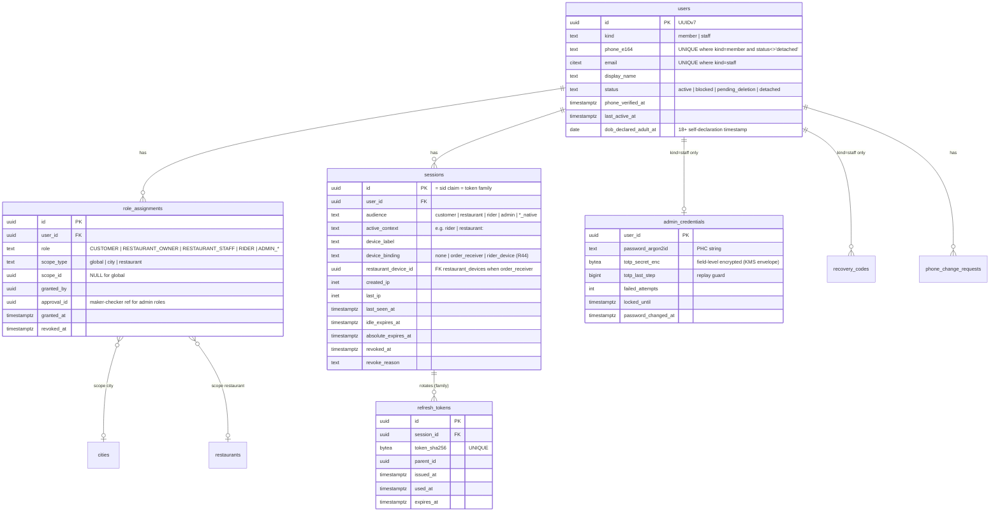
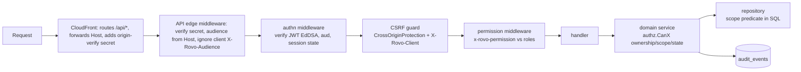

# 12 — Authentication & Authorisation (Auth / RBAC)

| | |
|---|---|
| **Purpose** | Define how every actor of rovo (customer, restaurant owner/staff, rider, admin) proves identity, how sessions and tokens work across the four web apps (and future native apps), and how every API action is authorised (RBAC + resource/attribute checks, maker-checker, audit). This is the contract Backend, Frontend and QA implement and test against. |
| **Owner** | Security Architect |
| **Status** | Draft v1.1 — reconciled with review (31) and rulings R1–R48, 2026-10-04 |
| **Depends on** | `00-planning-baseline.md` (roles, P6, P7, P9, P14, P17), `01/02` (scope), `08-system-architecture.md` (hosts, topology), `10-database-schema.md` (tables named here), `11-api-specification.md` (endpoints, `x-rovo-permission`), `13-order-state-machine.md` (who may trigger which transition), `14-payment-architecture.md` (refunds, payouts), `15-notification-architecture.md` (SMS/OTP provider), `17/18` (frontend session handling, PWA), `19-security-threat-model.md` (threats → SEC-xxx requirements), `22-deployment-architecture.md` (CDN/load-balancer path routing, managed runtime, secrets manager/KMS), `24-observability-strategy.md` (audit/log pipelines) |
| **Consumed by** | Backend, Frontend, QA (`20-testing-strategy.md`), DevOps, Release (`27`, `29`) |

Tags: `[ASSUMPTION]` assumption to validate · `[OPEN]` decision pending · `[LEGAL]` needs legal review. Requirement IDs `SEC-xxx` are defined in `19-security-threat-model.md` §9 and referenced here.

**Changes in v1.1** (review 31 + rulings R1–R48):
- Four hosts `app.` / `restaurant.` / `rider.` / `admin.` (R14), each serving `/api/v1` same-origin through CloudFront (R15, R27). No browser-facing `api.` host and no CORS in V1; `api.` carries only provider webhooks until native apps exist (§4.1).
- The audience (`customer | restaurant | rider | admin`) is **derived server-side from `Host`**, and only for requests that carry the valid origin-verify secret. A client-supplied `X-Rovo-Audience` is never trusted (RV-001, RV-025; SEC-186).
- `partner` audience split into `restaurant` and `rider`; `partner` survives only as an alias group in OpenAPI `x-rovo-audiences` (§4.1).
- Maker-checker narrowed to the five R31 families plus break-glass self-approval with a 24 h post-review. Go-live gate: ≥ 2 named people able to approve money actions (§5.5, C7).
- Admin: TOTP mandatory, passkeys **P1**, WAF rate and geo-IN rules on the admin host. **No identity-aware proxy** (R37, C4) (§3.5).
- KYC: images only (JPEG/PNG/WebP), server re-encode, SSE-KMS, audited streaming view, short-TTL signed URLs. No ClamAV and no app-layer file encryption. Field-level encryption stays for bank account numbers and TOTP secrets (R38, C5) (§6.2).
- Audit log: append-only table protected by DB grants and a trigger; the per-row hash chain and WORM anchor are cut (C6, RV-028). High-volume OTP telemetry moves to the security log stream (§5.7).
- Device-bound sessions: restaurant order-receiver devices 30 d sliding / 90 d absolute; riders 30 d sliding (R44, M10) (§3.4).
- SSE: heartbeat 20 s, no `Last-Event-ID` replay, `reauth` only on session revocation, 30-min stream cap (R10, RV-011) (§4.7).
- Bot challenge runs only on risk signals, with a `fake` adapter for local/CI (RV-020, RV-034). WebOTP lines: one DLT template per OTP-using host (RV-017) (§2.2).

---

## 0. Decision summary

| ID | Decision | Short rationale |
|---|---|---|
| AUTH-D01 | One `users` table for all **members** (customers, restaurant people, riders) keyed by phone. **Admins are separate identities** (`users.kind = 'staff'`) that log in by email and cannot hold member roles. | Keeps phone-OTP (weaker, SIM-swap-prone) away from privileged accounts; limits blast radius. |
| AUTH-D02 | The same phone **may** hold `CUSTOMER` + `RIDER`, or `CUSTOMER` + `RESTAURANT_*`. **`RIDER` and `RESTAURANT_OWNER/STAFF` are mutually exclusive** in V1. | Real people order food and also ride; but a rider attached to a restaurant creates conflicts of interest (self-dispatch, fake deliveries). |
| AUTH-D03 | Sessions are **per app audience** (`customer`, `restaurant`, `rider`, `admin`), one per host (R14). Each web app talks to the API **same-origin** via `https://<app-host>/api/v1/*` (R15, R27): the CloudFront distribution routes `/api/*` to the API load balancer and everything else to the static bucket. Each app therefore has its own host-only cookie jar. The audience is **derived server-side from `Host`**, and only when the CloudFront origin-verify secret is present; a client `X-Rovo-Audience` header is ignored (RV-025). | Isolates app sessions from each other without `Domain` cookies; removes CORS; simplest CSRF story. Fits P7 (object storage + CDN) via standard path-based CDN routing (§4.1). |
| AUTH-D04 | Access token = **JWT signed with EdDSA (Ed25519)**, `kid` header, **10 min** (admin **5 min**). Refresh = **opaque 256-bit random token, SHA-256-hashed in DB, rotated on every use, with reuse detection that revokes the whole family**. | Asymmetric signing means verifiers don't hold signing keys (future edge/native/other services). Opaque refresh is revocable server-side. |
| AUTH-D05 | Restaurant, rider and admin requests also check **server-side session state** on every request (cached ≤ 30 s, admin uncached). Customer requests are stateless JWT checks. | Fast revocation where privilege is high; cheap where volume is high. |
| AUTH-D06 | CSRF = `SameSite` (Lax for customer/restaurant/rider, Strict for admin) **+** Fetch-Metadata/Origin check (Go 1.25 `http.CrossOriginProtection`) **+** mandatory `X-Rovo-Client` header and JSON-only bodies on unsafe methods. **No double-submit token.** | Same-origin topology makes these sufficient; double-submit adds complexity without protection beyond this. |
| AUTH-D07 | OTP: 6 digits, 5 min TTL, 5 verify attempts, HMAC-SHA-256 with a server-side pepper, India `+91` mobiles only, a bot challenge (Cloudflare Turnstile, behind the `BotChallenge` interface) **only when risk signals fire** (soft IP limit exceeded, new device with high velocity, or global strict mode) (RV-034), layered Postgres-backed rate limits (R21), global SMS budget breaker. Local/CI/E2E use `BotChallenge=fake` (RV-020). | SMS pumping and OTP brute force are the top auth threats (19 §5.1). |
| AUTH-D08 | Admin: email + password (**argon2id m=64 MiB, t=3, p=1**) + **mandatory TOTP** (RFC 6238) for every admin at V1 + 10 single-use recovery codes. WebAuthn/passkeys are **P1** (R37): mandatory for `ADMIN_SUPER`/`ADMIN_FINANCE` once shipped. WAF rate and geo-IN rules on the admin host; **no identity-aware proxy** (C4). Idle 30 min / absolute 12 h. Step-up TOTP for sensitive actions. No self-signup. | Matches NIST SP 800-63B-4 AAL2 timeouts; phishing-resistant factor follows as P1. |
| AUTH-D09 | Authorisation is **deny by default**: route-level permission from OpenAPI `x-rovo-permission` (middleware) **plus** ownership/scope policy in the domain service **plus** scope predicates in every repository query. Unauthorised access to another party's resource returns **404**. | Defence in depth against IDOR; avoids leaking existence. |
| AUTH-D10 | **Maker-checker** only for the five R31 families: (1) refunds, goodwill, ledger or cash adjustments above threshold; (2) payout batch release; (3) commission / fee-config changes; (4) payout bank/UPI detail changes; (5) admin role grants. Break-glass self-approval with a mandatory 24 h post-review. Everything else is audit + preview + next-day review (C7). | Insider-abuse control where money or privilege moves, sized for a small team. |
| AUTH-D11 | **No impersonation / "login as" in V1.** Support uses read-only "support view" screens under the admin's own identity, every view audited. | Impersonation is a classic insider and audit-integrity risk. |
| AUTH-D12 | KYC documents are **images only** (JPEG/PNG/WebP; the client converts PDFs/photos). The server re-encodes them and stores them in a **separate private bucket with SSE-KMS** (CMK `kms-kyc`). They are viewed through an audited API stream or a short-TTL signed URL (≤ 60 s), only by `ADMIN_OPS` (city-scoped), `ADMIN_SUPER`, and `ADMIN_FINANCE` (bank proof only). No ClamAV and no app-layer file encryption in V1 (R38, C5). Aadhaar is **never** stored unmasked. | DPDP minimisation and Aadhaar rules; images-only removes the PDF malware path. |

---

## 1. Identity model

### 1.1 Entities



Table names are proposals for `10-database-schema.md`; Backend owns final DDL.

### 1.2 Roles and scopes

| Role | `users.kind` | Scope type | Granted by | Notes |
|---|---|---|---|---|
| `CUSTOMER` | member | global | system, at first OTP login in the customer app | Implicit for every member who uses the customer app. |
| `RESTAURANT_OWNER` | member | restaurant | `ADMIN_OPS` on KYC + contract approval | One owner may own several outlets, so several assignments. |
| `RESTAURANT_STAFF` | member | restaurant | `RESTAURANT_OWNER` of that restaurant (invite by phone) | Staff limit per restaurant (default 10) `[ASSUMPTION]`. |
| `RIDER` | member | city | `ADMIN_OPS` on rider KYC approval | One city in V1. |
| `ADMIN_SUPER` | staff | global or city | `ADMIN_SUPER` + checker (second `ADMIN_SUPER`) | First one via CLI bootstrap (§3.6). Keep the count at 2–3 people. |
| `ADMIN_OPS` / `ADMIN_SUPPORT` / `ADMIN_FINANCE` | staff | city (NULL = all cities) | `ADMIN_SUPER` (maker-checker) | Several admin roles per staff user are allowed, except **FINANCE+SUPPORT on the same person is discouraged** (refund maker = checker risk; enforced by "checker ≠ maker" anyway). |
| `SYSTEM` (internal, R26) | n/a | global | n/a | Non-human principal for worker jobs (auto-cancel, payout calc). Appears in the audit log as `actor_type=system`. |

### 1.3 Can a person be both customer and rider on one phone? (decision)

**Yes (AUTH-D02).** In a small city, riders and restaurant staff are also customers. Forcing a second SIM is unrealistic and pushes people to borrow numbers, which is worse for KYC integrity.

How it works:

- **Separate apps, separate sessions.** The customer app (`app.` host) issues `aud=customer` sessions, which only ever carry `CUSTOMER` permissions. The restaurant app (`restaurant.` host) issues `aud=restaurant` sessions carrying only `RESTAURANT_*` permissions, and the rider app (`rider.` host) issues `aud=rider` sessions carrying only `RIDER` permissions (R14). A stolen customer session can never act as a rider, and the reverse holds too.
- **Context switching inside the restaurant app.** An owner of several outlets, or an owner who is also staff elsewhere, picks an **active context** (`restaurant:<id>`). This calls `POST /api/v1/auth/context`, which re-issues the access token with a new `ctx` claim in the same session family. A rider's context is always `rider`.
- **Mutual exclusion (R26).** `RIDER` and `RESTAURANT_*` are never granted to the same user in V1. A DB constraint or trigger plus a domain check enforces it. There are no exceptions in V1.
- **Fraud guards for dual-role people** (enforced in the domain, tested as SEC-047):
  - A rider is never offered or assigned a delivery for an order placed by their own user id, or delivered to an address on their own account.
  - A restaurant member cannot rate or review a restaurant they are assigned to, and cannot redeem restaurant-funded coupons at it.
  - Rider earnings and customer refunds go to separate wallets/ledgers; no cross-netting.

### 1.4 Phone-number recycling (India-specific risk)

Indian operators recycle deactivated numbers after an inactivity period, commonly cited as ~90 days `[ASSUMPTION — verify with DoT/TRAI rules]`. Someone who receives a recycled number would pass OTP for the previous holder's account. Controls:

- When a member's `last_active_at` is older than **180 days** and OTP succeeds, the customer app shows a masked confirmation ("Is this your account? Name: R\*\*\*\* K., last order Mar 2026"). Choosing **"No, this is a new number"** sets the old account to `status=detached`, frees the phone, and creates a fresh account. The old account's data then follows the retention schedule (19 §8.5). The new holder never sees old addresses or orders before confirming. Even after "Yes", saved addresses are shown **masked until the first order is placed** `[OPEN — UX review]`.
- **Riders and restaurant owners** inactive for more than 90 days go through ops re-verification (selfie + document check) before payouts or bank-detail views are re-enabled.

---

## 2. Phone OTP authentication (members)

### 2.1 Flow

```mermaid
sequenceDiagram
    autonumber
    participant B as Browser (app./restaurant./rider.)
    participant CF as Edge (CDN + cloud WAF) / Turnstile
    participant API as rovo API (auth module)
    participant DB as Postgres
    participant SMS as SMS provider (primary/secondary)
    B->>API: POST /api/v1/auth/otp/request {phone, purpose:"login"} + X-Rovo-Client
    opt risk signal fired (soft IP limit, new device + velocity, strict mode)
      API-->>B: 428 {challenge_required}
      B->>CF: Turnstile widget (invisible/managed)
      B->>API: retry with turnstile_token
      API->>CF: siteverify(token, remoteip) — check success, hostname, action="otp_request"
    end
    API->>DB: rate-limit checks (phone, IP, /24, device, global budget) [Postgres-backed]
    API->>DB: INSERT otp_challenges(id, phone_hmac, code_hmac, expires_at=+5m, attempts=0, purpose)
    API->>SMS: send DLT template for this host "<#> 123456 is your rovo login code... @app.rovo.in #123456"
    API-->>B: 202 {challenge_id, resend_after:30} (identical whether or not the account exists)
    B->>API: POST /api/v1/auth/otp/verify {challenge_id, code} (WebOTP autofill where supported)
    API->>DB: SELECT ... FOR UPDATE; check not expired/consumed, attempts<5; attempts++
    API->>API: hmac.Equal(HMAC(pepper, challenge_id||code), code_hmac) (constant time)
    alt success
      API->>DB: consume challenge; upsert user (CUSTOMER on first login in customer app); create session + refresh family
      API-->>B: 200 Set-Cookie __Host-rovo_at, __Secure-rovo_rt; body {user, is_new, needs_profile}
    else failure
      API-->>B: 401 {error:"otp_invalid", attempts_left} (after 5 → challenge dead, must request new)
    end
```

### 2.2 Parameters (defaults, config per city in `auth_settings`)

| Parameter | Value | Notes |
|---|---|---|
| OTP length | **6 digits** | CSPRNG (`crypto/rand`), uniform 000000–999999. NIST SP 800-63B-4 minimum is six digits. |
| OTP TTL | **5 min** | NIST allows up to 10 min; 5 min is tighter. |
| Max verify attempts per challenge | **5** | Then the challenge is invalidated. Brute-force odds per challenge: 5/10⁶. |
| Max failed verifies per phone | **10/hour, 20/day** | After that: 1 h lock on OTP login for that phone, plus an SMS notice to the phone (the SMS is itself rate limited). Stays below the NIST 100-consecutive-failures ceiling. |
| Resend cooldown | 30 s → 60 s → 120 s → 300 s | Each resend **creates a new challenge** and invalidates earlier ones. |
| Sends per phone | **5/hour, 10/day** | |
| Sends per IP | 20/10 min, 100/day **(soft)**, beyond which the bot challenge is required (interactive mode on repeat) | Indian mobile networks use CGNAT, so many users share one IP. IP limits **escalate** rather than block, except at 5× the soft limit. |
| Sends per /24 (IPv4) or /48 (IPv6) | 300/day soft | |
| Sends per device id | 5/hour | `rovo_did`, a random first-party cookie. Weak (clearable), so it only feeds risk scoring. |
| Global SMS budget breaker | Alert at 2× the trailing-7-day hourly p95; at **4×**, global "strict mode" (interactive Turnstile for everyone, per-IP hard limits), page on-call | Caps toll-fraud spend. Daily hard budget in provider console as a second layer `[ASSUMPTION: provider supports it]`. |
| Number filter | E.164 `+91`, 10 digits, first digit 6–9, libphonenumber `MOBILE` type; reject known test/invalid ranges; **no international numbers in V1** | Removes international revenue-share (IRSF) pumping, the costliest variant. |
| Turnstile | **Risk-based (RV-034):** required only when a risk signal fires (soft per-IP or /24 limit exceeded, new device with high velocity, global strict mode). When required: managed mode, `action=otp_request`, validated server-side with `remoteip`, `hostname` and `action` checked, single-use token. Local, CI and E2E use `BotChallenge=fake`, which accepts any token, so the golden flow runs offline (RV-020); real Turnstile test keys are used only in a staging smoke test | Turnstile works standalone (no Cloudflare proxy needed). Free plan: unlimited challenges, 20 widgets, 10 hostnames per widget (Cloudflare docs, accessed 2026-10-04). Behind a `BotChallenge` interface so AWS WAF CAPTCHA/Challenge or reCAPTCHA Enterprise can replace it `[OPEN — DevOps cost/UX comparison]`. If Turnstile siteverify itself is down: **fail closed for new devices, fail open with hard per-phone limit of 1/10 min for devices with a valid prior session** `[ASSUMPTION — product to accept]`. |
| OTP storage | `code_hmac = HMAC-SHA-256(K_otp, challenge_id ‖ code)`; `phone_hmac = HMAC-SHA-256(K_phone, e164)` for rate-limit keys | A slow hash adds nothing for a 10⁶ space. The **pepper `K_otp` lives outside the DB** (cloud secrets manager, see 19 §7.5), so a DB dump alone does not reveal live codes. Comparison uses `hmac.Equal`. Rows are purged after 24 h; aggregates stay in metrics. |
| Purposes | `login`, `phone_change_old`, `phone_change_new`, `step_up` | A code is only valid for its purpose and challenge. |
| SMS content | DLT-registered template; **no links**; contains the domain-bound WebOTP line for the requesting host (`@app.rovo.in`, `@restaurant.rovo.in` or `@rider.rovo.in` + ` #123456`) and the Android SMS Retriever hash for future native apps. The admin host uses TOTP and sends no OTP SMS. **Decision (RV-017):** register **one DLT template per OTP-using host** (3 templates), not a host variable, because operators may scrub domains in variable fields as unregistered URLs `[ASSUMPTION — confirm with the aggregator in week 1; if a host variable passes scrubbing, collapse to one template]` | WebOTP binds autofill to our origin, which blunts phishing relays. TRAI/DLT template compliance is owned by `15-notification-architecture.md` (N-6). |

**Account enumeration:** `otp/request` responses and timings are identical for known and unknown numbers. `is_new` is only revealed after successful verification. Blocked accounts get the same 202 and the verify step returns a generic `account_unavailable`.

**Rate-limiter storage (R21):** OTP and auth limits must be **durable and shared across replicas**, so they go in Postgres from day one: `rate_limit_buckets` (M4) with an `UPSERT … RETURNING` sliding window; a plain table with a nightly retention `DELETE`, no partitioning (C8). Otherwise a deploy, restart or scale-out resets or splits the counters, which an attacker can exploit. They move to the managed Redis-compatible cache only if/when P6's adapter is enabled. General API limits may use in-memory buckets per replica as a soft layer behind the edge WAF rate rules.

### 2.3 Account creation

- **Customer app:** the first successful verify creates `users(kind=member)` plus a `CUSTOMER` role. A profile step (name, optional email) follows, along with **DPDP notice + consent capture** (versioned notice id stored in `consents`, see 19 §8) and an **18+ self-declaration** (19 §8.6), shown together on one screen (RV-057).
- **Restaurant and rider apps:** OTP verify creates or reuses the member, but **grants no partner role**. The user lands in onboarding, which creates a `partner_applications` row (`rider` or `restaurant`) in `PENDING_KYC`. Roles are granted only when `ADMIN_OPS` approves KYC (§7). Restaurant staff join via an owner invite (`staff_invites` row bound to a phone hash, 72 h expiry, single use). After OTP verify the staff member gets `RESTAURANT_STAFF` scoped to that restaurant.

### 2.4 Phone-number change

| Situation | Flow |
|---|---|
| User still has the old SIM (normal) | Logged in, then step-up OTP to the **old** number, then OTP to the **new** number. The new number must not belong to an active account (if it does, offer the "recycled number" path, §1.4). On success: update phone, **revoke all other sessions**, SMS the old number ("your rovo number was changed; not you? contact support"), audit `auth.phone_changed`. |
| Lost old SIM, customer | Support-assisted: user logs in with the **new** number, which creates a new account. Support may *merge* order history only after verifying ≥ 2 facts (last order code, saved address locality, approximate amount) with maker-checker by a second support agent `[OPEN — product may simply decline merges in V1]`. |
| Lost old SIM, rider / restaurant owner | Ops re-KYC (ID document + selfie match by a human reviewer). Payout destination changes are **frozen for 72 h** after a phone change, and owners are notified on their registered email. |

### 2.5 SIM-swap and account takeover controls

- DoT instructions bar SMS on a swapped/replacement SIM for 24 h, which blunts but does not remove SIM-swap ATO (DoT, 27 Sep 2022 — see sources).
- We have no telco SIM-swap signal API in V1 `[OPEN: some Indian SMS aggregators sell SIM-swap/“number intelligence” lookups; evaluate cost in V1.1]`.
- For members, high-value actions require step-up **plus** a cooling-off delay with out-of-band notice:
  - **Rider / owner bank-account or UPI payout change:** step-up OTP, then a 48 h delay before the new destination is used, plus SMS and email notice, plus `ADMIN_FINANCE` verification of penny-drop or bank proof (maker-checker, §6.5).
  - **Customer:** there is no stored-value wallet in V1 (`[ASSUMPTION]` per 02-scope), so ATO impact is limited to PII (addresses, order history) and placing COD orders. A new device login triggers an SMS notice to the account phone.
- **Login risk signals** (logged, then used to escalate Turnstile and step-up): new device, new IP ASN, more than 3 accounts per device id in 24 h, impossible travel.

### 2.6 Provider fallback and alternative channels

- `OtpSender` interface with **primary** and **secondary** SMS providers, both registered with the same DLT entity, header and template.
- Fallback triggers: primary API error or timeout (> 3 s); no delivery report (DLR) within 30 s **and** the user taps "Didn't get it?" (that counts as a resend and consumes rate limit). The challenge is never auto-sent on both providers (double cost, pumping amplification).
- **Voice OTP** (from the same provider) is offered on the 3rd attempt `[OPEN — cost]`.
- **WhatsApp OTP** (Meta authentication templates via a BSP) is **cut from V1** (C2; V1.1 candidate). It is attractive (cheaper per message in India `[ASSUMPTION — verify pricing]`, high WhatsApp penetration) but adds a BSP contract and Meta template approval. The design keeps a `channel` column so it can be added later. Rate limits apply per phone across channels combined.
- **Email OTP is not a login factor** for anyone. For admins, email carries only notifications and password-reset links, and a reset still requires TOTP (§3.3).

---

## 3. Admin authentication

### 3.1 Credentials

| Item | Decision |
|---|---|
| Identifier | Work email (citext, unique). Admin accounts are `users.kind='staff'` and cannot log in via OTP or hold member roles. |
| Password policy | 12–128 chars, any characters, Unicode NFKC-normalised. **No composition rules, no periodic expiry.** Rejected if it appears in a breached-password corpus (offline top-1M list bundled at build time; online HIBP k-anonymity range API optional `[OPEN]`). Rejected if it contains the email local-part. Follows NIST SP 800-63B-4. |
| Hash | **argon2id, m = 64 MiB, t = 3, p = 1**, 16-byte salt, 32-byte output, PHC string format. This exceeds the OWASP minimum (m=19 MiB, t=2, p=1). A per-replica semaphore allows at most 4 concurrent hashes to avoid memory-exhaustion DoS (size the API task memory accordingly). Re-hash on login when params change. Benchmark target: ≤ 400 ms on the production task size `[ASSUMPTION — benchmark on chosen vCPU/arch]`. |
| Lockout | Progressive delay after 3 failures (1 s, 2 s, 4 s…). After **10 failures per account in 1 h**, the account is locked for 15 min, `ADMIN_SUPER` is alerted, and the event is audited. Failed-attempt counters per IP sit at the edge (AWS WAF rate-based rule on `admin.` `/api/v1/auth/admin/*`, plus a geo = IN rule on the whole admin host, R37) and in the app. |
| Second factor | **TOTP mandatory** for every admin, enrolled at first login; the account can do nothing else until enrolment is complete. |

### 3.2 TOTP (RFC 6238)

- SHA-1, 6 digits, 30 s step. These are the defaults that every authenticator app supports; SHA-1 HMAC remains acceptable in this construction.
- 160-bit secret from CSPRNG, shown once as QR plus base32. Stored with **field-level encryption** (KMS envelope, `totp_secret_enc`, see 19 §7.3; kept under R38).
- Verification window ±1 step. **Replay guard:** reject any step ≤ `totp_last_step`.
- 5 failed TOTP attempts after a correct password lock the account for 15 min. The alert says "password correct, TOTP failed", a strong compromise signal, so `ADMIN_SUPER` is paged.
- **Recovery codes:** 10 codes of 10 base32 chars (50 bits each), shown once, stored as `HMAC-SHA-256(K_rc, code)`, single use. Using one triggers an alert, forces TOTP re-enrolment, and notifies all `ADMIN_SUPER`s.
- **Lost TOTP and codes:** another `ADMIN_SUPER` issues a reset through maker-checker (a second admin approves; treated as R31 family 5 because it re-grants admin access). The person re-enrols via a one-time setup link.
- **WebAuthn / passkeys (P1, R37):** add as a phishing-resistant factor after launch. Once shipped it is mandatory for `ADMIN_SUPER` and `ADMIN_FINANCE`, with TOTP as fallback for other admin roles. Not a Gate A/B item.

### 3.3 Provisioning, reset, offboarding

1. **Bootstrap:** the first `ADMIN_SUPER` is created by a one-time CLI command (`rovo admin bootstrap --email …`). In production it runs as a one-off task (e.g. ECS RunTask / Cloud Run job) started by a named human through SSO, so the cloud audit log (CloudTrail / Cloud Audit Logs) records who ran it. It refuses to run if any `ADMIN_SUPER` exists, delivers a one-time setup link (24 h TTL) to the given email (never to stdout/logs in prod), and writes an audit event. There is no seeded default credential.
2. **Provisioning:** only `ADMIN_SUPER` creates admin users (email, display name, roles, city scope). This is an **admin role grant, so it goes through maker-checker** (§6.5). Once approved, the system emails a one-time **setup link** (random 256-bit token, hashed in DB, 24 h TTL, single use). The invitee sets a password, enrols TOTP and saves recovery codes. **No self-signup endpoint exists on the admin audience.**
3. **Password reset:** a "forgot password" email link (30 min, single use). The reset requires a current TOTP code (or a recovery code). The response is identical for unknown emails. A completed reset revokes all sessions.
4. **Offboarding:** "deactivate" revokes all sessions immediately (admin requests check session state uncached, AUTH-D05), revokes role assignments, and is audited. Accounts with no login for 60 days are auto-disabled, and `ADMIN_SUPER` gets a monthly access-review report (19 SEC-024).

### 3.4 Sessions, timeouts and step-up

| Parameter | Admin | Restaurant (personal device) | Restaurant **order-receiver device** (R44) | Rider (R44) | Customer |
|---|---|---|---|---|---|
| Access JWT TTL | 5 min | 10 min | 10 min | 10 min | 10 min |
| Idle timeout (refresh not used) | **30 min** | 7 days | **30 days sliding** | **30 days sliding** | 30 days |
| Absolute session lifetime | **12 h** (no "remember me") | 30 days | **90 days** | 180 days `[proposal — R44 sets sliding only]` | 180 days |
| Server-side session check per request | Yes, uncached | Yes, cached ≤ 30 s | Yes, cached ≤ 30 s | Yes, cached ≤ 30 s | No (JWT only; revocation effective at ≤ 10 min) |
| Concurrent sessions | Max 2 per admin | Max 5 | 1 per registered device | Max 3 | Max 10 (oldest evicted) |

NIST SP 800-63B-4 AAL2 guidance is ≤ 24 h overall and ≤ 1 h inactivity; admin values are stricter.

**Device-bound sessions (R44, M10, RV-054).** A restaurant owner (or `ADMIN_OPS` during onboarding) registers a counter device as an **order receiver** (`restaurant_devices.is_order_receiver = true`). Its session row carries `device_binding = order_receiver` and `restaurant_device_id`:
- The refresh token still rotates on every use, with reuse detection. The binding adds a device key: the PWA generates a non-extractable WebCrypto key pair at registration and signs each refresh request; the server stores the public key on `restaurant_devices`. A copied refresh cookie alone cannot refresh `[ASSUMPTION — verify WebCrypto non-extractable keys persist in IndexedDB across Chrome updates on target devices]`.
- The session never expires mid-service. If the 90-day absolute limit falls within the next 7 days, re-authentication (owner OTP) is prompted **outside service hours** only.
- The owner (restaurant app → Devices) and `ADMIN_OPS` (admin) can list and revoke order-receiver devices; revocation closes the device's SSE stream immediately.
- Order-receiver sessions hold only the `RESTAURANT_STAFF`-level permission set for that outlet (inbox, accept/reject, availability). Owner-only actions (payouts, bank, staff, menu prices) need a personal owner session with step-up.
- Rider sessions are bound to the rider's own phone (`rider_device`) and slide for 30 days. A new device login revokes the previous rider session and triggers an SMS notice.

**Step-up (re-authentication).** Sensitive actions require a fresh second factor within the last **5 min**, bound to the action:
- Endpoints return `401 {error:"step_up_required", step_up_id}`.
- The client posts a TOTP code (admin) or a `step_up` OTP (member), and the server records `sessions.step_up_at` plus the allowed action class.
- Step-up actions for admin: approving or creating any maker-checker request, revealing full PII (phone, address, bank number), viewing a KYC document, exporting reports with PII, changing own password or TOTP, and managing admin users.
- Step-up actions for members: phone change, bank/UPI payout destination change, account deletion request, and adding or removing restaurant staff.

### 3.5 Network restrictions for the admin console (R37)

- **No identity-aware proxy in V1** (C4: cost and operations for a small team; the former "Option A" — Verified Access / IAP / Cloudflare Access — is withdrawn).
- **Edge rules on the admin host (V1):** AWS WAF on the CloudFront distribution with (a) a **rate-based rule** on `/api/v1/auth/admin/*` (19 §6.11 W3), and (b) a **geo rule** that blocks requests to the `admin.` host from outside India. Ops staff work from phones on dynamic mobile IPs (07 §1), so an IP allowlist is not the default.
- **Optional:** an in-app per-account allowlist (`admin_ip_allowlist` CIDRs) for finance staff with fixed office IPs. The in-app check uses the client IP derived only from the **trusted proxy chain** (CDN/LB-appended `X-Forwarded-For` hops counted from the right; never the left-most, client-controlled value).
- Inner gate: password + mandatory TOTP now; passkeys (WebAuthn) as P1 (§3.2).
- Admin console sends `X-Frame-Options: DENY`, strict CSP, `Cache-Control: no-store`, and `Referrer-Policy: no-referrer`.

---

## 4. Tokens, sessions, cookies, CSRF, CORS, SSE

### 4.1 Host topology (decision AUTH-D03, refines P7)

| Host | Serves | Audience (derived from `Host`) | API base | Cookie jar |
|---|---|---|---|---|
| `app.rovo.in` | Customer PWA (static) | `customer` | `https://app.rovo.in/api/v1/…` | customer session cookies, host-only |
| `restaurant.rovo.in` | Restaurant PWA | `restaurant` | `https://restaurant.rovo.in/api/v1/…` | restaurant session cookies, host-only |
| `rider.rovo.in` | Rider PWA | `rider` | `https://rider.rovo.in/api/v1/…` | rider session cookies, host-only |
| `admin.rovo.in` | Admin SPA | `admin` | `https://admin.rovo.in/api/v1/…` | admin session cookies, host-only |
| `api.rovo.in` | **V1: provider webhooks only** (`/webhooks/payments/{provider}`, `/webhooks/notifications/{provider}`), server-to-server, no CORS. Reserved for future native **bearer** clients (`*_native` audiences, not enabled in V1) (R14, R27) | `webhook` | `https://api.rovo.in/webhooks/…` (native later: `https://api.rovo.in/api/v1/…`) | **No cookies accepted** (cookie auth disabled on this host) |

`partner` is kept only as an **alias group** in OpenAPI `x-rovo-audiences` (= `restaurant` ∪ `rider`), so doc 11 operations tagged `partner` stay valid. Middleware expands the alias, and the role check then admits only the matching roles on each host.

**Production routing (cloud-agnostic, examples in brackets):**
- Each app host is one **CDN distribution** (CloudFront / Cloud CDN on a global external Application LB / Azure Front Door) with **two origins**:
  1. the private static bucket for the SPA build (S3 with Origin Access Control / GCS backend bucket); default behaviour, long-cache hashed assets;
  2. the **API load balancer** (ALB / regional LB → managed containers) for path `/api/*`, **caching disabled**, all cookies and the needed headers forwarded.
- **Audience derivation (RV-001, RV-025, SEC-186).** The `/api/*` behaviour forwards the viewer `Host` header (origin request policy including `Host`) and CloudFront adds a secret **origin-verify header** (`X-Rovo-Origin-Verify`, value from Secrets Manager, rotated with dual-value overlap). The API:
  1. rejects with `403` any request on the public listener that lacks a valid origin-verify value (webhooks included, since they also arrive through CloudFront on `api.`);
  2. maps `Host` → audience from a fixed server-side table (`app.`→`customer`, `restaurant.`→`restaurant`, `rider.`→`rider`, `admin.`→`admin`, `api.`→`webhook`); unknown hosts → `421`;
  3. **ignores and logs** any client-supplied `X-Rovo-Audience` (the header is never an input to authorisation).
  An authz test sends forged `X-Rovo-Audience: admin` both with and without the secret and asserts it has no effect.
- The API LB accepts traffic **only from CloudFront**: the CloudFront managed prefix list in the ALB security group **plus** the origin-verify header check above. This stops WAF/CDN bypass.
- Hashed assets get `Cache-Control: public, max-age=31536000, immutable`; `index.html` gets `no-cache`. Authenticated `/api/*` responses are never cached (`Cache-Control: no-store` plus CDN behaviour with caching disabled).
- **Local dev:** four Vite dev servers (one per app), each proxying `/api` → API container with the matching `Host` and a dev origin-verify value, so the local stack has the same same-origin shape.
- If Cloudflare is put in front (allowed by P7), it proxies the same hostnames to the cloud CDN/LB. Cookie and CSRF design is unchanged.

Why not a shared `api.rovo.in` for all SPAs?
- (a) All four apps would share one `api.rovo.in` cookie jar, so an XSS in the customer app could make credentialed same-site requests to admin endpoints while an admin is logged in in the same browser.
- (b) CORS with credentials becomes mandatory and error-prone.
- (c) Path-based multi-origin routing is a standard CDN/LB feature on every hyperscaler, so same-origin costs nothing extra.
- ~~Fallback: a shared browser-facing `api.rovo.in` with CORS~~ — **withdrawn in v1.1** (R27: no public `api.` host with CORS in V1). CloudFront request volume is handled by request reduction (batched rider pings, 60 s restaurant heartbeat, SSE presence counts as heartbeat) and, if needed, CloudFront pay-as-you-go, never by moving the API off the CDN.

### 4.2 Access token (JWT)

- **Algorithm: EdDSA (Ed25519)** (RFC 8037). Go stdlib `crypto/ed25519`; `golang-jwt/jwt/v5` supports `EdDSA`. **ES256** is the approved fallback if any consumer lacks EdDSA support. **HS256 rejected:** every verifier would hold the signing secret, which blocks verification at the edge/native/other services without key sharing.
- **Verification rules:**
  - The `alg` allowlist is fixed to `EdDSA` (no `none`, no algorithm taken from the token).
  - `kid` must exist in the local keyset.
  - Check `iss`, the `aud` equal to the host's audience, `exp`/`nbf` with ±30 s leeway, and `typ=at+jwt`.
  - Tokens over 2 KB are rejected.
- **Claims:**

```json
{
  "iss": "https://rovo.in",            // per-deployment config
  "sub": "0192f1c2-…",                 // users.id (UUIDv7)
  "aud": "restaurant",                 // customer | restaurant | rider | admin | *_native (later)
  "sid": "0192f1c3-…",                 // sessions.id (also refresh-token family id)
  "ctx": "restaurant:0192e…",          // active context; "rider"; omitted for customer/admin
  "roles": ["RESTAURANT_OWNER"],       // snapshot for coarse checks & UI; NOT used for scope decisions
  "scp": {"city": ["0192…"]},          // admin city scopes snapshot (admin only)
  "amr": ["otp"],                      // ["pwd","otp"] for admin; "totp" ; later "hwk"
  "iat": 1791072000, "nbf": 1791072000, "exp": 1791072600,
  "jti": "0192f1c4-…"
}
```

- No PII (phone, name, email) in tokens.
- Scope decisions (restaurant id, city) for restaurant/rider/admin are **re-validated against `role_assignments` per request** (cached ≤ 30 s) so revocation is fast (AUTH-D05).

### 4.3 Refresh tokens: rotation and reuse detection

- Format: `rvr_` + base64url(32 random bytes). The prefix lets GitHub secret scanning and gitleaks custom rules catch leaks.
- Stored as `SHA-256(token)`. The token has full entropy, so no slow hash is needed. The hash is looked up by unique index, which needs no constant-time compare.
- **Rotation:** every `POST /api/v1/auth/refresh` consumes the presented token (`used_at = now()`) and issues a child in the same family (`session_id`). This also slides the idle expiry, capped by the absolute expiry.
- **Reuse detection:**
  - If a token whose `used_at` is set is presented again **more than 15 s** after it was used, the whole session (family) is revoked (`revoke_reason='refresh_reuse'`). The event is audited, a security metric fires, and the user is notified by SMS (members) or alert (admins).
  - **Benign race (within 15 s):** respond `409 refresh_race` without revoking. The browser cookie jar already holds the new token from the winning request, so the losing tab simply retries.
  - The frontend uses a single-flight refresh across tabs (Web Locks API, with `BroadcastChannel` fallback) to make races rare (see 17).
- Refresh tokens are never readable by JS (httpOnly), never put in localStorage, and never logged.

### 4.4 Cookies

| Cookie | Value | Attributes |
|---|---|---|
| `__Host-rovo_at` | access JWT | `Secure; HttpOnly; Path=/; SameSite=Lax` (customer, restaurant, rider) / `SameSite=Strict` (admin); `Max-Age` = token TTL; **no `Domain`** (host-only, required by the `__Host-` prefix) |
| `__Secure-rovo_rt` | refresh token | `Secure; HttpOnly; Path=/api/v1/auth; SameSite=Strict` (all apps); `Max-Age` = absolute session lifetime; no `Domain` |
| `rovo_did` | random device id (not a credential) | `Secure; Path=/; SameSite=Lax; Max-Age=2y`; not HttpOnly so the client can send it in telemetry `[OPEN]` |

- `SameSite=Lax` is used for customer/restaurant/rider access cookies so top-level navigations work: SMS deep links, and the **payment return URL** after the PA hosted checkout.
- The PA may return via a cross-site **POST** form (Razorpay `callback_url` behaves this way `[ASSUMPTION — verify in 14]`). That POST carries no Lax cookies. Therefore the payment-return endpoint is **unauthenticated, idempotent and non-trusting**: it only redirects to `GET /orders/{id}/status`, and payment truth comes from webhooks and server-side fetch (19 §6.5).
- The refresh cookie is `Strict` and path-scoped, so it is never sent on cross-site navigations or to non-auth endpoints.

### 4.5 CSRF strategy (AUTH-D06)

All requirements apply to cookie-authenticated requests on the app hosts:

1. **No state change on safe methods** (`GET`, `HEAD`, `OPTIONS`). Lint rule: OpenAPI `GET` operations may not carry write permissions.
2. **Fetch-Metadata / Origin check** on unsafe methods using Go 1.25 `net/http.CrossOriginProtection`. It rejects requests whose `Sec-Fetch-Site` is not `same-origin`/`none`, or whose `Origin` doesn't match the host when Fetch-Metadata is absent. Requests with neither header are rejected on cookie-authenticated unsafe methods `[ASSUMPTION: all supported browsers send one; verify against 17's browser matrix]`.
3. **Custom header** `X-Rovo-Client: customer-web|restaurant-web|rider-web|admin-web` required on unsafe methods, plus `Content-Type: application/json` (multipart only on dedicated upload-init endpoints, which also need the header). Any cross-origin attempt, including from sibling subdomains, which are *same-site*, then needs a CORS preflight that we never grant.
4. **SameSite** cookies (Lax/Strict) as a third layer.
5. **Login CSRF:** the OTP verify and admin login endpoints get the same checks.

Bearer-authenticated requests (`api.rovo.in`, native clients, later) are not CSRF-prone. The API **ignores cookies on that host** and **ignores `Authorization` headers on app hosts**, so the two mechanisms never mix.

### 4.6 CORS policy

- App hosts: **no CORS headers emitted at all** (same-origin only). A preflight for `/api/*` returns 403.
- `api.rovo.in`: no CORS (V1 carries only server-to-server webhooks; native apps don't need CORS either).
- Never emit `Access-Control-Allow-Origin: *` with credentials, and never reflect `Origin`. A test (SEC-034) asserts the absence of `Access-Control-Allow-*` on every route.

### 4.7 SSE authentication

- Endpoint: `GET /api/v1/stream?topics=order:{id},inbox:{restaurant_id},offers` on the app host. It is same-origin, so the access cookie is sent automatically. **No tokens in URLs** (they leak into logs, Referer and history).
- **Authorisation at subscribe time per topic:**
  - `order:{id}` requires the caller to own the order, be the assigned rider, belong to the restaurant, or be an admin in scope.
  - `inbox:{restaurant_id}` requires a restaurant role on that restaurant and `ctx` equal to it.
  - `offers` is limited to the rider's own offers.
- Events are published to per-principal channels after policy filtering. No broadcast topics carry PII.
- **Lifetime (R10; RV-011 proposal adopted):** the stream **continues past access-token expiry** while the server-side session is valid (restaurant/rider/admin sessions are re-checked per request and on a 60 s timer for open streams; customer streams re-check the session row every 60 s). The server sends `event: reauth` and closes **only when the session is revoked, expired or blocked**; the client refreshes and reconnects. Streams are also closed at **30 min** for load rebalancing; the client reconnects with 2–10 s jitter (RV-038). There is **no replay**: `Last-Event-ID` is ignored and clients refetch REST snapshots on every (re)connect (R10). Session revocation closes all streams for that `sid` immediately. Client: rovo's own small fetch-based SSE client (17 §5.2).
- **Heartbeat** comment every **20 s** (R10), which stays below every idle timer in the path:
  - CloudFront origin response timeout (default 30 s, applied between packets) — set the `/api/*` origin to 60 s;
  - ALB idle timeout ≥ 120 s (R10);
  - Cloudflare's 125 s if in front.
  - **No response-completion timeout** may be set on the `/api/*` behaviour, otherwise long-lived streams are cut. GCP LB backend-service timeout must likewise allow long streams `[ASSUMPTION — verify GCP semantics in 22]`.
  - Sources: CloudFront and Cloudflare docs, accessed 2026-10-04.
- **Connection caps:** 3 streams per session, 5 per user, 50 per IP (CGNAT), a per-replica cap computed from the task's file-descriptor and memory budget (e.g. 2,000 per replica), with autoscaling on connection count `[ASSUMPTION — 22 to size]`. Fan-out across replicas uses Postgres `LISTEN/NOTIFY` (or Redis pub/sub once P6's adapter is enabled), and HTTP 429 with `Retry-After` beyond those. Idle subscriptions without any topic are dropped after 60 s.

### 4.8 Native apps (later)

- `aud=customer_native|restaurant_native|rider_native` on `api.rovo.in` (not enabled in V1, R27). Access token in `Authorization: Bearer`; refresh token in the request body, stored in Android Keystore / iOS Keychain.
- Same rotation and reuse detection apply. SSE uses the bearer header (native SSE clients support headers).
- V2: device attestation (Play Integrity / App Attest) at login and refresh, and optional DPoP (RFC 9449) to sender-constrain tokens `[OPEN]`.

### 4.9 Session and device management

- `GET /api/v1/me/sessions` lists device label (from parsed UA), approximate location (city from IP), created and last seen times, and a current flag.
- `DELETE /api/v1/me/sessions/{sid}` revokes one; `DELETE /api/v1/me/sessions?others=true` revokes all others.
- Admin support may revoke a member's sessions (`user.sessions.revoke`, audited with a reason).
- Restaurant order-receiver devices (R44) are listed and revoked from `GET/DELETE /api/v1/restaurants/{rid}/devices[/{id}]` (owner) and the admin restaurant page (`ADMIN_OPS`); both are audited.
- Logout revokes the session family and clears cookies (`Max-Age=0`). The `Clear-Site-Data: "cookies", "storage"` header is used on admin logout.

### 4.10 Signing-key management and rotation

- Ed25519 private keys live in the **cloud secrets manager** (AWS Secrets Manager / GCP Secret Manager / Azure Key Vault secrets), encrypted under a KMS customer-managed key. They are injected into the API task at start (task-definition secret reference / Cloud Run secret), readable only by the API's workload identity, and never stored in the DB, image or repo.
- **Option (V1.1, `[OPEN]`):** KMS-held asymmetric signing keys (non-exportable; sign calls only at token issuance, about one per refresh). Because **ES256 (P-256) is supported by every major KMS**, choosing this option switches the allowlist for those `kid`s to ES256. The `TokenSigner` interface keeps this a configuration change.
- Keyset: `active` (signs) plus up to two `previous` (verify only). `kid` = first 8 bytes of SHA-256(pubkey), base64url.
- **Scheduled rotation every 90 days:** add the new key as verify-only, deploy, promote it to active, then drop the old key after max access TTL + leeway (≥ 15 min).
- **Emergency rotation:** remove the compromised key. All access tokens die within seconds, refresh tokens (DB) still work, and clients silently refresh. Separately, a global `sessions_not_before` timestamp can kill all refresh families if the DB or pepper is suspected compromised.
- **JWKS:** `GET /internal/jwks.json` on the internal listener only (not routed by the CDN/LB) for future internal verifiers. Public keys are not secret, but there is no external consumer in V1, so the endpoint is not exposed.
- **Peppers/HMAC keys** (`K_otp`, `K_phone`, `K_rc`) use the same versioned keyset pattern (`key_version` column stored alongside each HMAC).

---

## 5. Authorisation model

### 5.1 Principles

1. **Deny by default.** Every API operation declares `x-rovo-permission` in OpenAPI (11). Codegen wires the middleware, and a CI lint fails if any operation lacks it (`public` is an explicit value).
2. **Three layers:**
   - **(L1) middleware:** authenticate, check audience, then check that the role grants the permission.
   - **(L2) domain service:** pure policy functions in `internal/authz` check ownership, scope and state. Example: `authz.CanViewOrder(p Principal, o OrderFacts) Decision`.
   - **(L3) repository:** every query on scoped data **includes the scope predicate** (`WHERE o.customer_id = $principal` / `restaurant_id = ANY($scopes)` / `city_id = ANY($cityScopes)`). sqlc query names carry the scope (`GetOrderForCustomer`, `GetOrderForRestaurant`, `GetOrderForAdmin`). There is no generic `GetOrderByID` reachable from handlers.
3. **404, not 403**, when a principal asks for a specific resource outside its scope. 403 is used only when the resource is visible but the action is not allowed.
4. **Policies are data-driven and tested.** `authz/policy.yaml` is the single source for the matrix below. It generates (a) the middleware permission table, (b) this doc's matrix (check job), and (c) table-driven unit tests (role × permission × expected). Each ABAC function has positive and negative tests, including cross-tenant cases (restaurant A vs B, rider X vs Y, city 1 vs 2).
5. **Postgres row-level security: not in V1.** It is complex with pooled connections and per-request `SET` and easy to get subtly wrong. L3 query scoping plus tests is chosen instead. Revisit for multi-city scale `[OPEN]`.
6. **State-aware rules** (e.g. a rider sees the customer address only while the delivery is active) live in L2 and reference the canonical statuses in 00 §2 and 13.

### 5.2 Permission catalogue and role matrix

Legend: **✓** allowed (global, or within the admin's city scope) · **O** own resources only · **R** own restaurant(s) only (active `ctx`) · **A** only the assigned/active delivery · **≤T** up to a threshold, above which maker-checker · **M** maker (creates a request) · **C** checker (approves a request) · **S** requires step-up · **—** denied. Admin permissions are always limited to the admin's `city_id` scope (NULL = all).

| Resource / permission | CUSTOMER | REST_OWNER | REST_STAFF | RIDER | ADMIN_SUPPORT | ADMIN_OPS | ADMIN_FINANCE | ADMIN_SUPER |
|---|---|---|---|---|---|---|---|---|
| **Catalog** `restaurant.read_public` (listing, menu) | ✓ | ✓ | ✓ | ✓ | ✓ | ✓ | ✓ | ✓ |
| `restaurant.profile.update` (hours, description, photos) | — | R | — | — | — | ✓ | — | ✓ |
| `restaurant.status.toggle` (open/close now) | — | R | R | — | — | ✓ | — | ✓ |
| `restaurant.onboard/approve/suspend` | — | — | — | — | — | ✓ (S) | — | ✓ (S) |
| `restaurant.commission.change` | — | — | — | — | — | M | C (S) | M/C (S) |
| `restaurant.bank_details.view` (masked) | — | R | — | — | — | — | ✓ | ✓ |
| `restaurant.bank_details.reveal_full` | — | — | — | — | — | — | ✓ (S) | ✓ (S) |
| `restaurant.bank_details.change` | — | R (S, M) | — | — | — | — | C (S) | C (S) |
| `restaurant.staff.manage` | — | R (S) | — | — | — | ✓ | — | ✓ |
| **Menu** `menu.item.create/update/delete` (incl. price) | — | R | — | — | — | ✓ (moderation) | — | ✓ |
| `menu.item.availability.toggle` | — | R | R | — | — | ✓ | — | ✓ |
| **Orders** `order.create` (quote → place) | O | — | — | — | — | — | — | — |
| `order.read` | O | R | R | A | ✓ | ✓ | ✓ | ✓ |
| `order.customer_pii.read` (name, phone, address) | O | first name only | first name only | A (active only) | masked; reveal S | masked; reveal S | — | masked; reveal S |
| `order.accept/reject/preparing/ready` | — | R | R | — | — | ✓ (override) | — | ✓ |
| `order.cancel` | O (only before `ACCEPTED`) | R (reason req.) | R (reason req.) | — | ✓ (reason req.) | ✓ | — | ✓ |
| **Deliveries** `delivery_offer.respond` | — | — | — | O | — | — | — | — |
| `delivery.status.update` (at restaurant, picked, at drop, delivered, failed) | — | — | — | A | — | ✓ (override, S) | — | ✓ |
| `delivery.assign/reassign` (manual dispatch) | — | — | — | — | — | ✓ | — | ✓ |
| `rider.location.write` | — | — | — | O | — | — | — | — |
| `rider.location.read` | — | — | — | O | — | ✓ (live ops map) | — | ✓ |
| **Riders** `rider.onboard/approve/suspend` | — | — | — | — | — | ✓ (S) | — | ✓ (S) |
| `rider.cod_deposit.record` (confirm against bank statement/UTR) | — | — | — | O (declare) | — | ✓ | ✓ | ✓ |
| `rider.cash_adjustment` (write-off / correction) | — | — | — | — | — | ≤T / M above | ≤T / C above (S) | M/C (S) |
| `rider.cash_limit.override` (audited, next-day review) | — | — | — | — | — | ✓ (S) | ✓ (S) | ✓ (S) |
| **Payouts** `payout.read` | — | R (owner) | — | O | — | — | ✓ | ✓ |
| `payout.batch.create` | — | — | — | — | — | — | M | M |
| `payout.batch.approve/release` | — | — | — | — | — | — | C (S) | C (S) |
| `payout.mark_paid` (record UTR) | — | — | — | — | — | — | ✓ (S) | ✓ (S) |
| `ledger.adjustment.create` (incl. rider peak bonus R30, `MG_TOPUP` R47) | — | — | — | — | — | — | ≤T / M above | ≤T / M above |
| `ledger.adjustment.approve` | — | — | — | — | — | — | C (S) | C (S) |
| **Refunds** `refund.request` (customer complaint) | O | — | — | — | — | — | — | — |
| `refund.issue` | — | — | — | — | ≤T (₹500, R31) | ≤T (₹500) | ≤T (₹500) / C above | ≤T (₹500) / C above |
| `refund.approve_above_threshold` | — | — | — | — | — | — | C (S) | C (S) |
| **Coupons** `coupon.platform.create/update` (audit + preview; no checker, C7) | — | — | — | — | — | ✓ | ✓ | ✓ |
| `coupon.restaurant_funded.create` | — | R | — | — | — | ✓ | — | ✓ |
| `coupon.goodwill.issue` (single-user coupon, R9/R29) | — | — | — | — | ≤T (₹150, R31) | ≤T (₹150) | ≤T (₹150) / C above | ≤T (₹150) / C above |
| **Zones & pricing** `zone.create/update` | — | — | — | — | — | ✓ (S) | — | ✓ |
| `pricing.fees.change` (delivery fee slabs, platform fee) | — | — | — | — | — | M | C (S) | M/C |
| **Users** `user.read` (search, profile) | O | — | — | — | ✓ (masked) | ✓ (masked) | ✓ (masked) | ✓ |
| `user.pii.reveal` | — | — | — | — | S | S | S | S |
| `user.block/unblock` | — | — | — | — | ✓ (block); unblock fraud-flagged: audited, next-day review | ✓ | — | ✓ |
| `user.sessions.revoke` | O | O | O | O | ✓ | ✓ | — | ✓ |
| `user.erasure.execute` (DPDP, per erasure map M15) | O (request) | O (request) | O (request) | O (request) | ✓ (S) | — | — | ✓ (S) |
| `address.crud` | O | — | — | — | — | — | — | — |
| **Admin users & roles** `admin.user.create` | — | — | — | — | — | — | — | M/C (S) |
| `admin.user.disable` (fast revocation, single approver) | — | — | — | — | — | — | — | ✓ (S) |
| `role.grant/revoke` (admin roles) | — | — | — | — | — | — | — | M/C (S) |
| `role.grant` (RIDER/RESTAURANT_OWNER on KYC approval) | — | — | — | — | — | ✓ (S) | — | ✓ |
| **KYC docs** `kyc.upload` | — | O | — | O | — | — | — | — |
| `kyc.view` | — | O (own uploads, thumbnails) | — | O | — | ✓ (S) | bank-proof only (S) | ✓ (S) |
| `kyc.decide` (approve/reject) | — | — | — | — | — | ✓ (S) | — | ✓ (S) |
| **Reviews** `review.create` | O (delivered orders only) | — | — | — | — | — | — | — |
| `review.reply` | cut in V1 (C14) | — | — | — | — | — | — | — |
| `review.hide` (profanity filter + admin hide; no moderation queue, C14) | — | — | — | — | ✓ | ✓ | — | ✓ |
| **Support** `ticket.create` | O | R | R | O | — | — | — | — |
| `ticket.handle` | — | — | — | — | ✓ | ✓ | ✓ | ✓ |
| **Audit** `audit.read` | — | — | — | — | — | own actions | own city + finance events | ✓ |
| `audit.export` | — | — | — | — | — | — | — | ✓ (S) |
| **Reports** `report.restaurant.read` (own sales) | — | R | — | — | — | — | — | — |
| `report.ops.read` (aggregate, no PII) | — | — | — | — | ✓ | ✓ | ✓ | ✓ |
| `report.finance.read` | — | — | — | — | — | — | ✓ | ✓ |
| `report.export_pii` (CSV with PII; audited, next-day review) | — | — | — | — | — | — | ✓ (S) | ✓ (S) |
| **Platform settings** `settings.feature_flags/city_config` | — | — | — | — | — | — | — | ✓ (S) |

Notes:
- Thresholds (refund ₹500, goodwill ₹150 — R31) live in `app_config` keys `approval.refund_threshold_paise`, `approval.goodwill_threshold_paise`, `approval.ledger_adjustment_threshold_paise` (values owned by docs 10/13 per R48; ledger/cash adjustment threshold `[proposal ₹500]`). They are also bounded by **daily per-agent caps** (e.g. support refunds ≤ ₹3,000/day/agent) to stop threshold-splitting.
- The rider-pay `ON_BREAK` state and shift permissions are cut (C12); `pricing.fees.change` and `restaurant.commission.change` stay under maker-checker (R31 family 3).
- `ADMIN_SUPER` is not exempt from maker-checker: a super can be maker *or* checker but **never both on the same request**.

### 5.3 Resource-level (ABAC) rules (L2 policy functions)

| Rule | Policy |
|---|---|
| Customer ↔ orders | `order.customer_id == p.user_id`. Lists are always filtered by it. Order codes (`RV-XXXXXX`) are never sufficient on their own for lookup by members. |
| Customer ↔ addresses | `address.user_id == p.user_id`. Address ids from other users → 404. An order snapshots the address, so later edits never change past orders. |
| Restaurant staff/owner ↔ restaurant | `restaurant_id ∈ p.restaurant_scopes` **and** `restaurant_id == p.ctx`. Staff cannot see payouts, bank, commission or staff lists. |
| Restaurant ↔ customer data | Only first name, order items, instructions and order code. **No phone, no address, no location.** Contact goes through support in V1 `[OPEN: masked calling in V1.1]`. |
| Rider ↔ delivery | `delivery.rider_id == p.user_id`. Drop address, pin and customer phone are visible **only while delivery status ∈ {ASSIGNED, AT_RESTAURANT, PICKED_UP, AT_DROP}** and for 30 min after `DELIVERED/FAILED` (dispute window), then redacted in the rider UI and API. |
| Rider ↔ offers | Offer details before acceptance show restaurant name/locality, drop **locality only**, distance and pay. No customer name or exact address until `ACCEPTED`. |
| Rider ↔ cash | A rider sees only their own cash-in-hand ledger and cannot edit entries. A deposit "declaration" is a request that ops/finance confirm. |
| Admin ↔ city | `resource.city_id ∈ p.city_scopes` (NULL = all). Every admin list query is city-filtered. Cross-city search → empty result. |
| Self-dealing | A rider is never dispatched their own order (§1.3). A refund checker ≠ maker. An admin cannot change their own roles. Finance cannot approve a payout batch containing a payout to an account they changed. |
| Blocked/suspended | `users.status != active` → 401 at L1 (session revoked on block). A suspended restaurant cannot accept orders, and a suspended rider receives no offers. |

### 5.4 Where checks live (summary)



### 5.5 Maker-checker (four-eyes)

- **Table `approval_requests`:** `id`, `action_type`, `payload jsonb`, `payload_sha256`, `city_id`, `maker_id`, `maker_reason` (required, ≥ 15 chars), `status` (`PENDING|APPROVED|REJECTED|EXPIRED|EXECUTED|FAILED`), `checker_id`, `checker_reason`, `expires_at` (24 h), `executed_at`.
- **Execution:** the action runs **only** from an `APPROVED` request. The executor re-validates the payload hash and business preconditions (e.g. refund still ≤ captured amount) inside the same DB transaction.
- **Rules:**
  - Checker ≠ maker.
  - The checker holds a role permitted as checker for that `action_type` and is in the same city scope.
  - Both maker and checker perform step-up.
  - Approving requests the checker can't see is impossible: the city filter applies.
- **Actions under maker-checker in V1 — exactly the five R31 families (C7):**
  1. **Refunds, goodwill, ledger or cash adjustments above threshold** (refund > ₹500, goodwill > ₹150, ledger/cash adjustment above `approval.ledger_adjustment_threshold_paise`), or above the agent's daily cap.
  2. **Payout batch release.**
  3. **Commission / fee-config changes** (commission, delivery fee slabs, platform/small-cart fee).
  4. **Payout bank/UPI destination changes** (restaurant or rider).
  5. **Admin role grants** (admin user creation, any admin role grant or revoke-to-higher scope, TOTP reset for another admin).
- **Not under maker-checker** (audit + preview + a next-day review report of these actions): platform coupons and their budgets, rider cash-limit overrides, unblocking fraud-flagged accounts, PII exports, DPDP erasure execution, zone edits, menu moderation.
- **Break-glass (R31):** if no second approver is available, an `ADMIN_SUPER` or `ADMIN_FINANCE` may **self-approve** a request of the five families with a mandatory reason (≥ 30 chars). It triggers an immediate alert to all supers plus an external email, flags the request `break_glass=true`, and **must be post-reviewed by a second person within 24 h**; an unreviewed break-glass after 24 h pages the founders and blocks further break-glass use by that admin until reviewed.
- **Go-live gate (R31):** **≥ 2 named people able to approve money actions** (any combination of `ADMIN_SUPER`/`ADMIN_FINANCE`). This is a production-readiness gate in 29.

### 5.6 Impersonation (decision AUTH-D11)

**None in V1.** Support needs are met by:
- admin "support view" pages that render a customer's or partner's orders, deliveries and tickets **with admin permissions**, masked PII, and an audit event per view (`support.view_user`);
- **no ability to act as the user** (place orders, change addresses).

"View as" (read-only rendering of the actual customer UI) is reconsidered in V1.1 only with: mandatory reason or ticket id, a 15-min time box, a visible banner, no writes, and full audit.

### 5.7 Audit logging

- **Table `audit_events` (append-only):** `id` (UUIDv7), `occurred_at`, `actor_type` (`user|admin|system|provider_webhook`), `actor_id`, `actor_roles`, `session_id`, `request_id`, `ip` (stored; masked in UI), `user_agent_hash`, `action` (dot-namespaced), `resource_type`, `resource_id`, `city_id`, `outcome` (`success|denied|error`), `reason`, `approval_id`, `break_glass`, `changes` (JSON diff with PII fields replaced by `"[redacted]"` or last-4).
- **Tamper resistance (C6, RV-028):** append-only by **DB grants**: the app role has `INSERT, SELECT` only; `UPDATE/DELETE/TRUNCATE` are revoked, and a trigger raises on update/delete. No per-row hash chain (it serialises every audited write) and no daily WORM anchor in V1. Retention deletes run only under the migration/owner role as a batched job (no partitioning, C8; 19 §7.1). Batched hourly sealing (Merkle/chain hash over new rows, anchor to an Object-Lock bucket) is the V1.1 option if tamper evidence is required.
- **Auth telemetry split (RV-028):** high-volume `auth.otp.requested/verified/failed` events go to the **security log stream** (slog JSON → CloudWatch Logs → the CERT-In archive, ≥ 1 year; 19 §7.6), not to `audit_events`. Account-level security events (lockouts, refresh reuse, phone change, admin auth, step-up) stay in `audit_events`.
- **Events logged (minimum):**
  - **Auth:** `auth.otp.locked`, `auth.login`, `auth.logout`, `auth.refresh.reuse_detected`, `auth.session.revoked`, `auth.step_up`, `auth.phone_changed`, `auth.admin.password_failed`, `auth.admin.totp_failed`, `auth.admin.recovery_code_used`, `auth.admin.locked`, `auth.context_switched`.
  - **Admin:** every write action, plus **every PII reveal, KYC view, export and support view** (reads of sensitive data count as events).
  - **Authorisation denials** on L2/L3 (potential IDOR probing): sampled 100% for 403/404-by-policy on scoped resources, rate-alerted.
  - **Money:** refunds, payouts, ledger adjustments, COD deposits, and commission/fee changes (with before/after).
  - **System:** auto-cancellations, dispatch overrides, webhook verification failures.
- **Retention:**
  - auth/security events ≥ **1 year** (DPDP Rules: logs for breach detection retained ≥ 1 year; CERT-In: 180 days rolling in India — R36, M1, archive design in 19 §7.6);
  - money-related audit events **8 years** `[LEGAL — confirm with GST/Companies Act record-keeping]`.
  - Audit rows reference users by id; on erasure, the user row is anonymised, but audit facts are retained under a legal-obligation basis `[LEGAL]`.
- `audit.read` UI: filter by actor, resource, action and date; CSV export requires `ADMIN_SUPER` + step-up and is itself audited.

---

## 6. Rider & restaurant KYC data access

### 6.1 What is collected (proposed; Product/Legal to finalise)

| Party | Documents | Notes |
|---|---|---|
| Restaurant | FSSAI licence (number + document), GSTIN (if registered), PAN (business or owner), bank proof (cancelled cheque / bank letter), owner photo ID, shop photos | FSSAI number required per 00 §3. `[LEGAL]` |
| Rider | Driving licence, vehicle RC, PAN `[LEGAL — needed for TDS?]`, bank proof, selfie, **identity/address proof: masked Aadhaar or other OVD** | Two-wheeler; DL verification manual in V1. |

**Aadhaar rule (00 §3, UIDAI):**
- rovo **never stores a full Aadhaar number** and never has an Aadhaar number field.
- If Aadhaar is offered as ID, only **masked Aadhaar** (first 8 digits hidden) is accepted. Reviewers must reject unmasked uploads, and the upload screen tells users how to download masked Aadhaar from UIDAI.
- Preferred alternatives: DL + PAN.
- Offline XML/QR verification (OVSE) and DigiLocker are V1.1 options `[LEGAL — confirm OVSE obligations; UIDAI "Dos and Don'ts for OVSEs"]`.

### 6.2 Storage and access

- Uploads go to a **dedicated private bucket `rovo-kyc-<env>`** in the India region. It has public access blocked at account and bucket level, default server-side encryption with a **KMS customer-managed key** (`kms-kyc`), versioning, and access logging / data-access audit logs. It is separate from the `rovo-media` bucket, which is served only through the CDN via origin access control, never public-read.
- **Images only (R38, C5):** the client converts PDFs and camera photos to JPEG/WebP before upload (PDF pages rasterised in the browser with a lazy-loaded renderer `[ASSUMPTION — pdf.js bundle size acceptable for the onboarding route]`). `POST /api/v1/kyc/uploads` returns a presigned PUT with conditions: content-type ∈ {`image/jpeg`, `image/png`, `image/webp`}, size ≤ 5 MB, TTL 5 min, random object key under `staging/`.
- The worker then:
  - (1) validates magic bytes (anything else, including PDF, is rejected);
  - (2) decodes with a pixel cap and **re-encodes** the image (strips EXIF/GPS, defeats polyglots);
  - (3) writes the final object (bucket default **SSE-KMS** with CMK `kms-kyc`) and deletes the staging object.
- **No ClamAV and no app-layer envelope encryption for files in V1** (R38). Controls instead: re-encoding, Block Public Access, a bucket policy naming only `role-worker` (write) and `role-api` (read), SSE-KMS with key-use events in CloudTrail, S3 data-event logging on the KYC bucket, and audited views.
- **Viewing** goes through the API (`GET /api/v1/admin/kyc/{doc_id}/view`), which streams the image (audited). Responses carry `Cache-Control: no-store`, `Content-Disposition: inline`, `X-Content-Type-Options: nosniff`.
- **Short-TTL signed URL** (alternative for large images, R38): TTL **60 s**, single object, `response-content-disposition=inline`, generated per view by a narrow signing role and audited.
- **Who can view:**

| Viewer | Access |
|---|---|
| Uploader (owner/rider) | Their own documents, as status + thumbnail |
| `ADMIN_OPS` (city scope) | All KYC docs in their city, for review, with step-up |
| `ADMIN_FINANCE` | **Bank-proof documents only**, with step-up |
| `ADMIN_SUPER` | All, with step-up |
| `ADMIN_SUPPORT` | **None** |

- **Watermarking:**
  - V1: the viewer renders a **visible overlay watermark** (viewer email + timestamp + "rovo KYC — confidential") with no download button; every view is audited.
  - V1.1: **server-side burned-in watermark** on images (Go image pipeline).
  - Screenshots cannot be prevented; audit plus least privilege are the real controls.
- **Retention** `[LEGAL]`: approved partners — for the partnership duration + N years (tax/contract records); rejected/abandoned applications — deleted 90 days after the decision; the deletion job is audited. See 19 §8.5.
- **Bank account numbers** keep **field-level encryption** (KMS envelope, 19 §7.3; retained under R38). The UI shows last 4 digits; `reveal_full` is finance-only with step-up and audit. Payout destination changes follow §2.5 and maker-checker.

---

## 7. API surface (auth module; detail in 11)

| Method & path (app hosts, prefix `/api/v1`) | Audience | Notes |
|---|---|---|
| `POST /auth/otp/request` | customer, restaurant, rider | Bot challenge only on risk signals; 202 always |
| `POST /auth/otp/verify` | customer, restaurant, rider | Sets cookies; restaurant order-receiver registration binds the device (R44) |
| `POST /auth/refresh` | all | Rotation; refresh cookie path |
| `POST /auth/logout` | all | Revokes family |
| `POST /auth/context` | restaurant | Switch `ctx` |
| `POST /auth/step-up` | all | TOTP or OTP |
| `POST /auth/admin/login` | admin | email + password → `mfa_required` + `mfa_token` (2 min, single use) |
| `POST /auth/admin/mfa` | admin | TOTP or recovery code → session |
| `POST /auth/admin/setup` | admin | One-time link token → set password + TOTP enrol |
| `POST /auth/admin/password-reset/request` and `/complete` | admin | Generic responses |
| `GET/DELETE /me/sessions[/{sid}]` | all | Device list, remote logout |
| `POST /me/phone-change/start` and `/confirm` | customer, restaurant, rider | Step-up, double OTP |
| `GET/DELETE /restaurants/{rid}/devices[/{id}]` | restaurant (owner) | Order-receiver device list/revoke (R44) |

---

## 8. Not doing in V1 (and why)

- **Passwords for members:** OTP-only matches market expectations, and passwords would add a credential-stuffing surface.
- **Social login** (Google/Truecaller): extra vendors and privacy review; reconsider V1.1. Truecaller-style verification could cut SMS cost `[OPEN]`.
- **Postgres RLS:** see §5.1.
- **Impersonation:** §5.6.
- **DPoP / mTLS sender-constrained tokens:** web cookies are already non-exportable by JS; revisit with native apps.
- **Separate auth service / IdP** (Keycloak, Ory, Cognito, Identity Platform): one more stateful service and vendor coupling for little V1 gain. The auth module stays inside the monolith behind an interface, so an external IdP for **admins** (OIDC) can be swapped in later.
- **Identity-aware proxy for admin** (C4), **hash-chained audit log** (C6), **ClamAV / PDF KYC uploads** (C5), **WhatsApp OTP** (C2), **maker-checker beyond R31** (C7), and a **browser-facing `api.` host with CORS** (R27).

## 9. Open items

- `[OPEN]` Customer-phone masking for riders (virtual numbers) — cost vs DPDP minimisation; V1 shows phone only during active delivery.
- `[OPEN]` Voice OTP channel cost (WhatsApp OTP cut, C2).
- `[OPEN]` Account-merge policy after lost SIM.
- ~~Break-glass procedure~~ — resolved by R31 (§5.5).
- ~~Identity-aware proxy choice~~ — withdrawn (R37, C4).
- Refund/goodwill thresholds set by R31; other thresholds are `app_config` keys owned by docs 10/13 (R48).
- `[OPEN]` DLT: one template per OTP host vs a host variable (§2.2; week-1 check with the aggregator).
- `[OPEN]` Rider absolute session lifetime (proposal 180 days; R44 fixes only the 30-day sliding window).

## 10. Sources (accessed 2026-10-04)

- NIST SP 800-63B-4 (OTP length/validity, failed-attempt limit, PSTN restricted, AAL2 timeouts): https://pages.nist.gov/800-63-4/sp800-63b.html
- OWASP Password Storage Cheat Sheet (argon2id minimum m=19 MiB, t=2, p=1): https://cheatsheetseries.owasp.org/cheatsheets/Password_Storage_Cheat_Sheet.html
- Go 1.25 release notes, `net/http.CrossOriginProtection`: https://go.dev/doc/go1.25
- Cloudflare Turnstile plans (free: unlimited challenges, 20 widgets, 10 hostnames/widget): https://developers.cloudflare.com/turnstile/plans/
- Amazon CloudFront origin settings (response timeout default 30 s, applies between packets; optional response-completion timeout): https://docs.aws.amazon.com/AmazonCloudFront/latest/DeveloperGuide/DownloadDistValuesOrigin.html
- Cloudflare 524 / proxy read timeout 125 s (only relevant if Cloudflare is put in front): https://developers.cloudflare.com/support/troubleshooting/http-status-codes/cloudflare-5xx-errors/error-524/
- DoT instruction: 24-hour SMS barring after SIM swap/replacement (27 Sep 2022): https://dotws.cdot.in/sites/default/files/SIM%20Exchange%2024%20Hours%20Barring%20formal%20instructions%2027092022.pdf ; news summary: https://telecomtalk.info/?p=623029
- UIDAI masked Aadhaar FAQ: https://www.uidai.gov.in/283-faqs/aadhaar-online-services/e-aadhaar/1887-what-is-masked-aadhaar.html ; UIDAI Dos & Don'ts for OVSEs: https://www.uidai.gov.in/images/DosandDon_ts_for_Offline_Verification_Seeking_entities.pdf
- RFC 6238 (TOTP), RFC 8037 (EdDSA in JOSE), RFC 9068 (JWT access-token profile `at+jwt`), RFC 9449 (DPoP), W3C WebOTP API — standards, not re-fetched.

## 11. Challenges to baseline (summary; full list in report)

1. **P7 hosting of SPAs (refinement, not reversal; confirmed by R14/R27):** keep static SPAs on object storage + CDN, but give each of the four app hosts a second CDN origin for `/api/*` → API load balancer, so the API is **same-origin per app** (cookie-jar isolation, no CORS, simpler CSRF). The shared browser `api.` host fallback is withdrawn (§4.1).
2. **P9:** JWT-only sessions are insufficient for admin, restaurant and rider. Add per-request server-side session checks (hybrid) and a 5-min admin access TTL.
3. **P6:** auth/OTP rate limits must be durable and shared across replicas (Postgres, or managed Redis when enabled), never in-memory only.
5. **§4a production:** JWT signing keys and peppers live in the cloud secrets manager under KMS CMKs. KYC files use bucket SSE-KMS only (R38); bank account numbers and TOTP secrets keep field-level encryption. The admin console relies on TOTP + WAF rate/geo rules, with passkeys as P1 (R37; IAP withdrawn).
4. **Roles:** add an internal `SYSTEM` principal; admins are separate identities; `RIDER` ⟂ `RESTAURANT_*`.
