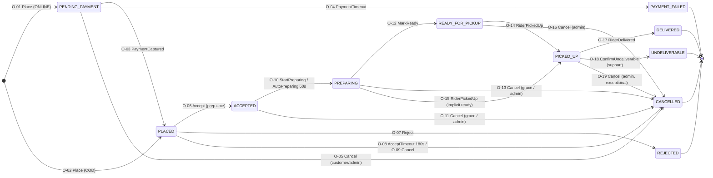
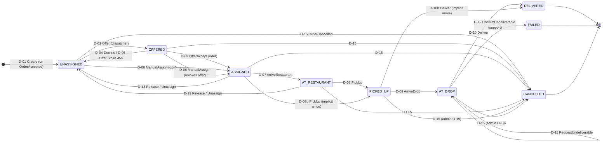
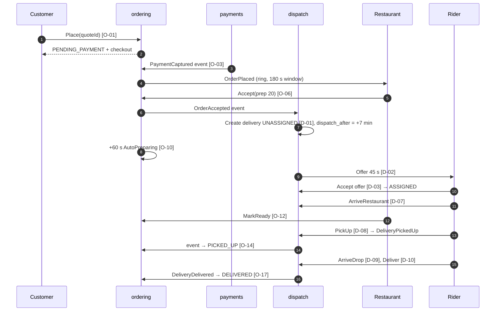
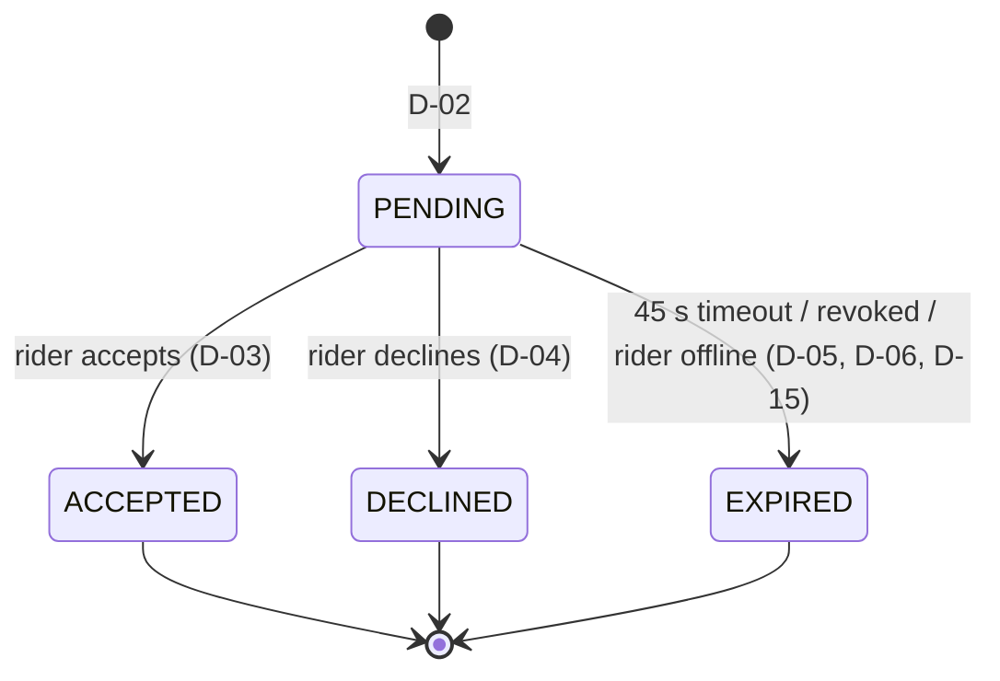
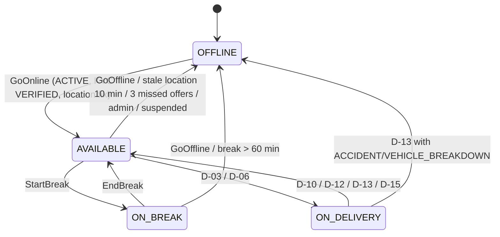

# 13 — Order & Delivery State Machines

| | |
|---|---|
| **Purpose** | The canonical, testable definition of how orders, deliveries, delivery offers and rider availability change state. It covers every transition (who may trigger it, guards, side effects), timers, cancellation and refund rules, how the order and delivery machines interact, concurrency and idempotency, the event catalogue, and Go implementation guidance. |
| **Owner** | Backend Architect |
| **Status** | Draft v1 (2026-10-04). Incorporates the Lead Architect rulings of 2026-10-04 (accept window, cancel grace, auto-preparing, implicit ready, undeliverable approval, COD caps, dispatch timing, round-off, goodwill coupons, SSE). |
| **Depends on** | 00 baseline §2 (status names, unchanged); 08 system architecture (events via outbox + River, CAS, `NOTIFY` real-time); 10 database schema (`orders`, `deliveries`, `delivery_offers`, `rider_availability`, `*_status_history`, `reason_codes`); 12 auth/RBAC (roles, maker-checker); 14 payment architecture (journal templates, refund mechanics); 15 notifications (templates, escalation channels); 04/05/06/07 UX workflows |
| **Consumed by** | 11 API (command endpoints, error codes), 15, 20 testing (transition tables as data), 27 backlog |

Status names are exactly those in 00 §2 and are not renamed here. Each transition has an ID (`O-nn` order, `D-nn` delivery) that tests and code comments reference (`// SM: O-07`).

---

## 0. Decision summary

| ID | Decision |
|---|---|
| SM-D01 | Order and delivery are **separate aggregates with separate machines**, in separate modules (`ordering`, `dispatch`). They are coupled **only through domain events**: delivery milestones drive `PICKED_UP`, `DELIVERED` and `UNDELIVERABLE` on the order (08 §3.1 rule 3). Allowed status *pairs* are specified (§3.3), and a reconciler alerts on drift. |
| SM-D02 | **Accept window 180 s.** On expiry: `PLACED → CANCELLED`, `cancelled_by=SYSTEM`, reason `RESTAURANT_UNRESPONSIVE`. This is **not** `REJECTED`, which is reserved for an explicit restaurant decision. Full refund if prepaid. Restaurant auto-paused 30 min; a 2nd consecutive miss pauses it until the owner resumes (ruling 1). |
| SM-D03 | The restaurant chooses the prep time at **Accept**. `ACCEPTED → PREPARING` happens on "Start preparing" or automatically **60 s after acceptance** (ruling 3). `ACCEPTED` stays a real state, which future scheduled orders also need. |
| SM-D04 | **Customer self-cancel:** free in `PENDING_PAYMENT` and `PLACED`, and in `ACCEPTED`/`PREPARING` **within 60 s of placement** (ruling 2). After that, only support/admin may cancel, and they must record a **fault party** that drives charges and refunds (§6). |
| SM-D05 | **The delivery is created at `ACCEPTED`** (`UNASSIGNED`). Offering starts at `dispatch_after = accepted_at + max(0, prep − rider_approach − buffer)` (ruling 7). |
| SM-D06 | **Rider "Picked up" is allowed from `PREPARING` or `READY_FOR_PICKUP`.** From `PREPARING`, the order passes through an implicit `READY_FOR_PICKUP` (two history rows), and `deliveries.restaurant_skipped_ready = true` is set (ruling 4). |
| SM-D07 | **`UNDELIVERABLE` needs support approval.** The rider *requests* it from `AT_DROP`, which creates an urgent ticket. `ADMIN_SUPPORT`/`ADMIN_OPS` confirms, which moves the delivery to `FAILED` and the order to `UNDELIVERABLE`. A COD undeliverable adds a COD strike; 2 strikes disable COD (ruling 5). |
| SM-D08 | **Nothing auto-completes to `DELIVERED`.** Stuck orders escalate to ops (§5). Money never moves on a guess. |
| SM-D09 | **Transitions are pure functions over data tables.** They are persisted with CAS on `(status, version)`, together with a history row, outbox event and River jobs **in the same transaction**. Commands are idempotent by `command_id`. |
| SM-D10 | Late payment capture after `PAYMENT_FAILED`/`CANCELLED` **never revives** the order. It triggers an automatic refund. |
| SM-D11 | Compensation without money movement (goodwill, COD-order compensation) is a **single-user goodwill coupon**, never a wallet (ruling 9). |

---

## 1. Order state machine



Terminal states (`DELIVERED`, `PAYMENT_FAILED`, `REJECTED`, `CANCELLED`, `UNDELIVERABLE`) are **absorbing**. Post-terminal actions (refunds, goodwill, rating, tickets) never change `orders.status`. They change `payment_status`, tickets and the ledger.

### 1.1 Order transition table

Actors:
- `CUST` = customer who owns the order;
- `REST` = `RESTAURANT_OWNER`/`RESTAURANT_STAFF` of the order's restaurant;
- `RIDER` = rider assigned to the order's delivery;
- `OPS`/`SUP`/`FIN`/`SUPER` = `ADMIN_*` in city scope;
- `SYS` = worker/system;
- `PA` = payment provider (via verified webhook or verified client callback plus server fetch).

"Events" are domain events (08 §3.3). Their dotted SSE/notification names are in §8. "Ledger" names posting rules whose lines are defined in 14 §10.

| ID | From → To | Command | Actors | Guards / preconditions | Side effects (same tx unless marked ⟶ async) |
|---|---|---|---|---|---|
| O-01 | ∅ → `PENDING_PAYMENT` | `Place` (method ONLINE) | CUST | Quote valid, unexpired, owned by caller, `is_orderable`. Re-validation passes (restaurant ACTIVE, accepting, open now, not paused; zone ACTIVE and not paused; serviceable; items available; `menu_version` unchanged or price-equal). Coupon reservable. Idempotency-Key fresh. | Insert order (v1), items, charges, history. Quote consumed. Coupon `RESERVED`. `payments` row `CREATED` with `expires_at = now + 15 min`. Event `OrderCreated`. Timer **T-PAY** scheduled. ⟶ PA order created outside the tx (08 §5.1). No restaurant notification yet. |
| O-02 | ∅ → `PLACED` | `Place` (method COD) | CUST | All of O-01, plus: `fee_configs.cod_enabled`; `total ≤ cod_max_order_paise` (₹1,000), or `≤ cod_first_order_max_paise` (₹600) if `delivered_order_count = 0`; `customer_profiles.cod_status = ENABLED` (ruling 6) | As O-01 but `payments(provider=COD, status=COD_PENDING)`, `payment_status=COD_DUE`, `placed_at=now`. Event `OrderPlaced`. Timers **T-ACC-\*** set. Notify restaurant (SSE ring + push + escalation ladder, 15). |
| O-03 | `PENDING_PAYMENT` → `PLACED` | `PaymentCaptured` | PA / SYS | Payment CAS `CREATED/AUTHORIZED → CAPTURED` succeeded; amount = `total_paise` and currency matches. | `payment_status=PAID`, `placed_at=now`. Ledger `payment_captured.v1` (Dr PG clearing / Cr customer advances). Event `OrderPlaced`. Clear T-PAY. Set T-ACC-\*. Notify restaurant + customer ("Order placed"). |
| O-04 | `PENDING_PAYMENT` → `PAYMENT_FAILED` | `PaymentTimeout` | SYS | T-PAY fired **and** a server-side fetch of the PA order shows no captured payment. If a capture is found, run O-03 instead. | `payment_status=UNPAID`, reason `PAYMENT_TIMEOUT`, actor SYSTEM. Coupon `RELEASED`. Payment `EXPIRED`. Event `OrderPaymentFailed`. Notify customer ("Payment not completed — your cart is saved"). |
| O-05 | `PENDING_PAYMENT` → `CANCELLED` | `Cancel` | CUST, OPS, SUP | Not yet captured (payment CAS to `EXPIRED` succeeds) | Reason `CUSTOMER_ABANDONED_PAYMENT` or admin reason. Coupon released. Event `OrderCancelled`. A later capture triggers **auto-refund** (SM-D10). |
| O-06 | `PLACED` → `ACCEPTED` | `Accept{prepTimeMin ∈ [5,90]}` | REST; OPS on behalf (reason required, audited; ruling 1) | `now < placed_at + 180 s` (the accept window; ops acting after it are rejected because the order is already cancelled) | `accepted_at`, `prep_time_min`, `eta_at` recomputed (16 §5). `restaurants.consecutive_missed_orders=0` (⟶ via event). Event `OrderAccepted` ⟶ dispatch creates the delivery (D-01) with `dispatch_after`. Clear T-ACC-\*. Set **T-PREP-AUTO** (+60 s) and **T-PREP-DUE**. Notify customer ("Accepted · ready in ~N min"). |
| O-07 | `PLACED` → `REJECTED` | `Reject{reasonCode}` | REST | reason ∈ `ORDER_REJECT` catalogue; within the window | Reason recorded, fault RESTAURANT. ⟶ Full refund if PAID (refund key `order:<id>:full`). Coupon released. If `ITEMS_OUT_OF_STOCK`: listed items marked unavailable (05 §4.3). If `TOO_BUSY` with the pause flag: restaurant paused. Event `OrderRejected`. Notify customer (friendly reason + similar restaurants). |
| O-08 | `PLACED` → `CANCELLED` | `AcceptTimeout` | SYS | T-ACC-TIMEOUT fired; still `PLACED` (CAS) | `cancelled_by=SYSTEM`, reason **`RESTAURANT_UNRESPONSIVE`**, fault RESTAURANT. ⟶ Full refund if PAID. Coupon released. `consecutive_missed_orders += 1`. **1 → pause 30 min; ≥ 2 → `paused_until='infinity'`** (owner must resume), with an owner SMS. Event `OrderCancelled`. Notify customer. |
| O-09 | `PLACED` → `CANCELLED` | `Cancel` | CUST (always free in PLACED); OPS, SUP | — | Reason (customer list or admin), fault per reason. ⟶ Full refund if PAID. Coupon released. Clear T-ACC-\*. Restaurant gets an "order cancelled" alert (SSE). Event `OrderCancelled`. |
| O-10 | `ACCEPTED` → `PREPARING` | `StartPreparing` / `AutoPreparing` | REST / SYS (T-PREP-AUTO at `accepted_at + 60 s`) | — | `preparing_at`. Event `OrderPreparing`. Notify customer (silent update). |
| O-11 | `ACCEPTED` → `CANCELLED` | `Cancel` | CUST **only if `now ≤ placed_at + 60 s`** (grace); OPS, SUP with fault party | Grace check for CUST; admin needs reason + fault | Per cancellation matrix §6. Restaurant: full-screen "CANCELLED — do not prepare" alert (05 §4.4). Event `OrderCancelled` ⟶ delivery cancelled (D-15), rider freed and compensated per §6.2. |
| O-12 | `PREPARING` → `READY_FOR_PICKUP` | `MarkReady` | REST; OPS on behalf | — (also allowed from `ACCEPTED`, which writes the implicit `PREPARING` row first) | `ready_at`. Event `OrderReadyForPickup` ⟶ rider notified ("Food is ready"); rider waiting-pay clock runs from `max(at_restaurant_at, ready_at)`. Clear T-PREP-DUE. Set **T-READY-WAIT**. |
| O-13 | `PREPARING` → `CANCELLED` | `Cancel` | CUST only within grace (60 s from placement); OPS, SUP | As O-11 | §6 (food charged / restaurant compensated depending on fault). |
| O-14 | `READY_FOR_PICKUP` → `PICKED_UP` | `RiderPickedUp` (from event `DeliveryPickedUp`) | RIDER (via dispatch) | Delivery is `PICKED_UP` for this order (event payload) | `picked_up_at`. Event `OrderPickedUp`. Notify customer ("On the way", rider first name). Clear T-READY-WAIT. Set **T-DELIVERY-LATE**. |
| O-15 | `PREPARING` → `READY_FOR_PICKUP` → `PICKED_UP` | `RiderPickedUp` with implicit ready | RIDER | As O-14; order is `PREPARING` | **Two** history rows: `READY_FOR_PICKUP` (actor RIDER, metadata `{"implicit":true,"restaurantSkippedReady":true}`), then `PICKED_UP`. The flag feeds restaurant quality metrics. |
| O-16 | `READY_FOR_PICKUP` → `CANCELLED` | `Cancel` | OPS, SUP | Reason + fault required | §6. The rider (if assigned) is told to hand the food back / not collect. |
| O-17 | `PICKED_UP` → `DELIVERED` | `RiderDelivered` (from `DeliveryDelivered`) | RIDER (via dispatch); OPS on behalf (D-10a) | Delivery `DELIVERED` | `delivered_at`. COD: `payment_status=COD_COLLECTED`. Ledger ⟶ `order_settled.v1` (restaurant payable, commission + GST, fees, food GST §9(5), TDS) + `rider_earning.v1` + COD `cod_collected.v1` (Dr rider cash in hand). Coupon `APPLIED`. `delivered_order_count += 1`. Invoice issued (14). Event `OrderDelivered`. Notify customer (receipt). Set **T-RATE-PROMPT**. |
| O-18 | `PICKED_UP` → `UNDELIVERABLE` | `ConfirmUndeliverable{reasonCode, faultParty}` | SUP, OPS (on the rider's request ticket) | Delivery has an open undeliverable request (`undeliverable_requested_at` set) | Delivery `AT_DROP → FAILED` (D-12) via event. Charges per §6 (customer fault: no refund for prepaid; COD: **strike +1**, 2 → COD disabled). Restaurant still settled. Rider paid in full. Event `OrderUndeliverable`. Ticket resolved. |
| O-19 | `PICKED_UP` → `CANCELLED` | `Cancel` | OPS, SUPER only (exceptional: accident, fraud, food destroyed) | Reason + fault required; step-up (12) | Delivery `CANCELLED`. Rider paid in full. Refund/compensation per §6. |

**Not transitions (explicitly illegal; tests assert `ErrIllegalTransition`):**
- the restaurant cancelling after `ACCEPTED` — it raises a ticket `RESTAURANT_CANNOT_FULFIL` and ops cancels (05 §4.5);
- a customer cancelling after the grace window, or from `READY_FOR_PICKUP` or later;
- any transition out of a terminal state;
- `PICKED_UP` from `ACCEPTED`;
- `DELIVERED` without `PICKED_UP`;
- a rider acting on an order not assigned to them.

### 1.2 Admin "on behalf" commands

`ADMIN_OPS` may execute `Accept`, `MarkReady` and rider milestones on behalf of a restaurant or rider (e.g. phone-in acceptance, rider phone dead). The command carries `onBehalfOf` and a mandatory reason. History records `actor_type=ADMIN` plus `metadata.onBehalfOf`. Each is audited (12 §5.7). This is **not** impersonation (12 AUTH-D11): the admin acts as themselves.

---

## 2. Delivery state machine



### 2.1 Delivery transition table

| ID | From → To | Command | Actors | Guards | Side effects |
|---|---|---|---|---|---|
| D-01 | ∅ → `UNASSIGNED` | `Create` | SYS (handler of `OrderAccepted`) | One delivery per order (`UNIQUE(order_id)`); idempotent on event id | `dispatch_after = accepted_at + max(0, prep_time − rider_approach_min − lead_buffer_min)`. Defaults: `rider_approach_min = 8` [ASSUMPTION — compact city, calibrate from data] and `lead_buffer_min = 5`, so prep ≤ 13 min dispatches immediately. `cod_amount_paise = total` if COD. `requires_delivery_code` from the flag. Event `DeliveryCreated`. River job **T-DISPATCH** at `dispatch_after`. |
| D-02 | `UNASSIGNED` → `OFFERED` | `Offer` | SYS (dispatcher) | `now ≥ dispatch_after`. Best candidate (16 §7): `rider_availability.state = AVAILABLE`, location age < 3 min, rider `ACTIVE`, same city, not previously offered this delivery in this round, within radius step r (2 → 4 → 7 km). **COD: `cash_in_hand + cod_amount ≤ cash_limit`** (ruling 6), checked against `ledger_account_balances`. Not the customer themself (12 AUTH-D02 guard). Rider row locked `FOR UPDATE SKIP LOCKED`. | Insert offer `PENDING` (`expires_at = now + 45 s`, `est_earnings_paise`). `dispatch_round += 1`. Event `DeliveryOffered`. ⟶ SSE `offer.new` + high-urgency Web Push. Timer **T-OFFER** (+45 s). |
| D-03 | `OFFERED` → `ASSIGNED` | `OfferAccept` | RIDER (offer's rider) | Offer `PENDING` and `now < expires_at + 2 s` grace; rider still `AVAILABLE`; COD headroom re-checked; delivery not cancelled | Offer `ACCEPTED`. `rider_id`, `assigned_at`. Rider `state=ON_DELIVERY`, `active_delivery_count=1`, `consecutive_missed_offers=0`. Event `DeliveryAssigned`. Notify restaurant ("Rider X assigned") + customer. Clear T-OFFER. |
| D-04 | `OFFERED` → `UNASSIGNED` | `OfferDecline{reasonCode}` | RIDER | Offer `PENDING` | Offer `DECLINED`. Rider `consecutive_missed_offers += 1` (decline counts as half a miss [ASSUMPTION]; 3 misses → auto-offline). Immediately enqueue **D-02** for the next candidate (no wait). |
| D-05 | `OFFERED` → `UNASSIGNED` | `OfferExpire` | SYS (T-OFFER) | Offer still `PENDING` (CAS) | Offer `EXPIRED`, `close_reason=TIMEOUT`. Miss counter +1. **3 consecutive misses → rider auto-`OFFLINE` (`MISSED_OFFERS`)** + notification (08 §5.4). Re-dispatch immediately. |
| D-06 | `UNASSIGNED`/`OFFERED` → `ASSIGNED` | `ManualAssign{riderId, reason}` | OPS | Target rider `ACTIVE`, online (or ops override flag with reason), no active delivery, COD headroom (override → maker-checker `RIDER_CASH_LIMIT_OVERRIDE`) | A pending offer becomes `EXPIRED` (`REVOKED_MANUAL_ASSIGN`). Then as D-03. Audited. |
| D-07 | `ASSIGNED` → `AT_RESTAURANT` | `ArriveRestaurant{location}` | RIDER; OPS on behalf | Soft geofence: ≤ 200 m from pickup → `geofence_ok`. Outside it is **accepted but flagged** [ASSUMPTION — GPS accuracy in PWAs] | `at_restaurant_at`. Waiting clock starts. Event `DeliveryAtRestaurant` ⟶ restaurant "Rider arrived". |
| D-08 | `AT_RESTAURANT` → `PICKED_UP` | `PickUp{location}` | RIDER; OPS on behalf | **Order status ∈ {`PREPARING`, `READY_FOR_PICKUP`}** (read through `ordering.Reader` in the tx; ruling 4). Optional pickup PIN if `pickup_pin_required` (05 §6). | `picked_up_at`. `waiting_seconds = picked_up_at − max(at_restaurant_at, ready_at or at_restaurant_at)`. If the order was `PREPARING` → `restaurant_skipped_ready = true`. Event `DeliveryPickedUp` ⟶ order O-14/O-15. |
| D-08b | `ASSIGNED` → `PICKED_UP` | `PickUp` (rider skipped "arrived") | RIDER | As D-08 | Implicit `AT_RESTAURANT` history row (`metadata.implicit=true`, `at_restaurant_at = picked_up_at`). |
| D-09 | `PICKED_UP` → `AT_DROP` | `ArriveDrop{location}` | RIDER | Soft geofence ≤ 300 m of the drop pin, flagged otherwise | `at_drop_at`. Event `DeliveryAtDrop` ⟶ customer push "Your order has arrived" + call/handover hint. Set **T-DROP-WAIT**. |
| D-10 | `AT_DROP` → `DELIVERED` | `Deliver{location, codCollected?, deliveryCode?}` | RIDER | If COD: `codCollected = cod_amount_paise` exactly (mismatch → `COD_AMOUNT_MISMATCH`, rider must call support). If `requires_delivery_code`: code verifies (5 attempts). No open undeliverable request. | `delivered_at`. `cod_collected_paise`. Rider pay computed (16 §6.4; fee config snapshot). Rider `state=AVAILABLE` (if still online), `active_delivery_count=0`. Event `DeliveryDelivered` ⟶ order O-17, ledger, rider cash cache refresh; if `cash_in_hand ≥ limit` → `cod_blocked=true` + event `RiderCashLimitReached`. |
| D-10a | `AT_DROP`/`PICKED_UP` → `DELIVERED` | `Deliver` on behalf | OPS (rider app failure; customer confirmed by phone) | Reason required; COD amount confirmed by rider via phone | Same as D-10; audited. |
| D-10b | `PICKED_UP` → `DELIVERED` | `Deliver` (rider skipped "arrived") | RIDER | As D-10 | Implicit `AT_DROP` row. |
| D-11 | `AT_DROP` → `AT_DROP` | `RequestUndeliverable{reasonCode, note}` | RIDER | Reason ∈ `DELIVERY_FAIL`. For `CUSTOMER_UNREACHABLE`: `now − at_drop_at ≥ 10 min` and `call_attempts ≥ 2` (configurable). `CUSTOMER_REFUSED`/`UNSAFE_LOCATION`: no wait. No request already open. | Sets `undeliverable_requested_at`, reason. Creates an **URGENT** support ticket `UNDELIVERABLE_REQUEST` (ruling 5). Event `DeliveryUndeliverableRequested` ⟶ ops SSE alert + push. Timer **T-UNDELIV-SLA** (5 min). The rider stays at the drop or nearby; status unchanged. |
| D-11r | (request) → cleared | `RejectUndeliverableRequest{note}` | SUP, OPS | Request open | Clears the request fields; ticket note. Rider told to retry (e.g. support reached the customer). |
| D-12 | `AT_DROP` → `FAILED` | `ConfirmUndeliverable` | SUP, OPS | Request open | `failed_at`. Rider paid in full (+ waiting pay at drop [OPEN]). Rider `AVAILABLE`. Food disposal instruction (no return-to-restaurant flow in V1). Event `DeliveryFailed` ⟶ order O-18. |
| D-13 | `ASSIGNED`/`AT_RESTAURANT` → `UNASSIGNED` | `Release{reasonCode}` (rider) / `Unassign{reason}` (ops) | RIDER, OPS | Not yet picked up | `rider_id = NULL`. Rider freed (`AVAILABLE`, or `OFFLINE` if the reason is `VEHICLE_BREAKDOWN`/`ACCIDENT`). Release metric. **Immediate re-dispatch** with priority (`dispatch_after = now`). Event `DeliveryUnassigned`. Restaurant + customer informed if they had been told a rider name. |
| D-15 | any non-terminal → `CANCELLED` | `CancelForOrder` | SYS (handler of `OrderCancelled`/`OrderRejected`) | Order terminal-cancelled | Pending offer → `EXPIRED` (`REVOKED_ORDER_CANCELLED`) + SSE `offer.revoked`. Rider freed. Rider cancellation compensation (§6.2) journal. Event `DeliveryCancelled`. |

---

## 3. How the two machines interact

### 3.1 Sequence (online-paid happy path)



### 3.2 Coupling rules

1. **Only `ordering` writes `orders`; only `dispatch` writes `deliveries`.** Cross-effects travel as domain events: `OrderAccepted`, `OrderCancelled`, `OrderRejected` → dispatch; `DeliveryPickedUp`, `DeliveryDelivered`, `DeliveryFailed` → ordering.
2. **Guards that need the other aggregate read it through the owner's read port** (`ordering.Reader.Snapshot`) inside the command transaction, e.g. D-08 checks the order is `PREPARING`/`READY_FOR_PICKUP`. This is a read without a lock; the race is handled by rule 3.
3. **Race policy:** if an event arrives for an order that has meanwhile become terminal (e.g. `DeliveryPickedUp` for an order an admin just cancelled), the ordering handler does **not** transition. It emits `OrderDeliveryConflict` → an ops alert, and dispatch has already received `OrderCancelled` → D-15. The outcome is deterministic: **the order's terminal state wins**, and money follows the order (§6).
4. Event delivery is at-least-once with handler dedupe (`processed_events`). The latency between a delivery milestone and the order mirror is typically < 1 s (River fan-out).

### 3.3 Allowed status pairs (invariant; checked by tests and by a 1-min reconciler)

`·` = allowed steady state; `t` = allowed only transiently (≤ 60 s, e.g. waiting for event fan-out); blank = illegal. A pair that stays transient for more than 60 s raises `ops.state_drift`.

| order \ delivery | none | UNASSIGNED | OFFERED | ASSIGNED | AT_RESTAURANT | PICKED_UP | AT_DROP | DELIVERED | FAILED | CANCELLED |
|---|---|---|---|---|---|---|---|---|---|---|
| PENDING_PAYMENT | · | | | | | | | | | |
| PLACED | · | | | | | | | | | |
| ACCEPTED | t | · | · | · | · | | | | | |
| PREPARING | | · | · | · | · | t | | | | |
| READY_FOR_PICKUP | | · | · | · | · | t | | | | |
| PICKED_UP | | | | | | · | · | t | t | |
| DELIVERED | | | | | | | | · | | |
| UNDELIVERABLE | | | | | | | | | · | |
| CANCELLED | · | t | t | t | t | t | t | | | · |
| REJECTED / PAYMENT_FAILED | · | | | | | | | | | t |

---

## 4. Offer and rider-availability machines

### 4.1 Delivery offer (`delivery_offers.status`)



The baseline keeps four offer statuses. Revocations are `EXPIRED` with `close_reason ∈ {REVOKED_MANUAL_ASSIGN, REVOKED_ORDER_CANCELLED, RIDER_WENT_OFFLINE}`. Invariants (DB-enforced, 10 §8.2): at most **one `PENDING` offer per delivery** and **one per rider**. V1 offers are sequential, not broadcast.

### 4.2 Dispatch cascade parameters (per city, `app_config`)

| Param | Default |
|---|---|
| Offer TTL | 45 s (P11) |
| Radius steps | 2 km → 4 km → 7 km (advance when no eligible candidate at the current step) |
| Candidate order | nearest by `<->` KNN, then tie-break: longest idle since last delivery (fairness), then higher acceptance rate |
| Exhaustion | 8 offers or 10 min since `dispatch_after` → `DispatchExhausted` event → ops alert. The cascade **continues** every 60 s at max radius until assigned or cancelled. |
| Missed offers → offline | 3 consecutive |

### 4.3 Rider availability (`rider_availability.state`, ruling 11)



- `GoOffline` while `ON_DELIVERY` is refused (`RIDER_HAS_ACTIVE_DELIVERY`). The rider must finish or release.
- A pending offer to a rider who goes offline → `EXPIRED (RIDER_WENT_OFFLINE)`.
- `cod_blocked` is an orthogonal flag, not a state. A COD-blocked rider is still `AVAILABLE` for prepaid orders.

---

## 5. Timers

All timers are **River jobs with `ScheduledAt`**, inserted with `InsertTx` in the transaction that creates the condition. Each is unique by `(kind, aggregate_id, aggregate_version_at_schedule)`. **Every handler re-checks state** (CAS / guard) and no-ops if things moved on, so timers never need reliable cancellation. They may still be cancelled (`JobCancel`) for hygiene. Durations are `app_config` keys (city scope).

| ID | Starts at | Fires at (default) | Action | Ends when |
|---|---|---|---|---|
| T-PAY | O-01 | +15 min | Poll the PA order. Captured → O-03; else O-04 | O-03/O-05 |
| T-ACC-RING | O-02/O-03 | every 30 s | Re-push / re-ring the restaurant devices (SSE + Web Push) | Accept/Reject/Cancel |
| T-ACC-OWNER | O-02/O-03 | +60 s | SMS + push to the owner phone ("New order waiting") | same |
| T-ACC-OPS | O-02/O-03 | +90 s | Ops board flags the order red + sound. Ops may call and accept on behalf (§1.2). Customer gets "Taking a little longer…". | same |
| T-ACC-TIMEOUT | O-02/O-03 | **+180 s** | O-08 (`CANCELLED`, `RESTAURANT_UNRESPONSIVE`) + auto-pause | same |
| T-PREP-AUTO | O-06 | +60 s | O-10 (`AutoPreparing`) | O-10 by tap |
| T-PREP-DUE | O-06 | `accepted_at + prep` | Nudge restaurant every 2 min ("Is RV-…3P9Q ready?"); at +15 min overrun → ops alert; `eta_at` pushed back | O-12/O-15 |
| T-DISPATCH | D-01 | `dispatch_after` | D-02 | assigned/cancelled |
| T-OFFER | D-02 | +45 s | D-05 | D-03/D-04 |
| T-DISPATCH-ESC | D-01 | +10 min after `dispatch_after` (or 8 offers) | `DispatchExhausted` → ops alert; customer told of a delay if `eta_at` slips > 10 min | assigned/cancelled |
| T-READY-WAIT | O-12 | +10 min if the rider is not `AT_RESTAURANT` | Ops alert "food waiting"; +20 min critical | D-08 |
| T-DELIVERY-LATE | O-14 | `picked_up_at + 2 × est_travel + 10 min` | Ops alert. Customer gets an apology notification with a revised ETA. | O-17/O-18 |
| T-DROP-WAIT | D-09 | +10 min | Enables `RequestUndeliverable` (`CUSTOMER_UNREACHABLE`); reminds the rider to call | D-10/D-12 |
| T-UNDELIV-SLA | D-11 | +5 min | Escalate the ticket to the ops lead | D-11r/D-12 |
| T-STUCK | any non-terminal order | `placed_at + 3 h` | **Critical ops alert**. Never auto-completes (SM-D08). Nightly report of non-terminal orders > 3 h. | terminal |
| T-RATE-PROMPT | O-17 | +30 min | Rating push if not rated; rating window 7 days | rated / 7 d |
| T-REFUND-RETRY | refund FAILED | backoff 1 m / 10 m / 1 h | Retry the PA refund; after 3 failures → finance queue (`ReconExceptionRaised`) | succeeded |
| T-RIDER-STALE | each location ping | +3 min no ping → excluded from dispatch; +10 min → `OFFLINE (STALE_LOCATION)` if `AVAILABLE`, ops alert if `ON_DELIVERY` | — | next ping |
| T-DEVICE-HB | restaurant heartbeat | open outlet with no order-receiver heartbeat for **3 min** | auto-pause `DEVICE_OFFLINE` (ruling 1) | heartbeat + resume |

---

## 6. Cancellation, refunds and compensation

### 6.1 Who can cancel when

| Order state | Customer (self-serve) | Restaurant | Admin (OPS/SUP) | System |
|---|---|---|---|---|
| `PENDING_PAYMENT` | ✅ free | — | ✅ | → `PAYMENT_FAILED` on T-PAY |
| `PLACED` | ✅ free | ✅ **Reject** (→ `REJECTED`) | ✅ | → `CANCELLED` on T-ACC-TIMEOUT |
| `ACCEPTED` | ✅ free **only ≤ 60 s from placement** | ❌ (ticket → admin) | ✅ + fault party | — |
| `PREPARING` | ✅ free **only ≤ 60 s from placement** | ❌ (ticket) | ✅ + fault party | — |
| `READY_FOR_PICKUP` | ❌ → "Contact support" | ❌ | ✅ + fault party | — |
| `PICKED_UP` | ❌ | ❌ | ✅ OPS/SUPER only, exceptional, step-up | — (UNDELIVERABLE via D-11/D-12) |
| terminal | ❌ | ❌ | ❌ (post-terminal goodwill/refund only) | — |

### 6.2 Money rules by fault party (admin cancellations after grace, and `UNDELIVERABLE`)

Definitions:
- **Food value** = `item_total + packaging − restaurant-funded discount`.
- **Restaurant compensation** = food value, **commission waived** [ASSUMPTION — Finance to confirm].
- **Rider cancellation pay:**
  - 0 if cancelled before `AT_RESTAURANT`;
  - `base × rider_cancel_comp_bps` (50%) + waiting pay if cancelled at or after `AT_RESTAURANT` and before pickup;
  - full trip pay if after `PICKED_UP`.

| Fault | Prepaid: refund to customer | COD | Restaurant gets | Rider gets | Platform bears |
|---|---|---|---|---|---|
| **Within grace / restaurant reject / accept timeout** | 100% | nothing collected | 0 | cancellation pay (if assigned) | rider pay |
| **CUSTOMER** before `PREPARING` (after grace, via support) | 100% (food not yet started) [ASSUMPTION] | — | 0 | cancellation pay | rider pay |
| **CUSTOMER** at `PREPARING`/`READY_FOR_PICKUP` | refund `total − food value − food GST − platform fee`; delivery fee refunded if not picked up | nothing collectable → **COD strike +1** | compensation (paid by the customer's charge for prepaid; by the platform for COD) | cancellation pay | COD: food value + rider pay |
| **CUSTOMER** at door (`UNDELIVERABLE`, O-18) | 0% refund | not collected → **COD strike +1** (2 → COD disabled) | full settlement as if delivered | full trip pay | COD: everything |
| **RESTAURANT** (can't fulfil, wrong/missing items found before pickup) | 100% | — | 0 (+ quality flag; penalty policy [OPEN]) | cancellation pay | rider pay (recoverable from restaurant [OPEN]) |
| **RIDER** (accident, lost/damaged food, misconduct) | 100% | — | compensation if food was prepared | per HR policy (0 for misconduct) [OPEN] | all |
| **PLATFORM / NONE** (no rider found, app outage, zone paused, law & order) | 100% | — (goodwill coupon optional) | compensation if `PREPARING`+ | cancellation pay | all |

Post-delivery issues (missing item, quality) are **not** cancellations. They are support tickets resolved with a partial refund (prepaid) or a **goodwill coupon** (COD, or when preferred; ruling 9). Above-threshold amounts go through maker-checker (refund > ₹500, goodwill > ₹150; 10 §11).

Ledger rules (lines in 14 §10): `refund.v1`, `cancellation_compensation.v1` (Dr platform expense / Cr restaurant payable), `rider_earning.v1` (cancellation variant), `goodwill_issued.v1`. COD strike handling lives in `customer_profiles.cod_strike_count`.

### 6.3 Reason-code catalogue (seed for `reason_codes`, 10 §11)

| Category | Codes (actor) |
|---|---|
| `ORDER_CANCEL` | `CUSTOMER_CHANGED_MIND`, `CUSTOMER_ORDERED_BY_MISTAKE`, `CUSTOMER_WRONG_ADDRESS`, `CUSTOMER_TAKING_TOO_LONG`, `CUSTOMER_OTHER` (CUSTOMER); `CUSTOMER_ABANDONED_PAYMENT` (CUSTOMER, PENDING_PAYMENT); `RESTAURANT_UNRESPONSIVE` (SYSTEM); `PAYMENT_TIMEOUT` (SYSTEM → PAYMENT_FAILED); `RESTAURANT_CANNOT_FULFIL`, `NO_RIDER_AVAILABLE`, `ZONE_PAUSED`, `CUSTOMER_REQUEST_AFTER_GRACE`, `CUSTOMER_UNREACHABLE_BEFORE_PICKUP`, `RIDER_ACCIDENT`, `FOOD_DAMAGED`, `FRAUD_SUSPECTED`, `DUPLICATE_ORDER`, `ADMIN_OTHER` (ADMIN) |
| `ORDER_REJECT` | `ITEMS_OUT_OF_STOCK`, `TOO_BUSY`, `CLOSING_SOON`, `KITCHEN_ISSUE`, `RESTAURANT_OTHER` (RESTAURANT) |
| `DELIVERY_FAIL` | `CUSTOMER_UNREACHABLE`, `CUSTOMER_REFUSED`, `COD_PAYMENT_REFUSED`, `WRONG_OR_INCOMPLETE_ADDRESS`, `UNSAFE_LOCATION`, `RIDER_OTHER` (RIDER request; ADMIN confirm) |
| `OFFER_DECLINE` | `TOO_FAR`, `LOW_EARNINGS`, `VEHICLE_ISSUE`, `TAKING_BREAK`, `CASH_LIMIT`, `OTHER` |
| `RIDER_RELEASE` | `VEHICLE_BREAKDOWN`, `ACCIDENT`, `PERSONAL_EMERGENCY`, `RESTAURANT_DELAY_TOO_LONG`, `OTHER` (RIDER); `OPS_REASSIGN` (ADMIN) |
| `RESTAURANT_PAUSE` | `TOO_MANY_ORDERS`, `STAFF_SHORTAGE`, `KITCHEN_ISSUE`, `AUTO_MISSED_ORDERS`, `DEVICE_OFFLINE`, `ADMIN`, `OTHER` |
| `ZONE_PAUSE` | `RAIN`, `RIDER_SHORTAGE`, `LAW_AND_ORDER`, `FESTIVAL`, `TECHNICAL`, `OTHER` |
| `REFUND` | `ORDER_REJECTED`, `ORDER_CANCELLED`, `LATE_CAPTURE`, `DUPLICATE_PAYMENT`, `MISSING_ITEMS`, `WRONG_ITEMS`, `QUALITY_ISSUE`, `LATE_DELIVERY`, `SUPPORT_GOODWILL` |
| `TICKET_RESOLUTION` | `REFUND_FULL`, `REFUND_PARTIAL`, `GOODWILL_COUPON`, `NO_ACTION`, `INFO_PROVIDED`, `RESTAURANT_PENALTY`, `RIDER_ACTION`, `ESCALATED_LEGAL` |

---

## 7. Concurrency and idempotency

### 7.1 Persisting a transition (one transaction)

```sql
-- 1. CAS (no explicit lock needed for single-aggregate commands)
UPDATE orders
   SET status = $to, version = version + 1, accepted_at = $now, prep_time_min = $prep, eta_at = $eta, updated_at = $now
 WHERE id = $id AND status = $from AND version = $expected_version
RETURNING version;
-- 0 rows ⇒ reload: if the command_id already exists in history ⇒ idempotent success; else 409 ORDER_STATE_CONFLICT
-- 2. history
INSERT INTO order_status_history (id, order_id, seq, from_status, to_status, command, actor_type, actor_user_id, actor_role,
                                  reason_code, command_id, metadata, occurred_at) VALUES (...);
-- 3. outbox event + fan-out job (08 §7.3)
INSERT INTO outbox_events (...) VALUES (...);          -- + River InsertTx(event.fanout{event_id})
-- 4. timers
-- River InsertTx(ordering.prep_auto{order_id, version}, ScheduledAt: now+60s) ...
-- 5. real-time hint
SELECT pg_notify('rovo_rt', '{"topic":"order:<id>","type":"order.status","id":"<id>","v":3}');
COMMIT;
```

- **Single-aggregate commands** (most order transitions) use **CAS on `(status, version)`** (08 §7.2). `If-Match` from partner apps maps to `$expected_version`. If it is absent, the server uses the version it just read (optimistic, single retry on conflict when the command is still valid from the new state; e.g. `MarkReady` after `AutoPreparing` bumped the version).
- **Contended commands** (offer accept vs. offer expiry vs. manual assign; dispatch candidate selection) use `SELECT … FOR UPDATE` on the **delivery** row first, then `rider_availability` (`FOR UPDATE SKIP LOCKED` during candidate search), then the offer. **Lock order is always delivery → rider_availability → delivery_offers**, so these paths cannot deadlock.
- **No external I/O inside the transaction.** PA calls and pushes happen in River jobs after commit.
- Isolation `READ COMMITTED`; transactions have `statement_timeout` 5 s and `idle_in_transaction_session_timeout` 10 s (08 §7.2).

### 7.2 Idempotency layers

| Layer | Mechanism |
|---|---|
| HTTP | `Idempotency-Key` (required on all state-changing commands; 11 §1.7), stored in `idempotency_keys`; same key + same body → replay the stored response |
| Command | `command_id` (= the Idempotency-Key UUID, or a client-generated `clientEventId` for offline-queued rider milestones) unique per aggregate in `*_status_history`. A re-delivered command already applied → **200 with current state** (no-op). |
| State | Commands whose target state already holds and were issued by the same actor are no-ops. Example: `OfferAccept` twice by the same rider → 200. By a different rider → `409 OFFER_NOT_PENDING`. |
| Events | `processed_events(handler, event_id)`; handlers are CAS-based anyway |
| Timers | unique River jobs + guard re-check |
| Money | `refunds.refund_key`, `ledger_journals.idempotency_key`, `payment_events` dedupe on verified event id |

---

## 8. Event catalogue

Envelope (08 §3.3), stored in `outbox_events`:

```json
{
  "id": "0192f3a1-7c2e-7b4d-9a10-5e7c1d2f3a4b",
  "type": "ordering.order_accepted.v1",
  "name": "OrderAccepted",
  "version": 1,
  "occurredAt": "2026-10-04T13:05:12.345Z",
  "cityId": "0192e…",
  "aggregateType": "order",
  "aggregateId": "0192f…",
  "aggregateVersion": 3,
  "actor": {"type": "RESTAURANT", "id": "0192d…", "role": "RESTAURANT_STAFF"},
  "traceId": "4bf92f3577b34da6a3ce929d0e0e4736",
  "payload": { }
}
```

| Event (name / type key) | SSE `event:` name (topic) | Payload (`payload`) |
|---|---|---|
| `OrderCreated` / `ordering.order_created.v1` | — | `{orderId, code, customerId, restaurantId, paymentMethod, totalPaise}` |
| `OrderPlaced` / `ordering.order_placed.v1` | `order.placed` (`restaurant:{id}:inbox`), `order.status` (`order:{id}`) | `{orderId, code, restaurantId, customerId, paymentMethod, totalPaise, itemCount, placedAt, acceptBy}` |
| `OrderAccepted` / `ordering.order_accepted.v1` | `order.status` | `{orderId, restaurantId, prepTimeMin, acceptedAt, etaAt}` |
| `OrderRejected` / `ordering.order_rejected.v1` | `order.status` | `{orderId, reasonCode, paymentStatus, refundExpected: bool}` |
| `OrderPreparing` / `ordering.order_preparing.v1` | `order.status` | `{orderId, preparingAt, auto: bool}` |
| `OrderReadyForPickup` / `ordering.order_ready_for_pickup.v1` | `order.status`, `delivery.updated` (`rider:{id}`) | `{orderId, readyAt, implicit: bool}` |
| `OrderPickedUp` / `ordering.order_picked_up.v1` | `order.status` | `{orderId, pickedUpAt, riderFirstName, etaAt, restaurantSkippedReady}` |
| `OrderDelivered` / `ordering.order_delivered.v1` | `order.status` | `{orderId, restaurantId, riderId, customerId, paymentMethod, totalPaise, deliveredAt}` |
| `OrderUndeliverable` / `ordering.order_undeliverable.v1` | `order.status` | `{orderId, reasonCode, faultParty, paymentMethod}` |
| `OrderCancelled` / `ordering.order_cancelled.v1` | `order.status`, `order.cancelled` (inbox) | `{orderId, fromStatus, cancelledByRole, reasonCode, faultParty, refundPolicy: "FULL"|"PARTIAL"|"NONE"}` |
| `OrderPaymentFailed` / `ordering.order_payment_failed.v1` | `order.status` | `{orderId, reasonCode}` |
| `OrderEtaUpdated` / `ordering.order_eta_updated.v1` | `order.eta` | `{orderId, etaAt, reason}` |
| `OrderDeliveryConflict` / `ordering.order_delivery_conflict.v1` | `ops.alert` (`ops:city:{id}`) | `{orderId, orderStatus, deliveryEvent}` |
| `PaymentCaptured` / `payments.payment_captured.v1` | `payment.status` | `{paymentId, orderId, amountPaise, method, providerPaymentId}` |
| `PaymentFailed` / `payments.payment_failed.v1` | `payment.status` | `{paymentId, orderId, errorCode}` (attempt-level; does **not** fail the order) |
| `RefundInitiated` / `RefundProcessed` / `RefundFailed` (`payments.refund_*.v1`) | `payment.status` | `{refundId, orderId, amountPaise, status}` |
| `DeliveryCreated` / `dispatch.delivery_created.v1` | — | `{deliveryId, orderId, dispatchAfter, codAmountPaise}` |
| `DeliveryOffered` / `dispatch.delivery_offered.v1` | `offer.new` (`rider:{id}`) | `{offerId, deliveryId, riderId, expiresAt, pickup:{name, locality, distanceM}, drop:{locality, distanceM}, estEarningsPaise, codAmountPaise}` (no customer PII before accept) |
| `DeliveryOfferDeclined` / `…offer_declined.v1`, `DeliveryOfferExpired` / `…offer_expired.v1` | `offer.revoked` | `{offerId, deliveryId, riderId, closeReason}` |
| `DeliveryAssigned` / `dispatch.delivery_assigned.v1` | `order.rider_assigned` (inbox), `delivery.milestone` (`order:{id}`) | `{deliveryId, orderId, riderId, riderFirstName, vehicleType}` |
| `DeliveryUnassigned` / `…delivery_unassigned.v1` | `delivery.milestone` | `{deliveryId, orderId, previousRiderId, reasonCode}` |
| `DeliveryAtRestaurant` / `…at_restaurant.v1` | `order.rider_arrived` (inbox) | `{deliveryId, orderId, at, geofenceOk}` |
| `DeliveryPickedUp` / `…picked_up.v1` | `delivery.milestone` | `{deliveryId, orderId, riderId, at, restaurantSkippedReady}` |
| `DeliveryAtDrop` / `…at_drop.v1` | `delivery.milestone` | `{deliveryId, orderId, at}` |
| `DeliveryDelivered` / `…delivered.v1` | `delivery.milestone` | `{deliveryId, orderId, riderId, at, codCollectedPaise, riderPayPaise, waitingSeconds}` |
| `DeliveryUndeliverableRequested` / `…undeliverable_requested.v1` | `ops.alert` | `{deliveryId, orderId, reasonCode, ticketId, callAttempts, waitedSeconds}` |
| `DeliveryFailed` / `…failed.v1` | `delivery.milestone` | `{deliveryId, orderId, reasonCode}` |
| `DeliveryCancelled` / `…cancelled.v1` | `delivery.updated` (rider) | `{deliveryId, orderId, riderId?, riderCompPaise}` |
| `DispatchExhausted` / `dispatch.dispatch_exhausted.v1` | `ops.alert` | `{deliveryId, orderId, offersMade, minutesWaiting, maxRadiusM}` |
| `RiderWentOnline` / `RiderWentOffline` | `ops.rider` (ops) | `{riderId, state, reason}` |
| `RiderCashLimitReached` / `RiderCashCleared` (`ledger.*.v1`) | `account.cash_limit` (rider) | `{riderId, cashInHandPaise, limitPaise}` |
| `RestaurantPaused` / `RestaurantResumed` (`catalog.*.v1`) | `restaurant.status` (inbox), `ops.alert` | `{restaurantId, reasonCode, pausedUntil}` |
| `ZonePaused` / `ZoneResumed` (`geo.*.v1`) | `ops.alert` | `{zoneId, reasonCode, pausedUntil}` |

SSE frames are **thin** (`{topic, type, id, v}` plus the minimal fields above). Clients refetch the resource over REST. There is no server-side replay buffer; on reconnect clients refetch snapshots (ruling 10; 08 §6.2; 11 §4).

---

## 9. Implementation guidance (Go)

### 9.1 Package shape

```
internal/ordering/
  statemachine/          # PURE: no DB, no clock, no IO
    states.go            # type Status string; constants; IsTerminal()
    commands.go          # Place, PaymentCaptured, Accept{PrepMin}, Reject{Reason}, Cancel{Reason,Fault}, ...
    table.go             # var Transitions = []Transition{...}  ← single source of truth (also renders §1 Mermaid)
    decide.go            # func Decide(o Snapshot, cmd Command, a Actor, now time.Time, cfg Config) (Decision, error)
    decide_test.go       # exhaustive matrix + golden side effects
  app/                   # command handlers: load → Decide → persist in one tx
  adapters/              # sqlc repo, River job workers, event handlers
internal/dispatch/statemachine/ ...   # same pattern for Delivery, Offer, RiderAvailability
```

```go
type Transition struct {
    ID      string            // "O-06"
    From    []Status          // empty = creation
    Cmd     CommandKind       // CmdAccept
    To      Status
    Actors  []ActorKind       // {ActorRestaurant, ActorAdminOps}
    Guard   func(Snapshot, Command, Actor, time.Time, Config) error   // returns typed domain errors
    Effects func(Snapshot, Command, time.Time, Config) []Effect
}

type Decision struct {
    From, To Status
    Implicit []Status         // e.g. READY_FOR_PICKUP before PICKED_UP (O-15)
    Patch    OrderPatch        // fields to set (timestamps, prep time, reason, fault)
    Effects  []Effect          // EmitEvent, ScheduleTimer, RequestRefund, ReleaseCoupon, PostJournal, Notify ...
}

// Effects are data; the app layer interprets them inside the tx (events, timers, journals)
// or as post-commit River jobs (PA refunds, pushes).
```

### 9.2 Command handler skeleton

```go
func (s *Service) Accept(ctx context.Context, in AcceptInput) (OrderView, error) {
    return s.db.InTx(ctx, func(tx pgx.Tx) (OrderView, error) {
        o, err := s.repo.Get(ctx, tx, in.OrderID)                      // no lock; CAS below
        if err != nil { return OrderView{}, err }
        if s.repo.HistoryHasCommand(ctx, tx, o.ID, in.CommandID) {      // idempotent replay
            return view(o), nil
        }
        d, err := statemachine.Decide(o.Snapshot(), statemachine.Accept{PrepMin: in.PrepMin},
                                      in.Actor, s.clock.Now(), s.cfg.For(o.CityID))
        if err != nil { return OrderView{}, err }                      // ErrIllegalTransition, ErrAcceptWindowClosed …
        if err := s.repo.ApplyCAS(ctx, tx, o.ID, o.Version, d); err != nil {   // update + history rows
            return OrderView{}, err                                    // ErrConflict → 409
        }
        if err := s.effects.Apply(ctx, tx, o, d.Effects); err != nil { // outbox + River InsertTx + pg_notify
            return OrderView{}, err
        }
        return s.repo.View(ctx, tx, o.ID)
    })
}
```

### 9.3 Tests (aligns with 20 §4.2)

1. **Exhaustive matrix:** every `(state × command × actor)` → expected `To` or `ErrIllegalTransition`, generated from `Transitions` and an explicit **deny list** (§1.1 "Not transitions"). 11 order states × ~16 commands × 9 actors ≈ 1,600 cases.
2. **Golden side effects:** each transition ID has a golden file listing the effects (event names, timers, journals, refunds). A diff fails the build.
3. **Guards with a fake clock:** accept window at 179.9 s / 180 s / 180.1 s; grace at 60 s; COD caps ₹1,000 / ₹600 first order; COD headroom.
4. **Model-based (`rapid.StateMachine`):** random interleavings of commands and timers across order + delivery, asserting the allowed pairs (§3.3), absorbing terminals, ≤ 1 accepted rider per delivery, and Σ ledger = 0.
5. **Concurrency integration (real Postgres):** 50 goroutines race `OfferAccept` vs `OfferExpire` vs `ManualAssign` → exactly one winner. `Accept` vs `AcceptTimeout` → exactly one terminal path.
6. **Doc drift check:** a test renders Mermaid from `Transitions` and compares it with the diagram in this file (or the doc embeds the generated output).

---

## 10. Open items

- `[OPEN — Finance]` Commission waived on restaurant compensation? Rider-fault recovery? Restaurant penalty for `RESTAURANT_CANNOT_FULFIL`?
- `[OPEN — Product]` Customer-fault refund formula at `PREPARING` (§6.2): is the delivery fee refunded when the rider was already assigned?
- `[OPEN — Ops]` `rider_approach_min` default (8 min) and lead buffer (5 min). Calibrate from the first 2 weeks of data.
- `[OPEN — UX]` 05 §4.3 drafted T+6 min auto-cancel and 04 a looser ladder. **Superseded by ruling 1 (180 s)**; 05/04 to update.
- `[ASSUMPTION]` A decline counts as half a miss toward auto-offline. Ops to confirm.
- `[OPEN]` Waiting pay at the drop for undeliverable cases.

## 11. Challenges / deviations recorded

- 08 §5.3 used `REJECTED` + `RESTAURANT_TIMEOUT` for the accept timeout. Per ruling 1 it is now `CANCELLED` + `RESTAURANT_UNRESPONSIVE`. 08 should be updated.
- Offer revocation is folded into `EXPIRED` + `close_reason` to keep the baseline's four offer statuses. Adding `REVOKED` would be cleaner, but costs a baseline change. Lead to decide.
