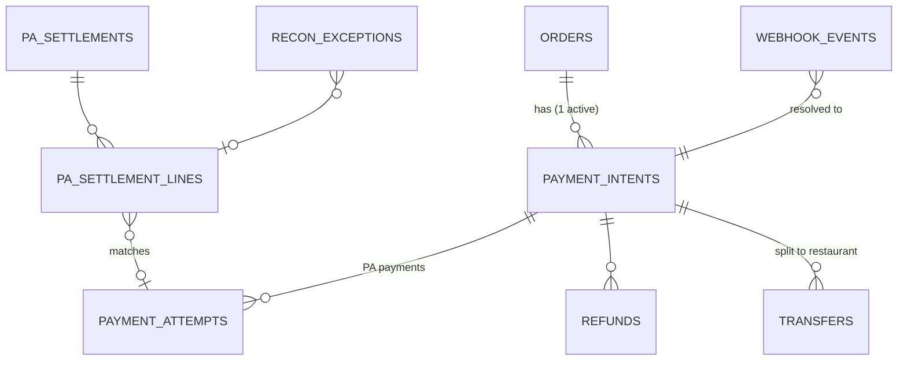
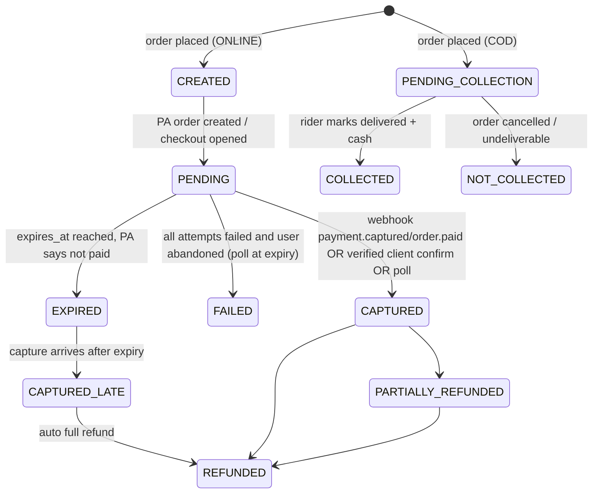
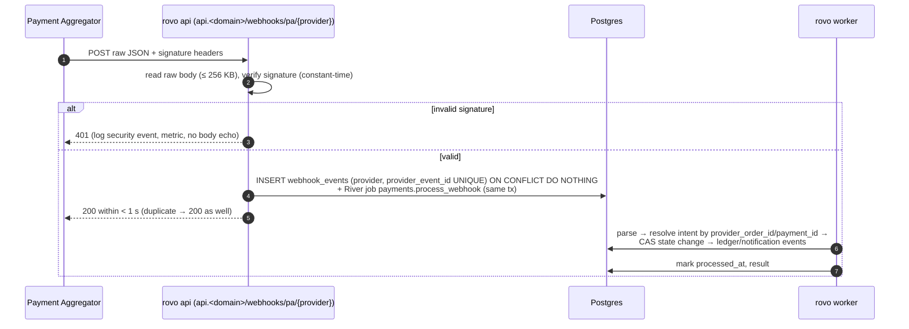
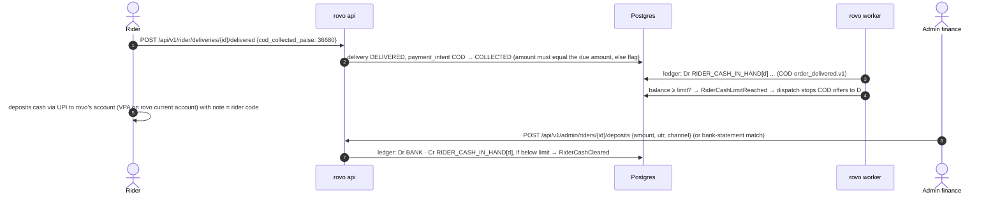
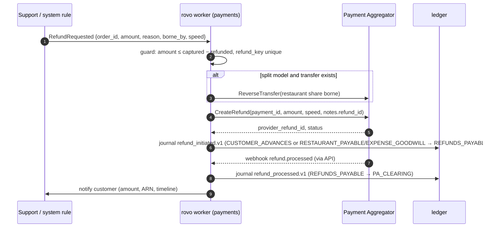
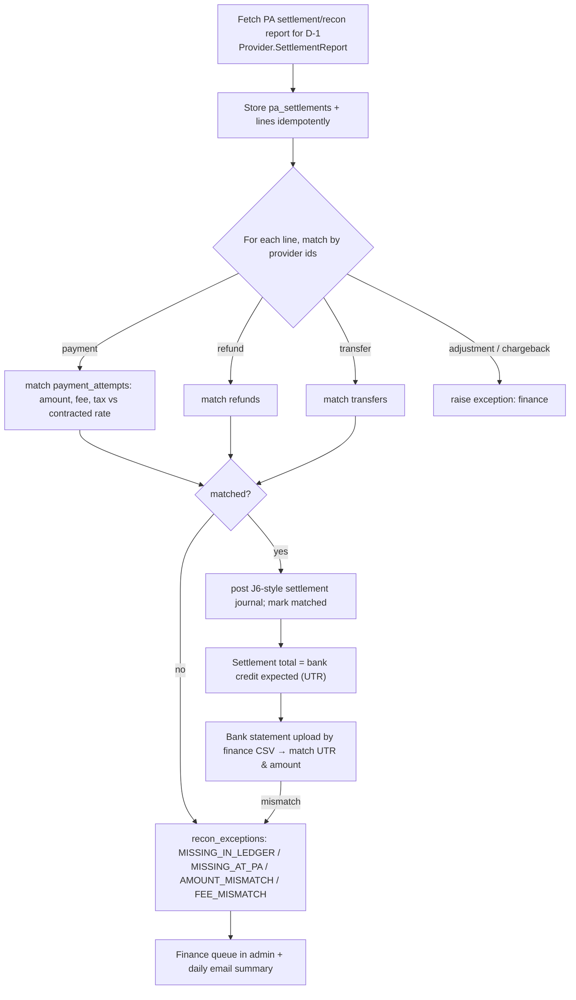
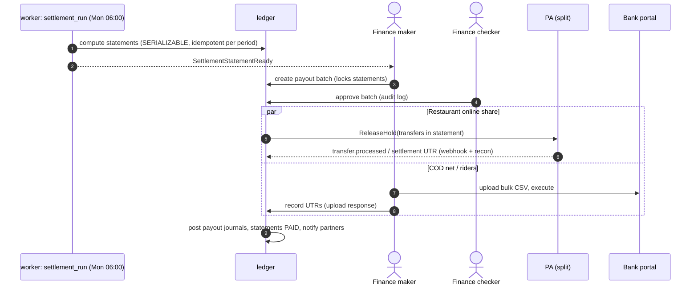

# 14 — Payment Architecture

| | |
|---|---|
| **Purpose** | Design for collecting, confirming, refunding, reconciling, accounting for and settling money in rovo: COD and online payments via a licensed payment aggregator (PA), the internal double-entry ledger, commission, fee and tax computation, invoices, weekly settlement and payouts, and COD risk controls. |
| **Owner** | Solution Architect |
| **Status** | Draft v1 (Phase 1 — planning only). **Every `[LEGAL]` item must be cleared by a chartered accountant and a payments/regulatory lawyer before launch.** |
| **Depends on** | `00-planning-baseline.md` (§3 money rules, §5 commercial defaults), `08-system-architecture.md` (modules `payments`, `ledger`, sequences §5), `09-architecture-decision-records.md` (ADR-012, ADR-013, ADR-025) |
| **Feeds** | `10-database-schema.md` (payment and ledger tables), `11-api-specification.md` (payment endpoints, webhooks), `13-order-state-machine.md` (payment-driven transitions), `07-admin-workflow.md` (finance screens), `19-security-threat-model.md`, `20-testing-strategy.md`, `29-production-readiness-checklist.md`, `30-risks-assumptions-decisions.md` |

Tags: `[ASSUMPTION]`, `[OPEN]`, `[LEGAL]`. All prices and rules were checked on **2026-10-04** unless stated otherwise. Indian payments pricing and tax rules change often, so re-verify at onboarding.

---

## 0. Summary

1. **Methods:** COD + online (UPI intent/QR first, then cards, netbanking, wallets) through **one RBI-authorised PA's hosted checkout/SDK**. Card data never touches rovo, so PCI-DSS scope is minimal `[ASSUMPTION: SAQ-A-equivalent; confirm with PA]`.
2. **Provider abstraction:** a `payments.Provider` Go interface (§9). Razorpay is the reference adapter. A fake provider serves dev/tests. The commercial choice (Razorpay vs Cashfree, plus quotes from PhonePe PG/Paytm PG) is made on the **written UPI rate**, launch offers, onboarding outcome and split-settlement support (ADR-012).
3. **Confirmation:** webhook-authoritative, plus a signature-verified client fast path and a polling safety net. All three converge through compare-and-swap (CAS) updates. Auto-cancel after N minutes pending. Late captures are auto-refunded.
4. **Money flow:** the **preferred** design routes restaurant shares through the PA's **marketplace split settlement** (Razorpay Route / Cashfree Easy Split), held until delivery and released weekly. This avoids rovo pooling third-party funds outside the PA escrow `[LEGAL]`. The ledger drives transfer instructions. Collect-and-payout manually is the fallback only if counsel approves it. Riders are paid from rovo's own account.
5. **Ledger:** append-only double-entry ("double-entry-lite": journals + postings, balanced per journal, no updates). Accounts for PA clearing, bank, customer advances, restaurant and rider payables, rider cash-in-hand, revenue lines, GST output (by type and state), GST input credit, TDS 194-O payable, refunds, promotions expense.
6. **Tax (to verify `[LEGAL]`):** GST on restaurant service via ECO under CGST **§9(5) at 5%** (payable by rovo, no ITC). **18%** on rovo's own services (platform fee, delivery fee, commission to restaurants). Since 2025-09-22, **local delivery via ECO is also notified under §9(5) at 18%**. **No GST TCS (§52)** on §9(5) supplies. **Income-tax TDS §194-O at 0.1%** on restaurant gross sales (thresholds apply).
7. **Settlement:** weekly (Mon–Sun IST) statements. Restaurants are paid via PA transfers (split) or bank transfer, riders via bank/UPI transfer. Manual execution in V1 with UTR recorded under maker-checker. Payout APIs come later.
8. **Reconciliation:** a daily job compares the PA settlement report ↔ ledger ↔ bank statement (uploaded). Exceptions go to a finance queue.
9. **COD risk:** order-value cap, per-customer COD blocking after no-shows, rider cash limit (₹2,000 default) with automatic COD-offer blocking, deposit SLA.

---

## 1. Principles

1. **Regulated money movement stays with a licensed PA** (and banks). rovo never stores card/UPI credentials and never runs its own wallet in V1 (no stored-value balance, since that would be a PPI and need RBI authorisation `[LEGAL]`). Customer "credits" for goodwill are **refunds to source**, not wallet balances.
2. **The ledger is the single source of financial truth** inside rovo. Every rupee movement (actual or obligation) is a balanced journal. Nothing edits history. Corrections are reversals.
3. **Integer paise everywhere** (ADR-013). Rounding happens only in documented places (§12.4).
4. **Idempotency at every hop:** API (Idempotency-Key), PA calls (receipt/reference = our ID), webhooks (provider event id), ledger (`source_type, source_id, rule` unique).
5. **Webhook first, poll second, client hint third.** The client is never trusted for amounts or status without server-side verification.
6. **No external calls inside DB transactions.** PA calls happen between transactions, with intent rows recording progress.

---

## 2. Payment methods and customer UX

| Method | Flow | Notes |
|---|---|---|
| **UPI intent** (Android) | PA checkout lists installed UPI apps → deep link `upi://pay?...` → user approves in the app → returns to PWA | Highest success rate on Android. The default on mobile. |
| **UPI QR** (desktop) | PA checkout shows a dynamic QR | Desktop only |
| **UPI collect** (VPA entry) | Collect request to the user's VPA | Keep as a fallback only. NPCI has been tightening collect flows `[unverified: check the current NPCI circular with the PA at integration]`. |
| Cards (debit/credit, RuPay) | PA hosted fields/redirect, 3-DS/OTP | Card tokenisation (CoF) is handled by the PA. rovo stores only the PA's token reference if "saved cards" are ever enabled (not in V1). |
| Netbanking | Redirect | Lower success, slower |
| Wallets | Redirect/SDK | Optional, enabled per PA config |
| **COD** | No PA. Rider collects cash (or a UPI QR to **rovo's** account, see §11.3) | Eligibility rules in §14 |

The checkout is opened from the customer PWA with the PA's JS SDK (Razorpay Checkout / Cashfree JS). The PA's return or callback navigation lands on `/checkout/pay/{orderId}` in the customer app. That page fetches order status via the API. It never trusts query parameters (doc 17 §6).

---

## 3. Payment aggregator comparison (India, verified 2026-10-04)

| | **Razorpay** | **Cashfree Payments** | **PhonePe PG** | **Paytm PG (Paytm Payments Services)** | **Juspay** |
|---|---|---|---|---|---|
| Type | PA (RBI-authorised) | PA (RBI-authorised) | PA | PA | **Orchestrator** + checkout SDK over multiple PAs (not a replacement for a PA in our setup) |
| Standard pricing (domestic) | **2% platform fee on cards, UPI, netbanking, wallets**. International up to 3%. No setup fee or AMC. GST 18% on fee. | **1.95%** UPI (intent, collect), domestic cards, netbanking, wallets. 2.15% UPI on RuPay credit. International 2.95–2.99%. No setup fee or AMC. Rates exclude GST. | **1.99%** standard plan. No setup fee or AMC. Per-method breakdown not published. UPI 0% **unverified**. | **1.99%** standard platform fee + 18% GST. No setup fee or AMC. Third-party sources state UPI and RuPay debit at 0 MDR, **not shown on the official page fetched**, so unverified. | Not public. Reported "Growth" plan ~0.22–0.25% per transaction **on top of** PA fees |
| Launch offers | — | **0% platform fee on domestic PG transactions up to a one-time ₹20 lakh GMV for new merchants registered 2026-07-21 → 2027-03-31** (GST still charged; excludes Amex/Diners/corporate/EMI/prepaid/pay-later/international; fair-use clause; one per PAN/bank) | — | — | — |
| Marketplace split | **Route**: linked accounts with KYC, transfers on capture or later, `on_hold` until release, reversals. **+0.1% + platform fee** | **Easy Split**: vendors with KYC docs via API, split at order or post-payment, vendor settlement scheduling | `[unverified]` | `[unverified]` | via underlying PA |
| Instant refunds | ₹7.99 (≤ ₹1k), ₹11.99 (₹1k–25k), ₹14.99 (> ₹25k) per refund | available `[pricing unverified]` | `[unverified]` | `[unverified]` | n/a |
| Payouts product | RazorpayX Payouts | Cashfree Payouts | — | — | — |
| Go SDK | official `razorpay-go` | official Go SDK `[verify version]` | `[unverified]` | `[unverified]` | n/a |
| Sources | https://razorpay.com/pricing/ ; https://razorpay.com/docs/payments/route.md ; https://razorpay.com/docs/payments/refunds/instant.md | https://www.cashfree.com/docs/help/account/pricing ; https://www.cashfree.com/docs/payments/split/vendor/kyc.md | https://www.phonepe.com/business-solutions/payment-gateway/pricing/ | https://www.paytmpayments.com/pricing | https://juspay.io/in ; https://apis.io/plans/juspay/juspay-plans-pricing/ (third-party) |

**UPI MDR context.** P2M UPI has carried zero MDR at the network level since January 2020. PAs nonetheless charge a **platform fee** (Razorpay states its 2% UPI fee is a platform fee, not MDR: https://razorpay.com/blog/razorpay-payment-gateway-pricing-explained/). In 2026 a Taxation and Other Laws (Amendment) Bill proposed letting the government notify MDR on UPI/RuPay for large merchants. Reports cite 0.4% on P2M above ₹2,000 (https://www.businesstoday.in/india/story/no-extra-charges-for-consumers-yet-govts-new-bill-opens-door-for-mdr-on-upi-and-rupay-transactions-at-large-merchants-547029-2026-08-04, accessed 2026-10-04: *proposed, not enacted*). Our typical basket (< ₹2,000) would be unaffected even if it were enacted. Re-check before launch `[OPEN]`.

**Cost per order (illustrative).** Average order value (AOV) ₹300 `[ASSUMPTION]`, all online:
- 2% + 18% GST ≈ **₹7.08/order**.
- 1.95% + GST ≈ ₹6.90.
- A negotiated 1.0% ≈ ₹3.54.
- 0% under the Cashfree launch allowance = ₹0 for the first ₹20 lakh GMV (≈ 6,600 orders, i.e. roughly the first 2–3 months at doc 01's targets of 80 → 250 orders/day). That saves ≈ ₹47k vs 2% + GST.

PA fees are therefore the **largest variable tech cost per order**, above the cloud target of ≤ ₹6/order (doc 01 M-60). The GST on PA fees is input tax credit (ITC)-eligible against our 18% output tax `[LEGAL]`.

**Recommendation (ADR-012).** Apply to **Cashfree and Razorpay** in parallel. Request **written** UPI pricing from both, and from PhonePe PG/Paytm PG. Choose the best combination of onboarding approval, effective rate, split-settlement support and webhook/report quality. Build the Razorpay adapter first (reference implementation for OSS users). Build the Cashfree adapter if it wins, sharing the provider contract test suite. Juspay is not needed below multi-PA scale.

### 3.1 Onboarding requirements for a new business (typical; verify per PA)

`[ASSUMPTION — compiled from common PA KYC checklists; confirm with the chosen PA, since the RBI PA Directions 2025 strengthened merchant due diligence]`
- **Entity:** a Private Limited company or LLP is preferred for a marketplace. Proprietorship is possible but limits split-settlement eligibility. Certificate of incorporation, PAN of the entity, GSTIN (an ECO must register, see §12), MOA/AOA or LLP agreement, board resolution or authorised signatory proof.
- **Bank:** current account in the entity name (cancelled cheque or bank letter).
- **Signatories/directors:** PAN plus address proof. Use masked Aadhaar only (baseline §3).
- **Website/app review:** live site with product/pricing visible, **Terms, Privacy Policy, Refund & Cancellation Policy, Delivery Policy, Contact/Grievance details**. These are prerendered static pages (ADR-009). The business model must be declared as a **food delivery marketplace**. The MCC is assigned by the PA.
- **Marketplace split:** each restaurant (linked account/vendor) needs its own KYC: PAN, bank account, business proof, and GSTIN if registered. Expect 1–3 days per vendor `[ASSUMPTION]`. This is a **restaurant onboarding dependency** (doc 05/07).
- **Timeline:** days to weeks. Start the application **at the beginning of Phase 2**, not at the end `[OPEN: Release Architect to add to the critical path, doc 28]`.

---

## 4. Regulatory frame and money-flow models `[LEGAL]`

**RBI Master Direction on Regulation of Payment Aggregators (15 Sept 2025)** consolidates the 2020–2023 PA rules. It covers authorisation, merchant due diligence, **escrow account operations ("only utilised for authorised PA business")**, settlement timelines and categories (PA-P/PA-O/PA-CB). Non-bank PAs must hold authorisation (₹15 crore net worth at application, ₹25 crore by the end of year 3) (https://www.medianama.com/2025/09/223-explained-rbi-master-direction-payment-aggregators/ ; https://www.cyrilshroff.com/wp-content/uploads/2025/10/Client-Alert-RBI-Introduces-Consolidated-Framework-for-Payment-Aggregators-3.pdf ; accessed 2026-10-04).

**Risk:** a marketplace that **receives customers' money into its own account and later pays it on to third-party merchants** may be seen as performing payment aggregation itself. Since 2020, the RBI's position has been that e-commerce marketplaces facilitating payments to sellers must either be authorised as PAs or route funds through an authorised PA's escrow. rovo cannot meet PA authorisation requirements. Hence:

| Model | Flow | Pros | Cons | Verdict |
|---|---|---|---|---|
| **A. PA split settlement (preferred)** | Customer pays → PA escrow → on capture, rovo instructs a **transfer** of the restaurant's net share to the restaurant's linked account (`on_hold=true`). The platform share settles to rovo. On the weekly cycle, rovo releases holds (or sets `on_hold_until`). PA settles to restaurant bank accounts. | Third-party funds never pass through rovo's bank account. PA does vendor KYC. Clear audit trail. | Restaurant KYC with the PA is onboarding friction. ~0.1% extra (Route). Refunds after transfer require reversal. | **Default for online orders** |
| B. Collect-and-payout | All money settles to rovo's bank. rovo pays restaurants weekly by bank transfer. | Simplest. No vendor KYC. | Possible unauthorised-aggregation exposure `[LEGAL]`. rovo holds third-party funds (trust/accounting obligations). | **Only with a written legal opinion.** Supported by the same ledger (only the payout execution differs). |
| C. Restaurant is merchant-of-record with its own PA account | Each restaurant integrates a PA | Clean legally | Impractical for small restaurants. Breaks the unified checkout. | Rejected |

**Riders** are paid by rovo for delivery services rovo procures. That is rovo's own expense, not aggregation, so it is paid from rovo's bank account in all models. **COD cash** is outside PA rules (it is not an electronic payment). But the restaurant's share of COD cash collected by rovo's riders is still a third-party obligation, settled from rovo's account in the weekly cycle. This is standard marketplace practice, but it needs to be included in the legal opinion `[LEGAL]`.

**Consumer protection / e-commerce rules** (Consumer Protection (E-Commerce) Rules 2020): display total price breakdown, refund policy and grievance officer. These are cross-referenced to doc 01/19 `[LEGAL]`.

---

## 5. Domain model: order ↔ payment



Indicative columns (doc 10 is authoritative):
- `payment_intents`: `id`, `order_id` (unique among non-terminal), `city_id`, `method` (`ONLINE|COD`), `provider` (`razorpay|cashfree|fake|null`), `provider_order_id` (unique), `amount_paise`, `currency`, `status`, `version`, `expires_at`, `captured_at`, `captured_amount_paise`, `refunded_amount_paise`, `created_at`.
- `payment_attempts`: `provider_payment_id` (unique), `instrument` (`UPI|CARD|NETBANKING|WALLET`), `vpa_masked`/`card_network`/`bank`, `status`, `error_code`, `error_reason`, `fee_paise`, `tax_on_fee_paise` (from settlement), `raw` JSONB (PII-minimised).
- `refunds`: `id`, `refund_key` (unique, e.g. `order:{id}:full`), `payment_attempt_id`, `amount_paise`, `reason`, `initiated_by`, `speed` (`normal|instant`), `provider_refund_id`, `status`, `arn`/`rrn` when available.
- `transfers` (split model): `id`, `order_id`, `restaurant_id`, `provider_transfer_id`, `amount_paise`, `on_hold`, `release_at`, `status`, `reversed_paise`.
- `webhook_events`: `provider`, `provider_event_id` (unique), `event_type`, `signature_valid`, `raw_body` (bytea, encrypted at rest, 180-day retention), `received_at`, `processed_at`, `result`.

### 5.1 Payment intent state machine



Mapping to order status (doc 13): `CAPTURED` → order `PENDING_PAYMENT → PLACED`. `FAILED|EXPIRED` → order `PAYMENT_FAILED`. The customer may **retry payment** on the same order while it is `PENDING_PAYMENT`: a new PA attempt on the same PA order (the PA allows multiple attempts per order), until `expires_at`.

---

## 6. Online payment flow (detail)

The happy path sequence is in doc 08 §5.1. Key rules:

1. **Create PA order** with `amount = order.total_paise`, `currency=INR`, `receipt = payment_intent.id` (≤ 40 chars), `notes = {order_code, city}`, auto-capture on. Retries with the same receipt must not create duplicates: before creating, query by receipt if the PA supports it, else rely on our `provider_order_id IS NULL` guard plus single-flight per intent (row lock).
2. **Client fast path:** the checkout success handler posts `{provider_order_id, provider_payment_id, signature}`. For Razorpay the signature is `HMAC_SHA256(order_id + "|" + payment_id, key_secret)`, compared in constant time. If valid, CAS `PENDING → CAPTURED` and emit `PaymentCaptured`. If invalid, return 400 and log a security event. The **amount is taken from our intent**, never from the client.
3. **Webhook (authoritative):** see §7.
4. **Poll safety net:** River job `payments.poll_intent` at +1, +3, +7 and +15 min after checkout open (and at expiry). It fetches the PA order/payments and converges.
5. **Expiry:** `expires_at = created_at + 15 min` `[ASSUMPTION; Product to confirm]`. At expiry, poll. If not captured → `EXPIRED`, order `PAYMENT_FAILED`, release coupon, notify the customer ("Payment not completed; no money was taken. If money was debited it will be auto-refunded").
6. **Late capture** (UPI can confirm minutes later): webhook/poll finds `captured` on an `EXPIRED` intent → status `CAPTURED_LATE` → **auto full refund** (`refund_key = intent:{id}:late`) → notify. Never resurrect the order: the restaurant may already be closed.
7. **Amount mismatch** (captured ≠ intent amount): treat as captured-late plus raise a `ReconExceptionRaised` alert. Do not place the order. Refund in full.

---

## 7. Webhooks and signature verification



| Provider | Signature scheme | Event id for dedupe | Key events |
|---|---|---|---|
| Razorpay | `X-Razorpay-Signature` = hex(HMAC-SHA256(raw_body, webhook_secret)). The webhook secret is distinct from the API key secret. Verify the **raw** body before parsing (https://razorpay.com/docs/webhooks/validate-test.md, accessed 2026-10-04). | `X-Razorpay-Event-Id` header `[verify]` | `payment.authorized`, `payment.captured`, `payment.failed`, `order.paid`, `refund.processed`, `refund.failed`, `transfer.processed`, `settlement.processed` |
| Cashfree | `x-webhook-signature` = base64(HMAC-SHA256(`x-webhook-timestamp` + raw_body, secret)) `[verify against current Cashfree docs at integration]` | event/payment ids in the payload | `PAYMENT_SUCCESS_WEBHOOK`, `PAYMENT_FAILED_WEBHOOK`, `REFUND_STATUS_WEBHOOK`, vendor/split events |
| fake | HMAC with a dev secret | payload id | all of the above, simulated |

Rules:
- The webhook endpoint lives on the bearer-only `api.<domain>` host (doc 12), with no cookies and no CSRF. Allow-list the PA's published source IPs at the edge **if** the PA publishes them `[OPEN]`. The signature is the primary control.
- Reject timestamps older than 5 min where the scheme includes one (replay protection). Dedupe covers the rest.
- **Process asynchronously.** The HTTP handler only verifies, stores and enqueues. PAs retry on non-2xx or timeouts, so the handler must be fast and idempotent.
- **Ordering is not guaranteed.** `payment.failed` may arrive after `payment.captured` for a different attempt. State transitions are CAS-guarded and monotonic (`CAPTURED` never goes back to `FAILED`).
- **Secrets** (key id/secret, webhook secret) come from the secrets manager. Rotation uses dual-secret verification during a rotation window.
- Raw bodies are retained 180 days for disputes and then purged. Customer PII in payloads (VPA, email, phone) is minimised or masked in `payment_attempts.raw`.

---

## 8. Idempotency summary

| Hop | Mechanism |
|---|---|
| Client → API `POST /api/v1/orders`, `/payments/confirm`, refunds | `Idempotency-Key` header (doc 08 §7.1) |
| API → PA create order | `receipt = payment_intent.id`; one PA order per intent (guarded by row lock) |
| API → PA refund | `refund_key` unique in DB; PA refund `receipt`/`notes.refund_id`. Before retrying a timed-out refund call, **list refunds for the payment** and match by our id. Never blindly re-POST. |
| API → PA transfer/release | `transfers.id` in `notes`. Query before retry. |
| PA → webhook | `webhook_events (provider, provider_event_id)` unique |
| Event → ledger | `ledger_journals (source_type, source_id, rule)` unique |
| Payout recording | `payouts (settlement_statement_id)` unique + UTR unique per bank account |

---

## 9. Provider interface (Go sketch)

```go
// package payments (public API of the module). Adapters live in
// internal/adapters/payments/{razorpay,cashfree,fake} (ADR-025).

type Provider interface {
    Name() ProviderName

    // Checkout
    CreateOrder(ctx context.Context, in CreateOrderInput) (ProviderOrder, error)          // idempotent by in.Receipt
    VerifyClientConfirmation(in ClientConfirmation) error                                 // pure, no I/O
    FetchOrder(ctx context.Context, providerOrderID string) (ProviderOrderStatus, error)  // includes payments[]

    // Webhooks
    VerifyWebhook(headers http.Header, rawBody []byte, now time.Time) error
    ParseWebhook(headers http.Header, rawBody []byte) (WebhookEvent, error)               // normalised event

    // Refunds
    CreateRefund(ctx context.Context, in RefundInput) (ProviderRefund, error)
    ListRefunds(ctx context.Context, providerPaymentID string) ([]ProviderRefund, error)

    // Marketplace split (optional capability)
    Split() (SplitProvider, bool)

    // Reconciliation
    SettlementReport(ctx context.Context, day civil.Date) (SettlementReport, error)       // paginated internally
}

type SplitProvider interface {
    CreateLinkedAccount(ctx context.Context, in LinkedAccountInput) (LinkedAccount, error)   // restaurant KYC refs
    LinkedAccountStatus(ctx context.Context, id string) (KYCStatus, error)
    Transfer(ctx context.Context, in TransferInput) (ProviderTransfer, error)               // OnHold, ReleaseAt
    ReleaseHold(ctx context.Context, providerTransferID string) error
    ReverseTransfer(ctx context.Context, providerTransferID string, amount money.Paise) error
}

type CreateOrderInput struct {
    Receipt  string        // payment_intent.id
    Amount   money.Paise
    Currency string        // "INR"
    Notes    map[string]string
}

type WebhookEvent struct {
    ProviderEventID   string
    Type              WebhookType   // PaymentCaptured, PaymentFailed, RefundProcessed, RefundFailed, TransferProcessed, SettlementProcessed...
    ProviderOrderID   string
    ProviderPaymentID string
    ProviderRefundID  string
    Amount            money.Paise
    Instrument        Instrument
    ErrorCode, ErrorReason string
    OccurredAt        time.Time
}

type SettlementReport struct {
    Lines []SettlementLine // type: payment|refund|transfer|adjustment|fee; ids; amount; fee; tax; settlement_id; utr; settled_at
}
```

Capabilities are discovered (`Split()`), so a PA without split support falls back to model B only if legal permits it. Each adapter must pass the **shared contract test suite** (sandbox-recorded fixtures + fake server) in CI. Live sandbox tests run in staging (ADR-025 rule 4).

Payout providers (RazorpayX/Cashfree Payouts) get a separate later interface: `Payouts.CreatePayout(ctx, PayoutInput{IdempotencyKey, Beneficiary, Amount, Mode: IMPS|NEFT|UPI})`.

---

## 10. Ledger design (double-entry-lite)

### 10.1 Structure

```sql
-- Illustrative DDL (doc 10 is authoritative)
CREATE TABLE ledger_accounts (
  id            uuid PRIMARY KEY,
  city_id       uuid REFERENCES cities(id),           -- null for global accounts
  code          text NOT NULL,                        -- e.g. RESTAURANT_PAYABLE
  owner_type    text,                                 -- restaurant|rider|platform|tax
  owner_id      uuid,                                 -- restaurant_id / rider_id / null
  gstin_state   char(2),                              -- for tax accounts (state code)
  normal_side   char(1) NOT NULL CHECK (normal_side IN ('D','C')),
  UNIQUE (code, owner_type, owner_id, gstin_state)
);
CREATE TABLE ledger_journals (
  id           uuid PRIMARY KEY,
  city_id      uuid NOT NULL,
  source_type  text NOT NULL,      -- order|refund|payout|deposit|settlement|adjustment
  source_id    uuid NOT NULL,
  rule         text NOT NULL,      -- posting rule name + version, e.g. order_delivered.v1
  effective_at timestamptz NOT NULL,
  memo         text,
  reverses_journal_id uuid REFERENCES ledger_journals(id),
  created_at   timestamptz NOT NULL DEFAULT now(),
  UNIQUE (source_type, source_id, rule)
);
CREATE TABLE ledger_postings (
  id          uuid PRIMARY KEY,
  journal_id  uuid NOT NULL REFERENCES ledger_journals(id),
  account_id  uuid NOT NULL REFERENCES ledger_accounts(id),
  amount_paise bigint NOT NULL CHECK (amount_paise <> 0),  -- +debit / -credit
  currency    char(3) NOT NULL DEFAULT 'INR',
  order_id    uuid, restaurant_id uuid, rider_id uuid       -- reporting dimensions
);
-- Deferred constraint trigger: SUM(amount_paise) per journal_id = 0 at COMMIT.
-- REVOKE UPDATE, DELETE on journals/postings from the app role; corrections via reversing journals.
```

`account_balances(account_id, balance_paise, version)` is maintained in the same transaction for accounts that gate behaviour (rider cash-in-hand, payables). It can always be rebuilt from postings (a nightly check compares them and alerts on drift).

### 10.2 Chart of accounts (V1)

| Code | Type | Normal | Per | Meaning |
|---|---|---|---|---|
| `PA_CLEARING` | Asset | D | provider | Money captured at the PA, not yet settled to our bank |
| `BANK` | Asset | D | bank account | rovo's current account |
| `RIDER_CASH_IN_HAND` | Asset | D | rider | COD cash held by a rider and owed to rovo |
| `CUSTOMER_ADVANCES` | Liability | C | city (order dimension) | Prepaid by customers for orders not yet delivered |
| `REFUNDS_PAYABLE` | Liability | C | city | Refunds initiated, not yet processed by the PA |
| `RESTAURANT_PAYABLE` | Liability | C | restaurant | Owed to restaurant (net of commission, TDS) |
| `RIDER_PAYABLE` | Liability | C | rider | Rider earnings not yet paid |
| `GST_OUTPUT_9_5_RESTAURANT` | Liability | C | GSTIN state | GST on restaurant services that rovo pays as ECO (5%) |
| `GST_OUTPUT_9_5_DELIVERY` | Liability | C | GSTIN state | GST on local delivery via ECO (18%) if that model applies `[LEGAL]` |
| `GST_OUTPUT_OWN` | Liability | C | GSTIN state | GST on rovo's own supplies: platform fee, delivery fee (own-supply model), commission, small-cart fee (18%) |
| `GST_INPUT_CREDIT` | Asset | D | GSTIN state | ITC on PA fees, cloud and other inputs |
| `TDS_194O_PAYABLE` | Liability | C | entity | Income-tax TDS deducted from participants |
| `REVENUE_COMMISSION` | Income | C | city | Restaurant commission |
| `REVENUE_DELIVERY_FEE` | Income | C | city | Customer delivery fee |
| `REVENUE_PLATFORM_FEE` | Income | C | city | Platform fee + small-cart fee |
| `EXPENSE_RIDER_PAY` | Expense | D | city | Rider earnings |
| `EXPENSE_PA_FEES` | Expense | D | provider | PA fees (excl. GST) |
| `EXPENSE_PROMOTIONS` | Expense | D | city | Platform-funded discounts |
| `EXPENSE_GOODWILL` | Expense | D | city | Platform-borne refunds/compensation |
| `SUSPENSE` | — | — | — | Unmatched items pending recon. Must trend to zero. |

### 10.3 Worked example (prepaid order)

Quote (tax-exclusive bases; see §13 for computation and `[OPEN]` on GST-inclusive display):

| Line | Paise |
|---|---|
| Food subtotal | 30,000 |
| Packaging (restaurant) | 1,000 |
| GST 5% on restaurant supply (31,000) — §9(5), paid by rovo | 1,550 |
| Delivery fee | 3,000 |
| GST 18% on delivery fee | 540 |
| Platform fee | 500 |
| GST 18% on platform fee | 90 |
| **Customer total** | **36,680** (₹366.80) |

Commission 15% × food subtotal 30,000 = 4,500; GST 18% on it = 810. TDS 194-O 0.1% × 31,000 = 31. Rider pay ₹25 + ₹6 × 1.2 km = 3,220. PA fee at 2% = 734, GST on the fee = 132.

| # | Trigger (event) | Journal (Dr + / Cr −) |
|---|---|---|
| J1 | `PaymentCaptured` | Dr `PA_CLEARING` 36,680 · Cr `CUSTOMER_ADVANCES` 36,680 |
| J2 | `OrderDelivered` (rule `order_delivered.v1`) | Dr `CUSTOMER_ADVANCES` 36,680 · Cr `RESTAURANT_PAYABLE[r]` 31,000 · Cr `GST_OUTPUT_9_5_RESTAURANT` 1,550 · Cr `REVENUE_DELIVERY_FEE` 3,000 · Cr `GST_OUTPUT_OWN` 540 · Cr `REVENUE_PLATFORM_FEE` 500 · Cr `GST_OUTPUT_OWN` 90 |
| J3 | `OrderDelivered` (rule `commission.v1`) | Dr `RESTAURANT_PAYABLE[r]` 5,310 · Cr `REVENUE_COMMISSION` 4,500 · Cr `GST_OUTPUT_OWN` 810 |
| J4 | `OrderDelivered` (rule `tds_194o.v1`) | Dr `RESTAURANT_PAYABLE[r]` 31 · Cr `TDS_194O_PAYABLE` 31 |
| J5 | `OrderDelivered` (rule `rider_earning.v1`) | Dr `EXPENSE_RIDER_PAY` 3,220 · Cr `RIDER_PAYABLE[d]` 3,220 |
| J6 | `SettlementReportIngested` (per payment line) | Dr `BANK` 35,814 · Dr `EXPENSE_PA_FEES` 734 · Dr `GST_INPUT_CREDIT` 132 · Cr `PA_CLEARING` 36,680 |
| J7a | Model B payout | Dr `RESTAURANT_PAYABLE[r]` 25,659 · Cr `BANK` 25,659 (UTR in memo) |
| J7b | Model A transfer settled (split) | Dr `RESTAURANT_PAYABLE[r]` 25,659 · Cr `PA_CLEARING` 25,659. In this model, J6 settles the remaining net to `BANK`, and Route fees post to `EXPENSE_PA_FEES`. |
| J8 | Rider payout | Dr `RIDER_PAYABLE[d]` · Cr `BANK` |

Restaurant net for this order = 31,000 − 5,310 − 31 = **25,659** (₹256.59). Platform contribution before fixed costs ≈ 4,500 + 3,000 + 500 − 3,220 − 734 = **₹40.46** (GST nets out as a pass-through, with ITC on the PA fee).

### 10.4 Other events

| Event | Journal |
|---|---|
| **COD delivered** (`order_delivered.v1` with method COD) | As J2–J5, but J2 debits `RIDER_CASH_IN_HAND[d]` 36,680 instead of `CUSTOMER_ADVANCES`. Gate: if the resulting balance ≥ the cash limit → emit `RiderCashLimitReached`. |
| **Rider cash deposit** (admin records UPI/bank credit with UTR, or matched from bank statement) | Dr `BANK` x · Cr `RIDER_CASH_IN_HAND[d]` x → may emit `RiderCashCleared` |
| **Rider earnings netted against cash** (rider keeps earnings from cash, with consent, at settlement) | Dr `RIDER_PAYABLE[d]` y · Cr `RIDER_CASH_IN_HAND[d]` y |
| **Coupon funded by platform** (₹50 off) | Customer pays 31,680. J1 is 31,680. J2 adds Dr `EXPENSE_PROMOTIONS` 5,000 so that credits are unchanged (restaurant still gets 31,000 gross; GST on full supply value) `[LEGAL: GST valuation of platform-funded discounts]` |
| **Coupon funded by restaurant** (₹50 off food) | Food value becomes 25,000. GST 5% is on the reduced value. `RESTAURANT_PAYABLE` is credited the reduced amount. Commission base is per contract (default: post-discount) `[OPEN: Product]` |
| **Coupon co-funded** | Split per coupon `funding_split` into the two cases above |
| **Full refund before delivery** (rejection/cancel) | Dr `CUSTOMER_ADVANCES` 36,680 · Cr `REFUNDS_PAYABLE` 36,680. On `RefundProcessed`: Dr `REFUNDS_PAYABLE` · Cr `PA_CLEARING` (the PA deducts it from settlement). No revenue was recognised, so no GST reversal is needed. The original PA fee is generally not returned `[unverified per PA]` → `EXPENSE_PA_FEES` when the settlement shows it. |
| **Partial refund after delivery, restaurant at fault** (missing item ₹100 + GST ₹5) | Dr `RESTAURANT_PAYABLE[r]` 10,000 · Dr `GST_OUTPUT_9_5_RESTAURANT` 500 · Cr `REFUNDS_PAYABLE` 10,500. Commission adjustment per contract. A credit note is issued (§12.5) `[LEGAL]`. |
| **Partial refund, platform goodwill** | Dr `EXPENSE_GOODWILL` · Cr `REFUNDS_PAYABLE` (no GST credit note if it is compensation rather than a price reduction `[LEGAL]`) |
| **Instant refund fee** | Dr `EXPENSE_PA_FEES` + `GST_INPUT_CREDIT` · Cr `PA_CLEARING` (from settlement) |
| **Undeliverable, customer at fault (prepaid)** | Policy `[OPEN: Product]`: e.g. no refund of food, so recognise as delivered for the restaurant. The rider is paid. |
| **Undeliverable COD** | No cash. Restaurant compensation policy `[OPEN]`. Customer COD strike (§14). |
| **Monthly GST/TDS remittance** | Dr `GST_OUTPUT_*` / `TDS_194O_PAYABLE` · Cr `BANK`. Dr `GST_OUTPUT_OWN` · Cr `GST_INPUT_CREDIT` for ITC utilisation (finance records this from the filed return) |

Posting rules are **pure functions** `func(OrderFinancials) Journal`, unit-tested with table tests and property tests (balanced, non-negative payables after payouts). Rules are versioned (`.v1`) so historical journals remain explainable after a rule change.

---

## 11. COD flows

### 11.1 Sequence



### 11.2 Rules
- The rider app shows the **amount to collect** prominently. Collecting a different amount needs a reason (customer short of change → `[OPEN: Product]` policy for rounding to ₹1/₹5).
- Deposit channels: UPI to rovo's bank VPA (preferred, ₹0 fee via direct bank collection, **not** via the PA, which would charge fees), cash deposit at a bank or hub `[OPEN: ops]`. A daily rider cash statement is available in the app.
- A deposit SLA (e.g. within 24 h or before the next shift) is enforced via the cash limit and escalation.

### 11.3 Customer pays COD by UPI at the door
The customer scans a **static rovo QR** (rovo's bank VPA) and the rider marks "paid by UPI" with the customer's UTR. Treat it as COD-UPI: Dr `BANK` (pending bank match) instead of `RIDER_CASH_IN_HAND`. Matching via the bank statement upload. Fraud risk is a fake UTR, mitigated by bank-statement match within 24 h plus rider accountability `[OPEN: enable in V1 or V1.1]`.

---

## 12. Taxes, invoices and compliance `[LEGAL]`

All items in this section need a CA's confirmation before launch. Rates are as researched on 2026-10-04.

### 12.1 GST

| Supply | Who is liable | Rate (researched) | Basis / source |
|---|---|---|---|
| Restaurant service (food + packaging) supplied **through** rovo | **rovo as ECO under CGST §9(5)** (since 2022-01-01) | **5%, no ITC**. Unchanged by the GST 2.0 rationalisation effective 2025-09-22. | https://cleartax.in/s/gst-on-service-supplied-restaurants-ecommerce-operators ; https://www.taxaj.com/learn/?p=843 (accessed 2026-10-04) |
| **Local delivery services** supplied through an ECO by unregistered persons (riders) | **ECO under §9(5)**, effective **2025-09-22** | **18%**, paid in cash, no ITC against it | https://inc42.com/buzz/zomato-swiggy-deliveries-to-get-costlier-with-new-18-gst ; https://www.ey.com/en_in/technical/alerts-hub/2025/09/cbic-issues-notifications-giving-effect-to-the-recommendations-made (accessed 2026-10-04) |
| Delivery fee **if rovo itself supplies delivery** (riders as rovo's contractors) | rovo (own supply) | 18% | General rate. Model choice `[LEGAL]`: either way the customer-facing delivery fee carries 18%. The ledger supports both via `GST_OUTPUT_9_5_DELIVERY` vs `GST_OUTPUT_OWN`. |
| Platform fee / small-cart fee to customers | rovo (own supply) | 18% | Swiggy/Zomato levy platform fees with GST (https://www.storyboard18.com/how-it-works/food-delivery-to-get-costlier-as-zomato-swiggy-magicpin-raise-platform-fees-80476.htm) |
| Commission/marketing services to restaurants (B2B) | rovo | 18% | Restaurants under 5% no-ITC can't claim it, so it is a real cost to them |
| PA fees charged to rovo | PA | 18% (ITC available to rovo) | Razorpay pricing page |

- **Registration:** rovo must hold GST registration as an ECO in **each state** where it operates (Telangana for V1). ECOs require compulsory registration irrespective of turnover `[LEGAL]`. Whether **restaurants** supplying only via an ECO under §9(5) must register is `[LEGAL]`. The data model stores `gstin` as optional and `fssai_license_no` as mandatory.
- **GST TCS under §52:** **not applicable** to supplies on which the ECO pays tax under §9(5) (https://cleartax.in/s/gst-on-service-supplied-restaurants-ecommerce-operators). V1 sells only restaurant services, so **no TCS**. If non-§9(5) goods are ever sold (e.g. packaged groceries), TCS under §52 applies (rate reduced to 0.5% from 2024-07-10 `[unverified, verify]`). An account placeholder `TCS_52_PAYABLE` is reserved.
- **Returns:** GSTR-1/3B with §9(5) reporting (GSTN guidance exists: https://news.cleartax.in/gstn-issues-guide-to-report-section-95-supplies-by-e-commerce-operators-in-gstr-3b/7477/). Reporting exports come from the ledger (doc 07 finance) `[OPEN: CA to specify formats]`.

### 12.2 Income-tax TDS §194-O
- An ECO must deduct **0.1%** (reduced from 1% effective **2024-10-01**) on the gross amount of sales/services of e-commerce participants (restaurants; "a restaurant selling food on Zomato" is the canonical example). No deduction for an individual/HUF participant whose gross amount in the previous year ≤ ₹5 lakh **and** who furnished PAN/Aadhaar. Without PAN, a higher rate applies under §206AA (5%) `[verify]` (https://taxguru.in/income-tax/section-194-o-amendment-lower-tds-rate-e-commerce-payments.html ; https://cleartax.in/s/section-194o, accessed 2026-10-04).
- **Base:** gross amount *excluding GST* when shown separately `[LEGAL: confirm CBDT circular]`. TDS applies at credit or payment, whichever is earlier. We post at `OrderDelivered` (credit to `RESTAURANT_PAYABLE`).
- **Riders:** whether rider payments fall under §194-O (if riders are "participants" supplying via the platform) or §194C (contractor) depends on the delivery model `[LEGAL]`. The ledger rule `tds_rider.v1` is parameterised and off by default. Most riders will be under thresholds.
- **Note:** India's new Income-tax Act, 2025 replaces the 1961 Act from 2026-04-01 with renumbered sections `[LEGAL: confirm the equivalent section for 194-O and its current rate]`. Code uses a `tax_code` table, not hard-coded section numbers.
- Quarterly TDS returns and certificates to restaurants: export from the ledger `[OPEN: CA]`.

### 12.3 Data model for tax
`tax_rates(tax_code, city_id|state, rate_bps, effective_from, effective_to)` with codes such as `GST_RESTAURANT_9_5`, `GST_OWN_SERVICE`, `GST_DELIVERY_9_5`, `TDS_194O`. The quote engine and posting rules look up rates **effective at order time**. A rate change is a data change with an effective date, never a deploy.

### 12.4 Rounding
GST is computed **per invoice line** in paise, half-up (baseline §3). Tax totals = Σ line taxes. If a CA requires invoice-level computation, the switch is `rounding_mode` in `pricing_configs` `[OPEN: CA]`. The customer-facing total is not rounded to the rupee unless Product decides (baseline §3 `[OPEN]`). If it is rounded, the difference is a `round_off` line posted to `REVENUE_PLATFORM_FEE` or `EXPENSE_GOODWILL`.

### 12.5 Invoices per order (customer)

Following the common Indian food-marketplace pattern `[LEGAL: confirm format]`:

1. **Tax invoice for restaurant service, issued by rovo as ECO under §9(5)**, on behalf of the restaurant. Shows: restaurant name, address, FSSAI no., GSTIN (if any); rovo's GSTIN; customer name and delivery state (place of supply); line items, packaging; taxable value; CGST 2.5% + SGST 2.5% (intra-state); a note "Tax paid by e-commerce operator under section 9(5)"; SAC `996331` `[verify]`.
2. **Tax invoice for rovo's own services:** delivery fee, platform fee, small-cart fee; CGST 9% + SGST 9%; SAC per CA `[OPEN]`.
3. One PDF combines both with a summary, generated by the worker on `OrderDelivered`, stored in the private bucket, emailed if an email exists and downloadable in-app.

Invoice numbering: unique, consecutive per GSTIN per financial year, ≤ 16 characters (CGST Rule 46), e.g. `TS25R0000123` (state code + FY + series + sequence). `invoice_sequences` uses a row lock per series, and numbers are never reused. **Credit notes** are issued for post-delivery price reductions (partial refunds). **Monthly B2B commission invoice** to each restaurant (18%) accompanies the settlement statement. E-invoicing (IRN) applies to B2B invoices only above the turnover threshold (currently ₹5 crore AATO `[verify]`), so it is not expected in V1.

---

## 13. Commission and fee computation (quote engine)

Inputs: cart lines (from catalog), address (to get distance, zone and city), coupon, customer, time. Config (versioned, effective-dated, per city → zone → restaurant override): delivery fee slabs, platform fee, small-cart threshold and fee, packaging rules, commission %, rider pay formula, tax codes.

```
items_subtotal      = Σ (unit_price + addons) × qty                    # restaurant prices, GST-exclusive [ASSUMPTION]
packaging           = restaurant rule (per item / per order)
restaurant_discount = coupon share funded by restaurant (applied to items_subtotal)
platform_discount   = coupon share funded by platform (applied to the order total, see §10.4)
restaurant_taxable  = items_subtotal − restaurant_discount + packaging
gst_restaurant      = round(restaurant_taxable × 5%)                    # §9(5)
distance_m          = haversine(restaurant, drop) × road_factor(city)   # ADR-014
delivery_fee        = slab(distance_m) (0 if free-delivery campaign; funded by → promotions)
small_cart_fee      = items_subtotal < 14900 ? 1500 : 0
platform_fee        = 500
gst_own             = round(delivery_fee × 18%) + round(platform_fee × 18%) + round(small_cart_fee × 18%)
total               = restaurant_taxable + gst_restaurant + delivery_fee + platform_fee + small_cart_fee + gst_own − platform_discount
commission          = round(commission_base × commission_pct), base = items_subtotal − restaurant_discount  [OPEN: include packaging?]
gst_on_commission   = round(commission × 18%)
tds_194o            = round(restaurant_taxable × 0.1%) (if applicable to this restaurant)
restaurant_net      = restaurant_taxable − commission − gst_on_commission − tds_194o − pg_fee_passthrough [OPEN]
rider_pay           = 2500 + max(0, distance_km − 2) × 600 + waiting_pay   (computed at delivery from actuals)
```

- **Display:** `[OPEN: Product]` whether fees are shown GST-inclusive (Swiggy shows its platform fee inclusive of GST). The engine supports both via `fee_display_mode`. Ledger bases are always tax-exclusive.
- **PG fee pass-through to restaurants:** many marketplaces charge restaurants a payment-processing fee on online orders. Supported as a contract field, default 0 `[OPEN: Product/BD]`.
- **Quote snapshot:** the full breakdown, config version IDs and tax rates are stored on `quotes` and copied to the order. Posting rules use the **order snapshot**, never live config.

---

## 14. COD risk controls

| Control | Default (per city, configurable) | Enforcement point |
|---|---|---|
| COD enabled per city/zone/time window | on; off 23:00–06:00 `[ASSUMPTION]` | quote/checkout |
| Max COD order value | ₹1,000 | checkout |
| New-customer COD cap | first order ≤ ₹500 COD `[ASSUMPTION]` | checkout |
| COD strikes | Order `UNDELIVERABLE` with reason `CUSTOMER_UNREACHABLE` / `CUSTOMER_REFUSED` = 1 strike. **2 strikes in 90 days → COD disabled** for the customer (prepaid only), with notification and support appeal. | checkout + support |
| Phone/device velocity | > 3 COD orders/hour per phone/device → block | checkout |
| Rider cash limit | ₹2,000 (baseline §5) | dispatch filter: `cash_in_hand + order_total ≤ limit`; hard block at the limit |
| Deposit SLA | 24 h; after 48 h the rider is suspended from going online | periodic job + ops alert |
| Cash mismatch | delivered with `cod_collected ≠ due` → ops review; persistent shortfall → rider payable deduction (with consent and policy) | admin |
| Payment-provider outage | COD-only mode (doc 08 §11) with tighter caps (₹600) to limit risk exposure | circuit breaker |

---

## 15. Refunds

| Case | Trigger | Amount | Who bears | Speed |
|---|---|---|---|---|
| Restaurant rejects / accept timeout | `OrderRejected` | Full | none (no revenue recognised); PA fee → platform | normal; instant optional |
| Customer cancels before accept | `OrderCancelled` by customer while `PLACED` | Full | platform (PA fee) | normal |
| Customer cancels after accept | policy | Partial or none `[OPEN: Product]` | per policy | normal |
| Dispatch exhausted, ops cancels | `OrderCancelled` by system/admin | Full | platform | **instant** (customer experience) |
| Late capture / amount mismatch | §6 | Full | platform | normal |
| Missing/wrong item (post-delivery) | support resolution | Partial | restaurant (debit payable) or platform (goodwill) | normal |
| Undeliverable, platform at fault | ops | Full | platform | instant |

- Refunds always go **to source** via the PA. No wallet credits in V1 (PPI regulation `[LEGAL]`).
- **Instant refunds** (Razorpay ₹7.99–14.99 each) are used selectively: platform-fault cases and amounts above a threshold. Configurable.
- Normal refunds take **5–7 business days** to reach the customer (Razorpay: https://razorpay.com/newsroom/no-more-5-7-business-days-for-refunds-razorpay-launches-instant-refunds/). The customer sees the expected timeline and the ARN/RRN when available.
- **Split model:** if a transfer to the restaurant was already created, reverse the restaurant-borne part of the transfer first (`ReverseTransfer`), then refund. If the transfer is still `on_hold`, reversal is free of settlement timing issues. This is why holds stay in place until delivery plus a dispute window.
- `refund.failed` → retry 3× with backoff → `ReconExceptionRaised` → finance can retry or choose "manual bank refund" (requires customer bank details via support, recorded with UTR).



---

## 16. Reconciliation

### 16.1 Daily PA reconciliation job (`payments.recon_daily`, 10:30 IST, for D-1)



Exception types and default handling:
- **Captured at PA, no captured intent** (webhook lost and polling missed it): auto-converge. If the order is expired, apply the late-capture refund.
- **Captured in ledger, absent from PA report after T+3 days:** alert finance and check with the PA.
- **Fee mismatch** (fee ≠ contracted rate × amount ± ₹0.01): flag. Weekly summary used for PA dispute.
- **Chargeback/dispute lines:** create a support case. Ledger: Dr `SUSPENSE` until resolved, then to restaurant or goodwill.

Controls: `SUSPENSE` balance and the open exception count are dashboard KPIs. Month-end close requires zero unexplained items `[OPEN: finance process]`.

### 16.2 Internal integrity checks (nightly)
- Σ postings per journal = 0 (DB-enforced, re-verified).
- `account_balances` = Σ postings per account.
- Every `DELIVERED` order has the full set of posting rules applied. Every `CAPTURED` intent has J1.
- `CUSTOMER_ADVANCES` balance = Σ captured amounts of undelivered, unrefunded orders.

---

## 17. Settlement cycle and payouts

| Item | Restaurants | Riders |
|---|---|---|
| Period | Mon 00:00 → Sun 23:59:59 IST | Weekly (same). On-demand later `[OPEN]` |
| Statement | Mon 06:00 IST job: orders delivered, gross, commission + GST, TDS, refunds borne, adjustments, opening/closing payable | Earnings by delivery, incentives (deferred), cash-in-hand, net payable |
| Hold / dispute window | Orders delivered in the period, plus 48 h complaint window `[ASSUMPTION]`; later-period carry-over | — |
| Minimum payout | ₹100 (else carried forward) | ₹100 |
| Execution (V1) | **Split model:** release holds for the statement's transfers via `ReleaseHold`, then the PA settles to the restaurant's bank. **COD net amounts and model B:** bank transfer from rovo's account. | Bank transfer/UPI from rovo's account, **net of cash-in-hand** (with rider consent in the contract) |
| Target date | Wednesday | Wednesday |
| Proof | PA transfer settlement UTR / bank UTR recorded in `payouts` | UTR |

**Manual payout procedure V1 (maker-checker):**
1. `ADMIN_FINANCE` (maker) reviews statements and generates a **payout batch**: CSV in the bank's bulk-upload format plus a summary. The batch is locked (no new postings affect it).
2. A second `ADMIN_FINANCE`/`ADMIN_SUPER` (checker) approves it in admin. This is an audit-logged step.
3. Finance executes in the bank portal and uploads the bank response file or enters UTRs. The system posts J7/J8 per payout, marks statements `PAID`, notifies partners (push + SMS/WhatsApp) and shows the UTR in the partner apps.
4. Failed payouts (wrong account) → reverse to payable, notify the partner to fix bank details. Bank details changes require re-verification (penny-drop via PA or bank `[OPEN]`) and a 48 h cool-off before the next payout (account-takeover fraud control).

**Later (V1.1+):** RazorpayX/Cashfree Payouts API via a `Payouts` interface with an idempotency key = payout id, webhooks for status, and the same ledger postings.



---

## 18. Failure and timeout handling (payments-specific)

| Failure | Handling |
|---|---|
| PA create-order timeout | Intent stays `CREATED`. Client retry with the same Idempotency-Key re-attempts (single-flight lock). After 3 failures, the circuit breaker counts it. |
| Circuit open (PA degraded) | Hide online methods, offer COD (if eligible), banner. Half-open probes. |
| Checkout abandoned | Poll at expiry → `EXPIRED`. The customer can re-order (the cart is preserved). |
| Webhook delayed/lost | Client confirm + polling converge. Daily recon is the backstop. |
| Duplicate webhooks | Unique `provider_event_id` → 200, no reprocessing |
| Refund API error | Retry with list-before-retry. After 3 tries, raise an exception. |
| Settlement report unavailable | Retry hourly until 18:00. Alert finance after that. |
| Webhook secret rotated | Dual-secret window. Alert on any invalid-signature spike. |
| Clock skew | PA timestamps are stored as data. Our timers use DB time. |

---

## 19. Security and privacy

- **PCI-DSS:** hosted checkout/SDK only. No PAN, CVV or UPI PIN ever reaches rovo `[ASSUMPTION: SAQ-A-equivalent attestation to the PA]`. CSP allows the PA's checkout domains on the customer app only (doc 17 §15.6).
- **Secrets:** PA keys and webhook secrets live in the secrets manager, with least-privilege PA dashboard users and 2FA on PA and bank portals.
- **Admin finance actions** (refund > ₹X, payout batch, bank detail change, manual ledger adjustment) are maker-checker and audit-logged (doc 12).
- **PII:** store masked VPA, card last4 and network only. Restaurant/rider bank details are stored encrypted (application-level envelope encryption with a KMS-backed key `[OPEN: Security]`), shown masked, and fully visible only to the finance role, with audit.
- **Fraud signals** (V1 minimal): many failed attempts per customer, many COD strikes, high-value first orders, VPA/card reuse across many accounts. Rules flag for review. They do not auto-block, except where specified in §14.

---

## 20. Testing hooks (for doc 20)

- **Fake provider** supports scripted scenarios: `success`, `fail`, `delayed_webhook(60s)`, `duplicate_webhook`, `late_capture`, `amount_mismatch`, `refund_failed`, and settlement report generation.
- **Property tests** on posting rules: every journal balances, and the restaurant net equals the formula.
- **Golden-file tests** for invoices (PDF text extraction) and settlement statements.
- **Sandbox E2E** in staging against the Razorpay/Cashfree test mode, with webhook delivery to staging.

---

## 21. Open questions

| # | Question | Owner |
|---|---|---|
| PAY-1 | Is model B (collect-and-payout) permissible for rovo's structure, or is PA split settlement mandatory? Same question for restaurant share of COD cash. | `[LEGAL]` counsel |
| PAY-2 | Delivery service model: rovo supplies delivery (own 18%) vs riders supply via ECO (§9(5) 18%). Affects invoices and rider contracts. | `[LEGAL]` CA |
| PAY-3 | GST valuation of platform-funded discounts. Credit notes vs goodwill. SAC codes. Invoice format. | `[LEGAL]` CA |
| PAY-4 | TDS 194-O applicability and section mapping under the Income-tax Act 2025. Rider TDS. | `[LEGAL]` CA |
| PAY-5 | Payment-pending expiry (15 min?), customer cancellation policy after accept, undeliverable policies | Product |
| PAY-6 | Fees displayed GST-inclusive? Round total to rupee? Commission base includes packaging? PG fee pass-through? | Product/BD |
| PAY-7 | Final PA selection after written quotes. Start applications at the start of Phase 2. | Lead + founders |
| PAY-8 | Enable COD-via-UPI-QR at the door in V1? | Product/Ops |
| PAY-9 | Bank account verification (penny drop) provider and cost | Finance/DevOps |

---

## Sources (accessed 2026-10-04)

- Razorpay pricing: https://razorpay.com/pricing/
- Razorpay pricing explainer (UPI platform fee vs MDR): https://razorpay.com/blog/razorpay-payment-gateway-pricing-explained/
- Razorpay Route: https://razorpay.com/docs/payments/route.md ; linked accounts: https://razorpay.com/docs/payments/route/linked-account.md
- Razorpay webhook validation: https://razorpay.com/docs/webhooks/validate-test.md
- Razorpay instant refunds: https://razorpay.com/docs/payments/refunds/instant.md ; https://razorpay.com/newsroom/no-more-5-7-business-days-for-refunds-razorpay-launches-instant-refunds/
- Cashfree pricing (doc dated 2026-08-10; festive 0% offer terms): https://www.cashfree.com/docs/help/account/pricing
- Cashfree Easy Split vendor KYC: https://www.cashfree.com/docs/payments/split/vendor/kyc.md
- PhonePe PG pricing: https://www.phonepe.com/business-solutions/payment-gateway/pricing/
- Paytm PG pricing: https://www.paytmpayments.com/pricing
- Juspay: https://juspay.io/in ; third-party pricing summary https://apis.io/plans/juspay/juspay-plans-pricing/
- UPI MDR 2026 bill (proposed): https://www.businesstoday.in/india/story/no-extra-charges-for-consumers-yet-govts-new-bill-opens-door-for-mdr-on-upi-and-rupay-transactions-at-large-merchants-547029-2026-08-04
- RBI PA Master Direction 2025: https://www.medianama.com/2025/09/223-explained-rbi-master-direction-payment-aggregators/ ; https://www.cyrilshroff.com/wp-content/uploads/2025/10/Client-Alert-RBI-Introduces-Consolidated-Framework-for-Payment-Aggregators-3.pdf
- GST on restaurant services via ECO (§9(5), 5%, no TCS): https://cleartax.in/s/gst-on-service-supplied-restaurants-ecommerce-operators
- GST 2.0 slabs, restaurant 5% unchanged: https://www.taxaj.com/learn/?p=843
- 18% GST on local delivery via ECO from 2025-09-22: https://inc42.com/buzz/zomato-swiggy-deliveries-to-get-costlier-with-new-18-gst ; https://www.ey.com/en_in/technical/alerts-hub/2025/09/cbic-issues-notifications-giving-effect-to-the-recommendations-made
- Platform fees with GST: https://www.storyboard18.com/how-it-works/food-delivery-to-get-costlier-as-zomato-swiggy-magicpin-raise-platform-fees-80476.htm
- §194-O 0.1% from 2024-10-01: https://taxguru.in/income-tax/section-194-o-amendment-lower-tds-rate-e-commerce-payments.html ; https://cleartax.in/s/section-194o
- GSTN §9(5) reporting: https://news.cleartax.in/gstn-issues-guide-to-report-section-95-supplies-by-e-commerce-operators-in-gstr-3b/7477/
