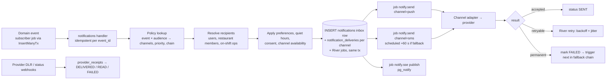
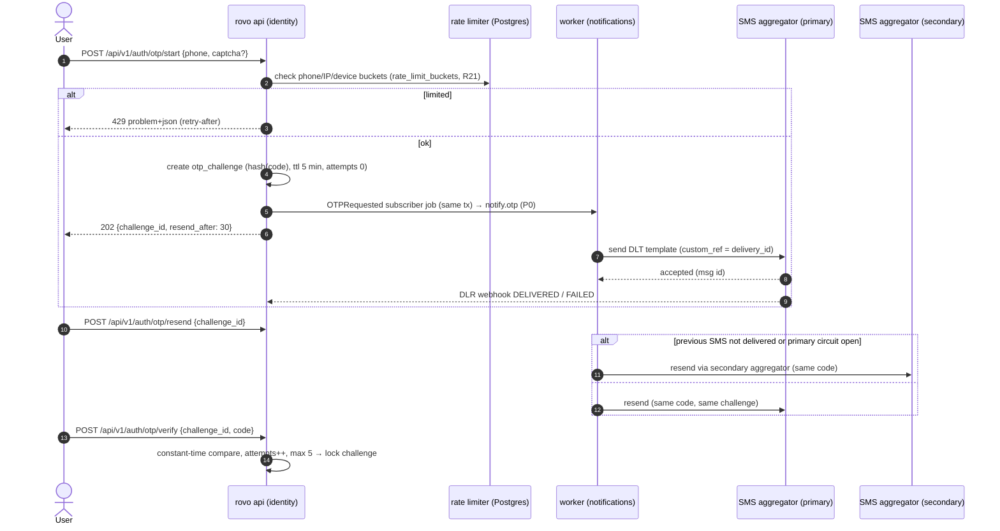
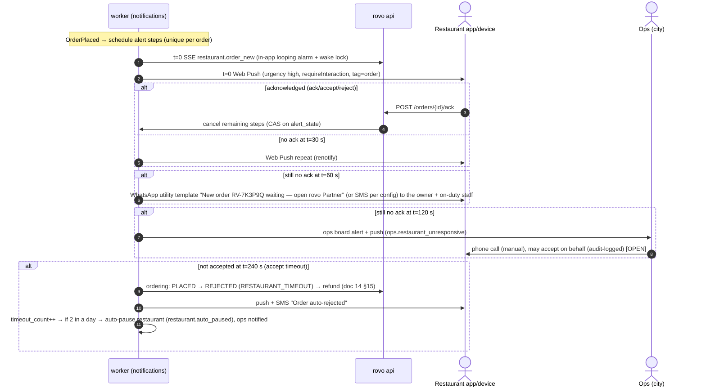

# 15 — Notification Architecture

| | |
|---|---|
| **Purpose** | How rovo turns domain events into messages for customers, restaurants, riders and admins across in-app (SSE + inbox), Web Push, SMS and email (WhatsApp is V1.1). Covers the notification matrix, the OTP delivery strategy and its costs, outbox-driven delivery with retries and dedupe, preferences and quiet hours, templates and localisation, delivery receipts, the restaurant new-order alert loop, and the provider abstraction. |
| **Owner** | Solution Architect |
| **Status** | Draft v1.1 — reconciled with review (31) and rulings R1–R48, 2026-10-04 (Phase 1 — planning only) |
| **Depends on** | `00-planning-baseline.md`, `08-system-architecture.md` (§3.2 notifications module, §6 real-time, §7.3 events), `09-architecture-decision-records.md` (ADR-006, ADR-008, ADR-018, ADR-025) |
| **Feeds** | `05/06/07` workflows (alert UX), `10-database-schema.md`, `11-api-specification.md` (inbox, push subscription, webhook endpoints), `12-auth-rbac.md` (OTP), `17/18` frontend & PWA (service worker push handling), `19-security-threat-model.md` (SMS pumping, DPDP), `24-observability-strategy.md`, `30-risks-assumptions-decisions.md` |

Tags: `[ASSUMPTION]`, `[OPEN]`, `[LEGAL]`. Prices were researched on **2026-10-04**. Telecom and Meta pricing changes frequently, so re-verify before contracting.

**Changes in v1.1 (2026-10-04)**
- Restaurant alert ladder per **R1/R43**: repeat every 30 s, owner SMS at 60 s, ops flag + manual call at 90 s, `CANCELLED`/`SYSTEM`/`RESTAURANT_UNRESPONSIVE` at 180 s with auto-pause; device heartbeat 3 min → auto-pause; automated voice call is **P1** (§0, §2, §4, §7). Timer values are owned by doc 13 (R48).
- **WhatsApp OTP and WhatsApp notifications cut to V1.1 (C2)**: V1 OTP = SMS primary + secondary SMS aggregator; partner fallbacks use SMS (§0, §1, §2, §5, §9, §10, §12). WhatsApp text kept as V1.1 reference.
- Pipeline per **R22/R42**: subscriber jobs inserted with `InsertManyTx`; no `event_log`/fan-out hop (§0, §3).
- WebOTP line for **four** app hosts (R14); OTP counters Postgres-backed (R21); egress IP allow-listing per R28 (§5). Webhook paths under `/api/v1` (R15). Ack endpoint path aligned with doc 11 (register row 64).
- Finance alert for a missed settlement run (**M11**) (§2.4).

---

## 0. Summary

- **Channels by purpose.**
  - **SSE** for live in-app updates.
  - **In-app inbox** as the durable record.
  - **Web Push** (free) for background alerts.
  - **SMS** (DLT-registered, paid) for OTP and critical fallbacks.
  - **Email** (low volume) for invoices, statements and admin.
  - *WhatsApp utility/authentication templates are deferred to V1.1 (scope cut C2).*
- **Delivery pipeline:** domain event (a `notifications` subscriber job inserted in the business transaction via `InsertManyTx`, R42) → `notifications` module policy → inbox row + per-channel delivery rows → River jobs (unique per delivery) → provider adapter → receipts. Retries with exponential backoff and jitter, fallback chains per priority, dedupe by `(event_id, recipient, template_key)`.
- **OTP:** **SMS** via a primary DLT aggregator (universal reach, WebOTP autofill on Android), with a **secondary SMS aggregator** as the automatic fallback. WhatsApp authentication is a V1.1 option (C2). Strict, Postgres-backed rate limits (R21) and SMS-pumping defences. SMS OTP ≈ ₹0.13–0.25 + GST via Indian aggregators.
- **Restaurant new-order alert ladder (R1, R43; doc 13 timers `T-ACC-*`):**
  - t=0: in-app alarm + push; repeats every 30 s.
  - t=60 s: SMS (+ push) to the owner.
  - t=90 s: ops board flag + sound; ops phones the restaurant (manual) and may accept on behalf (audited); customer told "taking a little longer".
  - t=180 s: order `CANCELLED` by `SYSTEM`, reason `RESTAURANT_UNRESPONSIVE`; prepaid fully refunded; outlet auto-paused 30 min (2 consecutive misses → paused until the owner resumes).
  - Automated voice-call escalation is **P1**, enabled if the pilot shows > 5% of orders reaching 90 s.
- **Estimated messaging cost at month 3** (≈ 250 orders/day): **≈ ₹1,500–3,000/month** plus a one-time ₹5,900 DLT registration (§9).

---

## 1. Channels

| Channel | Use for | Reach and limits | Cost | Provider (V1) |
|---|---|---|---|---|
| **SSE (in-app live)** | Status changes while the app is open: order status, inbox, offers | Foreground only (doc 08 §6) | ₹0 | own |
| **In-app inbox** | Durable list of notifications with read state. Badge via SSE `inbox.new`. | Any logged-in user | ₹0 | own (`notifications` table, 90-day retention) |
| **Web Push** (VAPID, RFC 8030/8291/8292) | New order (restaurant), new offer (rider), order progress (customer) while the app is in the background or closed | Android Chrome/Edge/Firefox: works in the browser, no install needed. **iOS/iPadOS: only for web apps added to the Home Screen, iOS 16.4+, and permission must be requested from a user gesture** (https://webkit.org/blog/13878/web-push-for-web-apps-on-ios-and-ipados/, accessed 2026-10-04). Desktop browsers: yes. Delivery is best-effort; the OS may delay it under battery saver. | ₹0 (browser vendors' push services) | own sender (`webpush-go` or equivalent) |
| **SMS** | OTP, critical fallbacks (restaurant hasn't responded, order cancelled/refund for customers without push) | Every Indian mobile. **TRAI DLT** rules: registered entity, header (sender ID) and content templates. Unregistered content is blocked. | ≈ ₹0.13–0.25/SMS + 18% GST (aggregators) | MSG91 or Gupshup (primary), second aggregator as fallback `[OPEN]` |
| **WhatsApp** (Business Platform, Cloud API) — **V1.1, not in V1 (C2)** | V1.1: OTP (authentication templates), partner utilities (payout done), customer refunds | Users must have WhatsApp (very high in India `[ASSUMPTION]`). Business verification, template approval, display-name approval required. | Per **delivered** template message (India): utility ≈ ₹0.115–0.145, authentication ≈ ₹0.115–0.145, marketing ≈ ₹0.86–1.09 | Meta **Cloud API direct** (no BSP markup) or a BSP if onboarding help is needed |
| **Email** | Invoices/receipts (if the customer gave an email), weekly statements, admin invites, security alerts, finance digests | Optional for customers | Low volume; free tiers or ~$0.10 per 1,000 | Cloud email service in production (e.g. Amazon SES) or Resend/Brevo; **Mailpit** locally |

**Not in V1:** WhatsApp (C2, V1.1), native app push (FCM/APNs SDK), automated voice calls (ops call restaurants manually; automated voice escalation is P1, R43), voice OTP (`[OPEN]` as a last-resort fallback), marketing campaigns (DPDP consent plus TRAI promotional rules; deferred).

---

## 2. Notification matrix

Priority levels:
- **P0** = time-critical, money or operations at stake. Escalation chain. Ignores quiet hours.
- **P1** = important status. Ignores quiet hours.
- **P2** = informational. Respects user channel preferences.
- **P3** = digest/low. Respects quiet hours; may be batched.

**V1.1 note (C2):** the WhatsApp column below describes the V1.1 design. In V1 every WhatsApp cell is inactive; where a partner fallback was "SMS or WhatsApp", V1 uses SMS.

Template keys are the same across channels and locales (`en`, `te`). Each channel has its own variant (`push.title`, `push.body`, `sms`, `wa`, `email.subject`, `email.html`).

### 2.1 Customer

| Event (trigger) | Template key | In-app/SSE | Push | SMS | WhatsApp | Email | Priority | Notes |
|---|---|---|---|---|---|---|---|---|
| `OTPRequested` (customer audience) | `auth.otp` | – | – | ✔ primary + secondary aggregator | V1.1 | – | P0 | §5 |
| `OrderPlaced` (COD) / `PaymentCaptured` → `PLACED` | `order.confirmed` | ✔ | ✔ | – | – | – | P1 | |
| `OrderPaymentFailed` / `PaymentExpired` | `payment.failed` | ✔ | ✔ | – | – | – | P1 | "No money taken; auto-refund if debited" |
| `OrderAccepted` | `order.accepted` | ✔ | ✔ | – | – | – | P2 | includes ETA |
| `OrderRejected` (restaurant decision) | `order.rejected` | ✔ | ✔ | ✔ if push not delivered in 60 s | – | – | P1 | refund info |
| `OrderCancelled` reason `RESTAURANT_UNRESPONSIVE` (R1, 180 s) | `order.cancelled_restaurant_unresponsive` | ✔ | ✔ | ✔ if push not delivered in 60 s | – | – | P1 | apology + refund info |
| Accept taking long (T-ACC-OPS, 90 s) | `order.accept_delayed` | ✔ | – | – | – | – | P2 | "Taking a little longer…" |
| `DeliveryAssigned` | `order.rider_assigned` | ✔ | ✔ | – | – | – | P2 | rider first name and masked call link (doc 19) |
| `OrderPickedUp` | `order.picked_up` | ✔ | ✔ | – | – | – | P2 | |
| `DeliveryAtDrop` | `order.rider_arriving` | ✔ | ✔ (urgency high) | – | – | – | P1 | + handover OTP if enabled |
| `OrderDelivered` | `order.delivered` | ✔ | ✔ | – | – | ✔ invoice PDF (if email) | P2 | |
| `OrderCancelled` (system/admin) | `order.cancelled` | ✔ | ✔ | ✔ | – | – | P1 | |
| `OrderUndeliverable` | `order.undeliverable` | ✔ | ✔ | ✔ | – | – | P1 | + COD strike notice if applicable |
| `RefundProcessed` | `refund.processed` | ✔ | ✔ | – | ✔ utility (opt-in) | ✔ (if email) | P2 | amount, ARN, timeline |
| Rating reminder (+60 min after delivered, once) | `rating.reminder` | ✔ | ✔ | – | – | – | P3 | quiet hours apply |
| `TicketResolved` / agent reply | `support.reply` | ✔ | ✔ | – | – | – | P2 | |
| COD disabled after strikes | `account.cod_disabled` | ✔ | ✔ | ✔ | – | – | P2 | appeal link |
| Account deletion completed (DPDP) | `account.deleted` | – | – | ✔ | – | ✔ | P2 | `[LEGAL]` wording |

### 2.2 Restaurant (owner/staff of the outlet)

| Event | Template key | In-app/SSE | Push | SMS | WhatsApp | Email | Priority | Notes |
|---|---|---|---|---|---|---|---|---|
| `OTPRequested` (partner) | `auth.otp` | – | – | ✔ | V1.1 | – | P0 | |
| `OrderPlaced` | `restaurant.order_new` | ✔ **alarm loop** | ✔ urgency high, repeat every 30 s | ✔ owner at t+60 s | V1.1 | – | **P0** | §7 alert ladder (R1) |
| Alert escalated to ops | `ops.restaurant_unresponsive` | ops board | ops push | – | – | – | P0 | §7 |
| `OrderCancelled` by customer/admin | `restaurant.order_cancelled` | ✔ | ✔ | – | – | – | P1 | stop prep |
| `DeliveryAssigned` | `restaurant.rider_assigned` | ✔ | – | – | – | – | P2 | rider name, ETA to restaurant |
| `DeliveryAtRestaurant` | `restaurant.rider_arrived` | ✔ | ✔ | – | – | – | P1 | |
| Auto-paused (missed order: 30 min, or until resume after 2 consecutive; device offline 3 min) (R1) | `restaurant.auto_paused` | ✔ | ✔ | ✔ | V1.1 | – | P1 | how to reopen |
| `SettlementStatementReady` | `restaurant.statement_ready` | ✔ | ✔ | – | – | ✔ PDF | P3 | |
| `PayoutRecorded` | `restaurant.payout_paid` | ✔ | ✔ | ✔ | V1.1 | ✔ | P2 | amount + UTR |
| Onboarding/KYC status change | `restaurant.onboarding_status` | ✔ | – | ✔ | – | ✔ | P2 | |
| `LowRatingFlagged` | `restaurant.low_rating` | ✔ | – | – | – | – | P3 | daily digest |

### 2.3 Rider

| Event | Template key | In-app/SSE | Push | SMS | WhatsApp | Email | Priority | Notes |
|---|---|---|---|---|---|---|---|---|
| `OTPRequested` (partner) | `auth.otp` | – | – | ✔ | V1.1 | – | P0 | |
| `DeliveryOffered` | `rider.offer_new` | ✔ sound + vibration | ✔ urgency high, **TTL 45 s** (the only path to tier-2 stale riders, R34) | – | – | – | **P0** | no SMS: too slow, too costly |
| Offer expired/revoked (`EXPIRED`/`REVOKED`, R16) | `rider.offer_expired` | ✔ | – | – | – | – | P2 | silent update |
| Order cancelled while assigned | `rider.delivery_cancelled` | ✔ | ✔ | – | – | – | P1 | return-to-restaurant instructions |
| `RiderCashLimitReached` | `rider.cash_limit` | ✔ | ✔ | – | – | – | P1 | deposit instructions |
| Deposit overdue (reminder / block; thresholds per doc 13/14, proposal 48 h / 72 h) | `rider.deposit_overdue` | ✔ | ✔ | ✔ at block | – | – | P1 | |
| Auto-offline after missed offers | `rider.auto_offline` | ✔ | ✔ | – | – | – | P2 | |
| `PayoutRecorded` | `rider.payout_paid` | ✔ | ✔ | ✔ | V1.1 | – | P2 | |
| Onboarding approved/rejected | `rider.onboarding_status` | ✔ | – | ✔ | – | – | P2 | |

### 2.4 Admin / ops / finance

| Event | Template key | Channel | Priority |
|---|---|---|---|
| `DispatchExhausted` | `ops.dispatch_exhausted` | ops board SSE + push to on-shift ops (city-scoped) | P0 |
| Restaurant unresponsive (t+90 s, R1) | `ops.restaurant_unresponsive` | ops board (`ops.alert` `ACCEPT_SLA`) + push. **Ops calls the restaurant by phone** (staffed desk during service hours, R43). | P0 |
| Restaurant device offline (3 min, auto-paused) | `ops.device_offline` | ops board (`DEVICE_OFFLINE`) | P1 |
| Order stuck (no transition for X min in any state) | `ops.order_stuck` | ops board | P1 |
| PA circuit open / provider outage | `ops.provider_degraded` | ops board + push; the alerting pipeline (doc 24) also pages | P0 |
| `ReconExceptionRaised` | `finance.recon_exception` | in-app + daily email digest | P3 |
| Payout batch awaiting approval (maker-checker, R31) | `finance.batch_pending` | in-app + email | P2 |
| No settlement run for last week by Mon 09:00 IST (M11) | `finance.settlement_missed` | email + push to finance; on-call paged via doc 24 | P0 |
| Admin login from new device / TOTP reset | `security.admin_login` | email | P1 |
| Admin invite | `admin.invite` | email | P2 |

The canonical matrix lives as **data** in `notification_policies` (event type × audience → channels, priority, delay, fallback chain), seeded from a YAML file in the repo. That makes it reviewable in PRs and adjustable per city without a deploy.

---

## 3. Delivery pipeline



### 3.1 Data (indicative; doc 10 is authoritative)

- `notifications(id, user_id, audience, template_key, locale, priority, payload JSONB, dedupe_key UNIQUE, created_at, read_at, expires_at)`: the inbox. `dedupe_key = hash(event_id, recipient, template_key)`.
- `notification_deliveries(id, notification_id, channel, status [PENDING|SENT|DELIVERED|READ|FAILED|SKIPPED|CANCELLED], attempt, provider, provider_message_id, cost_micro_inr, error_code, scheduled_at, sent_at, delivered_at)`. Unique `(notification_id, channel)`.
- `notification_templates(template_key, channel, locale, provider_template_id, dlt_template_id, variables[], status, version)`. SMS and WhatsApp rows must mirror provider-approved templates exactly.
- `notification_preferences(user_id, category, channel, enabled)`, `quiet_hours(user_id, start_local, end_local)`.
- `push_subscriptions(id, user_id, app [customer|restaurant|rider|admin], endpoint UNIQUE, p256dh, auth, user_agent, created_at, last_success_at, failure_count)`.
- `provider_receipts(provider, provider_message_id, status, raw, received_at)`. *(Doc 10 records receipt status on `notification_deliveries` instead; doc 10 is authoritative. `notification_policies`, `notification_preferences` and `quiet_hours` must be added to doc 10 or mapped to `app_config` `[OPEN → Backend]`.)*

### 3.2 Retries, backoff, dedupe and ordering

| Priority | Max attempts per channel | Backoff | Give-up window | Fallback when failed / not delivered |
|---|---|---|---|---|
| P0 | 5 | 2 s, 4 s, 8 s, 16 s (+ jitter) | 2 min | next channel immediately (§7 for restaurant, §5 for OTP) |
| P1 | 5 | 10 s → 5 min exponential | 30 min | SMS for customers whose push isn't delivered within 60 s (only for keys marked `sms_fallback`) |
| P2 | 3 | 1 min → 15 min | 6 h | none |
| P3 | 3 | 15 min → 2 h | 24 h | none |

- **Retryable:** network errors, 5xx, 429 (respect `Retry-After`).
- **Permanent:** invalid number, unsubscribed (Web Push 404/410 → delete the subscription), template rejected, user blocked the business on WhatsApp.
- **Dedupe:** the `dedupe_key` unique constraint stops duplicate inbox rows. River unique jobs on `(delivery_id)` stop duplicate sends. Providers that accept a client reference get our `delivery_id` (SMS `custom_ref`, WhatsApp `biz_opaque_callback_data`), so receipts map back.
- **Staleness guard:** before sending, the job re-checks relevance. For example, skip `restaurant.order_new` escalation if the order is no longer `PLACED`, and skip `rider.offer_new` if the offer has expired. This avoids sending outdated alerts after queue delays.
- **Ordering:** not guaranteed across channels. Payloads carry the entity version, and clients ignore older versions.

### 3.3 Preferences, consent and quiet hours

- **Categories:** `transactional_order` (cannot be fully disabled; the user can turn off push for P2 only, while in-app is always on), `account_security` (always on), `payouts` (partners; always on), `support`, `ratings_reminders` (can disable), `marketing` (**off by default, explicit opt-in**, DPDP consent record; not used in V1) `[LEGAL]`.
- **Quiet hours:** default 22:00–08:00 city-local for P3 only. P0–P2 are tied to an active order or payout and are sent regardless.
- **Channel availability:** push is used only if an active subscription exists for that app. WhatsApp is V1.1 (C2). Email only if verified.
- **DPDP:** phone numbers are used for notifications under the "legitimate use / contract performance" purpose. Marketing requires consent. Every message content is minimal: no full addresses in SMS and WhatsApp, and masked order details on lock screens (push uses the order code, not item names, for restaurant/customer privacy) `[OPEN: UX]`.

---

## 4. Web Push design

- **VAPID** key pair per environment. The private key lives in the secrets manager. The public key goes into the app runtime config (doc 17 §15.2). The `sub` claim is `mailto:ops@<domain>`.
- **Subscription:** each app (customer, restaurant, rider, admin) has its own origin, so it gets its own subscription (doc 17). The app requests permission **only after a user gesture with explained value** ("Get alerts for new orders"). Restaurants and riders get permission during onboarding. Customers are asked after the first order is placed, not on first visit.
- **iOS:** requires the PWA on the Home Screen, iOS/iPadOS 16.4+. The app shows "Add to Home Screen" guidance before offering push on iOS (doc 18). For riders and restaurants on iPhone, in-app SSE plus the SMS fallback covers the gaps.
- **Headers:** `TTL` (offers 45 s; restaurant new order 180 s, the R1 accept window; customer status 1 h; digests 24 h), `Urgency: high` for P0/P1, `Topic` header to collapse superseded messages (e.g. `order-{id}-status`).
- **Payload:** ≤ 2 KB JSON `{type, title, body, url, entity_id, version, tag, require_interaction}`, encrypted per RFC 8291 by the library. The service worker shows a notification with `tag` (replaces the previous one for the same order), `renotify: true` for P0, and `requireInteraction: true` for restaurant new orders (supported on desktop/Android Chrome).
- **Sound:** web notifications can't play custom looping audio when the app is closed. Hence the restaurant alarm loop runs **in-app** (foreground tab, Screen Wake Lock, user-unlocked audio on "Start shift"), with push plus owner SMS and the ops call as the backstop (§7, doc 05/18).
- **Cleanup:** 404/410 → delete the subscription. Three consecutive failures → mark stale. A periodic job prunes subscriptions unused for 60 days.

---

## 5. OTP delivery strategy

### 5.1 Cost comparison (per OTP delivered, India, researched 2026-10-04)

| Channel / provider | Approx. price | Notes | Source |
|---|---|---|---|
| SMS via MSG91 | ≈ ₹0.15 per OTP segment (≈ ₹0.13 at volume) | DLT routes; GST extra | https://www.messagecentral.com/blog/sms-otp-pricing-india (third-party comparison) |
| SMS via Gupshup | ≈ ₹0.17 per OTP (negotiable above 1 lakh/month) | GST 18% extra | https://codingclave.com/blog/gupshup-sms-pricing-india-2026 (third-party) |
| SMS via Fast2SMS | ₹0.25 → ₹0.11 per SMS by wallet top-up tier (₹0.17 at ₹14k–60k top-up) | | https://fast2sms.com/Bulk-SMS-Price |
| SMS via Twilio (international route) | $0.0832 per SMS (≈ ₹7, unsuitable) | Higher cost. DLT still needed. | https://www.twilio.com/sms/pricing/in |
| **WhatsApp authentication template** (Meta Cloud API, India) — *V1.1 reference* | ≈ **₹0.115–0.145 per delivered** message (rate cards cited for 2026). Volume tiers can reduce it up to ~30%. Charged only on delivery. | Requires Meta business verification. The OTP template has a copy-code button. Taxes extra. | https://developers.facebook.com/docs/whatsapp/pricing ; https://www.quickreply.ai/whatsapp-automation/whatsapp-business-api-pricing ; https://m.aisensy.com/blog/whatsapp-conversation-based-pricing-model-february-2022 (accessed 2026-10-04; INR rate card itself not directly fetched, so **partially verified**) |
| Voice OTP | ≈ ₹0.3–0.6 per call `[unverified]` | Last resort | — |

Notes:
- Meta moved to **per-message pricing on 2025-07-01**. Utility templates sent inside an open customer-service window are free. India billing localisation (INR) started on 2026-01-01, with WABAs to migrate to INR by 2026-12-31 (https://developers.facebook.com/docs/whatsapp/pricing). One third-party source claims Meta will charge for service messages from 2026-10-01. That is **unverified** and irrelevant to us, because we don't rely on free service windows.
- **SMS Unicode (Telugu) costs ~2×:** a GSM-7 segment holds 160 characters, a Unicode segment 70. **OTP SMS stays in English** (plus the WebOTP domain line). Telugu SMS is used only where essential.
- **DLT:** principal entity registration costs ₹5,900 at the first operator; other operators need only header/KYC registration (https://fast2sms.com/DLT-Registration, accessed 2026-10-04). Template approval takes 1–7 working days. Some aggregators add a per-SMS DLT scrubbing fee `[unverified, ask in quotes]`.

**Conclusion:** per-OTP cost is **roughly equal** (₹0.12–0.20 before GST) between SMS via an Indian aggregator and WhatsApp authentication. Volume is small, so the choice is driven by **UX, deliverability and onboarding effort**. WhatsApp needs Meta business verification, template approval and a separate integration, so it is deferred to V1.1 (C2, RV-079).

### 5.2 Decision (amended 2026-10-04 per C2)

1. **Primary: SMS** via an Indian DLT aggregator (MSG91 or Gupshup, chosen on quote and DLR quality).
   - It works for every number, including phones without WhatsApp.
   - **WebOTP API autofill on Android Chrome**: the SMS ends with `@<app-host> #123456` (doc 12/17). There are **four** app hosts (R14), so the template needs a host variable in that position or four templates; settle with the aggregator in week 1, because DLT template approval takes 1–7 days (RV-017) `[OPEN: DLT allows a variable there?]`.
2. **Automatic fallback:** if no SMS DLR=DELIVERED arrives within **20 s**, or the provider returns an error or its circuit is open, the **resend** goes via the **secondary SMS aggregator** (same code, same challenge).
3. **WhatsApp OTP is V1.1** (C2). The `otp.primary = sms|whatsapp` config key is kept, but only `sms` is valid in V1.
4. **Admin login does not use OTP** (email + password + mandatory TOTP; doc 12, R37), so an OTP outage never locks out operations.



### 5.3 Cost and abuse controls (SMS pumping / OTP bombing)

| Control | Default |
|---|---|
| *Values below are illustrative; doc 12 owns OTP limits (minor drift with doc 11/12 noted in 31 §14).* | |
| Accept only Indian mobile numbers (`+91[6-9]\d{9}`) in V1 | Removes international revenue-share fraud |
| Per phone | 1 send/30 s, 3 sends/10 min, 10/day |
| Per IP (/24 for IPv4, /64 for IPv6) | 20 sends/hour |
| Per device fingerprint (app-generated install id) | 10/day |
| Global circuit | If OTP sends in a 5-min window exceed 5× the trailing p95, require CAPTCHA for all and page ops |
| CAPTCHA | Invisible challenge **only at risk** (soft IP limit exceeded, new device plus high velocity, or global strict mode), behind the `BotChallenge` interface with a fake adapter for local/CI (RV-020, RV-034; doc 12 owns it) |
| OTP | 6 digits, 5-min TTL, 5 verify attempts, the same code reused for resends within TTL (avoids a code race), hashed at rest |
| Conversion monitor | `otp_verified / otp_sent` per hour. Alert if < 60% (pumping or deliverability issue). |
| Budget alarm | Daily messaging spend > ₹X → alert. > ₹Y → force CAPTCHA for all OTP requests (global strict mode) `[OPEN: thresholds]` |
| Provider-side | Enable aggregator fraud protections where available. Restrict API keys by source IP once a NAT Gateway exists (before Gate B, or earlier if the aggregator requires IP allow-listing, R28). |

---

## 6. SMS specifics (TRAI DLT)

- **Registration:** register rovo (the legal entity) as a **Principal Entity** on one operator's DLT portal (Jio TrueConnect, Airtel, Vi Vilpower, BSNL). The PE ID then works across operators. Register **headers** (sender IDs, 6 characters, e.g. `ROVOIN` `[ASSUMPTION: availability]`) and **content templates** with variables `{#var#}`.
- **Categories:** OTP and service messages are registered as *Service Implicit* (transactional-like, delivered to DND numbers). Promotional content is not used in V1. The exact category mapping is to be confirmed with the aggregator `[OPEN]`.
- **Template discipline:** the message must match the registered template exactly, or the operator scrubs it. URLs and callback numbers in SMS must be **whitelisted** under TRAI rules `[verify current requirement]`, so keep URLs out of SMS where possible and use the app/push instead.
- **Languages:** English templates for OTP. Telugu templates (Unicode) only for a few critical customer messages (order cancelled/refund) `[OPEN: Product]`. Each language is a separate DLT template.
- **Receipts:** aggregator DLR webhooks (signed or with a shared secret depending on the provider) go to `api.<domain>/api/v1/webhooks/sms/{provider}` (R15) and update the delivery status.
- **Template conformance:** a staging check per release diffs the repo's template mirror against the provider/DLT export (RV-065).
- **Cost line items:** ₹5,900 one-time DLT registration (first operator). Per-SMS price + GST. Possible DLT scrubbing fee. Prepaid wallet top-ups with low-balance alerts.

---

## 7. Restaurant new-order alert loop (with escalation)

Goal: no order sits unseen. The loop is **server-driven** (River scheduled jobs), so it works even if the restaurant's browser is closed. It **stops immediately on acknowledgement** (`POST /api/v1/restaurant/orders/{id}/ack`, sent automatically when the order card is displayed in the foreground app, or on accept/reject).



- **Timings** are configurable per city: `alert.repeat_push_s=30`, `alert.sms_s=60`, `alert.ops_s=120`, `ordering.accept_timeout_s=240` `[ASSUMPTION; Product/UX to confirm in doc 05]`.
- **Recipients:** the owner plus members with an active "on duty" toggle. Messages are deduped per phone number.
- **In-app alarm loop** (foreground, doc 05/18): repeating audio until ack, unlocked by a "Start shift" tap. Screen Wake Lock. A visible flashing banner. A heartbeat check warns "Alerts paused — tap to resume" if audio is blocked.
- **Cost:** with ~250 orders/day and an assumed 10% reaching the t+60 s step, that is ≈ 750 WhatsApp/SMS per month ≈ ₹100–150/month.
- **Restaurant device health:** if no SSE connection from a restaurant that is "open" for > 5 min during operating hours, warn the owner (push) and ops. Optionally auto-pause after 15 min `[OPEN: ops policy]`.

**Rider offers** use SSE + push (TTL 45 s, urgency high) with in-app sound. There is **no** SMS/WhatsApp step: the offer expires faster than those channels are useful. Dispatch moves on to the next rider (doc 08 §5.4).

---

## 8. Templating and localisation

- **Source of truth:** `backend/internal/modules/notifications/templates/<channel>/<template_key>.<locale>.tmpl` (push, in-app, email; Go `text/template` / `html/template`, `missingkey=error`). SMS/WhatsApp **text lives with the provider registration**. The repo holds a mirror (`templates/sms/*.yaml`, `templates/whatsapp/*.yaml`) with `dlt_template_id`/WhatsApp template name, language code and the ordered variable list. CI checks that every template key in `notification_policies` has variants for each channel and locale (falling back to `en` with a warning).
- **Locale resolution:** user preference → `Accept-Language` at the last session → city default (`te` or `en` `[OPEN: default for Mahabubnagar]`).
- **Formatting:** amounts are formatted server-side for messages using `en-IN`/`te-IN` rules (₹, lakh grouping), and dates and times in the city timezone. The server uses a small Go formatter with tests mirroring `Intl` output.
- **Constraints per channel:** push title ≤ 50 characters and body ≤ 120 (truncate safely at grapheme boundaries for Telugu). SMS ≤ 1 segment where possible (GSM-7). WhatsApp utility templates must be non-promotional, or Meta re-categorises them as marketing (higher price).
- **Variables are data**, never markup. HTML email escapes everything. No user-generated content in SMS/WhatsApp except restaurant names (sanitised, length-limited).
- **Template versioning:** a template change for SMS/WhatsApp requires re-approval. Ship new keys as `.v2` alongside the old ones, switch via config after approval, then retire the old ones.

---

## 9. Monthly cost model (messaging only)

`[ASSUMPTION]` inputs for month 3 (doc 01 M-50: ≈ 250 orders/day; ≈ 7,500 orders/month): 4,000 customer logins with OTP/month (30-day sessions), 300 partner logins, 10% of orders hitting the restaurant SMS/WA step, 5% of customer orders needing an SMS fallback, 300 payout notifications via WhatsApp utility, emails 2,000/month.

| Item | Volume/month | Unit (≈) | Cost/month |
|---|---|---|---|
| OTP (SMS primary, 1.2 sends per login) | ~5,200 | ₹0.17 + 18% GST | ≈ ₹1,050 |
| Restaurant escalation (WA/SMS) | ~750 | ₹0.15 | ≈ ₹115 |
| Customer SMS fallbacks | ~375 | ₹0.20 | ≈ ₹75 |
| WhatsApp utility (payouts, refunds) | ~500 | ₹0.145 | ≈ ₹75 |
| Email | ~2,000 | free tier or SES ~$0.10/1k | ≈ ₹0–20 |
| Web Push | ~150,000 | ₹0 | ₹0 |
| **Total** | | | **≈ ₹1,300–1,500 (budget ₹3,000 with headroom)** |
| One-time | DLT PE registration | | ₹5,900 |

Email options (accessed 2026-10-04): **Resend** free 3,000/month with a 100/day cap (https://resend.com/blog/new-free-tier.md ; https://automationatlas.io/answers/resend-free-tier-explained-2026/). **Brevo** free 300/day (https://www.brevo.com/features/email-marketing/newsletter-software ; https://dreamlit.ai/blog/brevo-review). **Amazon SES** a-la-carte $0.10 per 1,000, with a 3,000/month free allowance for the first 12 months for new customers, and bundled plans introduced in 2026 (https://dev.to/mr_manushukla/amazon-ses-pricing-plans-in-2026-essentials-vs-pro-vs-enterprise-and-when-a-la-carte-still-wins-1ohg ; https://www.costbench.com/software/email-api/amazon-ses/free-plan/; third-party, verify on the AWS pricing page). **Decision:** use the cloud's email service in production if the chosen cloud is AWS (SES), otherwise Resend. Weekly restaurant statements sent as one email each can hit Resend's 100/day cap at ~100 restaurants, so stagger them or use a paid tier. Mailpit locally.

---

## 10. Provider abstraction (Go sketch)

```go
// package notifications (module public API) — adapters in internal/adapters/notify/<vendor> (ADR-025)

type Channel string // "push" | "sms" | "whatsapp" | "email" | "inapp"

type Message struct {
    DeliveryID   uuid.UUID          // idempotency + receipt correlation
    Recipient    Recipient          // phone E.164 / email / push subscription / user id
    TemplateKey  string
    Locale       string             // "en" | "te"
    Vars         map[string]string  // ordered per template definition for SMS/WA
    Priority     Priority
    TTL          time.Duration
    CollapseKey  string             // push Topic / tag
}

type SendResult struct {
    ProviderMessageID string
    Accepted          bool
    Retryable         bool
    PermanentError    *ProviderError  // e.g. InvalidRecipient, Unsubscribed, TemplateRejected
    CostMicroINR      int64           // if the provider returns it, else estimated from the rate table
}

type Sender interface {
    Channel() Channel
    Provider() string
    Send(ctx context.Context, m Message) (SendResult, error)
}

type ReceiptParser interface {
    VerifyWebhook(h http.Header, raw []byte) error   // e.g. WhatsApp X-Hub-Signature-256 HMAC with app secret
    Parse(h http.Header, raw []byte) ([]Receipt, error)
}

// Registry chooses senders by channel + per-city config (primary/secondary), with circuit breakers per provider.
type Registry interface {
    For(ctx context.Context, cityID uuid.UUID, ch Channel) ([]Sender, error) // ordered: primary, secondary
}
```

Adapters planned:
- `push/webpush` (VAPID).
- `sms/msg91`, `sms/gupshup`, `sms/fake` (logs + dev endpoint `GET /dev/otp/{phone}` only in `env=local|ci`).
- `whatsapp/metacloud`, `whatsapp/fake`.
- `email/smtp` (works with SES SMTP, Mailpit, Brevo), `email/resend`.

Each adapter has a contract test with recorded fixtures. A **circuit breaker per provider** (error rate > 30% over 2 min → open → secondary provider) emits `ops.provider_degraded`.

---

## 11. Delivery receipts and observability

| Channel | Receipt source | Statuses stored |
|---|---|---|
| Web Push | HTTP response from the push service (201 accepted). No delivery receipt. Optional client "displayed" ping from the service worker (`POST /api/v1/notifications/{id}/displayed`, sampled) | SENT, FAILED, (DISPLAYED) |
| SMS | Aggregator DLR webhook | SENT, DELIVERED, FAILED (+ operator error code) |
| WhatsApp | Cloud API status webhooks (`sent`, `delivered`, `read`, `failed`). Signature `X-Hub-Signature-256` = HMAC-SHA256(app secret, raw body). | SENT, DELIVERED, READ, FAILED |
| Email | Provider webhooks (delivered, bounce, complaint) → suppression list | SENT, DELIVERED, BOUNCED, COMPLAINED |
| In-app | `read_at` when opened | READ |

Metrics (doc 24): sends by channel/provider/template/status, time from event to send, DLR latency p50/p95, OTP conversion rate, restaurant alert ack time p50/p95, escalations per day, spend per day (from `cost_micro_inr`), and push subscription churn. Alerts: OTP conversion < 60%, SMS DLR failure rate > 10%, provider circuit open, alert-loop escalations > X/hour.

---

## 12. Failure modes

| Failure | Behaviour |
|---|---|
| Worker down | Notifications queue durably and are sent on recovery. The staleness guard drops outdated ones (expired offers, already-accepted orders). SSE updates from API-side transitions still flow. |
| Primary SMS provider down | Circuit → secondary aggregator. OTP resend offers WhatsApp. |
| WhatsApp template paused/rejected by Meta (quality rating) | Fall back to SMS for that template. Alert ops to fix the template. |
| Push service outage (a browser vendor) | SSE in-app still works. P0 restaurant chain continues to SMS/WA. |
| User has no push and no WhatsApp | SMS for P0/P1 where the policy allows. Otherwise in-app only. |
| Notification storm (bug loops) | Per-recipient rate cap (e.g. ≤ 20 push/10 min, ≤ 5 SMS/hour excluding OTP) plus the global spend alarm. Breach → drop and alert. |
| Wrong-locale template missing | Fall back to `en` and log a warning metric |

---

## 13. Open questions

| # | Question | Owner |
|---|---|---|
| N-1 | SMS aggregator choice (MSG91 vs Gupshup vs other) after written quotes incl. DLT scrubbing fees and DLR quality; secondary provider | Lead + DevOps |
| N-2 | Default locale for Mahabubnagar customers (`te` vs `en`); which customer SMS need Telugu variants | Product/UX |
| N-3 | WhatsApp: Cloud API direct vs BSP; business verification timeline; customer opt-in UX | Product + Legal |
| N-4 | Exact alert-loop timings and whether ops may accept on a restaurant's behalf | Product/Ops (doc 05/07) |
| N-5 | CAPTCHA provider for OTP abuse (Turnstile vs cloud WAF bot control) | Security (doc 12/19) |
| N-6 | WebOTP origin-bound line per app host within DLT template constraints | Security + Frontend |
| N-7 | Voice OTP as last-resort fallback: needed? | Product |
| N-8 | Content of lock-screen notifications (privacy) | UX + Security |

---

## Sources (accessed 2026-10-04)

- WebKit, Web Push for Web Apps on iOS and iPadOS (iOS 16.4, Home Screen requirement): https://webkit.org/blog/13878/web-push-for-web-apps-on-ios-and-ipados/
- Meta WhatsApp Business Platform pricing (per-message since 2025-07-01, INR billing 2026): https://developers.facebook.com/docs/whatsapp/pricing ; https://whatsappbusiness.com/products/platform-pricing/
- India WhatsApp per-message rates (third-party summaries): https://www.quickreply.ai/whatsapp-automation/whatsapp-business-api-pricing ; https://m.aisensy.com/blog/whatsapp-conversation-based-pricing-model-february-2022 ; https://www.robylon.ai/blog/whatsapp-business-api-pricing-india
- SMS OTP pricing comparison India: https://www.messagecentral.com/blog/sms-otp-pricing-india
- Gupshup SMS pricing 2026 (third-party): https://codingclave.com/blog/gupshup-sms-pricing-india-2026
- Fast2SMS pricing and DLT: https://fast2sms.com/Bulk-SMS-Price ; https://fast2sms.com/DLT-Registration
- Twilio SMS India: https://www.twilio.com/sms/pricing/in
- MSG91 DLT help: https://msg91.com/help/all-service-deductions-
- Resend free tier: https://resend.com/blog/new-free-tier.md ; https://automationatlas.io/answers/resend-free-tier-explained-2026/
- Brevo free plan: https://dreamlit.ai/blog/brevo-review
- Amazon SES pricing 2026 (third-party): https://dev.to/mr_manushukla/amazon-ses-pricing-plans-in-2026-essentials-vs-pro-vs-enterprise-and-when-a-la-carte-still-wins-1ohg ; https://www.costbench.com/software/email-api/amazon-ses/free-plan/
