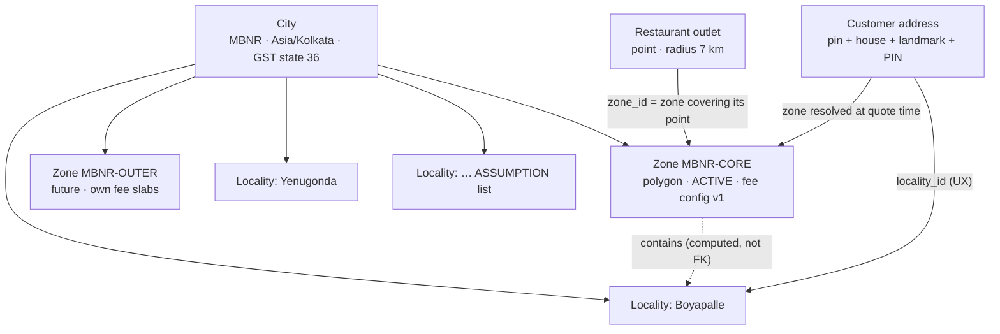

# 16 — Delivery Zone & Geography Architecture

| | |
|---|---|
| **Purpose** | Defines rovo's geography model (city → zones → localities). Covers the serviceability algorithm, distance and ETA models, delivery fee and rider pay computation, the **commercial (fee/commission) defaults this doc owns (R48)**, efficient restaurant discovery and rider candidate search, zone-level operational controls, the admin zone-drawing tooling, the multi-city expansion path, and Mahabubnagar test fixtures. |
| **Owner** | Backend Architect |
| **Status** | Draft v1.1 — reconciled with review (31) and rulings R1–R48, 2026-10-04 |
| **Depends on** | 00 baseline §3 (geo conventions, road factor 1.3), §5 (fees, rider pay), §8 R18/R19, §9 R30/R34/R48; 08 system architecture (`geo` module, caching); 10 database schema (`cities`, `zones`, `localities`, `restaurants`, `rider_availability`, `fee_configs`); 13 state machines (dispatch timing and **all timer/threshold values**, ETA updates); 17/18 frontend (MapLibre pin-drop, admin map); P13 maps |
| **Consumed by** | 11 API (serviceability, discovery, quote, admin zones), 13 (dispatch), 20 testing (fixtures), 07 admin workflow |

**Changes in v1.1**
- **R18 / RV-084 (register rows 36–38):** the serviceability radius is checked on **straight-line** distance (default 7,000 m, `fee_configs.max_serviceable_radius_m`, renamed from `max_serviceable_distance_m`). Fee slabs apply to **road-adjusted** distance, extend to 10 km (8–10 km ₹60) and are **`[lo, hi)`** (lower bound inclusive). Golden fixtures in §4.2/§10.2 regenerated (R2→C1 is now serviceable at ₹50; 2,000 m road → ₹30). New property: every serviceable point has exactly one slab (§6.1, §10.3).
- **R30 / C1 (RV-078):** manual surge removed from V1 (fee, rider bonus, rain speed factor, endpoints). Bad weather and rider shortage are handled by zone pause and a manual rider peak bonus posted as a ledger adjustment (§6.2). Surge is V1.1.
- **R34 / RV-055 (row 51):** rider candidate search has two tiers: fresh location ≤ 3 min, and stale ≤ 15 min reached by push + SSE (§7.2). The values are owned by doc 13 §5.1.
- **R19 / RV-005 (row 40):** no SQL `now()` in business queries; the injected app clock is passed as `:now`.
- **C15 / C20:** zone GeoJSON import/export, the impact dry-run analytics, the drop heat map and the `geo/live` endpoint are V1.1 (§8).
- **R48:** §6.5 is the single source for fee, commission and rider-pay defaults. Other docs reference these keys.

---

## 0. Decision summary

| ID | Decision |
|---|---|
| GEO-D01 | **Zones are planar polygons** `geometry(MultiPolygon, 4326)`, drawn by ops on a Web-Mercator map. **Points are `geography(Point, 4326)`.** Point-in-zone uses `ST_Covers(boundary, point::geometry)`, so a point exactly on the boundary is inside. |
| GEO-D02 | **Serviceability** = the customer pin is in an `ACTIVE`, un-paused zone of a `LIVE` city **AND** the restaurant is `ACTIVE`, in the same city, and its own zone is un-paused **AND** the **straight-line** distance `haversine(restaurant, customer) ≤ min(restaurant.max_delivery_radius_m, fee_config.max_serviceable_radius_m)` (both straight-line metres; default 7,000 m, R18). The road-adjusted distance (`× road_factor`) is used **only** for the fee slab, rider pay and ETA. Cross-zone delivery inside a city **is allowed**. Zones gate *where we deliver* and set *pricing*; they do not partition restaurants. |
| GEO-D03 | **Canonical distance is computed in Go** (haversine on a sphere with R = 6,371,008.8 m) × `road_factor` (default 1.3, per zone config). PostGIS is used for **indexed candidate filtering** with a 2% safety margin. The final decision and the price always use the Go value, so quote, order and pay are deterministic and unit-testable. |
| GEO-D04 | **ETA V1** = prep + pickup buffer + road distance ÷ speed (by time-of-day band) + handover, shown as a 10-minute range. All parameters are per city/zone config. It is calibrated from real timestamps after launch. |
| GEO-D05 | **Delivery fee** = the distance slab (per zone `fee_configs`) that contains the **road-adjusted** distance, with `[lo, hi)` bounds, minus the free-delivery threshold if one applies. **No surge in V1** (R30, C1): no surcharge of any kind. Bad weather or rider shortage → zone pause and/or a manual rider peak bonus posted as a ledger adjustment (§6.2). |
| GEO-D06 | **Start Mahabubnagar with ONE zone** (`MBNR-CORE`) drawn around the dense urban area. Add an outer-ring zone (higher fee slab, or paused at night) only when data shows it is needed. |
| GEO-D07 | **Admin tooling:** MapLibre GL JS + a draw library. The polygon is sent as GeoJSON geometry (RFC 7946) in the zone create/update body. Server-side validation, versioning and audit, plus a **blocking check** for active restaurants that would fall outside every zone. Bulk GeoJSON import/export, dry-run impact analytics and heat maps are **V1.1** (C15). |
| GEO-D08 | **No paid geocoding or routing in V1** (P13). Upgrade path: a self-hosted OSRM/Valhalla behind a `RoutingProvider` interface, used first for calibration and then for pricing if it is worth it. |
| GEO-D09 | **Parameter ownership (R48):** this doc owns fee, commission and rider-pay defaults (§6.5). Timers and thresholds (offer TTL, staleness tiers, radius steps) are owned by 13 §5.1; seeds and `app_config` mechanics by 10 §15. Business queries take `:now` from the injected app clock (R19). |

---

## 1. Geography model



| Concept | What it is | Used for | Not used for |
|---|---|---|---|
| **City** (`cities`) | Operating market: timezone, GST state, locales, launch status | Scoping everything (`city_id`), invoices, reports | Geometry checks (the city centroid is display only) |
| **Zone** (`zones`) | Ops-drawn polygon. Status `DRAFT/ACTIVE/INACTIVE` + operational pause + surge | Serviceability gate, fee config selection, pause/surge, ops dashboards, rider home zone | Restaurant ownership boundaries; address entry |
| **Locality** (`localities`) | Named neighbourhood with centroid, aliases and PIN codes | Address form ("Area" picker), search ("biryani in New Town"), pin sanity check, reporting by area | Pricing or serviceability. Localities are *names*, zones are *rules*. |

Why localities are separate from zones: people in Mahabubnagar describe places by colony/area names and landmarks. Ops draw zones by road access and rider coverage. Tying the two together would force a re-draw of names whenever ops change coverage.

**Restaurant zone assignment:** on approval (and on any location change), `restaurants.zone_id` = the `ACTIVE` zone covering the outlet point (the same rule as §3 step 2). An outlet outside every active zone cannot become `ACTIVE` (10 `ck_restaurants__live_requirements`). When zones are edited, a job re-computes `zone_id` for affected outlets and shows the diff in the impact preview (§8.3).

---

## 2. Data (summary; DDL in 10 §3.1, §4)

| Table | Geo columns | Index |
|---|---|---|
| `cities` | `centroid geography(Point)` | — |
| `zones` | `boundary geometry(MultiPolygon,4326)` + `ST_IsValid` check | GiST `ix_zones__boundary` |
| `localities` | `centroid geography(Point)`, optional `boundary` | GiST on centroid; trigram on name |
| `restaurants` | `location geography(Point)`, `max_delivery_radius_m` | GiST partial `WHERE status='ACTIVE'` |
| `customer_addresses` | `location geography(Point)` (required map pin) | none needed (lookups by user) |
| `rider_availability` | `last_location geography(Point)` | GiST partial `WHERE state='AVAILABLE'` (KNN) |
| `fee_configs` | slabs, road factor, ETA params, rider pay | exclusion constraint on effective range |

Why `geometry` for zones and `geography` for points: ops draw straight edges on a Web-Mercator map. A planar polygon in lon/lat matches what they see, whereas geodesic edges would bow slightly. At city scale the difference is metres, but WYSIWYG avoids "I drew it here" disputes. Points use `geography` so that `ST_DWithin`/`ST_Distance`/KNN work in metres with GiST support. `ST_Covers` has both geometry and geography signatures and uses the spatial index ([PostGIS docs](https://postgis.net/docs/ST_Covers.html), accessed 2026-10-04).

---

## 3. Serviceability algorithm

### 3.1 Steps (geo module, pure function + two indexed queries)

```
Input: point P (lat,lng) [+ restaurant R for restaurant-specific checks]
1. Validate P: lat ∈ [-90,90], lng ∈ [-180,180], not (0,0); client accuracy ≤ 100 m preferred (warn otherwise).
2. Zone lookup:
     SELECT z.* FROM zones z
     WHERE z.status = 'ACTIVE' AND ST_Covers(z.boundary, ST_SetSRID(ST_MakePoint(:lng,:lat),4326))
     ORDER BY z.priority DESC, ST_Area(z.boundary) ASC, z.id      -- deterministic if overlaps slip through
     LIMIT 1;
   none                                 → NOT_SERVICEABLE (reason OUTSIDE_SERVICE_AREA)
   city.status <> 'LIVE'                → NOT_SERVICEABLE (CITY_NOT_LIVE)          [staging can override]
   zone.paused_until > now()            → PAUSED (ZONE_PAUSED, pause_message_i18n) — browse allowed, ordering blocked (04 §4)
3. Resolve fee config for (city, zone, now) — 10 §5.2.
4. For a given restaurant R (quote, restaurant page) or for each candidate (discovery, §7):
     R.status = 'ACTIVE' AND R.city_id = zone.city_id
     R's own zone not paused                               else RESTAURANT_ZONE_PAUSED
     d_straight = haversine(R.location, P)                 (Go, canonical)
     d_road     = round(d_straight × road_factor)          (road_factor from P's zone config)
     d_road ≤ min(R.max_delivery_radius_m, cfg.max_serviceable_distance_m)   else TOO_FAR
     open now (hours + closures + pause + accepting_orders) else CLOSED / PAUSED (with "opens at")
5. Output: {serviceable, reasonCode, cityId, zoneId, localityGuess, feeConfigId, dRoadM, etaRange, deliveryFee}
```

Notes:
- **Zone pause scope (decision):** a paused zone blocks **new orders delivered into it** and **from restaurants located in it**. Ops think of a zone as "switched off", for example during heavy rain in that area. Orders already placed continue.
- **Cross-zone:** R in `MBNR-CORE` delivering to P in `MBNR-OUTER` is allowed. Price uses **P's** (drop) zone config. Rider pay uses the same config snapshot.
- **Locality guess:** the nearest locality centroid within 2 km (`ORDER BY centroid <-> P LIMIT 1`), used to pre-fill the address form. If the user picks a locality whose centroid is more than 3 km from the pin, the UI warns "Pin seems far from {locality}" (04 address flow).
- **Accuracy:** PWA geolocation can be off by tens to hundreds of metres. Serviceability is always evaluated on the **pin the customer confirmed on the map**, never silently on raw GPS.

### 3.2 Reason codes (stable; returned by the API, 11)

| Code | Customer copy (en) | Order allowed? |
|---|---|---|
| `SERVICEABLE` | — | yes |
| `OUTSIDE_SERVICE_AREA` | "We don't deliver here yet." | no |
| `CITY_NOT_LIVE` | "Coming soon to {city}." | no |
| `ZONE_PAUSED` | ops message, e.g. "Deliveries paused due to heavy rain. Back soon." | no (browse yes) |
| `RESTAURANT_ZONE_PAUSED` | "{Restaurant} isn't delivering right now." | no |
| `TOO_FAR` | "{Restaurant} doesn't deliver to this address." | no |
| `RESTAURANT_CLOSED` / `RESTAURANT_PAUSED` | "Opens at 6:00 PM" / "Not accepting orders right now" | no |

---

## 4. Distance computation

### 4.1 V1 formula

```
d_straight_m = 2R · asin( sqrt( sin²(Δφ/2) + cos φ1 · cos φ2 · sin²(Δλ/2) ) ),  R = 6,371,008.8 m
d_road_m     = round_half_up( d_straight_m × road_factor_milli / 1000 )
```

- Implemented once in `platform/geo` (Go). It is used by quote, discovery post-filter, rider pay and ETA.
- PostGIS prefilter: `ST_DWithin(r.location, :p::geography, :radius_straight_m * 1.02)`. The geography default spheroid differs from the sphere by < 0.5%, so the 2% margin keeps the index filter a superset of the Go decision.
- `road_factor` defaults to 1.3 (00 §3), configurable per zone (`fee_configs.road_factor_milli`). In a small city with river/rail crossings, specific restaurant↔area pairs can be much worse than 1.3. Calibration (§4.3) will tell.

### 4.2 Golden values (fixture points, §10)

| Pair | Straight (m) | ×1.3 road (m) | Slab | Note |
|---|---|---|---|---|
| R1 (78.0035,16.7488) → C1 (78.0200,16.7600) | 2,153 | 2,800 | 2–4 km → ₹30 | |
| R1 → C2 (77.9750,16.7300) | 3,685 | 4,791 | 4–6 km → ₹40 | |
| R1 → C4 (78.0350,16.7750) | 4,442 | 5,775 | 4–6 km → ₹40 | C4 near the zone edge, inside |
| R2 (77.9800,16.7300) → C2 | 532 | 692 | 0–2 km → ₹20 | |
| R2 → C1 | 5,410 | **7,033** | — | **TOO_FAR** (> 7,000 default radius) |
| R1 → C3 (78.0600,16.7488) | 6,016 | 7,821 | — | C3 outside the zone → `OUTSIDE_SERVICE_AREA` first |

Values computed with the formula above (R = 6,371,008.8 m) on 2026-10-04. CI asserts them to ±1 m.

### 4.3 Calibration and upgrade path

1. **Calibrate (V1, free):** for delivered orders, compare `est_road_distance_m` with the GPS-trace length from `rider_location_pings` (pickup → drop, cleaned). Report the median ratio per zone and by distance band, and adjust `road_factor` per zone through a fee-config version.
2. **Self-hosted routing (V1.x, when the error hurts pricing or ETA):** OSRM or Valhalla with an OpenStreetMap extract for Telangana/Southern India (Geofabrik). It runs as a separate container behind `RoutingProvider`:
   ```go
   type RoutingProvider interface {
       Route(ctx context.Context, from, to LatLng) (meters int, seconds int, src Source, err error)
   }
   // impls: Haversine{RoadFactor} (default), OSRM{BaseURL}, CachedRouting{inner, ttl}
   ```
   Results are cached by `(restaurant_id, geohash7(drop))` for 7 days. The fallback is always haversine × factor (never fail a quote because routing is down). OSM coverage of Mahabubnagar's lanes is unverified [ASSUMPTION — check before investing].
3. **Paid APIs** (Google Distance Matrix etc.): only if 1–2 prove insufficient and the cost is justified (P13).

---

## 5. ETA model V1

```
eta_mid_min = prep_min                      -- quote: restaurant avg_prep_time_min (rolling median later); after accept: chosen prep
            + pickup_buffer_min             -- default 5: rider reaching restaurant overlaps prep (dispatch timing, 13 D-01)
            + d_road_km / speed_kmph(band) × 60
            + handover_min                  -- default 2 (parking, stairs, gate)
display     = [round5(eta_mid − 2.5), round5(eta_mid − 2.5) + 10] minutes     e.g. "45–55 min"
promised_eta_at = placed_at + upper bound   (stored on the order; drives T-DELIVERY-LATE)
```

`fee_configs.eta_params` (per zone/city, [ASSUMPTION] defaults for a two-wheeler in a tier-3 town, to calibrate):

```json
{"pickupBufferMin": 5, "handoverMin": 2,
 "speedKmphByBand": [
   {"from": "06:00", "to": "11:00", "kmph": 22},
   {"from": "11:00", "to": "18:00", "kmph": 20},
   {"from": "18:00", "to": "22:00", "kmph": 16},
   {"from": "22:00", "to": "06:00", "kmph": 24}],
 "rainSpeedFactor": 0.8}
```

- `rainSpeedFactor` is applied when the zone has `surge_reason = 'RAIN'`.
- **Live updates** (`eta_at`, 13 `OrderEtaUpdated`):
  - at accept: actual prep time;
  - at assign: rider distance to restaurant;
  - at pickup: `now + d_road/speed + handover`;
  - when the prep is overdue.
- No live map in V1 (P12). The ETA is a milestone-driven estimate.
- **Worked example:** R1 → C4 at 19:30, prep 20 → 20 + 5 + 5.775/16×60 (21.66) + 2 = 48.66 → round5(46.16) = 45 → **"45–55 min"**.
- **Calibration:** store per order `accepted_at, ready_at, picked_up_at, delivered_at`. Weekly job: per zone/band, actual vs. predicted. Adjust speeds and buffers (target: 80% of deliveries within the displayed upper bound).

---

## 6. Fees, surge and rider pay

### 6.1 Customer delivery fee

```
slab_fee  = first slab with d_road_m ≤ uptoM  (slabs from P's zone fee_config; above last slab ⇒ TOO_FAR)
if free_delivery_min_order_paise set and item_total ≥ it ⇒ slab_fee = 0
delivery_fee = slab_fee   (GST-inclusive per ruling 8 [OPEN — CA]; GST shown as an "incl." line)
surge_fee    = zone.surge_fee_paise if surge active (now < surge_expires_at) else 0   (separate bill line "Rain fee")
```

Default slabs (00 §5): ≤ 2 km ₹20 · ≤ 4 km ₹30 · ≤ 6 km ₹40 · ≤ 8 km ₹50; max radius 7 km. Slab boundaries are inclusive (2,000 m → ₹20; 2,001 m → ₹30). Platform fee ₹5 and small-cart fee (₹15 below ₹149 item total) are added by the quote engine (11, 10 §5). They are not geo concerns.

### 6.2 Surge: V1 decision

**Yes, manual only.** Monsoon rain in Telangana (roughly June–September) and festival peaks are when riders log off and orders spike. A transparent, ops-controlled surcharge that mostly goes to riders is the simplest lever that keeps service alive.

| Rule | Value |
|---|---|
| Who | `ADMIN_OPS` (city scope); audited; no maker-checker (time-critical) |
| Shape | flat ₹10–₹50 per order (`zones.surge_fee_paise`, CHECK 100–5000 paise); reason `RAIN/PEAK/LOW_RIDERS/FESTIVAL/OTHER` |
| Expiry | **mandatory** `surge_expires_at`, max 4 h ahead (app rule); re-arm if needed |
| Disclosure | Banner on home + restaurant pages and a separate bill line before checkout (04 transparency). Quotes lock the surge for their 10-min TTL. |
| Rider share | `surge_rider_bonus_paise` per delivery (default = 100% of the surge fee [ASSUMPTION]) |
| Not in V1 | automatic demand-based pricing, per-restaurant surge, multiplicative surge |

### 6.3 Zone pause vs surge

| Situation | Ops tool |
|---|---|
| Heavy rain, riders still out | surge (+ rain speed factor in ETA) |
| Flooding / unsafe roads / law & order | **zone pause** with message and expiry (`paused_until`) |
| Rider shortage (orders unassigned > 10 min) | surge `LOW_RIDERS` first, then pause if still exhausted (dashboard suggests it, 07) |

### 6.4 Rider pay per delivery (00 §5)

```
distance_pay = max(0, d_road_m − rider_base_distance_m) × rider_per_km_paise / 1000   (pro-rata per metre, round half up)
wait_pay     = max(0, waiting_seconds − rider_wait_free_s) / 60 × rider_wait_per_min_paise   (floor to minute)
rider_pay    = rider_base_pay_paise + distance_pay + wait_pay + surge_rider_bonus_paise (if surge locked on the order)
```

`d_road_m` is the **order's** `est_road_distance_m` (restaurant → customer), not the GPS trace. It is predictable for riders and immune to detours. Example R1 → C4 (5,775 m, no wait, no surge): 2,500 + 3,775 × 600 / 1000 = 2,500 + 2,265 = **4,765 paise (₹47.65)**. Rider pay for a cancellation is in 13 §6.2.

---

## 7. Efficient queries

### 7.1 Restaurant discovery (home list)

V1 scale: Mahabubnagar may have on the order of 100–400 listed outlets at maturity [ASSUMPTION]. Any sane query is fast. The design still keeps the index path, so city #5 doesn't need a rewrite.

```sql
-- :p = customer pin (geography), :maxr = max(min(r.radius, cfg.max)) for the city, in straight-line metres
--       = cfg.max_serviceable_distance_m / road_factor × 1.02
SELECT r.id, r.name, r.name_i18n, r.diet_type, r.avg_prep_time_min, r.cost_for_two_paise,
       r.location, r.max_delivery_radius_m, r.zone_id, r.paused_until, r.accepting_orders,
       ST_Distance(r.location, :p) AS approx_m
FROM restaurants r
WHERE r.status = 'ACTIVE'
  AND r.city_id = :city_id
  AND ST_DWithin(r.location, :p, :maxr)              -- uses ix_restaurants__live_location (partial GiST)
ORDER BY r.location <-> :p                            -- KNN; stable "nearest first" base order
LIMIT 500;
```

Then, in Go (pure, cached inputs):
1. Exact haversine × road factor ≤ the restaurant's own radius and the zone cap. Drop failures.
2. Open-now from operating hours (local wall clock in `cities.timezone`, cross-midnight slots), closures, `paused_until`, `accepting_orders`, and the restaurant zone pause.
3. Join cached aggregates: `rating_aggregates`, cuisines, offers (coupons targeting the restaurant).
4. Filter (`veg=true` → `diet_type='PURE_VEG'` or has veg items; cuisine; rating ≥ 4; offers; max delivery time).
5. Sort: `relevance` (default; open first, then a weighted score of ETA, rating and distance), `deliveryTime`, `rating`, `distance`, `costForTwo`.
6. Closed restaurants are listed at the bottom with "Opens at …" (04).
7. Cursor-paginate (11 §1.5).

Caching (08 §8): the candidate set is cached per `(zone_id, geohash6(P))` for 30 s. Open/pause/menu events bust the zone key. Hours and closures are cached per restaurant until a change event arrives.

Search (`/public/search?q=`) uses trigram indexes on `restaurants.name`, `menu_items.name`, `menu_items.name_i18n->>'te'`, `localities.name/aliases`, then applies the same serviceability post-filter.

### 7.2 Rider candidate search (dispatch, 13 D-02)

```sql
SELECT ra.rider_id, ST_Distance(ra.last_location, :pickup) AS d_m
FROM rider_availability ra
JOIN riders r ON r.id = ra.rider_id AND r.status = 'ACTIVE'
WHERE ra.state = 'AVAILABLE'
  AND ra.city_id = :city_id
  AND ra.last_location_at > now() - interval '3 minutes'
  AND ST_DWithin(ra.last_location, :pickup, :radius_step_m)          -- 2000 → 4000 → 7000
  AND NOT EXISTS (SELECT 1 FROM delivery_offers o WHERE o.delivery_id = :delivery_id AND o.rider_id = ra.rider_id)
  AND (:cod_amount = 0 OR NOT ra.cod_blocked)                          -- cheap prefilter; exact headroom checked under lock
ORDER BY ra.last_location <-> :pickup
LIMIT 10
FOR UPDATE OF ra SKIP LOCKED;
```

- The KNN `<->` on geography uses the partial GiST index (`state='AVAILABLE'`).
- The top 10 are re-scored in Go: distance + idle-time fairness + acceptance rate.
- The exact COD headroom (`ledger_account_balances` for `RIDER_CASH_IN_HAND` + cod ≤ limit) is checked for the chosen rider inside the same transaction (ruling 6).

### 7.3 Expected plans (verified in CI on seeded data)

| Query | Expected plan | Guard |
|---|---|---|
| zone lookup | Index Scan using `ix_zones__boundary` | `EXPLAIN` snapshot test; zones < 100 rows, so a seq scan is also fine |
| discovery | Index Scan using `ix_restaurants__live_location` with KNN ordering | > 10k synthetic restaurants in a perf test (20) to prove index use |
| rider KNN | Index Scan using `ix_rider_availability__dispatch` | same |

---

## 8. Zone controls and admin tooling

### 8.1 Operations

| Action | Endpoint (11 §2.6) | Role | Effect |
|---|---|---|---|
| Pause zone (reason, message en/te, until) | `POST /api/v1/admin/zones/{id}/pause` | ADMIN_OPS | `paused_until`. Event `ZonePaused` → home banners, discovery cache bust, ops board. In-flight orders unaffected. |
| Resume | `POST …/resume` | ADMIN_OPS | Clears the pause |
| Start/stop surge | `PUT …/surge` / `DELETE …/surge` | ADMIN_OPS | §6.2 |
| Activate/deactivate zone | `POST …/activate`, `…/deactivate` | ADMIN_OPS (+ SUPER for deactivating the last active zone) | `status` |
| Edit polygon | `PUT /api/v1/admin/zones/{id}` with `If-Match` | ADMIN_OPS | New `version`; audit before/after GeoJSON |
| Import/export | `POST /api/v1/admin/zones/import?dryRun=true`, `GET /api/v1/admin/zones/export?cityId=` | ADMIN_OPS | GeoJSON FeatureCollection |
| Live view | `GET /api/v1/admin/geo/live?cityId=` | ADMIN_OPS | Zones, online riders (state, last location age), unassigned deliveries, restaurants paused |

### 8.2 Server-side validation on save/import (reject with `422 ZONE_GEOMETRY_INVALID` + details)

1. GeoJSON `Polygon`/`MultiPolygon`, RFC 7946 (WGS 84, lon/lat order).
2. Coordinates within the city's bounding area (the city centroid buffered by 50 km [ASSUMPTION]), so flipped lat/lng is caught.
3. `ST_IsValid`. If invalid, return `ST_IsValidReason` and offer `ST_MakeValid` as a suggestion (never auto-applied).
4. 1 ≤ rings; ≤ 2,000 vertices; area between 0.25 km² and 500 km².
5. **No overlap with other `ACTIVE` zones of the city:** `ST_Area(ST_Intersection(a, b)::geography) ≤ 1,000 m²` (shared-edge tolerance). `priority` is only a tie-break for slivers.
6. Normalised on save: `ST_Multi`, `ST_ForcePolygonCCW` (RFC 7946 exterior ring counter-clockwise on export), and snapping to a 1e-6° grid (≈ 0.1 m).

### 8.3 Impact preview (dry run)

Before saving, the API returns:
- active restaurants whose zone would change, or that would fall outside every zone (**blocking** unless confirmed);
- the share of the last 30 days' delivered order drop points that would become unserviceable;
- addresses (count only, no PII) that would become unserviceable;
- whether an active fee config exists for the new zone.

### 8.4 Admin map UI (owned by 17; requirements from here)

- **MapLibre GL JS** with a free/open tile source (P13) and a draw plugin. Candidates: **Terra Draw** (MIT, ships a MapLibre adapter) or **@mapbox/mapbox-gl-draw**, which works with MapLibre with minor CSS/class shims. Licences and current MapLibre compatibility to be verified by 17 `[OPEN]`.
- Layers: zones (colour by status; hatched when paused), restaurants (pin + radius ring on hover), localities (labels), last-30-day drop heat (aggregated hex bins computed in Go; no PII), online riders (ops live view only).
- Workflow: draw/edit → client-side validation (self-intersection highlighted) → **dry run** → confirm → save (`If-Match`) → audit entry.
- Import: paste or upload GeoJSON (e.g. drawn in QGIS / geojson.io). Export: FeatureCollection with `properties {code, name, status, priority, version}`.

---

## 9. Multi-city expansion

Checklist to launch city #2 (no code changes expected):
1. Insert a `cities` row (timezone, GST state code, locales, centroid) with `status=PLANNED`.
2. Ops draw the zones (`DRAFT`). Localities are imported (CSV/GeoJSON) and verified locally.
3. Approve `fee_configs` (city default + zone overrides) and `tax_rules` if it is a new state [LEGAL]. Create `invoice_sequences` for the new series.
4. Seed `app_config`/`reason_codes` overrides if any. Create the city's platform ledger accounts.
5. Grant admin roles with city scope.
6. Onboard restaurants and riders (KYC) while the city is `PLANNED`; staging-like test orders by ops.
7. Set `cities.status = LIVE`.

Design guarantees:
- A restaurant serves only its own city's zones.
- Riders dispatch only within their `city_id`.
- Discovery is always filtered by the city resolved from the pin's zone, so no cross-city leakage is possible.
- Multiple cities in one database need no partitioning at this scale (10 §17).

---

## 10. Test fixtures

### 10.1 Mahabubnagar sample zone (fixture, NOT the real service area)

**[ASSUMPTION — synthetic fixture for dev/staging/CI only; never seeded to production. The real polygon is drawn by local ops.]**

The fixture is a regular octagon of ~5 km radius around the Wikipedia city coordinate (16.7488 N, 78.0035 E; [Wikipedia](https://en.wikipedia.org/wiki/Mahbubnagar), accessed 2026-10-04). Its area is ~71 km², the same order as the stated 98.64 km² city area. Its vertices are counter-clockwise (RFC 7946):

```json
{
  "type": "Feature",
  "properties": {"code": "MBNR-FIXTURE", "name": "Mahabubnagar fixture octagon", "status": "ACTIVE", "priority": 0,
                 "note": "[ASSUMPTION] synthetic test polygon"},
  "geometry": {"type": "Polygon", "coordinates": [[
    [78.0505, 16.7488], [78.0367, 16.7806], [78.0035, 16.7938], [77.9703, 16.7806],
    [77.9565, 16.7488], [77.9703, 16.7170], [78.0035, 16.7038], [78.0367, 16.7170],
    [78.0505, 16.7488]
  ]]}
}
```

### 10.2 Fixture points and expected results

| Id | lng, lat | Expectation |
|---|---|---|
| R1 (restaurant, radius 7 km) | 78.0035, 16.7488 | inside the zone (centre) |
| R2 (restaurant, radius 7 km) | 77.9800, 16.7300 | inside |
| R3 (restaurant, radius 3 km) | 78.0300, 16.7600 | inside; small radius for `TOO_FAR` cases |
| C1 | 78.0200, 16.7600 | inside; R1 ✓ ₹30; **R2 ✗ TOO_FAR (7,033 m road)** |
| C2 | 77.9750, 16.7300 | inside; R2 ✓ ₹20; R1 ✓ ₹40 |
| C3 | 78.0600, 16.7488 | **outside** → `OUTSIDE_SERVICE_AREA` |
| C4 | 78.0350, 16.7750 | inside near the edge; R1 ✓ ₹40, rider pay ₹47.65, ETA 45–55 at 19:30 |
| C5 (vertex) | 78.0505, 16.7488 | **on the boundary** → inside (`ST_Covers`), must not flip with `ST_Contains` |
| C6 (swapped) | 16.7488, 78.0035 | lat/lng swapped → rejected by validation (lat > 90) |

### 10.3 Scenario tests

1. **Overlap:** a second zone overlapping by more than 1,000 m² is rejected. A sliver below the tolerance is accepted, and `priority` decides.
2. **Paused zone:** pause the fixture → `ZONE_PAUSED` for C1. Discovery returns restaurants marked unavailable. Quote and order return `422 ZONE_PAUSED`.
3. **Surge:** set ₹20 RAIN until +1 h → the quote shows the surge line, the ETA uses ×0.8 speed, and rider pay includes the bonus. After expiry the next quote has no surge, while a quote made before expiry keeps it for its TTL.
4. **Restaurant outside all zones** cannot be approved (`ACTIVE` blocked).
5. **Bow-tie polygon** → `ZONE_GEOMETRY_INVALID` with reason "Self-intersection".
6. **Cross-midnight hours:** opens 18:00, closes 02:00 → open at 01:30 IST, closed at 02:00.
7. **Property tests:** for random points in the bounding box, the Go haversine agrees with `ST_Distance(geography, use_spheroid := false)` within 0.1%, and the PostGIS prefilter always contains the Go decision set.

---

## 11. Mahabubnagar specifics: verified vs. assumed

| Fact | Status |
|---|---|
| Coordinates 16°44′56″N 78°00′13″E; elevation 519 m; area 98.64 km²; 2011 population 222,573; urban agglomeration ~300,000; PIN 509001; vehicle registration TG-06 | **Verified** on Wikipedia (accessed 2026-10-04). Secondary source; good enough for planning. |
| Boyapalle and Yenugonda are census towns in the urban agglomeration | **Verified** (same source) |
| Municipal Corporation status upgraded in 2025 | Per Wikipedia (same source). Not otherwise verified. |
| Named localities (New Town, Padmavathi Colony, Christianpally, Shashab Gutta, Metugadda, etc.), extra PIN codes | **[ASSUMPTION – verify with local ops]** |
| A single ~5 km core zone covers most demand; the realistic max radius is 7 km | **[ASSUMPTION]**, to be validated with ops and early order data |
| Two-wheeler speeds by band; rain factor 0.8 | **[ASSUMPTION]**, to calibrate |
| OSM road coverage quality for routing | **[ASSUMPTION — check before investing in OSRM]** |

---

## 12. Not doing in V1

- Automatic or dynamic surge pricing; per-restaurant zones or radius polygons (radius is a circle — per-outlet polygons are a later option via a `delivery_area geometry` column).
- Live rider map for customers (P12).
- Paid geocoding or reverse geocoding (address text is user-entered, with a locality picker).
- H3/hex-based zoning (`h3-pg` is not available on all managed Postgres services, 10 DB-D01). Hex aggregation for heatmaps is done in Go.
- Batched or multi-drop routing.

## 13. Open items

- `[OPEN — Ops]` Draw the real `MBNR-CORE` polygon. Confirm the locality list, aliases and PIN codes.
- `[OPEN — Product]` Surge rider share (100% default) and the surge cap (₹50).
- `[OPEN — 17]` Draw library choice (Terra Draw vs mapbox-gl-draw), tile source terms.
- `[OPEN — CA]` Delivery fee GST inclusive vs exclusive display (ruling 8).
- `[OPEN]` Should zone pause also stop pickups from restaurants inside the paused zone when they deliver to a non-paused zone? Current decision: yes (simpler mental model).

## 14. Sources (accessed 2026-10-04)

- PostGIS `ST_Covers` (geometry and geography signatures; index-assisted): https://postgis.net/docs/ST_Covers.html
- Mahabubnagar facts: https://en.wikipedia.org/wiki/Mahbubnagar
- GeoJSON winding order and WGS 84: RFC 7946 (IETF), https://www.rfc-editor.org/rfc/rfc7946 (standard; not re-fetched)
