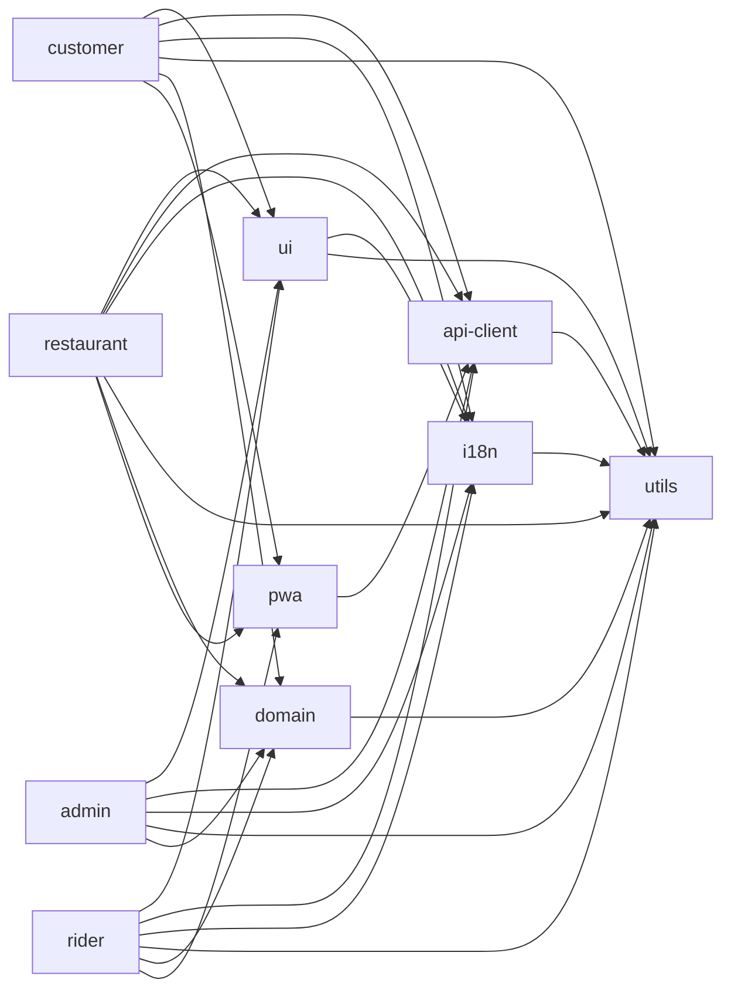

# 17 — Frontend Architecture

| | |
|---|---|
| **Purpose** | Define how rovo's web frontends are built: framework decision (challenge of baseline P7), app/package layout, routing, state, real-time, auth handling, forms, design system, i18n, images, performance, accessibility, analytics, error tracking, maps, configuration, build and deploy outputs. |
| **Owner** | Frontend Architect |
| **Status** | Draft v1 (2026-10-04) |
| **Depends on** | `00-planning-baseline.md` (P2, P3, P7, P8, P9, P12, P13, P17), `04`–`07` (UX workflows → route lists), `11-api-specification.md` (OpenAPI, SSE event names, error format), `12-auth-rbac.md` (cookies, CSRF, roles), `13-order-state-machine.md`, `14-payment-architecture.md` (checkout and CSP domains), `15-notification-architecture.md` (Web Push, SMS escalation), `16-delivery-zone-architecture.md` (pin-drop, serviceability), `22-deployment-architecture.md` / `25-free-hosting-comparison.md` (static hosting, Cloudflare), `24-observability-strategy.md` (Sentry, RUM) |
| **Companion** | `18-mobile-pwa-strategy.md` (service worker, offline, push, native path) |

Tags: `[ASSUMPTION]` = believed true, verify; `[OPEN]` = decision pending; `[LEGAL]` = needs legal review. All web sources were accessed **2026-10-04** unless stated otherwise.

---

## 0. Summary of decisions

| # | Decision | Status vs baseline |
|---|---|---|
| F1 | **Vite + React 19 + TypeScript SPA/PWA**, static output only, no frontend server runtime. Customer app adds **build-time static prerendering of public pages** (home, city, restaurant menu pages) for SEO and WhatsApp link previews. | **P7 CONFIRMED, with an amendment** (prerendering of public pages) |
| F2 | **Four apps, not three**: `apps/customer`, `apps/restaurant`, `apps/rider`, `apps/admin`. The baseline "partner" app is split into restaurant and rider apps. | **P7 CHANGED** (app split) |
| F3 | **Admin is deployed separately** on its own origin (`admin.<domain>`). It has no service worker, gets a stricter CSP, and sits behind Cloudflare Access (Zero Trust free tier) as an extra gate in front of the app's own email + password + TOTP login. | New |
| F4 | **Every app calls the API on its own origin under `/api`.** Cross-origin calls are avoided so that patchy 4G does not pay for CORS preflights, and cookies stay host-only. | **Requirement on DevOps** (affects P17, see §15) |
| F5 | TanStack Router + TanStack Query, Tailwind, Radix primitives (shadcn-style, copied in), i18next, vite-plugin-pwa, openapi-typescript + openapi-fetch. | P8 CONFIRMED |
| F6 | **No server-side cart in V1.** The cart is held on the client (one restaurant per cart) and persisted in `localStorage`. A stateless server **quote** endpoint returns the authoritative totals. | Decision (Backend to confirm) |
| F7 | One SSE connection per app tab, wrapped with reconnect, backoff and `Last-Event-ID`. Each event **invalidates TanStack Query keys**; it does not patch the cache. Polling is the fallback. | P3 CONFIRMED |
| F8 | Self-hosted fonts: system font for Latin text, **Noto Sans Telugu subset** loaded only when Telugu glyphs are on the page. | New |
| F9 | Images are **resized into variants on upload** (backend worker → R2), not transformed on the fly by Cloudflare Images. | New (requirement on Backend) |
| F10 | MapLibre GL JS with the **OpenFreeMap** public instance for V1. A **self-hosted Protomaps PMTiles extract** for Telangana on R2 is the plan B. The map is lazy-loaded only on address screens and in admin zone editing. | P13 CONFIRMED |

---

## 1. Framework evaluation (challenge of P7)

### 1.1 What the customer app actually needs

- **Discoverability in a city of about 2–2.5 lakh people.** [ASSUMPTION] Most first visits will come from:
  1. WhatsApp/Instagram shares and restaurant QR codes or posters (deep links to a restaurant page). These need **real HTML `<meta>`/Open Graph tags** because link-preview crawlers generally do not run JavaScript. [ASSUMPTION – widely observed behaviour; verify WhatsApp preview with a real share in Phase 2.]
  2. Google searches such as "biryani delivery Mahabubnagar" or "<restaurant name> menu". Google renders JavaScript but puts pages in a **render queue**. Its own guidance is that server-rendered or prerendered HTML is the more reliable path, and it notes the soft-404 problems of client-routed SPAs ([Google Search Central – JavaScript SEO basics](https://developers.google.com/search/docs/crawling-indexing/javascript/javascript-seo-basics)).
  3. Our Google Business Profile and word of mouth. Neither depends on the frontend framework.
- **The number of SEO pages is small and slow-moving.** About 50–200 restaurants [ASSUMPTION], one city page, and the home page. Menus change daily, but an SEO snapshot only needs to be about a day fresh. Authoritative prices come from the API at checkout anyway.
- **Everything else needs login or location**: cart, checkout, order tracking, account. These pages gain nothing from SSR.
- **First load on low-end Android over patchy 4G.** The visits that matter most are **repeat visits**. After the first visit, a precached app shell served by the service worker beats any SSR round-trip. The first visit is mostly a restaurant page arriving from a shared link, and prerendered HTML handles that.

### 1.2 Options compared

| Criterion | A. Vite SPA + static prerender of public routes (**chosen**) | B. Next.js App Router (SSR/RSC) | C. React Router v7 framework mode | D. Astro + React islands |
|---|---|---|---|---|
| SEO / link previews | Good for the pages that need it (prerendered HTML + OG + JSON-LD). App pages are noindex. | Best: per-request HTML | Good: SSR, or `ssr:false` + `prerender` for static files ([RR docs](https://reactrouter.com/7.18.3/how-to/pre-rendering.md)) | Excellent for content pages |
| First visit on low-end Android | Prerendered pages paint before JS runs. JS budget ≤ 170 KB gzip. | Good FCP. App Router runtime and RSC payload add JS weight [ASSUMPTION ~90–110 KB gzip framework baseline – measure]. Hydration costs CPU on low-end phones. | Similar to A in SPA+prerender mode; similar to B with SSR | Best for static pages. App flows still ship React islands. |
| Repeat visits / PWA / offline | Best: precached shell is instant and offline-capable | Harder: SSR HTML is not precacheable as a shell, so it needs network-first navigation and a custom offline page | Good in SPA mode | Awkward: multi-page app plus islands. Shared state across pages needs extra work. |
| Hosting cost and terms | **Static files only.** Free and unlimited static requests on Cloudflare ([Workers static assets: "Requests to static assets are free and unlimited"](https://developers.cloudflare.com/workers/static-assets/billing-and-limitations/)), or served by Caddy behind the Cloudflare CDN. No vendor lock-in. | Needs a server runtime. **Vercel Hobby forbids commercial use**: "Hobby teams are restricted to non-commercial personal use only", where commercial includes "any method of requesting or processing payment from visitors" ([Vercel fair use, updated 2026-09-14](https://vercel.com/docs/limits/fair-use-guidelines)). That rules out rovo. **Cloudflare Workers Free**: 100,000 requests/day, **10 ms CPU** per request, 3 MiB Worker size ([CF Workers limits](https://developers.cloudflare.com/workers/platform/limits/), [OpenNext CF](https://opennext.js.org/cloudflare)). SSR of a React tree within 10 ms CPU is risky, and over-quota requests fail. **Netlify Free**: 300 credits/month, 20 credits/GB bandwidth, 15 credits per production deploy, **sites paused** when credits run out ([Netlify credits](https://docs.netlify.com/manage/accounts-and-billing/billing/billing-for-credit-based-plans/how-credits-work/)). Not acceptable for production. Self-hosting Node on the Oracle VM is possible but adds a process to run, monitor and scale. | SSR mode has the same runtime trade-offs as B. SPA+prerender mode has the same cost as A. | Static mode has the same cost as A |
| Operational simplicity | Highest: `dist/` folder, cache headers, done | Lowest (runtime, ISR/cache semantics, platform adapters) | Medium | Medium (two paradigms) |
| Code sharing with a future Expo app | Shared via **framework-agnostic TS packages** (api-client, domain, i18n, utils, zod schemas). Same for all options. | Same. RSC/server actions are **not** reusable in React Native, so it is slightly worse. | Same as A | Same as A |
| Fit with P8 (TanStack Router/Query) | Native | Replaces the router | Replaces the router (RR7) | Partial |
| Team learning curve | Lowest | Highest (RSC, caching model) | Medium | Medium |

Expo Router can output web from the same codebase. Its static rendering, though, needs `generateStaticParams` for dynamic routes and gives up request-time rendering ([Expo docs](https://docs.expo.dev/router/web/static-rendering/)). React Native Web's bundle weight and DX are also a poor fit for the admin and restaurant web apps. **We do not use Expo for web in V1.**

### 1.3 Recommendation (firm)

**P7 is CONFIRMED with an amendment.** All apps are Vite + React SPAs and the output is static only. The customer app additionally **prerenders public routes at build time**:

- `/` (landing with city entry)
- `/{citySlug}` (e.g. `/mahabubnagar`: restaurant list snapshot)
- `/{citySlug}/r/{restaurantSlug}` (restaurant page: name, cuisines, locality, rating, opening hours, menu snapshot with names and prices, veg markers)
- `/legal/*`, `/about`

Each prerendered page contains `<title>`, `<meta name="description">`, canonical URL, Open Graph/Twitter tags with a restaurant image, `hreflang` (en/te), and **JSON-LD** (`Restaurant` with `servesCuisine`, `address`, `openingHoursSpecification`, `hasMenu`). The SPA then takes over. Every non-public route carries `<meta name="robots" content="noindex">`.

**Prerender mechanism.** It is decided by a 2-day spike in Phase 2, week 1:

1. **Preferred:** TanStack Start in **SPA mode with static prerendering**. It uses the same TanStack Router route tree and loaders, crawls links, accepts an explicit `pages` list, and produces static output ([TanStack Start static prerendering](https://tanstack.com/start/latest/docs/framework/react/guide/static-prerendering)). Risk: Start was announced as v1.0 **RC** on 2025-09-23 ([TanStack blog](https://tanstack.com/blog/announcing-tanstack-start-v1)). [OPEN] Confirm it is stable at Phase 2 start and that SPA mode plus prerender emits both a shell and per-route HTML.
2. **Fallback, independent of any framework:** a ~200-line Node build script. It fetches `GET /api/v1/public/cities/{city}/restaurants` and each restaurant's public menu, then renders a small set of **SEO view components** with `react-dom/server` into `dist/{city}/r/{slug}/index.html` (with the same CSS). The SPA mounts with `createRoot`, replacing the prerendered markup with identical layout, so there is no hydration contract to maintain.
3. React Router v7 framework mode (`ssr:false` + `prerender`) is the documented alternative if both of the above fail. It would mean switching routers in all apps, which costs consistency.

**Freshness.** The public pages are rebuilt by a nightly GitHub Actions job, plus an on-demand rebuild triggered by a debounced (≥ 15 min) `repository_dispatch` when a restaurant's public profile changes. Prices on prerendered pages are labelled "menu snapshot". Live data replaces them once the SPA mounts.

**When we would revisit SSR:** more than 3 cities with more than 1,000 indexable pages, or Search Console showing real indexing failures for prerendered pages, or a product need for per-request personalised HTML. Until then, SSR adds runtime cost and ops work for no V1 benefit.

### 1.4 App split decision

| Question | Decision | Reasoning |
|---|---|---|
| Partner = one app or two? | **Two apps: `apps/restaurant` and `apps/rider`** on separate origins (`restaurant.<domain>`, `rider.<domain>`). | Different devices (a shared tablet or cheap phone, often landscape, vs a personal phone in portrait on a two-wheeler). Different permissions (audio, wake lock and notifications vs geolocation, wake lock and notifications). Different PWA identities: separate install name and icon, separate Web Push subscription per origin, and separate Trusted Web Activity packages for Play (doc 18). Different update cadences. Smaller bundles. A combined app would ship the rider's geolocation and offer code to restaurant tablets and the reverse. The cost is one extra Vite build in the same workspace, which is trivial. |
| Separate admin deploy? | **Yes.** `admin.<domain>`, separate build artifact, separate CSP, no service worker, behind Cloudflare Access (free for ≤ 50 users [ASSUMPTION – verify at [Cloudflare Access](https://www.cloudflare.com/teams-access/)]). The admin API (`/api/v1/admin/*`) only accepts requests that come through the admin origin (Origin + `Sec-Fetch-Site: same-origin` checks, see §6). | Security isolation: an XSS bug in the customer app can never load admin code or ride admin cookies, because cookies are host-only per app origin and the admin API rejects other origins. Admin can ship stricter headers (Trusted Types) without constraining the customer app. |
| [OPEN] Separate registrable domain for admin (e.g. `rovo-ops.in`)? | Optional hardening (~₹1,000/yr). Recommended before any second city. | Removes the "same-site" relationship between subdomains entirely. |

---

## 2. Workspace layout (pnpm)

```
rovo/
├─ apps/
│  ├─ customer/      # rovo — customer SPA/PWA (+ prerendered public pages)
│  ├─ restaurant/    # rovo Partner — restaurant inbox/menu PWA (tablet-first)
│  ├─ rider/         # rovo Delivery Partner — rider PWA (phone-first)
│  └─ admin/         # rovo Admin — desktop SPA, no service worker
└─ packages/
   ├─ api-client/    # generated from OpenAPI 3.1: types + openapi-fetch client + query-key factories + SSE wrapper
   ├─ domain/        # pure TS: order/delivery status helpers, cart math preview, ETA text, role checks (no DOM, RN-safe)
   ├─ ui/            # React DOM components: Radix-based primitives, tokens → Tailwind, icons, VegMark, Money, StatusPill
   ├─ i18n/          # i18next setup, en/te catalogs per namespace, formatters (wraps utils), language detector
   ├─ utils/         # money (paise ↔ display), phone (E.164, IN mobile), address formatting, dates (Asia/Kolkata), idempotency keys
   ├─ pwa/           # SW helpers: Workbox route configs, update prompt hook, push subscribe helper, wake-lock & audio-unlock hooks
   ├─ testing/       # MSW handlers generated from OpenAPI examples, test-id helpers, Playwright fixtures
   └─ config/        # eslint flat config, tsconfig bases, tailwind preset (tokens), vite base config, size-limit presets
```

Dependency rules, enforced with ESLint `import/no-restricted-paths` or dependency-cruiser:



- `utils`, `domain`, `api-client` (except the SSE wrapper's DOM `EventSource` adapter) and the i18n **catalogs** must be **free of DOM APIs**. These are the packages a future Expo app reuses (doc 18 §9).
- No app imports from another app. Admin-only components live in `apps/admin`, not in `packages/ui`.
- Versions are pinned through `pnpm` catalogs. One React version is used across the workspace.

### 2.1 `packages/api-client`

- **Generation:** `openapi-typescript` turns `openapi.yaml` into `schema.d.ts`. `openapi-fetch` provides a typed `createClient<paths>()`. It is regenerated in CI, and a failing diff blocks the PR ("contract drift").
- **Middleware chain:** base URL `/api` → `Accept-Language` from i18n → `X-CSRF-Token` on unsafe methods → `Idempotency-Key` on every POST that creates something (UUIDv7 generated **per user intent**, kept until success so retries reuse it) → `X-Client: rovo-customer/1.4.2` → 401 handling (single-flight refresh, §6) → maps `application/problem+json` (RFC 9457) to a typed `ApiError { status, code, title, detail, fieldErrors[] }`.
- **Auth transport adapter:** `cookie` (web: `credentials: 'same-origin'`) or `bearer` (future native: reads and writes tokens through an injected `TokenStore`). This keeps one client for web and React Native.
- **Query key factories** (§4.2), **SSE client** (§5) and the **event → invalidation map** live here so all apps share them.

### 2.2 `packages/utils` (selected functions)

| Function | Behaviour |
|---|---|
| `formatMoney(paise: bigint \| number, locale)` | Integer paise to rupees without float arithmetic: `Intl.NumberFormat('en-IN', {style:'currency', currency:'INR', minimumFractionDigits: paise % 100 === 0 ? 0 : 2})`. Example: `12345650` → `₹1,23,456.50`; `14900` → `₹149`. Rounding to whole rupees in totals stays [OPEN] per baseline §3. |
| `formatNumber(n, locale)` | Lakh/crore grouping via `en-IN`/`te-IN`. `te-IN` uses Latin digits by default [ASSUMPTION – verify on Android Chrome ICU; fall back to `en-IN` when `Intl.NumberFormat.supportedLocalesOf('te-IN')` is empty]. |
| `parseIndianMobile(input)` | Strips spaces, `0`, `+91` and `91`, then validates `^[6-9]\d{9}$` and returns E.164. Uses `libphonenumber-js/min` (metadata ~ 40 KB) only in admin. Customer and partner apps use the light regex validator, because V1 is India-only. |
| `formatAddress(addr, {short})` | `"Flat 2, Sai Residency, Near Clock Tower, New Town, Mahabubnagar 509001"`. The short form is `"New Town · near Clock Tower"`. |
| `formatTime(ts, cityTz)` | Always formats in the **city** time zone (`Asia/Kolkata`), never the device time zone. |
| `newIdempotencyKey()` | UUIDv7. |

---

## 3. Routing maps

TanStack Router with **file-based routes**, typed search params validated with zod, and `beforeLoad` guards. Route-level code splitting (`autoCodeSplitting`). Intent preloading on `touchstart`/hover for list → detail links.

### 3.1 Customer (`apps/customer`, origin `<domain>`)

| Route | Auth | Notes |
|---|---|---|
| `/` | public, **prerendered** | City entry, "deliver to" locality picker, app install CTA |
| `/$city` | public, **prerendered** | Restaurant list (open/closed, ETA band, veg-only filter, cuisine chips) |
| `/$city/r/$restaurantSlug` | public, **prerendered** | Menu, categories, item sheet, add to cart. Search params `?item=` deep-link an item. |
| `/$city/search?q=` | public | Restaurant and dish search (en + te fields) |
| `/cart` | public | Client cart. Calls quote when a location is set. |
| `/login` → `/login/verify` | guest-only | Phone + OTP (`autocomplete="one-time-code"`, WebOTP on Android Chrome) |
| `/checkout` | CUSTOMER | Address select/add, quote, tip [OPEN product], COD/online choice, place order |
| `/checkout/pay/$orderId` | CUSTOMER | Payment handoff (PA checkout), also the **return target** after UPI app switching or a page reload |
| `/orders` | CUSTOMER | Order history |
| `/orders/$orderId` | CUSTOMER | Live tracking timeline (milestones, not a live map: P12), call restaurant/rider, cancel if allowed |
| `/orders/$orderId/rate` | CUSTOMER | Restaurant and rider ratings |
| `/orders/$orderId/help` | CUSTOMER | Issue reporting, refund status |
| `/account` | CUSTOMER | Profile, language |
| `/account/addresses`, `/account/addresses/new`, `/account/addresses/$id` | CUSTOMER | **Map pin-drop (lazy MapLibre chunk)** |
| `/account/privacy` | CUSTOMER | DPDP: consents, data export request, account deletion, grievance officer link [LEGAL] |
| `/legal/terms`, `/legal/privacy`, `/legal/refunds`, `/about` | public, prerendered | |
| `*` | | 404 component (prerendered `404.html` with `noindex`) |

### 3.2 Restaurant (`apps/restaurant`, origin `restaurant.<domain>`, UI name "rovo Partner")

| Route | Roles | Notes |
|---|---|---|
| `/login`, `/login/verify` | guest | Phone + OTP |
| `/outlets` | OWNER, STAFF | Choose outlet when the user has more than one. The selected outlet is stored per device. |
| `/start` | OWNER, STAFF | **"Start shift" screen**: one tap unlocks audio, takes the wake lock, checks notification permission, connects SSE (doc 18 §6) |
| `/inbox` | OWNER, STAFF | **Live new-order inbox** (repeating alert until accept/reject) plus columns for Preparing and Ready |
| `/orders/$orderId` | OWNER, STAFF | Details, KOT print view (`window.print`, 58/80 mm CSS) [OPEN: Bluetooth printers deferred], mark ready |
| `/orders?status=&date=` | OWNER, STAFF | History |
| `/availability` | OWNER, STAFF | Outlet open/pause toggle, item in/out of stock |
| `/menu`, `/menu/categories`, `/menu/items/$itemId`, `/menu/items/new` | OWNER | Menu editor incl. `name_te`, veg flag, price, packaging, photos |
| `/hours` | OWNER | Weekly hours, holidays |
| `/payouts`, `/payouts/$payoutId` | OWNER | Statements, commission breakdown |
| `/profile` | OWNER | FSSAI no., GSTIN, bank details (masked) [LEGAL] |
| `/staff` | OWNER | Invite or remove staff phone numbers |
| `/settings/alerts` | OWNER, STAFF | Alert self-test (sound, push, wake lock, battery advice) |
| `/help` | all | |

### 3.3 Rider (`apps/rider`, origin `rider.<domain>`, UI name "rovo Delivery Partner")

| Route | Notes |
|---|---|
| `/login`, `/login/verify` | Phone + OTP |
| `/onboarding` | Document status, permissions checklist (location, notifications), install prompt |
| `/` (home) | **Online/offline toggle** (requires a fresh location fix), current state, today's earnings, cash in hand vs limit |
| `/offers/$offerId` | Offer card with 45 s countdown, accept/decline, distance and pay estimate |
| `/deliveries/$deliveryId` | Step flow: navigate to restaurant → `AT_RESTAURANT` → `PICKED_UP` → navigate to customer → `AT_DROP` → `DELIVERED` (COD amount collected) / `FAILED` with reason. Google Maps deep links, tel: links. |
| `/earnings`, `/earnings/$weekId` | Pay breakdown |
| `/cash` | COD cash in hand, deposit history |
| `/history` | |
| `/profile`, `/settings` | Language, permissions re-check, battery advice |
| `/help` | |

### 3.4 Admin (`apps/admin`, origin `admin.<domain>`)

| Route | Roles (default) |
|---|---|
| `/login` → `/login/totp` | guest |
| `/` dashboard (today's orders, SLA breaches, online riders, offline restaurants) | all admin |
| `/live` live order board (SSE), `/orders`, `/orders/$id` (timeline, refunds, cancel) | OPS, SUPPORT (read), SUPER |
| `/dispatch` unassigned deliveries, manual assign | OPS |
| `/restaurants`, `/restaurants/new`, `/restaurants/$id/{profile,menu,commission,documents,hours,payouts}` | OPS; commission → FINANCE |
| `/riders`, `/riders/$id`, `/riders/$id/cash` | OPS; cash → FINANCE |
| `/customers`, `/customers/$id` (masked PII, reveal is audited) | SUPPORT |
| `/support/tickets`, `/support/tickets/$id` | SUPPORT |
| `/zones` (polygon editor: MapLibre + terra-draw [ASSUMPTION library choice]), `/localities` | OPS |
| `/pricing`, `/coupons` | OPS/FINANCE |
| `/finance/payouts`, `/finance/ledger`, `/finance/refunds`, `/finance/cod-deposits` | FINANCE |
| `/cities`, `/admins` (users, roles, city scopes), `/audit-log`, `/settings/flags`, `/settings/notification-templates` | SUPER |

Each route declares `staticData: { roles: [...] }`. A root `beforeLoad` enforces the roles, and the nav menu is filtered by the same data. **The server remains the authority.** Frontend guards are UX only.

---

## 4. State management

### 4.1 Principles

1. **Server state = TanStack Query.** No Redux.
2. **Client state is minimal.** It covers the cart, the selected location/locality, language, the restaurant's selected outlet, the rider's offline outbox (doc 18), and UI preferences. It uses **Zustand** (~1 KB) with the `persist` middleware on `localStorage`. Every read is wrapped in try/catch with an in-memory fallback.
3. Form state = react-hook-form (§7). URL state (filters, tabs, pagination) = typed search params.

### 4.2 Query key conventions

Keys are hierarchical arrays built **only** through factories in `packages/api-client/src/keys.ts`, so invalidation can target a prefix:

```ts
export const qk = {
  me:          ()                    => ['me'] as const,
  restaurants: {
    all:       ()                    => ['restaurants'] as const,
    list:      (city: string, f: RestaurantFilters) => ['restaurants', 'list', city, f] as const,
    detail:    (slug: string)        => ['restaurants', 'detail', slug] as const,
    menu:      (id: string)          => ['restaurants', id, 'menu'] as const,
  },
  orders: {
    all:       ()                    => ['orders'] as const,
    list:      (f: OrderFilters)     => ['orders', 'list', f] as const,
    detail:    (id: string)          => ['orders', 'detail', id] as const,
  },
  inbox:       (restaurantId: string)=> ['inbox', restaurantId] as const,     // restaurant app
  rider: { state: () => ['rider', 'state'] as const, offer: (id: string) => ['rider', 'offer', id] as const,
           delivery: (id: string) => ['rider', 'delivery', id] as const },
  quote:       (hash: string)        => ['quote', hash] as const,             // cart hash
  config:      ()                    => ['client-config'] as const,           // flags, min version
};
```

- The **locale is not part of keys.** On a language switch we call `queryClient.invalidateQueries()` once, because the API localises `name` by `Accept-Language`. [OPEN: Backend may instead return both `name` and `name_te`, which is preferred because it is cacheable. Then switching needs no refetch.]
- Defaults:

  | Setting | Value |
  |---|---|
  | `staleTime` | 30 s; menus 5 min; config 10 min |
  | `gcTime` | 10 min |
  | `retry` (GET) | 2 with exponential backoff and jitter |
  | `retry` (mutations) | 0, except mutations carrying an `Idempotency-Key` that failed on network, which may be retried by the user tapping "Retry" |
  | `refetchOnWindowFocus` | true (important when riders and restaurants switch apps) |
  | `networkMode` | `'online'` |

- **No persistence of the Query cache to disk in V1.** It would only add PII on shared devices, and the service worker covers offline menu browsing (doc 18).

### 4.3 Cart (decision F6)

| Aspect | Decision |
|---|---|
| Where | Client store `cart` (Zustand + persist, key `rovo.cart.v1`), one restaurant per cart. Adding from another restaurant opens a "Replace cart?" dialog. |
| Contents | `{ restaurantId, items: [{ itemId, variantId?, addonIds[], qty, note? }], updatedAt }`. **No prices are trusted from the client.** Prices shown before the quote come from the cached menu. |
| Authority | `POST /api/v1/cart/quote` (stateless, works for guests too) returns line prices, availability, fees (delivery, platform, small-cart, packaging), taxes, discount, total, `quote_id` and `expires_at`, plus `serviceable` for the address pin. `POST /api/v1/orders` takes `quote_id` (or the full cart plus address) and an `Idempotency-Key`. The server re-validates and returns `409 QUOTE_STALE` with a fresh quote if anything changed. |
| Why no server cart | No cross-device cart need in V1. It avoids cart-merge logic at login, works while offline-browsing, and means fewer endpoints. Cost: no abandoned-cart analytics. [OPEN for Backend/Product to overturn in docs 11/02.] |
| Expiry | The cart is cleared after a successful order, or when older than 24 h, or when the restaurant's menu version changes (items removed are shown as "no longer available"). |

---

## 5. Real-time integration (SSE)

### 5.1 Endpoints (proposal to doc 11)

| App | Endpoint | Events (examples, names owned by doc 11) |
|---|---|---|
| customer | `GET /api/v1/stream/customer` | `order.status_changed`, `delivery.status_changed` (milestones), `payment.status_changed` |
| restaurant | `GET /api/v1/stream/restaurant?outlet={id}` | `order.placed` (new inbox item), `order.cancelled`, `delivery.rider_assigned`, `delivery.status_changed` (arriving/picked up), `outlet.availability_changed` |
| rider | `GET /api/v1/stream/rider` | `delivery_offer.created`, `delivery_offer.expired`, `delivery.cancelled`, `rider.state_changed` (e.g. blocked by cash limit) |
| admin | `GET /api/v1/admin/stream?city={id}` | `order.*`, `delivery.*`, `restaurant.presence_changed`, `sla.breached` |
| all | — | `ping` comment line every **25 s** (Cloudflare proxies drop idle streams at ~100 s on non-Enterprise plans ([Cloudflare community](https://community.cloudflare.com/t/100-second-proxy-read-timeout-524-gateway-error-increase/684447))), `reset` (the client must refetch everything) |

Event payloads are **thin**: `{ type, id: entityId, version, occurred_at }`. The client refetches entities via REST, so SSE never becomes a second data contract. The SSE `id:` is a monotonic per-recipient cursor (e.g. the outbox sequence). The server replays from `Last-Event-ID` within a window (≥ 15 min [ASSUMPTION]). Outside the window it sends `reset`.

### 5.2 Client wrapper (`createEventStream`)

```mermaid
sequenceDiagram
  participant UI as React app
  participant W as EventStream wrapper
  participant API as /api/v1/stream/*
  participant Q as QueryClient
  UI->>W: start(app, params)
  W->>API: new EventSource(url + ?lastEventId=…)
  API-->>W: event order.status_changed {id, version}
  W->>Q: invalidateQueries(qk.orders.detail(id)), qk.orders.list prefix
  W->>W: store lastEventId (memory + sessionStorage)
  API--xW: error / network drop
  W->>W: close(); backoff 1s,2s,4s… max 30s, ±30% jitter
  W->>API: reconnect with lastEventId
  Note over W: after 3 consecutive failures → polling mode<br/>(and keep retrying SSE every 60 s)
  UI->>W: visibilitychange=visible / online event
  W->>API: reconnect immediately + Q.invalidate(active queries)
```

- We use native `EventSource` but **close it ourselves on `error` and reconnect with our own backoff**, because the browser's built-in retry has no backoff and gives up on non-200 responses. On reconnect, `lastEventId` is passed as a **query parameter** as well as the header, since a new `EventSource` cannot set headers. The backend must accept both.
- **401 on the stream** → run the silent refresh (§6), then reconnect. Repeated 401 → redirect to login.
- **Event → invalidation map** (in `api-client/src/realtime.ts`). Example: `order.status_changed → [qk.orders.detail(id), qk.orders.list prefix, qk.inbox(outlet)]`. **The cache is never patched from event payloads.** Invalidation plus refetch keeps one source of truth and handles out-of-order events.
- **One stream per tab.** [OPEN] When multiple tabs are open, leader election via `BroadcastChannel` + Web Locks could save connections. Deferred: one tab is the norm on phones.
- **Hidden-tab policy:**

  | App | Policy |
  |---|---|
  | customer | Closes the stream after 60 s hidden. On visible it reconnects and refetches (saves battery and data). |
  | restaurant and rider | **Keep the stream open.** These apps are meant to stay foregrounded (doc 18). |

- **Polling fallback intervals** (only in polling mode, or while SSE is not open):

  | Data | Interval |
  |---|---|
  | Customer order detail | 15 s |
  | Restaurant inbox | 10 s |
  | Rider state/offers | 5 s while online |
  | Admin live board | 15 s |

  Uses Query `refetchInterval` tied to a `useRealtimeHealth()` store.
- A connection-health indicator is shown in restaurant, rider and admin apps (green / amber reconnecting / red offline). It is not shown in the customer app unless offline.

---

## 6. Auth handling (web)

Security Architect (doc 12) owns token lifetimes and cookie attributes. This section covers the frontend contract.

| Topic | Design |
|---|---|
| Transport | **httpOnly, Secure, host-only cookies** set by the API on each app's origin (because `/api` is same-origin, §15). Access token cookie (≈15 min) `SameSite=Lax`, path `/api`. Refresh cookie `SameSite=Strict` [ASSUMPTION – Lax if the payment-return flow requires it], path `/api/v1/auth/refresh`. Use the `__Host-` prefix where the path allows; the refresh cookie needs `Path=/` to use `__Host-`, so doc 12 decides. JavaScript never sees tokens. |
| Why `Lax` on the access cookie | After a PA or UPI redirect back to `/checkout/pay/$orderId` (a cross-site top-level navigation), a `Strict` cookie would be missing and the user would look logged out. |
| CSRF | (1) The API rejects unsafe methods unless `Origin` matches the app origin allowlist **and** `Sec-Fetch-Site` is `same-origin` (when present). (2) **Double-submit token**: the API sets a readable `rovo_csrf` cookie, and the client echoes it in `X-CSRF-Token` on POST/PUT/PATCH/DELETE. (3) JSON-only bodies (`Content-Type: application/json`). Admin API additionally requires the admin origin exactly. |
| Session bootstrap | The root route `beforeLoad` calls `queryClient.ensureQueryData(qk.me())` → `GET /api/v1/me` (returns user, roles, city scope, `access_expires_at`, locale, consents). 401 → guest. |
| Silent refresh | (a) **Reactive:** on `401 {code:"token_expired"}`, a **single-flight** `POST /api/v1/auth/refresh` (one in flight; concurrent requests wait), then retry the original request once. (b) **Proactive:** on `visibilitychange → visible` and on a timer 60 s before `access_expires_at`. Refresh failure → clear the Query cache and go to `/login?redirect=…`. |
| Multi-tab | A `BroadcastChannel('rovo-auth')` broadcasts `logout` and `refreshed` so other tabs follow. |
| Route guards | `requireAuth(roles[])` in `beforeLoad`: guest → redirect to login with `redirect` search param; wrong role → 403 page. **Each app only admits its own roles.** For example, a RIDER logging into the restaurant app gets "This app is for restaurant partners" with a link to the right app. |
| OTP UX | `inputmode="numeric"`, `autocomplete="one-time-code"`, paste allowed (WCAG 2.2 SC 3.3.8). **WebOTP API** on Android Chrome if the SMS template ends with `@<customer-domain> #123456` [OPEN: needs DLT template approval; doc 15]. Resend timer 30 s. |
| Restaurant shared device | Long-lived refresh (e.g. 30 days, doc 12) bound to the device. Staff can "Switch user" without losing the outlet selection. Logout wipes Zustand stores and the Query cache. |
| Admin | Email + password + TOTP. Session idle timeout 30 min [ASSUMPTION, doc 12]. Re-auth (TOTP) for sensitive actions (refunds > threshold, payout marking, role changes). |

---

## 7. Forms

- **react-hook-form + zod** (`@hookform/resolvers`). The customer app uses **`zod/mini`** to keep bundle weight down [ASSUMPTION: zod v4 mini API stable]. Admin can use full zod.
- **Schemas derived from OpenAPI where possible:**
  - V1 approach: **hand-authored form schemas** in `packages/api-client/src/forms/*.ts`, each **type-checked against the generated request body type**, e.g. `const AddressForm = z.object({...}) satisfies z.ZodType<components['schemas']['AddressCreate']>`. This catches drift at compile time while letting the UI add stricter rules (e.g. landmark recommended, PIN `^5\d{5}$` for Telangana [ASSUMPTION]).
  - [OPEN] spike: generate zod from OpenAPI (`@hey-api/openapi-ts` zod plugin or `openapi-zod-client`) and adopt it if the output is clean and tree-shakeable.
- **Server validation errors** (problem+json `fieldErrors[{field, code}]`) map to `setError(field, {message: t('errors:'+code)})`. Field error codes are translated by the client; server error **codes** are stable and messages are not shown raw.
- Every submit button is disabled while pending. Mutations creating things send `Idempotency-Key` (§2.1). Double-tap protection matters on laggy phones.
- Input types: `inputmode="numeric"` for phone/OTP/PIN/qty, `type="tel"` for phone, `autocomplete` set on name, tel, address-line1 and postal-code.

---

## 8. Error, loading and empty-state patterns

| Situation | Pattern |
|---|---|
| Route data loading | **Skeletons** shaped like the content, not spinners. Route `pendingMs: 150` avoids flashes. Lists render the first 10 items, then the rest with `content-visibility: auto`. |
| Route data error | Route `errorComponent`: friendly message in the current language + **Retry** + "Go home". 404 → not-found component. 403 → "No access". 5xx/network → retry and offline hint. |
| Background refetch error | Keep showing cached data with a subtle "Couldn't refresh · Retry" bar and the "Updated 2 min ago" timestamp. |
| Mutation error | Inline field errors (422), toast for generic errors (Radix Toast, `aria-live="polite"`), **blocking dialog** for business conflicts (`409 QUOTE_STALE`, `ORDER_ALREADY_ACCEPTED`, `OFFER_EXPIRED`). |
| Offline | A global `useOnline()` (navigator.onLine + failed-fetch heuristic) shows a top banner "You're offline – showing saved data". Actions requiring network are disabled with an explanation. |
| Empty states | Short text, a lightweight inline SVG (< 2 KB), and one CTA (e.g. "No restaurants deliver here yet – Try another area"). |
| Crash | Top-level React error boundary → Sentry (§12) + "Reload app" button that also clears a broken SW if the error repeats (doc 18 §5). |
| Long operations | Optimistic UI only for **reversible, low-risk** toggles (item in/out of stock, outlet pause). **Never** for order acceptance, payments or rider status. Those show pending state until the server confirms. |

---

## 9. Design system (`packages/ui` + Tailwind preset)

- **Tokens** are CSS custom properties defined in `packages/config/tailwind-preset` and mapped to Tailwind theme keys. Categories:
  - colour: `--color-bg`, `--color-surface`, `--color-text`, `--color-muted`, `--color-primary`, `--color-success`, `--color-warning`, `--color-danger`, `--color-veg`, `--color-nonveg`
  - spacing: 4 px scale
  - radius, elevation, motion: `--duration-*`, honouring `prefers-reduced-motion`
  - typography: `--font-sans`, `--font-telugu`
- **Contrast:** text ≥ 4.5:1 and large text ≥ 3:1, verified with an automated token contrast test.
- **Dark mode:** tokens support both themes. V1 ships **light only** for customer, restaurant (bright kitchens, high contrast) and admin. The **rider app follows the system theme**, because night riding and OLED battery savings justify it. Adding dark mode to other apps later is a token switch.
- **Components (copied-in shadcn-style on Radix primitives):**
  - Button (min height 48 px), IconButton (48×48), Input, OtpInput, Select, Sheet (bottom sheet for item details), Dialog, Toast, Tabs, Switch, Badge
  - Domain-specific: StatusPill (order/delivery status → colour + icon + text), Money, Countdown (offer timer, announced to screen readers at 30/10 s), Stepper (rider flow), EmptyState, Skeleton, ConnectionIndicator, **VegMark**
- **Veg / non-veg markers:** follow the Indian convention (FSSAI labelling) [LEGAL – verify current symbol spec in the FSSAI Labelling & Display Regulations]. Veg is a green square outline with a filled green circle. Non-veg is a brown square outline with a filled brown triangle. They are rendered as inline SVG at 14–16 px **plus an accessible name** (`aria-label="Vegetarian"` / `"Non-vegetarian"`, translated), so meaning is never conveyed by colour alone. "Contains egg" is shown as a text tag [OPEN product: whether egg is its own category]. A "Veg only" filter is prominent.
- **Telugu typography:**
  - Font stack: `--font-sans: system-ui, Roboto, "Noto Sans", sans-serif` (no download for Latin on Android). `--font-telugu: "Noto Sans Telugu", "Noto Sans Telugu UI", sans-serif`.
  - Font files: self-hosted **subset WOFF2** (Telugu block U+0C00–0C7F, U+0964–0965, U+200C–200D, U+25CC, plus digits/punctuation), weights 400 and 600. Target ≤ 35 KB per weight [ASSUMPTION; the full variable font is ~101 KB per [Fontsource](https://fontsource.org/fonts/noto-sans-telugu/cdn)]. Declared with `unicode-range` so the browser downloads it **only when Telugu glyphs render**, with `font-display: swap`. Preloaded only when `lang=te`. Licence: SIL OFL.
  - Line-height ≥ 1.6 for Telugu body (stacked vowel signs and conjuncts), no letter-spacing, no uppercase transforms, body ≥ 16 px.
  - Design for **~30–40% text expansion** [ASSUMPTION] and never truncate key labels (prices, status) mid-word. Use `lang="te"` on `<html>` and `lang="en"` on embedded English proper nouns.
- **RTL:** not needed. We still use logical CSS properties (`ms-`, `me-`) for free future-proofing.
- **Icons:** `lucide-react` with per-icon imports (tree-shaken).

---

## 10. Internationalisation (`packages/i18n`)

| Topic | Decision |
|---|---|
| Library | i18next + react-i18next. Translation files are loaded **per namespace, per language, lazily** via dynamic import (Vite chunk). The default namespace is bundled with the shell. |
| Namespaces | `common` (buttons, statuses, errors), `auth`, `catalog`, `cart`, `checkout`, `orders`, `account`, `restaurant`, `rider`, `admin`, `legal`. Each app loads only what it uses. **Admin V1 is English-only** [ASSUMPTION; ops staff], with keys still extracted. |
| Plurals | i18next JSON v4 plural suffixes backed by `Intl.PluralRules` (CLDR: Telugu has `one`/`other`). We do **not** add `i18next-icu`/`intl-messageformat` to the customer bundle. Select-style messages use the `context` feature. |
| Numbers / money / dates | Only via `packages/utils` formatters: `Intl.NumberFormat(locale==='te' ? 'te-IN' : 'en-IN', …)`, `Intl.DateTimeFormat(..., {timeZone: city.timezone})`, `Intl.RelativeTimeFormat` for "5 min ago". Money is always ₹ with lakh grouping. |
| Language choice | First visit: `navigator.languages` contains `te` → Telugu, else English. A visible **EN / తెలుగు toggle** sits in the header (customer) and in settings (partner apps). It is persisted in `localStorage` (`rovo.lang`) and, when logged in, in the profile (`PATCH /me {locale}`) so SMS/push templates match. The `Accept-Language` header follows the choice. |
| Workflow | Source of truth: `packages/i18n/locales/en/*.json`. Keys are extracted with i18next-cli/parser in CI. CI **fails on missing `te` keys** for customer/restaurant/rider and reports them for admin. Telugu translations are done by a native-speaker reviewer, using a **glossary** (keep common loanwords like "order", "delivery" where users expect them [ASSUMPTION – validate with users]). Tooling: plain PRs in V1. [OPEN] Hosted Weblate (libre plan for OSS [ASSUMPTION – verify]) once community contributors appear. |
| Pseudo-locale | `en-XA` (accented, +40% length) in dev/staging to catch hard-coded strings and overflow. |
| User content | Restaurant and menu names: API returns `name` and optional `name_te`, and the UI shows `name_te ?? name` in Telugu mode. Search matches both. **No machine translation in V1.** Restaurants or ops may enter Telugu names manually. |

---

## 11. Images

- **Decision F9: variants are pre-generated on upload** by the backend worker (libvips via `govips` [ASSUMPTION]):
  - widths **160, 320, 640, 1024** px
  - formats **WebP** (q≈75) + **JPEG** fallback; AVIF optional later, since it costs more CPU on the ARM VM
  - stored in R2 under content-hashed keys
  - served from `img.<domain>` (R2 custom domain behind the Cloudflare cache) with `Cache-Control: public, max-age=31536000, immutable`
- **Why not Cloudflare Images:** the free plan includes **5,000 unique transformations/month**, after which new transformations error (`9422`) ([CF Images pricing](https://developers.cloudflare.com/images/pricing/)). 200 restaurants × 50 items × 4 widths × 2 formats ≈ 80,000 unique variants, which is far over that. Vercel Hobby also has 5K transformations and is not allowed commercially anyway.
- The API returns an image object `{ id, alt, dominant_color, variants: { "webp": { "160": url, … }, "jpeg": {…} }, width, height }`.
- The frontend `` component renders `<picture>` with `srcset`/`sizes`, explicit `width`/`height` (no CLS), `loading="lazy"` + `decoding="async"` below the fold, `fetchpriority="high"` for the LCP image (restaurant hero), and the dominant colour as background placeholder (no blurhash JS).
- **Data saver:** if `navigator.connection.saveData` or `effectiveType` is `2g`/`slow-2g`, use the 160/320 variants and no hero images [ASSUMPTION: Network Information API on Android Chrome only].
- Upload (restaurant/admin): client-side downscale to ≤ 2048 px and JPEG q 0.85 with canvas before upload (saves restaurant data), max 5 MB, EXIF stripped server-side.

---

## 12. Performance budgets

Measured in CI with `size-limit` (bundle) and **Lighthouse CI, mobile profile** (Moto G Power-class emulation, slow 4G), and in the field with `web-vitals` RUM beacons (§13).

| Metric | Customer | Restaurant / Rider | Admin |
|---|---|---|---|
| Initial JS (gzip, shell + first route) | **≤ 170 KB** (CI warns at 170, **fails at 200**) | ≤ 200 KB | ≤ 350 KB |
| Initial CSS (gzip) | ≤ 25 KB | ≤ 25 KB | ≤ 40 KB |
| Fonts on first view | 0 KB (en) / ≤ 40 KB (te) | same | 0 KB |
| LCP (p75, field; lab on Moto G-class + 4G) | **< 2.5 s** (prerendered restaurant page < 2.0 s lab) | < 2.5 s | n/a |
| INP (p75) | < 200 ms | < 200 ms | < 200 ms |
| CLS | < 0.1 | < 0.1 | < 0.1 |
| Repeat-visit shell (SW) | < 1.0 s to first content | < 1.0 s | n/a |

Indicative initial budget (customer, gzip) [ASSUMPTION – measure in spike]:

| Item | Size |
|---|---|
| react + react-dom | ~60 KB |
| TanStack Router | ~15 KB ([comparison](https://tanstack.com/router/v1/docs/framework/react/comparison), secondary estimates) |
| TanStack Query | ~13 KB |
| i18next + react-i18next | ~15 KB |
| openapi-fetch | ~2 KB |
| zod/mini | ~5 KB |
| Radix pieces used on first route | ~10 KB |
| Zustand | ~1 KB |
| App code + translations | ~40 KB |
| **Total** | **≈ 160 KB** |

**Escape hatch [OPEN]:** if the budget is breached, alias `react-dom` to Preact compat for the customer app only, after compatibility testing with Radix.

Techniques:
- Route-level code splitting. MapLibre (~200+ KB gzip [ASSUMPTION]), the Razorpay checkout script, Sentry replay and admin-only libraries are **lazy only**.
- `modulepreload` for the first route.
- Brotli at the CDN.
- No CSS-in-JS runtime.
- Font subsetting (§9).
- Images (§11).
- Prefer `fetch` over polyfills. Target `es2020` (Chrome ≥ 109-era Android devices, doc 18 matrix) via `build.target`. `@vitejs/plugin-legacy` is **not** used (see doc 18 support matrix).

---

## 13. Accessibility, analytics, error tracking, feature flags, testing hooks

### 13.1 Accessibility (WCAG 2.2 AA)

- **Touch targets:** ≥ 44×44 CSS px (we use 48 px), exceeding SC 2.5.8 (24 px minimum). Spacing ≥ 8 px between list actions.
- **2.5.7 Dragging movements:** the map pin-drop has non-drag alternatives: "Use my current location", a locality search list, and arrow buttons to nudge the pin. Address fields are always fillable without the map.
- **2.4.11 Focus not obscured:** sticky cart bar and bottom sheets must not cover the focused element (`scroll-padding-bottom`).
- **3.3.8 Accessible authentication:** OTP paste/autofill allowed, no CAPTCHA puzzles.
- **Screen readers:** semantic landmarks; Radix handles ARIA patterns; live regions announce order status changes and offer countdowns; `lang` attribute correctly set so **TalkBack uses Telugu TTS** for Telugu text [ASSUMPTION – Google TTS Telugu voice must be installed; include in the device test plan, doc 18 §11].
- Status is shown with colour **and** icon **and** text. `prefers-reduced-motion` is respected. Zoom to 200% works, with no `maximum-scale` in the viewport.
- **Tooling:** `eslint-plugin-jsx-a11y`, `@axe-core/playwright` in E2E (0 serious/critical violations gate), plus manual TalkBack passes per release.

### 13.2 Analytics (privacy-friendly, DPDP)

- **Umami** (open source, cookie-less): self-hosted on the API VM with the existing Postgres, or Umami Cloud Hobby (up to 100K events/month [ASSUMPTION – per third-party summaries; verify at umami.is]). The script loads from **our own origin** (proxied path), so there are no third-party requests and adblockers do not break core metrics.
- **Two tiers:**
  1. **Anonymous aggregate page and funnel events** with no user ID, IP not stored, and the language/city dimension. Enabled by default. [LEGAL: confirm this is outside DPDP consent scope or covered by "legitimate uses"; otherwise gate it behind consent.]
  2. **User-linked product analytics:** off unless the user consents in the DPDP consent notice (`consents.analytics = true`, stored server-side via `/me/consents`).
- **Web-vitals RUM** (LCP/INP/CLS + device memory + effectiveType) is sent as anonymous events to the same pipeline or to `POST /api/v1/rum` [OPEN with doc 24].
- No Google Analytics, no Meta pixel in V1.

### 13.3 Error tracking

- **Sentry browser SDK** (`@sentry/react`). The free **Developer plan: 5k errors/month, 1 user, 50 replays, 5M spans, 30-day lookback** ([Sentry pricing](https://sentry.io/pricing/)). [OPEN] Commercial-use terms of the free plan were not stated on the pricing page; check the ToS and apply to Sentry's open-source sponsorship. **Fallback: self-hosted GlitchTip** (Sentry-SDK compatible) on the VM.
- Sentry is loaded **after first render** (dynamic import in `requestIdleCallback`) to keep it out of the initial budget. Errors before that are captured by a tiny `window.onerror` buffer that is replayed into Sentry.
- `tunnel: '/api/v1/telemetry/sentry'` keeps events on the same origin (CSP-simple, adblock-proof).
- `beforeSend` scrubs phone numbers, addresses, OTPs and names (regex + denylist keys).
- Session Replay is **off** for customer (PII) and on only for the admin app at 0% normal / 100% on-error with all text masked [OPEN].
- Releases tagged with the git SHA, and source maps uploaded in CI, **not served publicly**.

### 13.4 Feature flags and remote config

- `GET /api/v1/config/client?app=customer` returns:
  ```json
  {
    "flags": { "cod_enabled": true, "online_payments": true, "te_menu_names": true },
    "min_supported_version": "1.3.0",
    "kill_switches": { "checkout": false },
    "support_phone": "+91…",
    "maintenance": null
  }
  ```
- It is evaluated server-side per city, role and percentage (doc 11/26 own storage). It is cached by Query for 10 min and refetched on focus.
- No third-party flag SaaS in V1.
- `min_supported_version` drives the forced-update screen (doc 18 §5).

### 13.5 Testing hooks

- Prefer **role/label queries** (Testing Library, Playwright `getByRole`).
- `data-testid` is used only where roles are ambiguous (repeated list items, canvas/map, timers). Convention: `kebab-case` `<screen>-<element>[-<qualifier>]`, e.g. `checkout-place-order`, `menu-item-card`, `inbox-order-card`, `rider-offer-accept`.
- Dynamic IDs are put in `data-entity-id`, not baked into test IDs.
- Test IDs are **kept in production builds** (cheap, needed for synthetic smoke tests).
- MSW handlers are generated from OpenAPI examples (`packages/testing`) for component tests and offline dev.
- Clock control (`vi.useFakeTimers` / Playwright clock) is required for countdown, SSE backoff and offer expiry tests.
- Strategy is owned by doc 20.

---

## 14. Maps

| Aspect | Decision |
|---|---|
| Library | **MapLibre GL JS** (BSD-3), lazy-loaded chunk used only in `/account/addresses/*`, checkout "add address", admin `/zones`, `/localities`. The customer tracking page has **no map** (P12). Riders use Google Maps deep links (doc 18). |
| Tiles V1 | **OpenFreeMap public instance**: "completely free: there are no limits on the number of map views or requests", commercial use "Yes", no API keys or cookies; **attribution required** ("OpenFreeMap © OpenMapTiles Data from OpenStreetMap", added automatically by MapLibre's attribution control) ([openfreemap.org](https://openfreemap.org/)). **Risk:** the ToS says they "may discontinue it at any time without notice" and gives no SLA ([OpenFreeMap ToS](https://openfreemap.org/tos/)). |
| Plan B (ready before launch) | **Self-hosted Protomaps PMTiles extract** (Telangana or a Mahabubnagar district bbox) on R2, served via HTTP range requests with the `pmtiles` protocol plugin. Protomaps's **hosted API** requires GitHub sponsorship for commercial use ([protomaps.com](https://protomaps.com/)), so we self-host the file and do not use their API. Data © OpenStreetMap contributors (ODbL) attribution is required. The style URL is a runtime config value (§15.2) so the switch is a config change. |
| Attribution | The MapLibre `AttributionControl` stays visible (compact mode on mobile). It must not be hidden by our UI. |
| No WebGL | Fall back to the **non-map flow**: "Use my current location" (Geolocation API) + locality list + manual fields. The backend still requires lat/lng, so with no geolocation and no map the user picks a locality and the system uses the locality centroid flagged `pin_precision: "locality"` for rider guidance [OPEN with doc 16]. |
| Geocoding | None paid (P13). A locality search list from our API. Reverse-geocode label = the nearest `locality` via PostGIS (doc 16). |
| Data use | The pin-drop screen requests `enableHighAccuracy: true` once, on the user's tap (never on page load). |

---

## 15. Environment config, build and deploy outputs

### 15.1 Origins and same-origin API (decision F4 — requirement on DevOps, challenge to P17 detail)

| App | Origin | `/api/*` |
|---|---|---|
| customer | `https://<domain>` (e.g. `rovo.in` [ASSUMPTION – domain not chosen]) | proxied to Go API |
| restaurant | `https://restaurant.<domain>` | proxied to Go API |
| rider | `https://rider.<domain>` | proxied to Go API |
| admin | `https://admin.<domain>` | proxied to Go API (Cloudflare Access in front) |
| images | `https://img.<domain>` | R2 public bucket via Cloudflare |

**Why:** a separate `api.<domain>` would make every JSON request with credentials a CORS **preflighted** request. Preflight caching is per URL, so detail URLs like `/orders/{id}` each pay an extra round-trip on high-latency 4G. Same-origin also makes cookies host-only per app, which gives admin isolation for free.

Implementation options for DevOps (doc 22 decides):
- **(A, recommended for V1)** Cloudflare-proxied DNS for all four hostnames → **Caddy on the VM**, which serves each app's `dist/` (versioned release dirs + symlink swap) and reverse-proxies `/api/*` to the Go API. Hashed assets are cached at the Cloudflare edge (cache rule `/assets/*`). There are no Worker request quotas, SSE flows through the same path, and it is one deploy mechanism (SSH/compose).
- **(B)** Cloudflare Workers static assets (static requests free and unlimited) with Worker **routes** that exclude `/api/*` so it goes to the origin. [OPEN – verify route-exclusion behaviour with static-assets Workers.] **Do not** proxy `/api` *through* a Worker on the free plan: 100k requests/day, and over-quota requests on `run_worker_first` paths get **429** ([CF static assets billing](https://developers.cloudflare.com/workers/static-assets/billing-and-limitations/)).
- **(C, fallback only)** Cloudflare Pages per app (free: 500 builds/month, 20,000 files ([CF Pages limits](https://developers.cloudflare.com/pages/platform/limits/))) + `api.<domain>` with strict CORS (`Access-Control-Allow-Credentials: true`, explicit origins, `Access-Control-Max-Age: 7200`) and the preflight cost accepted.

### 15.2 Configuration

| Kind | Mechanism |
|---|---|
| Build-time constants | `VITE_APP_NAME`, `VITE_RELEASE` (git SHA), `VITE_APP_VERSION` (semver). Non-secret only. |
| Runtime config (per environment, **build once, deploy many**) | The deploy step injects `<script id="rovo-config" type="application/json">{…}</script>` into `index.html` (no extra request, CSP-safe because it is not executable). Keys: `apiBase` (`/api`), `env`, `mapStyleUrl`, `sentryDsn`, `umamiWebsiteId`, `vapidPublicKey`, `razorpayKeyId` (public key id), `supportPhone`, `cityDefault`. |
| Secrets | **None in frontends.** |

### 15.3 Build outputs

```
apps/customer/dist/
  index.html                       # shell (no-cache)
  mahabubnagar/index.html          # prerendered city page
  mahabubnagar/r/<slug>/index.html # prerendered restaurant pages
  404.html                         # noindex
  assets/*.[hash].js|css|woff2     # immutable
  sw.js, workbox-*.js              # no-cache
  manifest.webmanifest             # no-cache (short max-age ok)
  icons/*, robots.txt, sitemap.xml # sitemap generated with prerender
  .well-known/assetlinks.json      # restaurant/rider only (TWA, doc 18)
```

### 15.4 Cache headers

| Path | Header |
|---|---|
| `/assets/*` | `public, max-age=31536000, immutable` |
| `/index.html`, prerendered `*.html`, `/sw.js`, `/manifest.webmanifest` | `no-cache` (revalidate). Prerendered HTML may add `s-maxage=300` at the edge. |
| `/api/*` | Set by the API. Default `no-store`. Public catalog GETs: `public, max-age=60, stale-while-revalidate=300` (doc 18 SW strategy aligns). |

Keep the **previous 2 releases' `assets/`** on the server so open tabs and old service workers can still lazy-load chunks after a deploy. On a chunk-load failure the router error boundary triggers a one-time hard reload.

### 15.5 SPA fallback

Unknown paths that are not files serve `index.html` with status 200 (Caddy `try_files {path} {path}/index.html /index.html`). Prerendered paths are served as files. Real 404 for `/assets/*` misses. `/api/*` is never rewritten.

### 15.6 Security headers (per app; admin strictest)

```
Content-Security-Policy:
  default-src 'self';
  script-src 'self' https://checkout.razorpay.com;            # customer only; [OPEN] exact PA domains per doc 14
  style-src 'self';                                            # Tailwind is a static file; React/Radix inline styles are set via CSSOM (allowed)
  img-src 'self' data: blob: https://img.<domain> https://tiles.openfreemap.org;
  font-src 'self';
  connect-src 'self' https://tiles.openfreemap.org https://<r2-pmtiles-host>;
  frame-src https://api.razorpay.com https://checkout.razorpay.com;   # customer only
  worker-src 'self' blob:;                                     # MapLibre workers + SW
  child-src blob:;
  manifest-src 'self';
  base-uri 'none'; object-src 'none'; frame-ancestors 'none'; form-action 'self' https://api.razorpay.com;
  upgrade-insecure-requests
  (admin adds: require-trusted-types-for 'script'; trusted-types default)
Strict-Transport-Security: max-age=63072000; includeSubDomains; preload   # after domain is stable
X-Content-Type-Options: nosniff
Referrer-Policy: strict-origin-when-cross-origin
Permissions-Policy: camera=(), microphone=(), payment=(), usb=(), geolocation=(self)   # restaurant/admin: geolocation=()
Cross-Origin-Opener-Policy: same-origin-allow-popups   # customer (PA popups); admin: same-origin
```

- **CSP rollout:** ship as `Content-Security-Policy-Report-Only` in staging first, with reports to `/api/v1/csp-report`.
- Razorpay's exact script, frame and connect domains must be verified against their current CSP guidance in doc 14 [OPEN].

---

## 16. What we are not doing in V1 (and why)

- **No SSR/RSC or Next.js.** Hosting terms and costs, operational load, and PWA fit (§1).
- **No micro-frontends or module federation.** Four small apps in one workspace suffice.
- **No GraphQL, no WebSockets.** P2/P3.
- **No server-side cart, no persisted Query cache** (§4).
- **No live map tracking for customers** (P12; doc 18 §7).
- **No machine translation of menus.** Quality risk; manual `name_te` instead.
- **No third-party analytics or ads pixels.** DPDP and budget.
- **No React Native / Expo for web.** Doc 18 §9 covers the native path.

## 17. Requirements on other docs (summary)

| To | Requirement |
|---|---|
| 11 API | OpenAPI 3.1 with `operationId`s, examples, problem+json errors with stable `code`s and `fieldErrors`. `Idempotency-Key` on all creating POSTs. `/cart/quote`. `/me` with `access_expires_at`, roles, locale, consents. `/config/client`. Public catalog endpoints (`/public/...`) cacheable for prerender and SW. Thin SSE events with ids, replay via `Last-Event-ID` header **or** `?lastEventId=`, `ping` every 25 s, `reset`. Image objects with variants and `dominant_color`. `name_te` returned alongside `name`. |
| 12 Auth | Cookie names, paths and SameSite as in §6. Double-submit CSRF cookie. Origin/Sec-Fetch-Site enforcement. Per-app role admission. Admin origin binding. |
| 14 Payments | PA checkout domains for CSP. Return URL `/checkout/pay/{orderId}`. Payment status endpoint for polling. |
| 15 Notifications | WebOTP-compatible SMS template line. Push (doc 18). |
| 16 Zones | Nearest-locality reverse lookup. Serviceability in quote. `pin_precision`. |
| 22/25 DevOps | Same-origin `/api` per app hostname (§15.1). Keep 2 previous releases' assets. Headers per §15. Cloudflare Access on admin. R2 `img.` domain. Nightly prerender job + `repository_dispatch` hook. |
| 24 Observability | Sentry tunnel endpoint, RUM endpoint, release/source-map upload in CI. |

## Sources (accessed 2026-10-04)

- Vercel Fair Use Guidelines (Hobby commercial-use restriction; page last updated 2026-09-14): https://vercel.com/docs/limits/fair-use-guidelines
- Cloudflare Workers limits (Free: 100,000 req/day, 10 ms CPU): https://developers.cloudflare.com/workers/platform/limits/
- Cloudflare Workers static assets billing ("free and unlimited"; 429 on over-quota `run_worker_first`): https://developers.cloudflare.com/workers/static-assets/billing-and-limitations/
- Cloudflare Pages limits (500 builds/month, 20,000 files, 25 MiB/file): https://developers.cloudflare.com/pages/platform/limits/
- OpenNext for Cloudflare (Worker size 3 MiB free): https://opennext.js.org/cloudflare
- Netlify pricing (Free = 300 credits): https://www.netlify.com/pricing/ ; credit rates and pause behaviour: https://docs.netlify.com/manage/accounts-and-billing/billing/billing-for-credit-based-plans/how-credits-work/
- React Router v7 pre-rendering / SPA mode: https://reactrouter.com/7.18.3/how-to/pre-rendering.md
- TanStack Start v1 RC announcement (2025-09-23): https://tanstack.com/blog/announcing-tanstack-start-v1 ; static prerendering: https://tanstack.com/start/latest/docs/framework/react/guide/static-prerendering
- Expo Router static rendering: https://docs.expo.dev/router/web/static-rendering/
- Google Search Central, JavaScript SEO basics: https://developers.google.com/search/docs/crawling-indexing/javascript/javascript-seo-basics
- Cloudflare Images pricing (Free: 5,000 unique transformations/month): https://developers.cloudflare.com/images/pricing/
- OpenFreeMap (free, commercial OK, attribution): https://openfreemap.org/ ; ToS (no SLA, may discontinue): https://openfreemap.org/tos/
- Protomaps (self-host PMTiles; hosted API commercial requires sponsorship): https://protomaps.com/
- Sentry pricing (Developer plan limits): https://sentry.io/pricing/
- Umami Cloud FAQ (Hobby plan; figures from secondary summaries, verify): https://umami.is/docs/cloud/faq
- Cloudflare Access / Zero Trust (free ≤ 50 users, secondary confirmation): https://www.cloudflare.com/teams-access/
- Cloudflare 100-second proxy timeout (SSE heartbeats): https://community.cloudflare.com/t/100-second-proxy-read-timeout-524-gateway-error-increase/684447
- TanStack Router comparison (bundle notes): https://tanstack.com/router/v1/docs/framework/react/comparison
- Fontsource Noto Sans Telugu: https://fontsource.org/fonts/noto-sans-telugu/cdn
