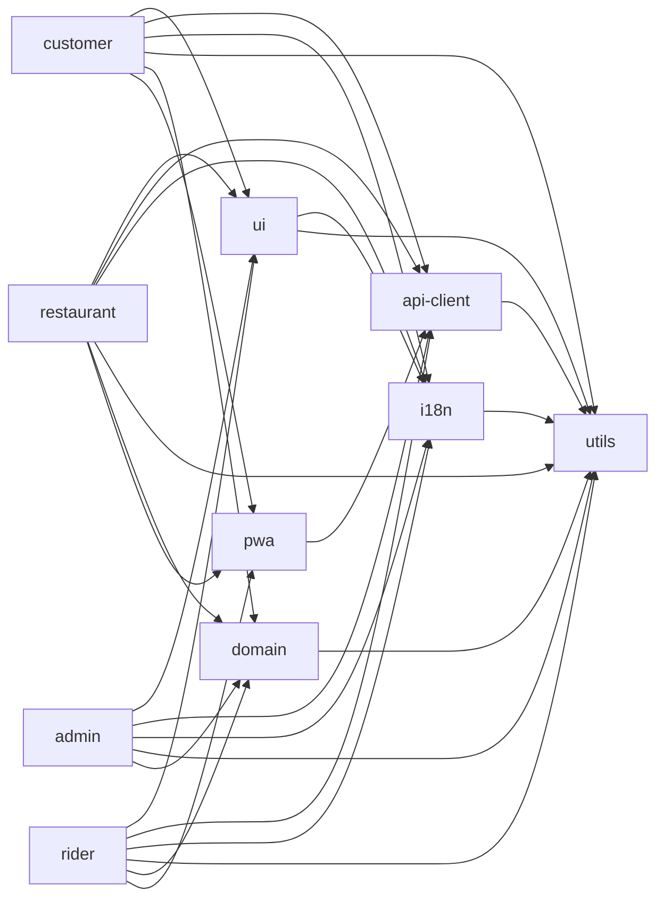
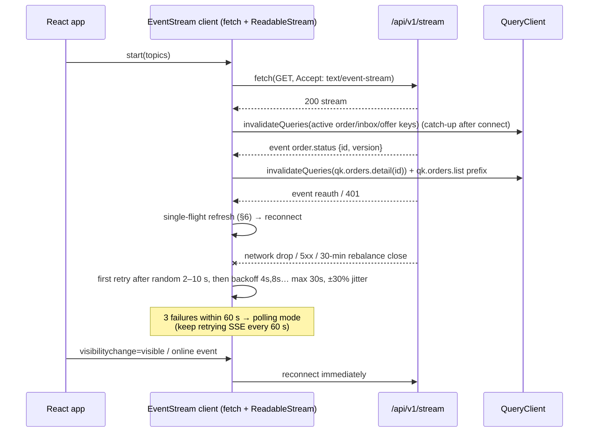

# 17 — Frontend Architecture

| | |
|---|---|
| **Purpose** | Define how rovo's web frontends are built: framework decision (challenge of baseline P7), app/package layout, routing, state, real-time, auth handling, forms, design system, i18n, images, performance, accessibility, analytics, error tracking, maps, configuration, build and deploy outputs. |
| **Owner** | Frontend Architect |
| **Status** | Draft v1.1 — reconciled with review (31) and rulings R1–R48, 2026-10-04 |
| **Depends on** | `00-planning-baseline.md` (P2, P3, P7, P8, P9, P12, P13, P17; rulings R10, R12, R14, R17, R24, R27, R33, R36, R37, R44), `04`–`07` (UX workflows → route lists), `11-api-specification.md` (OpenAPI, SSE event names, error format), `12-auth-rbac.md` (cookies, CSRF, roles), `13-order-state-machine.md`, `14-payment-architecture.md` (checkout and CSP domains), `15-notification-architecture.md` (Web Push, SMS escalation), `16-delivery-zone-architecture.md` (pin-drop, serviceability), `00` §4a (production on a hyperscaler in an India region; free hosting only for dev/preview), `08-system-architecture.md` (single SSE stream, no replay buffer), `22-deployment-architecture.md` (CDN + object storage, path routing), `25-free-hosting-comparison.md` (preview hosting only), `24-observability-strategy.md` (Grafana Faro for frontend errors/RUM, R36) |
| **Companion** | `18-mobile-pwa-strategy.md` (service worker, offline, push, native path) |

Tags: `[ASSUMPTION]` = believed true, verify; `[OPEN]` = decision pending; `[LEGAL]` = needs legal review. All web sources were accessed **2026-10-04** unless stated otherwise.

**Changes in v1.1** (review 31 + rulings R1–R48):
- **Build-time prerendering cut** (R33, C3, RV-080): no TanStack Start, no nightly rebuild and no CI dependency on production data. Static OG/meta tags go in each SPA's `index.html`. Restaurant share links `/r/{slug}` get a small **Go-served HTML page** with OG tags plus a redirect into the SPA (**P1**) (§1.3, §3.1, §15).
- Four apps under **`web/`** (R14): `web/apps/{customer,restaurant,rider,admin}` and `web/packages/*` (§2).
- Same-origin `/api/v1` on every host via CloudFront; no CORS and no browser `api.` host (R27). Doc 12 now splits the audience into `restaurant`/`rider`, which closes the §6 `[OPEN]` (§6, §15.1).
- SSE: no `Last-Event-ID`; `reauth` only on session revocation; 30-min stream cap; reconnect jitter 2–10 s (R10, RV-011, RV-038) (§5).
- Translatable fields: API returns `nameI18n` + resolved `displayName` (R17); `name_te` usage replaced (§3.2, §4.2, §10).
- Quote/order contract per R12: `quoteId` + `Idempotency-Key` only; `409 QUOTE_CHANGED` / `QUOTE_EXPIRED` (§4.3).
- Frontend errors and RUM go to **Grafana Faro**; **no Sentry in V1** (R36, C11) (§13.3).
- Admin edge: TOTP + WAF rate and geo-IN rules; **no identity-aware proxy** (R37, C4) (F3, §1.4).
- Restaurant counter devices get device-bound sessions (30 d sliding / 90 d absolute); riders 30 d sliding (R44) (§6).
- Rider offline queue limited to pickup/deliver (C12); no Telugu romanisation in search (C17); no pinless addresses (R13, RV-056); dev/preview is local Docker only (R24, RV-019); local PMTiles stub (RV-021).

---

## 0. Summary of decisions

| # | Decision | Status vs baseline |
|---|---|---|
| F1 | **Vite + React 19 + TypeScript SPA/PWA**, static output only, no frontend server runtime. In production the files are served from **object storage + CloudFront** (S3 + CloudFront, R23). **No build-time prerendering** (R33, C3): each SPA's `index.html` carries static OG/meta tags, and restaurant share links `/r/{slug}` are served by a small Go handler in the API with per-restaurant OG tags plus a redirect into the SPA (**P1**). | **P7 CONFIRMED** (v1 prerender amendment withdrawn) |
| F2 | **Four apps, not three** (R14): `web/apps/customer`, `web/apps/restaurant`, `web/apps/rider`, `web/apps/admin` on hosts `app.`, `restaurant.`, `rider.`, `admin.`. The baseline "partner" app is split into restaurant and rider apps. | **P7 CHANGED** (app split; ratified by R14) |
| F3 | **Admin is deployed separately** on its own origin (`admin.<domain>`). It has no service worker and gets a stricter CSP. Edge protection is AWS WAF **rate rules plus a geo = India rule** on the admin host, in front of the app's own email + password + **mandatory TOTP** login; passkeys are P1. **No identity-aware proxy in V1** (R37, C4). | New (R37) |
| F4 | **Every app calls the API on its own origin under `/api/v1`** (R15, R27). CloudFront routes `/api/*` to the API ALB and everything else to the bucket. Cross-origin calls are avoided so that patchy 4G does not pay for CORS preflights, and cookies stay host-only. There is no browser-facing `api.` host and no CORS in V1. | Aligned with doc 12 AUTH-D03. **Requirement on DevOps** (§15) |
| F5 | TanStack Router + TanStack Query, Tailwind, Radix primitives (shadcn-style, copied in), i18next, vite-plugin-pwa, openapi-typescript + openapi-fetch. | P8 CONFIRMED |
| F6 | **No server-side cart in V1.** The cart is held on the client (one restaurant per cart) and persisted in `localStorage`. A stateless server **quote** endpoint returns the authoritative totals. | Decision (Backend to confirm) |
| F7 | One SSE connection per app tab (`GET /api/v1/stream?topics=…`, R10), using a small fetch-based client with reconnect, jittered backoff and `reauth` handling. **No `Last-Event-ID`, no replay** (R10): on every reconnect the client refetches the active order/inbox/offer queries. Each event **invalidates TanStack Query keys**; it does not patch the cache. Polling is the fallback. | P3 CONFIRMED |
| F8 | Self-hosted fonts: system font for Latin text, **Noto Sans Telugu subset** loaded only when Telugu glyphs are on the page. | New |
| F9 | Images are **resized into variants by a resize-on-upload worker job** and stored in S3-compatible object storage behind the CDN. The cloud's on-the-fly image service is the alternative. `[OPEN — review 31 minor drift: Go has no stdlib WebP encoder, so a server pipeline needs cgo/libvips. Reviewer proposal: the client produces the WebP variants and the server validates and re-encodes JPEG only. Decide with doc 08 in Phase 2 week 1.]` | New (requirement on Backend; amends doc 08 "no server-side image pipeline") |
| F10 | MapLibre GL JS. Production: a **self-hosted Protomaps PMTiles extract** in S3 behind the CDN (§14). Local Compose: a small Mahabubnagar PMTiles extract served by MinIO, so dev runs offline (RV-021). OpenFreeMap only as a configurable emergency fallback. The map is lazy-loaded only on address screens and in admin zone editing. | P13 CONFIRMED |

---

## 1. Framework evaluation (challenge of P7)

### 1.1 What the customer app actually needs

- **Discoverability in a city of about 2–2.5 lakh people.** [ASSUMPTION] Most first visits will come from:
  1. WhatsApp/Instagram shares and restaurant QR codes or posters (deep links to a restaurant page). These need **real HTML `<meta>`/Open Graph tags** because link-preview crawlers generally do not run JavaScript. [ASSUMPTION – widely observed behaviour; verify WhatsApp preview with a real share in Phase 2.]
  2. Google searches such as "biryani delivery Mahabubnagar" or "<restaurant name> menu". Google renders JavaScript but puts pages in a **render queue**. Its own guidance is that server-rendered or prerendered HTML is the more reliable path, and it notes the soft-404 problems of client-routed SPAs ([Google Search Central – JavaScript SEO basics](https://developers.google.com/search/docs/crawling-indexing/javascript/javascript-seo-basics)).
  3. Our Google Business Profile and word of mouth. Neither depends on the frontend framework.
- **The number of SEO pages is small and slow-moving.** About 50–200 restaurants [ASSUMPTION], one city page, and the home page. Menus change daily, but an SEO snapshot only needs to be about a day fresh. Authoritative prices come from the API at checkout anyway.
- **Everything else needs login or location**: cart, checkout, order tracking, account. These pages gain nothing from SSR.
- **First load on low-end Android over patchy 4G.** The visits that matter most are **repeat visits**. After the first visit, a precached app shell served by the service worker beats any SSR round-trip. The first visit is mostly a restaurant page arriving from a shared link; the Go share page supplies the preview and redirects into the SPA (R33).

### 1.2 Options compared

| Criterion | A. Vite SPA + static OG + Go share page (**chosen**; v1 evaluated it with build-time prerender, cut by R33) | B. Next.js App Router (SSR/RSC) | C. React Router v7 framework mode | D. Astro + React islands |
|---|---|---|---|---|
| SEO / link previews | Good enough for V1: link previews via static OG and the Go share page `/r/{slug}`; Google indexing of menus is weaker without prerender (accepted, R33). App pages are noindex. | Best: per-request HTML | Good: SSR, or `ssr:false` + `prerender` for static files ([RR docs](https://reactrouter.com/7.18.3/how-to/pre-rendering.md)) | Excellent for content pages |
| First visit on low-end Android | Prerendered pages paint before JS runs. JS budget ≤ 170 KB gzip. | Good FCP. App Router runtime and RSC payload add JS weight [ASSUMPTION ~90–110 KB gzip framework baseline – measure]. Hydration costs CPU on low-end phones. | Similar to A in SPA+prerender mode; similar to B with SSR | Best for static pages. App flows still ship React islands. |
| Repeat visits / PWA / offline | Best: precached shell is instant and offline-capable | Harder: SSR HTML is not precacheable as a shell, so it needs network-first navigation and a custom offline page | Good in SPA mode | Awkward: multi-page app plus islands. Shared state across pages needs extra work. |
| Production hosting cost and ops (hyperscaler, India region, per `00` §4a) | **Static files in object storage + CDN.** Cost is close to zero at our scale. For example, the CloudFront flat-rate **Pro plan is $15/month for 10M requests and 50 TB**, and there is also a $0 Free plan with 1M requests and 100 GB ([CloudFront pricing](https://aws.amazon.com/cloudfront/pricing/)). Nothing to patch, scale or keep warm. The same artifact works on any cloud CDN and on free preview hosts. | Needs a **Node SSR runtime as another managed container service** (ECS Fargate / Cloud Run / Container Apps), with ≥ 2 tasks for HA behind the load balancer. Indicative: 2 × (0.5 vCPU, 1 GB) ARM Fargate tasks ≈ **$29/month at US-East list prices** (ARM $0.0000089944/vCPU-s, $0.0000009889/GB-s ([Fargate pricing](https://aws.amazon.com/fargate/pricing/))). Mumbai prices differ [ASSUMPTION – use the AWS calculator]. Add ALB rules, autoscaling, image builds, CVE patching of the Node base image, health checks, logs/traces and on-call for a second runtime. Cloud Run with min instances avoids cold starts but bills idle time. **Preview-only note:** free hosts restrict SSR. Vercel Hobby is "non-commercial personal use only" ([Vercel](https://vercel.com/docs/limits/fair-use-guidelines)). Cloudflare Workers Free allows 100k requests/day and 10 ms CPU ([CF](https://developers.cloudflare.com/workers/platform/limits/)). Netlify Free pauses sites when its 300 credits run out ([Netlify](https://docs.netlify.com/manage/accounts-and-billing/billing/billing-for-credit-based-plans/how-credits-work/)). So SSR also makes previews harder. | SSR mode has the same runtime cost as B. SPA+prerender mode has the same cost as A. | Static mode has the same cost as A |
| Operational simplicity | Highest: `dist/` → bucket sync + CDN invalidation of `index.html`/`sw.js` | Lowest (second runtime, ISR/cache semantics, CDN↔SSR cache coordination) | Medium | Medium (two paradigms) |
| Code sharing with a future Expo app | Shared via **framework-agnostic TS packages** (api-client, domain, i18n, utils, zod schemas). Same for all options. | Same. RSC/server actions are **not** reusable in React Native, so it is slightly worse. | Same as A | Same as A |
| Fit with P8 (TanStack Router/Query) | Native | Replaces the router | Replaces the router (RR7) | Partial |
| Team learning curve | Lowest | Highest (RSC, caching model) | Medium | Medium |

Expo Router can output web from the same codebase. Its static rendering, though, needs `generateStaticParams` for dynamic routes and gives up request-time rendering ([Expo docs](https://docs.expo.dev/router/web/static-rendering/)). React Native Web's bundle weight and DX are also a poor fit for the admin and restaurant web apps. **We do not use Expo for web in V1.**

### 1.3 Recommendation (firm; amended in v1.1 by R33)

**P7 is CONFIRMED.** All apps are Vite + React SPAs and the output is static only. **Build-time prerendering is cut from V1** (R33, C3, RV-080). In a city of 2–2.5 lakh people, acquisition is word of mouth and WhatsApp shares, which need **OG tags only**. V1 therefore ships:

- **Static OG/meta in each SPA's `index.html`** (title, description, OG image, `hreflang`; non-public apps add `noindex`).
- **Restaurant share page (P1):** `GET /r/{slug}` is served by a small Go handler in the API (CloudFront behaviour `/r/*` → ALB, short edge cache). It returns a tiny HTML document with the restaurant's `<title>`, description, OG/Twitter tags and image, then redirects (meta refresh + JS) to the SPA route `/{city}/r/{slug}`. No CI job and no production-data dependency.

**Withdrawn v1.1 (kept for reference if SSR/SEO triggers fire):** the customer app would have prerendered these public routes at build time:

- `/` (landing with city entry)
- `/{citySlug}` (e.g. `/mahabubnagar`: restaurant list snapshot)
- `/{citySlug}/r/{restaurantSlug}` (restaurant page: name, cuisines, locality, rating, opening hours, menu snapshot with names and prices, veg markers)
- `/legal/*`, `/about`

Each prerendered page contains `<title>`, `<meta name="description">`, canonical URL, Open Graph/Twitter tags with a restaurant image, `hreflang` (en/te), and **JSON-LD** (`Restaurant` with `servesCuisine`, `address`, `openingHoursSpecification`, `hasMenu`). The SPA then takes over. Every non-public route carries `<meta name="robots" content="noindex">`.

**Prerender mechanism (withdrawn v1.1, R33).** It would have been decided by a 2-day spike:

1. **Preferred:** TanStack Start in **SPA mode with static prerendering**. It uses the same TanStack Router route tree and loaders, crawls links, accepts an explicit `pages` list, and produces static output ([TanStack Start static prerendering](https://tanstack.com/start/latest/docs/framework/react/guide/static-prerendering)). Risk: Start was announced as v1.0 **RC** on 2025-09-23 ([TanStack blog](https://tanstack.com/blog/announcing-tanstack-start-v1)). [OPEN] Confirm it is stable at Phase 2 start and that SPA mode plus prerender emits both a shell and per-route HTML.
2. **Fallback, independent of any framework:** a ~200-line Node build script. It fetches `GET /api/v1/public/cities/{city}/restaurants` and each restaurant's public menu, then renders a small set of **SEO view components** with `react-dom/server` into `dist/{city}/r/{slug}/index.html` (with the same CSS). The SPA mounts with `createRoot`, replacing the prerendered markup with identical layout, so there is no hydration contract to maintain.
3. React Router v7 framework mode (`ssr:false` + `prerender`) is the documented alternative if both of the above fail. It would mean switching routers in all apps, which costs consistency.

**Freshness (withdrawn v1.1).** The nightly rebuild and `repository_dispatch` hook are not built. The Go share page reads live data on each request, so it has no freshness problem.

**When we would revisit SSR or prerendering:** more than 3 cities with more than 1,000 indexable pages, or Search Console showing real indexing failures for prerendered pages, or a product need for per-request personalised HTML. Until then, an SSR tier adds a managed container service (cost, patching, scaling, on-call) for no V1 benefit. Note that the Go API already runs as a managed container. If SSR is needed later, React Router v7 or TanStack Start in SSR mode on the same container platform is the upgrade path, and the route components carry over.

### 1.4 App split decision

| Question | Decision | Reasoning |
|---|---|---|
| Partner = one app or two? | **Two apps: `web/apps/restaurant` and `web/apps/rider`** on separate origins (`restaurant.<domain>`, `rider.<domain>`) (R14). | Different devices (a shared tablet or cheap phone, often landscape, vs a personal phone in portrait on a two-wheeler). Different permissions (audio, wake lock and notifications vs geolocation, wake lock and notifications). Different PWA identities: separate install name and icon, separate Web Push subscription per origin, and separate Trusted Web Activity packages for Play (doc 18). Different update cadences. Smaller bundles. A combined app would ship the rider's geolocation and offer code to restaurant tablets and the reverse. The cost is one extra Vite build **plus** one more CDN host with `/api/*` routing, WAF association, bucket prefix, manifest, SW update flow, Lighthouse budget and Playwright profile (RV-009). Accepted by R14. |
| Separate admin deploy? | **Yes.** `admin.<domain>`, separate build artifact, separate CSP, no service worker. Edge protection is AWS WAF rate rules on admin auth plus a geo = India rule on the admin host; **no identity-aware proxy** (R37, doc 12 §3.5). The admin API (`/api/v1/admin/*`) only accepts requests that come through the admin origin (Origin + `Sec-Fetch-Site: same-origin` checks, see §6). | Security isolation: an XSS bug in the customer app can never load admin code or ride admin cookies, because cookies are host-only per app origin and the admin API rejects other origins. Admin can ship stricter headers (Trusted Types) without constraining the customer app. |
| [OPEN] Separate registrable domain for admin (e.g. `rovo-ops.in`)? | Optional hardening (~₹1,000/yr). Recommended before any second city. | Removes the "same-site" relationship between subdomains entirely. |

---

## 2. Workspace layout (pnpm, under `web/` per R14)

```
rovo/web/
├─ apps/
│  ├─ customer/      # rovo — customer SPA/PWA (static OG in index.html)
│  ├─ restaurant/    # rovo Partner — restaurant inbox/menu PWA (tablet-first)
│  ├─ rider/         # rovo Delivery Partner — rider PWA (phone-first)
│  └─ admin/         # rovo Admin — desktop SPA, no service worker
└─ packages/
   ├─ api-client/    # generated from OpenAPI 3.1: types + openapi-fetch client + query-key factories + SSE wrapper
   ├─ domain/        # pure TS: order/delivery status helpers, cart math preview, ETA text, role checks (no DOM, RN-safe)
   ├─ ui/            # React DOM components: Radix-based primitives, tokens → Tailwind, icons, VegMark, Money, StatusPill
   ├─ i18n/          # i18next setup, en/te catalogs per namespace, formatters (wraps utils), language detector
   ├─ utils/         # money (paise ↔ display), phone (E.164, IN mobile), address formatting, dates (Asia/Kolkata), idempotency keys
   ├─ pwa/           # SW helpers: Workbox route configs, update prompt hook, push subscribe helper, wake-lock & audio-unlock hooks
   ├─ testing/       # MSW handlers generated from OpenAPI examples, test-id helpers, Playwright fixtures
   └─ config/        # eslint flat config, tsconfig bases, tailwind preset (tokens), vite base config, size-limit presets
```

Dependency rules, enforced with ESLint `import/no-restricted-paths` or dependency-cruiser:



- `utils`, `domain`, `api-client` (the fetch-based SSE client works in React Native too) and the i18n **catalogs** must be **free of DOM APIs**. These are the packages a future Expo app reuses (doc 18 §10).
- No app imports from another app. Admin-only components live in `apps/admin`, not in `packages/ui`.
- Versions are pinned through `pnpm` catalogs. One React version is used across the workspace.

### 2.1 `packages/api-client`

- **Generation:** `openapi-typescript` turns the OpenAPI spec (location per doc 26) into `schema.d.ts`. `openapi-fetch` provides a typed `createClient<paths>()`. It is regenerated in CI, and a failing diff blocks the PR ("contract drift").
- **Middleware chain:** base URL `/api/v1` → `Accept-Language` from i18n → `X-Rovo-Client: customer-web|restaurant-web|rider-web|admin-web` on unsafe methods (CSRF layer per doc 12 AUTH-D06) → `Idempotency-Key` on every POST that creates something (UUIDv7 generated **per user intent**, kept until success so retries reuse it) → `X-Rovo-App-Version: customer/1.4.2` (telemetry and min-version checks) → 401 handling (single-flight refresh, §6) → maps `application/problem+json` (RFC 9457) to a typed `ApiError { status, code, title, detail, fieldErrors[] }`.
- **Auth transport adapter:** `cookie` (web: `credentials: 'same-origin'`) or `bearer` (future native: reads and writes tokens through an injected `TokenStore`). This keeps one client for web and React Native.
- **Query key factories** (§4.2), **SSE client** (§5) and the **event → invalidation map** live here so all apps share them.

### 2.2 `packages/utils` (selected functions)

| Function | Behaviour |
|---|---|
| `formatMoney(paise: bigint \| number, locale)` | Integer paise to rupees without float arithmetic: `Intl.NumberFormat('en-IN', {style:'currency', currency:'INR', minimumFractionDigits: paise % 100 === 0 ? 0 : 2})`. Example: `12345650` → `₹1,23,456.50`; `14900` → `₹149`. Rounding to whole rupees in totals stays [OPEN] per baseline §3. |
| `formatNumber(n, locale)` | Lakh/crore grouping via `en-IN`/`te-IN`. `te-IN` uses Latin digits by default [ASSUMPTION – verify on Android Chrome ICU; fall back to `en-IN` when `Intl.NumberFormat.supportedLocalesOf('te-IN')` is empty]. |
| `parseIndianMobile(input)` | Strips spaces, `0`, `+91` and `91`, then validates `^[6-9]\d{9}$` and returns E.164. Uses `libphonenumber-js/min` (metadata ~ 40 KB) only in admin. Customer and partner apps use the light regex validator, because V1 is India-only. |
| `formatAddress(addr, {short})` | `"Flat 2, Sai Residency, Near Clock Tower, New Town, Mahabubnagar 509001"`. The short form is `"New Town · near Clock Tower"`. |
| `formatTime(ts, cityTz)` | Always formats in the **city** time zone (`Asia/Kolkata`), never the device time zone. |
| `newIdempotencyKey()` | UUIDv7. |

---

## 3. Routing maps

TanStack Router with **file-based routes**, typed search params validated with zod, and `beforeLoad` guards. Route-level code splitting (`autoCodeSplitting`). Intent preloading on `touchstart`/hover for list → detail links.

### 3.1 Customer (`apps/customer`, origin `app.<domain>`; apex redirects here [OPEN])

| Route | Auth | Notes |
|---|---|---|
| `/` | public | City entry, "deliver to" locality picker, app install CTA (static OG in `index.html`) |
| `/$city` | public | Restaurant list (open/closed, ETA band, veg-only filter, cuisine chips) |
| `/$city/r/$restaurantSlug` | public | Menu, categories, item sheet, add to cart. Search params `?item=` deep-link an item. Target of the Go share page `/r/{slug}` (P1, served by the API, not the SPA). |
| `/$city/search?q=` | public | Restaurant and dish search (en + te fields via `nameI18n`; no Telugu romanisation, C17) |
| `/cart` | public | Client cart. Calls quote when a location is set. |
| `/login` → `/login/verify` | guest-only | Phone + OTP (`autocomplete="one-time-code"`, WebOTP on Android Chrome) |
| `/checkout` | CUSTOMER | Address select/add, quote, tip [OPEN product], COD/online choice, place order |
| `/checkout/pay/$orderId` | CUSTOMER | Payment handoff (PA checkout), also the **return target** after UPI app switching or a page reload |
| `/orders` | CUSTOMER | Order history |
| `/orders/$orderId` | CUSTOMER | Live tracking timeline (milestones, not a live map: P12), call restaurant/rider, cancel if allowed |
| `/orders/$orderId/rate` | CUSTOMER | Restaurant and rider ratings |
| `/orders/$orderId/help` | CUSTOMER | Issue reporting, refund status |
| `/account` | CUSTOMER | Profile, language |
| `/account/addresses`, `/account/addresses/new`, `/account/addresses/$id` | CUSTOMER | **Map pin-drop (lazy MapLibre chunk)** |
| `/account/privacy` | CUSTOMER | DPDP: consents, data export request, account deletion, grievance officer link [LEGAL] |
| `/legal/terms`, `/legal/privacy`, `/legal/refunds`, `/about` | public | |
| `*` | | 404 component (`noindex`) |

### 3.2 Restaurant (`apps/restaurant`, origin `restaurant.<domain>`, UI name "rovo Partner")

| Route | Roles | Notes |
|---|---|---|
| `/login`, `/login/verify` | guest | Phone + OTP |
| `/outlets` | OWNER, STAFF | Choose outlet when the user has more than one. The selected outlet is stored per device. |
| `/start` | OWNER, STAFF | **"Start shift" screen**: one tap unlocks audio, takes the wake lock, checks notification permission, connects SSE (doc 18 §7) |
| `/inbox` | OWNER, STAFF | **Live new-order inbox** (repeating alert until accept/reject) plus columns for Preparing and Ready |
| `/orders/$orderId` | OWNER, STAFF | Details, KOT print view (`window.print`, 58/80 mm CSS) [OPEN: Bluetooth printers deferred], mark ready |
| `/orders?status=&date=` | OWNER, STAFF | History |
| `/availability` | OWNER, STAFF | Outlet open/pause toggle, item in/out of stock |
| `/menu`, `/menu/categories`, `/menu/items/$itemId`, `/menu/items/new` | OWNER | Menu editor incl. `nameI18n` (en + te), veg flag, price, packaging, photos |
| `/devices` | OWNER | Order-receiver devices: register this device, list, revoke (R44, doc 12 §3.4) |
| `/hours` | OWNER | Weekly hours, holidays |
| `/payouts`, `/payouts/$payoutId` | OWNER | Statements, commission breakdown |
| `/profile` | OWNER | FSSAI no., GSTIN, bank details (masked) [LEGAL] |
| `/staff` | OWNER | Invite or remove staff phone numbers |
| `/settings/alerts` | OWNER, STAFF | Alert self-test (sound, push, wake lock, battery advice) |
| `/help` | all | |

### 3.3 Rider (`apps/rider`, origin `rider.<domain>`, UI name "rovo Delivery Partner")

| Route | Notes |
|---|---|
| `/login`, `/login/verify` | Phone + OTP |
| `/onboarding` | Document status, permissions checklist (location, notifications), install prompt |
| `/` (home) | **Online/offline toggle** (requires a fresh location fix), current state, today's earnings, cash in hand vs limit. While online and backgrounded the rider stays reachable by push (dispatch tier 2, R34); auto-offline after 15 min with no ping/heartbeat (doc 13 owns values). |
| `/offers/$offerId` | Offer card with 45 s countdown, accept/decline, distance and pay estimate |
| `/deliveries/$deliveryId` | Step flow: navigate to restaurant → `AT_RESTAURANT` → `PICKED_UP` → navigate to customer → `AT_DROP` → `DELIVERED` (COD amount collected; delivery code for prepaid ≥ ₹300, R39) / `FAILED` with reason (support approval for `UNDELIVERABLE`, R5). Only `PICKED_UP` and `DELIVERED` may be queued offline (C12, doc 18 §4.3). Google Maps deep links, tel: links. |
| `/earnings`, `/earnings/$weekId` | Pay breakdown |
| `/cash` | COD cash in hand, deposit history |
| `/history` | |
| `/profile`, `/settings` | Language, permissions re-check, battery advice |
| `/help` | |

### 3.4 Admin (`apps/admin`, origin `admin.<domain>`)

| Route | Roles (default) |
|---|---|
| `/login` → `/login/totp` | guest |
| `/` dashboard (today's orders, SLA breaches, online riders, offline restaurants) | all admin |
| `/live` live order board (SSE), `/orders`, `/orders/$id` (timeline, refunds, cancel) | OPS, SUPPORT (read), SUPER |
| `/dispatch` unassigned deliveries, manual assign | OPS |
| `/restaurants`, `/restaurants/new`, `/restaurants/$id/{profile,menu,commission,documents,hours,payouts}` | OPS; commission → FINANCE |
| `/riders`, `/riders/$id`, `/riders/$id/cash` | OPS; cash → FINANCE |
| `/customers`, `/customers/$id` (masked PII, reveal is audited) | SUPPORT |
| `/support/tickets`, `/support/tickets/$id` | SUPPORT |
| `/zones` (polygon editor: MapLibre + terra-draw [ASSUMPTION library choice]), `/localities` | OPS |
| `/pricing`, `/coupons` | OPS/FINANCE (fee/commission changes are maker-checker, R31) |
| `/approvals` (maker-checker queue, break-glass post-review) | FINANCE, SUPER |
| `/finance/payouts`, `/finance/ledger`, `/finance/refunds`, `/finance/cod-deposits` | FINANCE |
| `/cities`, `/admins` (users, roles, city scopes), `/audit-log`, `/settings/flags`, `/settings/notification-templates` | SUPER |

Each route declares `staticData: { roles: [...] }`. A root `beforeLoad` enforces the roles, and the nav menu is filtered by the same data. **The server remains the authority.** Frontend guards are UX only.

---

## 4. State management

### 4.1 Principles

1. **Server state = TanStack Query.** No Redux.
2. **Client state is minimal.** It covers the cart, the selected location/locality, language, the restaurant's selected outlet, the rider's narrow offline outbox (pickup/deliver only, C12; doc 18), and UI preferences. It uses **Zustand** (~1 KB) with the `persist` middleware on `localStorage`. Every read is wrapped in try/catch with an in-memory fallback.
3. Form state = react-hook-form (§7). URL state (filters, tabs, pagination) = typed search params.

### 4.2 Query key conventions

Keys are hierarchical arrays built **only** through factories in `packages/api-client/src/keys.ts`, so invalidation can target a prefix:

```ts
export const qk = {
  me:          ()                    => ['me'] as const,
  restaurants: {
    all:       ()                    => ['restaurants'] as const,
    list:      (city: string, f: RestaurantFilters) => ['restaurants', 'list', city, f] as const,
    detail:    (slug: string)        => ['restaurants', 'detail', slug] as const,
    menu:      (id: string)          => ['restaurants', id, 'menu'] as const,
  },
  orders: {
    all:       ()                    => ['orders'] as const,
    list:      (f: OrderFilters)     => ['orders', 'list', f] as const,
    detail:    (id: string)          => ['orders', 'detail', id] as const,
  },
  inbox:       (restaurantId: string)=> ['inbox', restaurantId] as const,     // restaurant app
  rider: { state: () => ['rider', 'state'] as const, offer: (id: string) => ['rider', 'offer', id] as const,
           delivery: (id: string) => ['rider', 'delivery', id] as const },
  quote:       (hash: string)        => ['quote', hash] as const,             // cart hash
  config:      ()                    => ['client-config'] as const,           // flags, min version
};
```

- The **locale is not part of keys.** The API returns translatable fields as `nameI18n` (`{en, te}`) **plus** a resolved `displayName` for the request's `Accept-Language` (R17). The UI renders from `nameI18n[lang] ?? displayName`, so a language switch needs no refetch; `displayName` serves simple screens and future native clients.
- Defaults:

  | Setting | Value |
  |---|---|
  | `staleTime` | 30 s; menus 5 min; config 10 min |
  | `gcTime` | 10 min |
  | `retry` (GET) | 2 with exponential backoff and jitter |
  | `retry` (mutations) | 0, except mutations carrying an `Idempotency-Key` that failed on network, which may be retried by the user tapping "Retry" |
  | `refetchOnWindowFocus` | true (important when riders and restaurants switch apps) |
  | `networkMode` | `'online'` |

- **No persistence of the Query cache to disk in V1.** It would only add PII on shared devices, and the service worker covers offline menu browsing (doc 18).

### 4.3 Cart (decision F6)

| Aspect | Decision |
|---|---|
| Where | Client store `cart` (Zustand + persist, key `rovo.cart.v1`), one restaurant per cart. Adding from another restaurant opens a "Replace cart?" dialog. |
| Contents | `{ restaurantId, items: [{ itemId, variantId?, addonIds[], qty, note? }], updatedAt }`. **No prices are trusted from the client.** Prices shown before the quote come from the cached menu. |
| Authority | `POST /api/v1/cart/quote` (works for guests too) returns line prices, availability, fees (delivery, platform, small-cart, packaging), taxes, discount, `ROUND_OFF` line and whole-rupee total (R8), a signed `quoteId` for a 10-min stored quote and `expiresAt`, plus `serviceable` for the address pin (R12). `POST /api/v1/orders` takes **only** `quoteId` + `Idempotency-Key` (11 §1.8). If anything changed the server returns `409 QUOTE_CHANGED` (with a diff and a fresh quote) or `409 QUOTE_EXPIRED`. |
| Why no server cart | No cross-device cart need in V1. It avoids cart-merge logic at login, works while offline-browsing, and means fewer endpoints. Cost: no abandoned-cart analytics. Ratified by R12. |
| Expiry | The cart is cleared after a successful order, or when older than 24 h, or when the restaurant's menu version changes (items removed are shown as "no longer available"). |

---

## 5. Real-time integration (SSE)

### 5.1 Endpoint and events (aligned with R10, doc 08 §Real-time and doc 12 §4.7)

- **One stream per tab:** `GET /api/v1/stream?topics=…` on the app's own host. It is same-origin, so cookies are sent automatically, and **no tokens appear in URLs**. The server derives the allowed topics from the principal. The client narrows them:

  | App | Topics |
  |---|---|
  | customer | `order:{id}` for active orders |
  | restaurant | `inbox:{restaurant_id}` |
  | rider | `offers`, `delivery:{id}` |
  | admin | `ops:{city_id}` |

- **Events** (names owned by docs 08/11; examples):

  | App | Events |
  |---|---|
  | customer | `order.status` |
  | restaurant | `order.placed` and cancellations |
  | rider | offer created/expired, delivery cancelled, rider state changed (e.g. blocked by cash limit) |
  | admin | ops alerts, restaurant presence |

- **Control messages:**
  - `: ping` comment line every **20 s** (doc 08). This keeps the stream alive under the CDN/LB idle limits: CloudFront's origin read timeout defaults to **30 s** and can be configured up to 180 s ([AWS, 2025-07](https://aws.amazon.com/about-aws/whats-new/2025/07/amazon-cloudfront-origin-response-timeout-controls/)); Cloudflare cuts idle streams at ~100 s ([community](https://community.cloudflare.com/t/100-second-proxy-read-timeout-524-gateway-error-increase/684447)).
  - `event: reauth`: sent only when the server-side session is revoked, expired or blocked (doc 12 §4.7, RV-011). The stream otherwise outlives the 10-min access token. The server also closes every stream at **30 min** for load rebalancing; the client simply reconnects.
- **Payloads are thin invalidation hints**: `{ type, id, version, occurred_at }`. The client refetches entities via REST, so SSE never becomes a second data contract.
- **No server-side replay buffer in V1** (R10). The client does **not** send `Last-Event-ID`; events carry `version` so the client can drop stale duplicates itself. **On every (re)connect the client refetches only the active order/inbox/offer queries** (not every query in the cache), which limits reconnect storms after deploys or DB failover (RV-038). Missed events are harmless by design.

### 5.2 Client (`createEventStream` in `packages/api-client`)



- **Fetch-based client.** It is our own ~2 KB parser over `fetch` + `ReadableStream`, not native `EventSource`. That gives us HTTP status visibility (401 → refresh, 403 → stop), custom headers, our own jittered backoff, and an `AbortController`. Doc 12 suggested `@microsoft/fetch-event-source`; we write our own small client instead because that library has not been actively maintained [ASSUMPTION – last release 2021; verify]. It is unit-tested against the SSE spec's parsing rules (multi-line `data:`, comments, `retry:`).
- **Event → invalidation map** (in `api-client/src/realtime.ts`). Example: `order.status → [qk.orders.detail(id), qk.orders.list prefix, qk.inbox(restaurantId)]`. **The cache is never patched from event payloads.** Invalidation plus refetch keeps one source of truth and handles out-of-order events.
- **Side effects beyond invalidation:**
  - Restaurant `order.placed` starts the alert loop (doc 18 §7).
  - Rider offer events open the offer screen with its countdown.
  - Both are deduplicated by entity id + version.
- **One stream per tab.** [OPEN] Multi-tab leader election (`BroadcastChannel` + Web Locks) is deferred, because one tab is the norm on phones.
- **Hidden-tab policy:**

  | App | Policy |
  |---|---|
  | customer | Closes the stream after 60 s hidden. On visible it reconnects and refetches (saves battery and data). |
  | restaurant | **Keep the stream open.** The counter device is meant to stay foregrounded (doc 18 §7). SSE presence counts as the restaurant heartbeat (R27); the app sends a 60 s REST heartbeat only while SSE is down. |
  | rider | Keep the stream open while foregrounded. When the OS freezes the backgrounded tab the stream dies; the rider stays reachable by **Web Push** (dispatch tier 2, R34) and reconnects + refetches on `visible`. Location pings are batched (1–10 points per request, R27). |

- **Polling fallback** (doc 08 values; Query `refetchInterval` tied to a `useRealtimeHealth()` store):

  | Data | Interval |
  |---|---|
  | Customer order detail | 10 s |
  | Restaurant inbox | 5 s |
  | Rider state/offers | 5 s while online |
  | Admin live board | 15 s |

- A connection-health indicator is shown in restaurant, rider and admin apps (green / amber reconnecting / red offline). It is not shown in the customer app unless offline.

---

## 6. Auth handling (web)

Security Architect (doc 12) owns token lifetimes and cookie attributes. This section is the frontend contract and follows doc 12.

| Topic | Design |
|---|---|
| Transport | **httpOnly, Secure, host-only cookies** on each app host (same-origin `/api/v1`, §15). Access token `__Host-rovo_at`: 10 min (admin 5 min), `SameSite=Lax` (customer/restaurant/rider) or `Strict` (admin). Refresh token `__Secure-rovo_rt`: `Path=/api/v1/auth`, `SameSite=Strict`. JavaScript never sees tokens. |
| Why `Lax` on the access cookie | SMS deep links and the PA return navigation must arrive logged in. Doc 12 adds that the PA's cross-site POST return carries no Lax cookie, so `/checkout/pay/$orderId` must work without assuming a cookie on that first hit. It immediately fetches status with a normal same-origin GET. |
| CSRF (doc 12 AUTH-D06) | The client always sends `X-Rovo-Client` and `Content-Type: application/json` on unsafe methods. The server enforces Fetch-Metadata/Origin checks (`http.CrossOriginProtection`) and SameSite. **No double-submit token.** Uploads go to pre-signed object-storage URLs (doc 08), never through cookie-authenticated multipart. |
| Session bootstrap | The root route `beforeLoad` calls `queryClient.ensureQueryData(qk.me())` → `GET /api/v1/me` (user, roles, scope, `access_expires_at`, locale, consents). 401 → guest. |
| Silent refresh | (a) **Reactive:** on `401 {code:"TOKEN_EXPIRED"}` or SSE `reauth`, a **single-flight** `POST /api/v1/auth/refresh` **across tabs** using the Web Locks API (`navigator.locks.request('rovo-refresh', …)`, with a `BroadcastChannel` fallback), then retry the original request once. `409 refresh_race` → just retry, because the cookie jar already has the new token (doc 12 §4.3). (b) **Proactive:** on `visibilitychange → visible` and 60 s before `access_expires_at`. Refresh failure → clear the Query cache and Zustand stores and go to `/login?redirect=…`. |
| Multi-tab | `BroadcastChannel('rovo-auth')` broadcasts `logout` and `refreshed`. |
| Route guards | `requireAuth(roles[])` in `beforeLoad`: guest → login with a `redirect` search param; wrong role → 403 page. **Each app admits only its own roles.** Doc 12 v1.1 gives each host its own audience (`customer`, `restaurant`, `rider`, `admin`), derived server-side from `Host`, and `RIDER` ⟂ `RESTAURANT_*` (R26). A rider who opens the restaurant app sees "This app is for restaurant partners" with a link to the rider app. (Resolved; was `[OPEN]` in v1.) |
| OTP UX | `inputmode="numeric"`, `autocomplete="one-time-code"`, paste allowed (WCAG 2.2 SC 3.3.8). **WebOTP API** on Android Chrome, using the domain-bound SMS line for the app's own host (`@app.<domain>`, `@restaurant.<domain>`, `@rider.<domain>` + ` #123456`; one DLT template per host, doc 12 §2.2). The bot challenge appears only on risk signals (doc 12 AUTH-D07). Resend timer 30 s. |
| Restaurant counter device | **Device-bound order-receiver session** (R44, doc 12 §3.4): 30-day sliding idle, 90-day absolute, refresh signed with a non-extractable WebCrypto device key, revocable by owner/admin. It never expires mid-service; re-auth is prompted outside service hours only. Staff can "Switch user" without losing the outlet selection. Logout wipes Zustand stores and the Query cache. |
| Rider device | Rider session slides for 30 days (R44); a new device login revokes the previous one. |
| Admin | Email + password + TOTP. Idle timeout 30 min (doc 12). Step-up TOTP for sensitive actions. `Clear-Site-Data` on logout. |

---

## 7. Forms

- **react-hook-form + zod** (`@hookform/resolvers`). The customer app uses **`zod/mini`** to keep bundle weight down [ASSUMPTION: zod v4 mini API stable]. Admin can use full zod.
- **Schemas derived from OpenAPI where possible:**
  - V1 approach: **hand-authored form schemas** in `packages/api-client/src/forms/*.ts`, each **type-checked against the generated request body type**, e.g. `const AddressForm = z.object({...}) satisfies z.ZodType<components['schemas']['AddressCreate']>`. This catches drift at compile time while letting the UI add stricter rules (e.g. landmark recommended, PIN `^5\d{5}$` for Telangana [ASSUMPTION]).
  - [OPEN] spike: generate zod from OpenAPI (`@hey-api/openapi-ts` zod plugin or `openapi-zod-client`) and adopt it if the output is clean and tree-shakeable.
- **Server validation errors** (problem+json `fieldErrors[{field, code}]`) map to `setError(field, {message: t('errors:'+code)})`. Field error codes are translated by the client; server error **codes** are stable and messages are not shown raw.
- Every submit button is disabled while pending. Mutations creating things send `Idempotency-Key` (§2.1). Double-tap protection matters on laggy phones.
- Input types: `inputmode="numeric"` for phone/OTP/PIN/qty, `type="tel"` for phone, `autocomplete` set on name, tel, address-line1 and postal-code.

---

## 8. Error, loading and empty-state patterns

| Situation | Pattern |
|---|---|
| Route data loading | **Skeletons** shaped like the content, not spinners. Route `pendingMs: 150` avoids flashes. Lists render the first 10 items, then the rest with `content-visibility: auto`. |
| Route data error | Route `errorComponent`: friendly message in the current language + **Retry** + "Go home". 404 → not-found component. 403 → "No access". 5xx/network → retry and offline hint. |
| Background refetch error | Keep showing cached data with a subtle "Couldn't refresh · Retry" bar and the "Updated 2 min ago" timestamp. |
| Mutation error | Inline field errors (422), toast for generic errors (Radix Toast, `aria-live="polite"`), **blocking dialog** for business conflicts (`409 QUOTE_CHANGED`, `QUOTE_EXPIRED`, `ORDER_ALREADY_ACCEPTED`, `OFFER_EXPIRED`). |
| Offline | A global `useOnline()` (navigator.onLine + failed-fetch heuristic) shows a top banner "You're offline – showing saved data". Actions requiring network are disabled with an explanation. |
| Empty states | Short text, a lightweight inline SVG (< 2 KB), and one CTA (e.g. "No restaurants deliver here yet – Try another area"). |
| Crash | Top-level React error boundary → Grafana Faro (§13.3) + "Reload app" button that also clears a broken SW if the error repeats (doc 18 §5). |
| Long operations | Optimistic UI only for **reversible, low-risk** toggles (item in/out of stock, outlet pause). **Never** for order acceptance, payments or rider status. Those show pending state until the server confirms. |

---

## 9. Design system (`packages/ui` + Tailwind preset)

- **Tokens** are CSS custom properties defined in `packages/config/tailwind-preset` and mapped to Tailwind theme keys. Categories:
  - colour: `--color-bg`, `--color-surface`, `--color-text`, `--color-muted`, `--color-primary`, `--color-success`, `--color-warning`, `--color-danger`, `--color-veg`, `--color-nonveg`
  - spacing: 4 px scale
  - radius, elevation, motion: `--duration-*`, honouring `prefers-reduced-motion`
  - typography: `--font-sans`, `--font-telugu`
- **Contrast:** text ≥ 4.5:1 and large text ≥ 3:1, verified with an automated token contrast test.
- **Dark mode:** tokens support both themes. V1 ships **light only** for customer, restaurant (bright kitchens, high contrast) and admin. The **rider app follows the system theme**, because night riding and OLED battery savings justify it. Adding dark mode to other apps later is a token switch.
- **Components (copied-in shadcn-style on Radix primitives):**
  - Button (min height 48 px), IconButton (48×48), Input, OtpInput, Select, Sheet (bottom sheet for item details), Dialog, Toast, Tabs, Switch, Badge
  - Domain-specific: StatusPill (order/delivery status → colour + icon + text), Money, Countdown (offer timer, announced to screen readers at 30/10 s), Stepper (rider flow), EmptyState, Skeleton, ConnectionIndicator, **VegMark**
- **Veg / non-veg markers:** follow the Indian convention (FSSAI labelling) [LEGAL – verify current symbol spec in the FSSAI Labelling & Display Regulations]. Veg is a green square outline with a filled green circle. Non-veg is a brown square outline with a filled brown triangle. They are rendered as inline SVG at 14–16 px **plus an accessible name** (`aria-label="Vegetarian"` / `"Non-vegetarian"`, translated), so meaning is never conveyed by colour alone. "Contains egg" is shown as a text tag [OPEN product: whether egg is its own category]. A "Veg only" filter is prominent.
- **Telugu typography:**
  - Font stack: `--font-sans: system-ui, Roboto, "Noto Sans", sans-serif` (no download for Latin on Android). `--font-telugu: "Noto Sans Telugu", "Noto Sans Telugu UI", sans-serif`.
  - Font files: self-hosted **subset WOFF2** (Telugu block U+0C00–0C7F, U+0964–0965, U+200C–200D, U+25CC, plus digits/punctuation), weights 400 and 600. Target ≤ 35 KB per weight [ASSUMPTION; the full variable font is ~101 KB per [Fontsource](https://fontsource.org/fonts/noto-sans-telugu/cdn)]. Declared with `unicode-range` so the browser downloads it **only when Telugu glyphs render**, with `font-display: swap`. Preloaded only when `lang=te`. Licence: SIL OFL.
  - Line-height ≥ 1.6 for Telugu body (stacked vowel signs and conjuncts), no letter-spacing, no uppercase transforms, body ≥ 16 px.
  - Design for **~30–40% text expansion** [ASSUMPTION] and never truncate key labels (prices, status) mid-word. Use `lang="te"` on `<html>` and `lang="en"` on embedded English proper nouns.
- **RTL:** not needed. We still use logical CSS properties (`ms-`, `me-`) for free future-proofing.
- **Icons:** `lucide-react` with per-icon imports (tree-shaken).

---

## 10. Internationalisation (`packages/i18n`)

| Topic | Decision |
|---|---|
| Library | i18next + react-i18next. Translation files are loaded **per namespace, per language, lazily** via dynamic import (Vite chunk). The default namespace is bundled with the shell. |
| Namespaces | `common` (buttons, statuses, errors), `auth`, `catalog`, `cart`, `checkout`, `orders`, `account`, `restaurant`, `rider`, `admin`, `legal`. Each app loads only what it uses. **Admin V1 is English-only** [ASSUMPTION; ops staff], with keys still extracted. |
| Plurals | i18next JSON v4 plural suffixes backed by `Intl.PluralRules` (CLDR: Telugu has `one`/`other`). We do **not** add `i18next-icu`/`intl-messageformat` to the customer bundle. Select-style messages use the `context` feature. |
| Numbers / money / dates | Only via `packages/utils` formatters: `Intl.NumberFormat(locale==='te' ? 'te-IN' : 'en-IN', …)`, `Intl.DateTimeFormat(..., {timeZone: city.timezone})`, `Intl.RelativeTimeFormat` for "5 min ago". Money is always ₹ with lakh grouping. |
| Language choice | First visit: `navigator.languages` contains `te` → Telugu, else English. A visible **EN / తెలుగు toggle** sits in the header (customer) and in settings (partner apps). It is persisted in `localStorage` (`rovo.lang`) and, when logged in, in the profile (`PATCH /me {locale}`) so SMS/push templates match. The `Accept-Language` header follows the choice. |
| Workflow | Source of truth: `packages/i18n/locales/en/*.json`. Keys are extracted with i18next-cli/parser in CI. CI **fails on missing `te` keys** for customer/restaurant/rider and reports them for admin. Telugu translations are done by a native-speaker reviewer, using a **glossary** (keep common loanwords like "order", "delivery" where users expect them [ASSUMPTION – validate with users]). Tooling: plain PRs in V1. [OPEN] Hosted Weblate (libre plan for OSS [ASSUMPTION – verify]) once community contributors appear. |
| Pseudo-locale | `en-XA` (accented, +40% length) in dev/staging to catch hard-coded strings and overflow. |
| User content | Translatable fields (restaurant, category, item names and descriptions) arrive as `nameI18n` / `descriptionI18n` JSONB maps plus resolved `displayName` (R17). The UI shows `nameI18n.te ?? nameI18n.en` in Telugu mode. Search matches the en and te values plus a synonym table; **no romanisation of Telugu names in V1** (C17). **No machine translation in V1.** Restaurants or ops may enter Telugu names manually. |

---

## 11. Images

- **Decision F9: variants are generated by a resize-on-upload worker job.**
  - Flow: the client uploads the original via a **pre-signed PUT** to S3-compatible object storage (doc 08; MinIO locally). The API enqueues a River job, and the `rovo worker` resizes with libvips (`govips` [ASSUMPTION]) and writes the variants.
  - Widths **160, 320, 640, 1024** px.
  - Formats **WebP** (q≈75) + **JPEG** fallback. AVIF is optional later, because it costs more CPU per image.
  - Content-hashed object keys.
  - Served through the CDN on the same app host at `/media/*` (a CDN path behaviour to the media bucket) with `Cache-Control: public, max-age=31536000, immutable`. On a phone over 4G, the same host avoids an extra DNS lookup and TLS handshake. [OPEN – DevOps may prefer one `media.<domain>`.]
- **Alternative (cloud image service):** an on-the-fly transformer in front of the bucket, e.g. AWS's *Dynamic Image Transformation for Amazon CloudFront* (formerly Serverless Image Handler: Lambda + CloudFront, transforms via URL parameters) ([AWS docs](https://docs.aws.amazon.com/solutions/latest/dynamic-image-transformation-for-amazon-cloudfront/solution-overview.html)). It is not chosen for V1:
  - It adds a Lambda/API Gateway stack to operate.
  - It is AWS-specific, which goes against the portability rule in `00` §4a.
  - Our variant set is small and fixed.
  The API contract below hides the choice, so switching later is invisible to the frontend.
- **Not used:** Cloudflare Images. Its free plan includes only 5,000 unique transformations/month ([CF Images pricing](https://developers.cloudflare.com/images/pricing/)). 200 restaurants × 50 items × 4 widths × 2 formats ≈ 80,000 variants, so that would mean a paid plan.
- **Note to doc 08:** it says "client resizes before upload, no server-side image pipeline in V1". We keep the client downscale (bullet below) **and** add the server worker. The worker guarantees consistent variants, strips EXIF and makes WebP. It is a small job that reuses the existing worker.
- The API returns an image object `{ id, alt, dominant_color, variants: { "webp": { "160": url, … }, "jpeg": {…} }, width, height }`.
- The frontend `` component renders `<picture>` with `srcset`/`sizes`, explicit `width`/`height` (no CLS), `loading="lazy"` + `decoding="async"` below the fold, `fetchpriority="high"` for the LCP image (restaurant hero), and the dominant colour as background placeholder (no blurhash JS).
- **Data saver:** if `navigator.connection.saveData` or `effectiveType` is `2g`/`slow-2g`, use the 160/320 variants and no hero images [ASSUMPTION: Network Information API on Android Chrome only].
- Upload (restaurant/admin): client-side downscale to ≤ 2048 px and JPEG q 0.85 with canvas before upload (saves restaurant data), max 5 MB, EXIF stripped server-side.

---

## 12. Performance budgets

Measured in CI with `size-limit` (bundle) and **Lighthouse CI, mobile profile** (Moto G Power-class emulation, slow 4G), and in the field with `web-vitals` RUM beacons (§13).

| Metric | Customer | Restaurant / Rider | Admin |
|---|---|---|---|
| Initial JS (gzip, shell + first route) | **≤ 170 KB** (CI warns at 170, **fails at 200**) | ≤ 200 KB | ≤ 350 KB |
| Initial CSS (gzip) | ≤ 25 KB | ≤ 25 KB | ≤ 40 KB |
| Fonts on first view | 0 KB (en) / ≤ 40 KB (te) | same | 0 KB |
| LCP (p75, field; lab on Moto G-class + 4G) | **< 2.5 s** | < 2.5 s | n/a |
| INP (p75) | < 200 ms | < 200 ms | < 200 ms |
| CLS | < 0.1 | < 0.1 | < 0.1 |
| Repeat-visit shell (SW) | < 1.0 s to first content | < 1.0 s | n/a |

Indicative initial budget (customer, gzip) [ASSUMPTION – measure in spike]:

| Item | Size |
|---|---|
| react + react-dom | ~60 KB |
| TanStack Router | ~15 KB ([comparison](https://tanstack.com/router/v1/docs/framework/react/comparison), secondary estimates) |
| TanStack Query | ~13 KB |
| i18next + react-i18next | ~15 KB |
| openapi-fetch | ~2 KB |
| zod/mini | ~5 KB |
| Radix pieces used on first route | ~10 KB |
| Zustand | ~1 KB |
| App code + translations | ~40 KB |
| **Total** | **≈ 160 KB** |

**Escape hatch [OPEN]:** if the budget is breached, alias `react-dom` to Preact compat for the customer app only, after compatibility testing with Radix.

Techniques:
- Route-level code splitting. MapLibre (~200+ KB gzip [ASSUMPTION]), the PA checkout script, the Faro SDK and admin-only libraries are **lazy only**.
- `modulepreload` for the first route.
- Brotli at the CDN.
- No CSS-in-JS runtime.
- Font subsetting (§9).
- Images (§11).
- Prefer `fetch` over polyfills. Target `es2020` (Chrome ≥ 109-era Android devices, doc 18 matrix) via `build.target`. `@vitejs/plugin-legacy` is **not** used (see doc 18 support matrix).

---

## 13. Accessibility, analytics, error tracking, feature flags, testing hooks

### 13.1 Accessibility (WCAG 2.2 AA)

- **Touch targets:** ≥ 44×44 CSS px (we use 48 px), exceeding SC 2.5.8 (24 px minimum). Spacing ≥ 8 px between list actions.
- **2.5.7 Dragging movements:** the map pin-drop has non-drag alternatives: "Use my current location", a locality search list, and arrow buttons to nudge the pin. Address fields are always fillable without the map.
- **2.4.11 Focus not obscured:** sticky cart bar and bottom sheets must not cover the focused element (`scroll-padding-bottom`).
- **3.3.8 Accessible authentication:** OTP paste/autofill allowed, no CAPTCHA puzzles.
- **Screen readers:** semantic landmarks; Radix handles ARIA patterns; live regions announce order status changes and offer countdowns; `lang` attribute correctly set so **TalkBack uses Telugu TTS** for Telugu text [ASSUMPTION – Google TTS Telugu voice must be installed; include in the device test plan, doc 18 §12].
- Status is shown with colour **and** icon **and** text. `prefers-reduced-motion` is respected. Zoom to 200% works, with no `maximum-scale` in the viewport.
- **Tooling:** `eslint-plugin-jsx-a11y`, `@axe-core/playwright` in E2E (0 serious/critical violations gate), plus manual TalkBack passes per release.

### 13.2 Analytics (privacy-friendly, DPDP)

- **Umami** (open source, cookie-less): self-hosted as a small container on the production container platform (its own database or schema on the managed Postgres) [ASSUMPTION – DevOps confirms], or for dev/preview Umami Cloud Hobby (up to 100K events/month [ASSUMPTION – per third-party summaries; verify at umami.is]). The script loads from **our own origin** (proxied path), so there are no third-party requests and adblockers do not break core metrics.
- **Two tiers:**
  1. **Anonymous aggregate page and funnel events** with no user ID, IP not stored, and the language/city dimension. Enabled by default. [LEGAL: confirm this is outside DPDP consent scope or covered by "legitimate uses"; otherwise gate it behind consent.]
  2. **User-linked product analytics:** off unless the user consents in the DPDP consent notice (`consents.analytics = true`, stored server-side via `/me/consents`).
- **Web-vitals RUM** (LCP/INP/CLS + device memory + effectiveType) goes to **Grafana Faro** (R36), anonymous, through the same-origin collector path (§13.3).
- No Google Analytics, no Meta pixel in V1.

### 13.3 Error tracking

- **Grafana Faro Web SDK** to the Grafana Cloud stack chosen by doc 24 (India region where available, R36). **No Sentry in V1** (R36, C11; re-evaluate after the pilot only if Faro's error triage proves inadequate). This also resolves the cross-border processor concern (RV-032).
- Faro is loaded **after first render** (dynamic import in `requestIdleCallback`) to keep it out of the initial budget. Errors before that are captured by a tiny `window.onerror` buffer that is replayed into Faro.
- Events go to a **same-origin path** (`/api/v1/telemetry/faro`, forwarded by the API or by a CloudFront behaviour to the Faro collector `[OPEN — doc 24 picks]`), keeping CSP `connect-src 'self'` and avoiding adblock loss.
- A `beforeSend` hook scrubs phone numbers, addresses, OTPs, names and **IDs in URL paths** (order IDs replaced with `:id`); IP collection off; no session replay in V1.
- Releases tagged with the git SHA; source maps uploaded to Grafana in CI, **not served publicly**.

### 13.4 Feature flags and remote config

- `GET /api/v1/config/client?app=customer` returns:
  ```json
  {
    "flags": { "cod_enabled": true, "online_payments": true, "te_menu_names": true },
    "min_supported_version": "1.3.0",
    "kill_switches": { "checkout": false },
    "support_phone": "+91…",
    "maintenance": null
  }
  ```
- It is evaluated server-side per city, role and percentage (doc 11/26 own storage). It is cached by Query for 10 min and refetched on focus.
- No third-party flag SaaS in V1.
- `min_supported_version` drives the forced-update screen (doc 18 §5).

### 13.5 Testing hooks

- Prefer **role/label queries** (Testing Library, Playwright `getByRole`).
- `data-testid` is used only where roles are ambiguous (repeated list items, canvas/map, timers). Convention: `kebab-case` `<screen>-<element>[-<qualifier>]`, e.g. `checkout-place-order`, `menu-item-card`, `inbox-order-card`, `rider-offer-accept`.
- Dynamic IDs are put in `data-entity-id`, not baked into test IDs.
- Test IDs are **kept in production builds** (cheap, needed for synthetic smoke tests).
- MSW handlers are generated from OpenAPI examples (`packages/testing`) for component tests and offline dev.
- Clock control (`vi.useFakeTimers` / Playwright clock) is required for countdown, SSE backoff and offer expiry tests.
- Strategy is owned by doc 20.

---

## 14. Maps

| Aspect | Decision |
|---|---|
| Library | **MapLibre GL JS** (BSD-3), lazy-loaded chunk used only in `/account/addresses/*`, checkout "add address", admin `/zones`, `/localities`. The customer tracking page has **no map** (P12). Riders use Google Maps deep links (doc 18). |
| Tiles, production | **Self-hosted Protomaps PMTiles extract** (Telangana, or a bbox around Mahabubnagar district; Protomaps basemap build) in our **object storage behind the CDN**, served via HTTP range requests with the `pmtiles` MapLibre protocol plugin. There is no tile server to run. Re-extract quarterly. Protomaps's **hosted API** requires GitHub sponsorship for commercial use ([protomaps.com](https://protomaps.com/)), so we self-host the file and do not use their API. Attribution "© OpenStreetMap contributors" (ODbL) and the Protomaps credit are required. Production uses this rather than a public free service because `00` §4a forbids production dependence on free, no-SLA hosting. |
| Tiles, local (RV-021) | A small **Mahabubnagar PMTiles extract** (or a blank-style stub) served by MinIO in the Compose stack, so local dev and CI make no external tile requests. `mapStyleUrl` is runtime config. |
| Tiles, emergency fallback only | **OpenFreeMap public instance**: "completely free: there are no limits on the number of map views or requests", commercial use "Yes", no API keys or cookies; **attribution required** ("OpenFreeMap © OpenMapTiles Data from OpenStreetMap", added automatically by MapLibre) ([openfreemap.org](https://openfreemap.org/)). Its ToS says it "may discontinue it at any time without notice" with no SLA ([OpenFreeMap ToS](https://openfreemap.org/tos/)). The style URL is runtime config (§15.2), so switching is a config change. |
| Attribution | The MapLibre `AttributionControl` stays visible (compact mode on mobile). It must not be hidden by our UI. |
| No WebGL / tiles fail | **No pinless addresses** (R13, RV-056). Fallbacks, in order: (1) "Use my current location" (Geolocation API) becomes the pin; (2) a lightweight static locality image (pre-rendered PNG per locality, no WebGL) on which the user taps to place the pin. If neither is possible the address cannot be saved and the user is offered a call to support. Landmark + pin are required; building/street optional (R13). |
| Geocoding | None paid (P13). A locality search list from our API. Reverse-geocode label = the nearest `locality` via PostGIS (doc 16). |
| Data use | The pin-drop screen requests `enableHighAccuracy: true` once, on the user's tap (never on page load). |

---

## 15. Environment config, build and deploy outputs

### 15.1 Environments, origins and same-origin API (decision F4; follows `00` §4a and doc 12 AUTH-D03)

| App | Production origin | Default path (`/*`) | `/api/*` | `/media/*` |
|---|---|---|---|---|
| customer | `https://app.<domain>` (e.g. `app.rovo.in` per doc 12 [ASSUMPTION – domain not final]) | bucket prefix `customer/` | API origin (load balancer → API containers) | media bucket |
| restaurant | `https://restaurant.<domain>` | `restaurant/` | API origin | media bucket |
| rider | `https://rider.<domain>` | `rider/` | API origin | media bucket |
| admin | `https://admin.<domain>` | `admin/` | API origin (WAF rate + geo-IN rules, R37) | media bucket |

The customer host also has a `/r/*` behaviour → API origin for the Go share page (P1, R33).

**Why same-origin (R27):** a separate `api.<domain>` would turn every credentialed JSON request into a CORS **preflighted** request. Preflight caching is per URL, so detail URLs like `/orders/{id}` each pay an extra round-trip on high-latency 4G. Same-origin also makes cookies host-only per app, which isolates admin. In V1 `api.<domain>` carries only provider webhooks; it is reserved for future native bearer clients (doc 12 §4.1). The API derives the audience from the forwarded `Host` plus the CloudFront origin-verify secret (doc 12 §4.1).

**Production pattern (any hyperscaler; doc 22 picks the cloud):**
- **AWS (R23):** preferably **one CloudFront distribution with four alternate names** plus a viewer-request function that selects the bucket prefix by `Host`, if the flat-rate plan is per distribution (RV-009; doc 22 decides).
  - Origins: S3 (private, Origin Access Control) and the API's ALB.
  - Behaviours:
    - `/api/*` → ALB: caching disabled, all viewer headers (including `Host`), cookies and query strings forwarded, plus the origin-verify custom header; origin read timeout ≥ 60 s for SSE with 20 s heartbeats; ALB idle timeout ≥ 120 s (R10) (default 30 s, configurable to 180 s ([AWS](https://aws.amazon.com/about-aws/whats-new/2025/07/amazon-cloudfront-origin-response-timeout-controls/))).
    - `/media/*` → media bucket.
    - default → app bucket.
  - A **response headers policy** applies the security headers in §15.6.
  - Pricing: flat-rate **Pro $15/month** (10M requests, 50 TB); fallback CloudFront pay-as-you-go if the allowance is exceeded 2 months running (R27) ([CloudFront pricing](https://aws.amazon.com/cloudfront/pricing/)). The frontend helps: batched rider pings, 60 s restaurant heartbeat only when SSE is down, no polling while SSE is healthy.
- **GCP:** a global external Application Load Balancer whose URL map sends `/api/*` → backend service (Cloud Run serverless NEG with min instances, or GKE), and default → **backend bucket with Cloud CDN**.
- **Cloudflare in front (optional):** DNS/WAF/CDN proxying to the cloud CDN or LB. The same path split applies. Remember its ~100 s idle limit for SSE (20 s heartbeats cover it).
- **SPA fallback gotcha:** do **not** use distribution-wide "custom error response 403/404 → /index.html". That would also rewrite API 404s into HTML. Use a **viewer-request function on the default (static) behaviour only**: if the path has no file extension, serve `/index.html`.

**Non-production hosting:**

| Env | Static frontends | API |
|---|---|---|
| local | `vite dev` per app (four dev servers), each proxying `/api` → local API container with the matching `Host` (same-origin in dev too) | Docker Compose |
| dev/preview | **Local Docker Compose only** (R24, RV-019). Shared demos run the local stack behind a card-free quick tunnel (e.g. `cloudflared` quick tunnel). No free static hosting, no CORS preview builds. | Local Compose |
| staging | Same IaC as production, scaled down | Same IaC as production |
| production | Object storage + cloud CDN as above | Managed containers |

Vercel Hobby / Netlify Free / Cloudflare Pages are not used even for previews (R24). Vercel Hobby forbids commercial projects ([Vercel](https://vercel.com/docs/limits/fair-use-guidelines)), and Netlify Free pauses sites at its credit limit ([Netlify](https://docs.netlify.com/manage/accounts-and-billing/billing/billing-for-credit-based-plans/how-credits-work/)).

### 15.2 Configuration

| Kind | Mechanism |
|---|---|
| Build-time constants | `VITE_APP_NAME`, `VITE_RELEASE` (git SHA), `VITE_APP_VERSION` (semver). Non-secret only. |
| Runtime config (per environment, **build once, deploy many**) | The deploy step injects `<script id="rovo-config" type="application/json">{…}</script>` into `index.html` (no extra request, CSP-safe because it is not executable). Keys: `apiBase` (`/api/v1`), `env`, `mapStyleUrl` (PMTiles style in prod, local PMTiles in dev), `mediaBase` (`/media`), `faroCollectorPath`, `faroAppName`, `umamiWebsiteId`, `vapidPublicKey`, `razorpayKeyId` (public key id), `supportPhone`, `cityDefault`. |
| Secrets | **None in frontends.** |

### 15.3 Build outputs

```
web/apps/customer/dist/
  index.html                       # shell with static OG/meta (no-cache)
  assets/*.[hash].js|css|woff2     # immutable
  sw.js, workbox-*.js              # no-cache
  manifest.webmanifest             # no-cache (short max-age ok)
  icons/*, robots.txt              # sitemap (if any) is served by the API next to /r/{slug} (P1)
  .well-known/assetlinks.json      # restaurant/rider only (TWA, doc 18)
```

### 15.4 Cache headers

| Path | Header |
|---|---|
| `/assets/*` | `public, max-age=31536000, immutable` |
| `/index.html`, `/sw.js`, `/manifest.webmanifest` | `no-cache` (revalidate). |
| `/r/*` (Go share page, P1) | `public, max-age=0, s-maxage=300` |
| `/api/*` | Set by the API. Default `no-store`. Public catalog GETs: `public, max-age=60, stale-while-revalidate=300` (doc 18 SW strategy aligns). |

**Deploy procedure (CI, OIDC to the cloud):** upload `assets/` first (never deleting the **previous 2 releases' assets**), then HTML/`sw.js`/manifest, then invalidate the CDN for `/index.html`, `/sw.js` and `/manifest.webmanifest`. Keeping old assets means open tabs and old service workers can still lazy-load chunks after a deploy. On a chunk-load failure the router error boundary triggers a one-time hard reload.

### 15.5 SPA fallback

Unknown extensionless paths serve `/index.html` with status 200 via the viewer-request function (CloudFront) on the **static behaviour only** (§15.1). Locally this is Vite. Real 404 for `/assets/*` misses. `/api/*`, `/r/*` and `/media/*` are never rewritten.

### 15.6 Security headers (per app; admin strictest)

```
Content-Security-Policy:
  default-src 'self';
  script-src 'self' https://checkout.razorpay.com;            # customer only; [OPEN] exact PA domains per doc 14
  style-src 'self';                                            # Tailwind is a static file; React/Radix inline styles are set via CSSOM (allowed)
  img-src 'self' data: blob:;                                 # media is same-origin /media/*
  font-src 'self';
  connect-src 'self';                                          # PMTiles served same-origin (e.g. /tiles/*); dev builds add https://tiles.openfreemap.org
  frame-src https://api.razorpay.com https://checkout.razorpay.com;   # customer only
  worker-src 'self' blob:;                                     # MapLibre workers + SW
  child-src blob:;
  manifest-src 'self';
  base-uri 'none'; object-src 'none'; frame-ancestors 'none'; form-action 'self' https://api.razorpay.com;
  upgrade-insecure-requests
  (admin adds: require-trusted-types-for 'script'; trusted-types default)
Strict-Transport-Security: max-age=63072000; includeSubDomains; preload   # after domain is stable
X-Content-Type-Options: nosniff
Referrer-Policy: strict-origin-when-cross-origin
Permissions-Policy: camera=(), microphone=(), payment=(), usb=(), geolocation=(self)   # restaurant/admin: geolocation=()
Cross-Origin-Opener-Policy: same-origin-allow-popups   # customer (PA popups); admin: same-origin
```

- **CSP rollout:** ship as `Content-Security-Policy-Report-Only` in staging first, with reports to `/api/v1/csp-report`.
- Razorpay's exact script, frame and connect domains must be verified against their current CSP guidance in doc 14 [OPEN].

---

## 16. What we are not doing in V1 (and why)

- **No SSR/RSC or Next.js.** It would add a second managed container runtime with its own cost, patching and on-call, and it fits the PWA model worse (§1).
- **No build-time prerendering / TanStack Start** (R33, C3). Static OG in `index.html` plus the Go share page (P1).
- **No Sentry** (R36): Grafana Faro only. **No identity-aware proxy** for admin (R37). **No Telugu romanisation** in search (C17). **No free preview hosting** (R24).
- **No micro-frontends or module federation.** Four small apps in one workspace suffice.
- **No GraphQL, no WebSockets.** P2/P3.
- **No server-side cart, no persisted Query cache** (§4).
- **No live map tracking for customers** (P12; doc 18 §8).
- **No machine translation of menus.** Quality risk; manual `nameI18n.te` instead.
- **No third-party analytics or ads pixels.** DPDP and budget.
- **No React Native / Expo for web.** Doc 18 §10 covers the native path.

## 17. Requirements on other docs (summary)

| To | Requirement |
|---|---|
| 11 API | OpenAPI 3.1 with `operationId`s and examples. problem+json errors with stable `code`s and `fieldErrors`. `Idempotency-Key` on all creating POSTs. `/cart/quote`. `/me` with `access_expires_at`, roles, locale, consents. `/config/client`. Public catalog endpoints (`/public/...`), cacheable, for the SW. `GET /r/{slug}` share page (P1, R33). SSE per R10: `GET /api/v1/stream?topics=`, thin events, `: ping` every 20 s, `event: reauth` on session revocation, no replay. Image objects with variants and `dominant_color`. `nameI18n` + `displayName` (R17). `409 QUOTE_CHANGED`/`QUOTE_EXPIRED` (R12). Push-subscription endpoints (doc 18). |
| 12 Auth | Done in 12 v1.1: four hosts and audiences, WebOTP line per host, device-bound restaurant sessions (R44), risk-based bot challenge with a fake adapter for local/CI. |
| 08 System | Add the resize-on-upload worker job for image variants (§11). Confirm the four apps. |
| 14 Payments | PA checkout domains for CSP. Return URL `/checkout/pay/{orderId}` that works without cookies on the first hit. Payment status endpoint for polling. |
| 15 Notifications | WebOTP-compatible SMS template lines. Push (doc 18). |
| 16 Zones | Nearest-locality reverse lookup. Serviceability in quote. `pin_precision`. |
| 22/25 DevOps | Production: S3 + CloudFront for the four app hosts (one distribution with four names if the plan is per distribution), with path behaviours `/api/*` → API ALB (no cache, all cookies/headers incl. `Host`, origin-verify header, read timeout ≥ 60 s, ALB idle ≥ 120 s), `/r/*` → API ALB (customer host, P1), `/media/*` → media bucket, `/tiles/*` → PMTiles object. SPA fallback via a viewer-request function on the static behaviour only. Security headers policy (§15.6). Keep 2 previous releases' assets. WAF rate + geo-IN rules for admin. No prerender job. Preview: local Compose + quick tunnel only (R24). |
| 24 Observability | Grafana Faro collector path, release/source-map upload in CI (R36). No Sentry. |

## Sources (accessed 2026-10-04)

- Vercel Fair Use Guidelines (Hobby commercial-use restriction; page last updated 2026-09-14): https://vercel.com/docs/limits/fair-use-guidelines
- CloudFront pricing (flat-rate Free/Pro plans): https://aws.amazon.com/cloudfront/pricing/
- CloudFront origin response timeout controls (2025-07): https://aws.amazon.com/about-aws/whats-new/2025/07/amazon-cloudfront-origin-response-timeout-controls/
- AWS Fargate pricing (US-East ARM/x86 per-second rates): https://aws.amazon.com/fargate/pricing/
- AWS Dynamic Image Transformation for Amazon CloudFront: https://docs.aws.amazon.com/solutions/latest/dynamic-image-transformation-for-amazon-cloudfront/solution-overview.html
- Cloudflare Workers limits (Free: 100,000 req/day, 10 ms CPU): https://developers.cloudflare.com/workers/platform/limits/
- Cloudflare Workers static assets billing ("free and unlimited"; 429 on over-quota `run_worker_first`): https://developers.cloudflare.com/workers/static-assets/billing-and-limitations/
- Cloudflare Pages limits (500 builds/month, 20,000 files, 25 MiB/file): https://developers.cloudflare.com/pages/platform/limits/
- OpenNext for Cloudflare (Worker size 3 MiB free): https://opennext.js.org/cloudflare
- Netlify pricing (Free = 300 credits): https://www.netlify.com/pricing/ ; credit rates and pause behaviour: https://docs.netlify.com/manage/accounts-and-billing/billing/billing-for-credit-based-plans/how-credits-work/
- React Router v7 pre-rendering / SPA mode: https://reactrouter.com/7.18.3/how-to/pre-rendering.md
- TanStack Start v1 RC announcement (2025-09-23): https://tanstack.com/blog/announcing-tanstack-start-v1 ; static prerendering: https://tanstack.com/start/latest/docs/framework/react/guide/static-prerendering
- Expo Router static rendering: https://docs.expo.dev/router/web/static-rendering/
- Google Search Central, JavaScript SEO basics: https://developers.google.com/search/docs/crawling-indexing/javascript/javascript-seo-basics
- Cloudflare Images pricing (Free: 5,000 unique transformations/month): https://developers.cloudflare.com/images/pricing/
- OpenFreeMap (free, commercial OK, attribution): https://openfreemap.org/ ; ToS (no SLA, may discontinue): https://openfreemap.org/tos/
- Protomaps (self-host PMTiles; hosted API commercial requires sponsorship): https://protomaps.com/
- Sentry pricing (historical; Sentry not used in V1 per R36): https://sentry.io/pricing/
- Umami Cloud FAQ (Hobby plan; figures from secondary summaries, verify): https://umami.is/docs/cloud/faq
- Cloudflare Access / Zero Trust (free ≤ 50 users, secondary confirmation): https://www.cloudflare.com/teams-access/
- Cloudflare 100-second proxy timeout (SSE heartbeats): https://community.cloudflare.com/t/100-second-proxy-read-timeout-524-gateway-error-increase/684447
- TanStack Router comparison (bundle notes): https://tanstack.com/router/v1/docs/framework/react/comparison
- Fontsource Noto Sans Telugu: https://fontsource.org/fonts/noto-sans-telugu/cdn
