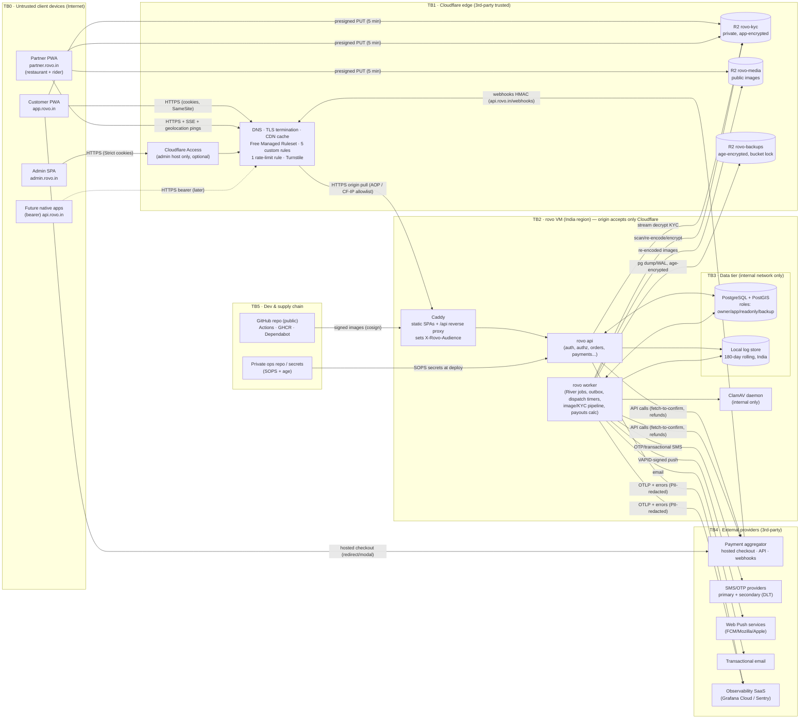
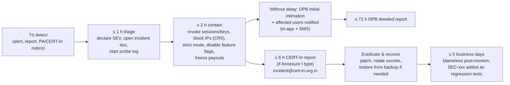

# 19 — Security Threat Model (STRIDE), Security Requirements & Incident Response

| | |
|---|---|
| **Purpose** | Identify the threats to rovo across its data flows and trust boundaries, choose mitigations sized for a small team running on free-tier infrastructure, record residual risk, and turn the result into **testable security requirements (`SEC-xxx`)** and an **incident-response outline** that also meets Indian regulatory reporting duties (CERT-In, DPDP). |
| **Owner** | Security Architect |
| **Status** | Draft v1 (Phase 1 — planning only) |
| **Depends on** | `00-planning-baseline.md`; `08-system-architecture.md`; `10-database-schema.md`; `11-api-specification.md`; `12-auth-rbac.md` (identity, sessions, RBAC — this doc assumes it); `13-order-state-machine.md`; `14-payment-architecture.md` (PA, webhooks, refunds, ledger); `15-notification-architecture.md` (SMS/DLT, push); `16-delivery-zone-architecture.md`; `17/18` (frontend, PWA, CSP delivery); `21-cicd-strategy.md`; `22-deployment-architecture.md`; `23-backup-disaster-recovery.md`; `24-observability-strategy.md` |
| **Consumed by** | QA (`20` turns §9 into tests), DevOps (`21–24`), Release (`27`, `29`, `30`), Legal review |

Tags: `[ASSUMPTION]`, `[OPEN]`, `[LEGAL]`. All external facts are cited in §12 with access date **2026-10-04**. Nothing in this document is legal advice; every `[LEGAL]` item must be reviewed by Indian counsel before launch.

---

## 1. Scope, method and assumptions

**In scope:**
- customer PWA (`app.`), partner PWA (`partner.`, restaurant + rider), admin SPA (`admin.`), native-ready bearer API host (`api.`);
- Go API + worker (one binary), PostgreSQL/PostGIS, Caddy, Cloudflare (DNS/CDN/WAF/Turnstile/R2);
- external providers: payment aggregator (PA), SMS/OTP providers, Web Push services, email, observability SaaS;
- GitHub repository and CI/CD;
- people: customers, restaurant owners/staff, riders, admins, maintainers, contributors.

**Out of scope (V1):** native apps (threats noted where design must not block them), multi-city, live GPS tracking, automated payouts/splits.

**Method:** data-flow diagram, then STRIDE per element and per flow, then threat table with ratings, mitigations mapped to `SEC-xxx`, and residual risk.

**Rating:**
- **Likelihood** L/M/H: H = expected within months of launch given known Indian food-delivery fraud patterns; M = plausible; L = needs skill/insider/luck.
- **Impact** L/M/H: H = money loss > ₹50k, PII breach of many users, regulatory reporting, or platform outage > 4 h; M = single-user harm or limited loss; L = nuisance.
- **Residual** risk is rated after the mitigations listed.

**Key assumptions:**
- `[ASSUMPTION]` Single VM in an Indian region (Oracle Cloud Hyderabad/Mumbai) behind Cloudflare; Postgres on the same VM, reachable only on the internal Docker network.
- `[ASSUMPTION]` The PA provides hosted checkout (rovo never handles card/UPI credentials) and HMAC-signed webhooks.
- `[ASSUMPTION]` The rovo operator is a registered **body corporate** (company/LLP/firm/proprietorship), so CERT-In directions and DPDP "Data Fiduciary" duties apply to the operator. The open-source project itself is not the fiduciary, but must ship features that let operators comply.
- `[ASSUMPTION]` The team is small (≤ 5 engineers, ≤ 10 admin users at launch); 24×7 on-call is not realistic, so automation and alerting must compensate.

---

## 2. Assets and data classification

| Class | Examples | Handling summary |
|---|---|---|
| **C0 Secrets** | Ed25519 JWT signing keys, OTP/phone peppers, KEK, PA API keys and webhook secret, SMS API keys, DB passwords, R2 keys, backup age private key, GitHub deploy credentials | SOPS/age-encrypted, never in the public repo, rotated, least distribution (§7.5) |
| **C1 Highly sensitive personal / financial** | KYC docs (ID, DL, PAN, masked Aadhaar, bank proof), bank account numbers, UPI VPAs of payees, TOTP secrets, admin password hashes, precise rider location history | Column/object envelope encryption, step-up + audit on view, strict retention |
| **C2 Personal data** | Phone, name, email, delivery addresses + pin lat/lng, order history, device ids, IPs, ratings/reviews tied to user, support tickets | Access control + masking in admin UIs, redaction in logs, DPDP retention |
| **C3 Business-confidential** | Commission rates, payouts, ledger, fraud thresholds and rules, revenue reports | RBAC; **fraud thresholds in DB config, not in the public repo** |
| **C4 Public** | Restaurant names, menus, prices, photos, zones served, public reviews | Integrity matters more than confidentiality (defacement, XSS) |

Money integrity (orders, payments, refunds, ledger, COD cash) is treated as an asset of its own: **integrity + non-repudiation**.

---

## 3. Threat agents

| Agent | Motivation | Capability |
|---|---|---|
| Opportunistic fraudster (customer side) | Free food, coupon farming, refund abuse | Multiple SIMs, emulators, scripts; medium |
| SMS-pumping / bot operator | Toll-fraud revenue, SMS bombing victims | Botnets, residential proxies; high |
| Dishonest rider | Keep COD cash, fake deliveries, inflate distance/waiting pay | Mock-location apps, collusion; medium |
| Dishonest restaurant | Fake orders to game ranking/payouts, reject orders, overcharge | Owns partner account; medium |
| Insider admin (support/ops/finance) | Refund to self/friends, payout redirection, PII selling | Legitimate access; high impact |
| Account-takeover attacker | Steal rider/restaurant payouts, customer PII | SIM swap, phishing "share your OTP" scams; medium |
| External attacker (vuln hunter / criminal) | Data theft, defacement, ransom | Reads our **public source code**; scanners; medium–high |
| Supply-chain attacker | Mass compromise via npm/Go modules/Actions | High (npm worm incidents in 2025) |
| Curious/malicious contributor | Exfiltrate CI secrets through PRs | Can open PRs from forks |
| Stalker / harasser | Locate a customer or rider | Places orders, social engineering of support |

---

## 4. Data-flow diagram and trust boundaries



### 4.1 Trust boundaries and entry points

| TB | Boundary | Crossing flows | Primary controls |
|---|---|---|---|
| TB0→TB1 | Untrusted device → Cloudflare | All user HTTP(S), SSE, uploads (presigned to R2) | TLS 1.2+ (HSTS preload), WAF managed rules, Turnstile, edge rate limit |
| TB1→TB2 | Cloudflare → origin | Proxied requests | **Origin firewall allows only Cloudflare IP ranges on 443** + Authenticated Origin Pulls (mTLS) `[ASSUMPTION: AOP available on Free — verify in 22]`; no direct origin DNS record; SSH not exposed publicly (§7.2) |
| TB2 internal | Caddy → API → Postgres | App traffic | Internal Docker network, scram-sha-256, separate DB roles, no public 5432 |
| TB4→TB2 | PA webhooks inbound | `POST api.rovo.in/webhooks/{provider}` | HMAC verify on raw body, idempotency, amount/order match, fetch-to-confirm (§6.5) |
| TB2→TB4 | Outbound to providers | PA, SMS, push, email, OTLP | Egress allowlist (if feasible on VM firewall) `[OPEN]`, TLS verify, secrets per provider, PII minimisation in payloads |
| TB0↔TB1 storage | Browser ↔ R2 | Presigned PUT/GET | Short TTL, content-type/size conditions, private KYC bucket, post-upload pipeline |
| Admin | Admin SPA ↔ API | Highest-privilege actions | Cloudflare Access (optional), password+TOTP, step-up, maker-checker, audit |
| TB5 | GitHub ↔ VM | Image pull, deploy | Signed images, digest pinning, environment protection, no secrets for fork PRs |

---

## 5. Threat table

Owners: **BE** Backend, **FE** Frontend, **DO** DevOps, **SEC** Security, **OPS** Operations team, **FIN** Finance, **PRD** Product, **LEG** Legal. Release: **V1** must ship at launch; **V1.1** first post-launch increment.

### 5.1 Authentication & sessions

| ID | Component | STRIDE | Threat | L | I | Mitigation (→ SEC ids) | Residual | Owner | Rel |
|---|---|---|---|---|---|---|---|---|---|
| T-01 | OTP verify | S | **OTP brute force**: guessing 6-digit codes across challenges or phones | M | H | 5 attempts per challenge, per-phone failure caps (10/h, 20/day), new challenge on resend, HMAC+pepper storage, constant-time compare (SEC-001..004) | L | BE | V1 |
| T-02 | OTP request | D / financial | **SMS pumping / toll fraud**: bots trigger OTP sends to number ranges to earn revenue share or burn budget | H | M | `+91` mobiles only, Turnstile on every request, layered limits (phone/IP/subnet/device), global budget breaker + provider daily cap, alerts on send/verify conversion ratio drop (SEC-005..009) | L–M | BE/DO | V1 |
| T-03 | OTP request | D | **SMS bombing** of a victim's phone via our OTP | M | L | Per-phone send caps + exponential resend cooldown; per-phone daily max 10 (SEC-006) | L | BE | V1 |
| T-04 | Member accounts | S | **SIM-swap account takeover** of rider/restaurant → redirect payouts; of customer → PII | M | H (partner) / M (customer) | DoT 24 h SMS bar helps; step-up + 48 h cooling-off + out-of-band notice + finance verification for payout destination changes; new-device SMS notice; maker-checker on bank change (SEC-010, SEC-052) | M | BE/FIN | V1 |
| T-05 | Member accounts | S/I | **Recycled phone number** gives a new holder the old account | M | M | 180-day inactivity "is this you?" detach flow; partner re-KYC after 90 days (SEC-011) | L | BE/PRD | V1 |
| T-06 | OTP channel | S | **OTP social-engineering / phishing relay** ("share the code to confirm your delivery") | H | M | SMS template says "never share; rovo staff never ask"; WebOTP origin binding; **delivery PIN is a different, clearly labelled 4-digit code** and is never an auth OTP; user education in app (SEC-012) | M | PRD/BE | V1 |
| T-07 | Auth endpoints | I | **Account enumeration** (which phones/emails are registered) | M | L | Identical responses and timing; generic errors (SEC-013) | L | BE | V1 |
| T-08 | Admin login | S | **Admin credential phishing / stuffing** | M | H | argon2id, breached-password list, lockout, **mandatory TOTP**, optional Cloudflare Access outer gate, IP allowlist option, alerts on "password OK, TOTP fail"; WebAuthn in V1.1 (phishing-resistant) (SEC-014..019) | M (TOTP is phishable) → L in V1.1 | SEC/BE | V1 / V1.1 |
| T-09 | Admin creds at rest | I | TOTP secrets / recovery codes read from a DB dump | L | H | TOTP secret envelope-encrypted; recovery codes HMAC'd with pepper outside DB (SEC-017, SEC-112) | L | BE | V1 |
| T-10 | Web sessions | I | **Token theft via XSS** (exfiltrating JWT/refresh) | M | H | Tokens only in `HttpOnly` cookies; strict CSP; XSS can still *ride* the session in-tab, so session/step-up on sensitive actions (SEC-026, SEC-061..066) | L–M | FE/BE | V1 |
| T-11 | Refresh tokens | S | **Stolen refresh token replay** (malware, backups, shared devices) | M | H | Rotation on every use; reuse → family revocation + notification; idle/absolute expiry; device list + remote logout (SEC-027..029) | L | BE | V1 |
| T-12 | JWT verify | S/E | **alg=none / alg-confusion / forged tokens** | L | H | Fixed `EdDSA` allowlist, `kid` lookup, `aud`/`iss`/`typ` checks, size limit; negative tests (SEC-030) | L | BE | V1 |
| T-13 | Signing keys | S/E | Signing-key leak lets attacker mint any token | L | H | Keys only via SOPS on VM, not in DB/images; 90-day rotation; emergency rotation runbook; admin requests also check server session (SEC-031, SEC-121) | L | DO/SEC | V1 |
| T-14 | Cookie-auth API | T | **CSRF** on state-changing endpoints | M | H | Same-origin API, SameSite Lax/Strict, Fetch-Metadata/Origin check (Go `CrossOriginProtection`), required `X-Rovo-Client` + JSON content-type → preflight, no GET side effects (SEC-032..034) | L | BE/FE | V1 |
| T-15 | Multi-app | E | **Cross-app pivot**: XSS on customer app uses admin session in the same browser | L | H | Host-only cookie jars per app host; admin `SameSite=Strict`; API rejects audience mismatch; no CORS (SEC-035) | L | BE/DO | V1 |
| T-16 | SSE / URLs | I | Tokens leak via URLs (logs, Referer) | M | M | No tokens in query strings; cookie-auth SSE; `Referrer-Policy: strict-origin-when-cross-origin` (`no-referrer` on admin); log scrubbing (SEC-036, SEC-131) | L | BE/FE | V1 |
| T-17 | Login | S | Session fixation / login CSRF | L | M | New session id on every login; CSRF controls apply to auth endpoints (SEC-037) | L | BE | V1 |

### 5.2 Authorisation & data access

| ID | Component | STRIDE | Threat | L | I | Mitigation | Residual | Owner | Rel |
|---|---|---|---|---|---|---|---|---|---|
| T-18 | Orders/addresses/deliveries APIs | I/T | **IDOR**: accessing others' orders, addresses, deliveries, tickets by id. UUIDv7 ids are time-ordered and **partially predictable**, so they are not a secret | H | H | Ownership enforced in L2 policy + L3 scoped queries; 404 on foreign ids; order code never sufficient alone; cross-tenant test matrix; alert on denial bursts (SEC-041..044) | L | BE | V1 |
| T-19 | All write APIs | E | **Mass assignment / role escalation** (`role`, `status`, `price`, `restaurant_id` fields in bodies) | M | H | Codegen request types with explicit allowed fields; unknown fields rejected (`additionalProperties: false`); server derives ownership from the principal, never the body (SEC-045) | L | BE | V1 |
| T-20 | Admin APIs | E/I | Admin in city A accesses city B data | L (one city) | M | City-scope predicate in every admin query; tests (SEC-046) | L | BE | V1 |
| T-21 | Partner APIs | E/I | Staff sees finance/bank data or another outlet's orders | M | M | `ctx` + restaurant scope; staff permission subset; tests (SEC-041, SEC-047) | L | BE | V1 |
| T-22 | Rider app | I | **Rider stalking / PII retention**: rider keeps customer phone/address after delivery | M | H (personal safety) | PII visible only during active delivery + 30 min; offer preview shows locality only; app does not cache PII offline beyond active delivery; masked calling V1.1 `[OPEN]` (SEC-048) | M | BE/FE/PRD | V1 / V1.1 |
| T-23 | Customer ↔ rider | I | Customer stalks rider (rider name, photo, phone) | L | M | Rider first name + photo only; contact relayed via support or masked calling in V1.1 (SEC-048) | L | PRD | V1 |

### 5.3 Web application & content

| ID | Component | STRIDE | Threat | L | I | Mitigation | Residual | Owner | Rel |
|---|---|---|---|---|---|---|---|---|---|
| T-24 | All SPAs, **esp. admin** | T/E | **Stored XSS via user-generated content**: reviews, menu item names/descriptions, restaurant names, address fields, delivery instructions, ticket text. The admin console renders all of it, which makes it the highest-value target | M | H | React auto-escaping; ban `dangerouslySetInnerHTML` (lint), no Markdown/HTML rendering of UGC in V1; server-side length/charset validation; strict CSP + **Trusted Types on admin**; output encoding in SMS/push/email templates (SEC-061..066) | L | FE/BE | V1 |
| T-25 | All SPAs | T | Clickjacking (e.g., admin approve button) | L | M | `frame-ancestors 'none'` + `X-Frame-Options: DENY` (SEC-067) | L | DO/FE | V1 |
| T-26 | Auth/payment return | S | **Open redirect** via `next=` / payment return params, used for phishing | M | M | Only relative, allowlisted in-app paths; payment return derives destination from server state (SEC-068) | L | FE/BE | V1 |
| T-27 | Data layer | T/I | SQL injection | L | H | sqlc-generated parameterised queries only; no string-built SQL; `gosec`/semgrep rule (SEC-069) | L | BE | V1 |
| T-28 | Notifications | S/T | **Template injection** into SMS/push/email (restaurant name with URL or phishing text) | M | M | DLT template variables are length-limited and strip URLs; restaurant names validated (no URLs, no control chars); emails HTML-escaped (SEC-070) | L | BE | V1 |
| T-29 | Third-party scripts | T/I | Compromised third-party script (analytics, maps, PA widget) skims data | L | H | No third-party analytics in V1; CSP allowlist limited to Turnstile + PA checkout + tile host; SRI where versioned URLs exist; Cloudflare script-injecting features (Rocket Loader, Zaraz, email obfuscation) **disabled** (SEC-063, SEC-071) | L | FE/DO | V1 |

### 5.4 Commerce, payments & fraud

| ID | Component | STRIDE | Threat | L | I | Mitigation | Residual | Owner | Rel |
|---|---|---|---|---|---|---|---|---|---|
| T-30 | Cart/checkout | T | **Price/fee tampering**: client submits lower prices, fees, taxes or distances | H | H | **Server-authoritative quote**; client never sends amounts; place-order references a stored quote bound to user + cart hash with 10-min expiry; re-validate at placement (§6.3) (SEC-076, SEC-077) | L | BE | V1 |
| T-31 | Checkout | T | Quote replay after menu/fee change or coupon expiry | M | M | Quote stores `menu_version`, `pricing_version`, coupon state; mismatch → 409 re-quote (SEC-077) | L | BE | V1 |
| T-32 | Coupons | S/E | **Coupon abuse via multiple accounts** (new-user offers farmed with many SIMs, emulators) | H | M | Per-phone, per-device-id, per-address-cell, per-payment-instrument limits; first-order coupons need a never-seen device + address; budget caps; COD excluded from high-value promos `[PRD]`; anomaly report (§6.4) (SEC-078..080) | M | BE/PRD | V1 |
| T-33 | Coupons | I | Private coupon code guessing | M | L | ≥ 10-char random codes for private coupons; validation endpoint rate limited (SEC-081) | L | BE | V1 |
| T-34 | PA webhooks | S | **Webhook spoofing**: forged "payment captured" event | M | H | HMAC-SHA256 over the raw body with the webhook secret, constant-time compare; reject unsigned; **fetch-to-confirm** with PA API before PAID (SEC-082, SEC-084) | L | BE | V1 |
| T-35 | PA webhooks | T | **Webhook replay** / duplicate delivery | H (benign duplicates) | M | `provider_events(provider, event_id)` unique; idempotent state transitions; payment status monotonic (SEC-083) | L | BE | V1 |
| T-36 | Payment confirmation | T | **Amount/currency/order mismatch** (pay ₹1 on a different PA order; reuse a captured payment for another order) | M | H | Each rovo order has exactly one PA order created server-side with the expected amount; verify `amount_paise`, `currency=INR`, PA `order_id` ↔ rovo order, and `payment.status=captured` (SEC-084) | L | BE | V1 |
| T-37 | Payment return | S | Client-side "success" redirect trusted as payment proof | M | H | Return endpoint is non-authoritative; order moves `PENDING_PAYMENT → PLACED` only via webhook or reconciliation fetch (SEC-085) | L | BE/FE | V1 |
| T-38 | Refunds (customer) | T/R | **Refund fraud by customers** ("item missing", "never delivered", spilled food) | H | M | Claim within 2 h of `DELIVERED`; photo evidence for quality/spill claims; auto-approve only small claims with good history; per-customer claim-ratio scoring; refunds to original instrument only; COD refunds as platform credit `[PRD]`; rider/restaurant evidence (pickup checklist, sealed packaging) (§6.6) (SEC-086, SEC-087) | M | PRD/OPS/BE | V1 |
| T-39 | Refunds (insider) | T/E | **Refund fraud by insiders** (refunding friends, splitting under threshold) | M | H | Role thresholds + per-agent daily caps + maker-checker above; refunds only to original payment instrument via PA (no manual bank transfer); reason + ticket required; weekly per-agent anomaly report (SEC-088, SEC-053) | L | FIN/BE | V1 |
| T-40 | Payouts | T/E | **Payout destination hijack** (bank/UPI changed to attacker's) | M | H | Step-up + 48 h cooling-off + notify old contact + finance verification (penny-drop via PA if available `[OPEN]`) + maker-checker; batch release maker-checker; payout to same destination as verified only (SEC-052, SEC-089) | L | FIN/BE | V1 |
| T-41 | COD | T/R | **Rider COD cash theft** (collects, disappears or delays deposit) | H | M | Cash-in-hand ledger; ₹2,000 cash limit blocks new COD offers; daily deposit by UPI to company account with reconciliation; ageing alerts at 24/48 h; KYC + address on file; payouts net of unremitted cash `[LEGAL — wage/contract terms]`; security deposit `[OPEN]` (§6.7) (SEC-090, SEC-091) | M | FIN/OPS | V1 |
| T-42 | COD | T | **Fake COD orders / refusal** (customer orders then refuses; restaurant loses food) | H | M | COD max order value (default ₹1,000 `[ASSUMPTION]`); COD disabled after 2 `UNDELIVERABLE` COD orders; COD only for phone-verified accounts; restaurant compensation policy `[PRD]` (SEC-092) | M | PRD/BE | V1 |
| T-43 | Delivery completion | R/T | **Fake "delivered"** marking by rider | M | M | Delivery PIN (4 digits, shown to customer) **required for COD and orders > ₹X**; geofence check (≤ 250 m of drop pin, accuracy-aware); timestamp plausibility; customer "not received" flow (SEC-093) | L–M | BE/PRD | V1 |
| T-44 | Rider location | S/T | **Rider location spoofing** (mock-location apps to look near restaurants, or fake pickup/drop) | H | M | **PWAs cannot reliably detect mock locations** (no `isMock` in the web Geolocation API); server-side plausibility checks (speed > 80 km/h, teleports, zero-variance accuracy, out-of-city), geofence on status changes, offer acceptance requires fresh fix (< 60 s), ops review queue; native app with Play Integrity + `Location.isMock()` later (§6.8) (SEC-094) | **M–H (accepted for V1)** | BE/OPS | V1 / native later |
| T-45 | Restaurant ops | R/T | **Restaurant fake rejections / gaming** (reject to avoid low-value orders, false "item unavailable", mark ready early to shift waiting pay) | M | M | Rejection reason codes; "item unavailable" auto-toggles item off; rejection/timeout rate metrics; auto-pause after N rejections/hour; READY timestamp vs rider arrival analytics; contract penalties `[PRD/LEG]` (SEC-095) | M | OPS/PRD | V1 |
| T-46 | Onboarding | S | **Fake restaurants / riders** (forged FSSAI/DL, stolen identities, ghost kitchens) | M | H | Manual KYC review; FSSAI licence verification on FoSCoS (manual lookup `[ASSUMPTION]`); physical/video verification for restaurants; selfie vs ID for riders; bank-account name match; probation limits (payout delay, order caps) for first 2 weeks (SEC-096) | M | OPS | V1 |
| T-47 | Marketplace | S/T | **Collusion** (rider+customer or restaurant+customer fake orders for promos/payouts/ratings) | M | M | Self-dispatch ban; device/phone/address/payment-instrument link graph; same-device multi-role alerts; promo exclusion for linked accounts; one review per delivered order (SEC-047, SEC-097) | M | BE/OPS | V1 / V1.1 analytics |
| T-48 | Reviews | T | Fake or abusive reviews (incl. PII or threats in text) | M | L | Only for `DELIVERED` orders by that customer, one per order; profanity/PII filter (phone-number regex); moderation queue (SEC-098) | L | BE/OPS | V1 |

### 5.5 Admin & insider

| ID | Component | STRIDE | Threat | L | I | Mitigation | Residual | Owner | Rel |
|---|---|---|---|---|---|---|---|---|---|
| T-49 | Admin console | I/E | **Insider PII browsing/exfiltration** (support reading addresses, selling phone lists) | M | H | Least-privilege roles; masked by default, reveal needs step-up + reason + audit; no bulk export without maker-checker; per-admin reveal-rate alerts; monthly access review; confidentiality clause `[LEG]` (SEC-049, SEC-050, SEC-054) | M | SEC/OPS | V1 |
| T-50 | Admin console | T/E | **Compromised admin account → mass refunds, payout redirection, role grants** | L | H | Step-up for sensitive actions; maker-checker on money and roles; per-agent caps; session limits; instant revocation; Cloudflare Access (SEC-051..053) | L | SEC/BE | V1 |
| T-51 | Audit log | R/T | **Audit tampering / repudiation** by an insider with DB access | L | H | Append-only privileges + trigger; hash chain; daily anchor to bucket-locked R2; DB superuser access limited to 2 named people with break-glass logging (SEC-126..128) | L | BE/DO | V1 |
| T-52 | Impersonation | E/R | Support uses "login as" to act for a user | — | — | **Not built in V1** (12 §5.6) | n/a | — | — |

### 5.6 Uploads, storage & media

| ID | Component | STRIDE | Threat | L | I | Mitigation | Residual | Owner | Rel |
|---|---|---|---|---|---|---|---|---|---|
| T-53 | Images | S/I | **SSRF via "image URL" fields** (server fetching attacker URLs to internal metadata endpoints) | L (by design) | H | **No server-side URL fetching for user input at all**; images only via direct presigned upload; outbound HTTP client allowlists provider hosts (SEC-101) | L | BE | V1 |
| T-54 | Uploads | T/E | **Malicious upload**: polyglot/HTML-in-image, decompression bombs, malware PDFs in KYC | M | M | Presigned PUT with content-type + size conditions (images ≤ 5 MB, KYC ≤ 5 MB), magic-byte check, **re-encode** images (decode with pixel limits → JPEG/WebP), PDFs: reject JS/embedded files/encryption, **ClamAV scan** (§6.10), served with `nosniff` and from a separate media origin (SEC-102..105) | L | BE/DO | V1 |
| T-55 | Public media | I | **EXIF/GPS leakage** in restaurant or menu photos (owner's home location) | M | L | Re-encoding strips all metadata (SEC-103) | L | BE | V1 |
| T-56 | Buckets | I | Bucket misconfiguration (KYC public, listing enabled) | L | H | KYC bucket private with no public domain; app-layer encryption (ciphertext even if exposed); IaC/config check in CI; quarterly review (SEC-106, SEC-114) | L | DO | V1 |
| T-57 | Presigned URLs | I | Presigned URL leak/over-long TTL | M | M | PUT TTL 5 min; KYC never via presigned GET (API stream) — or 60 s if used; random object keys (SEC-107) | L | BE | V1 |

### 5.7 Availability, abuse & scraping

| ID | Component | STRIDE | Threat | L | I | Mitigation | Residual | Owner | Rel |
|---|---|---|---|---|---|---|---|---|---|
| T-58 | Edge/API | D | **L7 DoS / request floods** on a single VM | M | H | Cloudflare unmetered DDoS mitigation + Free Managed Ruleset + 5 custom rules + 1 rate-limit rule (Free plan limits verified, §6.11); app-level per-route limits; request size/time limits; graceful 429 (SEC-108..110) | M (single VM) | DO/BE | V1 |
| T-59 | SSE | D | **SSE connection exhaustion** (many idle streams) | M | M | Caps per session/user/IP/global; heartbeats; idle-topic timeout; reconnect backoff with jitter (SEC-111) | L | BE | V1 |
| T-60 | Search/geo | D | Expensive queries (PostGIS serviceability, text search) abused | M | M | Indexed queries, `statement_timeout` 3 s for API role, result caps, cache serviceability per locality, per-IP limits (SEC-109) | L | BE | V1 |
| T-61 | Public catalog | I | **Scraping** of restaurants/menus/prices (competitors) | H | L | Accept (public data); edge caching; per-IP limits; no bulk endpoints; PII never in public endpoints (SEC-110) | L | PRD | V1 |
| T-62 | Origin | D/S | **Origin exposure / Cloudflare bypass** (direct-to-IP attacks, spoofed `CF-Connecting-IP`) | M | H | VM firewall/OCI security list: 443 only from Cloudflare ranges (auto-updated); AOP mTLS; no DNS records exposing the origin (mail on separate provider); trust `CF-Connecting-IP` only from CF ranges (SEC-112, SEC-113) | L | DO | V1 |
| T-63 | argon2 | D | Memory-exhaustion via parallel admin logins | L | M | Hash concurrency semaphore; edge rate limit on admin auth (SEC-018) | L | BE | V1 |

### 5.8 Infrastructure, data, secrets & supply chain

| ID | Component | STRIDE | Threat | L | I | Mitigation | Residual | Owner | Rel |
|---|---|---|---|---|---|---|---|---|---|
| T-64 | Repo | I | **Secrets committed to the public repo** | M | H | gitleaks pre-commit + CI; GitHub secret scanning + push protection; secrets never in the public repo (SOPS files in a **private ops repo**); token prefixes (`rvr_`) for detection; rotation runbook (SEC-136..138) | L | DO | V1 |
| T-65 | Dependencies | T/E | **Malicious or vulnerable dependency** (npm worms, typosquats, Go module hijack) | M | H | Lockfiles + `--frozen-lockfile`; pnpm lifecycle scripts blocked by default with explicit allowlist; pnpm `minimumReleaseAge` (delay brand-new versions, e.g. 3 days) `[ASSUMPTION — verify pnpm version support]`; `govulncheck` + `osv-scanner` in CI (fail on reachable/high); Dependabot (security + grouped weekly); review of new deps (CODEOWNERS); SBOM per release (SEC-139..142) | M | DO/SEC | V1 |
| T-66 | CI/CD | E/T | **Compromised GitHub Action / workflow injection** (`pull_request_target`, script injection from PR titles) | M | H | Actions pinned by **full commit SHA**; default `permissions: contents: read`; no `pull_request_target` checkout of PR code; untrusted inputs via env vars, never inline `${{ }}` in `run:`; `zizmor`/actionlint in CI; OpenSSF Scorecard (SEC-143..145) | L | DO | V1 |
| T-67 | CI secrets | I | **Fork PRs exfiltrating secrets** | M | H | Fork PR workflows get no secrets (GitHub default) and read-only token; deploy jobs only on protected tags via `environment` with required reviewers; first-time contributor approval required (SEC-146) | L | DO | V1 |
| T-68 | Images/deploy | T | **Image tampering** between build and deploy | L | H | Distroless/static non-root base pinned by digest; cosign keyless signing + build provenance attestation; deploy verifies signature and pins digest (SEC-147) | L | DO | V1 |
| T-69 | VM | E | **VM compromise via SSH / exposed services** | M | H | No public SSH: OCI Bastion or Tailscale/Cloudflare Tunnel for admin access `[OPEN — 22 decides]`; key-only, no root login; unattended security upgrades; host firewall default-deny; containers non-root, read-only rootfs, `no-new-privileges`, dropped caps (SEC-115, SEC-116) | M | DO | V1 |
| T-70 | Postgres | I/E | **DB exposure** (public port, over-privileged app role) | L | H | No public 5432; scram-sha-256; separate roles (§7.1); TLS required if DB ever leaves the host; `statement_timeout`; pgaudit V1.1 (SEC-117..119) | L | DO/BE | V1 |
| T-71 | Data at rest | I | Disk/volume or snapshot theft | L | H | Provider block-volume encryption (OCI default `[ASSUMPTION — verify]`); column/object envelope encryption for C1; backups age-encrypted (SEC-120, SEC-122) | L | DO | V1 |
| T-72 | Backups | I/T/D | **Backup theft, tampering or deletion** (ransomware deletes backups) | L | H | age public-key encryption on VM (VM cannot decrypt); private key offline with 2 custodians; R2 bucket lock retention; restore drills monthly (23) (SEC-122, SEC-123) | L | DO | V1 |
| T-73 | Keys | D | **Key loss** (KEK/age key lost, so encrypted data and backups are unrecoverable) | L | H | Two offline escrow copies (sealed, two custodians); key-ceremony doc; restore drill uses escrowed key (SEC-124) | L | SEC/DO | V1 |
| T-74 | Logs/telemetry | I | **PII/secret leakage into logs and third-party SaaS** (Sentry, Grafana) | H | M | slog redaction handler (deny-list keys + phone/PAN/Aadhaar regex); no request/response bodies; Sentry `sendDefaultPii=false` + scrubbing + no session replay; phones as HMAC/last-4 (SEC-129..132) | L | BE/DO | V1 |
| T-75 | Time sync | R | Inaccurate timestamps undermine forensics/CERT-In | L | L | NTP sync to NIC/NPL-traceable servers (CERT-In direction (i)) (SEC-133) | L | DO | V1 |

### 5.9 Privacy, regulatory & open-source

| ID | Component | STRIDE | Threat | L | I | Mitigation | Residual | Owner | Rel |
|---|---|---|---|---|---|---|---|---|---|
| T-76 | Data lifecycle | I (privacy) | **Over-collection / purpose creep / retention beyond need** (DPDP) | M | H (₹ penalties) | Data inventory; purpose-mapped notice; retention schedule with deletion jobs (§8.5); minimisation defaults (SEC-151..156) | M | PRD/LEG/BE | V1 |
| T-77 | Rights | I/R | **Failure to honour data-principal rights** (access, correction, erasure, grievance) within timelines | M | M | Self-service export/correction/deletion request; admin workflow with SLA timers; grievance officer (SEC-157..160) | L | PRD/OPS | V1 |
| T-78 | Children | I | Processing children's data without verifiable parental consent | L | M | 18+ service; self-declaration; block on knowledge (§8.6) `[LEGAL]` | M | LEG/PRD | V1 |
| T-79 | Breach response | R | **Missing CERT-In 6 h / DPB 72 h deadlines** | M | H | IR plan §10 with pre-filled templates, PoC registered with CERT-In, tabletop before launch (SEC-166..170) | L | SEC/LEG | V1 |
| T-80 | Cross-border | I | PII stored or processed outside India (R2 has no India jurisdiction; observability SaaS abroad) | H (by design) | M | DPDP s.16 permits transfers except to notified restricted countries (none notified as of access date `[LEGAL — re-check]`); minimise PII to SaaS; KYC in R2 only as app-layer ciphertext; CERT-In logs kept in India on VM (SEC-132, SEC-161) | L–M | LEG/DO | V1 |
| T-81 | Payments scope | I | **Card data enters rovo systems** (PCI scope, RBI CoF violation) | L | H | PA hosted checkout only; no card fields on our pages; never store PAN/CVV/expiry; tokens stay with PA (§8.12) (SEC-162) | L | BE/FE | V1 |
| T-82 | OSS | I | Attackers study our **public code** for vulns | H | M | Assume code is public (Kerckhoffs); security tests in CI; fraud thresholds in DB config, not in code; private vulnerability reporting (SEC-148, SEC-149) | M | SEC | V1 |
| T-83 | OSS | R | No disclosure channel, so researchers go public with 0-days | M | M | `SECURITY.md` + GitHub Private Vulnerability Reporting + `/.well-known/security.txt` (RFC 9116); 90-day disclosure policy; acknowledgements (SEC-150) | L | SEC | V1 |
| T-84 | OSS self-hosters | S/E | Forks deploy with **insecure defaults** (dev keys, demo admin, debug endpoints) | M | H (for them) | Prod mode refuses to start with dev keys/peppers, empty secrets, debug flags; no default credentials; bootstrap CLI for first admin (SEC-125) | L | BE | V1 |
| T-85 | Push | I | PII on lock screen via push notifications | M | L | Push text has order code + status only, no address/phone/items (SEC-072) | L | BE | V1 |

---

## 6. Focused mitigation designs

### 6.1 OTP abuse (T-01..T-07)

The full parameters are in 12 §2.2. Monitoring adds three signals:
- **send→verify conversion ratio** per hour. Normal is around 70–85% `[ASSUMPTION]`; pumping drives it towards 0. Alert below 40% over 15 min with ≥ 50 sends.
- **sends per distinct number prefix** (first 5 digits). Pumping walks ranges.
- **provider cost per hour** against budget.

Strict mode (12 §2.2) can be toggled by an on-call admin (`ADMIN_SUPER`), and turns on automatically.

### 6.2 XSS, CSP and security headers (T-24..T-29)

Baseline CSP. FE confirms exact hosts in 17; this is **illustrative**:

```
Content-Security-Policy:
  default-src 'none';
  script-src 'self' https://challenges.cloudflare.com https://checkout.razorpay.com;
  style-src 'self';                      # [OPEN] add 'unsafe-inline' only if Radix/Tailwind runtime styles require it; prefer style-src-attr 'unsafe-inline' narrowly
  img-src 'self' data: blob: https://media.rovo.in https://<tile-host>;
  font-src 'self';
  connect-src 'self' https://<tile-host>;            # telemetry tunnelled via same-origin /api/telemetry
  frame-src https://challenges.cloudflare.com https://api.razorpay.com;
  worker-src 'self'; manifest-src 'self';
  base-uri 'none'; form-action 'self'; frame-ancestors 'none';
  object-src 'none'; upgrade-insecure-requests;
  report-to csp;                                    # admin app adds: require-trusted-types-for 'script'; trusted-types default
```

- **Admin app:** no PA/Turnstile/tiles unless needed; `require-trusted-types-for 'script'` in V1. Customer/partner apps get Trusted Types in V1.1 after a report-only phase.
- **All responses** carry:
  - `Strict-Transport-Security: max-age=63072000; includeSubDomains; preload` (after a verification period);
  - `X-Content-Type-Options: nosniff`;
  - `Referrer-Policy: strict-origin-when-cross-origin` (admin: `no-referrer`);
  - `Permissions-Policy` (customer/admin: `geolocation=(self)` only where needed, camera only on partner upload pages; all others `()`);
  - `Cross-Origin-Opener-Policy: same-origin`;
  - `X-Frame-Options: DENY`.
- **API JSON responses:** `Cache-Control: no-store` for authenticated data, and `Content-Type: application/json; charset=utf-8`.
- **Media** is served from `media.rovo.in` (R2 public bucket via custom domain), a different origin from the apps, with `nosniff` and `Content-Disposition: inline` only for re-encoded images.
- **UGC rules:** plain text only. Limits: names ≤ 80 chars, descriptions ≤ 500, reviews ≤ 1,000, instructions ≤ 250. Control characters and bidi-override characters (U+202E etc.) are stripped. URLs in reviews and names are rejected or neutralised.
- **Cloudflare:** Rocket Loader, Zaraz, Email Obfuscation, Automatic HTTPS Rewrites and "Mirage"-type features are **off**, because they inject scripts or rewrite HTML and break CSP and SRI.

### 6.3 Server-authoritative pricing and quotes (T-30, T-31)

1. `POST /api/v1/quotes` with `{restaurant_id, items:[{item_id, variant_id, addon_ids, qty}], address_id, coupon_code?, payment_method}`. The client sends **no amounts**.
2. The server computes line prices from DB, packaging, delivery-fee slab (distance from **stored address pin** and restaurant location, never client distance), platform fee, small-cart fee, GST, and coupon discount. It stores `quotes(id UUIDv7, user_id, cart_hash, breakdown jsonb, total_paise, currency, menu_version, pricing_version, coupon_id, expires_at = now()+10 min)`.
3. `POST /api/v1/orders {quote_id, idempotency_key}` checks:
   - `quote.user_id == principal`, not expired, not already used (unique `orders.quote_id`);
   - restaurant open and serviceable;
   - items still available;
   - versions unchanged;
   - coupon still redeemable (atomic redemption row).

   On any mismatch it returns `409 quote_stale`. The order copies the breakdown verbatim. The PA order is created **server-side** for `total_paise`.

**Decision: no client-held signed quote token.** The quote is a server-side row referenced by an unguessable id bound to the user, which is simpler, auditable and revocable. An HMAC-signed stateless token would only matter if quotes had to survive without DB state, which they don't. If native offline carts ever need it, add `quote_sig = HMAC(K_quote, quote_id‖total‖expires)` without changing the API.

### 6.4 Coupon abuse (T-32, T-33)

- **`coupon_redemptions`:** unique `(coupon_id, user_id)` for per-user-once coupons. Counters keyed by `phone_hmac`, `device_id`, `address_cell` (H3 res-11 cell or 50 m grid of the drop pin plus normalised house number), and `payment_fingerprint` (UPI VPA hash or card fingerprint **if the PA exposes it** `[OPEN — 14]`).
- **"New user" coupons** require all of:
  - no prior `DELIVERED` order for the phone;
  - device id not linked to another account's first-order redemption in 90 days;
  - address cell not used for a first-order redemption by another account in 90 days.
- **Budget caps:** global ₹ budget and max redemptions per coupon, enforced with `UPDATE … SET used = used + 1 WHERE used < max RETURNING` in the order transaction.
- **Reversal:** a cancelled or refunded order releases the redemption only if cancelled before `ACCEPTED`. This stops "order, cancel, re-use" loops.
- **Weekly anomaly report:** accounts sharing devices or addresses, and redemption velocity per locality.
- **Acknowledged limit:** device ids are clearable, and Android emulators and cheap SIMs defeat per-phone limits. The residual risk is M and is budget-capped.

### 6.5 Payment webhooks (T-34..T-37)

```mermaid
sequenceDiagram
    autonumber
    participant PA as Payment aggregator
    participant CF as Cloudflare (api.rovo.in)
    participant API as rovo API /webhooks/pa
    participant DB as Postgres
    participant W as Worker
    PA->>CF: POST webhook (raw JSON, X-…-Signature, event id)
    CF->>API: forwarded (WAF skip for this path only; size ≤ 256 KB)
    API->>API: HMAC-SHA256(raw_body, webhook_secret) == signature (hmac.Equal) else 401 + audit
    API->>DB: INSERT provider_events(provider, event_id, payload_hash) ON CONFLICT DO NOTHING
    alt duplicate
      API-->>PA: 200 (idempotent no-op)
    else new
      API->>DB: enqueue job confirm_payment(event_id) (same tx)
      API-->>PA: 200 quickly (< 2 s)
      W->>PA: GET /payments/{id} (fetch-to-confirm, API key auth)
      W->>DB: verify pa_order_id ↔ rovo order, amount_paise == expected, currency == INR, status == captured
      W->>DB: transition PENDING_PAYMENT → PLACED (idempotent; ignore if already ≥ PLACED); ledger entries
      W->>DB: mismatch → payment_anomalies row + alert + auto-refund flow (14)
    end
    Note over W,PA: Reconciliation job: every 2 min fetch status for PENDING_PAYMENT > 2 min old; daily settlement report reconciliation (14)
```

- Webhook secret rotation is supported with dual secrets during a window.
- Cloudflare: the webhook path is excluded from Turnstile/challenges (Bot Fight Mode **off**, see §6.11), but still rate-limited in-app.
- PA source-IP allowlisting is optional if the PA publishes ranges `[OPEN — 14]`.
- Refund API calls use an idempotency key (`refund_id`) and the PA's refund idempotency, if supported.

### 6.6 Refund fraud (T-38, T-39)

- **Claim types:** missing item, wrong item, quality/spill, not delivered, late. Each has evidence rules:
  - photo required for quality/spill/wrong item, captured in-app (camera input) with the upload pipeline;
  - "not delivered" requires no delivery PIN/geofence success.
- **Auto-decision:** auto-approve only if claim ≤ ₹150, customer claim ratio < 10% of last 20 orders, ≤ 2 claims in 30 days, and account age > 7 days. Everything else goes to the support queue `[ASSUMPTION — PRD to tune]`.
- **Refund destination:** original payment instrument via PA (prepaid); platform credit for COD `[PRD]`. **Never** to a new UPI/bank account typed by support.
- **Insider controls:** thresholds and caps (12 §5.2), maker-checker, ticket link + reason mandatory, weekly per-agent report (refund count/value, repeat beneficiaries, refunds on own-phone-linked accounts), and refunds cannot exceed captured minus already-refunded (DB check).

### 6.7 COD cash controls (T-41, T-42)

- Rider **cash-in-hand ledger** is append-only. Entries: `COD_COLLECTED` (on `DELIVERED`, amount = order total), `DEPOSIT_DECLARED`, `DEPOSIT_CONFIRMED` (finance/ops with UTR or bank-statement reference), `ADJUSTMENT` (maker-checker).
- **Limit:** cash-in-hand ≥ ₹2,000 (configurable) blocks new COD offers; prepaid offers continue.
- **Deposit:** preferred by UPI from rider to the operator's collection account, matched by UTR. Cash deposits at a hub are recorded with a receipt number and dual sign-off.
- **Ageing:** alert at 24 h and 48 h undeposited; suspend after 72 h `[PRD]`.
- **Payout netting** of unremitted cash is subject to the rider agreement `[LEGAL]`.

### 6.8 Rider location and delivery proof (T-43, T-44)

- **Acknowledged limitation:** the browser Geolocation API gives coordinates and accuracy but **no mock-location signal**. A rider with Android developer options and a mock-location app can spoof the PWA. V1 therefore treats location as a **dispatch hint, not proof**.
- **Server checks on each ping:**
  - implied speed ≤ 80 km/h;
  - jump > 2 km in < 60 s is flagged;
  - accuracy ≤ 100 m, else ignored for proof;
  - identical coordinates repeated > N times flagged;
  - inside city bounding polygon.
- **Status proofs:**
  - `AT_RESTAURANT` and `PICKED_UP` need a fix within 150 m of the restaurant (accuracy-adjusted). `PICKED_UP` also needs the restaurant to mark handover (two-party confirmation).
  - `DELIVERED` needs the delivery PIN (COD and high-value) **or** a fix within 250 m plus no customer dispute within 2 h.
- **Flags** go to an ops review queue and a rider risk score. Repeated flags lead to suspension after human review.
- **Native app (later):** Play Integrity verdict + `Location.isFromMockProvider/isMock` + foreground service.

### 6.9 Restaurant gaming and fake partners (T-45, T-46)

- **Restaurant gaming:** rejection reasons are mandatory, and reason `ITEM_UNAVAILABLE` must name items, which are then toggled off. More than 3 rejections or timeouts in 60 min auto-pauses the restaurant for 30 min and notifies ops.
- **Onboarding checklist** (OPS, 07):
  - FSSAI licence number verified on the government portal, with name/address match;
  - GSTIN verified (if any);
  - bank-account holder name matches the business or owner (penny-drop if the PA supports it `[OPEN]`);
  - storefront photo with geotag captured in-app by the field agent;
  - owner video/phone verification.
- **Probation:** first 14 days payout hold (T+7) and order caps.

### 6.10 Upload pipeline and malware scanning (T-53..T-57) — decision

**Decision: run ClamAV (`clamd`) in V1 for KYC uploads only.** Menu and restaurant images are re-encoded instead.

Rationale:
- KYC PDFs are opened by admins on their own machines, which is the most plausible malware path into the admin workstation.
- clamd needs about 1–1.5 GB RAM for signatures `[ASSUMPTION — verify on ARM]`. The Oracle free ARM VM (up to 24 GB `[per 25 — verify]`) can afford it.
- If memory is tight, fall back to: no PDFs accepted (images only) for KYC, which removes the PDF risk entirely.

Pipeline:
- **Staging:** presigned PUT to `staging/` (content-length-range and content-type enforced by signature).
- **Worker job:**
  1. size + magic-byte check;
  2. images: decode with max pixel count (e.g. 40 MP), re-encode to JPEG/WebP and strip metadata;
  3. PDF: parse with a pure-Go parser in a time/memory-limited subprocess, reject `/JavaScript`, `/JS`, `/OpenAction`, `/Launch`, `/EmbeddedFile`, `/RichMedia`, encryption;
  4. clamd INSTREAM scan;
  5. encrypt (KYC) or publish (media);
  6. delete staging.

  Failures are quarantined and the uploader is told to retry.
- **Admins** view PDFs in the browser's built-in viewer via the API stream with `Content-Security-Policy: sandbox` on the response. They do not download by default.

### 6.11 DoS, scraping and Cloudflare Free-plan configuration (T-58..T-62)

Verified Free-plan capabilities (Cloudflare docs, accessed 2026-10-04):

| Feature | Free plan |
|---|---|
| WAF managed rules | **Free Managed Ruleset only** (the Cloudflare Managed Ruleset and OWASP Core Ruleset need paid plans) |
| WAF custom rules | **5 rules** |
| Rate-limiting rules | **1 rule**; counting period 10 s; mitigation timeout 10 s; counting by IP only; expression fields limited to Path and Verified Bot |
| Origin Rules | 10 rules; destination-port override only (no Host/DNS/SNI override) |
| Proxy read timeout | 125 s (not configurable below Enterprise) |
| Turnstile | Free; unlimited challenges; 20 widgets; 10 hostnames per widget |

Proposed use of the 5 custom rules + 1 rate-limit rule:

| # | Rule | Action |
|---|---|---|
| CR1 | `admin.rovo.in` and not (country IN or IP in allowlist) | Block (if Cloudflare Access not used) |
| CR2 | Path matches `/internal/`, `/metrics`, `/.env`, `/.git`, `/wp-`, `/debug/` | Block |
| CR3 | Method not in {GET, POST, PUT, PATCH, DELETE, OPTIONS, HEAD} | Block |
| CR4 | `api.rovo.in` path `/webhooks/` | Skip remaining custom rules (still logged); app verifies HMAC |
| CR5 | Reserved for incident response (e.g. block ASN/country/UA under attack) | Managed Challenge / Block |
| RL1 | Path starts with `/api/v1/auth/` | > 20 req / 10 s per IP → block 10 s (coarse; fine-grained limits are in-app) |

- **Bot Fight Mode: off.** On Free it cannot be selectively skipped for webhooks and future native clients `[ASSUMPTION — verify in 22]`. Turnstile covers OTP.
- Unmetered L3/L4/L7 DDoS mitigation is on by default on all plans (Cloudflare marketing/docs; not re-verified in detail).
- **App-level limits** (in-memory per instance, Postgres for auth): per principal + per IP token buckets for writes, search, quote, coupon validation and upload-init.
  - Request body ≤ 64 KB (JSON), timeouts: read header 5 s, read 15 s, write 30 s (SSE exempt from write timeout).
  - `statement_timeout` 3 s for the API DB role and 60 s for the worker.
- **Upgrade trigger:** if attacks exceed what Free handles, Pro adds the Cloudflare Managed Ruleset and 20 custom rules. Budget line `[OPEN — 25]`.

---

## 7. Infrastructure, database, cryptography, logging and supply chain

### 7.1 Database roles and hardening

| Role | Used by | Privileges |
|---|---|---|
| `rovo_owner` | goose migrations (one-shot container at deploy) | Owns schema; DDL. Not used at runtime. |
| `rovo_app` | API + worker | `SELECT/INSERT/UPDATE/DELETE` on app tables; **`INSERT, SELECT` only on `audit_events`, ledger tables, `provider_events`** (append-only, with trigger guards); no DDL; `statement_timeout=3s` (API) |
| `rovo_report` | Read-only reporting (Metabase-like later, ad-hoc SQL) | `SELECT` on **reporting views** that exclude or mask C1/C2 columns; no base-table access |
| `rovo_backup` | Backup job | `pg_read_all_data` (PG14+) |
| `postgres` superuser | Break-glass only | Local socket only; use is audited (shell session logging) |

- Postgres listens only on the internal Docker network (no published port). The OCI security list and host firewall block 5432. `pg_hba.conf` is `scram-sha-256`, limited to the app subnet.
- **TLS:** not required on the single-host internal network (no network hop leaves the host). **Required (`sslmode=verify-full`) if the DB moves to another host or a managed service** (fallback in P17).
- `log_connections`, `log_disconnections`, DDL logging, and failed-auth logging are enabled. `pgaudit` for role/DDL changes in V1.1.
- **Encryption at rest:** OCI block volumes are encrypted by default with provider-managed keys `[ASSUMPTION — verify in 22]`. Application-layer encryption covers C1 (§7.3).

### 7.2 Host and network

- **Admin access to the VM:** no public SSH. Use OCI Bastion **or** Tailscale **or** Cloudflare Tunnel + Access for SSH `[OPEN — 22]`. Key-only auth, no root login, MFA on the cloud console account (root tenancy credentials held by 2 people, hardware key if possible).
- Containers run non-root with read-only root filesystem, `no-new-privileges`, `cap_drop: [ALL]`, memory/pid limits, and no Docker socket mount.
- Unattended OS security updates; weekly image rebuilds pick up base-image patches.

### 7.3 Encryption and key management (envelope encryption)

- **Library:** Google Tink (Go) AEAD keysets (AES-256-GCM), or stdlib `crypto/aes`+`cipher.GCM` wrapped in a small `crypto/envelope` package. Tink is preferred for key rotation ergonomics `[OPEN — BE]`.
- **Key hierarchy:**
  - **KEK** (per purpose: `kek-pii`, `kek-kyc`, `kek-totp`) → wraps **DEKs**.
  - V1 KEK source: a 256-bit key in the SOPS-encrypted secrets file loaded at startup (memory only).
  - V1.1 option: OCI Vault (KMS) wrap/unwrap, if available on Always Free `[ASSUMPTION — verify]`.
  - DEKs are stored wrapped in `encryption_keys(id, purpose, version, wrapped_dek, created_at, retired_at)`.
  - Files (KYC) get a fresh DEK per object, stored wrapped in object metadata or DB.
- **Encrypted fields (V1):**
  - payee bank account number, payee UPI VPA, PAN number, DL number, vehicle RC number;
  - admin TOTP secrets;
  - KYC files;
  - rider location history older than 24 h `[OPEN — or simply delete after 30 days]`.
- **Integrity binding:** AAD = `table|column|row_id|key_version`, which prevents swapping ciphertexts between rows.
- **Searchability:** blind index `HMAC-SHA-256(K_bidx, normalised_value)` for dedupe (e.g. same bank account used by many riders = fraud signal) without decrypting.
- **Not encrypted at column level:** phone, name, address (operational need, low marginal benefit). These are protected by access control, disk encryption, and backup encryption.
- **Rotation:** new DEK version yearly or on suspicion; lazy re-encryption on write plus a background re-wrap job. KEK rotation re-wraps DEKs only.
- **Escrow:** KEKs, peppers and the backup age private key are kept in two sealed offline copies held by two custodians (`[OPEN — names]`).

### 7.4 Backups

- WAL archiving / pgBackRest or WAL-G (23 decides) to R2 `rovo-backups`, **encrypted client-side with age (public key on VM)**. The VM can write backups but not read them.
- R2 **bucket lock** retention (e.g. 35 days) prevents deletion by a compromised VM. Bucket locks exist (Cloudflare docs, accessed 2026-10-04); exact free-tier availability `[ASSUMPTION — verify]`.
- **Monthly restore drill** in a throwaway VM, which also verifies decryption with escrowed keys and that encrypted columns decrypt with the KEK backup.

### 7.5 Secrets management

- **SOPS + age.** Encrypted secret files live in a **private** `rovo-ops` repo (or only on the VM). **Never in the public repo**, even encrypted, because a future key compromise would retroactively expose history.
- The public repo ships `.env.example` with placeholder values.
- **Per-environment age keys:** dev, staging, prod. The prod key is on the VM and with 2 custodians.
- **CI deploy secrets** (SSH/Tunnel credentials, GHCR) live in GitHub **Environment** secrets with required reviewers. The PA, SMS and DB secrets are **not** in GitHub at all; they stay on the VM via SOPS.
- **Rotation runbook** for each secret (JWT keys, peppers, PA keys, webhook secret, SMS keys, R2 tokens, DB passwords, VAPID keys).

### 7.6 Logging, audit and PII redaction

- **Three streams:**
  - (1) app logs (slog JSON);
  - (2) security/audit events (DB `audit_events` + log mirror);
  - (3) access logs (Caddy, with Cloudflare `CF-Ray` and `CF-Connecting-IP`).
- **Redaction:** a `slog` `ReplaceAttr` handler drops or masks keys (`password`, `otp`, `code`, `token`, `authorization`, `cookie`, `set-cookie`, `totp`, `secret`, `pan`, `aadhaar`, `account_number`, `vpa`, `address*`, `lat`, `lng`).
  - Regexes catch E.164 Indian mobiles (`\+?91[6-9]\d{9}`), PAN (`[A-Z]{5}[0-9]{4}[A-Z]`) and 12-digit Aadhaar-like numbers.
  - Phones are logged as `phone_hmac` or `+91******1234`.
  - Request and response bodies are never logged.
  - A CI test feeds known PII through handlers and asserts it is absent from captured logs.
- **Retention and location:**
  - Authoritative security and access logs are stored **on the VM (India region) for a rolling ≥ 180 days** (CERT-In), compressed, then archived encrypted.
  - Auth and audit events are kept **≥ 1 year** (DPDP Rules log-retention safeguard).
  - Third-party SaaS (Grafana Cloud/Sentry) gets redacted operational telemetry with short retention.
  - The CERT-In FAQ (May 2022) indicates logs may be kept outside India if they can be produced to CERT-In within a reasonable time. We nevertheless keep the authoritative copy in India `[LEGAL]`.
- **Sentry** (if used): `sendDefaultPii: false`, `beforeSend` scrubbing, no session replay, no breadcrumbs with URLs containing ids + PII, IP address collection off, data scrubbing enabled server-side, EU/US region (cross-border, see §8.9).

### 7.7 Supply chain and CI (for 21)

- **Go:** `go.sum` committed; `GOFLAGS=-mod=readonly`; `govulncheck ./...` (fail on reachable vulns); `gosec`; `staticcheck`.
- **JS:**
  - `pnpm install --frozen-lockfile`;
  - lifecycle scripts disabled except an explicit `onlyBuiltDependencies` allowlist;
  - `minimumReleaseAge` delay for new versions `[ASSUMPTION — verify pnpm support/version]`;
  - `osv-scanner` over all lockfiles;
  - eslint security rules (`no-danger`, `react/no-danger-with-children`, no `eval`).
- **Containers:** distroless/static (Go) and caddy base pinned by digest; Trivy or Grype scan (fail on critical with fix available); SBOM via Syft (SPDX/CycloneDX) attached to releases; cosign keyless signing + `actions/attest-build-provenance`; deploy verifies signature and pins `@sha256`.
- **GitHub:**
  - branch protection (required reviews, status checks, no force push);
  - CODEOWNERS on `auth/`, `authz/`, `payments/`, `ledger/`, `migrations/`, `.github/`;
  - Dependabot (security + weekly grouped version updates, including GitHub Actions);
  - secret scanning + push protection;
  - Private Vulnerability Reporting enabled;
  - OpenSSF Scorecard action;
  - Actions pinned by SHA;
  - workflow-level `permissions: {contents: read}`;
  - `zizmor`/actionlint;
  - no `pull_request_target` with PR checkout;
  - first-time contributor workflow approval;
  - deploy only from signed tags via a protected `production` environment.

### 7.8 Open-source-specific measures

- `SECURITY.md` covers supported versions, private reporting (GitHub PVR + security email), 90-day coordinated disclosure, safe-harbour statement `[LEGAL]`, and no bug bounty in V1.
- `/.well-known/security.txt` (RFC 9116) on every host, with `Contact`, `Expires`, `Policy`, `Preferred-Languages: en`.
- **No secrets, no real data, and no fraud thresholds in the repo.** Seed and demo data are synthetic, and demo phones use reserved fake ranges.
- **Safe defaults for self-hosters** (SEC-125): production mode refuses to start with dev keys, empty peppers, `DEBUG=true`, or a missing Turnstile secret. There are no default admin credentials.
- Security architecture docs are public by design (Kerckhoffs). Operational runbooks containing infrastructure identifiers live in the private ops repo.

---

## 8. Privacy and regulatory (DPDP, IT Act, CERT-In, RBI/PCI, Aadhaar) — `[LEGAL]` throughout

### 8.1 DPDP Act 2023 and DPDP Rules 2025: status as of 2026-10-04

| Item | Verified fact | Source |
|---|---|---|
| Rules notified | DPDP Rules 2025 notified **13 Nov 2025** (G.S.R. 846(E)); Act provisions brought into force in phases | Khaitan & Co ERGO (15 Nov 2025); AMS Shardul; MeitY data-protection framework page |
| Phase 1 (immediate) | Definitions, Data Protection Board establishment, rule-making provisions | Khaitan |
| Phase 2 (+12 months, **13/14 Nov 2026**) | Consent-manager registration and obligations | Khaitan (13 Nov 2026); AMS Shardul (14 Nov 2026) — day differs between sources `[LEGAL — confirm exact date]` |
| Phase 3 (+18 months, **13/14 May 2027**) | Core obligations: notice/consent, Data Fiduciary duties (security safeguards, breach intimation, retention/erasure, children, rights, grievance), SDF duties, Board powers | Khaitan; AMS Shardul; KS&K |
| Interim | IT Act s.43A + SPDI Rules 2011 remain in force until the 18-month mark (passwords, financial information such as bank account details = SPDI → "reasonable security practices") | Khaitan |

**Implication:** rovo will likely launch **before** 13/14 May 2027. We nevertheless **build to DPDP from day one**, because retrofitting consent, retention and rights workflows is costly, and SPDI Rules apply meanwhile.

### 8.2 DPDP obligations → rovo design

| Obligation (Act / Rules) | rovo design response | SEC |
|---|---|---|
| **Notice** (s.5, Rule 3): standalone, clear; itemised personal data, specified purposes, specific description of goods/services; link to withdraw consent and exercise rights, and how to complain to the Board | Versioned privacy notice per app (en + te), shown standalone at signup and partner onboarding; data inventory → notice table generated from the data map; links in profile | SEC-151 |
| **Consent** (s.6): free, specific, informed, unambiguous, affirmative; withdrawal as easy as giving | `consents(user_id, notice_version, purposes[], given_at, withdrawn_at, channel)`; marketing (SMS/WhatsApp/push promos) **separate opt-in**, off by default; withdrawal toggle in settings | SEC-152 |
| **Legitimate uses** (s.7): e.g. data voluntarily provided for a specified purpose | Order fulfilment data (address, phone to rider) relies on s.7(a) / consent `[LEGAL — basis mapping]` | — |
| **Accuracy, security safeguards** (s.8(3)–(5), Rule 6): encryption/obfuscation/masking/tokens, access control, monitoring & logging, continuity, **logs retained ≥ 1 year**, contractual safeguards with processors | §7 controls; DPAs with SMS, PA, email, observability, Cloudflare `[LEGAL]`; access logging of PII reads | SEC-112..124, SEC-126..132, SEC-163 |
| **Breach intimation** (s.8(6), Rule 7): to each affected Data Principal **without delay**; to the Board **without delay** + detailed report **within 72 h** (extendable on request) | IR plan §10 with templates | SEC-166..170 |
| **Retention / erasure** (s.8(7), Rule 8): erase when purpose served / consent withdrawn; Third-Schedule 3-year inactivity erasure applies to e-commerce entities with ≥ 2 crore registered users (not rovo at launch); 48 h prior notice in that regime; **minimum 1-year retention** of personal data, traffic data and logs for Seventh-Schedule purposes | Retention schedule §8.5; inactivity policy voluntarily aligned (3 years) with 48 h notice | SEC-154..156 |
| **Grievance redressal** (s.8(10), s.13, Rules): respond within a reasonable time **≤ 90 days** | Ticket category "Privacy"; internal SLA 30 days; contact published | SEC-159, SEC-160 |
| **Contact person** (s.8(9)): publish business contact of a person able to answer privacy questions (DPO only for SDFs) | Grievance/Privacy Officer named in notice `[LEGAL]` | SEC-160 |
| **Rights** (ss.11–14): access summary (data + processing activities + identities of fiduciaries/processors shared with), correction/completion/updating/erasure, grievance, nomination | Self-service export (JSON + readable summary), profile correction, deletion request flow, nominee field (V1.1) | SEC-157, SEC-158 |
| **Children** (s.9, Rule 10): verifiable parental consent for < 18; no tracking/behavioural monitoring/targeted ads | §8.6 | SEC-164 |
| **Cross-border** (s.16): allowed except to countries restricted by notification | §8.9 | SEC-161 |
| **Penalties** (Schedule): up to ₹250 crore for failure to take reasonable security safeguards; up to ₹200 crore for breach-notification failures and children's obligations | Drives priority of §7 and §10 | — |

### 8.3 Notice and consent UX (for 04/05/06)

- **Customer signup:** OTP, then a standalone notice screen (summary + link to full notice), then an "I agree" checkbox (not pre-ticked), then a marketing opt-in (separate, unticked), then the 18+ declaration.
- **Partner onboarding:** a separate partner notice covering KYC, bank, location tracking while online, and sharing with PA/banks for payouts.
- **Location (riders):** collected only while "online", with a persistent on-screen indicator; purpose: dispatch and safety; retention per §8.5.
- Notices and consent records are versioned. A notice change that adds purposes triggers re-consent.

### 8.4 Data-principal rights workflows

| Right | Flow | SLA (internal) |
|---|---|---|
| Access/summary | Settings → "Download my data" → async job → in-app download (JSON + human-readable), link valid 24 h, step-up OTP | ≤ 7 days (automated, typically minutes) |
| Correction | Self-service for profile and addresses; support ticket for others | ≤ 7 days |
| Erasure | Settings → "Delete account" (step-up OTP) → 7-day grace (cancel possible) → anonymise user row (name → "Deleted user", phone → `NULL` + `phone_hmac` tombstone for fraud/coupon limits `[LEGAL — basis]`), delete addresses, consents kept as evidence, orders kept with PII stripped for tax/accounting retention `[LEGAL]`; partners: blocked if open payouts/cash balance until settled | ≤ 30 days |
| Withdraw consent | Toggle per purpose; marketing off immediately; core-service consent withdrawal = account deletion flow | Immediate |
| Grievance | Privacy ticket → Grievance Officer → response | ≤ 30 days (legal max 90) |
| Nomination | V1.1 (form + verification) | — |

Admin side: a `privacy_requests` queue with SLA timers. Erasure execution is maker-checker (12 §5.5), and every step is audited.

### 8.5 Retention and deletion schedule (proposal) `[LEGAL — confirm each row]`

| Data | Retention | Basis / note |
|---|---|---|
| OTP challenges | 24 h (aggregates in metrics) | Security |
| Auth/security/audit logs | ≥ 1 year (DPDP Rule 6/8(3)); CERT-In 180 days rolling in India; money-related audit 8 years | Legal obligations `[LEGAL]` |
| Access logs (Caddy/CF) | 180 days (India), then delete | CERT-In |
| Orders, invoices, payments, ledger, payouts | 8 years with PII minimised after 3 years (address → locality, phone removed) | GST/Companies Act/Income-tax record-keeping `[LEGAL — 6 vs 8 years]` |
| Customer addresses | Until deleted by user or account erasure; inactive 3 years → erase after 48 h notice | DPDP |
| Rider location pings | Raw 30 days (disputes, fraud); then aggregated (distance per delivery) and raw deleted | Minimisation `[ASSUMPTION]` |
| Delivery proof (geofence events, PIN result) | 1 year | Disputes, Rule 8(3) |
| KYC documents (approved partners) | Partnership duration + 8 years for tax-relevant docs (PAN/bank) `[LEGAL]`; ID images: partnership + 1 year `[LEGAL]` | Contract/tax |
| KYC (rejected/abandoned) | 90 days after decision | Minimisation |
| Support tickets & photos | 2 years | Disputes |
| Reviews | Until deleted; anonymised on account erasure | — |
| Marketing consent records | Lifetime of account + 1 year after withdrawal/erasure | Evidence |
| Backups | 35 days rolling (bucket lock); erasure propagates as backups expire | Documented in notice |

Deletion jobs are idempotent, audited, and report counts. QA tests the schedule with time travel (SEC-156).

### 8.6 Children's data `[LEGAL]`

DPDP defines a child as < 18. Processing requires verifiable parental consent and forbids tracking, behavioural monitoring and targeted advertising directed at children (s.9; Rule 10 mechanisms incl. DigiLocker tokens).

**V1 decision:** rovo's customer service is **for 18+ only**.
- Signup requires an 18+ self-declaration (timestamped).
- Accounts are blocked and data erased if we learn a user is a minor.
- No age-targeted marketing.

Riders must be 18+ (DL/age verified in KYC).

**Open question for counsel:** whether self-declaration suffices or "due diligence" requires more (e.g. DigiLocker age token) for a general-audience food app.

### 8.7 Breach notification (DPDP + CERT-In)

Two independent clocks run in parallel (§10):
- **CERT-In:** report Annexure-I incidents within **6 h of noticing** to `incident@cert-in.org.in` / 1800-11-4949. The list includes data breach, data leak, unauthorised access, website intrusion/defacement, attacks on e-commerce applications, attacks on digital payment systems, DoS/DDoS, identity theft/phishing, and malicious code.
- **DPDP Board:** initial intimation without delay, **detailed report within 72 h** (description, nature, extent, timing, location, likely impact, mitigation, findings on cause/persons, remedial measures, report on notices to principals).
- **Data principals:** without delay, via in-app + SMS. Contents: what happened, likely consequences, mitigation, safety steps they can take, and a contact.

### 8.8 Grievance Officer and other e-commerce duties `[LEGAL]`

- Name a **Grievance Officer** (also handles DPDP privacy grievances) with contact in app and website.
- The Consumer Protection (E-Commerce) Rules 2020 also require a grievance officer and acknowledgement/resolution timelines for e-commerce entities `[LEGAL — verify current timelines; not re-verified in this pass]`.

### 8.9 Cross-border transfers

- **Data outside India by design:**
  - Cloudflare edge (global), whose TLS termination sees all traffic;
  - R2 (no India jurisdiction; jurisdictions are EU/US/FedRAMP only; location hint `apac` possible);
  - Grafana Cloud / Sentry (EU/US);
  - possibly email/push providers.
- DPDP s.16 permits transfers except to countries the Government restricts by notification. Counsel to confirm none affect our vendors.
- **Mitigation:**
  - minimise PII to SaaS (redaction);
  - KYC objects are app-encrypted, so Cloudflare holds ciphertext only;
  - authoritative DB and logs on an Indian VM;
  - DPAs with all processors.
- RBI's payment-data storage directive (2018) binds payment system operators (the PA), not rovo as a merchant. We store no payment-system data beyond PA ids, amounts and status `[LEGAL — confirm]`.

### 8.10 CERT-In Directions (28 Apr 2022): applicability and controls

They apply to "service providers, intermediaries, data centres, body corporate and Government organisations". An operator company running rovo is a body corporate, so **applicable** `[LEGAL — confirm for the operator entity]`.

| Direction | rovo control | SEC |
|---|---|---|
| (i) Sync ICT clocks to NIC/NPL NTP (or traceable) | chrony on VM configured to `time.nic.in`/`samay1.nic.in` (or NTP pool traceable) `[ASSUMPTION — DO verify hostnames]`; containers use host clock | SEC-133 |
| (ii) Report Annexure-I incidents within 6 h | IR plan §10; CERT-In reporting template prepared | SEC-166 |
| (iii) Designate a Point of Contact; respond to CERT-In directions | PoC registered (Annexure II format) before launch | SEC-167 |
| (iv) Enable logs of all ICT systems; retain **180 days rolling, within Indian jurisdiction**; provide on request | Local log store on India VM, 180 days; Cloudflare logs (Free plan has limited log access — rely on origin access logs) | SEC-134 |
| (v) VPS/cloud/VPN providers' KYC duties | Not applicable to rovo (we are not a VPS/cloud provider) | — |

### 8.11 RBI Payment Aggregator directions and card data

- RBI issued consolidated **Payment Aggregator Directions on 15 Sep 2025**, superseding the 2020/2021 PA-PG guidelines. Commentary notes PAs must aggregate funds only for merchants they have a direct contractual relationship with, and **PAs may not themselves run marketplaces**.
- **Implication for rovo (owned by 14, flagged here):** rovo, as marketplace operator, is the PA's merchant. Whether collecting on behalf of restaurants and then settling via our ledger is permissible, or whether restaurants must be onboarded as sub-merchants (split/route products), is a `[LEGAL]` question for 14 and counsel.
- **Card data:** RBI's CoF restriction (effective 1 Oct 2022) bars entities other than issuers/networks from storing actual card data. rovo **never** receives or stores card number, CVV or expiry. Saved cards are the PA's tokenised flows only.

### 8.12 PCI-DSS scope minimisation

- Use **PA hosted/redirect or PA-hosted iframe/modal checkout only**. No card or UPI-PIN fields are rendered by rovo code. The posture is SAQ-A-like (no cardholder data stored, processed or transmitted by rovo).
- Protect the page that launches checkout:
  - strict CSP allowing only the PA script host;
  - no third-party scripts on checkout pages;
  - SRI where the PA offers versioned scripts `[ASSUMPTION — Razorpay checkout.js is unversioned]`.
- Complete whatever PCI attestation the PA requests `[ASSUMPTION]`.

### 8.13 Aadhaar

See 12 §6.1: no Aadhaar number field; masked Aadhaar images only, or prefer other documents. Offline-verification (OVSE) duties apply if XML/QR verification is ever added (UIDAI OVSE Dos & Don'ts) `[LEGAL]`.

---

## 9. Security requirements checklist (testable)

Format: **ID — requirement — verification method** (U = unit test, I = integration/API test, E = e2e/browser, C = CI check, M = manual/inspection, O = ops drill). QA (`20`) converts each into one or more test cases. All are **V1** unless marked.

### 9.1 Authentication (OTP and admin)

| ID | Requirement | Verify |
|---|---|---|
| SEC-001 | OTP codes are 6 digits from CSPRNG, valid 5 min, single use; expired/consumed codes are rejected | U, I |
| SEC-002 | A challenge accepts at most 5 verify attempts; the 6th returns `otp_invalid` even with the correct code | I |
| SEC-003 | OTP stored only as HMAC-SHA-256 with a pepper not present in the DB; no plaintext OTP in DB, logs or traces | U, I (log capture), M (DB inspection) |
| SEC-004 | OTP comparison uses constant-time compare (`hmac.Equal`) | U (code lint rule), M |
| SEC-005 | Non-`+91` or non-mobile numbers are rejected before any provider call | U, I |
| SEC-006 | Per-phone send limits (5/h, 10/day), resend cooldowns (30/60/120/300 s), per-IP/subnet/device limits enforced and **persist across API restarts** | I (restart test) |
| SEC-007 | Every OTP request requires a valid Turnstile token verified server-side (`success`, `hostname`, `action`); tokens are single use | I (mock siteverify) |
| SEC-008 | Global SMS budget breaker alerts at 2× and enables strict mode at 4× baseline | I, O |
| SEC-009 | Send→verify conversion metric is exported and alerting rule exists | C (alert rule lint), O |
| SEC-010 | New-device login sends an SMS notice; payout-destination change requires step-up + 48 h delay + notifications + finance approval | I, E |
| SEC-011 | Login on a phone inactive > 180 days shows the "is this your account?" flow and supports detaching | E |
| SEC-012 | OTP SMS template contains "never share"; delivery PIN is distinct in length (4) and label from login OTP (6) | M, U |
| SEC-013 | OTP request and admin login/reset responses are identical (body, status, timing within ±50 ms p50) for existing vs non-existing identities | I |
| SEC-014 | Admin passwords: 12–128 chars, breached-list check, no composition rules; stored argon2id m=64 MiB t=3 p=1 PHC; rehash on param change | U, I |
| SEC-015 | Admin login requires TOTP; an admin without enrolled TOTP can only access enrolment endpoints | I |
| SEC-016 | TOTP: ±1 step window; reuse of a code/step rejected (replay guard) | U, I |
| SEC-017 | Recovery codes: 10 × 50-bit, HMAC-stored, single use; use triggers alert and forced TOTP re-enrolment | I |
| SEC-018 | Admin lockout after 10 failures/h; progressive delays; argon2 concurrency ≤ 4 | I, load test |
| SEC-019 | No self-signup endpoint exists for the admin audience; admin creation requires `ADMIN_SUPER` + maker-checker; setup links 24 h single use | I |
| SEC-020 | First-admin bootstrap CLI refuses to run if an `ADMIN_SUPER` exists | I |
| SEC-021 | Admin sessions: idle 30 min, absolute 12 h; partner 7 d / 30 d; customer 30 d / 180 d | I (clock control) |
| SEC-022 | Step-up required (≤ 5 min freshness) for actions listed in 12 §3.4; returns `step_up_required` otherwise | I |
| SEC-023 | Phone change requires OTP to old and new numbers, revokes other sessions, notifies the old number | I |
| SEC-024 | Admin accounts inactive 60 days are auto-disabled; monthly access-review report generated | I, O |
| SEC-025 | WebAuthn/passkeys available and mandatory for `ADMIN_SUPER`/`ADMIN_FINANCE` (**V1.1**) | E |

### 9.2 Sessions, tokens, CSRF, CORS, SSE

| ID | Requirement | Verify |
|---|---|---|
| SEC-026 | Web tokens are only in `HttpOnly; Secure` cookies (`__Host-rovo_at`, `__Secure-rovo_rt` with `Path=/api/v1/auth`); never in JS-accessible storage or response bodies | E (inspect storage), I |
| SEC-027 | Refresh rotates on every use; old token marked used | I |
| SEC-028 | Reuse of a used refresh token > 15 s after use revokes the whole family and emits `auth.refresh.reuse_detected`; within 15 s returns 409 without revocation | I |
| SEC-029 | Session list and remote logout work; revoked sessions fail within ≤ 30 s (partner), immediately (admin), ≤ 10 min (customer) | I |
| SEC-030 | JWT verification rejects `alg` ≠ EdDSA (incl. `none`, HS256 with public key), unknown `kid`, wrong `aud`/`iss`/`typ`, expired, > 2 KB | U |
| SEC-031 | Signing keys rotate with overlap; emergency key removal invalidates access tokens while refresh continues to work | I, O (drill) |
| SEC-032 | Unsafe methods without `X-Rovo-Client` or with non-JSON content type are rejected (except declared upload-init endpoints) | I |
| SEC-033 | Cross-origin unsafe requests (incl. from sibling subdomains) are rejected via `Sec-Fetch-Site`/`Origin` | I, E |
| SEC-034 | No `Access-Control-Allow-*` headers are emitted on any app-host route; preflights to `/api/*` get 403 | I (route sweep) |
| SEC-035 | Cookies are host-only (no `Domain`); a token with `aud=customer` is rejected on `partner.`/`admin.` and vice versa; `api.` ignores cookies and app hosts ignore `Authorization` | I |
| SEC-036 | No credential or token appears in any URL (SSE included); `Referrer-Policy` set per 6.2 | C (grep/lint), I |
| SEC-037 | Login issues a new session id; pre-login cookies never become authenticated | I |
| SEC-038 | SSE: topic authorisation enforced at subscribe; foreign `order:{id}` → 404; stream closed at token expiry with `reauth`; heartbeat ≤ 20 s | I |
| SEC-039 | Partner context switch issues a new access token; `ctx` must be within the principal's restaurant scopes | I |
| SEC-040 | Logout clears cookies and revokes the family; admin logout sends `Clear-Site-Data` | I |

### 9.3 Authorisation

| ID | Requirement | Verify |
|---|---|---|
| SEC-041 | Every OpenAPI operation declares `x-rovo-permission`; CI fails otherwise | C |
| SEC-042 | Role × permission matrix (12 §5.2) is generated from `policy.yaml` and fully covered by table-driven tests (allow + deny for every cell) | U, C |
| SEC-043 | Cross-tenant IDOR suite: customer A ↔ B (orders, addresses, tickets, reviews), restaurant A ↔ B (orders, menu, payouts), rider X ↔ Y (deliveries, earnings, cash), city 1 ↔ 2 (admin) → all 404 | I |
| SEC-044 | Repository functions reachable from handlers always take a scope argument; no unscoped `Get*ByID` exported to handlers (lint/arch test) | C |
| SEC-045 | Request schemas reject unknown fields; ownership/role/price/status fields in bodies are ignored or rejected | I |
| SEC-046 | Admin list/search endpoints filter by admin city scope | I |
| SEC-047 | `RIDER` and `RESTAURANT_*` cannot coexist on a user; a rider is never offered their own order; restaurant members cannot review their restaurant | U, I |
| SEC-048 | Rider sees drop address/phone only during active delivery + 30 min; offers show locality only; restaurant never sees customer phone/address | I, E |
| SEC-049 | PII in admin UI is masked by default; reveal requires step-up + reason and writes an audit event | I, E |
| SEC-050 | PII bulk export requires maker-checker | I |
| SEC-051 | Maker-checker: maker ≠ checker; checker role/scope validated; payload hash re-verified at execution; requests expire in 24 h | U, I |
| SEC-052 | Bank/UPI destination changes and payout batch release require maker-checker | I |
| SEC-053 | Refund thresholds and per-agent daily caps enforced; above → approval request | I |
| SEC-054 | Per-admin PII-reveal and KYC-view rate alerts exist | O |
| SEC-055 | No impersonation endpoint exists | C (route sweep) |

### 9.4 Web and content security

| ID | Requirement | Verify |
|---|---|---|
| SEC-061 | No `dangerouslySetInnerHTML`/`innerHTML` with UGC (lint rule, CI fails) | C |
| SEC-062 | XSS payload corpus stored in every UGC field (review, item name/description, restaurant name, address, instructions, ticket text) renders inert in customer, partner and admin apps | E |
| SEC-063 | CSP per 6.2 on all HTML responses; no `unsafe-eval`; admin app enforces Trusted Types | I (header check), E |
| SEC-064 | UGC length and character rules enforced server-side (bidi/control chars stripped) | U, I |
| SEC-065 | CSP violation reports collected and alerting on spikes | O |
| SEC-066 | Security headers present on all responses (HSTS, nosniff, Referrer-Policy, Permissions-Policy, COOP, XFO) | I (sweep) |
| SEC-067 | All apps refuse framing (`frame-ancestors 'none'`) | I |
| SEC-068 | Post-login and payment-return redirects accept only allowlisted relative paths | U, I |
| SEC-069 | No dynamic SQL string building; gosec/semgrep rule in CI | C |
| SEC-070 | Notification templates escape/limit variables; restaurant names containing URLs rejected | U |
| SEC-071 | Cloudflare script-injection features disabled (config check) | M, O |
| SEC-072 | Push notification payloads contain no address/phone/item details | U |

### 9.5 Payments, pricing, fraud

| ID | Requirement | Verify |
|---|---|---|
| SEC-076 | Order placement accepts no client-provided amounts; totals come only from stored quotes | I (tampered requests) |
| SEC-077 | Quotes expire in 10 min, are bound to user + cart hash, single use; version/availability changes → 409 | I |
| SEC-078 | Coupon redemption limits per user, phone, device, address cell (and payment fingerprint when available) enforced atomically under concurrency | I (parallel test) |
| SEC-079 | Coupon budget/max-redemption caps cannot be exceeded under concurrent orders | I (race test) |
| SEC-080 | Cancelled-after-acceptance orders do not release first-order coupons | I |
| SEC-081 | Coupon validation endpoint rate limited; private codes ≥ 10 random chars | I, U |
| SEC-082 | Webhooks with missing/invalid signature → 401 and audit; signature computed on raw bytes | I |
| SEC-083 | Duplicate webhook events are idempotent (no double transitions or ledger entries) | I |
| SEC-084 | Payment marked captured only after fetch-to-confirm with matching PA order id, amount, currency and status; mismatch → anomaly + alert | I (mock PA) |
| SEC-085 | Payment return endpoint never changes order/payment state | I |
| SEC-086 | Refund claims after 2 h of delivery rejected; photo required for quality/spill/wrong-item claims | I |
| SEC-087 | Auto-approval only within configured rules; others queued | I |
| SEC-088 | Refunds go only to the original payment instrument (prepaid) or platform credit (COD); total refunds ≤ captured | I |
| SEC-089 | Payouts only to verified destinations; destination changes respect the 48 h cooling-off | I |
| SEC-090 | Rider with cash-in-hand ≥ limit receives no COD offers | I |
| SEC-091 | Cash ledger is append-only; adjustments require maker-checker; undeposited cash ageing alerts fire at 24/48 h | I, O |
| SEC-092 | COD max order value and COD block after 2 undeliverable COD orders | I |
| SEC-093 | `DELIVERED` for COD/high-value orders requires a correct delivery PIN (rate limited: 5 tries) or geofence rule as configured | I |
| SEC-094 | Location plausibility checks flag impossible speed/teleport/out-of-city; status changes outside geofence rejected or flagged | U, I |
| SEC-095 | `ITEM_UNAVAILABLE` rejection toggles items off; auto-pause after rejection threshold | I |
| SEC-096 | Partner roles granted only after KYC approval by `ADMIN_OPS` with step-up; probation limits applied | I |
| SEC-097 | Linked-account graph (shared device/address/payment) excludes linked accounts from promos (**V1.1** analytics; V1 simple rules) | I |
| SEC-098 | Reviews only for own `DELIVERED` orders, one per order; phone numbers in review text are masked | I |

### 9.6 Uploads, storage, availability

| ID | Requirement | Verify |
|---|---|---|
| SEC-101 | No API accepts a URL for server-side fetching; outbound HTTP client allowlists provider hosts | C (code search), I |
| SEC-102 | Presigned PUTs enforce content-type and size (≤ 5 MB) and expire in 5 min | I |
| SEC-103 | Uploaded images are re-encoded; output contains no EXIF/GPS; decompression bomb (> 40 MP) rejected | I (fixtures) |
| SEC-104 | PDFs with JS/OpenAction/Launch/EmbeddedFile/encryption rejected; EICAR test file rejected by ClamAV path | I (fixtures) |
| SEC-105 | Media served from a separate origin with `nosniff` | I |
| SEC-106 | KYC bucket has no public access; anonymous GET fails | I, M |
| SEC-107 | KYC files are only viewable via the API stream (or presigned GET ≤ 60 s), with step-up and audit | I |
| SEC-108 | Cloudflare config (custom rules, RL rule, managed ruleset, Bot Fight Mode off) exported and version-controlled; drift check | M, O |
| SEC-109 | App rate limits and DB `statement_timeout` configured; body size ≤ 64 KB; server timeouts set | I |
| SEC-110 | Public endpoints expose no PII and have result caps | I |
| SEC-111 | SSE caps per session/user/IP/global enforced with 429 | I (load) |
| SEC-112 | Origin accepts 443 only from Cloudflare ranges (+AOP); direct-to-origin request fails | O (external probe) |
| SEC-113 | `CF-Connecting-IP` trusted only from Cloudflare source ranges | U, I |

### 9.7 Infrastructure, data protection, crypto

| ID | Requirement | Verify |
|---|---|---|
| SEC-114 | Bucket and DNS configuration reviewed quarterly; no origin-revealing DNS records | M |
| SEC-115 | No public SSH; VM firewall default-deny | O (external scan) |
| SEC-116 | Containers run non-root, read-only rootfs, `no-new-privileges`, caps dropped | C (compose lint), M |
| SEC-117 | Postgres not reachable from outside the internal network; scram-sha-256 only | O (scan), M |
| SEC-118 | DB roles per §7.1; `rovo_app` cannot UPDATE/DELETE audit/ledger rows or run DDL | I (privilege tests) |
| SEC-119 | `rovo_report` can query only masked reporting views | I |
| SEC-120 | C1 fields encrypted with envelope encryption and AAD binding; DB dump shows ciphertext only | I, M |
| SEC-121 | Secrets loaded from SOPS-decrypted files/env at runtime; none in images, repo or DB | C (image scan + gitleaks), M |
| SEC-122 | Backups age-encrypted client-side; VM holds only the public key | M, O |
| SEC-123 | Monthly restore drill succeeds, incl. decrypting C1 fields | O |
| SEC-124 | Key escrow (2 custodians) documented and tested in drill | O |
| SEC-125 | Production mode refuses to start with dev keys, empty peppers/secrets, or debug enabled | I |

### 9.8 Logging and audit

| ID | Requirement | Verify |
|---|---|---|
| SEC-126 | All auth events and all admin actions (incl. PII reveals, KYC views, exports, support views) produce `audit_events` | I (per-endpoint assertion) |
| SEC-127 | `audit_events` is append-only (privileges + trigger) and hash-chained; verifier job detects tampering | I |
| SEC-128 | Daily audit anchor written to bucket-locked storage | O |
| SEC-129 | Logs contain no OTPs, tokens, cookies, passwords, full phones, PAN, Aadhaar-like numbers, bank numbers, request bodies (log-capture test with PII fixtures) | I, C |
| SEC-130 | Sentry/OTel exporters scrub PII (`sendDefaultPii=false`, IP collection off) | I, M |
| SEC-131 | Access logs strip query strings on sensitive routes | I |
| SEC-132 | Only redacted telemetry leaves India; authoritative logs in India | M |
| SEC-133 | Host clock synced to NIC/NPL-traceable NTP; drift alert > 1 s | O |
| SEC-134 | Security and access logs retained ≥ 180 days in India; audit/auth events ≥ 1 year | O, M |
| SEC-135 | Alerts exist for: refresh-reuse spikes, OTP conversion drop, admin TOTP failures, authz-denial bursts, webhook signature failures, payment anomalies | C (alert rules), O |

### 9.9 Supply chain, CI, open source

| ID | Requirement | Verify |
|---|---|---|
| SEC-136 | gitleaks runs in pre-commit and CI; GitHub secret scanning + push protection enabled | C, M |
| SEC-137 | No secret files (even encrypted prod) in the public repo; `.env.example` only | C |
| SEC-138 | Secret rotation runbook exists for every C0 secret and is drilled for JWT keys and webhook secret | O |
| SEC-139 | `govulncheck` and `osv-scanner` run on every PR and nightly; fail on reachable high/critical | C |
| SEC-140 | Lockfiles enforced (`--frozen-lockfile`, `-mod=readonly`); dependency lifecycle scripts disabled except allowlist | C |
| SEC-141 | Dependabot enabled for Go, npm, Docker, GitHub Actions | M |
| SEC-142 | SBOM (SPDX or CycloneDX) generated and attached to every release | C |
| SEC-143 | All third-party Actions pinned by full commit SHA (CI check) | C |
| SEC-144 | Workflows default to `permissions: contents: read`; elevated scopes per job only | C |
| SEC-145 | No `pull_request_target` workflow checks out PR code; actionlint/zizmor pass | C |
| SEC-146 | Fork PR workflows have no secrets; deploy requires protected environment approval from a tag | M |
| SEC-147 | Images signed (cosign) with provenance; deploy verifies signature and uses digest | C, O |
| SEC-148 | Fraud thresholds and rules are DB/config values, not constants in the public code | C (review), M |
| SEC-149 | Security tests (SEC suites) run in CI on every PR | C |
| SEC-150 | `SECURITY.md`, GitHub Private Vulnerability Reporting, and `/.well-known/security.txt` (valid `Expires`) present | C, I |

### 9.10 Privacy and compliance

| ID | Requirement | Verify |
|---|---|---|
| SEC-151 | Standalone, versioned privacy notice (en/te) shown before consent; lists data items, purposes, services, rights and withdrawal links | E, M (legal) |
| SEC-152 | Consent records stored with notice version; marketing consent separate and default-off; withdrawal as easy as giving | I, E |
| SEC-153 | Data inventory (field → purpose → retention → processor) maintained in repo docs and reviewed per release | M |
| SEC-154 | Retention jobs implement §8.5 and are idempotent and audited | I (time travel) |
| SEC-155 | 3-year inactivity erasure with 48 h prior notice | I (time travel) |
| SEC-156 | Deleted/anonymised data does not reappear via APIs, exports or search | I |
| SEC-157 | "Download my data" produces a complete export within SLA; step-up required | I, E |
| SEC-158 | Account deletion: 7-day grace, anonymisation, retained records stripped of PII | I |
| SEC-159 | Privacy grievances tracked with SLA timers (internal 30 d, legal max 90 d) | I, O |
| SEC-160 | Grievance Officer/contact published in apps and website | M |
| SEC-161 | Processor list with locations maintained; DPAs signed | M (legal) |
| SEC-162 | No card data fields in rovo UI; no PAN/CVV/expiry in DB/logs (pattern scan) | C, I |
| SEC-163 | Processor contracts include security and breach-notification clauses | M (legal) |
| SEC-164 | 18+ declaration captured at signup; minors' accounts blocked on report | I |
| SEC-165 | No full Aadhaar number stored anywhere (schema + pattern scan of DB and KYC metadata) | C, M |

### 9.11 Incident readiness

| ID | Requirement | Verify |
|---|---|---|
| SEC-166 | IR plan (§10) approved; CERT-In 6 h and DPB 72 h templates prepared | M |
| SEC-167 | CERT-In Point of Contact registered before launch | M |
| SEC-168 | Tabletop exercise (OTP pumping + DB leak scenario) completed before launch, then every 6 months | O |
| SEC-169 | Breach-notification-to-users mechanism (bulk SMS + in-app banner) tested | I, O |
| SEC-170 | Evidence-preservation runbook (log export, disk snapshot, hash) tested | O |

---

## 10. Incident response outline

### 10.1 Roles (small-team model)

| Role | Who | Duties |
|---|---|---|
| Incident Commander (IC) | On-call engineer → escalates to Security lead | Declares severity, owns timeline and decisions |
| Tech lead | Backend/DevOps engineer | Containment, eradication, recovery |
| Comms & Legal | Founder/operator + counsel | CERT-In, DPB, PA, user notifications, partners |
| Scribe | Anyone available | Timestamped log of actions (evidence) |

### 10.2 Severity

| Sev | Definition | Examples | Response |
|---|---|---|---|
| SEV-1 | Confirmed personal-data breach, money loss in progress, or full outage | DB exfiltration, payout redirection, admin compromise | Page immediately; CERT-In ≤ 6 h; DPB without delay + 72 h report |
| SEV-2 | Suspected breach or active attack with partial impact | SMS pumping draining budget, credential stuffing on admin, webhook forgery attempts | Page; assess CERT-In reportability within 2 h |
| SEV-3 | Contained security event | Single account takeover, single rider COD theft | Next business day; audit; user support |
| SEV-4 | Vulnerability report / no exploitation | Researcher report via PVR | Triage ≤ 3 business days; fix per CVSS SLA (critical 7 d, high 30 d) |

### 10.3 Timeline (clocks start at "noticing")



### 10.4 Playbooks (to be written in the private ops repo before launch)

1. **SMS pumping / OTP abuse:** enable strict mode; tighten limits; block ASNs/countries via CR5; contact provider to cap and block ranges; review cost.
2. **Account takeover (member):** revoke sessions, freeze payouts, verify identity via ops, restore phone, review changes made during compromise (bank destination, addresses).
3. **Admin compromise:** disable account, revoke all admin sessions, rotate JWT keys, review the audit log for the actor's actions since last legitimate login, reverse pending approvals, notify finance and PA (refund/payout holds).
4. **Token/signing-key leak:** emergency key rotation (12 §4.10), `sessions_not_before` if refresh store suspected, rotate peppers (forces OTP re-request), assess reportability.
5. **Database or backup leak:** contain, rotate DB credentials and KEK if co-exposed, scope affected principals from data map, CERT-In + DPB + user notices, PA notification if payment refs involved.
6. **Payment webhook forgery / payment anomalies:** rotate webhook secret, pause auto-transition (manual confirm via PA fetch), reconcile last N days with PA settlement reports.
7. **Rider COD theft / mass fraud ring:** suspend linked accounts, preserve evidence (ledger, location, device graph), police complaint guidance `[LEGAL]`.
8. **Defacement / malicious script on SPA:** roll back to the previous signed image, purge Cloudflare cache, review CSP reports, check supply chain (lockfile diff).
9. **DDoS:** Cloudflare "Under Attack" mode, CR5 rules, scale down non-essential endpoints (search), communicate status. CERT-In reportable (Annexure I viii) if significant `[LEGAL — threshold]`.
10. **Supply-chain compromise** (malicious dependency published): freeze deploys, identify affected builds via SBOM, rotate any secret available to CI, rebuild from known-good lockfile.

### 10.5 Contacts registry (fill before launch)

CERT-In (incident@cert-in.org.in, 1800-11-4949; PoC registered), Data Protection Board (digital office portal `[OPEN — URL once operational]`), PA security/risk desk, SMS providers, Cloudflare support, OCI support, counsel, Grievance Officer, police cyber cell (cybercrime.gov.in / 1930 helpline for financial fraud `[ASSUMPTION — confirm]`).

---

## 11. Top risks after mitigation (for 30-risks register)

| Rank | Threat | Residual | Why it stays |
|---|---|---|---|
| 1 | T-44 Rider location spoofing | M–H | No mock-location detection in PWAs; accepted for V1 with geofence + PIN + review |
| 2 | T-32 Coupon multi-accounting | M | Cheap SIMs and emulators; budget caps bound loss |
| 3 | T-38 Customer refund abuse | M | Evidence is weak for "missing item"; tuning needed |
| 4 | T-41 COD cash theft | M | Bounded by cash limit (₹2,000 per rider) |
| 5 | T-49 Insider PII browsing | M | Legitimate access; detection, not prevention |
| 6 | T-04 SIM-swap ATO on partners | M | No telco signal in V1; cooling-off limits loss |
| 7 | T-08 Admin phishing (TOTP phishable) | M → L in V1.1 | WebAuthn planned |
| 8 | T-58 DoS on single VM | M | Free-plan WAF limits; single origin |
| 9 | T-65 Malicious dependency | M | Ecosystem risk; delays + scanning reduce |
| 10 | T-02 SMS pumping | L–M | Strong controls, but cost exposure persists |

---

## 12. Sources (all accessed 2026-10-04)

**Regulatory:**
- DPDP Rules 2025 summary, phases, Rule 6/7/8 details: Khaitan & Co, "ERGO — Digital Personal Data Protection Rules", 15 Nov 2025 — https://www.khaitanco.com/sites/default/files/2025-11/ERGO%20-%20Digital%20Personal%20%20Data%20Protection%20Rules%20-%2015%20November%202025.pdf
- DPDP enforcement dates (14 Nov 2025 / 14 Nov 2026 / 14 May 2027): AZB/AMS Shardul — https://www.amsshardul.com/insight/enforcement-of-the-dpdp-act-and-notification-of-the-dpdp-rules/ ; KS&K — https://ksandk.com/data-protection-and-data-privacy/dpdp-act-rules-2026-compliance-deadline/
- DPDP breach timelines summary: https://ksandk.com/md/data-protection-and-data-privacy/dpdp-data-breach-notification-timeline/
- MeitY data-protection framework page (official texts): https://www.meity.gov.in/data-protection-framework
- CERT-In Directions under s.70B(6), 28 Apr 2022 (text extracted and read): https://www.cert-in.org.in/PDF/CERT-In_Directions_70B_28.04.2022.pdf
- CERT-In FAQs (May 2022) — logs may be stored outside India if producible within reasonable time (secondary sources): https://www.khaitanco.com/thought-leaderships/Decoding-the-new-CERT-In-Directions:-Government-releases-the-much-awaited-FAQs ; https://nishithdesai.com/research-and-articles/hotline/technology-law-analysis/cert-in-releases-faqs-explaining-the-direction-on-cybersecurity-6139
- RBI Payment Aggregator Directions 15 Sep 2025 (secondary): https://indiacorplaw.in/2025/10/09/decoding-rbis-overhaul-of-the-payment-aggregator-directions/ ; Cyril Amarchand Mangaldas alert: https://www.cyrilshroff.com/wp-content/uploads/2025/10/Client-Alert-RBI-Introduces-Consolidated-Framework-for-Payment-Aggregators-3.pdf
- RBI CoF restriction (RBI/2022-2023/95, effective 1 Oct 2022): https://website.rbi.org.in/web/rbi/-/notifications/restriction-on-storage-of-actual-card-data-i.e.-card-on-file-cof-12363
- DoT SIM-swap 24-hour SMS barring (27 Sep 2022): https://dotws.cdot.in/sites/default/files/SIM%20Exchange%2024%20Hours%20Barring%20formal%20instructions%2027092022.pdf
- UIDAI masked Aadhaar: https://www.uidai.gov.in/283-faqs/aadhaar-online-services/e-aadhaar/1887-what-is-masked-aadhaar.html ; OVSE Dos & Don'ts: https://www.uidai.gov.in/images/DosandDon_ts_for_Offline_Verification_Seeking_entities.pdf

**Cloudflare:**
- WAF rate-limiting rules availability (Free: 1 rule, 10 s period/timeout, IP only, Path & Verified Bot fields): https://developers.cloudflare.com/waf/rate-limiting-rules/
- WAF custom rules (Free: 5): https://developers.cloudflare.com/waf/custom-rules/
- WAF managed rules (Free: Free Managed Ruleset only): https://developers.cloudflare.com/waf/managed-rules/
- Origin Rules availability: https://developers.cloudflare.com/rules/origin-rules/
- Error 524 / proxy read timeout 125 s: https://developers.cloudflare.com/support/troubleshooting/http-status-codes/cloudflare-5xx-errors/error-524/
- Turnstile plans: https://developers.cloudflare.com/turnstile/plans/
- R2 data location (EU/US/FedRAMP jurisdictions; no India): https://developers.cloudflare.com/r2/reference/data-location/
- R2 bucket locks: https://developers.cloudflare.com/r2/buckets/bucket-locks/

**Standards / engineering:**
- NIST SP 800-63B-4: https://pages.nist.gov/800-63-4/sp800-63b.html
- OWASP Password Storage Cheat Sheet: https://cheatsheetseries.owasp.org/cheatsheets/Password_Storage_Cheat_Sheet.html
- Go 1.25 release notes (`CrossOriginProtection`): https://go.dev/doc/go1.25
- GitHub Actions security hardening (SHA pinning, GITHUB_TOKEN least privilege, `pull_request_target` risk, fork secrets): https://docs.github.com/en/actions/security-for-github-actions/security-guides/security-hardening-for-github-actions
- RFC 9116 (security.txt), RFC 6238 (TOTP), RFC 8037 (EdDSA JOSE) — standards, not re-fetched.

**Not verified in this pass (marked in text):**
- Cloudflare Zero Trust free seat limit
- Authenticated Origin Pulls on Free
- Bot Fight Mode skip behaviour
- OCI default volume encryption and Vault free tier
- pnpm `minimumReleaseAge`
- ClamAV ARM memory
- Consumer Protection (E-Commerce) Rules grievance timelines
- 1930 helpline
- number-recycling period

---

## 13. Challenges to baseline

1. **P7 (static SPAs on a CDN + separate API host):** recommend each SPA and its `/api` **same-origin** (Caddy behind Cloudflare, with edge caching of hashed assets). This isolates cookie jars per app, removes CORS, and simplifies CSRF. Cloudflare Free Origin Rules cannot route a path on a Pages host to another origin. Fallback design in 12 §4.1.
2. **P15 (Grafana Cloud/Sentry):** acceptable only with PII redaction. **Authoritative 180-day logs must stay on the Indian VM** (CERT-In). Observability SaaS is a cross-border processor needing a DPA `[LEGAL]`.
3. **P17 / R2:** R2 has **no India jurisdiction**. KYC documents and backups stored there must be app-encrypted (KYC) or age-encrypted (backups) `[LEGAL — confirm acceptability]`.
4. **P6 (no Redis):** fine, but **auth/OTP rate limits must be Postgres-backed** (durable across restarts).
5. **P9:** add server-side session checks for partner/admin (hybrid JWT) and a 5-min admin access TTL. JWT alone cannot revoke fast enough for privileged roles.
6. **00 §3 regulatory flags:** add **CERT-In** (6 h reporting, 180-day logs, NTP, PoC) and **RBI CoF / PA Directions 2025** (marketplace-structure question for 14) explicitly. DPDP core obligations are enforceable from **13/14 May 2027**, but we build for them at launch.
7. **Roles:** add the internal `SYSTEM` principal; admins as separate identities; `RIDER` ⟂ `RESTAURANT_*`.
8. **Open-source repo hygiene:** production secrets (even SOPS-encrypted) belong in a **private ops repo**, not the public monorepo.
