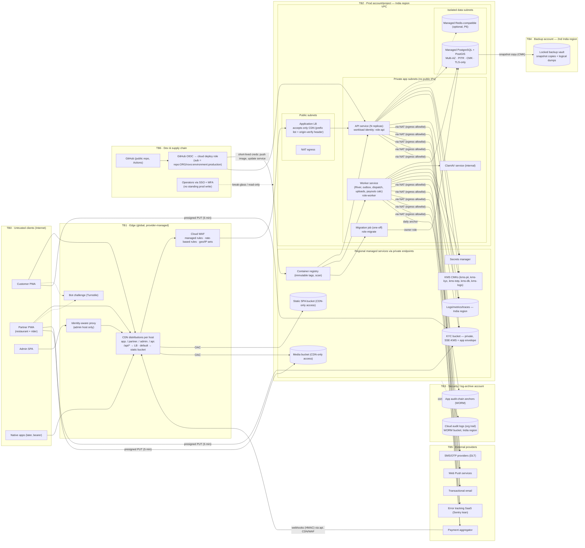
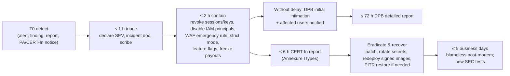

# 19 — Security Threat Model (STRIDE), Security Requirements & Incident Response

| | |
|---|---|
| **Purpose** | Identify the threats to rovo across its data flows and trust boundaries, choose mitigations proportionate to a small team running a **production deployment on a standard hyperscaler in an India region with managed services** (00 §4a), record residual risk, and turn the result into **testable security requirements (`SEC-xxx`)** and an **incident-response outline** that also meets Indian regulatory reporting duties (CERT-In, DPDP). |
| **Owner** | Security Architect |
| **Status** | Draft v1.1 — reconciled with review (31) and rulings R1–R48, 2026-10-04 |
| **Depends on** | `00-planning-baseline.md` (esp. §4a); `08-system-architecture.md`; `10-database-schema.md`; `11-api-specification.md`; `12-auth-rbac.md` (identity, sessions, RBAC — this doc assumes it); `13-order-state-machine.md`; `14-payment-architecture.md` (PA, webhooks, refunds, ledger); `15-notification-architecture.md` (SMS/DLT, push); `16-delivery-zone-architecture.md`; `17/18` (frontend, PWA, CSP delivery); `21-cicd-strategy.md` (OIDC, scans, signing); `22-deployment-architecture.md` (VPC, managed services, IaC); `23-backup-disaster-recovery.md`; `24-observability-strategy.md`; `25-free-hosting-comparison.md` (dev/preview + production cloud costs) |
| **Consumed by** | QA (`20` turns §9 into tests), DevOps (`21–25`), Release (`27`, `29`, `30`), Legal review |

Tags: `[ASSUMPTION]`, `[OPEN]`, `[LEGAL]`. All external facts are cited in §12 with access date **2026-10-04**. Nothing here is legal advice; every `[LEGAL]` item needs Indian counsel before launch.

**Changes in v1.1** (review 31 + rulings R1–R48):
- **No-NAT closed pilot (R28):** API/worker tasks run in public subnets with compensating controls: SG ingress only from the ALB, no inbound reachability, SG egress allow-list plus an app-level host allow-list, VPC endpoints for S3/ECR/Secrets Manager/CloudWatch Logs, and GuardDuty Runtime Monitoring. **One NAT Gateway (single AZ) and private subnets before Gate B**, or earlier if a provider requires IP allow-listing. New threat **T-98** and requirement **SEC-187**; DFD and TB table updated (RV-026).
- **CERT-In / DPDP log archive (R36, M1, RV-085):** 180-day India-region archive of all ICT logs; security events kept ≥ 1 year; VPC flow logs ALL (not rejects only). SEC-134 rewritten (§7.6, §8.10).
- **Sentry removed (R36):** Grafana Cloud (incl. Faro) only; the cross-border error-tracking item is resolved (RV-032; T-91, §7.6, §8.9).
- **Admin (R37):** TOTP mandatory, passkeys P1, WAF rate + geo-IN rules; **IAP withdrawn** (C4) (T-08, W5, SEC-025).
- **KYC (R38):** images only, re-encode, SSE-KMS, audited view; **ClamAV withdrawn** (C5); field-level encryption stays for bank numbers and TOTP secrets (§6.10, T-55, SEC-104 withdrawn, new SEC-190).
- **Audit (C6):** append-only grants + trigger; **hash chain and WORM anchor withdrawn** (T-52, SEC-127/128 withdrawn).
- **Audience trust (RV-025):** audience derived from `Host` only with the origin-verify secret; new **SEC-186** (T-15, T-63).
- **Maker-checker (R31):** five families + break-glass; new **SEC-189**; SEC-050 withdrawn. **Erasure map** (M15): new **SEC-192**.
- Four hosts (R14); four AWS accounts (C18); local Docker only for dev (R24); risk-based bot challenge (RV-034); delivery OTP per R39; COD compensation per R29; SSE heartbeat 20 s (R10); named incident roles (RV-036).
- SEC IDs are stable; removed requirements are marked **Withdrawn v1.1**; new IDs start at SEC-186.

**Cloud-agnostic convention:** controls are named generically, with examples as *AWS / GCP* (Azure where useful). DevOps (22) picks the primary cloud; the threat model holds for either.

| Generic control | AWS example | GCP example |
|---|---|---|
| Account/project isolation & guardrails | AWS Organizations + SCPs, Control Tower | Resource Manager folders + Org Policy constraints |
| Workforce identity / SSO | IAM Identity Center | Cloud Identity / Workspace + IAM |
| Workload identity | ECS task role / IRSA | Service account per Cloud Run/GKE workload |
| CI federation | GitHub OIDC → IAM role (`sts:AssumeRoleWithWebIdentity`) | Workload Identity Federation |
| Managed containers | ECS Fargate (services + one-off tasks) | Cloud Run (min instances, instance-based billing) / GKE Autopilot |
| Managed Postgres + PostGIS + PITR | RDS for PostgreSQL / Aurora PostgreSQL | Cloud SQL for PostgreSQL |
| Object storage / WORM | S3 + Block Public Access + Object Lock | GCS + Public Access Prevention + Bucket Lock |
| CDN / LB | CloudFront + ALB | Cloud CDN + external Application LB |
| WAF / rate limiting / bot | AWS WAF (managed rule groups, rate-based rules, CAPTCHA/Challenge) | Cloud Armor (preconfigured WAF rules, rate-based ban/throttle) |
| Secrets / keys | Secrets Manager + KMS (CMKs) | Secret Manager + Cloud KMS |
| Private service access | VPC endpoints (Gateway/Interface) | Private Google Access / Private Service Connect |
| Cloud audit logs | CloudTrail (org trail) + Config | Cloud Audit Logs (Admin Activity + Data Access) + Asset Inventory |
| Threat detection / posture | GuardDuty, Security Hub, IAM Access Analyzer | Security Command Center, Policy Analyzer |
| Backups | RDS automated backups/PITR + AWS Backup (vault lock, cross-account copy) | Cloud SQL backups/PITR + Backup and DR (backup vault) |

---

## 1. Scope, method and assumptions

**In scope (production and staging):**
- customer PWA (`app.`), restaurant PWA (`restaurant.`), rider PWA (`rider.`), admin SPA (`admin.`) — all serving `/api/v1` same-origin (R14, R27); `api.` host for provider webhooks only in V1 (native bearer clients later);
- CDN/WAF edge; VPC with load balancer, API and worker services, migration job, managed PostgreSQL/PostGIS, optional managed Redis-compatible cache;
- object storage (static, media, KYC, logs, backups); secrets manager, KMS, container registry;
- cloud audit/logging/monitoring;
- external providers: PA, SMS/OTP, Web Push, email, Grafana Cloud (metrics, traces, logs, Faro frontend errors/RUM; R36);
- GitHub repo and Actions (OIDC to cloud);
- people: customers, partners, riders, admins, cloud operators, contributors.

**Local/dev/preview** environments (local Docker Compose only, R24) are in scope only for one rule: **they must never hold production data or production secrets** (SEC-185).

**Out of scope (V1):** native apps (design must not block them), multi-city, live GPS, automated payouts/splits.

**Method:** data-flow diagram, then STRIDE per element and per flow, then threat table, mitigations mapped to `SEC-xxx`, and residual risk.

**Rating:**
- **Likelihood** L/M/H: H = expected within months of launch given known Indian food-delivery fraud patterns; M = plausible; L = needs skill/insider/luck.
- **Impact** L/M/H: H = money loss > ₹50k, PII breach of many users, regulatory reporting, or outage > 4 h; M = single-user harm or limited loss; L = nuisance.

**Key assumptions:**
- `[ASSUMPTION]` Production and staging run in an **India region** (AWS `ap-south-1` Mumbai / `ap-south-2` Hyderabad, or GCP `asia-south1` Mumbai / `asia-south2` Delhi), with DR in the other India region of the same cloud.
- `[ASSUMPTION]` The PA provides hosted checkout and HMAC-signed webhooks. rovo never handles card or UPI credentials.
- `[ASSUMPTION]` The operator is a registered **body corporate**, so CERT-In directions and DPDP Data Fiduciary duties apply to the operator. The open-source project must ship features that let operators comply.
- `[ASSUMPTION]` The team is small (≤ 5 engineers, ≤ 10 admin users, ≤ 3 cloud operators). 24×7 on-call is not realistic, so managed services, automation and alerting compensate.

---

## 2. Assets and data classification

| Class | Examples | Handling summary |
|---|---|---|
| **C0 Secrets & keys** | JWT signing keys, OTP/phone/recovery-code peppers, KMS CMKs (non-exportable), PA API keys & webhook secret, SMS keys, DB credentials, VAPID keys, CDN origin-verify header, Terraform state | Secrets manager under CMKs; KMS keys non-exportable; no long-lived cloud keys anywhere (OIDC/SSO only); never in the repo; rotated (§7.5) |
| **C1 Highly sensitive personal / financial** | KYC documents, bank account numbers, payee UPI VPAs, PAN/DL numbers, TOTP secrets, admin password hashes, precise rider location history | Field-level KMS envelope encryption for bank numbers, VPAs, PAN/DL numbers and TOTP secrets; KYC images in a private SSE-KMS bucket (no app-layer file encryption, R38); step-up + audit on view; strict retention |
| **C2 Personal data** | Phone, name, email, addresses + pin lat/lng, order history, device ids, IPs, reviews, tickets | Access control + masking; redaction in logs; DPDP retention; **stored only in India regions** |
| **C3 Business-confidential** | Commission, payouts, ledger, fraud rules/thresholds, reports | RBAC; fraud thresholds in DB config, not the public repo |
| **C4 Public** | Restaurant names, menus, prices, photos, zones | Integrity (defacement/XSS) matters most; may be cached at global CDN edges |
| **Control-plane assets** | Cloud org/root accounts, IAM roles and policies, IaC code and state, CI deploy roles, audit logs | Account separation, guardrail policies, WORM audit logs, change review |

Money integrity (orders, payments, refunds, ledger, COD cash) is treated as an asset in its own right: **integrity + non-repudiation**.

---

## 3. Threat agents

| Agent | Motivation | Capability |
|---|---|---|
| Opportunistic fraudster (customer) | Free food, coupon farming, refund abuse | Multiple SIMs, emulators, scripts |
| SMS-pumping / bot operator | Toll-fraud revenue, SMS bombing | Botnets, residential proxies |
| Dishonest rider | Keep COD cash, fake deliveries, inflate pay | Mock-location apps, collusion |
| Dishonest restaurant | Gaming ranking/payouts, fake rejections | Owns partner account |
| Insider admin (support/ops/finance) | Refund to self, payout redirection, PII selling | Legitimate app access |
| Insider / compromised **cloud operator** | Data theft, sabotage, ransom | Cloud console/CLI access — highest blast radius |
| Account-takeover attacker | Steal payouts/PII | SIM swap, "share your OTP" scams |
| External attacker | Data theft, defacement, ransom, crypto-mining on our bill | Reads our **public code**; scanners; leaked-key hunting |
| Supply-chain attacker | Mass compromise via npm/Go/Actions | npm worm incidents in 2025 |
| Malicious contributor | Exfiltrate CI credentials, poison builds | Opens PRs from forks |
| Stalker / harasser | Locate customer or rider | Orders, social engineering |

---

## 4. Data-flow diagram and trust boundaries



### 4.1 Trust boundaries and entry points

| TB | Boundary | Crossing flows | Primary controls |
|---|---|---|---|
| TB0→TB1 | Device → edge | All HTTP(S), SSE, uploads (presigned to bucket) | TLS 1.2+ (HSTS preload), WAF managed + rate rules, bot challenge on OTP, IAP on admin |
| TB1→TB2 | Edge → LB / buckets | `/api/*` to LB; static/media from buckets | **LB only reachable from the CDN** (CDN prefix list in LB security group + secret origin-verify header, rotated); buckets reachable only via CDN origin access control; no public bucket ACLs |
| TB2 internal | LB → services → data | App traffic | Private subnets; security groups allow only LB→API, API/worker→DB/cache; DB in isolated subnets with no internet route; TLS to DB enforced; separate DB roles |
| TB2 → regional services | Services → secrets/KMS/storage/registry/logs | API calls | Private endpoints; per-workload IAM roles; resource policies (bucket/key/secret) restricting principals **and** VPC endpoint (`aws:SourceVpce` / VPC-SC `[OPEN]`) |
| TB5→TB2 | PA webhooks inbound | `POST api.rovo.in/webhooks/{provider}` | HMAC on raw body, idempotency, amount/order match, fetch-to-confirm (§6.5) |
| TB2→TB5 | Egress to providers | PA, SMS, push, email, error tracking | NAT egress; **DNS/egress allowlist** (AWS Network Firewall / DNS Firewall, GCP Cloud NGFW / Secure Web Proxy) `[OPEN — cost; minimum: app-level host allowlist]`; PII minimisation |
| TB2→TB3/TB4 | Logs, audit, backups to separate accounts | Audit trail, backup copies | Separate accounts; WORM (Object Lock / Bucket Lock, vault lock); prod operators cannot delete |
| TB6→TB2 | CI/operators → cloud control plane | Deploys, IaC, console | GitHub OIDC with pinned subject claims; SSO + phishing-resistant MFA; least-privilege permission sets; guardrail policies (region lock, no public storage, no trail stop) |
| Admin app | Admin SPA ↔ API | Highest-privilege app actions | IAP outer gate, password+TOTP, step-up, maker-checker, audit (12) |

---

## 5. Threat table

Owners: **BE** Backend, **FE** Frontend, **DO** DevOps/Cloud, **SEC** Security, **OPS** Operations, **FIN** Finance, **PRD** Product, **LEG** Legal. Release: **V1** at launch; **V1.1** first increment.

### 5.1 Authentication & sessions

| ID | Component | STRIDE | Threat | L | I | Mitigation (→ SEC) | Residual | Owner | Rel |
|---|---|---|---|---|---|---|---|---|---|
| T-01 | OTP verify | S | **OTP brute force** across challenges/phones | M | H | 5 attempts per challenge, per-phone failure caps, new challenge per resend, HMAC+pepper, constant-time compare (SEC-001..004) | L | BE | V1 |
| T-02 | OTP request | D / financial | **SMS pumping / toll fraud** | H | M | `+91` mobiles only; bot challenge on every request; layered limits (phone/IP/subnet/device) in Postgres; WAF rate rule on OTP path; global budget breaker + provider cap; conversion-ratio alerts (SEC-005..009, SEC-108) | L–M | BE/DO | V1 |
| T-03 | OTP request | D | **SMS bombing** a victim's phone | M | L | Per-phone caps + exponential cooldown (SEC-006) | L | BE | V1 |
| T-04 | Member accounts | S | **SIM-swap ATO** → payout redirection / PII | M | H (partner) / M | DoT 24 h SMS bar; step-up + 48 h cooling-off + out-of-band notice + finance approval for payout destination; new-device notice (SEC-010, SEC-052) | M | BE/FIN | V1 |
| T-05 | Member accounts | S/I | **Recycled phone number** inherits old account | M | M | 180-day "is this you?" detach flow; partner re-KYC after 90 days (SEC-011) | L | BE/PRD | V1 |
| T-06 | OTP channel | S | **OTP social engineering / phishing relay** | H | M | "Never share" SMS text; WebOTP origin binding; delivery PIN distinct from login OTP; in-app education (SEC-012) | M | PRD/BE | V1 |
| T-07 | Auth endpoints | I | **Account enumeration** | M | L | Identical responses/timing (SEC-013) | L | BE | V1 |
| T-08 | Admin login | S | **Admin phishing / credential stuffing** | M | H | argon2id, breached list, lockout, mandatory TOTP, IAP outer gate with workforce MFA, WAF rate rule; WebAuthn V1.1 (SEC-014..019) | M → L (V1.1) | SEC/BE | V1/V1.1 |
| T-09 | Admin creds at rest | I | TOTP secrets/recovery codes from a DB dump | L | H | TOTP secrets KMS-envelope-encrypted; recovery codes HMAC'd with pepper in secrets manager (SEC-017, SEC-120) | L | BE | V1 |
| T-10 | Web sessions | I | **Token theft via XSS** | M | H | HttpOnly cookies; strict CSP; step-up on sensitive actions (SEC-026, SEC-061..066) | L–M | FE/BE | V1 |
| T-11 | Refresh tokens | S | **Stolen refresh token replay** | M | H | Rotation; reuse → family revocation + notice; expiries; device list (SEC-027..029) | L | BE | V1 |
| T-12 | JWT verify | S/E | **alg=none / confusion / forgery** | L | H | Fixed alg allowlist per `kid`, claim checks, size limit (SEC-030) | L | BE | V1 |
| T-13 | Signing keys | S/E | Signing-key leak lets attacker mint tokens | L | H | Key in secrets manager, readable only by `role-api` (resource policy), access logged in cloud audit; rotation; KMS-held ES256 option (12 §4.10); server-side session check for admin/partner (SEC-031, SEC-121) | L | DO/SEC | V1 |
| T-14 | Cookie-auth API | T | **CSRF** | M | H | Same-origin `/api` per app host, SameSite, Fetch-Metadata/Origin check, `X-Rovo-Client` + JSON → preflight, no GET side effects (SEC-032..034) | L | BE/FE | V1 |
| T-15 | Multi-app | E | **Cross-app pivot** (customer-app XSS → admin API) | L | H | Host-only cookie jars per app host; admin `SameSite=Strict`; audience check; no CORS (SEC-035) | L | BE/DO | V1 |
| T-16 | SSE / URLs | I | Tokens in URLs → CDN/LB/access logs | M | M | No tokens in query strings; cookie-auth SSE; CDN/LB logs exclude query strings on sensitive paths (SEC-036, SEC-131) | L | BE/FE | V1 |
| T-17 | Login | S | Session fixation / login CSRF | L | M | New session on login; CSRF controls on auth endpoints (SEC-037) | L | BE | V1 |

### 5.2 Authorisation & data access

| ID | Component | STRIDE | Threat | L | I | Mitigation | Residual | Owner | Rel |
|---|---|---|---|---|---|---|---|---|---|
| T-18 | Orders/addresses/deliveries | I/T | **IDOR**. UUIDv7 ids are time-ordered and partially predictable, so they are not secrets | H | H | L2 policy + L3 scoped queries; 404 on foreign ids; cross-tenant test matrix; denial-burst alerts (SEC-041..044) | L | BE | V1 |
| T-19 | Write APIs | E | **Mass assignment / role escalation** via body fields | M | H | Generated request types, `additionalProperties: false`, ownership from principal (SEC-045) | L | BE | V1 |
| T-20 | Admin APIs | E/I | Cross-city admin access | L | M | City-scope predicate + tests (SEC-046) | L | BE | V1 |
| T-21 | Partner APIs | E/I | Staff sees finance/bank or other outlet | M | M | `ctx` + scope; staff subset (SEC-041, SEC-047) | L | BE | V1 |
| T-22 | Rider app | I | **Rider stalking / PII retention** | M | H | PII only during active delivery + 30 min; locality-only offers; masked calling V1.1 `[OPEN]` (SEC-048) | M | BE/FE/PRD | V1/V1.1 |
| T-23 | Customer → rider | I | Customer stalks rider | L | M | Rider first name + photo only (SEC-048) | L | PRD | V1 |

### 5.3 Web application & content

| ID | Component | STRIDE | Threat | L | I | Mitigation | Residual | Owner | Rel |
|---|---|---|---|---|---|---|---|---|---|
| T-24 | SPAs, **esp. admin** | T/E | **Stored XSS via UGC** (reviews, menu text, restaurant names, addresses, instructions, tickets) rendered in admin console | M | H | React escaping; lint ban on `dangerouslySetInnerHTML`; plain-text UGC; server validation; strict CSP + Trusted Types on admin; template escaping (SEC-061..066) | L | FE/BE | V1 |
| T-25 | SPAs | T | Clickjacking | L | M | `frame-ancestors 'none'`, XFO DENY via CDN response-headers policy (SEC-067) | L | DO/FE | V1 |
| T-26 | Auth/payment return | S | **Open redirect** | M | M | Allowlisted relative paths; server-derived return destination (SEC-068) | L | FE/BE | V1 |
| T-27 | Data layer | T/I | SQL injection | L | H | sqlc parameterised queries; semgrep/gosec (SEC-069) | L | BE | V1 |
| T-28 | Notifications | S/T | **Template injection** into SMS/push/email | M | M | Length-limited, URL-stripped variables; name validation (SEC-070) | L | BE | V1 |
| T-29 | Third-party scripts | T/I | Compromised third-party script | L | H | No third-party analytics V1; CSP allowlist (bot challenge, PA checkout, tiles); no edge script injection features (SEC-063, SEC-071) | L | FE/DO | V1 |
| T-30 | CDN cache | I | **Cache poisoning / caching personalised API responses** at global edges (PII leak across users; residency) | M | H | `/api/*` CDN behaviour with caching **disabled**; `Cache-Control: no-store` on authenticated responses; `Vary` correct on static; cache keys exclude unkeyed headers; test that `/api/*` is never served with a cache hit (SEC-171) | L | DO/BE | V1 |

### 5.4 Commerce, payments & fraud

| ID | Component | STRIDE | Threat | L | I | Mitigation | Residual | Owner | Rel |
|---|---|---|---|---|---|---|---|---|---|
| T-31 | Checkout | T | **Price/fee tampering** | H | H | Server-authoritative stored quote bound to user + cart hash, 10-min expiry, re-validation; client sends no amounts (§6.3) (SEC-076, SEC-077) | L | BE | V1 |
| T-32 | Checkout | T | Quote replay after menu/fee/coupon change | M | M | Version stamps → 409 re-quote (SEC-077) | L | BE | V1 |
| T-33 | Coupons | S/E | **Coupon multi-accounting** | H | M | Per-phone/device/address-cell/payment-fingerprint limits; first-order rules; budget caps; anomaly report (§6.4) (SEC-078..080) | M | BE/PRD | V1 |
| T-34 | Coupons | I | Private code guessing | M | L | ≥ 10-char random codes; rate limit (SEC-081) | L | BE | V1 |
| T-35 | PA webhooks | S | **Webhook spoofing** | M | H | HMAC on raw body; fetch-to-confirm (SEC-082, SEC-084) | L | BE | V1 |
| T-36 | PA webhooks | T | **Webhook replay / duplicates** | H | M | `provider_events` unique id; idempotent transitions (SEC-083) | L | BE | V1 |
| T-37 | Payment confirm | T | **Amount/currency/order mismatch** | M | H | One server-created PA order per rovo order; verify amount, INR, ids, `captured` (SEC-084) | L | BE | V1 |
| T-38 | Payment return | S | Client "success" redirect trusted | M | H | Return endpoint non-authoritative; webhook/reconciliation only (SEC-085) | L | BE/FE | V1 |
| T-39 | Refunds (customer) | T/R | **"Item missing" / "not delivered" refund abuse** | H | M | 2 h claim window; photo evidence; scored auto-approval; refund to source / platform credit; partner evidence (§6.6) (SEC-086, SEC-087) | M | PRD/OPS/BE | V1 |
| T-40 | Refunds (insider) | T/E | **Insider refund fraud** | M | H | Thresholds + per-agent caps + maker-checker; source-only refunds; reason + ticket; anomaly report (SEC-088, SEC-053) | L | FIN/BE | V1 |
| T-41 | Payouts | T/E | **Payout destination hijack** | M | H | Step-up + 48 h cooling-off + notice + finance verification + maker-checker (SEC-052, SEC-089) | L | FIN/BE | V1 |
| T-42 | COD | T/R | **Rider COD cash theft** | H | M | Cash ledger; ₹2,000 limit; UPI deposits + reconciliation; ageing alerts (§6.7) (SEC-090, SEC-091) | M | FIN/OPS | V1 |
| T-43 | COD | T | **Fake COD orders / refusal** | H | M | COD max value; COD block after 2 undeliverable; phone-verified only (SEC-092) | M | PRD/BE | V1 |
| T-44 | Delivery completion | R/T | **Fake "delivered"** | M | M | Delivery PIN for COD/high-value; geofence; dispute flow (SEC-093) | L–M | BE/PRD | V1 |
| T-45 | Rider location | S/T | **Location spoofing (mock location)** | H | M | PWAs cannot detect mock location; plausibility checks, geofences, fresh-fix rules, ops review; native attestation later (§6.8) (SEC-094) | **M–H (accepted V1)** | BE/OPS | V1 / native |
| T-46 | Restaurant ops | R/T | **Fake rejections / gaming** | M | M | Reason codes; auto item-off; auto-pause thresholds; analytics; contract penalties `[PRD/LEG]` (SEC-095) | M | OPS/PRD | V1 |
| T-47 | Onboarding | S | **Fake restaurants/riders** (forged FSSAI/DL, stolen IDs) | M | H | Manual KYC, FSSAI portal check, field/video verification, selfie match, bank-name match, probation (SEC-096) | M | OPS | V1 |
| T-48 | Marketplace | S/T | **Collusion** (rider/restaurant + customer) | M | M | Self-dispatch ban; link graph; promo exclusion; one review per order (SEC-047, SEC-097) | M | BE/OPS | V1/V1.1 |
| T-49 | Reviews | T | Fake/abusive reviews with PII | M | L | Delivered-only, one per order, PII mask, moderation (SEC-098) | L | BE/OPS | V1 |

### 5.5 Admin & insider (application)

| ID | Component | STRIDE | Threat | L | I | Mitigation | Residual | Owner | Rel |
|---|---|---|---|---|---|---|---|---|---|
| T-50 | Admin console | I/E | **Insider PII browsing/exfiltration** | M | H | Least privilege; masking; reveal with step-up + reason + audit; export maker-checker; reveal-rate alerts; access reviews (SEC-049, SEC-050, SEC-054) | M | SEC/OPS | V1 |
| T-51 | Admin console | T/E | **Compromised admin → mass refunds/payout redirect/role grants** | L | H | Step-up; maker-checker; caps; instant revocation; IAP (SEC-051..053) | L | SEC/BE | V1 |
| T-52 | App audit log | R/T | **Audit tampering** by someone with DB access | L | H | Append-only privileges + trigger; hash chain; daily anchor to WORM bucket in log-archive account (SEC-126..128) | L | BE/DO | V1 |
| T-53 | Impersonation | E/R | "Login as" abuse | — | — | **Not built** (12 §5.6) | n/a | — | — |

### 5.6 Uploads, storage & media

| ID | Component | STRIDE | Threat | L | I | Mitigation | Residual | Owner | Rel |
|---|---|---|---|---|---|---|---|---|---|
| T-54 | Images | S/I | **SSRF** via image URLs, reaching the cloud metadata/credentials endpoint (e.g. 169.254.169.254, ECS 169.254.170.2) to steal workload credentials | L (by design) | H | **No server-side URL fetching of user input**; outbound client allowlist; IMDSv2 hop-limit 1 wherever VMs/nodes exist; workload roles least-privilege (SEC-101, SEC-176) | L | BE/DO | V1 |
| T-55 | Uploads | T/E | **Malicious upload** (polyglots, bombs, malware PDFs) | M | M | Presigned PUT conditions; magic bytes; re-encode; PDF feature rejection; ClamAV (§6.10); `nosniff`; separate media host (SEC-102..105) | L | BE/DO | V1 |
| T-56 | Public media | I | **EXIF/GPS leakage** | M | L | Re-encode strips metadata (SEC-103) | L | BE | V1 |
| T-57 | Buckets | I | **Public bucket / object exposure** (KYC, backups, logs) | L | H | Account-level Block Public Access / org-policy Public Access Prevention + guardrail deny; CDN origin access control for static/media; KYC app-encrypted; posture checks (SEC-106, SEC-174) | L | DO | V1 |
| T-58 | Presigned URLs | I | Presigned URL leak / long TTL | M | M | PUT 5 min; KYC via API stream (or GET ≤ 60 s); random keys; URLs signed by a dedicated narrow role (SEC-107) | L | BE | V1 |

### 5.7 Availability, abuse & cost

| ID | Component | STRIDE | Threat | L | I | Mitigation | Residual | Owner | Rel |
|---|---|---|---|---|---|---|---|---|---|
| T-59 | Edge/API | D | **L7 DoS / floods** | M | H | Provider L3/L4 DDoS protection (AWS Shield Standard / Cloud Armor standard); WAF managed + rate-based rules (§6.11); app limits; autoscaling with caps; multi-AZ (SEC-108..110) | L–M | DO/BE | V1 |
| T-60 | SSE | D | **SSE connection exhaustion** | M | M | Per-session/user/IP/replica caps; heartbeats; autoscale on connections (SEC-111) | L | BE/DO | V1 |
| T-61 | Search/geo | D | Expensive query abuse | M | M | Indexes, `statement_timeout`, caps, caching, limits (SEC-109) | L | BE | V1 |
| T-62 | Public catalog | I | **Scraping** | H | L | Accept; CDN caching of public catalog; rate limits; no PII on public endpoints (SEC-110) | L | PRD | V1 |
| T-63 | Origin | D/S | **CDN/WAF bypass** by calling the LB/API directly; spoofed client-IP headers | M | H | LB security group allows only the CDN prefix list + secret origin-verify header; client IP taken from trusted proxy hops only (SEC-112, SEC-113) | L | DO | V1 |
| T-64 | Billing | D (financial) | **Denial-of-wallet**: attack traffic drives autoscaling, WAF/CDN request charges, KMS/SMS spend; or a stolen credential spins up crypto-mining | M | M–H | Max replica caps; budgets + cost-anomaly alerts (AWS Budgets/Cost Anomaly Detection, GCP budgets); SMS budget breaker; guardrails restricting regions and instance types; GuardDuty/SCC crypto-mining findings (SEC-181) | L–M | DO/FIN | V1 |
| T-65 | argon2 | D | Memory exhaustion via parallel admin logins | L | M | Per-replica semaphore; WAF rate rule (SEC-018) | L | BE | V1 |

### 5.8 Cloud control plane, infrastructure, data, secrets & supply chain

| ID | Component | STRIDE | Threat | L | I | Mitigation | Residual | Owner | Rel |
|---|---|---|---|---|---|---|---|---|---|
| T-66 | Cloud org / root | S/E | **Cloud root/org-admin compromise** (phished operator, leaked recovery) | L | H (total) | Separate accounts/projects (prod, staging, security/log-archive, backup, sandbox); root/org-owner locked with hardware-key MFA held by 2 custodians, unused day-to-day; SSO only; no IAM users; alerts on root use (SEC-172, SEC-173) | L | DO/SEC | V1 |
| T-67 | IAM | E | **Over-privileged identities** (task role reads all secrets/buckets; CI role is admin) | M | H | One workload identity per service (`role-api`, `role-worker`, `role-migrate`, `role-deploy`); resource policies on secrets/keys/buckets naming those principals; IAM Access Analyzer / Policy Analyzer + unused-access findings in CI and monthly; permission boundaries (SEC-175) | L | DO | V1 |
| T-68 | CI → cloud | E | **Over-broad GitHub OIDC trust** (any branch, fork-triggered workflow, or *another repo* can assume the prod deploy role) | M | H | Trust policy pins `aud` and an exact `sub` (`repo:ORG/rovo:environment:production`; repos created after 15 Jul 2026 use the immutable `ORG@id/repo@id` form); separate roles per env; prod environment requires reviewers and tag refs; deploy role can only push images and update services, **cannot read data or secrets** (SEC-177) | L | DO | V1 |
| T-69 | Operators | S/E | **Operator workstation/session compromise**; standing admin access abused | M | H | SSO with phishing-resistant MFA (FIDO2) for cloud console; short session duration (≤ 4 h); **no standing write access to prod**: read-only by default, time-bound elevation with approval; break-glass role alarmed; no SSH (managed containers); exec-into-task disabled except break-glass (SEC-115, SEC-178) | M | DO/SEC | V1 |
| T-70 | Network | I | **Misconfigured security groups / public DB or cache** | L | H | DB/cache in isolated subnets, no public IP flag, guardrail deny for publicly accessible DB; IaC policy-as-code scans (checkov/tfsec/conftest) in CI; config-drift rules (AWS Config / Asset Inventory) (SEC-117, SEC-174) | L | DO | V1 |
| T-71 | IaC | T/I | **Terraform state / IaC tampering** (state contains secrets and resource ids; malicious PR changes IAM) | M | H | Remote state in a locked, versioned, CMK-encrypted bucket in the prod account with access only for the deploy-infra role; `plan` on PR (read-only role, no apply from forks), `apply` only from protected env with approval; CODEOWNERS on `infra/` (SEC-179) | L | DO | V1 |
| T-72 | Postgres | I/E | **DB credential misuse / over-privileged app role** | L | H | Separate DB roles (§7.1); credentials in secrets manager with rotation (or IAM DB auth `[OPEN]`); TLS enforced; `statement_timeout`; pgaudit for DDL/role changes (SEC-118, SEC-119) | L | DO/BE | V1 |
| T-73 | Data at rest | I | Storage/snapshot theft, provider insider | L | H | Managed storage encryption with **CMKs** (`kms-db`, `kms-logs`); C1 fields app-level KMS envelope encryption; snapshots never shared publicly (guardrail) (SEC-120, SEC-174) | L | DO | V1 |
| T-74 | KMS | D/T | **KMS key disable/deletion (sabotage/ransom) or key-policy lockout** makes data unreadable | L | H | Key deletion waiting period 30 days; guardrail denies `ScheduleKeyDeletion`/`DisableKey`/policy changes except break-glass; alarms on those events; key admins ≠ key users (SEC-124, SEC-180) | L | DO/SEC | V1 |
| T-75 | Backups | I/T/D | **Backup deletion/encryption by attacker**, or restore failure | L | H | Automated backups + PITR (≥ 7 days, target 14–35); **cross-account, cross-region (India) copies to a locked vault** (AWS Backup Vault Lock / GCP backup vault enforced retention); weekly logical dump to Object-Lock bucket; monthly restore drill (SEC-122, SEC-123) | L | DO | V1 |
| T-76 | Cloud audit | R/T | **Attacker disables or deletes cloud audit logs** to hide tracks | L | H | Org-level trail / audit config owned by the security account; guardrail denies `StopLogging`/`DeleteTrail`/sink changes; log files validated (CloudTrail digest) and WORM-stored in the log-archive account; alarms on audit config changes (SEC-182) | L | DO/SEC | V1 |
| T-77 | Logs/telemetry | I | **PII/secrets in logs or SaaS** | H | M | slog redaction; no bodies; error-tracking scrubbing; logs in India-region log store; CDN/LB/WAF logs minimised (SEC-129..132) | L | BE/DO | V1 |
| T-78 | Data residency | I (legal) | **Residency drift**: resources, backups, logs or replicas created outside India (e.g. GCP `_Required`/`_Default` log buckets default to the `global` location; CloudFront/WAF-for-CloudFront logging resources are global or `us-east-1`; SaaS) | M | M | Guardrail region restriction (SCP `aws:RequestedRegion` / Org Policy `gcp.resourceLocations`) to India regions, with documented exceptions for global services (IAM, CDN, WAF-for-CDN, DNS); redirect `_Default` sink to a regional bucket and keep `_Required` content PII-free; CDN/WAF logs to India-region buckets where supported, with IP truncation `[ASSUMPTION — verify per service]`; processor register (SEC-161, SEC-183) | L–M | DO/LEG | V1 |
| T-79 | Secrets | I | **Secret leakage** (repo, task definitions in plain env, IaC state, CI logs, local dev copies) | M | H | Secrets manager references (not plaintext) in task definitions; masked CI logs; gitleaks + push protection; prod secrets never leave the cloud (no local copies); rotation runbooks (SEC-121, SEC-136..138, SEC-185) | L | DO | V1 |
| T-80 | Workloads | E | **Container compromise → lateral movement** | L | H | Distroless non-root images, read-only root FS, no shell; minimal task role; egress allowlist; runtime threat detection (GuardDuty Runtime Monitoring / SCC) `[OPEN — cost]` (SEC-116, SEC-176) | L | DO | V1 |
| T-81 | Dependencies | T/E | **Malicious/vulnerable dependency** | M | H | Lockfiles; blocked lifecycle scripts; `minimumReleaseAge` `[verify]`; govulncheck + osv-scanner; registry image scanning; Dependabot; SBOM (SEC-139..142) | M | DO/SEC | V1 |
| T-82 | CI/CD | E/T | **Compromised Action / workflow injection** | M | H | SHA-pinned Actions; least-privilege `GITHUB_TOKEN`; no `pull_request_target` with PR checkout; `id-token: write` only in deploy jobs; zizmor/actionlint; Scorecard (SEC-143..145) | L | DO | V1 |
| T-83 | CI secrets | I | **Fork PRs exfiltrating credentials** | M | H | No long-lived cloud keys exist in GitHub at all (OIDC only); fork PRs get no secrets and read-only token; prod OIDC subject only matches the protected environment; first-time contributor approval (SEC-146, SEC-177) | L | DO | V1 |
| T-84 | Images/deploy | T | **Image tampering** | L | H | Immutable registry tags; cosign keyless signing + provenance; deploy by digest; signature verification at deploy (or GCP Binary Authorization) (SEC-147) | L | DO | V1 |
| T-85 | Time | R | Inaccurate timestamps undermine forensics | L | L | Cloud provider time sync (Amazon Time Sync / Google internal NTP); CERT-In traceability `[LEGAL/verify]` (SEC-133) | L | DO | V1 |
| T-86 | Managed provider | I | Provider-side insider / managed-service compromise | L | H | Accept residual; CMKs + app-layer encryption for C1; provider attestations (ISO 27001/SOC 2) on file (SEC-120) | L | SEC | V1 |

### 5.9 Privacy, regulatory & open-source

| ID | Component | STRIDE | Threat | L | I | Mitigation | Residual | Owner | Rel |
|---|---|---|---|---|---|---|---|---|---|
| T-87 | Data lifecycle | I (privacy) | **Over-collection / purpose creep / over-retention** | M | H | Data inventory; purpose-mapped notice; retention jobs; minimisation (SEC-151..156) | M | PRD/LEG/BE | V1 |
| T-88 | Rights | I/R | **Rights not honoured in time** | M | M | Self-service export/correction/deletion; SLA queue; grievance officer (SEC-157..160) | L | PRD/OPS | V1 |
| T-89 | Children | I | Children's data without verifiable parental consent | L | M | 18+ service; declaration; block on knowledge `[LEGAL]` (SEC-164) | M | LEG/PRD | V1 |
| T-90 | Breach response | R | **Missing CERT-In 6 h / DPB 72 h** | M | H | IR plan §10; PoC registered; tabletop (SEC-166..170) | L | SEC/LEG | V1 |
| T-91 | Cross-border | I | PII processed outside India (CDN edges, error-tracking SaaS, email/push providers) | M | M | DPDP s.16 (transfers allowed unless restricted; `[LEGAL — re-check]`); data at rest in India; SaaS gets redacted data; DPAs (SEC-132, SEC-161) | L | LEG/DO | V1 |
| T-92 | Payments scope | I | **Card data enters rovo** | L | H | PA hosted checkout; no card fields; never store PAN/CVV (SEC-162) | L | BE/FE | V1 |
| T-93 | OSS | I | Attackers study public code | H | M | Kerckhoffs; security tests; thresholds in DB; PVR (SEC-148, SEC-149) | M | SEC | V1 |
| T-94 | OSS | R | No disclosure channel | M | M | `SECURITY.md`, PVR, `security.txt` (SEC-150) | L | SEC | V1 |
| T-95 | OSS self-hosters | S/E | **Insecure defaults** in forks/self-hosts | M | H | Prod mode refuses dev keys/empty secrets/debug; no default creds; bootstrap CLI (SEC-125) | L | BE | V1 |
| T-96 | Push | I | PII on lock screens | M | L | Order code + status only (SEC-072) | L | BE | V1 |
| T-97 | Non-prod envs | I | **Production data copied to dev/free-tier/preview environments** (laptops, free hosts outside India) | M | H | Policy: no prod data outside prod; synthetic seed data; anonymised staging snapshots only via an approved masking job; preview/free tiers use fake providers (SEC-185) | L | DO/SEC | V1 |

---

## 6. Focused mitigation designs

### 6.1 OTP abuse (T-01..T-07)

Parameters are in 12 §2.2. Three monitoring signals back them up:
- **send→verify conversion** per hour. Normal is about 70–85% `[ASSUMPTION]`. Alert below 40% over 15 min with ≥ 50 sends.
- **sends per number prefix** (first 5 digits), to catch range walking.
- **provider spend per hour.**

Strict mode turns on automatically or via `ADMIN_SUPER`. In it, the WAF rate-based rule on `/api/v1/auth/otp/*` is tightened through IaC-managed parameters (pre-approved change).

### 6.2 XSS, CSP and security headers (T-24..T-30)

Illustrative CSP (FE finalises in 17). It is delivered via **CDN response-headers policy** for static HTML and by the API for API responses:

```
Content-Security-Policy:
  default-src 'none';
  script-src 'self' https://challenges.cloudflare.com https://checkout.razorpay.com;
  style-src 'self';                      # [OPEN] narrow 'unsafe-inline' only if UI libs require it
  img-src 'self' data: blob: https://media.rovo.in https://<tile-host>;
  font-src 'self';
  connect-src 'self' https://<tile-host>;            # telemetry tunnelled via same-origin /api/telemetry
  frame-src https://challenges.cloudflare.com https://api.razorpay.com;
  worker-src 'self'; manifest-src 'self';
  base-uri 'none'; form-action 'self'; frame-ancestors 'none';
  object-src 'none'; upgrade-insecure-requests;
  report-to csp;                                    # admin app adds: require-trusted-types-for 'script'; trusted-types default
```

- **Headers on all responses:**
  - HSTS (`max-age=63072000; includeSubDomains; preload` after a verification period);
  - `X-Content-Type-Options: nosniff`;
  - `Referrer-Policy: strict-origin-when-cross-origin` (admin: `no-referrer`);
  - `Permissions-Policy` (least capability per app);
  - COOP `same-origin`;
  - `X-Frame-Options: DENY`.
- **Authenticated API responses:** `Cache-Control: no-store`. The CDN `/api/*` behaviour uses a **caching-disabled** policy and forwards only needed headers and cookies (T-30).
- **UGC:** plain text only, with length limits (names 80, descriptions 500, reviews 1,000, instructions 250). Control and bidi characters are stripped, and URLs are rejected or neutralised.
- **No edge features that inject scripts or rewrite HTML.** If Cloudflare is placed in front, disable Rocket Loader, Zaraz and Email Obfuscation.

### 6.3 Server-authoritative pricing and quotes (T-31, T-32)

1. `POST /api/v1/quotes` with `{restaurant_id, items:[{item_id, variant_id, addon_ids, qty}], address_id, coupon_code?, payment_method}`. The client sends **no amounts**.
2. The server computes everything from DB data:
   - line prices, packaging;
   - delivery fee from the **stored address pin** and restaurant location (never client-provided distance);
   - platform fee, small-cart fee, GST, coupon.

   It stores `quotes(id, user_id, cart_hash, breakdown jsonb, total_paise, currency, menu_version, pricing_version, coupon_id, expires_at = now()+10 min)`.
3. `POST /api/v1/orders {quote_id, idempotency_key}` checks:
   - the quote belongs to the principal, is unexpired and unused (unique `orders.quote_id`);
   - restaurant open and serviceable;
   - items available;
   - versions unchanged;
   - coupon redeemable atomically.

   Any mismatch returns `409 quote_stale`. The PA order is created server-side for `total_paise`.

**Decision: no client-held signed quote token.** A server-side row with an unguessable id bound to the user is simpler, auditable and revocable. `quote_sig = HMAC(K_quote, …)` can be added later for offline native carts without changing the API.

### 6.4 Coupon abuse (T-33, T-34)

- **Limits:**
  - unique `(coupon_id, user_id)` for once-per-user coupons;
  - counters on `phone_hmac`, `device_id`, `address_cell` (H3 res-11 or 50 m grid + normalised house number), and `payment_fingerprint` (UPI VPA hash or card fingerprint **if the PA exposes it** `[OPEN — 14]`).
- **New-user coupons** need all of: no prior delivered order for the phone; device not linked to another first-order redemption in 90 days; address cell not used for another account's first-order redemption in 90 days.
- **Atomic budget caps:** `UPDATE … SET used = used + 1 WHERE used < max RETURNING`.
- **Release** of a redemption only for cancellations before `ACCEPTED`.
- **Weekly anomaly report** on redemption patterns.
- **Acknowledged limit:** cheap SIMs and emulators remain. The residual risk is M, and budget caps bound the loss.

### 6.5 Payment webhooks (T-35..T-38)

```mermaid
sequenceDiagram
    autonumber
    participant PA as Payment aggregator
    participant EDGE as CDN + WAF (api.rovo.in)
    participant API as rovo API /webhooks/pa
    participant DB as Postgres
    participant W as Worker
    PA->>EDGE: POST webhook (raw JSON, signature header, event id)
    EDGE->>API: forwarded (WAF: no CAPTCHA/challenge on this path; size ≤ 256 KB; optional PA source-IP set)
    API->>API: HMAC-SHA256(raw_body, webhook_secret) == signature (hmac.Equal) else 401 + audit
    API->>DB: INSERT provider_events(provider, event_id, payload_hash) ON CONFLICT DO NOTHING
    alt duplicate
      API-->>PA: 200 (idempotent no-op)
    else new
      API->>DB: enqueue confirm_payment(event_id) (same tx)
      API-->>PA: 200 quickly (< 2 s)
      W->>PA: GET payment (fetch-to-confirm, API key from secrets manager)
      W->>DB: verify pa_order_id ↔ rovo order, amount_paise, currency INR, status captured
      W->>DB: PENDING_PAYMENT → PLACED (idempotent) + ledger entries
      W->>DB: mismatch → payment_anomalies + alert + auto-refund flow (14)
    end
    Note over W,PA: Reconciliation every 2 min for PENDING_PAYMENT > 2 min; daily settlement reconciliation (14)
```

- The webhook secret is held in the secrets manager, with dual secrets supported during rotation.
- Refund calls carry idempotency keys.

### 6.6 Refund fraud (T-39, T-40)

- **Claim types and evidence:**
  - missing / wrong item / quality-spill / not delivered / late;
  - photo required for quality, spill and wrong-item claims;
  - "not delivered" is only accepted where there was no PIN or geofence success.
- **Auto-approval** only if: claim ≤ ₹150, claim ratio < 10% of last 20 orders, ≤ 2 claims in 30 days, and account age > 7 days `[ASSUMPTION — PRD to tune]`. Everything else goes to the support queue.
- **Destination:** original instrument (prepaid) or platform credit (COD) `[PRD]`. **Never** a new account typed by support.
- **Insider controls:**
  - thresholds, daily caps and maker-checker;
  - mandatory reason + ticket;
  - weekly per-agent report;
  - DB check that total refunds ≤ captured amount.

### 6.7 COD cash controls (T-42, T-43)

- **Append-only rider cash ledger** with entries `COD_COLLECTED`, `DEPOSIT_DECLARED`, `DEPOSIT_CONFIRMED` (with UTR), and `ADJUSTMENT` (maker-checker).
- **Cash limit:** ₹2,000 blocks new COD offers.
- **Deposits** preferably by UPI to the collection account, matched by UTR.
- **Ageing alerts** at 24 h and 48 h; suspension at 72 h `[PRD]`.
- **Payout netting** of unremitted cash is subject to the rider agreement `[LEGAL]`.

### 6.8 Rider location and delivery proof (T-44, T-45)

- **Acknowledged limitation:** the browser Geolocation API exposes no mock-location signal, so V1 treats location as a **dispatch hint, not proof**.
- **Ping checks:**
  - implied speed ≤ 80 km/h;
  - a jump of more than 2 km in under 60 s is flagged;
  - accuracy must be ≤ 100 m for the fix to count as proof;
  - repeated identical coordinates are flagged;
  - fixes must fall inside the city polygon.
- **Status proofs:**
  - `AT_RESTAURANT` and `PICKED_UP` need a fix within 150 m of the restaurant, plus restaurant handover confirmation.
  - `DELIVERED` needs the PIN (for COD and high-value orders) **or** a fix within 250 m plus no dispute within 2 h.
- Flags go to the ops review queue and the rider risk score.
- **Native later:** Play Integrity plus `Location.isMock()`.

### 6.9 Restaurant gaming and fake partners (T-46, T-47)

- **Rejections:** reasons are mandatory, and `ITEM_UNAVAILABLE` toggles the named items off. More than 3 rejections or timeouts in 60 min auto-pauses the restaurant for 30 min.
- **Onboarding checks:**
  - FSSAI licence verified on the government portal;
  - GSTIN check;
  - bank-name match (penny-drop via PA if available `[OPEN]`);
  - geotagged storefront photo by a field agent;
  - owner video verification.
- **Probation** for the first 14 days: delayed payouts and order caps.

### 6.10 Upload pipeline and malware scanning (T-54..T-58) — decision

**Decision: ClamAV (`clamd`) for KYC uploads in V1**, run as an **internal service** in the private subnets (its own small container service with ~2 GB memory, signatures updated by `freshclam` through the egress allowlist), reachable only from the worker.

Rationale: KYC PDFs are opened by admins, which is the most plausible malware path to staff machines. Menu and media images are re-encoded instead of scanned.

**AWS alternative:** Amazon GuardDuty Malware Protection for S3 can scan new objects in a bucket and tag results `[ASSUMPTION — verify availability in the chosen India region and price]`. If used, the worker waits for the scan tag before promoting the object. Keeping ClamAV preserves cloud portability (00 §4a rule 1).

**Pipeline:**
- Presigned PUT to a `staging/` prefix (content-type and size enforced in the signature).
- Worker job:
  1. size and magic-byte check;
  2. images: decode with a max pixel count (e.g. 40 MP), re-encode, strip metadata;
  3. PDFs: parse in a time/memory-limited subprocess, reject `/JavaScript`, `/JS`, `/OpenAction`, `/Launch`, `/EmbeddedFile`, `/RichMedia`, and encryption;
  4. clamd INSTREAM scan;
  5. KYC: app-level KMS envelope encryption (12 §6.2) then move to the final prefix; media: publish to the media bucket;
  6. delete staging.

  Failures are quarantined.
- **Staging lifecycle rule:** objects older than 24 h are deleted.
- **Admin viewing:** KYC is viewed via the API stream with `Content-Security-Policy: sandbox`.

### 6.11 DoS, scraping and edge configuration (T-59..T-63)

**Production edge: cloud WAF attached to the CDN distributions** (AWS WAF on CloudFront, or Cloud Armor on the external Application LB / Cloud CDN). Verified AWS WAF rate-based rule properties:
- evaluation windows of **60, 120, 300 or 600 s**;
- minimum limit **10** requests per window;
- aggregation by IP, forwarded IP, or **custom keys** (e.g. header, cookie, query arg, URI path, label);
- optional scope-down statements;
- any action except Allow.

(AWS docs, accessed 2026-10-04.) Cloud Armor provides equivalent throttle/ban rate limiting and preconfigured OWASP CRS rules. Pricing goes in 25.

Proposed rule set (expressed generically; DevOps encodes in IaC):

| # | Rule | Action |
|---|---|---|
| W1 | Provider managed baseline rules (AWS: Core rule set, Known bad inputs, SQLi, Amazon IP reputation; GCP: preconfigured OWASP CRS sqli/xss/lfi/rce at a tuned sensitivity) | Block (start in Count for 1 week in staging) |
| W2 | Rate: `/api/v1/auth/otp/` per IP > 30 / 5 min | CAPTCHA/Challenge → Block on repeat |
| W3 | Rate: `/api/v1/auth/admin/` per IP > 20 / 5 min | Block |
| W4 | Rate: any `/api/` per IP > 3,000 / 5 min (CGNAT-tolerant) | Block 5 min |
| W5 | `admin.` host: IP-set allowlist and/or geo = IN (if IAP not used); plus deny all `/internal/`, `/metrics`, `/debug/` paths everywhere | Block |
| W6 | `api.` host `/webhooks/`: exclude from challenge actions; body-size constraint ≤ 256 KB; optional PA source-IP set | Allow-after-checks |
| W7 | Body size > 64 KB on JSON API paths (except upload-init) | Block |
| W8 | Emergency rule slot (ASN/country/UA/IP set), toggled by IaC variable | Block/Challenge |

- **Bot control** (AWS WAF Bot Control / reCAPTCHA Enterprise) is `[OPEN — cost]`. Turnstile already covers OTP.
- **App-level limits:**
  - per principal + IP token buckets for writes, search, quote, coupon validation and upload-init;
  - Postgres (or managed Redis) for auth;
  - body ≤ 64 KB; read-header 5 s; read 15 s; write 30 s (SSE exempt);
  - `statement_timeout` 3 s (API role) / 60 s (worker).
- **Autoscaling:** min 2 API replicas across AZs, **max cap** set (denial-of-wallet guard, T-64). The worker runs with a fixed count.
- **If Cloudflare is placed in front** (P7 allows it): its Free plan offers only the Free Managed Ruleset, 5 custom rules and **1** rate-limiting rule (10 s period, IP-only) (Cloudflare docs, accessed 2026-10-04). It is useful for DNS/TLS/CDN, but **the cloud WAF stays authoritative**.

---

## 7. Cloud infrastructure, database, cryptography, logging and supply chain

### 7.1 Database roles and hardening (managed PostgreSQL)

| Role | Used by | Privileges |
|---|---|---|
| `rovo_owner` | Migration job (`role-migrate`, one-off task per deploy) | Owns schema; DDL. Not used at runtime. |
| `rovo_app` | API + worker | DML on app tables; **`INSERT, SELECT` only on `audit_events`, ledger tables, `provider_events`** (+ trigger guards); no DDL; `statement_timeout` 3 s (API) |
| `rovo_report` | Read-only reporting | `SELECT` on masked reporting views only |
| Provider master user | Break-glass only | Credentials in secrets manager, retrieval alarmed |

Settings and protections:
- **Network:** isolated subnets, publicly-accessible flag off (guardrail), security group allows only API/worker/migration tasks.
- **TLS required** (`rds.force_ssl=1` / Cloud SQL "require SSL"); clients use `sslmode=verify-full` with the provider CA bundle.
- **Credentials:** in the secrets manager with automatic rotation (or IAM database authentication `[OPEN — pgx support/latency trade-off]`).
- **Encryption at rest** with CMK `kms-db`. Multi-AZ (or documented single-AZ pilot with upgrade trigger per 00 §4a).
- **Backups:** automated + PITR (§7.4).
- **Logging:** `log_connections`, failed auth, and DDL logs exported to the India-region log store. `pgaudit` (supported on RDS and Cloud SQL) for role/DDL changes and reads of C1 tables `[ASSUMPTION — verify extension availability per engine version]`.
- **PostGIS** extension enabled by the owner role in migrations only.

### 7.2 Accounts, network and operator access

- **Account/project layout:** `management` (org only), `security` (audit logs, findings, WORM archive), `backup` (locked vault, 2nd India region), `prod`, `staging`, `sandbox`.
- **Guardrails (SCPs / Org Policies)**, applied org-wide:
  - deny regions outside India (exceptions for global services);
  - deny disabling audit logs / threat detection;
  - deny public storage and public DB snapshots;
  - deny KMS key deletion except the break-glass role;
  - require IMDSv2 where VMs exist;
  - deny creation of long-lived IAM user access keys.
- **VPC:**
  - public subnets hold only the LB and NAT;
  - workloads in private subnets without public IPs;
  - DB/cache in isolated subnets with no internet route;
  - private endpoints for object storage, secrets, KMS, registry and logs;
  - VPC flow logs to the log store (rejects at minimum).
- **Operator access:**
  - SSO with FIDO2 MFA;
  - default read-only permission set in prod;
  - time-bound elevated set with approval for changes;
  - all prod changes via IaC pipeline;
  - **no SSH / no bastion** (managed containers);
  - exec-into-container disabled except a break-glass role, which is audited and alarmed.

### 7.3 Encryption and key management (KMS envelope encryption)

- **CMKs in KMS, India region, one per purpose:** `kms-pii` (column encryption), `kms-kyc` (KYC objects), `kms-totp`, `kms-db` (storage), `kms-logs`, `kms-backup` (in the backup account), `kms-secrets`.
- **Key policies separate roles:** key **administrators** (security account roles; cannot use the key) and key **users** (workload roles; can use the key, not manage it). Automatic rotation is enabled (yearly).
- **Envelope encryption:**
  - The app calls KMS `GenerateDataKey` (AWS) / uses Tink with a Cloud KMS KEK URI (GCP) to obtain DEKs, and encrypts with AES-256-GCM.
  - The wrapped DEK is stored alongside: in `encryption_keys` for column-key versions, or in object metadata per KYC file.
  - Plaintext DEKs are cached in memory for ≤ 15 min / ≤ 10k uses to bound KMS calls and cost.
  - **Recommended library:** Google Tink (Go) with KMS-backed AEAD (supports AWS KMS and GCP KMS), behind a `crypto/envelope` interface (portability rule).
- **Encrypted fields (V1):** payee bank account number, payee UPI VPA, PAN, DL and RC numbers, TOTP secrets, KYC files, and rider location history beyond 24 h `[OPEN — or delete after 30 days]`.
- **AAD** = `table|column|row_id|key_version` (prevents ciphertext swapping).
- **Blind index** `HMAC-SHA-256(K_bidx, normalised)` for dedupe/fraud lookups. `K_bidx` is held in the secrets manager, or as a KMS HMAC key `[OPEN]`.
- **Not column-encrypted:** phone, name, address (operational need). These are protected by access control, CMK storage encryption and audit.
- **Rotation:** CMK auto-rotation is transparent. DEK versions rotate yearly with lazy re-encryption plus a background re-wrap job.
- **Deletion protection:** 30-day waiting period; guardrail and alarms (T-74).

### 7.4 Backups (summary; owned by 23)

- Managed automated backups + **PITR** (retention target 14–35 days).
- Snapshots encrypted with `kms-db`, **copied cross-account and cross-region within India** to a **locked backup vault** (AWS Backup Vault Lock compliance mode / GCP backup vault with enforced retention). Prod operators cannot delete these copies.
- Weekly logical dump (`pg_dump`, for engine-portability and long-term restore tests) written to an **Object Lock / Bucket Lock** bucket in the backup account.
- **Monthly restore drill:** restore into an isolated staging-like account, verify row counts, and verify that C1 fields decrypt via the KMS key grant for the drill role.
- **Erasure vs backups:** erased data ages out of backups within the retention window. This is stated in the privacy notice.

### 7.5 Secrets management

- **All runtime secrets live in the cloud secrets manager:** JWT keys, peppers, PA keys, webhook secret, SMS keys, DB credentials, VAPID keys, origin-verify header.
- Secrets are injected at task start by reference (ECS task-definition `secrets` / Cloud Run secret env or volume). Each workload's identity can read **only its own secrets** (resource policy).
- **No secrets in the repo, images, IaC variables, CI, or Terraform state.** Terraform creates secret *containers* only; values are set out-of-band or by rotation lambdas/jobs.
- **Rotation:** automatic for DB credentials. Runbooks for the others, with dual-key overlap where supported (JWT `kid`, webhook secret).
- **Local/dev:** `.env` with fake values and fake providers. Developers never hold production secrets. SOPS + age is optional for staging-like shared dev secrets in a **private** repo only.

### 7.6 Logging, audit and PII redaction

- **Streams:**
  1. application logs (slog JSON);
  2. app security/audit events (DB `audit_events` + log mirror);
  3. edge/LB access + WAF logs;
  4. **cloud audit logs** (control plane + data-access for KMS, secrets, KYC bucket);
  5. VPC flow logs;
  6. DB logs.
- **Redaction:**
  - `slog` `ReplaceAttr` drops/masks secret and PII keys;
  - regexes for Indian mobile numbers, PAN and 12-digit Aadhaar-like numbers;
  - no request/response bodies;
  - CI log-capture test with PII fixtures.
- **Residency and retention:**
  - Logs live in an **India-region** log store (CloudWatch Logs in `ap-south-1`/`ap-south-2`, or a **regional** Cloud Logging bucket in `asia-south1`/`asia-south2` with the `_Default` sink redirected).
  - Note that GCP's `_Required` bucket is global and cannot be regionalised (GCP docs, accessed 2026-10-04). Only Google-managed admin-activity audit logs land there, so keep application data out of it.
  - Retention: security/access logs **≥ 180 days** (CERT-In); auth/audit events **≥ 1 year** (DPDP Rules).
  - Cloud audit logs are archived to WORM storage in the security account for ≥ 1 year.
- **Error tracking SaaS:** `sendDefaultPii=false`, scrubbing, no session replay, IP collection off. It is a cross-border processor `[LEGAL]`; self-hosting or using the cloud-native error reporting is the residency-preserving alternative `[OPEN — 24]`.
- **Threat detection:** GuardDuty / Security Command Center (standard tier) enabled in all accounts, with findings to the security account and paging for high severity `[ASSUMPTION — cost acceptable; 25 to price]`.

### 7.7 Supply chain and CI/CD (for 21)

- **Go:** `go.sum`, `-mod=readonly`, `govulncheck`, `gosec`, `staticcheck`.
- **JS:** `pnpm --frozen-lockfile`, lifecycle scripts allowlist, `minimumReleaseAge` `[verify]`, `osv-scanner`, eslint security rules.
- **IaC:** `checkov`/`tfsec`/`conftest` policies (no public buckets/DBs, encryption on, logging on, region lock) on every PR. `plan` runs with a read-only role; `apply` only from the protected environment.
- **Containers:**
  - distroless/static non-root base pinned by digest;
  - registry with **immutable tags** and scan-on-push, plus Trivy/Grype in CI;
  - SBOM (Syft) per release;
  - cosign keyless signing + build provenance;
  - deploy references the image **digest** and verifies the signature (or GCP Binary Authorization policy).
- **GitHub → cloud via OIDC only:**
  - `permissions: id-token: write` only on deploy jobs;
  - trust policies pin `aud` and exact `sub` (per environment: `repo:ORG/rovo:environment:staging|production`; new repos use the immutable `ORG@id/rovo@id` subject format);
  - separate roles: `ci-plan` (read-only), `ci-deploy-staging`, `ci-deploy-prod` (push image + update service + run migration task; no data/secret read), `ci-infra-apply` (prod, reviewers required).
- **Repo hygiene:**
  - branch protection;
  - CODEOWNERS on `auth/`, `authz/`, `payments/`, `ledger/`, `migrations/`, `infra/`, `.github/`;
  - Dependabot for Go, npm, Docker, Actions and Terraform providers;
  - secret scanning + push protection;
  - Private Vulnerability Reporting;
  - OpenSSF Scorecard;
  - SHA-pinned Actions;
  - zizmor/actionlint;
  - no `pull_request_target` with PR checkout;
  - first-time contributor approval.

### 7.8 Open-source-specific measures

- `SECURITY.md`: private reporting, 90-day coordinated disclosure, safe-harbour `[LEGAL]`, no bounty in V1.
- `/.well-known/security.txt` (RFC 9116) on every host.
- **No secrets, real data, real infrastructure identifiers, or fraud thresholds in the repo.** The IaC in the public repo is a *module* parameterised by variables; operator-specific values (account ids, domains, IP sets) live in a private ops repo or workspace variables.
- **Safe defaults for self-hosters:** production mode refuses dev keys, empty secrets and debug flags (SEC-125).
- The public IaC ships the guardrails (region lock, encryption, logging) **on by default**.

---

## 8. Privacy and regulatory (DPDP, IT Act, CERT-In, RBI/PCI, Aadhaar) — `[LEGAL]` throughout

### 8.1 DPDP Act 2023 and DPDP Rules 2025: status as of 2026-10-04

| Item | Verified fact | Source |
|---|---|---|
| Rules notified | DPDP Rules 2025 notified **13 Nov 2025** (G.S.R. 846(E)); phased commencement | Khaitan & Co ERGO (15 Nov 2025); AMS Shardul; MeitY |
| Phase 1 (immediate) | Definitions, Data Protection Board, rule-making provisions | Khaitan |
| Phase 2 (+12 months, **13/14 Nov 2026**) | Consent-manager registration/obligations | Khaitan (13 Nov 2026); AMS Shardul (14 Nov 2026) — date differs by a day `[LEGAL — confirm]` |
| Phase 3 (+18 months, **13/14 May 2027**) | Core obligations: notice/consent, Data Fiduciary duties (safeguards, breach intimation, retention/erasure, children, rights, grievance), SDF duties, Board powers | Khaitan; AMS Shardul; KS&K |
| Interim | IT Act s.43A + SPDI Rules 2011 remain until the 18-month mark (passwords and financial information = SPDI) | Khaitan |

**Implication:** we build to DPDP from day one. Launch will likely precede May 2027, and the SPDI Rules apply meanwhile. **Data residency in India** (00 §4a) is a design choice that goes beyond DPDP's current requirements. It simplifies CERT-In log-location questions and future-proofs against notified transfer restrictions.

### 8.2 DPDP obligations → rovo design

| Obligation (Act / Rules) | rovo design response | SEC |
|---|---|---|
| **Notice** (s.5, Rule 3): standalone, clear; itemised data, purposes, specific services; links to withdraw consent / exercise rights / complain to Board | Versioned notice per app (en + te), generated from the data inventory; links in profile | SEC-151 |
| **Consent** (s.6): free, specific, informed, unambiguous, affirmative; withdrawal as easy as giving | `consents` table with notice version and purposes; marketing separate opt-in, off by default; withdrawal toggles | SEC-152 |
| **Legitimate uses** (s.7) | Order fulfilment mapping `[LEGAL]` | — |
| **Security safeguards** (s.8(5), Rule 6): encryption/obfuscation/masking/tokens, access control, monitoring/logging, continuity, **logs ≥ 1 year**, processor contracts | §7 (KMS envelope encryption, IAM least privilege, audit logs, backups/PITR, Multi-AZ); DPAs with cloud, PA, SMS, email, error tracking `[LEGAL]` | SEC-112..124, SEC-126..135, SEC-163, SEC-171..183 |
| **Breach intimation** (s.8(6), Rule 7): principals without delay; Board without delay + detailed report within 72 h | §10 | SEC-166..170 |
| **Retention/erasure** (s.8(7), Rule 8): erase when purpose ends; Third-Schedule 3-year inactivity rule applies to e-commerce entities with ≥ 2 crore users (not rovo at launch); 48 h notice; **≥ 1 year minimum retention** of personal data, traffic data and logs for Seventh-Schedule purposes | §8.5; voluntary 3-year inactivity erasure with 48 h notice | SEC-154..156 |
| **Grievance redressal**: ≤ 90 days | Privacy ticket category; internal SLA 30 days | SEC-159, SEC-160 |
| **Contact person** (s.8(9)) | Grievance/Privacy Officer published `[LEGAL]` | SEC-160 |
| **Rights** (ss.11–14) | Export, correction, deletion, grievance; nominee V1.1 | SEC-157, SEC-158 |
| **Children** (s.9, Rule 10) | §8.6 | SEC-164 |
| **Cross-border** (s.16) | §8.9 | SEC-161, SEC-183 |
| **Penalties** (Schedule): up to ₹250 crore (security safeguards), up to ₹200 crore (breach notification, children) | Prioritises §7 and §10 | — |

### 8.3 Notice and consent UX (for 04/05/06)

- **Customer signup:** OTP → standalone notice (summary + full link) → unticked "I agree" → separate unticked marketing opt-in → 18+ declaration.
- **Partner onboarding:** separate notice (KYC, bank, location while online, sharing with PA/banks).
- **Rider location** only while online, with a visible indicator.
- Notices are versioned; new purposes require re-consent.

### 8.4 Data-principal rights workflows

| Right | Flow | Internal SLA |
|---|---|---|
| Access/summary | "Download my data" (step-up OTP) → async export (JSON + readable) → in-app link 24 h | ≤ 7 days (typically minutes) |
| Correction | Self-service profile/addresses; ticket otherwise | ≤ 7 days |
| Erasure | "Delete account" (step-up) → 7-day grace → anonymise user, delete addresses, keep consent evidence and PII-stripped financial records `[LEGAL]`, `phone_hmac` tombstone for abuse limits `[LEGAL — basis]`; partners settle balances first | ≤ 30 days |
| Withdraw consent | Per-purpose toggles; marketing immediate | Immediate |
| Grievance | Privacy ticket → Grievance Officer | ≤ 30 days (legal max 90) |
| Nomination | V1.1 | — |

The admin `privacy_requests` queue has SLA timers. Erasure is maker-checker, and everything is audited.

### 8.5 Retention and deletion schedule (proposal) `[LEGAL — confirm each row]`

| Data | Retention | Basis / note |
|---|---|---|
| OTP challenges | 24 h | Security |
| Auth/security/audit logs | ≥ 1 year; CERT-In 180 days rolling in India; money-related audit 8 years | `[LEGAL]` |
| Edge/LB/WAF/VPC flow logs | 180 days (India), then delete | CERT-In |
| Cloud audit logs | ≥ 1 year WORM | Security, CERT-In |
| Orders, invoices, payments, ledger, payouts | 8 years; PII minimised after 3 years | GST/Companies Act/IT `[LEGAL — 6 vs 8 years]` |
| Customer addresses | Until deleted; 3-year inactivity erasure with 48 h notice | DPDP |
| Rider location pings | Raw 30 days, then aggregated | Minimisation `[ASSUMPTION]` |
| Delivery proof | 1 year | Disputes; Rule 8(3) |
| KYC (approved) | Partnership + up to 8 years for tax-relevant docs; ID images partnership + 1 year `[LEGAL]` | Contract/tax |
| KYC (rejected/abandoned) | 90 days | Minimisation |
| Support tickets & photos | 2 years | Disputes |
| Consent records | Account lifetime + 1 year after withdrawal/erasure | Evidence |
| Backups (PITR/snapshots/vault copies) | 14–35 days rolling; logical dumps 90 days | Erasure ages out; stated in notice |

Deletion jobs are idempotent, audited and time-travel tested (SEC-154..156). Bucket lifecycle rules enforce object retention.

### 8.6 Children's data `[LEGAL]`

DPDP defines a child as < 18; processing requires verifiable parental consent and no tracking/behavioural monitoring/targeted ads (s.9, Rule 10).

**V1 decision:** the customer service is **18+ only**. A self-declaration is captured at signup, and accounts are blocked and erased on knowledge of a minor. Riders must be 18+ (verified via DL in KYC).

**Counsel to confirm** whether self-declaration is adequate due diligence for a general-audience food app.

### 8.7 Breach notification (DPDP + CERT-In)

- **CERT-In:** Annexure-I incidents within **6 h of noticing**, to `incident@cert-in.org.in` / 1800-11-4949. Annexure I includes data breach, data leak, unauthorised access, website intrusion/defacement, attacks on e-commerce applications and digital payment systems, DoS/DDoS, identity theft/phishing, malicious code, and attacks affecting cloud systems.
- **DPDP Board:** initial intimation without delay; **detailed report within 72 h**.
- **Data principals:** without delay (in-app + SMS), with nature, consequences, mitigation, safety steps and a contact.

### 8.8 Grievance Officer and e-commerce duties `[LEGAL]`

Name a Grievance Officer (who also handles DPDP grievances). The Consumer Protection (E-Commerce) Rules 2020 grievance-officer and timeline duties also apply to e-commerce entities `[LEGAL — verify current text; not re-verified in this pass]`.

### 8.9 Cross-border transfers and residency

- **At rest in India:** DB, object storage (KYC, media origin, logs, backups) and the log store are all in India regions, enforced by guardrails (T-78).
- **Unavoidably global or outside India:**
  - CDN edge caches (only public static assets and public catalog responses are cached; never personalised `/api/*`, T-30);
  - global control-plane services (IAM, DNS, WAF-for-CDN configuration);
  - possibly error-tracking SaaS, email and push providers (Web Push necessarily traverses browser vendors' push services).
- DPDP s.16 permits transfers except to restricted countries (none notified as of access date `[LEGAL — re-check]`).
- **Mitigations:** minimise and redact what leaves; DPAs; processor register (SEC-161).
- **RBI's 2018 payment-data storage directive** binds payment system operators (the PA), not rovo as merchant. rovo stores only PA references, amounts and status, in India `[LEGAL — confirm]`.

### 8.10 CERT-In Directions (28 Apr 2022)

They apply to service providers, intermediaries, data centres, **body corporate** and government organisations. That covers the operator `[LEGAL — confirm for the operator entity]`.

| Direction | rovo control | SEC |
|---|---|---|
| (i) Clock sync to NIC/NPL NTP or traceable; multi-geography infra may use other accurate standard sources that don't deviate from NIC/NPL | Managed runtimes use the provider's time service (Amazon Time Sync / Google internal NTP). Record a compliance note that these are accurate standard sources; if counsel requires NIC/NPL traceability explicitly, any VM-based components sync to `time.nic.in` / `samay1.nic.in` `[LEGAL/verify]` | SEC-133 |
| (ii) Report Annexure-I incidents within 6 h | §10 | SEC-166 |
| (iii) Point of Contact; comply with information directions | PoC registered (Annexure II) before launch | SEC-167 |
| (iv) Logs of all ICT systems, 180 days rolling, within Indian jurisdiction | India-region log store and WORM archive ≥ 180 days, covering app, LB/edge, WAF, VPC flow, DB and cloud audit logs. (The CERT-In FAQ of May 2022 indicates logs may be kept abroad if producible in reasonable time; we keep them in India regardless.) | SEC-134 |
| (v) VPS/cloud/VPN provider KYC | Not applicable to rovo | — |

### 8.11 RBI Payment Aggregator directions and card data

- RBI's consolidated **PA Directions (15 Sep 2025)** supersede the 2020/2021 guidelines. Commentary notes PAs may aggregate only for merchants they contract with directly, and may not run marketplaces themselves.
- **Marketplace-structure question** (rovo collects as merchant and settles restaurants via ledger, vs sub-merchant/split onboarding) is for 14 and counsel `[LEGAL]`.
- **RBI CoF restriction** (effective 1 Oct 2022): only issuers/networks may store actual card data. rovo never receives or stores card number, CVV or expiry.

### 8.12 PCI-DSS scope minimisation

- PA hosted/redirect or PA-hosted iframe/modal checkout only; no card/UPI-PIN fields in rovo code. The posture is SAQ-A-like.
- Checkout-launching pages get a strict CSP (PA script host only) and no other third-party scripts.
- Complete whatever attestation the PA requires `[ASSUMPTION]`.

### 8.13 Aadhaar

See 12 §6.1: no Aadhaar number field; masked Aadhaar images only, with other documents preferred. OVSE duties apply if offline verification is added `[LEGAL]`.

---

## 9. Security requirements checklist (testable)

Format: **ID — requirement — verification** (U unit, I integration/API, E e2e/browser, C CI check, M manual/inspection, O ops drill/scan). QA (`20`) converts each into test cases. All V1 unless marked.

### 9.1 Authentication (OTP and admin)

| ID | Requirement | Verify |
|---|---|---|
| SEC-001 | OTP: 6 digits CSPRNG, 5 min, single use; expired/consumed rejected | U, I |
| SEC-002 | Max 5 verify attempts per challenge; 6th fails even with correct code | I |
| SEC-003 | OTP stored only as HMAC with pepper from the secrets manager; never in DB plaintext, logs or traces | U, I, M |
| SEC-004 | OTP compare is constant-time | U, M |
| SEC-005 | Non-`+91`/non-mobile numbers rejected before provider call | U, I |
| SEC-006 | Per-phone/IP/subnet/device send limits and cooldowns enforced, **shared across replicas and persistent across restarts** | I (multi-replica + restart test) |
| SEC-007 | Every OTP request needs a valid bot-challenge token verified server-side (`success`, `hostname`, `action`), single use | I |
| SEC-008 | SMS budget breaker alerts at 2× and enables strict mode at 4× | I, O |
| SEC-009 | Send→verify conversion metric exported with alert rule | C, O |
| SEC-010 | New-device SMS notice; payout-destination change = step-up + 48 h + notices + finance approval | I, E |
| SEC-011 | > 180-day-inactive phone login shows detach flow | E |
| SEC-012 | OTP SMS says "never share"; delivery PIN (4) distinct from login OTP (6) | M, U |
| SEC-013 | Identical responses/timing for existing vs non-existing identities (OTP request, admin login, reset) | I |
| SEC-014 | Admin password policy and argon2id (m=64 MiB, t=3, p=1) with rehash | U, I |
| SEC-015 | Admin requires TOTP; unenrolled admins limited to enrolment | I |
| SEC-016 | TOTP ±1 step; replay rejected | U, I |
| SEC-017 | Recovery codes single use, HMAC-stored; use → alert + re-enrol | I |
| SEC-018 | Admin lockout 10/h; progressive delay; argon2 concurrency ≤ 4 per replica | I, load |
| SEC-019 | No admin self-signup; admin creation by `ADMIN_SUPER` + maker-checker; setup links 24 h single use | I |
| SEC-020 | Bootstrap CLI refuses if an `ADMIN_SUPER` exists; never prints the link in prod | I |
| SEC-021 | Session idle/absolute limits per audience (12 §3.4) | I |
| SEC-022 | Step-up (≤ 5 min) enforced for listed actions | I |
| SEC-023 | Phone change: OTP to old + new, revoke sessions, notify old | I |
| SEC-024 | Admins inactive 60 days auto-disabled; monthly access review report | I, O |
| SEC-025 | WebAuthn mandatory for `ADMIN_SUPER`/`ADMIN_FINANCE` (**V1.1**) | E |

### 9.2 Sessions, tokens, CSRF, CORS, SSE

| ID | Requirement | Verify |
|---|---|---|
| SEC-026 | Web tokens only in HttpOnly Secure cookies as specified; none in JS storage or bodies | E, I |
| SEC-027 | Refresh rotates on each use | I |
| SEC-028 | Refresh reuse > 15 s → family revocation + event; ≤ 15 s → 409 | I |
| SEC-029 | Session list/remote logout; revocation latency per audience | I |
| SEC-030 | JWT verification rejects wrong alg/`kid`/`aud`/`iss`/`typ`, expired, oversize | U |
| SEC-031 | Key rotation with overlap; emergency removal drill | I, O |
| SEC-032 | Unsafe methods need `X-Rovo-Client` + JSON (except upload-init) | I |
| SEC-033 | Cross-origin unsafe requests (incl. sibling subdomains) rejected | I, E |
| SEC-034 | No `Access-Control-Allow-*` on app hosts; `/api` preflights 403 | I |
| SEC-035 | Host-only cookies; audience mismatch rejected; `api.` ignores cookies, app hosts ignore `Authorization` | I |
| SEC-036 | No credentials in URLs; Referrer-Policy set | C, I |
| SEC-037 | New session id at login | I |
| SEC-038 | SSE topic authorisation; foreign topics 404; `reauth` at expiry; heartbeat ≤ 15 s | I |
| SEC-039 | Context switch only within principal's restaurant scopes | I |
| SEC-040 | Logout revokes family and clears cookies; admin `Clear-Site-Data` | I |

### 9.3 Authorisation

| ID | Requirement | Verify |
|---|---|---|
| SEC-041 | Every OpenAPI operation declares `x-rovo-permission` | C |
| SEC-042 | Role × permission matrix generated from `policy.yaml`, every cell tested (allow + deny) | U, C |
| SEC-043 | Cross-tenant IDOR suite (customers, restaurants, riders, cities) → 404 | I |
| SEC-044 | No unscoped `Get*ByID` reachable from handlers (arch test) | C |
| SEC-045 | Unknown/privileged body fields rejected | I |
| SEC-046 | Admin queries filtered by city scope | I |
| SEC-047 | `RIDER` ⟂ `RESTAURANT_*`; no self-dispatch; no self-review | U, I |
| SEC-048 | Rider PII window; locality-only offers; restaurant never sees customer phone/address | I, E |
| SEC-049 | Admin PII masked; reveal = step-up + reason + audit | I, E |
| SEC-050 | PII bulk export needs maker-checker | I |
| SEC-051 | Maker-checker rules (maker ≠ checker, scope, hash, expiry) | U, I |
| SEC-052 | Bank/UPI change and payout release are maker-checker | I |
| SEC-053 | Refund thresholds and per-agent daily caps | I |
| SEC-054 | PII-reveal/KYC-view rate alerts | O |
| SEC-055 | No impersonation endpoint | C |

### 9.4 Web and content security

| ID | Requirement | Verify |
|---|---|---|
| SEC-061 | Lint bans `dangerouslySetInnerHTML`/`innerHTML` with UGC | C |
| SEC-062 | XSS corpus in every UGC field renders inert in all three apps | E |
| SEC-063 | CSP per §6.2 on all HTML (via CDN response-headers policy); no `unsafe-eval`; Trusted Types on admin | I, E |
| SEC-064 | UGC length/charset rules server-side | U, I |
| SEC-065 | CSP reports collected; spike alert | O |
| SEC-066 | Security headers on all responses | I (sweep) |
| SEC-067 | Framing refused | I |
| SEC-068 | Redirect targets allowlisted | U, I |
| SEC-069 | No dynamic SQL; semgrep/gosec | C |
| SEC-070 | Notification template escaping; URL-bearing names rejected | U |
| SEC-071 | No edge features injecting scripts (config check) | M |
| SEC-072 | Push payloads carry no address/phone/items | U |

### 9.5 Payments, pricing, fraud

| ID | Requirement | Verify |
|---|---|---|
| SEC-076 | Orders accept no client amounts | I |
| SEC-077 | Quote expiry/binding/single use; staleness → 409 | I |
| SEC-078 | Coupon limits per user/phone/device/address-cell (+payment fingerprint) atomic under concurrency | I |
| SEC-079 | Coupon budget caps hold under concurrent orders | I |
| SEC-080 | Post-acceptance cancellations don't release first-order coupons | I |
| SEC-081 | Coupon validation rate limited; private codes ≥ 10 random chars | I, U |
| SEC-082 | Invalid/missing webhook signature → 401 + audit; HMAC on raw bytes | I |
| SEC-083 | Duplicate webhooks idempotent | I |
| SEC-084 | Captured only after fetch-to-confirm with matching ids/amount/currency/status | I |
| SEC-085 | Payment return endpoint changes no state | I |
| SEC-086 | Refund claim window and evidence rules | I |
| SEC-087 | Auto-approval only within configured rules | I |
| SEC-088 | Refunds to source/platform credit only; total ≤ captured | I |
| SEC-089 | Payouts to verified destinations only; cooling-off respected | I |
| SEC-090 | Cash-limit blocks COD offers | I |
| SEC-091 | Cash ledger append-only; adjustments maker-checker; ageing alerts | I, O |
| SEC-092 | COD max value; COD block after 2 undeliverable | I |
| SEC-093 | Delivery PIN (5 tries) / geofence rule for `DELIVERED` | I |
| SEC-094 | Location plausibility and geofence checks | U, I |
| SEC-095 | `ITEM_UNAVAILABLE` toggles items; auto-pause threshold | I |
| SEC-096 | Partner roles only after KYC approval with step-up; probation | I |
| SEC-097 | Linked-account promo exclusion (simple rules V1; graph **V1.1**) | I |
| SEC-098 | Reviews only for own delivered orders, one each; phone masking in text | I |

### 9.6 Uploads, storage, availability, edge

| ID | Requirement | Verify |
|---|---|---|
| SEC-101 | No API fetches user-supplied URLs; outbound host allowlist in HTTP client | C, I |
| SEC-102 | Presigned PUT enforces type, size ≤ 5 MB, TTL 5 min | I |
| SEC-103 | Images re-encoded; no EXIF/GPS; pixel-bomb rejected | I |
| SEC-104 | Dangerous PDFs rejected; EICAR rejected by scanner path | I |
| SEC-105 | Media served from a separate host with `nosniff` | I |
| SEC-106 | KYC/backup/log buckets not publicly readable; anonymous GET fails | I, O |
| SEC-107 | KYC viewable only via API stream (or GET ≤ 60 s) with step-up + audit | I |
| SEC-108 | WAF rules W1–W8 defined in IaC; staging run in Count mode before Block; rule-set drift check | C, O |
| SEC-109 | App rate limits, body/time limits, DB `statement_timeout` configured | I |
| SEC-110 | Public endpoints expose no PII; result caps | I |
| SEC-111 | SSE caps enforced with 429; autoscaling on connections | I, load |
| SEC-112 | API LB reachable only from the CDN (prefix list + origin-verify header); direct LB request fails | O (external probe) |
| SEC-113 | Client IP derived only from trusted proxy hops | U, I |

### 9.7 Infrastructure, data protection, crypto

| ID | Requirement | Verify |
|---|---|---|
| SEC-114 | DNS/CDN/bucket configuration reviewed quarterly; no dangling DNS records (subdomain takeover) | M, O |
| SEC-115 | No SSH/bastion to prod; container exec only via alarmed break-glass role | O, M |
| SEC-116 | Containers non-root, read-only rootfs, no shell, minimal capabilities | C, M |
| SEC-117 | DB/cache have no public endpoint; isolated subnets; TLS enforced (non-TLS connection refused) | O, I |
| SEC-118 | DB roles per §7.1; `rovo_app` cannot modify audit/ledger rows or run DDL | I |
| SEC-119 | `rovo_report` only reads masked views | I |
| SEC-120 | C1 fields KMS-envelope-encrypted with AAD; DB dump shows ciphertext; storage encrypted with CMKs | I, M |
| SEC-121 | Secrets only from secrets manager by reference; none in images/repo/IaC state/CI | C, M |
| SEC-122 | Automated backups + PITR enabled; cross-account India-region copies in locked vault; prod operators cannot delete them | O, M |
| SEC-123 | Monthly restore drill incl. C1 decryption | O |
| SEC-124 | KMS deletion waiting period 30 days; deletion/disable alarmed and guardrail-denied | O, M |
| SEC-125 | Prod mode refuses dev keys, empty secrets, debug | I |

### 9.8 Logging and audit

| ID | Requirement | Verify |
|---|---|---|
| SEC-126 | Auth events and all admin actions (incl. PII reveals, KYC views, exports) audited | I |
| SEC-127 | `audit_events` append-only + hash chain; verifier detects tampering | I |
| SEC-128 | Daily anchor written to WORM bucket in security account | O |
| SEC-129 | No secrets/PII patterns in logs (fixture test) | I, C |
| SEC-130 | Telemetry/error-tracking scrubbing configured | I, M |
| SEC-131 | CDN/LB/access logs omit query strings on sensitive routes | I |
| SEC-132 | Only redacted telemetry leaves India; authoritative logs in India region | M |
| SEC-133 | Time source documented and drift monitored | O |
| SEC-134 | Security/access/cloud-audit logs ≥ 180 days in India; audit/auth ≥ 1 year | O, M |
| SEC-135 | Alerts: refresh reuse, OTP conversion drop, admin TOTP failures, authz-denial bursts, webhook signature failures, payment anomalies | C, O |

### 9.9 Supply chain, CI, open source

| ID | Requirement | Verify |
|---|---|---|
| SEC-136 | gitleaks pre-commit + CI; secret scanning + push protection | C, M |
| SEC-137 | No secret files or operator identifiers in the public repo | C |
| SEC-138 | Rotation runbooks for every C0 secret; JWT and webhook secret drilled | O |
| SEC-139 | `govulncheck` + `osv-scanner` on PRs and nightly | C |
| SEC-140 | Lockfiles enforced; lifecycle scripts allowlisted | C |
| SEC-141 | Dependabot for Go, npm, Docker, Actions, Terraform | M |
| SEC-142 | SBOM per release | C |
| SEC-143 | Actions pinned by full SHA | C |
| SEC-144 | Workflows default `contents: read`; `id-token: write` only in deploy jobs | C |
| SEC-145 | No `pull_request_target` with PR checkout; actionlint/zizmor pass | C |
| SEC-146 | Fork PRs: no secrets, no OIDC to cloud; deploy needs protected environment approval | M, O |
| SEC-147 | Images signed with provenance; deploy by digest with signature verification; registry tags immutable | C, O |
| SEC-148 | Fraud thresholds in DB config, not code | C, M |
| SEC-149 | SEC suites run on every PR | C |
| SEC-150 | `SECURITY.md`, PVR, `security.txt` present and valid | C, I |

### 9.10 Privacy and compliance

| ID | Requirement | Verify |
|---|---|---|
| SEC-151 | Standalone versioned notice (en/te) before consent | E, M |
| SEC-152 | Consent records with version; marketing separate, default off; easy withdrawal | I, E |
| SEC-153 | Data inventory (field → purpose → retention → processor → location) maintained | M |
| SEC-154 | Retention jobs per §8.5, idempotent, audited | I |
| SEC-155 | 3-year inactivity erasure with 48 h notice | I |
| SEC-156 | Erased data doesn't reappear via APIs/exports/search | I |
| SEC-157 | Data export complete within SLA, step-up required | I, E |
| SEC-158 | Account deletion with grace, anonymisation, PII-stripped retained records | I |
| SEC-159 | Privacy grievance SLA timers | I, O |
| SEC-160 | Grievance Officer/contact published | M |
| SEC-161 | Processor register (with data locations) and DPAs | M |
| SEC-162 | No card data fields/patterns in UI, DB, logs | C, I |
| SEC-163 | Processor contracts include security + breach clauses | M |
| SEC-164 | 18+ declaration; minors blocked on report | I |
| SEC-165 | No full Aadhaar number anywhere (schema + pattern scan) | C, M |

### 9.11 Incident readiness

| ID | Requirement | Verify |
|---|---|---|
| SEC-166 | IR plan approved; CERT-In and DPB templates ready | M |
| SEC-167 | CERT-In PoC registered before launch | M |
| SEC-168 | Tabletop (OTP pumping + cloud credential leak + DB exfiltration) before launch, then 6-monthly | O |
| SEC-169 | Bulk breach notification to users (SMS + in-app) tested | I, O |
| SEC-170 | Evidence preservation runbook tested (log export, DB snapshot, cloud audit query, hash) | O |

### 9.12 Cloud platform (added for 00 §4a)

| ID | Requirement | Verify |
|---|---|---|
| SEC-171 | `/api/*` CDN behaviour has caching disabled; responses with auth cookies are never cache hits (test via `X-Cache`/`Age` headers) | I |
| SEC-172 | Separate accounts/projects: prod, staging, security, backup, sandbox; root/org-owner credentials hardware-MFA, unused, alarmed on use | M, O |
| SEC-173 | No IAM users / long-lived cloud access keys exist (guardrail + periodic scan) | C, O |
| SEC-174 | Guardrails enforced: India-region lock (documented global exceptions), no public buckets/snapshots/DBs, encryption required, audit logs undisableable; IaC policy scans block violations | C, O |
| SEC-175 | One workload identity per service with least-privilege policies; resource policies on secrets/keys/buckets name allowed principals; access-analyzer findings zero-high | C, O |
| SEC-176 | Egress restricted (app host allowlist minimum; network egress filtering `[OPEN]`); metadata endpoints protected (IMDSv2 hop-limit 1 where VMs exist) | I, O |
| SEC-177 | GitHub OIDC trust policies pin `aud` and exact `sub` per environment; a workflow from another branch/repo/fork fails to assume prod roles (negative test) | O |
| SEC-178 | Operators use SSO + FIDO2; prod default read-only; elevated access time-bound and approved; break-glass alarmed | M, O |
| SEC-179 | Terraform state encrypted, versioned, access-restricted; `apply` only from protected environment; PR `plan` read-only | C, M |
| SEC-180 | KMS key admins ≠ key users; key policies reviewed; auto-rotation on | M |
| SEC-181 | Budgets and cost-anomaly alerts; autoscaling max caps set | O |
| SEC-182 | Org-level cloud audit logging (incl. data-access for KMS, secrets, KYC bucket) to WORM storage in security account; integrity validation on; config-change alarms | O, M |
| SEC-183 | Residency check: inventory shows all data stores in India regions; logging sinks regional | O |
| SEC-184 | Threat detection (GuardDuty/SCC) enabled in all accounts; high findings page on-call | O |
| SEC-185 | No production data or secrets in local/dev/preview/free-tier environments; staging uses synthetic or masked data only | M, O |

---

## 10. Incident response outline

### 10.1 Roles

| Role | Who | Duties |
|---|---|---|
| Incident Commander | On-call engineer → Security lead | Severity, timeline, decisions |
| Tech lead | Backend/DevOps engineer | Containment, eradication, recovery |
| Comms & Legal | Operator leadership + counsel | CERT-In, DPB, PA, cloud provider, users, partners |
| Scribe | Anyone available | Timestamped action log (evidence) |

### 10.2 Severity

| Sev | Definition | Examples | Response |
|---|---|---|---|
| SEV-1 | Confirmed personal-data breach, money loss in progress, cloud control-plane compromise, or full outage | DB exfiltration, payout redirection, leaked admin/cloud credentials used | Page now; CERT-In ≤ 6 h; DPB without delay + 72 h report |
| SEV-2 | Suspected breach or active attack with partial impact | SMS pumping, admin stuffing, webhook forgery attempts, high-severity GuardDuty/SCC finding | Page; CERT-In reportability decision ≤ 2 h |
| SEV-3 | Contained event | Single ATO, single COD theft | Next business day |
| SEV-4 | Vulnerability report | PVR submission | Triage ≤ 3 business days; fix SLA critical 7 d / high 30 d |

### 10.3 Timeline



### 10.4 Playbooks (written in the private ops repo before launch)

1. **SMS pumping / OTP abuse:** strict mode, tighten WAF W2, emergency W8 rule, provider caps, cost review.
2. **Member account takeover:** revoke sessions, freeze payouts, ops identity verification, review changes.
3. **Admin app compromise:** disable account, revoke admin sessions, rotate JWT keys, review the actor's audit trail, reverse pending approvals, hold refunds/payouts with PA.
4. **Cloud credential / OIDC misuse / operator compromise:**
   - disable the principal and revoke active sessions (AWS: attach deny-all with `aws:TokenIssueTime` condition; GCP: disable service account / revoke tokens);
   - query cloud audit logs for actions taken;
   - check for persistence (new roles, keys, trust policies, compute in other regions);
   - rotate secrets the principal could read;
   - engage the cloud provider's security team.
5. **Signing-key/pepper leak:** emergency rotation (12 §4.10), `sessions_not_before`, pepper rotation.
6. **Database or backup leak:** contain, rotate DB credentials, review KMS decrypt logs (were C1 fields decrypted?), scope affected principals, CERT-In + DPB + users, notify PA if payment refs involved.
7. **Payment anomalies / webhook forgery:** rotate webhook secret, manual confirm via PA fetch, reconcile with settlement reports.
8. **Rider COD theft / fraud ring:** suspend linked accounts, preserve evidence, police complaint guidance `[LEGAL]`.
9. **Defacement / malicious SPA script:** roll back static bucket to previous signed build (versioned bucket), CDN invalidation, CSP report review, supply-chain check.
10. **DDoS / denial-of-wallet:** WAF emergency rules, lower autoscaling caps, disable expensive endpoints, budget review. CERT-In reportability `[LEGAL — threshold]`.
11. **Supply-chain compromise:** freeze deploys, SBOM lookup of affected builds, rotate anything CI could reach (with OIDC: review role sessions), rebuild from known-good lockfile.

### 10.5 Contacts registry (fill before launch)

CERT-In (`incident@cert-in.org.in`, 1800-11-4949; PoC registered), Data Protection Board (digital office `[OPEN — URL once operational]`), cloud provider security/support (enterprise or business support plan `[OPEN — cost]`), PA risk desk, SMS providers, counsel, Grievance Officer, cybercrime.gov.in / 1930 helpline `[ASSUMPTION — confirm]`.

---

## 11. Top risks after mitigation (for 30)

| Rank | Threat | Residual | Why it stays |
|---|---|---|---|
| 1 | T-45 Rider location spoofing | M–H | No mock-location signal in PWAs; accepted for V1 |
| 2 | T-33 Coupon multi-accounting | M | Cheap SIMs/emulators; budget caps |
| 3 | T-39 Customer refund abuse | M | Weak evidence for "missing item" |
| 4 | T-42 COD cash theft | M | Bounded by ₹2,000 limit |
| 5 | T-50 Insider PII browsing | M | Legitimate access; detective controls |
| 6 | T-69 Cloud operator compromise | M | Small team; mitigated by SSO/FIDO2, no standing write, guardrails |
| 7 | T-04 SIM-swap ATO on partners | M | No telco signal V1 |
| 8 | T-08 Admin phishing (TOTP) | M → L (V1.1) | WebAuthn planned |
| 9 | T-81 Malicious dependency | M | Ecosystem risk |
| 10 | T-02 SMS pumping | L–M | Cost exposure persists |

---

## 12. Sources (all accessed 2026-10-04)

**Regulatory:**
- Khaitan & Co, "ERGO — Digital Personal Data Protection Rules", 15 Nov 2025 (phases; Rule 6 log retention ≥ 1 year; Rule 7 breach 72 h; Rule 8(3) 1-year minimum retention; 90-day grievances; Third Schedule; children): https://www.khaitanco.com/sites/default/files/2025-11/ERGO%20-%20Digital%20Personal%20%20Data%20Protection%20Rules%20-%2015%20November%202025.pdf
- AMS Shardul on enforcement dates: https://www.amsshardul.com/insight/enforcement-of-the-dpdp-act-and-notification-of-the-dpdp-rules/ ; KS&K: https://ksandk.com/data-protection-and-data-privacy/dpdp-act-rules-2026-compliance-deadline/ ; https://ksandk.com/md/data-protection-and-data-privacy/dpdp-data-breach-notification-timeline/
- MeitY data-protection framework: https://www.meity.gov.in/data-protection-framework
- CERT-In Directions 28 Apr 2022 (text read): https://www.cert-in.org.in/PDF/CERT-In_Directions_70B_28.04.2022.pdf
- CERT-In FAQs (May 2022), secondary: https://www.khaitanco.com/thought-leaderships/Decoding-the-new-CERT-In-Directions:-Government-releases-the-much-awaited-FAQs ; https://nishithdesai.com/research-and-articles/hotline/technology-law-analysis/cert-in-releases-faqs-explaining-the-direction-on-cybersecurity-6139
- RBI PA Directions 15 Sep 2025 (secondary): https://indiacorplaw.in/2025/10/09/decoding-rbis-overhaul-of-the-payment-aggregator-directions/ ; https://www.cyrilshroff.com/wp-content/uploads/2025/10/Client-Alert-RBI-Introduces-Consolidated-Framework-for-Payment-Aggregators-3.pdf
- RBI CoF restriction: https://website.rbi.org.in/web/rbi/-/notifications/restriction-on-storage-of-actual-card-data-i.e.-card-on-file-cof-12363
- DoT SIM-swap SMS barring (27 Sep 2022): https://dotws.cdot.in/sites/default/files/SIM%20Exchange%2024%20Hours%20Barring%20formal%20instructions%2027092022.pdf
- UIDAI masked Aadhaar: https://www.uidai.gov.in/283-faqs/aadhaar-online-services/e-aadhaar/1887-what-is-masked-aadhaar.html ; OVSE Dos & Don'ts: https://www.uidai.gov.in/images/DosandDon_ts_for_Offline_Verification_Seeking_entities.pdf

**Cloud / edge:**
- AWS WAF rate-based rule settings (windows 60/120/300/600 s; min limit 10; aggregation incl. custom keys; scope-down): https://docs.aws.amazon.com/waf/latest/developerguide/waf-rule-statement-type-rate-based-high-level-settings.html
- Amazon CloudFront origin settings (response timeout default 30 s, between packets; response-completion timeout; keep-alive 5 s): https://docs.aws.amazon.com/AmazonCloudFront/latest/DeveloperGuide/DownloadDistValuesOrigin.html
- Google Cloud Logging regionalised storage (`_Required`/`_Default` in `global`; `_Required` not changeable; regional user-defined buckets): https://docs.cloud.google.com/logging/docs/regionalized-logs
- GitHub OIDC reference (subject formats; immutable `owner@id/repo@id` subjects for repos created after 15 Jul 2026; `id-token: write`): https://docs.github.com/en/actions/reference/security/oidc
- GitHub Actions security hardening: https://docs.github.com/en/actions/security-for-github-actions/security-guides/security-hardening-for-github-actions
- Cloudflare (only if placed in front): WAF rate-limiting rules https://developers.cloudflare.com/waf/rate-limiting-rules/ ; custom rules https://developers.cloudflare.com/waf/custom-rules/ ; managed rules https://developers.cloudflare.com/waf/managed-rules/ ; Turnstile plans https://developers.cloudflare.com/turnstile/plans/

**Standards / engineering:**
- NIST SP 800-63B-4: https://pages.nist.gov/800-63-4/sp800-63b.html
- OWASP Password Storage Cheat Sheet: https://cheatsheetseries.owasp.org/cheatsheets/Password_Storage_Cheat_Sheet.html
- Go 1.25 `CrossOriginProtection`: https://go.dev/doc/go1.25
- RFC 9116, RFC 6238, RFC 8037 — standards, not re-fetched.

**Not verified in this pass (flagged in text):**
- GuardDuty Malware Protection for S3 availability/price in India regions
- pgaudit availability per managed engine version
- CloudFront/WAF log destinations' region constraints
- GCP LB SSE timeout semantics
- pnpm `minimumReleaseAge`
- whether fork-PR workflows can mint OIDC tokens (we rely on subject pinning regardless)
- Consumer Protection (E-Commerce) Rules timelines
- 1930 helpline
- number-recycling period

---

## 13. Challenges to baseline

1. **P7 refinement:** keep SPAs on object storage + CDN, but add a second CDN origin for `/api/*` per app host (same-origin API). This gives per-app cookie isolation, removes CORS and simplifies CSRF. A shared `api.` host for browsers is the fallback (12 §4.1).
2. **P15 / residency:** India-region log store is authoritative (CERT-In 180 days; DPDP 1 year). On GCP, redirect `_Default` to a regional bucket. Error-tracking SaaS is a cross-border processor: redact, or use cloud-native/self-hosted error reporting `[OPEN]`.
3. **P6:** auth/OTP limits must be shared and durable (Postgres now, managed Redis later), never per-replica memory.
4. **P9:** hybrid sessions (server-side checks for partner/admin; 5-min admin access TTL). Signing keys in secrets manager under CMK, with an optional KMS-held ES256 path.
5. **P16:** OIDC trust must pin exact `sub` per environment. The deploy role must not read data or secrets. Terraform `apply` only from a protected environment.
6. **00 §4a additions:**
   - multi-account layout with guardrails (region lock, no public storage, undisableable audit logs, KMS deletion protection);
   - separate backup account with locked vault;
   - "no prod data in non-prod" rule;
   - denial-of-wallet controls.
7. **00 §3 regulatory flags:** add CERT-In (6 h, 180-day India logs, PoC, clock sync) and RBI CoF / PA Directions 2025 (marketplace structure for 14).
8. **Roles:** add `SYSTEM` principal; admins as separate identities; `RIDER` ⟂ `RESTAURANT_*` (12).
