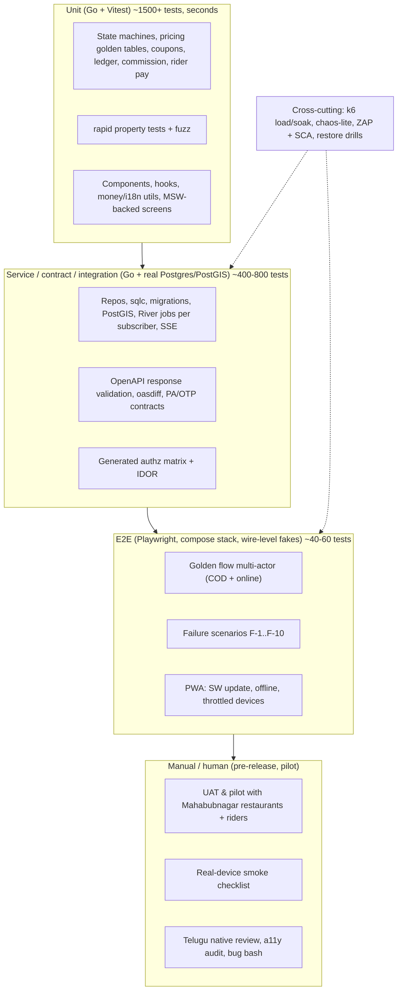
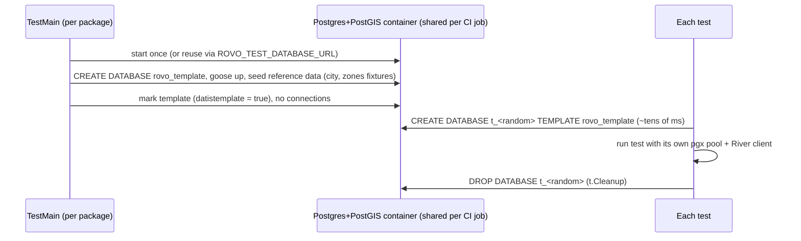
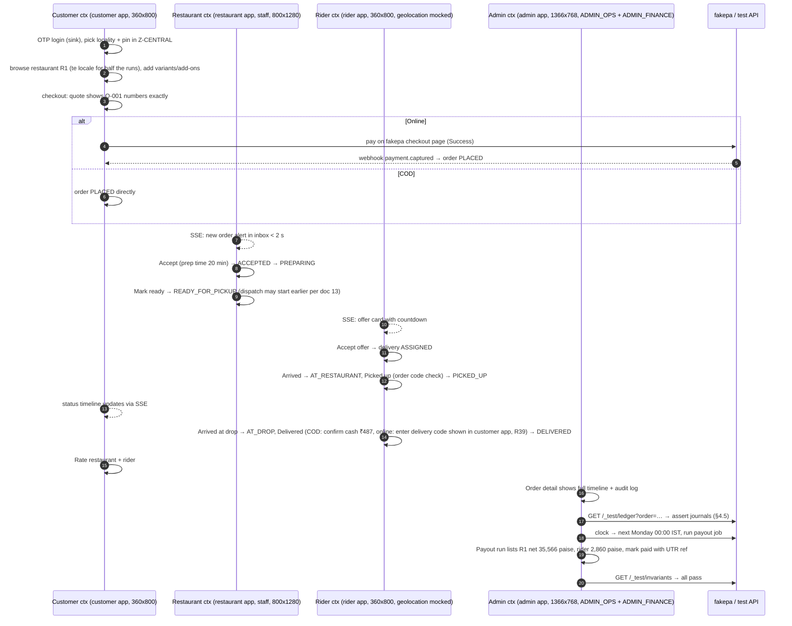
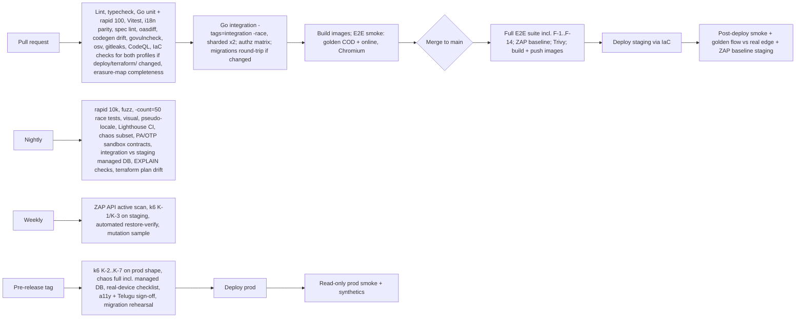

# 20 — Testing Strategy

| Field | Value |
|---|---|
| **Purpose** | Define how rovo proves that it is correct, safe and fast enough to run real money and real food through it in Mahabubnagar: quality goals, risk-based priorities, the test pyramid with concrete tools and conventions, test data, environments and fakes, CI gating, Definition of Done, bug severity, release quality gates and requirement traceability. |
| **Owner** | QA Architect |
| **Status** | Draft v1.1 — reconciled with review (31) and rulings R1–R48 (plus R49–R54), 2026-10-04 |
| **Date** | 2026-10-04 |
| **Depends on** | `00-planning-baseline.md` (vocabulary, provisional decisions P1–P17, commercial defaults) |
| **Consumes (when available)** | 01 product requirements (requirement IDs, NFR-PERF targets — read 2026-10-04), 17 frontend architecture (four apps — read 2026-10-04), 10 DB schema, 11 API spec, 12 auth/RBAC (role × operation policy), 13 order state machine (transition tables), 14 payment architecture (PA choice, ledger accounts), 15 notifications (OTP/SMS/push providers), 16 delivery zones (serviceability rules), 17/18 frontend + PWA, 19 threat model, 21 CI/CD, 22 deployment, 23 backup/DR, 24 observability, 25 hosting |
| **Consumed by** | 21 CI/CD (pipeline stages and budgets), 26 repository structure (test folders, fakes, seeds), 27 backlog (test stories), 28 milestones (quality gates), 29 production readiness (release gates), 33 Phase 2 prompt |

> This doc aligns with 01 (requirement ID format), 17 (four PWAs, R14), 08 (PostgreSQL **17** per R22, River transactional insert as the outbox with **one job per subscriber, no event table** per R42, SSE as invalidation hints without replay per R10, CAS + `version`, Idempotency-Key semantics, injected `platform/clock` + `platform/idgen` per R19) and 12 (`x-rovo-permission`, `authz/policy.yaml`, 404-not-403, maker-checker per R31, risk-based bot challenge with a fake adapter, Postgres-backed rate limits per R21). Environments follow §4a and **R24**: local Compose → CI → staging on the same IaC/cloud → production on AWS ap-south-1 (R23). Everything else is marked `[OPEN]` for the owning doc.

**Changes in v1.1** (review 31 + rulings R1–R54):
- **§12.1 is the canonical load model (R45, R48):** pilot ≈ 30 orders/day, month 1 ≈ 80/day, month 3 ≈ 250/day; design point 2,000/day with a 500 orders/h peak; load test at 3× = **1,500 orders/h + 3,000 concurrent SSE**. Per-profile capacity tests for the two IaC profiles `closed-pilot` and `public-launch` (R32). CGNAT scenario added (RV-064).
- Fee slabs per **R18** (road-adjusted, `[lo,hi)`, to 10 km) with a property test that every serviceable point has exactly one slab (RV-084). Golden Q-001 re-based on R8: fees GST-inclusive, whole-rupee payable with `ROUND_OFF`.
- **R19** testhooks/fake clock are mandatory from sprint 1; the River fake-clock spike is a week-1 exit criterion, with a defined fallback (RV-061). **R16** `REVOKED` offer status tested.
- **R42:** no `event_log`/`outbox_events` and no fan-out hop; tests assert per-subscriber job insertion (`InsertManyTx`) in the business transaction, plus a latency budget (RV-002).
- New tests for missing items: periodic-job **catch-up** and missed-settlement alert (M11), **LISTEN/NOTIFY watchdog** (M12), **CA-signed golden invoices** and PA sample settlement files (M14), **erasure map** (M15), **device-bound sessions** (M10/R44), the audience-header forgery test (RV-025), both IaC profiles, the CERT-In log archive (M1), and the DLT template conformance check (RV-065).
- Tests for cut features removed: surge (C1), WhatsApp OTP (C2), prerender (C3), ClamAV/PDF KYC (C5), hash-chained audit (C6), maker-checker beyond R31 (C7), Telugu romanisation (C17).
- Rulings applied: R1/R54 accept-timeout ladder and metric (F-2); R2 cancel window; R5 undeliverable; R6 COD rule; R29 COD compensation; R34 dispatch tiers; R39 delivery code; R49 availability; R50 restore cadence; R51 Gate A sizes; R52 heartbeat 20 s; PG 17 (RV-023); `BotChallenge=fake` (RV-020); device lab ownership (RV-062).

Tags used: `[ASSUMPTION]` unverified premise, `[OPEN]` decision pending elsewhere, `[LEGAL]` needs legal/tax review, `[VERIFY]` external fact to re-check at implementation time.

---

## Table of contents

1. [Decisions summary](#1-decisions-summary)
2. [Quality goals and risk-based prioritisation](#2-quality-goals-and-risk-based-prioritisation)
3. [Test pyramid overview](#3-test-pyramid-overview)
4. [Go unit tests](#4-go-unit-tests)
5. [Property-based tests and fuzzing](#5-property-based-tests-and-fuzzing)
6. [Go integration tests (Postgres + PostGIS, River, outbox, SSE)](#6-go-integration-tests)
7. [Contract tests (OpenAPI, payment & OTP providers)](#7-contract-tests)
8. [Authorisation tests (role matrix + IDOR)](#8-authorisation-tests)
9. [Frontend tests (Vitest, MSW, i18n, a11y, visual)](#9-frontend-tests)
10. [End-to-end tests (Playwright multi-actor)](#10-end-to-end-tests)
11. [Mobile / PWA tests](#11-mobile--pwa-tests)
12. [Performance and load tests (k6)](#12-performance-and-load-tests)
13. [Resilience / chaos-lite](#13-resilience--chaos-lite)
14. [Security testing](#14-security-testing)
15. [Data, migration and backup-restore testing](#15-data-migration-and-backup-restore-testing)
16. [Localisation QA and accessibility audit](#16-localisation-qa-and-accessibility-audit)
17. [UAT, pilot, dogfooding, bug bash](#17-uat-pilot-dogfooding-bug-bash)
18. [Test data management](#18-test-data-management)
19. [Test environments and provider fakes](#19-test-environments-and-provider-fakes)
20. [Testability hooks required from backend and frontend](#20-testability-hooks-required-from-backend-and-frontend)
21. [CI gating, coverage, flaky tests, runtime budgets](#21-ci-gating-coverage-flaky-tests-runtime-budgets)
22. [Definition of Done, bug severity, triage SLAs, release gates](#22-definition-of-done-bug-severity-triage-slas-release-gates)
23. [Traceability](#23-traceability)
24. [What we are deliberately not doing](#24-what-we-are-deliberately-not-doing)
25. [Open questions](#25-open-questions)
26. [Challenges to the baseline](#26-challenges-to-the-baseline)
27. [Sources](#27-sources)

---

## 1. Decisions summary

| # | Decision | Choice | Why |
|---|---|---|---|
| QA-1 | Go test framework | stdlib `testing` + `github.com/stretchr/testify/require` for assertions + `github.com/google/go-cmp/cmp` for diffs. Table-driven by default. | Ubiquitous, no magic, contributors already know it. |
| QA-2 | Property-based testing | `pgregory.net/rapid` (generics, automatic shrinking, `StateMachine` support) for pricing, ledger and state-machine invariants. | Finds the 1-paisa bugs example tables miss. |
| QA-3 | Fuzzing | Go native fuzzing (`go test -fuzz`) for parsers/verifiers (webhook payloads + signatures, phone numbers, order codes, PIN codes, cursor tokens). Nightly, time-boxed. | Built-in, no extra tool. |
| QA-4 | DB for tests | **Real PostgreSQL + PostGIS** (same major versions as prod) via `testcontainers-go` locally and in CI; **template-database per test** isolation; transaction-per-test only for pure read/query tests. No SQLite, no mocks of the DB layer for integration tests. | PostGIS, `SKIP LOCKED`, River and outbox semantics cannot be faked. |
| QA-5 | Integration test selection | Go build tag `integration` (`//go:build integration`). `go test ./...` = unit only (no Docker); `go test -tags=integration ./...` = everything. | Fast inner loop, explicit CI stage. |
| QA-6 | Contract | OpenAPI 3.1 file is the contract. Every API integration/E2E request and response is validated against it by a `kin-openapi/openapi3filter` middleware in **test mode** (fail on mismatch). `oasdiff` breaking-change gate on PRs. Codegen drift check for Go server + TS client. | Spec-first only works if the spec is enforced. |
| QA-7 | Authorisation | **Generated** role × operation matrix test from `authz/policy.yaml` + the OpenAPI `x-rovo-permission` extension (doc 12 §5.1) + hand-written IDOR, scope and maker-checker suites per resource. Test fails if any operation lacks a permission or a matrix row. | Missing authz checks are the #1 API risk; generation makes "forgot to add a test" impossible. |
| QA-8 | Frontend unit/component | Vitest + Testing Library + `user-event`; MSW for HTTP; `vitest-axe` (or `jest-axe`-compatible matcher) for component a11y. | Vite-native, fast. |
| QA-9 | E2E | **Playwright** (TypeScript), Chromium as primary (Android-Chrome-like), WebKit smoke for iOS Safari PWA; multi-actor tests with 4 browser contexts; against a docker-compose stack with wire-level fake providers. | One tool for E2E, a11y (`@axe-core/playwright`), screenshots, device emulation and CDP throttling. |
| QA-10 | Visual regression | Playwright `toHaveScreenshot` on a curated ~30-screen set (en + te, 360×800), run inside the pinned Playwright Docker image; **nightly, non-blocking** for the first 2 milestones, then blocking on `main`. No paid SaaS. | Free; catches Telugu layout breakage. |
| QA-11 | Load | **k6** (OSS) scripts in repo; SSE soak via the `xk6-sse` extension or, if unsuitable, a small Go SSE soak harness `[OPEN]`. Load is generated from outside the target environment (off-VPC). | Free, scriptable, thresholds as code. |
| QA-12 | Chaos-lite | Scripted experiments with `docker compose kill/pause/restart` + **Toxiproxy** locally/CI; managed-service experiments (DB failover/reboot, task kill, rolling deploy, real CDN/LB SSE soak) in staging. No chaos platform. | Proportionate to V1; managed-service behaviour is only observable in the cloud. |
| QA-13 | DAST | **ZAP baseline (passive) scan** on every `main` merge against the ephemeral E2E stack; ZAP **API scan** (active, using the OpenAPI file) weekly against the ephemeral stack only; passive baseline also against staging after each deploy; never any scan against prod. | Free; passive scan is cheap and safe. |
| QA-14 | Supply chain | `govulncheck`, `osv-scanner` (Go + pnpm lockfile), Trivy image scan, `gitleaks`, CodeQL (free for public repos), Dependabot/Renovate `[OPEN: 21]`. | Free for public repos. |
| QA-15 | Time & IDs (R19, mandatory from sprint 1) | All business time via an injected `Clock`; River gets the same clock via `river.Config.Test.Time` in tests; UUIDv7 and order-code generators injectable and seedable. **No business deadline may be computed with SQL `now()`.** | Timeouts (45 s offer, restaurant accept) must be testable without sleeping. |
| QA-16 | Test-control surface | Non-prod-only `/_test/*` API (OTP sink, fake-PA control, clock, seed/reset, push sink) compiled only with build tag `testhooks`, on a separate listener, plus env guard and shared secret. Prod image is built without the tag, and a CI test proves `/_test/*` is absent from it. | E2E needs control; prod must be provably free of it. |
| QA-17 | Coverage | ≥ 90 % statements for pricing/quote, ledger, order & delivery state machines, coupons, commission/rider pay, payouts; 100 % of transition-table rows; 100 % operations in authz matrix; ≥ 70 % overall Go; ≥ 85 % frontend shared packages (money, cart, i18n utils), ≥ 60 % per frontend app. | Meaningful where money and state live; not vanity elsewhere. |
| QA-18 | Deploy verification | **Post-deploy smoke + synthetic checks** run automatically after every staging and production deploy (read-only in prod); staging smoke must pass before promotion. **IaC checks** (`tofu fmt -check`, `validate`, `tflint`, `checkov`, `plan` with drift report) for **both profiles `closed-pilot` and `public-launch`** (R32) gate every PR touching `deploy/terraform/` (R23) and every deploy. | Baseline §4a: same images and IaC across staging and production. |

---

## 2. Quality goals and risk-based prioritisation

### 2.1 Quality goals (what "good" means for V1)

| ID | Goal | Measurable target (V1 pilot) |
|---|---|---|
| QG-1 | **Money is exact** | 0 paise discrepancy between customer bill, PA capture/refund, ledger and payout statements; every journal balances (Σ debit = Σ credit) — enforced by test, DB constraint/trigger `[OPEN: 10/14]` and nightly reconciliation job. |
| QG-2 | **Order and delivery state never corrupt** | No order/delivery reaches a state not allowed by the canonical transition tables; no order is assigned to two riders; no terminal state is left. |
| QG-3 | **Dispatch is reliable** | Every `READY_FOR_PICKUP`-bound order either gets an `ASSIGNED` rider or raises an admin alert within the configured window; offer timeouts fire within 45 s ± 5 s under load. |
| QG-4 | **Access is correctly scoped** | 0 IDOR / cross-tenant reads in authz suites; 100 % of operations covered by matrix. |
| QG-5 | **Serviceability is right** | Customers outside active zones or beyond restaurant radius can never place an order; boundary behaviour matches doc 16. |
| QG-6 | **Usable in Telugu and English on entry-level Android** | 100 % `te` key coverage, native-speaker sign-off, no truncation in the curated screen set; customer app interactive in < 5 s on emulated low-end device + Slow 4G `[ASSUMPTION: final budget in 18]`. |
| QG-7 | **Fast enough** | p95 < 300 ms for read APIs, p95 < 800 ms for order create (excluding PA round-trip), SSE event delivered < 2 s after commit, at 3× expected peak. |
| QG-8 | **Recoverable** | Automated restore-verify weekly and a timed manual drill monthly (R50); worker/DB restarts lose no subscriber jobs or timers; missed periodic runs catch up (M11). |

### 2.2 Risk register driving test intensity

Likelihood (L) and impact (I) on 1–5; Score = L × I. Tier decides how much testing a module gets.

| Risk ID | Risk | L | I | Score | Tier | Primary defences (sections) |
|---|---|---|---|---|---|---|
| R-MONEY-1 | Rounding/fee/GST computation off by paise; totals disagree between quote, order, invoice, ledger | 4 | 5 | 20 | **T1** | Golden tables (§4.3), rapid invariants (§5), E2E ledger assertions (§10) |
| R-MONEY-2 | Duplicate/out-of-order/missing PA webhook → double capture credit, order stuck `PENDING_PAYMENT`, refund twice | 4 | 5 | 20 | **T1** | Webhook contract + idempotency tests (§7.3), E2E failure scenarios F-4 (§10.4), reconciliation job tests |
| R-MONEY-3 | Refund exceeds captured amount / refund on COD order / partial refunds miscounted | 3 | 5 | 15 | **T1** | Invariant INV-L4 (§5), unit + E2E |
| R-MONEY-4 | COD cash-in-hand mis-tracked; rider limit not enforced | 3 | 4 | 12 | **T1** | Ledger unit tests, E2E F-7 |
| R-STATE-1 | Illegal transition (e.g., `PICKED_UP` → `CANCELLED` without refund path), lost update under concurrency | 4 | 5 | 20 | **T1** | Exhaustive transition tests, rapid state machine, concurrent integration tests (§6.6) |
| R-DISP-1 | Offer timeout not firing (worker down, clock bugs) → orders stranded at `READY_FOR_PICKUP` | 3 | 5 | 15 | **T1** | River job tests with stubbed time, chaos C-1, E2E F-3/F-8 |
| R-DISP-2 | Double assignment (two riders accept concurrently; late accept after expiry) | 3 | 5 | 15 | **T1** | Race tests (§6.6), DB uniqueness constraints `[OPEN: 10]` |
| R-AUTH-1 | IDOR: customer reads other customer's order/address; restaurant staff sees another outlet; admin scope leaks across city | 4 | 5 | 20 | **T1** | Generated matrix + IDOR suites (§8), ZAP |
| R-AUTH-2 | OTP brute force / SMS pumping (cost attack) | 4 | 4 | 16 | **T1** | Rate-limit tests (§14.4), k6 abuse scenario |
| R-SVC-1 | Serviceability wrong at zone boundary / polygon holes / radius vs road distance mismatch | 3 | 4 | 12 | **T2** | PostGIS fixture tests (§6.4) |
| R-RT-1 | SSE dropped behind CDN/proxy; restaurant misses new order | 3 | 4 | 12 | **T2** | SSE integration, staging-through-CDN test, polling fallback E2E, soak |
| R-RT-2 | A stalled LISTEN connection fills the NOTIFY queue and blocks every committing transaction (RV-003) | 2 | 5 | 10 | **T2** | Watchdog + queue-usage alert tests (§6.8, C-10) |
| R-JOB-1 | Leader restart at a periodic tick silently skips settlement/recon/retention (RV-004) | 3 | 5 | 15 | **T1** | Catch-up job tests (§6.5), chaos C-11 |
| R-PWA-1 | Stale service worker serves old app against new API (breaking change) | 3 | 4 | 12 | **T2** | SW update-flow E2E (§11.3), oasdiff gate |
| R-I18N-1 | Missing/wrong Telugu strings, overflow, unreadable fonts on low-end devices | 4 | 3 | 12 | **T2** | Key parity, pseudo-locale, visual, native review (§16) |
| R-PERF-1 | Managed prod shape under-sized (burstable DB credits, task CPU, pooler) at dinner peak | 2 | 4 | 8 | **T2** | k6 capacity test on prod shape in staging (§12.4) |
| R-ENV-1 | Staging/prod drift or broken IaC → deploy works locally/CI but fails in cloud (PostGIS version, LISTEN via pooler, LB idle timeouts, IAM) | 3 | 4 | 12 | **T2** | IaC validate/plan/lint/checkov (§21.1), post-deploy smoke + synthetics (§19.3), nightly integration run against staging managed DB (§6.1) |
| R-DATA-1 | Migration breaks prod data / irreversible | 2 | 5 | 10 | **T2** | Migration up/down + prod-shape snapshot test (§15) |
| R-DATA-2 | Backups unrestorable | 2 | 5 | 10 | **T2** | Weekly restore verification (§15.3) |
| R-PRIV-1 | Personal data leaks into logs/test envs (DPDP) | 3 | 4 | 12 | **T2** | Log-redaction tests, anonymisation rules (§18.5) |
| R-UX-1 | Admin/ops UI defects (reports, filters) | 3 | 2 | 6 | **T3** | Component tests, manual exploratory |
| R-CONTENT-1 | Menu image upload edge cases | 2 | 2 | 4 | **T3** | Unit + one E2E |

**Tier policy**

| Tier | Required | Coverage target | Review |
|---|---|---|---|
| T1 (money, state, dispatch, authz) | Unit (table + golden) **and** property-based **and** integration **and** ≥ 1 E2E path; mutation testing sampled weekly `[OPEN]` | ≥ 90 % statements; 100 % transition rows / matrix cells | Two reviewers, one with domain ownership (Backend or Finance-ops); test changes reviewed as carefully as code |
| T2 | Unit + integration; E2E where user-visible | ≥ 75 % | One reviewer |
| T3 | Unit/component; manual exploratory | ≥ 60 % (module) | One reviewer |

---

## 3. Test pyramid overview



| Layer | Tool(s) | Runs where | Typical count (V1) | Budget |
|---|---|---|---|---|
| Go unit | `testing`, testify/require, go-cmp, golden files | every PR | 1,000+ | < 90 s |
| Property / fuzz | `pgregory.net/rapid`, `go test -fuzz` | PR (100 checks default), nightly (10,000 checks; fuzz 5 min/target) | 30–50 properties, 8–12 fuzz targets | PR < 60 s |
| Go integration | testcontainers-go (PostGIS image), pgx, sqlc, goose, `rivertest` | every PR (sharded ×2) | 400–800 | < 8 min |
| Contract | kin-openapi `openapi3filter`, oasdiff, codegen drift, recorded webhook fixtures | every PR; PA/OTP sandbox nightly | – | < 2 min |
| Authz matrix | generated Go tests | every PR | (ops × 9 principals) ≈ 1,000+ cases | < 2 min |
| Frontend unit/component | Vitest, Testing Library, MSW, vitest-axe | every PR (affected apps) | 500+ | < 4 min |
| E2E | Playwright | PR: smoke (golden COD + online); main/nightly: full | 40–60 | PR < 10 min; nightly < 40 min |
| Visual | Playwright screenshots | nightly | ~60 snapshots (30 screens × 2 locales) | < 10 min |
| Load | k6 (+ xk6-sse) | weekly + pre-release on staging/prod-shape | 7 scenarios | 15 min – 8 h |
| Chaos-lite | compose + Toxiproxy | nightly subset; pre-release full | 8 experiments | < 30 min |
| Security | ZAP baseline/API scan, govulncheck, osv-scanner, Trivy, gitleaks, CodeQL | PR (SCA, secrets), main (ZAP baseline), weekly (ZAP API scan) | – | < 10 min |

---

## 4. Go unit tests

### 4.1 Conventions

- **Location:** `_test.go` next to the code, same package for white-box tests of pure functions; `package x_test` for API-level tests of a module's public surface. Shared helpers in `internal/testutil` (clock, ID generator, golden-file helper, `require` wrappers for money). Test fixtures in `testdata/` per package. `[OPEN: 26 confirms layout]`
- **Table-driven** with named cases (`name` field, `t.Run(tc.name, …)`), `t.Parallel()` wherever there is no shared mutable state.
- **Pure core, thin shell:** state transitions, pricing, coupon evaluation, commission, rider pay, journal construction are **pure functions** taking explicit inputs (including `now time.Time` and config snapshots) and returning values + domain events. They do not touch the DB, the clock or random sources. This is a design requirement on backend (see §20) because it makes T1 logic unit-testable in microseconds.
- **Money helpers:** a `money.Paise` type (int64) with no float conversion; tests use `require.Equal(t, money.Paise(48700), got)` — never compare formatted strings for money.
- **Naming:** `TestQuote_DeliveryFeeSlabs`, `TestOrderTransition_AcceptFromPlaced`. Requirement tags in a comment (`// REQ: CUS-CHK-003, BR-FEE-002` — doc 01 ID format) — parsed by the traceability script (§23).
- **No sleeps** in unit tests. Ever. Time is injected.
- **Golden files:** `testdata/*.golden.yaml` (human-reviewable) with a `-update` flag (`go test ./internal/pricing -run Golden -update`). CI fails if `-update` would change anything (`git diff --exit-code`). Changes to golden files require a Finance-ops/Product reviewer in CODEOWNERS for `**/pricing/testdata/**` and `**/ledger/testdata/**`.

### 4.2 Order and delivery state machines (T1)

Doc 13 owns the transition tables. Tests consume them **as data**:

1. The transition table is defined once in Go as a declarative table (`[]Transition{From, Event, Guard, To, Actor, SideEffects}`).
2. **Exhaustive matrix test:** for every `(state ∈ all order states) × (event ∈ all events) × (actor ∈ roles+system)` assert either the documented target state or a typed `ErrIllegalTransition`. With 11 order states × ~15 events × 9 actors ≈ 1,500 cases — generated, runs in milliseconds. Same for 9 delivery states and offer states.
   Offer states are `PENDING | ACCEPTED | DECLINED | EXPIRED | REVOKED` (R16): `REVOKED` is reachable only from `PENDING` by system/admin (reassign, order cancelled), and a late rider accept on a revoked offer returns `409 OFFER_REVOKED`.
3. **Doc parity test:** a test renders the Go table to Mermaid `stateDiagram-v2` and compares to a committed snapshot; doc 13 embeds the generated diagram, so code and docs cannot drift.
4. **Side-effect assertions:** each transition returns the domain events / subscriber jobs it must emit (e.g., `ACCEPTED` → `order.accepted` event + schedule prep reminder; `REJECTED` on a prepaid order → `refund.requested`). Tests assert the event list exactly.
5. **Cross-machine consistency** (order ↔ delivery): table of allowed combinations, e.g. `orders.status = PICKED_UP` ⇒ `deliveries.status ∈ {PICKED_UP, AT_DROP}`; `orders.status = DELIVERED` ⇔ `deliveries.status = DELIVERED`. Checked in unit tests of the coordinator and by a SQL invariant query in integration/E2E (`assertInvariants()` helper, §6.7).
6. **Guards** tested at boundaries: customer cancel free while `PLACED` or within 60 s of placement, incl. `ACCEPTED → CANCELLED` inside the grace (R2; 59.9 s / 60.0 s with the fake clock); rider pickup from `PREPARING` or `READY_FOR_PICKUP` sets `restaurant_skipped_ready` (R4); COD skips `PENDING_PAYMENT`; `UNDELIVERABLE` only from `PICKED_UP`/`AT_DROP` and only with support approval (R5).

### 4.3 Pricing / quote engine golden tables (T1)

The quote engine is a pure function: `Quote(cart, restaurantPricing, cityPricingConfig, coupon, distance, now) → QuoteResult{lines[], taxLines[], totals}`. It must produce the same numbers the order, invoice and ledger use (single source).

**Golden table format** (`internal/pricing/testdata/quote_cases.golden.yaml`), one case per row, reviewed by a human:

```yaml
- id: Q-001
  req: [CUS-CART-004, BR-FEE-001]   # illustrative IDs
  desc: "Typical lunch order, 2.6 km road distance, no coupon"
  config_ref: mbnr-default-2026-10     # frozen config snapshot in testdata
  cart:
    - { item: chicken_biryani_full, unit_paise: 18000, qty: 2 }
    - { item: mirchi_bajji,        unit_paise:  6000, qty: 1 }
  packaging_paise: 1000                # per order, set by restaurant
  straight_line_m: 2000                # × road_factor 1.3 = 2600 m
  expect:
    food_subtotal_paise:     42000
    packaging_paise:          1000
    delivery_fee_paise:       3000     # slab [2000,4000) road m → ₹30, GST-inclusive (R8, R18)
    platform_fee_paise:        500     # GST-inclusive (R8 default)
    small_cart_fee_paise:        0     # subtotal >= 14900
    tax_lines:                         # RATES ARE PLACEHOLDERS [LEGAL]
      - { base: food+packaging, rate_bp: 500,  amount_paise: 2150 }              # menu prices exclusive of 5% GST (R8)
      - { base: platform_fee,   rate_bp: 1800, taxable_paise: 424,  amount_paise: 76, inclusive: true }   # round(500×100/118)
      - { base: delivery_fee,   rate_bp: 1800, taxable_paise: 2542, amount_paise: 458, inclusive: true }  # round(3000×100/118)
    pre_round_total_paise:   48650     # 42000 + 1000 + 2150 + 3000 + 500
    round_off_paise:            50     # ROUND_OFF bill line, nearest rupee half-up [ASSUMPTION — rule owned by 14]
    total_paise:             48700     # whole rupee (R8)
```

> The GST rates and which party/section each line falls under are **placeholders** pending doc 14 and tax review `[LEGAL]`. Fee GST presentation is configurable (R8); the inclusive default is used here. The golden file references a config snapshot, so when rates are confirmed only the config and expected values change — the test structure does not.

**Mandatory case families** (each family = several rows):

| Family | Cases (examples) |
|---|---|
| Delivery-fee slabs (R18) | Road-adjusted distance (straight-line × 1.3), `[lo,hi)`: 0 → ₹20, 1,999 → ₹20, **2,000 → ₹30**, 3,999 → ₹30, 4,000 → ₹40, 5,999 → ₹40, 6,000 → ₹50, 7,999 → ₹50, 8,000 → ₹60, **9,100 (= 7 km straight-line) → ₹60**, 9,999 → ₹60; 10,000 → no slab (config error, unreachable at road factor 1.3) |
| Max radius (R18) | Checked on **straight-line** distance: 6,999 / 7,000 / 7,001 m (serviceable / serviceable / reject — boundary inclusivity per doc 16) |
| Round-off (R8) | pre-round totals ending in x.49 / x.50 / x.51 rupees → `ROUND_OFF` line −49 / +50 / +49 paise; payable always a whole rupee |
| Small-cart fee | subtotal 14,899 / 14,900 / 14,901 paise; after coupon discount (is threshold pre- or post-discount? `[OPEN: 01]`) |
| Rounding | items with GST producing x.5 paise (e.g., base 1,010 paise × 5 % = 50.5 → 51 half-up), many lines each rounding up (sum-of-rounded vs rounded-sum difference pinned), quantity 1 vs 99 |
| Coupons | flat, percent with cap, min-order, first-order-only, restaurant-funded vs platform-funded, expired (evaluated in `Asia/Kolkata` at 23:59:59 / 00:00:00 IST), usage-limit reached, coupon making total negative (must clamp at 0, delivery fee handling) |
| Free delivery campaign | threshold just below/at/above |
| Packaging | per item vs per order, zero |
| Variants & add-ons | half/full biryani, add-on with price 0, add-on quantity, removed item |
| Config effective dates | commission/pricing config change at midnight IST — order quoted 23:59:59 uses old, 00:00:00 uses new |
| Re-quote | quote at cart time vs order create — price change in between must surface a "price changed" error, not silently charge |

### 4.4 Commission, rider pay, payouts (T1)

- **Commission:** golden rows for 10 %, 15 %, 25 %, effective-date switch mid-week, base = food subtotal only (excludes packaging? `[OPEN: 14]`), GST on commission `[LEGAL]`, rounding per order (not per payout) — and a test proving payout = Σ per-order nets exactly.
- **Rider pay:** `₹25 base + ₹6/km beyond 2 km + waiting pay after 10 min`: boundaries at 2,000 m, fractional km (per-metre pro-rata vs per-started-km `[OPEN: 06/14]`), waiting 9:59 / 10:00 / 10:01 min, cancelled-after-pickup pay rules.
- **Payout run:** weekly window boundaries in IST (Mon 00:00 IST), orders delivered at 23:59:59 Sunday IST included in the right week, adjustments/clawbacks, negative balance carried forward, minimum payout amount.

### 4.5 Ledger (T1)

Doc 14 owns the chart of accounts; tests assert structure, not account names:

- **Every journal balances**: `Σ debits == Σ credits` per journal entry, per currency — unit-tested on every journal builder function (and property-tested, §5).
- **Journal per business event** (golden): `order.paid_online`, `order.cod_collected`, `order.delivered` (revenue recognition), `order.refunded` (full/partial; COD manual UPI refund with UTR, R29), `commission.accrued`, `rider_pay.accrued`, `cod.deposit_recorded`, `payout.recorded`, `pa_fee.settled`, `adjustment.manual` (admin, with reason; maker-checker above threshold, R31), `adjustment.rider_peak_bonus` (R30), `adjustment.mg_topup` (R47).
- **Immutability:** no update/delete of posted entries; corrections are reversing entries — tested in integration (DB-level trigger/permissions `[OPEN: 10]`).
- Illustrative golden journal for Q-001 (online payment) — account names provisional:

| Entry | Dr (paise) | Cr (paise) |
|---|---|---|
| PA clearing | 48,700 | |
| Restaurant payable (food + packaging) | | 43,000 |
| GST payable – food (e-commerce operator, §9(5)) `[LEGAL]` | | 2,150 |
| Platform-fee revenue (taxable) | | 424 |
| GST payable – platform fee `[LEGAL]` | | 76 |
| Delivery-fee revenue (taxable) | | 2,542 |
| GST payable – delivery fee `[LEGAL]` | | 458 |
| Round-off income (`ROUND_OFF`) | | 50 |
| **Σ** | **48,700** | **48,700** |
| Restaurant payable (commission 15 % of 42,000 + 18 % GST) | 7,434 | |
| Commission revenue | | 6,300 |
| GST payable – commission `[LEGAL]` | | 1,134 |
| Rider cost (₹25 + ₹6 × 0.6 km) | 2,860 | |
| Rider payable | | 2,860 |

→ Restaurant net for this order = 43,000 − 7,434 = **35,566 paise**; this exact figure is asserted again in E2E (§10.3).

### 4.6 Other T1/T2 unit areas

| Area | Notes |
|---|---|
| Dispatch ranking (R34) | Pure `RankRiders(candidates, restaurant, now, cfg)`: **tier 1** = location age ≤ 3 min, ranked by distance; **tier 2** = online with location age ≤ 15 min, offered only when tier 1 is empty and via push + SSE; > 15 min without ping/heartbeat → auto-offline (excluded). Boundaries tested at 2:59/3:00/3:01 and 14:59/15:00 (values are doc 13 `app_config` keys). Also active jobs, COD rule (R6: cash-in-hand + payable ≤ ₹2,000), previously declined/expired/revoked riders excluded for this delivery; deterministic tie-break by rider ID. |
| Serviceability decision (pure part) | Given distances and zone membership flags → decision + reason codes (shown to user in en/te). |
| Operating hours | Local wall-clock + day-of-week in `Asia/Kolkata`: open/close boundaries, overnight hours (18:00–02:00), holiday override, "closing in 15 min" cutoff. |
| Phone/OTP | E.164 normalisation (`9876543210`, `+91 98765 43210`, `09876543210`), reject numbers not starting 6–9; OTP hashing, expiry, attempt counter. |
| Order code | `RV-` + base32, no ambiguous chars, collision handling with seeded generator. |
| Idempotency keys | Same key + same body → same response; same key + different body → 409/422. |
| Redaction | Log redaction helper masks phones (`+91******3210`), OTPs, tokens, addresses — table tests (DPDP). |
| i18n server strings | SMS/push template rendering in `en`/`te`, placeholders filled, Telugu SMS length/segment count (Unicode → 70 chars/segment) asserted for DLT templates `[OPEN: 15]`. |

---

## 5. Property-based tests and fuzzing

### 5.1 Invariants (rapid)

Generators produce random carts (1–30 lines, unit price 0–₹5,000, qty 1–20, random add-ons), random configs within allowed ranges (fee slabs, commission 10–25 %, coupon shapes), random event sequences (pay, accept, reject, cancel at any point, partial refunds, duplicate webhooks).

| ID | Invariant | Module |
|---|---|---|
| INV-P1 | `total = Σ lines + Σ fees + Σ taxes − discounts`, computed independently by a naïve reference implementation (oracle) in the test, using `math/big` | pricing |
| INV-P2 | `total ≥ 0`; no line or tax is negative; discount ≤ discountable base | pricing |
| INV-P3 | Monotonicity: adding an item never decreases food subtotal; increasing distance never decreases delivery fee (within the slab table) | pricing |
| INV-P4 | Quote is deterministic: same inputs → identical result (run twice, compare deeply) | pricing |
| INV-P5 | Rounding drift bounded: `|Σ rounded lines − round(Σ exact lines)| ≤ number_of_lines × 0.5 paise` and matches the documented rule | pricing |
| INV-L1 | **Every journal balances** (Σ Dr = Σ Cr) for any sequence of events | ledger |
| INV-L2 | **Σ customer bill = Σ ledger credits** for that order's revenue/payable/tax accounts at order-paid time (before commission/rider entries) | ledger + pricing |
| INV-L3 | Σ of all account balances across the whole ledger = 0 after any sequence (trial balance) | ledger |
| INV-L4 | **Refund never exceeds captured amount**: for any sequence of partial/full refunds and duplicate refund webhooks, Σ refunded ≤ Σ captured; COD orders never produce a PA refund journal (COD money refunds are `MANUAL` with UTR, R29) | payments + ledger |
| INV-L5 | Duplicate webhook/event delivery is idempotent: applying event list `E` and `E` with random duplicates/reordering yields identical ledger and order state | payments |
| INV-L6 | Payout for a party over a period = Σ that party's payable movements in the period (no order counted twice across weeks) | payouts |
| INV-L7 | Rider COD cash-in-hand = Σ COD collected − Σ deposits ≥ 0; a COD order is offered to a rider iff cash-in-hand + order payable ≤ limit (R6) | ledger + dispatch |
| INV-P6 | **Slab coverage (R18, RV-084):** for any serviceable point (straight-line ≤ max radius) and any valid config, the road-adjusted distance falls in **exactly one** slab; config validation rejects slab tables that do not cover `max_radius × road_factor` | pricing |
| INV-S1 | **Model-based state machine** (`rapid.StateMachine`): random commands (place, pay-webhook, accept, reject, ready, offer, offer-expire, rider-accept, pickup, deliver, cancel by each actor) applied to the real aggregate and to a simplified model; after each step the canonical status pair is in the allowed set, terminal states are absorbing, and at most one rider is `ASSIGNED` per delivery | state |
| INV-D1 | Dispatch ranking never selects an offline (> 15 min), already-busy, COD-ineligible or previously expired/declined/revoked rider, and never offers tier 2 while a tier-1 rider is eligible (R34) | dispatch |

Run with default 100 checks on PR; nightly with `-rapid.checks=10000`; failing seeds are committed as regression cases (rapid prints a reproducible seed; we copy the minimised failure into a table test).

### 5.2 Fuzz targets (Go native, nightly, 5 min each)

Webhook payload parser + signature verifier; phone normaliser; address/PIN validator; pagination cursor decoder; order code parser; coupon code normaliser; i18n template renderer (no panics, no unescaped HTML); JWT/refresh-token parser. Corpus seeds from recorded fixtures; crashers become unit tests.

---

## 6. Go integration tests

### 6.1 Database provisioning and isolation

**Decision:** `testcontainers-go` with the Postgres module, using a `postgis/postgis` image whose **PostgreSQL major (17 per R22) and PostGIS minor (3.5) match the managed production service** (managed providers often lag upstream PostGIS — the test image follows production, not the newest tag; `[OPEN: 22]` pins both). A nightly job also runs the integration suite against a **staging managed-Postgres database** (dedicated test schema/db) to catch managed-service differences: extensions allow-list, `pg_notify`/`LISTEN` through the provider's proxy/pooler, collation, `statement_timeout` defaults. The harness honours `ROVO_TEST_DATABASE_URL`: if set (e.g., a CI service container or a developer's local DB), it is used instead of starting a container.



| Strategy | Use for | Why |
|---|---|---|
| **Template DB per test (default)** | Anything that commits: per-subscriber River job insertion, SSE fan-out via `LISTEN/NOTIFY`, concurrency/race tests, multi-tx flows | Real commit semantics; tests run in parallel safely |
| **Transaction-per-test (rollback)** | Read-heavy sqlc query tests, PostGIS lookup tests | Fastest; but invalid where code commits or uses `LISTEN/NOTIFY` |
| Fresh migrations from zero | Migration tests only (§15) | Verifies the migration chain itself |

- Migrations run **once per CI job** into the template; the template hash (hash of migration files) is cached so local re-runs reuse it.
- Container tuned for tests (`fsync=off`, `synchronous_commit=off`, `full_page_writes=off`) — **only** in tests.
- `testcontainers-go`'s Postgres module also offers snapshot/restore; we prefer explicit templates because they allow parallel tests. (Source: golang.testcontainers.org modules/postgres, accessed 2026-10-04.)

### 6.2 sqlc queries and repositories

- Every sqlc query has at least one integration test exercising it (a CI script lists queries from `sqlc` output and fails if a query name does not appear in any `_test.go` — cheap "query coverage").
- Constraint tests: unique active delivery per order, one `ASSIGNED` rider per delivery, one active delivery per rider (V1), `CHECK (amount_paise >= 0)`, FK cascades, `currency = 'INR'`.
- **Query-count assertions** for hot endpoints (menu fetch, order list) via a pgx tracer counting queries — e.g., menu fetch ≤ 3 queries regardless of item count (N+1 guard).
- `EXPLAIN` snapshot tests for the 10 hottest queries on a seeded `load` dataset: assert index usage (no `Seq Scan` on `orders`, `deliveries`, `menu_items` beyond small tables) — nightly.

### 6.3 Migrations

See §15.1 (up/down/up round trip, schema snapshot, destructive-change lint).

### 6.4 PostGIS serviceability with Mahabubnagar fixtures

Fixture polygons are **synthetic** test geometry near Mahabubnagar's centre (≈ 16.74° N, 77.99° E `[ASSUMPTION — fixture only; real zones come from ops in doc 16]`), committed as GeoJSON in `testdata/geo/mbnr_zones.geojson` and loaded into the template DB.

| Fixture | Purpose |
|---|---|
| `Z-CENTRAL` (active), `Z-NORTH` (active), `Z-SOUTH` (inactive) | Membership, inactive zone rejection |
| `Z-NORTH` with an interior **hole** (e.g., a lake/cantonment-style exclusion) | Point in hole = not serviceable |
| Two zones sharing an edge | Point exactly on shared boundary → deterministic single zone (`ST_Covers` vs `ST_Contains` choice pinned) `[OPEN: 16]` |
| Restaurant R1 centre, R2 near zone edge, R3 with 3 km custom radius | Radius checks |
| Customer points: inside, outside, on boundary, in hole, 6,999 m / 7,000 m / 7,001 m from R1 (computed with geodesic distance), across the anti-meridian-free but SRID-sensitive cases (4326 vs geography) | Distance and SRID correctness |
| Invalid polygon (self-intersecting) upload | Admin zone editor rejects (`ST_IsValid`) |

Assertions: serviceability result + reason code; computed straight-line distance within ±1 m of a reference haversine value; road-factor distance used by the quote equals the one stored on the order.

### 6.5 River jobs and timers (fake clock)

River supports stubbing time via `river.Config.Test.Time` (`rivertype.TimeGenerator`) and provides `rivertest` helpers (`RequireInserted[Tx]`, `RequireNotInserted[Tx]`, `RequireManyInserted[Tx]`, `NewWorker(...).Work/WorkJob`). (Sources: River `client.go` on GitHub and pkg.go.dev `rivertest`, accessed 2026-10-04.)

Test patterns:

1. **Scheduling assertions:** placing an order inserts the R1 ladder jobs — alert repeats every 30 s, owner SMS at +60 s, ops flag at +90 s and `restaurant_accept_timeout` at **+180 s** (values are doc 13 keys); creating an offer inserts `delivery_offer_timeout` at `offered_at + 45 s` — asserted with `RequireInsertedTx` + `RequireInsertedOpts{ScheduledAt: …}`.
2. **Execution with fake clock:** set the app `Clock` to `offered_at + 44 s` → run the job via `rivertest.NewWorker(...).Work` → asserts **no-op** (job re-checks the deadline against the clock; idempotent). Set to `+45 s` → offer `EXPIRED`, next-best rider offered, new timeout job inserted.
3. **Late action vs timeout race:** rider accept at `+44.9 s` committed first, timeout job runs after → no-op; reverse order → accept fails with `OFFER_EXPIRED` (409). Both orders exercised deterministically via explicit sequencing, plus a randomised goroutine race test (§6.6).
4. **Cascade exhaustion:** N riders all expire → delivery returns to `UNASSIGNED`, admin alert subscriber job inserted, retry backoff job scheduled (values from doc 13).
4b. **Revocation (R16):** admin manual reassign or order cancel while an offer is `PENDING` → offer `REVOKED`, its timeout job becomes a no-op, rider receives an `offer.revoked` event.
5. **Retries & dead jobs:** job handler errors are retried with River's policy; poisoned jobs land in discarded state and raise an alert metric — tested with injected failures.
6. **Uniqueness:** duplicate timeout scheduling is prevented by unique job options (`rivertest.Worker` disables uniqueness by default — integration tests that rely on uniqueness use a real client instead).
7. **Periodic catch-up (M11, RV-004):** every periodic job (weekly settlement, daily PA recon, retention sweeps) runs hourly and asks "has period P completed?". Tests: (a) the scheduled tick is skipped (leader restart simulated) → the next hourly run completes period P exactly once; (b) two concurrent runners → one run (unique by period); (c) fake clock at Monday 09:00 IST with no completed settlement for last week → the **missed-settlement alert** metric fires; (d) a period run twice is idempotent (no duplicate payout lines).

### 6.6 Concurrency and race tests

- Run all Go tests with `-race` in CI.
- Dedicated tests launch K goroutines (K = 2..20) performing conflicting commands on one aggregate: two riders accept the same offer; restaurant accepts while customer cancels; duplicate payment webhooks arrive simultaneously; admin manual assign while auto-dispatch assigns. Assert exactly one winner, losers get typed conflict errors, and invariants (§6.7) hold. Repeated 50× in nightly (`-count=50`).

### 6.7 Per-subscriber jobs (River as outbox, R22/R42) and invariants

- **No event table, no fan-out hop (R42, C8):** the publisher inserts **one River job per subscriber** from the static subscription table with `InsertManyTx` in the business transaction. Tests assert: (a) commit → exactly one job per registered subscriber, with the event payload and trace context in job args; (b) a forced failure after the domain write rolls back both the domain change and every job; (c) adding a subscriber to the table adds exactly one job per event; (d) no `event_log`/`outbox_events` table exists (schema snapshot check).
- **Idempotent subscribers:** a subscriber handler run twice records one `processed_events` row and one side-effect (no double SMS, no double ledger post); a handler crash mid-way is retried and converges.
- **Event schema compatibility:** each `.v1` event has a JSON fixture tested for round-trip decode by every subscriber (replaces the cut `tools/eventschema`, C9).
- **Latency budget (RV-002, RV-037):** commit → restaurant SSE event ≤ 2 s p95; commit → push sent (fakepush) ≤ 3 s p95; measured in integration and in K-2 (doc 24 consumes the metric).
- **`assertInvariants(t, db)` helper**, called at the end of every integration and E2E test (via the test API in E2E), runs SQL checks: all journals balance; trial balance = 0; no order/delivery status combination outside the allowed set; no delivery with two accepted offers; no rider with > 1 active delivery; no `PENDING_PAYMENT` order older than the payment expiry without a reconciliation job scheduled; refunds ≤ captures per order. These same queries become a nightly production **reconciliation job** (doc 14/24).

### 6.8 SSE

- `httptest` server + real SSE hub + real Postgres `pg_notify` inside the business tx (doc 08 §6.2): a transition commits → event received by the subscribed client within 1 s; a **rolled-back** tx produces no event; a client not entitled to a topic receives nothing — checked both at subscribe time and at routing time (order ownership changes mid-stream).
- **No replay by design** (R10): `Last-Event-ID` is ignored; on reconnect the client refetches active queries over REST — the frontend test (§9.1) asserts the refetch-on-reconnect behaviour and the 2–10 s reconnect jitter. `reauth` is sent only on session revocation; streams close at 30 min (doc 12 §4.7).
- LISTEN connection loss → `/readyz` degraded and clients receive `event: degraded` → frontend switches to polling (E2E F-13).
- **LISTEN watchdog (M12, RV-003):** a test opens a LISTEN connection that stops reading while NOTIFYs continue; assert `pg_notification_queue_usage()` is exported as a metric, the alert rule fires above 0.1 (threshold scaled down in the test), and the watchdog reconnects the stalled listener; business commits keep succeeding throughout.
- Slow consumer (client not reading) is disconnected once its bounded buffer (16 messages) fills, and the hub keeps serving others.
- Heartbeat `: ping` every 20 s (R10, R52) asserted with the fake clock; needed to survive CDN/load-balancer idle timeouts (see C-9).
- Connection cleanup: N connects/disconnects → goroutine count and DB listeners return to baseline (leak test).

---

## 7. Contract tests

### 7.1 OpenAPI as the enforced contract

| Check | How | When |
|---|---|---|
| Spec lint | `vacuum` or Spectral with a rovo ruleset: operationId required, every operation has `x-rovo-permission` (`public` explicit), error responses use the shared problem+json schema, money fields are `integer` with `_paise` suffix, no `number` for money, enums match canonical status names | PR |
| Response/request validation | Test-only middleware wraps the real router using `kin-openapi/openapi3filter.ValidateRequest` + `ValidateResponse` (kin-openapi lists OpenAPI 3.1 support — README accessed 2026-10-04). Any response with an undocumented status code, missing required field, extra field where `additionalProperties: false`, or wrong enum value **fails the test** | All Go API integration tests + E2E stack (middleware enabled via `testhooks` build, logs + fails the request with 500 `CONTRACT_VIOLATION` so Playwright notices) |
| Breaking changes | `oasdiff breaking` (supports OpenAPI 3.0/3.1/3.2; GitHub Action `oasdiff/oasdiff-action/breaking` — oasdiff.com accessed 2026-10-04) comparing PR spec vs `main`; breaking change requires label `api-breaking` + versioning note | PR |
| Codegen drift | Regenerate Go server interfaces and TS client; `git diff --exit-code` | PR |
| TS client typecheck | `tsc --noEmit` across all three apps against the regenerated client — a renamed field breaks the frontend build in the same PR | PR |
| Generator compatibility fixture | A small "kitchen-sink" spec using every 3.1 construct we allow (nullable via type arrays, `oneOf` with discriminator, `const`, `examples`) is run through oapi-codegen, openapi-typescript and kin-openapi in CI; constructs that any tool mishandles are banned by lint (see CH-1) | PR (spec/tooling changes) |
| Examples valid | Every `example`/`examples` in the spec validates against its schema (they also feed MSW fixtures) | PR |

### 7.5 Golden documents and PA files (M14, RV-063, RV-066)

- **CA-signed golden invoices and statements:** the CA signs off ≥ 10 cases (prepaid, COD, coupon, partial refund, cancellation, round-off, restaurant weekly statement, rider statement). They are committed as fixtures; invoice/statement generation must reproduce them exactly (PDF text + amounts). A changed fixture needs CA re-sign-off. Required before the quote-engine code freeze.
- **PA sample settlement/recon files:** obtained from the chosen PA during onboarding; golden-file tests drive the daily recon job (matched, fee deducted, held, missing, extra) and, if split settlement is chosen (R35), the transfer/release-hold paths.
- **₹1 live test before Gate A:** one real payment, one refund and (split model) one transfer release in production, reconciled end to end.

**Not doing:** Pact/consumer-driven contracts — single repo, single team, spec-first codegen on both sides already gives compile-time consumer checks.

### 7.2 Provider adapter architecture for testability

```
Domain ──► PaymentProvider interface ──► razorpayAdapter (real wire protocol) ──► HTTP ──► { real PA sandbox | fakepa }
                                    └──► inMemoryProvider (unit tests only)
```

- **Unit tests** use the in-memory provider.
- **Integration and E2E** use the **real adapter** talking HTTP to **`fakepa`**, a small Go service that speaks the chosen PA's wire protocol (orders, payments, refunds, webhooks with the PA's signature scheme). This exercises our serialisation, signature verification and error mapping, which an interface-level fake would skip.
- The **same contract suite** (`paymentcontract.Run(t, provider)`) runs against `fakepa` on every PR and against the **PA sandbox** nightly (secrets only on `main`/scheduled runs, never on fork PRs). If sandbox behaviour diverges from `fakepa`, the contract suite fails and `fakepa` is fixed — keeping the fake honest.

### 7.3 Payment webhook contract tests

- **Recorded fixtures:** one sanitised JSON per webhook event type we consume (payment authorised/captured/failed, refund created/processed/failed, order paid, dispute if applicable `[OPEN: 14]`), recorded from the PA sandbox, stored in `testdata/pa/<provider>/<version>/`. A re-record script refreshes them; diffs are reviewed.
- **Signature verification:** valid signature → accepted; tampered body (1 byte), wrong secret, missing header, signature over re-serialised JSON (whitespace differences), old secret during rotation window (accepted if dual-secret supported `[OPEN: 14]`) → rejected with 400/401 and **no state change**, security log event emitted.
- **Idempotency & ordering:** same event twice → one effect; `captured` before `authorized`; `failed` after `captured` (ignored + alert); refund webhook before our refund API response returns; webhook for unknown order (logged, 200 to stop retries, alert).
- **Amount/currency mismatch:** webhook amount ≠ order total → order not marked paid, flagged for finance review.
- **Reconciliation poll:** when webhook never arrives, the reconciliation job queries the PA (fake) and converges to the same state.
- **Replay:** captured real-shaped webhook replayed after N minutes → idempotent no-op; if the PA provides timestamps, outside-tolerance replays rejected (§14.5).

### 7.4 OTP / SMS / push provider contracts

Same pattern: real adapter → `fakeotp`/`fakesms` (wire-level) in PR, provider sandbox/test mode nightly where one exists `[OPEN: 15]`. Tests cover DLT template ID mapping per language **and per OTP host** (one template each for `app.`, `restaurant.`, `rider.`; doc 12 §2.2), provider error codes → retry/fallback decisions, delivery-report webhooks, and the fallback path (secondary SMS provider; voice OTP `[OPEN: 15]`). WhatsApp OTP is cut (C2) and not tested. **DLT template conformance (RV-065):** a staging check per release diffs the template mirror in the repo against the provider's exported registered templates; any mismatch blocks promotion.

---

## 8. Authorisation tests

### 8.1 Generated role × operation matrix

Doc 12 §5.1 makes `authz/policy.yaml` the single source of the role × permission matrix and requires every OpenAPI operation to declare `x-rovo-permission` (`public` explicit). QA builds on that:

```yaml
# openapi excerpt (doc 11 owns)
x-rovo-permission: order.read          # L1 permission, resolved via authz/policy.yaml
x-rovo-test-scope: customer_order      # QA proposal: names the fixture "owner" relation so the generator can build own/foreign requests
```

A Go generator joins the spec and `policy.yaml` and produces, for **every operation × every principal** (`anonymous`, the 8 roles, an admin scoped to another city, and a principal of the right role for a *foreign* resource), a case:

| Principal kind | Expected (doc 12 semantics) |
|---|---|
| anonymous on non-`public` op | 401 |
| role lacks the permission (`—` in matrix) | 403 |
| role has permission (`O`/`R`/`A`), resource is own/assigned | 2xx (valid request built from spec examples + fixtures) |
| role has permission, resource belongs to someone else | **404** (not 403 — existence not leaked) |
| admin scoped to city B on a city-A resource | 404; city-A lists return empty, not error |
| permission marked `S` (step-up) without fresh step-up | 401/403 with step-up challenge code per doc 12 |
| permission marked `M`/`C` | maker creates `approval_request`; direct execution refused (see §8.4) |

- Fixtures: a seeded "authz world" with two cities (the second is a test-only city `TESTCITY` to prove scoping; this also validates multi-city readiness), two restaurants per city each with owner + staff, two riders, two customers, orders in each state.
- **Completeness gates:** test fails if an operation lacks `x-rovo-permission`, if a permission in the spec is missing from `policy.yaml` (or vice versa), or if the generator cannot build a valid request (forces examples in the spec). Doc 12 already generates role × permission unit tests from `policy.yaml`; this suite adds the **HTTP-level** check that L1 middleware, L2 policy functions and L3 scoped queries agree.
- The matrix is also emitted as a Markdown/CSV artifact for security review (doc 19).

### 8.2 IDOR suites per resource (hand-written, T1)

| Resource | Attack | Expected |
|---|---|---|
| Order | Customer A `GET/PATCH/cancel` order of customer B (UUID and human code `RV-…`); restaurant reads customer phone/address (must only see first name) | 404, no data in body; restaurant DTO contains no phone/address/location fields (schema-level assertion) |
| Address | Customer A reads/edits/uses B's address id in checkout | 404 / 422 |
| Payment | A initiates payment for B's order; A requests refund on B's order | 404 |
| Restaurant inbox | Staff of outlet R1 accepts/rejects/reads orders of R2 (same owner and different owner); staff reads payouts/bank/commission of own outlet | 404 (foreign outlet); 403 (staff on owner-only permission) |
| Menu | Owner of R1 edits R2's menu items, uploads image to R2 | 404 |
| Delivery | Rider X accepts offer addressed to rider Y; marks Y's delivery picked/delivered; sees customer name/address in an offer **before** accepting; reads customer phone > 30 min after `DELIVERED/FAILED` (doc 12 §5.3) — tested with the fake clock at 29:59 / 30:01 | 404; offer DTO has locality only; PII redacted after window |
| Rider earnings & COD | Rider X reads Y's earnings/cash-in-hand | 404 |
| Payout | Restaurant owner reads another restaurant's payout statement | 404 |
| Admin | `ADMIN_SUPPORT` performs finance-only actions (manual adjustment, payout record); `ADMIN_OPS` of city A edits zone in city B | 403 |
| SSE streams | Subscribe to another order's/restaurant's/rider's stream | 404, no events (SEC-038) |
| Audience forgery (RV-025) | Request to `app.` carrying `X-Rovo-Audience: admin`, with and without a valid origin-verify secret; direct-to-ALB request without the secret | Header ignored (customer audience only); no secret → 403 (SEC-186) |
| Files | Fetch invoice/proof URLs of another order (signed URL expiry, path guessing) | 403/expired |
| Mass assignment | Customer PATCH sets `status`, `total_paise`, `restaurant_id`; rider PATCH sets `pay_paise` | ignored or 422 (spec `readOnly` enforced) |

### 8.3 Session and token tests

Expired access JWT → 401 + refresh succeeds; refresh-token rotation and **reuse detection** (old refresh token reused → whole family revoked); logout revokes; admin login without TOTP blocked; TOTP replay within window rejected; OTP attempt limit + lockout; cookie flags (`HttpOnly`, `Secure`, `SameSite`) asserted; CSRF defence per doc 12 AUTH-D06: cross-origin `Sec-Fetch-Site`/`Origin` on unsafe methods rejected, missing `X-Rovo-Client` header rejected, non-JSON body rejected; per-audience cookie isolation across the four hosts (a customer cookie is not accepted on the restaurant/rider/admin hosts; a rider token is rejected on `restaurant.`); admin idle (30 min) / absolute (12 h) timeouts with the fake clock; restaurant/rider/admin session revocation effective within the 30 s cache window (admin immediately); blocked user → 401 on next request.

**Device-bound sessions (M10, R44):** with the fake clock, a restaurant order-receiver session survives 29 days 23 h idle and dies at 30 days idle; it dies at 90 days absolute even if active; re-auth prompts are scheduled outside service hours; a refresh without a valid device-key signature fails; owner/admin revocation kills the session and closes its SSE stream within 1 s; order-receiver sessions cannot call owner-only operations. Rider sessions slide for 30 days, and a new-device login revokes the old rider session.

### 8.4 Maker-checker and audit tests (doc 12 §5.5, §5.7)

For **each** `action_type` in the five R31 families (refunds/goodwill/ledger or cash adjustments above threshold — refund > ₹500, goodwill > ₹150; payout batch release; commission/fee-config changes; payout bank/UPI changes; admin role grants): maker cannot execute directly; maker cannot approve own request (including `ADMIN_SUPER`); checker in another city cannot see/approve; request expires at 24 h (fake clock); payload tampering after approval (hash mismatch) blocks execution; preconditions re-validated at execution (e.g., refund still ≤ captured — INV-L4); threshold splitting blocked by daily per-agent caps (values from config). **Negative scope test (C7):** actions outside the five families (platform coupon, cash-limit override, PII export, erasure) execute without a checker and appear in the next-day review report. **Break-glass (R31):** self-approval requires a reason, raises the alert, sets `break_glass=true`, and an unreviewed break-glass after 24 h (fake clock) pages and blocks that admin's next break-glass. **Audit:** every allowed and denied privileged action writes an `audit_events` row with PII redacted in `changes`; `UPDATE`/`DELETE`/`TRUNCATE` on `audit_events` by the app role fails (integration test with the app DB role, not superuser). No hash-chain test (C6).

---

## 9. Frontend tests

### 9.1 Unit / component (Vitest + Testing Library)

- Environment: `jsdom` (or `happy-dom` if faster and compatible — measure `[OPEN: 17]`). `@testing-library/react` + `@testing-library/user-event`; query by role/label first (doubles as an a11y check), `data-testid` only for non-semantic hooks (§20.2).
- What to test: cart logic and money display (shared package, `Intl.NumberFormat('en-IN'|'te-IN', {style:'currency', currency:'INR'})` with lakh grouping — **display only**; amounts arrive in paise from the API, the UI never recomputes totals), form validation (phone, PIN, address), checkout state handling (price-changed, unserviceable, payment pending), restaurant inbox sound/notification toggle logic, rider offer countdown component (fake timers via `vi.useFakeTimers()`), order status timeline mapping canonical statuses → en/te labels (exhaustive over the enum — a new status without a label fails).
- TanStack Query hooks tested with a fresh `QueryClient` per test.
- **Router-level screen tests** render a route with MSW-backed API to test loading/error/empty states.

### 9.2 API mocking (MSW)

- MSW handlers are **typed from the generated OpenAPI types** (e.g., `openapi-msw` over `openapi-typescript` paths `[VERIFY at implementation]`), so a handler returning a shape that is not in the spec fails `tsc`.
- Response fixtures come from **shared TS factories** (§18.3) and from spec `examples`.
- `@mswjs/source`'s `fromOpenApi()` can generate handlers at runtime from a spec; its docs state OpenAPI 2.0 and 3.0 support (source.mswjs.io, accessed 2026-10-04) — **3.1 support unconfirmed**, so it is optional for dev-mode mocking only `[OPEN]`.
- The same handlers power **dev mode without a backend** (`pnpm dev:mock`) for UI work and for Storybook-less component review.

### 9.3 i18n completeness

| Check | Tool / rule | Gate |
|---|---|---|
| Key parity | Script compares `en` and `te` catalogs per app + shared: missing keys, extra keys, empty strings, untranslated (identical to `en` unless allow-listed, e.g., "UPI", "OTP") | PR — blocking for `missing`/`empty`; untranslated allowed only with `te-pending` allow-list that must be empty at release |
| Placeholder parity | Interpolation variables and ICU plural/select branches identical across locales; ICU syntax valid | PR |
| No hard-coded strings | ESLint rule (`i18next/no-literal-string` or equivalent) on JSX text | PR |
| Pseudo-localisation | Build-time `en-XA` locale: accents + brackets + ~40 % expansion; Playwright runs the golden flow screens in `en-XA` and screenshots; layout overflow detection script flags elements whose `scrollWidth > clientWidth` | nightly |
| Telugu render | Visual snapshots in `te` (§9.5) with Noto Sans Telugu (or chosen font) loaded; font subsetting doesn't drop conjuncts (render test string set incl. ర్ర, క్ష, శ్రీ) | nightly |
| Server-side strings | SMS/push templates per language parity (Go test) | PR |

### 9.4 Accessibility (automated part)

- Component level: `vitest-axe` assertions on every shared component and key screens.
- E2E level: `@axe-core/playwright` `AxeBuilder` on each main screen of each app, tags `wcag2a, wcag2aa, wcag21a, wcag21aa` (+ `wcag22aa` where axe supports) — **0 serious/critical violations** to pass (Playwright docs, accessed 2026-10-04). Automated checks catch only part of WCAG; manual audit in §16.2.
- Specific checks: touch targets ≥ 48 CSS px on the rider and restaurant apps (riders with gloves/helmets, sunlight — doc 01), colour contrast of status chips, focus order in checkout, live-region announcement for order status updates and new-order alert.

### 9.5 Visual regression (decision)

- **Tool:** Playwright `expect(page).toHaveScreenshot()` — free, no SaaS. Rendered inside the pinned `mcr.microsoft.com/playwright` image so fonts/antialiasing are deterministic; dynamic regions (timestamps, maps) masked.
- **Scope:** ~30 high-value screens × `en` + `te` at 360×800 (entry Android viewport) and admin at 1366×768. Baselines committed with Git LFS or plain PNG (`[OPEN: 26]` — size estimate ~6 MB).
- **Gate:** nightly, non-blocking until M2 `[OPEN: 28]`, then blocking on `main`. Baseline updates via a `update-snapshots` workflow triggered by PR label, reviewed by a human.

---

## 10. End-to-end tests

### 10.1 Stack and conventions

- **Playwright Test** (TypeScript) in `e2e/` (`[OPEN: 26]`), run against `compose.e2e.yml` (planning reference; DevOps owns), which extends the **local** Compose stack of baseline §4a: `api` + `worker` built with `testhooks` tag, Postgres 17 + PostGIS 3.5 (R22), **MinIO** (S3-compatible: menu images, invoices), **Mailpit** (admin emails), the local reverse proxy configured with the same routes, headers, SSE flush and same-origin `/api/*` topology as production (doc 12 AUTH-D03), the **four PWAs** (`customer`, `restaurant`, `rider`, `admin` — doc 17 F2 splits the baseline `partner` app) as **production builds** served statically on their own local origins (same-origin `/api/*` per app), `fakepa`, `fakeotp`/`fakesms`, `fakepush`, Toxiproxy (idle unless a chaos test arms it), local map tiles stub (no external tile requests in CI).
- Each spec starts from `POST /_test/reset?profile=e2e` (truncate + reseed deterministic data, ~1–2 s) or uses **unique per-test entities** created by factory endpoints so specs can run in parallel workers without reset `[decide in Phase 2 by measurement]`.
- **Bot challenge:** local, CI and E2E use the **`BotChallenge=fake` adapter** (accepts any token; a `fail` token value drives one negative test), so no Cloudflare script loads and the stack runs offline (RV-020). Real Turnstile test keys are exercised only in one staging smoke test; production keys never appear in CI.
- Logins use the OTP sink: UI enters phone → test reads OTP via `GET /_test/otp?phone=…` → UI enters it. Admin TOTP uses a seeded TOTP secret and computes the code in the test (`otpauth` lib).
- Selectors: role/label first, `data-testid` for dynamic items (order cards, offer card) — §20.2.
- **Every spec ends with** `GET /_test/invariants` (runs §6.7 checks) and fails on any violation; **contract-validation middleware** is on, so any spec-violating response fails the run.
- Artifacts on failure: Playwright trace, video, HAR, API/worker logs, `fakepa` webhook log, DB dump of the affected order.
- Retries: `retries: 1` on CI only; a pass-on-retry is reported as **flaky** (§21.4), never silently green.

### 10.2 Time control in E2E

The golden flow needs a 45 s offer timeout, restaurant accept timeout, cancel windows and weekly payouts without waiting.

- **Mandatory from sprint 1 (R19).** **Primary:** a controllable clock in `testhooks` builds: `POST /_test/clock {advance: "46s"}` updates a shared offset (single-row table read by the `Clock` implementation in both `api` and `worker`), then `POST /_test/jobs/run-due` asks the worker to run River jobs whose `scheduled_at ≤ fake now`. Whether River's job fetcher honours the stubbed `Config.Test.Time` for scheduling, or whether `run-due` must re-schedule due jobs to "now", is a **Phase-2 week-1 spike and an exit criterion for week 1** (RV-061).
- **Fallback (defined now):** E2E profile config with short real timeouts (`offer_timeout=5s`, `accept_timeout=10s`, escalation steps scaled proportionally) — same code path, real waiting; weekly settlement is triggered explicitly via `POST /_test/settlement/run?periodEnd=…`, so payouts never depend on River honouring the fake clock.

### 10.3 Golden flow (multi-actor, 4 browser contexts)



**Assertions per step** (excerpt — full list lives with the spec):

| Step | UI assertion | Backend assertion (test API) |
|---|---|---|
| Checkout | Bill lines, `ROUND_OFF` line and total match golden Q-001 in `en` and `te` (₹487 / te-IN formatting) | Order `total_paise = 48700`, `quoteId` linked |
| Payment (online) | "Payment successful" screen; no double order on double-click | One PA order, one capture, order `PLACED` |
| Restaurant accept | Inbox card moves to "Preparing"; alert sound element triggered (asserted via `data-alert-played` flag) | `ACCEPTED` → `PREPARING`; accept-timeout job cancelled |
| Offer | Countdown visible, starts ≤ 45 s | One `PENDING` offer, timeout job scheduled |
| Pickup | Rider cannot mark picked up before `AT_RESTAURANT` | `orders.status = PICKED_UP`, `deliveries.status = PICKED_UP` |
| Delivered (COD) | Cash-to-collect amount equals order total | Rider cash-in-hand += 48,700 |
| Delivered (online, ≥ ₹300) | Customer app shows the delivery code; wrong code rejected (5 tries) | Code verified server-side (R39) |
| Rating | Rating saved; second rating blocked | One rating per order per target |
| Ledger | – | Journals of §4.5 posted; INV-L1..L3 hold |
| Payout | Statement totals | Payout journal; payable balances → 0 for the week |

Runs: COD and online variants; locale `en` and `te` variants alternate; one variant on WebKit (iOS Safari proxy) as smoke.

### 10.4 Failure scenarios

| ID | Scenario | Trigger (test control) | Expected outcome (states + money) |
|---|---|---|---|
| F-1 | **Restaurant rejects** prepaid order | Restaurant clicks Reject with reason | `REJECTED`; refund requested via fakepa; `refund.processed` webhook → customer sees "Refund initiated/processed"; ledger reversing entries; INV-L4 |
| F-2 | **Restaurant accept timeout (R1, R43, R54)** | Advance the clock in steps; run due jobs | +30 s: alert/push repeat (fakepush); +60 s: owner SMS (fakesms sink); +90 s: order flagged on the admin live board (ops may accept on behalf, audited); **+180 s: `CANCELLED`, `cancelled_by=SYSTEM`, reason `RESTAURANT_UNRESPONSIVE`** (not `REJECTED`); prepaid fully refunded; outlet auto-paused 30 min; a second consecutive miss pauses it until the owner resumes. Metric M-02 counts the order as a miss (R54) |
| F-3 | **No rider available** | No riders online (or all decline/expire) | Delivery `UNASSIGNED` after cascade; admin dashboard alert; **admin manual assign** to a rider → `ASSIGNED`; rider sees assignment |
| F-4a | **Payment webhook delayed** | `fakepa` holds webhook 2 min | Customer sees "confirming payment"; order stays `PENDING_PAYMENT`; reconciliation poll or late webhook → `PLACED` exactly once |
| F-4b | **Webhook duplicated** (×3, concurrent) | `fakepa` duplicate mode | One state change, one journal |
| F-4c | **Webhook out of order** (`failed` after `captured`, `captured` before `authorized`) | `fakepa` reorder mode | Final state per doc 14 rules; alert on contradictory events; no ledger double-post |
| F-4d | **Payment fails then retried** | fakepa "Fail" then "Success" | `PAYMENT_FAILED` → retry path (new attempt on same order or new order per doc 14 `[OPEN]`); never two captures |
| F-4e | **Webhook never arrives, customer closed browser** | fakepa drop mode | Reconciliation job resolves within configured window; or expiry → `CANCELLED`/`PAYMENT_FAILED` + no charge |
| F-5 | **Customer cancel windows (R2)** | Cancel at `PLACED`; at `ACCEPTED` 59 s and 61 s after placement; at `PREPARING`, `PICKED_UP` | Free while `PLACED` or within 60 s; afterwards blocked in-app (support/admin path with fault attribution); refund per doc 13; correct en/te explanation |
| F-6 | **Admin cancels** after pickup | Admin action with reason | `CANCELLED` + rider pay rules + refund; audit log entry |
| F-7 | **COD cash rule (R6)** | Rider cash-in-hand ₹1,600; a ₹487 COD order and a prepaid order become ready | Rider is not offered the COD order (1,600 + 487 > 2,000) but is offered the prepaid one; ops records a deposit → the next COD order is offered |
| F-8 | **Offer timeout cascade** | Rider 1 ignores (advance 46 s), rider 2 declines, rider 3 accepts | Offers `EXPIRED`, `DECLINED`, `ACCEPTED`; rider 1's late accept → "offer expired" UI; one assignment |
| F-8b | **Offer revoked (R16)** | Admin manually assigns rider 4 while rider 3's offer is `PENDING` | Rider 3's offer `REVOKED`, UI shows "offer withdrawn"; one assignment |
| F-8c | **Tier-2 rider via push (R34)** | Only rider online has a 10-min-old location, app backgrounded | Offer sent via fakepush (`Urgency: high`, TTL 45 s); after 15 min with no ping the rider is auto-offline |
| F-9 | **Unserviceable address** | Pin in `Z-SOUTH` (inactive) / hole / 7.1 km | Checkout blocked with reason; no order row |
| F-10 | **Restaurant closes during cart** | Admin/owner toggles closed; or clock passes closing time | Checkout blocked; cart preserved |
| F-11 | **Price change between quote and order** | Owner edits price after quote | Order create returns price-changed; UI re-quotes; customer must confirm |
| F-12 | **Undeliverable (R5)** | Rider reports customer unreachable at drop | Rider cannot self-mark; support approves → `UNDELIVERABLE`; COD: no cash, customer strike recorded (2 → COD disabled); prepaid: refund policy per doc 13 |
| F-12b | **COD compensation choice (R29)** | Missing-item complaint on a delivered COD order | Customer chooses manual UPI refund (finance records UTR → `MANUAL` refund journal) **or** a single-user coupon; never coupon-only |
| F-13 | **SSE loss** | Toxiproxy cuts SSE for 60 s | UI falls back to polling and shows current state; no missed new-order alert for restaurant |
| F-14 | **Double submit / back button** | Double-click "Place order", browser back after payment | Idempotency key → one order |

---

## 11. Mobile / PWA tests

### 11.1 Emulated low-end device profiles (Playwright + Chromium CDP)

| Profile | Viewport / DPR | CPU throttle | Network | Use |
|---|---|---|---|---|
| `entry-android` | 360×800 @2 | 4× (`Emulation.setCPUThrottlingRate`) | "Slow 4G" ≈ 400 ms RTT, 1.6 Mbps down, 750 kbps up (`Network.emulateNetworkConditions`) `[ASSUMPTION: align with 18]` | customer golden flow, rider app flow |
| `very-low-end` | 360×720 @1.5 | 6× | 3G-like ≈ 300 kbps down, 400 ms RTT | smoke: app shell + menu + checkout |
| `restaurant-tablet` | 800×1280 @1.5 | 4× | Slow 4G | restaurant app inbox long-running (SSE soak in browser 2 h, memory growth check via `performance.memory` where available) |

Throttling is Chromium-only (CDP session via `page.context().newCDPSession(page)`); WebKit runs unthrottled.

**Budgets** (Lighthouse CI mobile preset on built PWAs, nightly; values owned by doc 18 `[OPEN]`): per doc 01 NFR-PERF-001/002: customer initial route JS ≤ 170 KB gzip, CSS ≤ 30 KB gzip, home first-load ≤ 500 KB, LCP ≤ 2.5 s, TBT ≤ 300 ms (INP proxy in lab), CLS ≤ 0.1, TTI ≤ 5 s on reference device; in Playwright `entry-android` profile: menu interactive ≤ 5 s cold, ≤ 2 s warm (SW cache).

### 11.2 Offline and flaky-network behaviour

| Case | Expected |
|---|---|
| Customer app offline at launch (after first install) | App shell loads from SW; offline banner (en/te); cached restaurant list may show with "may be outdated" |
| Offline at checkout | "Place order" disabled; **no queued payments or orders** (never background-sync money actions) |
| Connection drops after "Place order" sent | On reconnect, app queries order by idempotency key and shows real state |
| Rider offline at pickup/drop | Only `PICKED_UP` and `DELIVERED` (COD, or prepaid < ₹300) are queued (C12, doc 18 §4.3) and replayed with their idempotency keys on reconnect; `AT_RESTAURANT`/`AT_DROP` and code-verified deliveries are not queued; UI shows "pending sync" |
| Network switch Wi-Fi ↔ 4G (simulated by context.setOffline toggles) | SSE reconnects (no `Last-Event-ID`), active queries refetched, state consistent |

### 11.3 Service-worker update flow

Automated E2E: build v1 and v2 of an app (v2 with a visible build marker); serve v1, load and install; switch server to v2; assert the "Update available" prompt (vite-plugin-pwa `prompt` mode `[OPEN: 18]`); accept → reload → v2 marker visible; no mixed v1/v2 chunks (no `ChunkLoadError`); **an open checkout is not reloaded mid-payment** (update deferred while on payment screens). Also: old SW + API with additive change keeps working (backward-compat guarantee tested by running v1 frontend against v2 API in the E2E smoke for one release window).

### 11.4 Web Push

- Automated: notification permission granted in Playwright context; assert subscription is created and registered with the backend (`fakepush` receives subscription); backend events (new order for restaurant, new offer for rider, order out for delivery for customer) produce the right payload in `fakepush` in the right language; SW `push` handler unit-tested with a mocked `ServiceWorkerGlobalScope` (payload → `showNotification` args, click → correct deep link).
- **Not automatable reliably:** real delivery through FCM/Mozilla/Apple push services, OS-level notification display under battery saver — covered by the real-device checklist.

### 11.5 Real-device smoke checklist (pre-release, manual, ~45 min per device)

**Device lab (M3, RV-062):** QA owns ≥ 5 purchased budget Android devices (Redmi/Realme/Vivo/Samsung A-series) plus the doc 18 §12 tablet and iPhones; cost line in doc 25. Release/Ops separately provision ≈ 20 pre-configured restaurant counter devices (doc 18 §12).

**Device classes** typical for the market `[ASSUMPTION — validate with pilot participants' actual phones; Product to collect during recruitment]`:

| Class | Example models (any one per class) | Why |
|---|---|---|
| A. Entry Android, 3–4 GB RAM, Android 12–14 | Xiaomi Redmi A-series / Redmi 12C–14C class; Realme C-series / Narzo N-series; Samsung Galaxy A0x/M1x entry | Majority of customers and riders `[ASSUMPTION]` |
| B. Android Go / 2 GB RAM | Any Android Go edition device (e.g., older Redmi A / Samsung A0x Go) | Worst-case memory/WebView |
| C. Mid Android | Samsung Galaxy M3x/A3x, Redmi Note series, Vivo/Oppo Y-series | Restaurant owners/staff phones |
| D. Budget Android tablet (8") | Lenovo/Realme/Samsung entry tablet | Restaurant counter device `[ASSUMPTION]` |
| E. iPhone (older, iOS 16.4+) | iPhone SE 2nd/3rd gen or iPhone 11 | Safari PWA install + Web Push (home-screen apps only) |

**Checklist per device:** install PWA (A2HS) in Chrome/Samsung Internet; OTP login (SMS autofill/WebOTP where supported); location permission + pin drop; browse/checkout in `te`; UPI intent flow to PhonePe/GPay/Paytm via PA sandbox; restaurant inbox alert **sound with screen locked/app backgrounded** (autoplay and background limits!) and wake-lock; rider offer accept within 45 s on Jio, Airtel and Vi networks; 4G↔Wi-Fi switch; battery saver on; low storage (< 500 MB free); dark mode; system font size "Large"; Telugu font rendering; app update prompt; push notification received when app closed; reopen after 24 h (token refresh). Results recorded in a release checklist (doc 29).

---

## 12. Performance and load tests

### 12.1 Load model — canonical (R45; this doc owns it per R48)

Other docs (01, 08, 22, 25) reference this table instead of restating numbers. Re-baseline after 4 weeks of pilot data.

| Parameter | Value | Derivation |
|---|---|---|
| Planning volumes | **closed pilot ≈ 30 orders/day; month 1 ≈ 80/day; month 3 ≈ 250/day** | R45 |
| Design point | **2,000 orders/day**, peak **500 orders/h** (25 % of the day in the peak hour) | R45 |
| Load-test level | **3× peak = 1,500 orders/h + 3,000 concurrent SSE connections**; spike 5× read load for 5 min | R45 |
| Browse sessions per order | 10 (10 % conversion) → 5,000 sessions in the design peak hour | `[ASSUMPTION]` |
| API reads per session | 25 → ~35 rps at design peak, **~105 rps at load-test level**, 175 rps spike | |
| Concurrent SSE at design point | customers tracking (~350) + restaurant devices (~150) + riders online (~150) + admins (~10) ≈ 660 → **test 3,000** | 40-min average order lifecycle |
| Rider location pings | 150 riders, fixes every 30 s, **batched** (R27) → ≈ 2.5 requests/s → test 15 rps | P12 |
| Order transitions | ~8 per order → ~1 event/s at design peak → test 5/s | |
| CGNAT share (RV-064) | 500 browse sessions behind 5 IPs (Jio-style CGNAT) must not trip WAF W4 (3,000 req / 5 min / IP) | doc 19 §6.11 |

**Per-phase capacity targets (R32 IaC profiles, R45 "sized to the phase, proven by test"):**

| IaC profile | Serves | Capacity test must sustain (SLOs §12.2) |
|---|---|---|
| `closed-pilot` (RDS db.t4g.small Single-AZ, 2 small API tasks, 1 worker; doc 22) | until Gate B or > 100 orders/day (R32) | **3× the peak of the 100/day trigger** (25 orders/h × 3 = 75, rounded up to **100 orders/h**) + **500 concurrent SSE** for 60 min `[ASSUMPTION — proposal]` |
| `public-launch` (Multi-AZ, sized by this test; doc 22) | from Gate B | **1,500 orders/h + 3,000 SSE** for 60 min (design load) |

**Request volume (input to doc 25 / M13; CloudFront Pro allowance 10M requests/month):** ≈ 250 API requests per order (sessions × reads) + batched rider pings + restaurant heartbeats only when SSE is down (R27) → roughly **0.3M/month in the pilot, 1M at month 1, 3–4M at month 3**, excluding cached static assets `[ASSUMPTION — DevOps confirms in doc 25 with K-1/K-2 measurements]`.

### 12.2 SLOs asserted as k6 thresholds

| Endpoint class | p95 | p99 | Error rate |
|---|---|---|---|
| Read APIs (restaurant list, menu, order status) | **< 300 ms** | < 800 ms | < 0.5 % |
| Order create (excluding PA round-trip; fakepa with 0 latency) | **< 800 ms** | < 1.5 s | < 0.5 % |
| Quote | < 400 ms | < 1 s | < 0.5 % |
| Other writes / state-change commands (accept, pickup…) | < 500 ms (NFR-PERF-003) | < 1 s | < 0.5 % |
| SSE: commit → client receive (server-side test metric) | < 2 s | < 5 s | 0 missed state (refetch on reconnect) |
| Status event → client render (E2E, NFR-PERF-004) | ≤ 5 s customer/restaurant, ≤ 3 s rider offer | – | – |
| Offer timeout firing | 45 s + < 5 s | 45 s + < 10 s | 0 missed |
| Subscriber-job lag (commit → handler start) | < 2 s | < 5 s | – |
| Commit → restaurant SSE event / commit → push sent (RV-002) | ≤ 2 s / ≤ 3 s | – | – |

(Requirement source: doc 01 NFR-PERF-003/004. Availability SLO per R49: 99.5 % monthly for ordering APIs in the closed pilot, 99.9 % from Gate B. Doc 24 owns production SLOs; these are pre-release test thresholds and must be at least as strict as production SLOs.)

### 12.3 k6 scenarios

| ID | Scenario | Shape | Duration | Cadence |
|---|---|---|---|---|
| K-1 | **Menu browsing read load** | ramping-arrival-rate to 105 rps, mix: list 30 %, menu 40 %, search 15 %, quote 15 % | 30 min | weekly, pre-release |
| K-2 | **Lunch/dinner peak** | orders at 1,500/h with full lifecycle driven by API (restaurant accept, rider accept, deliver) + K-1 background | 60 min | pre-release |
| K-3 | **SSE connection soak** | 3,000 concurrent streams (R45) (`xk6-sse` `[VERIFY suitability]` or Go harness) + K-2 at 1× | 2 h (8 h before launch) | weekly (2 h) |
| K-4 | **Dispatch storm** | 100 orders become `READY_FOR_PICKUP` within 5 min, 40 riders online, scripted accept/decline/ignore mix | 20 min | pre-release |
| K-5 | **Spike** | 5× read load for 5 min | 15 min | pre-release |
| K-6 | **Stress to break** | step up until SLO breach; record max sustainable orders/h | ≤ 60 min | pre-release (capacity report) |
| K-7 | **Abuse** | OTP send/verify flood from many phones/IPs; coupon brute-force | 10 min | pre-release (validates rate limits under load) |
| K-8 | **CGNAT** (RV-064) | 500 browse sessions from 5 source IPs at K-1 mix | 20 min | pre-release (WAF W4 must not block; tune if it does) |
| K-9 | **Deploy during peak** (RV-038) | Rolling deploy during K-2 at 1× | 30 min | pre-release (reconnect jitter spreads SSE reconnects; refetch limited to active queries; no 5xx beyond budget) |

Data: `load` seed profile (§18.2) with 150 restaurants, 6,000 menu items, 300 riders, 50,000 customers, 100,000 historical orders (to make indexes realistic).

### 12.4 Capacity test on the managed production shape

- **Target:** each IaC profile from §12.1 (`closed-pilot`, then `public-launch`) on ECS Fargate + RDS PostgreSQL/PostGIS behind ALB + CloudFront/WAF (R23, R32) `[OPEN: 22/25 — exact shapes and costs]`.
- **Where:** in **staging**, which is built from the same IaC; for the capacity run the staging stack is **temporarily scaled to the production shape** via IaC variables (same instance classes, same pooler, same LB/CDN/WAF settings), then scaled back down (cost: a few hours of prod-shape spend — budgeted per release `[ASSUMPTION]`). Before go-live one confirmation run is also done against the **empty production environment**; never again with real users on it.
- **Load generators** run **outside** the target VPC (GitHub-hosted runner or a short-lived VM in the same region), with the WAF/rate-limit rules either kept on (realism run) or with the generator IPs allow-listed (raw-capacity run) — both are reported. Respect the cloud provider's load/penetration-testing policy `[VERIFY with chosen provider]`.
- **Measured and reported:** max orders/h at SLO; API/worker CPU + memory per task; autoscaling behaviour (scale-out time, cold start if any — must be zero with min instances); managed-DB CPU, IOPS/throughput credits (burstable classes can exhaust credits during an 8 h soak — check explicitly), connections vs `max_connections`, pooler saturation; River queue latency; event fan-out lag; SSE memory per connection and **LB/CDN idle-timeout behaviour on long-lived SSE streams**; cost per 1,000 orders (input to doc 25 INR estimate).
- **Pass criterion:** the profile's target load (§12.1) sustained 60 min with SLOs met at ≤ 70 % CPU on API tasks and ≤ 60 % on the DB, no credit exhaustion over the 8 h soak, and auto-scaling not *required* to meet the SLO at 1× peak. The `public-launch` run is a Gate B prerequisite.

---

## 13. Resilience / chaos-lite

Run against the Compose stack (nightly subset C-1, C-3, C-4) and, for the managed-service experiments (C-3b, C-9b), against **staging** before each release, with `/_test/invariants` (or the read-only reconciliation queries in staging) checked after each experiment.

| ID | Experiment | Method | Expected |
|---|---|---|---|
| C-1 | **Kill worker mid-dispatch** | `docker compose kill worker` right after an offer is created; restart after 60 s | River rescues the job; offer expires/ cascades correctly once worker is back; **no double offer or double assignment**; alert fired for worker down (doc 24) |
| C-2 | **Kill API during order create** | kill between DB commit and response | Client retries with idempotency key → same order; no duplicate |
| C-3 | **DB restart** | `docker compose restart db` during K-2 at 1× | API readiness → 503 during outage; pools reconnect; no lost events; River resumes; LISTEN reconnects; SSE clients reconnect and refetch |
| C-3b | **Managed DB failover / reboot** (staging) | Provider's forced-failover or reboot action (Multi-AZ if enabled; single-AZ reboot otherwise) during K-2 at 1× | Same as C-3; measured downtime recorded as RTO evidence; DNS/endpoint change picked up by pools and the dedicated LISTEN connection |
| C-3c | **Task kill / rolling deploy** (staging) | Stop one API task; deploy a new image during load | LB drains; SSE clients reconnect to remaining task; no 5xx beyond budget; graceful shutdown finishes in-flight requests and River jobs |
| C-4 | **PA timeouts** | Toxiproxy latency 30 s / reset on fakepa | Order create returns retryable error within our timeout budget; no orphan "paid but no order"; reconciliation fixes stragglers |
| C-5 | **PA webhook endpoint unreachable for 30 min** | block inbound from fakepa | Reconciliation poll converges; fakepa retries succeed idempotently |
| C-6 | **OTP provider failure** | fakeotp returns 5xx / times out | Fallback provider or channel engaged per doc 15; user sees en/te message; rate limits not consumed by failed sends `[OPEN: 15]` |
| C-7 | **Disk nearly full / slow disk** | fill volume to 95 %; IO latency via cgroup throttle | Alerts fire; API degrades gracefully; no corrupt state |
| C-8 | **Clock jump** | advance fake clock 10 min abruptly | Timeout jobs fire in order; no negative durations; SLA metrics sane |
| C-9 | **SSE proxy idle timeout** | Toxiproxy-simulated 100 s idle timeout (Compose) | Heartbeats keep streams alive; reconnect logic works |
| C-9b | **Real edge path** (staging) | 2 h SSE soak through the real CDN/WAF + managed LB | No unexpected disconnects beyond the 30-min server rebalance close; heartbeat 20 s; documented reconnect behaviour |
| C-10 | **Stalled LISTEN** (M12) | Pause the LISTEN connection's reader during K-2 at 1× | Queue-usage alert fires; watchdog reconnects; order commits keep succeeding |
| C-11 | **Leader restart at a periodic tick** (M11) | Kill the River leader at the settlement tick | The next hourly catch-up run completes the period exactly once; no missed-settlement alert after recovery |

---

## 14. Security testing

Doc 19 owns the threat model; this section owns **verification**.

### 14.1 OWASP ASVS 5.0 Level 2 mapping

ASVS 5.0.0 is current (owasp.org project page; chapter list from the v5.0.0 CSV on GitHub, accessed 2026-10-04). Target: **L2 for all apps**, with a requirement-level checklist maintained by Security Architect `[OPEN: 19]`.

| ASVS 5.0 chapter | Verification in rovo |
|---|---|
| V1 Encoding & Sanitization | Fuzz targets (§5.2); React auto-escaping + lint ban on `dangerouslySetInnerHTML`; SQL only via sqlc (parameterised) |
| V2 Validation & Business Logic | OpenAPI request validation; business-logic abuse tests: negative qty, coupon stacking, price tampering, cancel/refund abuse, COD limit bypass (§10.4) |
| V3 Web Frontend Security | CSP/HSTS/frame-ancestors/`X-Content-Type-Options` header tests on the local reverse proxy (Compose) and on the real CDN/LB in staging (post-deploy smoke); ZAP baseline |
| V4 API & Web Service | Contract validation, mass-assignment tests (§8.2), HTTP method tests, rate limits |
| V5 File Handling | Menu and KYC image upload: type sniffing (JPEG/PNG/WebP only, PDFs rejected — R38), size limits, pixel cap, re-encode/EXIF stripping, no SVG script, storage path traversal. No ClamAV/EICAR tests (C5) |
| V6 Authentication | OTP brute force & lockout, OTP expiry, admin password + TOTP, credential stuffing rate limits |
| V7 Session Management | Refresh rotation + reuse detection, logout/revocation, cookie flags, idle/absolute timeouts |
| V8 Authorization | Generated matrix + IDOR suites (§8) |
| V9 Self-contained Tokens | JWT `alg` pinning (reject `none`/HS↔RS confusion), `exp/nbf/aud/iss` checks, key rotation |
| V10 OAuth & OIDC | N/A in V1 (no OAuth login) — documented as not applicable |
| V11 Cryptography | OTP/refresh-token hashing, TOTP secret encryption at rest, no custom crypto (code review checklist) |
| V12 Secure Communication | TLS config scan (e.g., `testssl.sh` on staging, pre-release) |
| V13 Configuration | `/_test/*` absent from prod image (test), debug endpoints off, secrets not in images (gitleaks + Trivy secret scan); IaC misconfiguration scanning (checkov/tflint, §21.1): DB not publicly reachable, storage buckets private, encryption with KMS on, WAF attached |
| V14 Data Protection | Log redaction tests; PII fields encrypted/masked per doc 12/19; data export/deletion (DPDP) flows tested |
| V15 Secure Coding & Architecture | govulncheck, osv-scanner, Trivy, CodeQL, dependency pinning |
| V16 Security Logging & Error Handling | Security events (auth failures, authz denials, webhook signature failures) emitted — asserted in tests; no stack traces in responses |
| V17 WebRTC | N/A |

### 14.2 Automated scanning in CI

| Tool | Scope | Cadence | Gate |
|---|---|---|---|
| `govulncheck` | Go modules (reachable vulns) | PR | Block on reachable vuln with fix available |
| `osv-scanner` | Go + pnpm lockfiles | PR | Block on High/Critical with fix; waiver file with expiry |
| CodeQL (Go + JS/TS) | SAST | PR + weekly | Block on High |
| `gitleaks` | Secrets in diff/history | PR | Block |
| Trivy | Built images (OS + language pkgs), IaC/compose misconfig | main + nightly | Block release on Critical/High with fix |
| **ZAP baseline** (passive; spider default 1 min; exit 1 on FAIL, 2 on WARN — zaproxy.org docs accessed 2026-10-04) | Each PWA + API via the reverse proxy on the ephemeral E2E stack, authenticated context for customer app | every `main` merge | Rules file: selected rules = FAIL (missing CSP, cookie flags, info leaks), rest WARN; FAIL blocks |
| ZAP API scan (active) using OpenAPI | API on ephemeral stack only | weekly | Findings triaged within 5 working days |
| `testssl.sh` | Staging TLS on the CDN/LB endpoints | pre-release | No High |
| ZAP baseline against **staging** (passive only) | Staging hostnames behind WAF | after each staging deploy (part of post-deploy smoke, ≤ 5 min) | FAIL rules block promotion to production |

**Decision on ZAP:** Yes — baseline on `main` (not PR, to save minutes and because fork PRs can't run the full stack reliably), active API scan weekly. Never scan production actively. External penetration test before public launch `[OPEN: budget, 19/29]`.

### 14.3 Authorisation

§8 (generated matrix + IDOR) is the primary control; ZAP and manual review are secondary.

### 14.4 Rate-limit tests

Integration tests against the Postgres `rate_limit_buckets` limiter (R21), **with two API replicas and a restart in between** (SEC-006), using the fake clock: OTP send per phone and per IP/device/subnet (values from doc 12 §2.2), OTP verify attempts (5 then lock 15 min), login (admin), coupon validation, order create per customer, webhook endpoint (no limit that would drop legit PA retries — allow-listed by signature, not IP). Assert `429` + `Retry-After`, counters reset after window, limits per city config. k6 K-7 validates under load. When a Redis-backed limiter is introduced (>1 replica), the same suite runs against it (shared contract suite for the `RateLimiter` interface).

### 14.5 Webhook replay and spoofing

Replay of a valid signed webhook (idempotent no-op), replay with modified amount (signature fail), webhook from unexpected source with valid-looking body but no signature, very large body (size limit), slowloris on webhook endpoint (server timeouts).

---

## 15. Data, migration and backup-restore testing

### 15.1 Migrations (goose)

- **Round trip** on every PR touching `migrations/`: empty DB → `up` all → schema dump A → `down` to previous release tag → `up` → schema dump B → `A == B`. (Down migrations are required for rollback rehearsal but prod rollback policy is forward-fix by default `[OPEN: 21/22]`.)
- **Schema snapshot:** `pg_dump --schema-only` (normalised) committed; CI fails on drift without a migration.
- **Destructive change lint:** flag `DROP COLUMN`, `ALTER TYPE`, non-concurrent index creation on large tables, `NOT NULL` without default on populated tables — a migration linter (e.g., Squawk `[VERIFY]`) or a custom script; requires `migration-reviewed` label.
- **Data migrations** tested with a fixture dataset containing edge rows (nulls, old enum values, Telugu text, max paise values).
- **Prod-shape rehearsal (pre-release):** apply pending migrations to a restored copy of the latest production snapshot **inside the production boundary** (as in §15.3; or the `load` dataset before launch); measure lock times and duration; must be < 30 s blocking per migration `[ASSUMPTION]`.

### 15.2 Data integrity checks

The `assertInvariants` SQL set (§6.7) doubles as the nightly reconciliation in production and as the post-restore check.

### 15.3 Backup restore verification (R50: weekly automated, monthly manual drill)

**Weekly automated restore-and-verify** (once the cloud exists): scheduled workflow (doc 23 owns backup mechanics; production uses managed automated backups + PITR per baseline §4a): via IaC, **restore the latest production snapshot and a PITR point (e.g., now − 15 min) into a short-lived managed instance inside the production account's isolated restore subnet** (data stays in the India region and inside the production security boundary) → `goose status` equals expected version → run invariants + row-count sanity vs. production metrics snapshot → verify the PITR copy contains a canary row written at the target time `[OPEN: 23]` → also restore the latest **logical dump** (if doc 23 keeps one as a provider-independent copy) into a container to prove portability → record **measured restore time** (RTO evidence) → destroy via IaC. Failure pages the on-call. Production data never leaves the production boundary and is never used in lower environments without anonymisation (§18.5). After restore, the drill **replays `erasure_requests`** and asserts no erased subject reappears (M15).

**Monthly timed manual DR drill** against the runbook (doc 23), recording RTO/RPO evidence; **quarterly cross-region restore after Gate B** (R50).

### 15.4 Erasure map tests (M15, RV-031) `[LEGAL]`

- **Completeness gate (CI):** every table and bucket in the schema snapshot / IaC that holds personal data appears in the erasure map with an action (delete / anonymise / retain + legal basis); a new unmapped table fails the PR.
- **Behaviour:** for each map row, an integration test erases a seeded subject and asserts the action (incl. free text in tickets, delivery instructions, River job args, exports bucket, `notification_deliveries`); erased data does not reappear via APIs, exports or search (SEC-156, SEC-192).

### 15.5 CERT-In log archive verification (M1)

Monthly (and as a Gate A check): confirm the archive bucket in `ap-south-1` receives app, ALB/CloudFront/WAF, VPC-flow, RDS and CloudTrail logs; lifecycle ≥ 180 days and Object Lock on the security subset are configured (IaC policy test); a sample query from the retrieval runbook returns a log line from the target day (doc 19 SEC-134).

---

## 16. Localisation QA and accessibility audit

### 16.1 Telugu localisation QA

- **Native-speaker review** of every `te` string before each release (paid or volunteer reviewer from Mahabubnagar/Telangana; Telangana Telugu register, not overly formal/Sanskritised) using a review kit: screenshots per screen (generated by Playwright in `te`) + string table with context notes `[OPEN: 01/17 owner and budget]`.
- **Glossary:** fixed translations for domain words (order, delivery partner, COD, refund, OTP, UPI, cart) — many stay in English/transliterated as users expect (e.g., "ఆర్డర్"); the glossary is the reference for reviewers and SMS templates.
- **Text expansion & layout:** pseudo-locale run (§9.3) + `te` visual snapshots; buttons must wrap, not truncate, for actions (Accept, Reject, Picked up).
- **Fonts:** Noto Sans Telugu (OFL) or chosen font; check conjunct rendering on device classes A/B, line-height for vowel signs (no clipping), font loading strategy (FOUT acceptable, invisible text not) and font size of `te` ≥ `en` equivalent.
- **Numbers/dates:** Western digits in `te` UI `[ASSUMPTION — confirm with users]`; `te-IN` date/time formatting; currency ₹ with Indian grouping.
- **Mixed content:** Telugu UI with English restaurant/menu names and vice versa; V1 search matches `nameI18n` en + te values and the synonym table. **No romanisation/transliterated search in V1** (C17).
- **SMS in Telugu:** DLT template registration in Telugu, Unicode segment cost check (§4.6).

### 16.2 Accessibility audit (manual, pre-release)

WCAG 2.2 AA target `[OPEN: 17]`. Manual pass per app: TalkBack on Android device class A (customer checkout, rider offer accept), keyboard-only for admin, zoom 200 %, system large font, colour contrast of status colours, motion reduction, alert/notification not conveyed by sound only (restaurant inbox also flashes/vibrates). Findings tracked as bugs with severity per §22.2.

---

## 17. UAT, pilot, dogfooding, bug bash

| Phase | Who | Where | Duration | Entry criteria | Exit criteria |
|---|---|---|---|---|---|
| **Internal dogfooding** | Team + friends (10–20 people) | Staging with fakepa + 2–3 real Mahabubnagar restaurants' menus (with permission) and staff playing riders | 2 weeks | All release gates except pilot-specific; golden flow green nightly 5 days | 0 open S1/S2; ≥ 50 test orders incl. all F-scenarios manually |
| **Closed pilot (Gate A, R47/R51)** | **≥ 10 restaurants, ≥ 10 riders, 1 zone**, 50–100 invited customers | Production (`closed-pilot` profile), 1 zone, limited hours (e.g., 11:00–22:00 IST), COD + online, caps on order value `[ASSUMPTION]` | 4 weeks | Production readiness checklist (doc 29) passed; on-call rota; support phone line in Telugu (M9) | Order success rate ≥ 95 %; 0 money discrepancies in reconciliation; M-02 (share of `PLACED` orders accepted within 180 s, R54) at target, and < 5 % of orders reaching the 90 s mark (R43 voice-escalation trigger); dispatch: < 2 % orders needing manual assign; partner NPS/feedback reviewed |
| **Beta cohort** | Open sign-up, capacity-capped, wider zones | Production | 4–8 weeks | Pilot exit + fixes | Launch go/no-go |
| **Bug bash** | Whole team + partners' staff | Staging, 2 h per milestone | Each milestone | Feature complete for milestone | Bugs triaged within 2 days |

- **Partner onboarding as test:** training sessions double as usability tests (observe restaurant staff accepting orders on their own phones; riders accepting offers while on a bike — safety: only when stopped).
- **Pilot instrumentation:** feature flag for enhanced logging, daily reconciliation report reviewed by finance-ops, daily standup with ops on stuck orders.
- **Feedback channels:** in-app "Report a problem" (attaches order ID + app version), WhatsApp group per partner type, call-back for S1 issues. Telugu-speaking support is mandatory.
- **UAT scripts** derived from doc 04–07 journeys; each script references requirement IDs (§23).
- **Legal/consent:** pilot participants informed of pilot status; DPDP consent flows exercised for real `[LEGAL]`.

---

## 18. Test data management

### 18.1 Principles

1. **Synthetic by default.** No production personal data in local, CI, preview or staging. Ever, unless §18.5 applies.
2. **Deterministic.** Seeds produce identical rows (IDs, codes, timestamps) on every run: seeded UUIDv7 generator, seeded order-code generator, frozen clock.
3. **One source of truth for seed content** (`seed/` YAML/JSON, `[OPEN: 26]` location) consumed by: Go seeder (`rovo seed --profile=…`, non-prod builds only), Go test fixtures, TS factories (shared IDs exported as constants for E2E).
4. **Fixtures are realistic for Mahabubnagar** so that demos, UAT and screenshots look right in `te` and `en`.

### 18.2 Seed profiles

| Profile | Contents | Used by |
|---|---|---|
| `minimal` | 1 city, 1 zone, 1 restaurant (3 items), 1 rider, 1 customer, 1 admin per role | unit-ish integration tests, smoke |
| `e2e` | Everything in §18.3 (deterministic) | E2E, local dev, dogfooding on staging |
| `authz` | `e2e` + second test-only city `TESTCITY` with its own zone, restaurants, riders, admins | authz matrix (§8) |
| `load` | 150 restaurants, ~6,000 items, 300 riders, 50,000 customers, 100,000 historical orders spread over 90 days with realistic lunch/dinner curves, ledger history | k6, EXPLAIN tests, migration rehearsal |
| `demo` | `e2e` with nicer images and copy, no test-only edge cases | local stakeholder demos via quick tunnel (R24) |

### 18.3 Mahabubnagar `e2e` dataset (illustrative)

- **City:** Mahabubnagar (`timezone = Asia/Kolkata`, `currency = INR`, default locale `te`), pricing config snapshot `mbnr-default-2026-10` = baseline §5 defaults.
- **Localities** (names to be verified by local ops `[ASSUMPTION]`): e.g., New Town, Padmavathi Colony, Bhageerathi Colony, Christianpally, Srinivasa Colony, Housing Board Colony, Rajendra Nagar, Yenugonda, Boyapally, Shasab Gutta, Metugadda — each with `nameI18n` (en + te), centroid and PIN code `5090xx` `[ASSUMPTION — verify PINs]`.
- **Zones:** synthetic polygons `Z-CENTRAL`, `Z-NORTH` (with hole), `Z-SOUTH` (inactive) — §6.4.
- **Restaurants (fictional names, never real brands):** 12 outlets, e.g. "Palamuru Biryani Point (test)", "Sri Lakshmi Tiffins (test)", "Annapurna Meals (test)", a bakery, a juice bar, a Chinese fast-food stall, a pure-veg outlet. Menus include: variants (half/full biryani, small/large), add-ons (extra raita, egg, extra chicken piece), veg/non-veg/egg flags, items unavailable, items with `nameI18n.te` missing (fallback test), GST-inclusive vs exclusive pricing flag if supported `[OPEN: 14]`, packaging per item and per order. Edge outlets: one closed now, one with overnight hours, one near the zone edge, one with commission 25 %, one with **expired FSSAI** (must not be orderable), one suspended.
- **Riders:** 10 (online/offline, tier-1 fresh and tier-2 stale locations per R34, COD cash-in-hand near limit, suspended, one rider who is also a customer per AUTH-D02).
- **Devices:** one registered restaurant order-receiver device per test outlet (R44).
- **Customers:** 20 with addresses (landmarks!), phones in a reserved fake range that the OTP sink accepts (e.g., `+91 90000 0xxxx`) `[ASSUMPTION — ensure the range is never sent to a real SMS gateway: non-prod OTP adapters are hard-wired to the sink]`.
- **Admins:** one per admin role, TOTP secrets seeded (test-only), two people able to approve money actions (R31 go-live gate).
- **Coupons:** flat, percent-capped, first-order, expired, exhausted, restaurant-funded.

### 18.4 Factories / builders

- **Go:** `internal/testutil/fx` builders with sensible defaults and fluent overrides, persisting through module services (not raw SQL) where possible so invariants hold: `fx.Order(t, db).ForCustomer(c).From(r1).WithItems(fx.Item("chicken_biryani_full", 2)).COD().InState(order.Preparing).Build()`. `InState` drives the aggregate through legal transitions — fixtures can never create an impossible state.
- **TypeScript:** typed factory functions over generated OpenAPI types (`makeOrder({ status: 'PREPARING' })`), `@faker-js/faker` with a **fixed seed** and Indian locale for names/addresses where randomness helps; deterministic IDs.
- **E2E:** `/_test/factory/*` endpoints wrap the Go builders so Playwright can create isolated entities per test.

### 18.5 Production-derived data and anonymisation (DPDP)

Default answer is **no**. When a bug truly needs production-shaped data:

| Rule | Detail |
|---|---|
| Approval | Written approval by the DPDP grievance/data-protection owner (doc 19) + engineering lead; ticket records purpose and expiry |
| Location | Anonymisation runs **inside the production boundary** (same India region/account); only the anonymised output may leave, into staging only |
| Phones / emails | Replaced with deterministic fakes from the reserved range (keyed HMAC so joins still work; key destroyed after the run) |
| Names | Replaced via faker (`te`/`en` names) |
| Addresses | House/flat, building, landmark, contact name/phone replaced; lat/lng jittered ≥ 300–500 m and snapped to locality centroid for small localities; PIN kept |
| Free text | Delivery instructions, support tickets, reviews: dropped or replaced with lorem in the same language |
| KYC, bank/UPI, Aadhaar, documents | Never copied |
| Payment refs | PA payment/refund IDs tokenised; amounts kept |
| Auth | Sessions, refresh tokens, OTP challenges, TOTP secrets dropped |
| Audit/IP/device | Dropped |
| Retention | Max 30 days in staging, then destroyed; access logged |
| Verification | An automated PII scanner (regex for Indian mobiles, emails, PAN/Aadhaar patterns) must report zero hits before export |

### 18.6 Deterministic clocks and IDs

- `platform/clock` (doc 08 §4.1 rule 7): `Clock` interface; `FakeClock` with `Set`, `Advance`; shared between API and worker in E2E via the test-control offset (§10.2); passed to River as `Config.Test.Time` in tests.
- Canonical frozen instant for golden tests: **2026-03-14T06:30:00Z = 12:00 IST Saturday** (lunch peak); other named instants: `DinnerPeak` 20:30 IST, `JustBeforeMidnightIST`, `MondayPayoutCutoff`.
- `platform/idgen`: seeded UUIDv7 (monotonic, based on fake clock) and seeded order-code generator; snapshot tests never contain real random IDs.
- SQL `now()`/`CURRENT_TIMESTAMP` allowed only for audit `created_at` defaults, never for business deadlines (lint: grep in `queries/*.sql` flags `now()` in `WHERE` clauses) — see CH-2.

---

## 19. Test environments and provider fakes

### 19.1 Environments (baseline §4a)

| Env | Where | Data | Providers | Tests that run there |
|---|---|---|---|---|
| **local** | Docker Compose: Postgres 17 + PostGIS 3.5 (R22, RV-023), MinIO, Mailpit, optional Valkey, LGTM stack, `fakepa`, `fakeotp`/`fakesms`, `fakepush`, Toxiproxy | `e2e`/`demo` seeds | All fakes; full golden flow offline | Unit, integration (testcontainers or the Compose DB), E2E, chaos-lite, k6 smoke |
| **ci** | GitHub Actions ephemeral runners + containers | Seeds only | Fakes; PA/OTP **sandboxes** only in scheduled/`main` jobs with secrets | Everything in §21 except staging-only tests |
| **dev/demo** | **Local Docker Compose only** (R24); shared via a card-free quick tunnel | `demo` | Fakes | Manual previews, design review; **no gating tests depend on it** |
| **staging** | Same cloud + same IaC as production, scaled down (can be stopped when idle) | `e2e`/`demo` seeds + UAT data; anonymised data only under §18.5 | PA **sandbox**, OTP provider in test mode or sink with allow-listed real team phones, real push services, real CDN/WAF/LB, managed Postgres | Post-deploy smoke, synthetics, E2E subset against real edge, ZAP baseline, k6 capacity (scaled to prod shape), managed-DB chaos (C-3b/C-3c/C-9b), UAT, real-device checklist, restore drills (restore target in prod boundary) |
| **production** | Managed hyperscaler, India region | Real | Real | **Read-only** post-deploy smoke + continuous synthetics; nightly reconciliation (invariants); no load, no active scans, no `/_test/*` |

### 19.2 Provider fakes (wire-level, shipped as small Go services in the repo)

| Fake | Mimics | Controls (via its own admin API, used by `/_test/*` proxy) | Notes |
|---|---|---|---|
| `fakepa` | Chosen PA's REST API (orders, payments, refunds, settlements) + hosted checkout page + signed webhooks (PA's HMAC scheme) | Outcome per payment (success/fail/pending/UPI-intent-timeout), webhook delay (ms → hours), duplicate ×N, reorder, drop, wrong signature, amount mismatch, refund failure, API latency/5xx; webhook delivery log endpoint | Contract suite keeps it honest vs sandbox (§7.2) |
| `fakeotp` / `fakesms` | OTP/SMS provider API (DLT template id, sender id, unicode flag) + delivery reports | Fail next N, latency, DLR status; **sink** endpoint `GET /messages?to=` | Non-prod OTP adapter hard-wired to sink — a misconfiguration can't SMS real numbers |
| `fakepush` | Web Push endpoint (accepts VAPID-signed requests) | Record payloads; return 410 Gone for a subscription (cleanup test) | Real push tested on devices only |
| Mailpit | SMTP | Read via its API | Admin invites/password reset |
| MinIO | S3 API | – | Same S3 adapter as prod object storage |
| Bot challenge | `BotChallenge=fake` adapter (RV-020) | accept any token / `fail` token | §10.1; real Turnstile test keys only in one staging smoke |
| Map tiles | Local Mahabubnagar PMTiles extract in MinIO (RV-021) | – | No third-party tile calls in local/CI |

### 19.3 Post-deploy smoke and synthetic checks

| Check | Staging (every deploy) | Production (every deploy + every 5 min synthetic) |
|---|---|---|
| `/healthz`, `/readyz` on API and worker, image digest = expected | ✓ | ✓ |
| Migrations at expected version; River queues draining | ✓ | ✓ |
| Static PWAs: `index.html` + SW + manifest load via CDN, correct build id, CSP/HSTS headers present | ✓ | ✓ |
| Public reads: city/zones, restaurant list for a Mahabubnagar point, a menu (`p95 < 300 ms` from India-region probe) | ✓ | ✓ |
| SSE: open stream, receive heartbeat (20 s, R52) within 25 s through CDN/LB | ✓ | ✓ |
| `/_test/*` returns 404 | ✓ (prod-built image is also deployed to staging; testhooks run in a separate `staging-e2e` deployment `[OPEN: 22]`) | ✓ |
| Full golden flow (COD + PA sandbox online) with seeded test accounts, Playwright against the real edge (~5 min) | ✓ blocks promotion | ✗ |
| ZAP baseline passive | ✓ blocks promotion on FAIL | ✗ |
| Synthetic "test restaurant" order in production | ✗ | **Optional** `[OPEN: 29]`: a hidden test restaurant + test customer with COD, auto-cancelled before acceptance, excluded from reports/ledger payouts — only if Product/Finance accept the operational complexity; otherwise read-only checks only |

Failures page the on-call (doc 24) and trigger automatic rollback of the deploy where doc 21/22 supports it.

---

## 20. Testability hooks required from backend and frontend

These are **requirements** on Phase 2 design; most are cheap if done from day one and very expensive later.

### 20.1 Backend

| Hook | Requirement |
|---|---|
| **Injected clock (R19, sprint 1)** | `platform/clock` everywhere (handlers, domain, jobs, rate limiters, token expiry, SSE heartbeat); River `Config.Test.Time` wired to it in tests; **no `time.Now()` outside `platform/clock`** (lint rule: `forbidigo` on `time.Now`) and no SQL `now()` in business predicates |
| **Injected IDs/randomness** | `platform/idgen` for UUIDv7 + order codes; OTP generator injectable (CSPRNG in prod, sink-readable in tests — never a fixed OTP) |
| **Pure domain core** | State machine, pricing, coupons, commission, rider pay, journal builders = pure functions (doc 08 `internal/domain`) |
| **Provider interfaces + wire-level configurable base URLs** | PA, OTP/SMS, push, object storage, maps: base URL and secrets via env so fakes can be swapped in |
| **Test-control API** `/_test/*` | Only in binaries built with `-tags testhooks`; served on a **separate listener/port** not exposed by the prod LB; refuses to start unless `ROVO_ENV ∈ {local, ci, staging-e2e}` **and** a `ROVO_TEST_SECRET` is set; every call audited. Endpoints: `reset`, `seed`, `factory/*`, `clock` (set/advance), `jobs/run-due`, `settlement/run?periodEnd=`, `otp?phone=`, `push?user=`, `pa/*` (proxy to fakepa controls), `ledger?order=`, `invariants`. **CI test proves the prod image has no `/_test` routes and no `testhooks` symbols** |
| **Contract-validation middleware** | kin-openapi request/response validation, enabled in tests and `testhooks` builds |
| **Invariant queries** | `assertInvariants` SQL set packaged so tests, `/_test/invariants`, nightly reconciliation and restore drills share it |
| **Config overrides** | All timeouts (offer 45 s, accept, cancel windows, payment expiry), limits (COD cash, rate limits) configurable per env/city |
| **Observability for tests** | Metrics for queue latency, event lag, SSE connections, offers expired; structured logs with `order_id`/`trace_id` so failing E2E can attach the relevant log slice |
| **Seeder** | `rovo seed --profile=…` (non-prod builds only) |

### 20.2 Frontend

| Hook | Requirement |
|---|---|
| `data-testid` | On dynamic, non-semantic items: order cards (`order-card-{code}`), offer card + countdown, inbox items, status timeline steps, bill lines (`bill-line-{type}`), payout rows. Kept in production builds (cheap; used by synthetics) |
| Accessible names first | Every interactive control has a role + accessible name (en and te) — the primary selector strategy |
| Build/version marker | `<meta name="rovo-build" content="…">` and in About screen (SW update tests, smoke checks) |
| i18n | All strings through i18next; `en-XA` pseudo-locale buildable; language switch without reload |
| Alert hooks | Restaurant new-order sound/vibration sets `data-alert-played` attribute (tests can't hear) |
| Geolocation | Rider app uses an injectable geolocation adapter (Playwright `setGeolocation` + a manual override in `testhooks` builds) |
| Feature flags | Read from API config, overridable in tests |
| MSW mock mode | `pnpm dev:mock` boots each app on typed MSW handlers |
| Deterministic rendering | Dates/times rendered via a clock provider the tests can freeze; animations disabled under `prefers-reduced-motion` (Playwright sets it) for screenshot stability |

---

## 21. CI gating, coverage, flaky tests, runtime budgets

### 21.1 What runs when



| Stage | Contents | Blocking? | Budget (wall-clock p90) |
|---|---|---|---|
| **PR** | Go: `gofmt`/golangci-lint, module boundary checks (go-arch-lint/depguard, C9), unit + rapid(100), integration (`-race`, template DBs, 2 shards), authz matrix, contract checks (spec lint, oasdiff, codegen drift, `tsc`), migrations round-trip (when changed); Frontend: ESLint, `tsc`, Vitest (affected apps via pnpm filtering), i18n parity; Security: govulncheck, osv-scanner, gitleaks, CodeQL; E2E smoke (2 tests); **IaC (when `deploy/terraform/` changed): `tofu fmt -check`, `validate`, `tflint`, `checkov` (fail on HIGH), for both `closed-pilot` and `public-launch` profiles; `plan` against staging with plan posted as PR comment (no apply)** | Yes, all | **≤ 15 min** |
| **main** | All PR checks + full E2E (Chromium + WebKit smoke), ZAP baseline on ephemeral stack, Trivy images, push images to registry, deploy to staging (IaC apply of reviewed plan), **post-deploy smoke + staging golden flow + staging ZAP baseline** | Yes (staging smoke blocks promotion) | ≤ 35 min incl. deploy |
| **nightly** | rapid 10k, fuzz (5 min/target), race `-count=50` on concurrency tests, visual regression, pseudo-locale run, Lighthouse CI, chaos subset (C-1, C-3, C-4), PA/OTP sandbox contract suites, integration subset against staging managed DB, EXPLAIN snapshot checks, **`terraform plan` drift detection on staging + prod (read-only)**, invariants reconciliation in prod | Failures → issue auto-filed, triaged next working day; red nightly 2 days in a row blocks release | ≤ 60 min |
| **weekly** | ZAP API active scan (ephemeral), k6 K-1 + K-3 (2 h) on staging, automated restore-verify (§15.3; monthly manual drill per R50), mutation testing sample on T1 packages `[OPEN — e.g., gremlins/go-mutesting, verify]` | Findings triaged in 5 working days | – |
| **pre-release** | k6 K-2..K-7 on prod-shape staging, chaos full set (incl. C-3b/C-3c/C-9b), migration rehearsal, real-device checklist, Telugu native sign-off, a11y manual audit (major releases), UAT sign-off (pilot/beta) | Yes — release gates §22.3 | 1–2 days |
| **production deploy** | Read-only smoke (§19.3); continuous synthetics | Auto-rollback on fail where supported | ≤ 5 min |

**GitHub Actions minutes:** standard GitHub-hosted runners are free for public repositories; larger runners are always billed; private repos on GitHub Free get 2,000 min/month (GitHub docs "GitHub Actions billing", accessed 2026-10-04). rovo is public (Apache-2.0), so the budget constraint is **wall-clock and concurrency**, not minutes. Still: use path filters, Go build/test cache, pnpm store cache, Playwright browser cache, Docker layer cache, and cancel superseded runs. If the repo is ever private before launch, the PR pipeline (~15 min × ~3 parallel jobs) at ~10 PRs/day would exceed 2,000 min within a week → budget for paid minutes or self-hosted runners `[OPEN: 21]`.

**Fork PRs:** no secrets; sandbox contract tests, staging deploys and plan-against-staging are skipped (run on `main` and nightly instead).

### 21.2 Coverage targets (measured, gated by module)

| Module / package | Target | Measured by |
|---|---|---|
| `ordering/internal/domain` (state machine), `dispatch` ranking + offer lifecycle | ≥ 90 % statements **and** 100 % transition-table rows exercised | Go coverage + transition-row coverage report from the matrix test |
| `pricing` (quote engine), `promotions` (coupons) | ≥ 90 % + all golden families present | Go coverage |
| `ledger`, settlement/payouts, commission, rider pay | ≥ 90 % | Go coverage |
| `payments` (webhooks, reconciliation, refunds) | ≥ 85 % | unit + integration coverage (merged) |
| `identity`/`authz` | ≥ 90 %; 100 % operations in HTTP matrix | coverage + matrix completeness |
| Other Go modules | ≥ 70 % | – |
| **Go overall** | **≥ 70 %** (unit + integration merged via `-coverpkg=./...`; E2E coverage of the `api` binary via `go build -cover` + `GOCOVERDIR` reported, not gated) | Codecov-free alternative: coverage summary posted as PR comment by a small script `[OPEN: 21]` |
| Frontend shared packages (money format, cart, i18n utils, API hooks) | ≥ 85 % | Vitest v8 coverage |
| Each frontend app | ≥ 60 % | Vitest |

Rules: coverage may not drop by > 1 percentage point on a T1 package in a PR without a reviewer-approved justification; coverage is a floor, not the goal — reviewers check assertions, not lines.

### 21.3 Runtime budgets and how we keep them

- Go unit < 90 s; integration < 8 min (2 shards; template DBs; parallel tests); Vitest < 4 min; E2E smoke < 10 min; full E2E < 25 min sharded ×3.
- A test-time report (slowest 20 tests) is posted weekly; any single Go test > 5 s or E2E spec > 90 s needs a ticket.

### 21.4 Flaky-test policy

1. **Definition:** a test that both passes and fails on the same commit.
2. **Detection:** Playwright `retries: 1` in CI — pass-on-retry marks it flaky in the report; Go tests have **no retries**; nightly `-count=50` and a weekly "rerun main ×5" job surface flakes.
3. **Quarantine:** within 1 working day, the owner either fixes it or quarantines it (`test.fixme` with issue link in Playwright; `testutil.Quarantine(t, "ISSUE-123")` in Go, which skips in PR/main but runs in nightly and reports). Quarantined tests are listed on a dashboard/issue label `flaky`.
4. **SLA:** fix or delete within **10 working days**; T1 tests cannot stay quarantined across a release — release gate.
5. **Budget:** flake rate (flaky runs / total runs, 7-day window) ≤ 2 % for E2E, 0 % target for Go.
6. **Root-cause bias:** most flakes are real races (SSE timing, missing awaits on network idle, shared seed data). Fixes prefer proper waits on state (`expect.poll` on test API, web-first assertions) over timeouts. `waitForTimeout` is lint-banned in E2E.

---

## 22. Definition of Done, bug severity, triage SLAs, release gates

### 22.1 Definition of Done (story level)

A story is done when:

1. Acceptance criteria (with requirement IDs) are met and demoed in local or staging.
2. Tests at the right layers exist per tier (§2.2) and are tagged with requirement IDs (§23); T1 changes include unit + property/golden + integration (+ E2E if user-visible).
3. OpenAPI updated first (spec-first), codegen regenerated, contract checks green; no unapproved breaking change.
4. `x-rovo-permission` declared and authz matrix/IDOR tests updated for new/changed operations.
5. All UI strings in `en` **and** `te` (machine/draft `te` allowed only behind the `te-pending` allow-list, which must be empty at release); screens checked at 360 px in both locales; axe clean (no serious/critical).
6. Money: amounts in paise end-to-end; ledger journals for new money flows designed with Finance-ops review and balancing tests.
7. Migrations: forward + down tested; destructive changes labelled and reviewed.
8. Observability: logs/metrics/traces for new flows; alerts for new failure modes (doc 24).
9. Security/privacy: no secrets/PII in logs (redaction tests), threat-model delta noted if new surface (doc 19).
10. Docs updated (API descriptions, runbooks if ops-affecting); feature flag defaults decided.
11. CI fully green, no new quarantined tests, code reviewed (two reviewers for T1).

### 22.2 Bug severity and triage SLAs

| Severity | Definition (examples) | Triage | Fix / mitigation target |
|---|---|---|---|
| **S1 Critical** | Money wrong by ≥ 1 paisa in any bill/ledger/payout; ledger imbalance; double charge; data leak/IDOR; auth bypass; golden flow blocked for any actor; orders stuck with no workaround; production down | **≤ 30 min** during operating hours (10:00–23:00 IST in pilot), ≤ 2 h otherwise; on-call paged | Mitigate ≤ 4 h (flag off, rollback, manual ops), fix + hotfix ≤ 24 h; post-incident review |
| **S2 Major** | Feature broken with workaround (e.g., admin manual assign needed often); wrong Telugu text that misleads (e.g., refund message); serious a11y blocker; perf SLO breach at peak | ≤ 1 working day | ≤ 3 working days or next release, whichever first |
| **S3 Minor** | Cosmetic/functional issue with easy workaround; non-misleading translation issue; minor layout overflow in `te` | Weekly triage | Within 2 sprints |
| **S4 Trivial** | Polish, typos in non-critical text | Weekly triage | Backlog |

Priority is set separately (by Product) but **S1 is always P0**. Any bug found in a T1 module gets a regression test before closure. Pilot bugs reported by restaurants/riders in Telugu are triaged by a Telugu-speaking team member.

### 22.3 Release quality gates (feeds doc 29 production readiness)

| Gate | Criterion |
|---|---|
| G1 | All PR/main checks green on the release commit; staging post-deploy smoke + golden flow green |
| G2 | **0 open S1/S2** (S2 waiver only by Product + Engineering lead, written) |
| G3 | Nightly green on 3 consecutive runs; no quarantined T1 tests |
| G4 | k6 SLOs met on prod-shape staging (§12); capacity report attached |
| G5 | Automated restore-verify passed within the last 7 days and manual DR drill within the last month, with measured RTO within target (R50, doc 23) |
| G6 | ZAP: no FAIL; no unwaived High/Critical vulnerabilities (SCA/SAST/image); IaC checks clean; `terraform plan` for prod reviewed with no unexpected changes |
| G7 | `te` catalog 100 % complete, `te-pending` empty, native-speaker sign-off for changed strings; visual `te` snapshots reviewed |
| G8 | No serious/critical axe violations; manual a11y audit for major releases |
| G9 | Migrations rehearsed on prod-shape data; rollback/forward-fix plan written |
| G10 | Invariants/reconciliation clean on staging after full E2E + chaos; reconciliation clean in prod for the last 7 days (after launch) |
| G11 | Real-device checklist passed on classes A, B, D (+E for iOS-affecting changes) |
| G12 | Pre-launch only: pilot exit criteria (§17) met; external pentest findings High+ closed `[OPEN: budget]`; ≥ 2 named people able to approve money actions (R31); CERT-In log archive verified (§15.5); CA-signed golden invoices green (§7.5); for Gate B: `public-launch` profile capacity run passed (§12.4) |

---

## 23. Traceability

### 23.1 Requirement ID prefixes → suites

Doc 01 uses IDs of the form `<PREFIX>-<AREA>-<NNN>` (e.g., `CUS-AUTH-001`, `RES-MENU-004`, `RDR-FLOW-010`, `ADM-PAYO-003`, `NFR-PERF-006`) plus business rules `BR-<AREA>-<NNN>` (e.g., `BR-FEE-*`, `BR-COD-*`, `BR-REF-*`, `BR-TIME-*`). Security requirements appear as `NFR-SEC-*` and in doc 19 as `SEC-*`. Tags in tests use the full ID; the report groups by prefix and area.

| Prefix | Domain | Primary suites | Secondary |
|---|---|---|---|
| `CUS-` | Customer app: onboarding/OTP, address & serviceability, browse/search, cart & quote, checkout (COD/online), tracking, cancel, rating, support | Go unit (pricing, coupons, serviceability), integration (PostGIS, orders), E2E golden + F-4/F-5/F-9/F-10/F-11/F-14, Vitest customer app | i18n, a11y, PWA §11, k6 K-1/K-2 |
| `RES-` | Restaurant/partner: onboarding/KYC, menu (variants, add-ons, availability), hours, inbox & alerts, accept/reject/ready, payouts view | Unit (state machine, hours), integration (menu, inbox SSE), authz/IDOR (outlet scoping), E2E golden + F-1/F-2/F-10, Vitest restaurant app | Real-device (tablet, sound), k6 K-3 |
| `RDR-` | Rider: onboarding/KYC, online/offline, location, offers & timeout, pickup/drop, COD cash & deposit, earnings | Unit (dispatch ranking, rider pay, COD limit), River job tests, race tests, E2E golden + F-3/F-7/F-8/F-12, Vitest rider app | Real-device (network, GPS), chaos C-1, k6 K-4 |
| `ADM-` | Admin: zones & pricing config, restaurant/rider approval, manual assign, refunds, payouts, reports, audit, maker-checker | Integration (maker-checker R31 + break-glass, append-only audit), authz (city scope), E2E admin steps + F-3/F-6, Vitest admin app | a11y keyboard, ZAP |
| `SEC-` | Auth, sessions, CSRF, rate limits, webhook security, PII/DPDP, audit, headers | Authz matrix + IDOR, session/token tests, rate-limit tests, webhook signature/replay, fuzz, ZAP, SCA, IaC checks, redaction tests | Pentest, ASVS checklist (§14.1) |
| `BR-` (business rules: `BR-FEE`, `BR-COD`, `BR-REF`, `BR-COMM`, `BR-RPAY`, `BR-PAYOUT`, `BR-TIME`, `BR-DISP`, `BR-CAN`, `BR-COUP`, …) and `CUS-PAY`/`ADM-PAYO`/`RES-PAYO` | Fees, COD, refunds, commission, rider pay, payouts, GST lines, timers, dispatch, cancellation | Golden tables, rapid invariants INV-L*, PA contract suite, E2E ledger assertions + F-1/F-4/F-6 | Reconciliation job, restore drill |
| `NFR-` (`NFR-PERF`, `NFR-AVAIL`, `NFR-PRIV`, `NFR-SEC`, `NFR-AUD`, …) | Performance, availability, privacy, security, audit, i18n, a11y, PWA budgets | k6, chaos, Lighthouse, i18n parity, axe | Real-device |

### 23.2 Tagging convention and report

- **Go:** comment directly above the test or table case: `// REQ: CUS-CHK-003, BR-FEE-002`; table cases may carry a `req []string` field (golden YAML has `req:`).
- **Playwright:** `test('checkout COD', { tag: ['@CUS-CHK-003', '@BR-COD-001', '@golden'] }, …)`.
- **Vitest:** `describe('[CUS-CART-004] bill summary', …)`.
- **Manual (UAT/real-device/a11y):** checklist rows reference IDs.
- A `tools/trace` script (Phase 2) parses tags across Go, TS and checklists, joins with the requirement list exported from doc 01 (Markdown table → CSV), and publishes a **traceability matrix artifact** per main build: requirement → tests (layer, last result). **Gate:** every **P0** requirement in V1 scope (doc 01 priorities / doc 02) has ≥ 1 automated test at the layer its tier requires, or an explicit manual-test reference; uncovered `Must` requirements block release (G1).

---

## 24. What we are deliberately not doing

| Not doing | Why |
|---|---|
| Mocking the database for integration tests / SQLite | PostGIS, River, `pg_notify`, CAS semantics can't be faked faithfully |
| Pact / consumer-driven contracts | Monorepo with spec-first codegen on both sides gives compile-time contract checks |
| Paid visual-testing SaaS, paid device clouds at V1 | Free Playwright screenshots + a small physical device shelf (5 device classes) suffice for one city |
| Native mobile test frameworks (Appium/Espresso) | No native apps in V1 |
| Tests for cut features: surge (C1), WhatsApp OTP (C2), build-time prerender (C3), ClamAV/PDF KYC (C5), hash-chained audit (C6), maker-checker beyond R31 (C7), Telugu romanisation search (C17) | Cut from V1 scope; tests arrive with the feature if it returns |
| Load testing production with real traffic present | Risk to real orders; capacity proven on prod shape in staging |
| Active DAST against production | Risk; passive checks only in prod |
| 100 % coverage targets everywhere | Effort goes to T1 modules where defects cost money |
| Fixed "magic" OTP in any environment | Too easy to leak into prod config; OTP sink instead |
| Separate QA team gatekeeping | Developers own tests; QA Architect owns strategy, tooling, gates and exploratory testing |
| Full Storybook | MSW mock mode + component tests cover V1; reconsider when the design system grows |

---

## 25. Open questions

| # | Question | Owner |
|---|---|---|
| OQ-1 | ~~Slab basis and inclusivity~~ — resolved by R18 (§4.3, INV-P6) | — |
| OQ-2 | GST rates/sections per line, invoice rounding level (line vs invoice) and whether display totals round to the rupee `[LEGAL]` | Solution (14) + tax advisor |
| OQ-3 | Does River's fetch honour stubbed `Config.Test.Time` for scheduled jobs? **Week-1 spike, exit criterion**; fallback defined in §10.2 (RV-061) | Backend + QA |
| OQ-4 | ~~Cancel windows, accept timeout, undeliverable~~ — resolved by R1, R2, R5; undeliverable refund amounts remain doc 13 | Backend (13) |
| OQ-5 | ~~Rider offline queue~~ — resolved: pickup/deliver only (C12, doc 18 §4.3) | — |
| OQ-6 | Four PWAs confirmed by doc 17 (F2); visual baseline set grows to 4 apps × 2 locales — confirm repo storage for PNG baselines (Git LFS or not) | Frontend (17) / Solution (26) |
| OQ-7 | Production synthetic test order: yes/no | Product + Finance + Release (29) |
| OQ-8 | Telugu reviewer: paid/volunteer, turnaround SLA | Product |
| OQ-9 | External pentest budget and timing | Security (19) / Release (29) |
| OQ-10 | Exact managed prod shape and staging scale-up cost for capacity runs | DevOps (22/25) |
| OQ-11 | MSW handler generation for OpenAPI 3.1 (`openapi-msw` vs `@mswjs/source` 3.1 support) | Frontend (17) |
| OQ-12 | SSE load tool: `xk6-sse` vs custom Go harness | QA (Phase 2 spike) |

---

## 26. Challenges to the baseline

| ID | Baseline item | Challenge | Proposal |
|---|---|---|---|
| CH-1 | *(Resolved by R20)* P2 OpenAPI **3.1** spec-first with Go codegen + TS client | oapi-codegen's 3.1 support is described as *initial* (v2.8.0 release notes / search results, accessed 2026-10-04); kin-openapi now lists 3.1; MSW's `fromOpenApi` documents 2.0/3.0 only. Toolchain gaps will surface as contract-test noise | Keep 3.1, but restrict the spec to a **tested 3.1 subset** (kitchen-sink compatibility fixture in CI, §7.1, with lint banning constructs any tool mishandles). Fallback: author in a 3.0-compatible subset. |
| CH-2 | *(Resolved by R19)* §3 Time conventions | Baseline doesn't forbid DB-side time. Any `now()` in business SQL makes timeouts/cancel windows untestable with a fake clock and breaks E2E time control | Rule: business time is passed as a parameter from `platform/clock`; `now()` only for audit defaults; lint enforced. |
| CH-3 | *(Resolved by R18)* §5 fee slabs vs §3 Geo radius | Max radius 7 km is straight-line (serviceability), but slabs use distance × road factor 1.3 → a 7 km radius order is ~9.1 km "road", beyond the 6–8 km top slab → fee undefined. Slab boundary inclusivity also unspecified | Define slabs on the same distance basis as the quote, add a top slab (or cap) covering `max_radius × road_factor`, and pin boundary inclusivity (golden tests ready). |
| CH-4 | §3 Money rounding "half up at line level" | Ambiguous for tax: per-item-line GST vs per-tax-line on aggregated base give different paise totals | Decide one rule (proposed: compute tax per tax line on the aggregated base for each rate, round half-up once) and encode it in golden tables; get `[LEGAL]` sign-off on invoice compliance. |
| CH-5 | *(Addressed by R32 two IaC profiles)* §4a staging "scaled down" | A scaled-down staging can't validate capacity or burstable-DB credit behaviour | Staging IaC must support a **temporary prod-shape scale-up** (variables only) for capacity and chaos runs; budget it per release. |
| CH-6 | §4a + doc 08 SSE through CDN/LB | Managed load balancers/CDNs impose idle and **maximum** stream durations that differ from local Caddy/Compose; this is only observable in staging | Add staging SSE soak (C-9b, K-3) and post-deploy SSE heartbeat check as release gates; doc 22 must document LB/CDN timeouts. |
| CH-7 | doc 08 §9.1 still describes "V1 on one VM / Compose" (pre-§4a) | Conflicts with §4a managed production; test environments and capacity numbers in this doc follow §4a | Solution/DevOps to reconcile doc 08 §9 with §4a. |
| CH-8 | *(Resolved by R21)* P6/doc 08: in-process general rate limits | With ≥ 2 API tasks in managed production (§4a), in-process limits loosen ×N and rate-limit tests in staging won't match local | Accept for general limits (doc 08 already does), but rate-limit **tests** for auth/OTP must run against the Postgres limiter in staging; edge WAF limits tested in staging smoke. |
| CH-10 | *(Resolved by R45: §12.1 is canonical)* Load model: doc 01 NFR-PERF-006 (300 orders/h peak) vs QA brief (25 % of 2,000/day = 500/h) | Two different peak assumptions will produce two different capacity verdicts | Tests use 500/h × 3; Product to confirm one peak figure in doc 01 and re-baseline after 4 pilot weeks. |
| CH-9 | *(Resolved by R19)* Baseline is silent on testability hooks | Without mandated `/_test/*`, fake providers and seeders from day one, E2E for a 4-actor flow with timers is impractical | Adopt §20 as Phase 2 requirements (backlog items in doc 27). |

---

## 27. Sources

All accessed 2026-10-04.

| Claim | Source |
|---|---|
| River `Config.Test` → `TestConfig{DisableUniqueEnforcement, Time rivertype.TimeGenerator}` | https://github.com/riverqueue/river/blob/master/client.go (raw source) |
| `rivertest` helpers (`RequireInserted[Tx]`, `RequireNotInserted[Tx]`, `RequireManyInserted[Tx]`, `NewWorker`, `Work`, `WorkJob`) | https://pkg.go.dev/github.com/riverqueue/river/rivertest ; https://riverqueue.com/docs/testing |
| rapid: import path `pgregory.net/rapid`, shrinking, `StateMachine`, `-rapid.checks` | https://github.com/flyingmutant/rapid |
| testcontainers-go Postgres module, PostGIS image usage, snapshot/restore | https://golang.testcontainers.org/modules/postgres/ ; https://testcontainers.com/modules/postgis/ |
| kin-openapi supports OpenAPI 3.1; `openapi3filter.ValidateRequest/ValidateResponse` | https://github.com/getkin/kin-openapi (README) |
| oasdiff supports OpenAPI 3.0/3.1/3.2; `oasdiff/oasdiff-action/breaking` | https://www.oasdiff.com/ |
| oapi-codegen initial OpenAPI 3.1 support (v2.8.0) | https://github.com/oapi-codegen/oapi-codegen/releases ; https://www.jvt.me/posts/2025/05/04/oapi-codegen-trick-openapi-3-1/ |
| MSW Source `fromOpenApi` supports OpenAPI 2.0 and 3.0 | https://source.mswjs.io/docs/api/from-open-api ; https://source.mswjs.io/docs/integrations/open-api |
| ZAP baseline is passive, 1-min spider default, exit codes, rule config file | https://www.zaproxy.org/docs/docker/baseline-scan/ ; https://github.com/zaproxy/action-baseline |
| `@axe-core/playwright` AxeBuilder, WCAG tags, limits of automated a11y | https://playwright.dev/docs/accessibility-testing |
| OWASP ASVS 5.0.0 current; chapter list V1–V17 | https://owasp.org/www-project-application-security-verification-standard/ ; https://github.com/OWASP/ASVS/tree/v5.0.0 (CSV `5.0/docs_en/…5.0.0_en.csv`) |
| GitHub Actions: standard runners free for public repos; larger runners always billed; 2,000 min/month for private repos on Free | https://docs.github.com/en/billing/concepts/product-billing/github-actions |
| k6 SSE extension `xk6-sse` | https://pkg.go.dev/github.com/phymbert/xk6-sse |
| Chromium CPU/network throttling via CDP (`Emulation.setCPUThrottlingRate`, `Network.emulateNetworkConditions`) | https://chromedevtools.github.io/devtools-protocol/ (not re-verified in detail — `[VERIFY]`) |
| Cloudflare ~100 s proxy idle timeout (cited by doc 08) | doc 08 §6.2 source |

Unverified/tool-choice items marked `[VERIFY]` in text: `openapi-msw`, Squawk migration linter, mutation-testing tool, Cloudflare Turnstile test keys, cloud provider load-testing policies.
