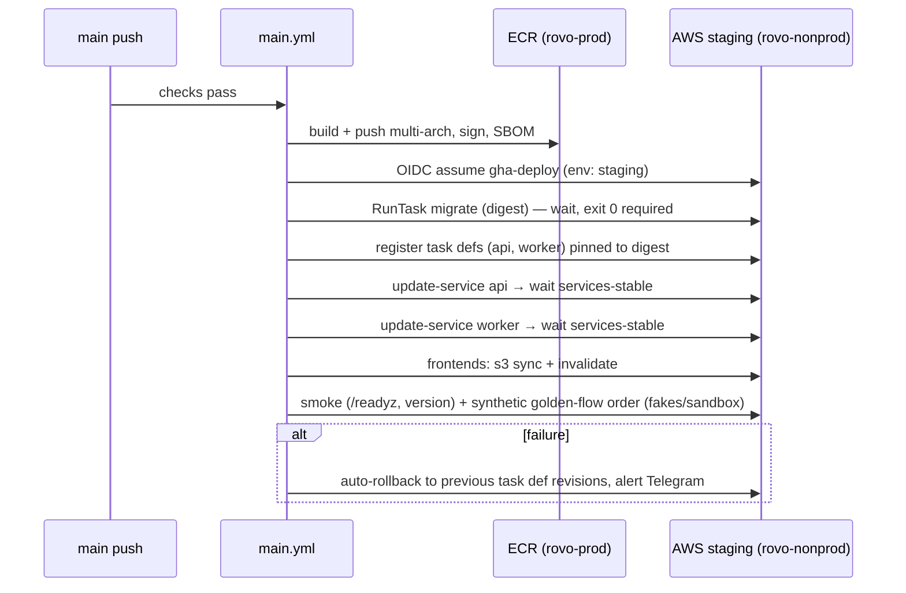

# 21 — CI/CD Strategy

| | |
|---|---|
| **Purpose** | Define GitHub Actions pipelines: PR checks (Go, web, contract, DB), security scanning, multi-arch image builds, OIDC to AWS, ECR push, OpenTofu plan/apply with approvals, staging deploys on `main`, production deploys on approved release tags, migration gating, rollback, dependency updates, branch protection and the CI time budget. |
| **Owner** | DevOps Architect |
| **Status** | Draft v1.1 — reconciled with review (31) and rulings R1–R54, 2026-10-04 |
| **Depends on** | `00-planning-baseline.md` (P2, P5, P14, P16, §4a); `22-deployment-architecture.md` (targets, accounts, IaC layout); `20-testing-strategy.md` (test pyramid, E2E scope); `26-repository-structure.md` (paths); `11-api-specification.md` (OpenAPI location); `19-security-threat-model.md` |
| **Feeds** | `27-implementation-backlog.md`, `29-production-readiness-checklist.md` |

**Changes in v1.1**
- **CI runs entirely on standard GitHub-hosted runners** (amd64 and arm64, free for this public Apache-2.0 repo), with **no card-requiring service** (R24). All AWS jobs (ECR push, staging/prod deploy, OpenTofu, restore drills) are gated by the repository variable `AWS_ENABLED`, which stays `false` until staging is created for go-live (§1, §2). Until then, `main` builds and publishes to GHCR only.
- **Multi-arch PostGIS image** (`rovo-postgres:17-3.5`, amd64 + arm64) is built on native runners and published to GHCR for CI and local Compose (§5.3; RV-023: PG 17 everywhere).
- Removed the Oracle `preview.yml` workflow and the `preview` environment (R24, RV-019). Demos use the local Compose stack plus a quick tunnel.
- **No `pull_request_target` workflows**. Cosign signature + provenance verification is **mandatory** for production deploys (RV-033).
- Paths follow doc 26: `openapi/**`, `backend/migrations/**`, `deploy/terraform/**` (R23). There are **four web apps** (customer, restaurant, rider, admin; R14), built with a same-origin `VITE_API_BASE=/api/v1` (R27, no CORS).
- OIDC roles map onto the **4 AWS accounts** (C18), and ECR lives in `rovo-prod`. OpenTofu plans/applies take a profile (`closed-pilot` / `public-launch`, R32).
- E2E runs fully offline with fakes (OTP, PA, push, SMS, bot challenge, map tiles). Integration tests cover River-as-outbox (R22/R42; no outbox table). Restore cadence per R50.

> Workflow YAML below is **illustrative design**, not files to create in Phase 1. Action versions are indicative and get pinned **by commit SHA** at implementation time.

---

## 1. Principles

1. **Trunk-based**: short-lived branches → PR → squash-merge to `main`. `main` is always deployable to staging.
2. **Build once, promote by digest**: a single multi-arch image per commit goes to staging and then, unchanged, to production.
3. **No long-lived cloud credentials**: GitHub OIDC → short-lived AWS STS credentials (P16, §4a).
4. **Everything as code**: app, infra (OpenTofu), dashboards/alerts (`24`), pipeline.
5. **Fast feedback**: PR checks ≤ 12 min wall-clock (p50); path filters skip irrelevant jobs.
6. **Production changes need a human**: GitHub Environments with required reviewers for app deploys and infra applies.
7. **Free and card-free by construction (R24):** every PR and `main` job runs on standard GitHub-hosted runners (`ubuntu-24.04`, `ubuntu-24.04-arm`; free for public repos [S67, S68]) and uses only GitHub-native services (Actions cache, GHCR, CodeQL, Dependabot, secret scanning) plus open-source tools. No SaaS that asks for a card, and no self-hosted runner. Cloud jobs exist but are skipped while `vars.AWS_ENABLED != 'true'`.

---

## 2. Workflow map

| Workflow | Trigger | Purpose |
|---|---|---|
| `pr.yml` | `pull_request` | All quality + security checks; image build (no push) |
| `main.yml` | `push` to `main` | Re-run checks, build + push the multi-arch image to **GHCR** (always) and **ECR** (when `AWS_ENABLED`), deploy **staging** (when `AWS_ENABLED`), smoke + synthetic order |
| `release-please.yml` | `push` to `main` | Maintains the release PR (version + CHANGELOG); merging it creates tag `vX.Y.Z` |
| `deploy-prod.yml` | `push` tag `v*` | Promote the tagged commit's **digest** to **production** behind the `production` environment approval |
| `infra-plan.yml` | `pull_request` touching `deploy/terraform/**` (same-repo branches only) | fmt/validate/lint/policy always; `tofu plan` (staging, prod, with the env's profile tfvars) and plan comment when `AWS_ENABLED` |
| `infra-apply.yml` | `push` to `main` touching `deploy/terraform/**`; manual | Apply staging automatically; apply prod with the saved plan behind `production-infra` approval |
| `frontend-deploy.yml` | called by `main.yml` / `deploy-prod.yml` | Build the 4 SPAs → S3 sync to their prefixes → CloudFront invalidation |
| `postgres-image.yml` | weekly + `deploy/docker/postgres-postgis.Dockerfile` change | Build and publish the multi-arch PostGIS image to GHCR (§5.3) |
| `scheduled.yml` | cron | Nightly security scans; when `AWS_ENABLED`: IaC drift, weekly automated restore-and-verify (R50, `23` §7); quarterly pricing diff (`25` §11/§17) |

There is **no preview workflow** (R24). A demo is the local Compose stack plus a card-free quick tunnel (`22` §11).

---

## 3. PR checks

### 3.1 Go backend (`backend/**`, `openapi/**`)

| Job | Tools / command | Gate |
|---|---|---|
| format | `gofmt -l`, `goimports -l` (must be empty) | required |
| lint | `golangci-lint run` (govet, staticcheck, errcheck, gosec, revive, bodyclose, sqlclosecheck, depguard **module-boundary rules**: a module may not import another module's `internal/`) | required |
| vet | `go vet ./...` | required |
| unit | `go test -race -shuffle=on -coverprofile` (coverage reported; threshold per `20`) | required |
| integration | `go test -tags=integration` against a **PostGIS service container** (`ghcr.io/<org>/rovo-postgres:17-3.5`, multi-arch, §5.3) or **testcontainers-go**; River (transactional `InsertManyTx` = the outbox, no outbox table, R22/R42), LISTEN/NOTIFY, geo queries | required |
| sqlc verify | `sqlc generate` then `git diff --exit-code` (and `sqlc vet`) | required |
| codegen drift | Regenerate OpenAPI server stubs (oapi-codegen) and TS client (openapi-typescript); `git diff --exit-code` | required |
| migrations lint | **squawk** on new `backend/migrations/*.sql` (blocking: non-concurrent index on existing tables, `NOT NULL` without default, column type changes, `DROP` in expand migrations) | required |
| migrations up/down | Fresh DB: `goose up` → `goose down-to 0` → `goose up`; plus **upgrade test**: restore previous release's schema snapshot → `goose up` | required |
| compat (N-1) | Run previous release's integration tests against the **new** schema (guarantees app rollback safety) | required on `backend/migrations/**` changes |
| build | `go build ./...` for `linux/amd64` + `linux/arm64` (cross-compile, `CGO_ENABLED=0`) | required |

### 3.2 API contract (`openapi/**`)

| Job | Tool | Gate |
|---|---|---|
| lint | **Spectral** (or Redocly CLI) with rovo ruleset (operationId, error schema, paise integers, pagination, `x-roles`) | required |
| breaking changes | **oasdiff breaking** vs `main` (and vs last release tag) | required; override needs label `api-breaking-approved` + 2 reviews |
| docs build | Redocly build-docs (artifact) | informational |

### 3.3 Web (`web/**`, pnpm workspace)

| Job | Command | Gate |
|---|---|---|
| install | `pnpm install --frozen-lockfile` with `actions/setup-node` pnpm cache | — |
| typecheck | `pnpm -r typecheck` (tsc --noEmit) | required |
| lint/format | `pnpm -r lint` (ESLint), `prettier --check` | required |
| unit | `pnpm -r test` (Vitest, coverage) | required |
| build | `pnpm -r build` (Vite) for **customer, restaurant, rider, admin** (R14) with `VITE_API_BASE=/api/v1` | required |
| bundle budget | size-limit per app; budgets are owned by doc `17` (indicative: customer ≤ 170 KB gzip, restaurant/rider ≤ 200 KB, admin ≤ 300 KB) | required |
| i18n | Key parity check `en` ↔ `te` | required |
| E2E | **Playwright** against the **Compose stack** (postgres, migrate, api, worker, minio, mailpit) on a GitHub-hosted `ubuntu-24.04` runner, **fully offline from third parties**: fake OTP, fake PA, push/SMS log sinks, `BotChallenge=fake`, local map-tile stub (RV-020/021); golden flow: customer order → restaurant accept → rider offer/accept → pickup → deliver → COD settle → rating; mobile viewport (Android Chrome emulation) | required on `main`; on PRs when `backend/**` or `web/**` changed |
| Lighthouse CI | `lhci autorun` (results stored as workflow artifacts; no external upload server) on the built customer, restaurant and rider apps served statically: PWA installable, Performance ≥ 85 (Moto G-class throttling), Accessibility ≥ 95 [ASSUMPTION] | required for `web/**` changes |

### 3.4 Required status checks (ruleset on `main`)

`go-format`, `go-lint`, `go-unit`, `go-integration`, `sqlc-verify`, `codegen-drift`, `migrations`, `openapi-lint`, `openapi-breaking`, `web-typecheck`, `web-lint`, `web-unit`, `web-build`, `bundle-budget`, `e2e`, `codeql`, `govulncheck`, `osv-scanner`, `gitleaks`, `dependency-review`, `trivy-image`, `infra-plan` (when infra changed).
Path-filtered jobs report "skipped = success" through a small aggregator job (`ci-ok`), so required checks never block unrelated PRs.

---

## 4. Security pipeline

| Control | Tool | When | Gate |
|---|---|---|---|
| SAST | **CodeQL** (Go, JavaScript/TypeScript) | PR + weekly | High/critical blocks |
| Go vulns | **govulncheck** (reachability-aware) | PR + nightly | Called vulnerable symbol blocks |
| JS/OS deps | **osv-scanner** on `pnpm-lock.yaml`, `go.sum` (`pnpm audit --prod` as a second opinion) | PR + nightly | High/critical blocks unless allow-listed with expiry |
| Secrets | **gitleaks** (full history nightly, diff on PR); GitHub secret scanning + push protection (free for public repos [ASSUMPTION]) | PR + push | Any finding blocks |
| Dependency review | `actions/dependency-review-action` (licence deny-list: AGPL/SSPL for runtime deps; vulnerable versions) | PR | Blocks |
| Image scan | **Trivy** image (OS + Go binary) and config (Dockerfile) | PR build + nightly on deployed digests | Critical (fixable) blocks |
| IaC scan | **Trivy config** / Checkov on `deploy/terraform/**`; `tflint` | PR | High blocks |
| SBOM | **syft** → SPDX JSON attached to the image as an attestation and as a release asset | main + release | — |
| Signing (**mandatory**, RV-033) | **cosign** keyless (Sigstore, GitHub OIDC; free, no account); `actions/attest-build-provenance` | main + release | A prod deploy **fails** unless the signature and provenance verify before `update-service` |
| Workflow hardening | `permissions: {}` by default, per-job least privilege; third-party actions pinned by commit SHA (Dependabot updates them); **no `pull_request_target` workflows** (RV-033); `step-security/harden-runner` community tier (egress audit) | all | — |

---

## 5. Container builds

### 5.1 Images

| Image | Base | Contents |
|---|---|---|
| `rovo` | `gcr.io/distroless/static-debian12:nonroot` (multi-arch) [ASSUMPTION: current tag] | Single static Go binary (`api`/`worker`/`migrate`/`healthcheck` subcommands), embedded migrations, CA certs, tzdata |
| `rovo-postgres` (local/CI only) | `postgres:17-bookworm` + PGDG `postgresql-17-postgis-3` (PostGIS 3.5), built from `deploy/docker/postgres-postgis.Dockerfile` | Needed because `postgis/postgis` is amd64-only [S83]. Same PG major (17) as RDS (R22); production uses RDS |

### 5.2 Multi-arch build on native runners (no QEMU)

```yaml
# illustrative
jobs:
  build:
    strategy:
      matrix:
        include:
          - { arch: amd64, runner: ubuntu-24.04 }
          - { arch: arm64, runner: ubuntu-24.04-arm }   # free for public repos, 4 vCPU/16 GB [S67, S68]
    runs-on: ${{ matrix.runner }}
    permissions: { contents: read, id-token: write }
    steps:
      - uses: actions/checkout@<sha>
      - uses: aws-actions/configure-aws-credentials@<sha>
        with: { role-to-assume: ${{ vars.ECR_PUSH_ROLE_ARN }}, aws-region: ap-south-1 }
      - uses: aws-actions/amazon-ecr-login@<sha>
      - uses: docker/build-push-action@<sha>
        with:
          platforms: linux/${{ matrix.arch }}
          outputs: type=image,name=${{ env.ECR_REPO }},push-by-digest=true,push=true
          cache-from: type=gha,scope=${{ matrix.arch }}
          cache-to: type=gha,mode=max,scope=${{ matrix.arch }}
          provenance: mode=max
          sbom: true
  merge:
    needs: build
    # docker buildx imagetools create -t $ECR_REPO:sha-$GITHUB_SHA <digest-amd64> <digest-arm64>
    # also push the same manifest to ghcr.io/<org>/rovo:sha-$GITHUB_SHA (public mirror; same digest; DR source, `23` DR-3)
    # while vars.AWS_ENABLED != 'true': build with GITHUB_TOKEN (packages: write) and push to GHCR only — no AWS steps run
```

- Tags: `sha-<40-hex>` (immutable, ECR tag immutability ON); `main` (moving, staging convenience); `vX.Y.Z` (release). **Deploys always reference `@sha256:` digests.**
- ECR lifecycle: keep all `v*` tags, the last 50 `sha-*`, and expire untagged after 7 days.

### 5.3 CI Postgres image (multi-arch PostGIS)

- `postgres-image.yml` builds `rovo-postgres:17-3.5` from `deploy/docker/postgres-postgis.Dockerfile` with the same native-runner matrix as §5.2: `ubuntu-24.04` (amd64) and `ubuntu-24.04-arm` (arm64), with no QEMU.
- The two per-arch digests are merged with `docker buildx imagetools create` and pushed to **GHCR** (public, free, no card [S69]) using `GITHUB_TOKEN` with `packages: write`. Tags are `17-3.5`, `17-3.5-<yyyymmdd>` and `sha-<git sha>`.
- It is rebuilt weekly (picking up PGDG/Debian security patches) and on Dockerfile change. A smoke step runs `SELECT postgis_full_version()` on both arches before the merge.
- Consumed by integration/E2E service containers and by local Compose on both Intel and Apple-silicon/ARM laptops (`22` §10).

---

## 6. OIDC from GitHub Actions to AWS (no long-lived keys)

- These roles are created only when AWS exists (`AWS_ENABLED`). One **IAM OIDC identity provider** `token.actions.githubusercontent.com` per workload account (`rovo-prod`, `rovo-nonprod`; 4-account org per C18), audience `sts.amazonaws.com`. `rovo-mgmt` and `rovo-audit` have no CI roles.
- Roles and trust conditions (`sub` claim pinned):

| Role (account) | Trusted `sub` | Permissions |
|---|---|---|
| `gha-ecr-push` (prod — ECR lives in `rovo-prod`) | `repo:<org>/rovo:ref:refs/heads/main`, `repo:<org>/rovo:ref:refs/tags/v*` | ECR push to `rovo` repos only |
| `gha-tofu-plan` (nonprod, prod) | `repo:<org>/rovo:pull_request` | `ReadOnlyAccess` + state bucket read + lock table |
| `gha-tofu-apply` (nonprod) | `repo:<org>/rovo:environment:staging-infra` | Admin-scoped by permission boundary (no IAM user creation, no Organizations) |
| `gha-tofu-apply` (prod) | `repo:<org>/rovo:environment:production-infra` | same, prod |
| `gha-deploy` (nonprod) | `repo:<org>/rovo:environment:staging` | `ecs:RegisterTaskDefinition`, `ecs:UpdateService`, `ecs:RunTask`, `ecs:Describe*`, `iam:PassRole` (only rovo task/execution roles), `s3:PutObject/DeleteObject/ListBucket` on the web bucket's app prefixes, `cloudfront:CreateInvalidation` |
| `gha-deploy` (prod) | `repo:<org>/rovo:environment:production` | same, prod |

- `max-session-duration` = 1 h; CloudTrail logs every `AssumeRoleWithWebIdentity`.
- Fork PRs get **no** `id-token: write` (default for `pull_request` from forks) and **no plan**. There are **no `pull_request_target` workflows** (RV-033). For a fork PR touching `deploy/terraform/**`, a maintainer reviews the diff and pushes it to a branch in the main repo, where `infra-plan.yml` runs normally. Fork PRs still get fmt/validate/tflint/Checkov, which need no credentials.

---

## 7. Deploy flows

### 7.1 Staging (automatic on `main`)



If staging is scheduled down (`22` §9), the workflow first scales it up: ECS desired → 1, and RDS `start-db-instance`, then waits.

### 7.2 Production (approved release tag)

1. Release-please PR merged → tag `vX.Y.Z` created on the `main` commit already deployed to staging.
2. `deploy-prod.yml`:
   - Resolve the **digest** for `sha-<tag commit>` (no rebuild).
   - Verify the cosign signature + provenance.
   - **Gate:** a staging deployment of that digest succeeded, and its synthetic order passed in the last 72 h (checked through the GitHub Deployments API).
   - Pause for `production` environment approval (required reviewers: 1 of `@rovo/release-managers`; 2 if the release contains migrations labelled `contract`). Deployment branch policy: tags `v*` only.
   - Pre-deploy: take a **manual RDS snapshot** `pre-vX.Y.Z` (fast, incremental) if the release has migrations.
   - Run `migrate` one-off task → `api` → `worker` (rolling, circuit breaker) → frontends.
   - Post-deploy verification for 10 min: error rate, p95 latency, orders/min vs baseline (Grafana API query). If breached → automatic rollback (§8) + page.
3. Deploy window: avoid 12:00–14:30 and 19:00–22:30 IST (meal peaks [ASSUMPTION]). The workflow warns, and an override needs a reason.

```yaml
# illustrative excerpt
deploy:
  environment: { name: production, url: https://app.rovo.example }
  permissions: { id-token: write, contents: read, deployments: write }
  steps:
    - uses: aws-actions/configure-aws-credentials@<sha>
      with: { role-to-assume: ${{ vars.PROD_DEPLOY_ROLE_ARN }}, aws-region: ap-south-1 }
    - run: ./deploy/scripts/ecs-run-migrate.sh "$DIGEST"          # waits, fails on non-zero exit
    - run: ./deploy/scripts/ecs-deploy.sh api "$DIGEST"           # register + update + wait stable
    - run: ./deploy/scripts/ecs-deploy.sh worker "$DIGEST"
    - run: ./deploy/scripts/web-deploy.sh prod                    # s3 sync + invalidation
    - run: ./deploy/scripts/verify.sh --window 10m                # SLO guard → rollback on breach
```

### 7.3 Infrastructure (OpenTofu)

| Stage | Steps |
|---|---|
| PR | `tofu fmt -check`, `tofu validate`, `tflint`, Trivy/Checkov, **`tofu plan` for staging and prod** with each env's profile (`-var-file=profiles/closed-pilot.tfvars` or `public-launch.tfvars`, R32) (read-only roles) → plan summary comment (resources to add/change/destroy; destroys highlighted) |
| Merge to `main` | `infra-apply.yml`: staging `plan -out` → apply (environment `staging-infra`, no reviewer); prod `plan -out` → upload plan artifact → **`production-infra` approval (2 reviewers for destroys or IAM/KMS/RDS changes)** → `tofu apply plan.bin` (exact saved plan; fails if state changed → re-plan) |
| Nightly | Drift detection: `tofu plan -detailed-exitcode` on prod → issue + Telegram if drift |

Infra and app deploys are **separate workflows**. App deploys never change infrastructure except task-definition revisions. Task-definition *templates* (CPU/memory/env) live in OpenTofu, and the deploy script only swaps the image digest.

### 7.4 Frontends

`pnpm build` per app (customer, restaurant, rider, admin) with `VITE_API_BASE=/api/v1`: same-origin through CloudFront on each app host, no CORS (R14/R27). Upload each app to its prefix in the web bucket (`22` §6.3): hashed assets with `Cache-Control: public,max-age=31536000,immutable`; then `index.html`, `sw.js` and `manifest.webmanifest` with `no-cache`; then invalidate those three paths. Frontend and backend deploy from the **same commit**, and the API stays backward compatible for one release (old SPA tabs keep working; the service worker prompts reload).

### 7.5 Demo (local only)

There is no preview deployment (R24, RV-019). A demo runs the local Compose stack (`make up`) with fakes and synthetic data, exposed through a temporary card-free quick tunnel (`22` §11). CI only provides the images (GHCR).

---

## 8. Rollback

| Situation | Action | Time |
|---|---|---|
| Bad app release, schema compatible (normal case thanks to expand/contract) | `deploy/scripts/ecs-rollback.sh` → previous task-def revisions for `api` + `worker`; previous SPA build re-synced from S3 versioning or rebuilt from the previous tag | ≤ 10 min |
| Circuit breaker trips during deploy | ECS auto-rolls back; the workflow fails and alerts | automatic |
| Failed **expand** migration in prod (aborted mid-way) | goose runs each migration in a transaction where possible. Non-transactional ones (`CREATE INDEX CONCURRENTLY`) are idempotent (`IF NOT EXISTS`) → fix forward | — |
| Data damage from a release | Stop writes (feature flag/maintenance mode) → **PITR** to new instance → reconcile (`23` §6) | RTO per `23` |
| Contract migration regret | Only possible if the data is still present. That is why contract migrations ship ≥ 1 release after code stops using the columns, and the `pre-vX.Y.Z` snapshot exists | — |

Rollbacks are exercised in staging every month (`23` drill calendar).

---

## 9. Scheduled jobs (`scheduled.yml`)

| Cron (IST) | Job |
|---|---|
| Daily 02:00 | gitleaks full history; govulncheck + osv-scanner on `main`; Trivy on **currently deployed** prod/staging digests |
| Daily 03:00 | OpenTofu drift (prod, staging), when `AWS_ENABLED` |
| Weekly Mon 04:00 | Rebuild `rovo-postgres` multi-arch image (`postgres-image.yml`); CodeQL full |
| Weekly Wed 04:00 | **Automated restore-and-verify** (R50, `23` §7 D0) into an ephemeral instance in `rovo-nonprod`, when `AWS_ENABLED`. Before that, CI restores a synthetic dump into the `rovo-postgres` container to keep the scripts exercised |
| Monthly 1st Sat | Reminder issue for the **timed manual DR drill** (R50, `23` §7 D1). Quarterly from Gate B: the cross-Region restore (D3) |
| Quarterly | Pricing/free-tier diff: fetch the pages listed in `25` §11/§17, diff key numbers, open issue |

---

## 10. Release process

- **Conventional Commits** enforced on PR titles (squash merge uses the PR title) via `amannn/action-semantic-pull-request` (or commitlint).
- **release-please** (`release-type: go` + node workspace plugin [ASSUMPTION]) maintains `CHANGELOG.md` and the version, and opens a release PR. Merging it tags `vX.Y.Z` and creates a GitHub Release with SBOM + checksums.
- **SemVer:** `feat` → minor, `fix` → patch, `feat!`/`BREAKING CHANGE` → major (API breaking changes also need the oasdiff override, §3.2).
- **Hotfix:** fix on `main` → `fix:` → release-please patch release. If `main` contains unreleasable work, cut `release/vX.Y` from the tag, cherry-pick, and tag `vX.Y.(Z+1)` from that branch (the workflow supports tags from release branches).

---

## 11. Dependency updates

**Dependabot** (native, free):
- Ecosystems: `gomod`, `npm` (pnpm), `github-actions`, `docker`, `terraform`.
- Weekly, grouped (minor+patch grouped per ecosystem; majors separate); security updates immediately.
- Auto-merge for patch-level dev dependencies when all checks pass.

Renovate is an acceptable alternative if grouping or regex managers are needed (e.g. pinning PostGIS/PG versions in Dockerfiles).

---

## 12. Branch protection (repository rulesets)

- `main`:
  - Require a PR.
  - **1 approval**; **CODEOWNERS** review for `deploy/terraform/**`, `backend/migrations/**`, `openapi/**`, `.github/workflows/**`, `backend/**/payments/**`, `backend/**/ledger/**` (2 approvals for these paths).
  - Dismiss stale approvals.
  - Required checks (§3.4), up-to-date branch (or merge queue [OPEN: availability/cost for public repos UNVERIFIED]).
  - Linear history (squash only), no force-push, no deletion.
- Tags `v*`: only release-please / maintainers can create them (tag ruleset).
- Environments:

  | Environment | Reviewers | Branch/tag policy | Secrets/vars |
  |---|---|---|---|
  | `staging` | none | `main` | role ARNs, URLs |
  | `staging-infra` | none | `main` | role ARN |
  | `production` | ≥ 1 release manager (2 for contract migrations) | tags `v*` | role ARNs, URLs |
  | `production-infra` | 2 maintainers | `main` | role ARN |

- Workflow files changes need CODEOWNERS review. `GITHUB_TOKEN` defaults to read-only.

---

## 13. CI time budget

| Pipeline | Jobs (parallel) | Est. job-minutes | Wall-clock |
|---|---|---|---|
| PR, backend-only change | format, lint, vet, unit, integration, sqlc, codegen, migrations, openapi, CodeQL, govulncheck, osv, gitleaks, dep-review, image build (2 arch) + Trivy, E2E | ≈ 45 | ≈ 10–12 min |
| PR, web-only | typecheck, lint, unit, build, bundle, Lighthouse, E2E, CodeQL, osv, gitleaks | ≈ 30 | ≈ 9 min |
| main → staging | checks + build/push + deploy + synthetic | ≈ 50 | ≈ 15 min |
| Release → prod | resolve, verify, approval wait, migrate, deploy, 10 min verify | ≈ 20 | ≈ 15 min + approval |
| Monthly total (≈ 80 PRs, 60 main pushes, 6 releases, nightly jobs) | | **≈ 8,000–9,000 job-minutes** | |

- **Public repo:** standard GitHub-hosted runners (incl. arm64) are **free** [S67, S68], so the budget is not a constraint.
- **If the repo were private:** GitHub Free includes 2,000 min/month [S67], an overrun of about 4×. At $0.006/min for Linux 2-core [S67], that is about $40–45/month and needs a card. This is not planned: the repo stays public (Apache-2.0), and no self-hosted runner is used.
- **Speed levers:** `concurrency: { group: ${{ github.ref }}, cancel-in-progress: true }` on PRs; Go build/test cache (`actions/setup-go` cache), pnpm store cache, buildx `type=gha` cache; path filters; `go test` sharding when > 5 min; Playwright sharding (2 shards).
