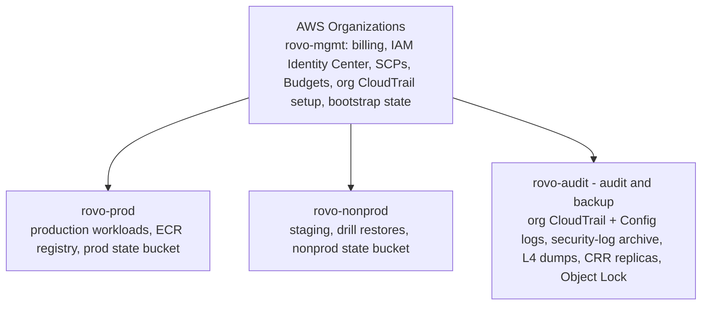
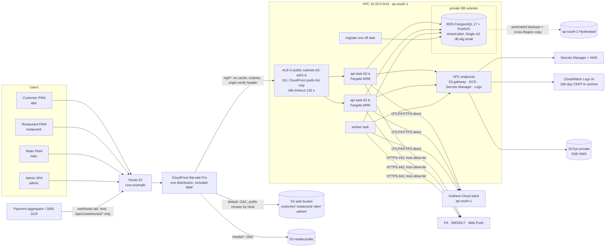
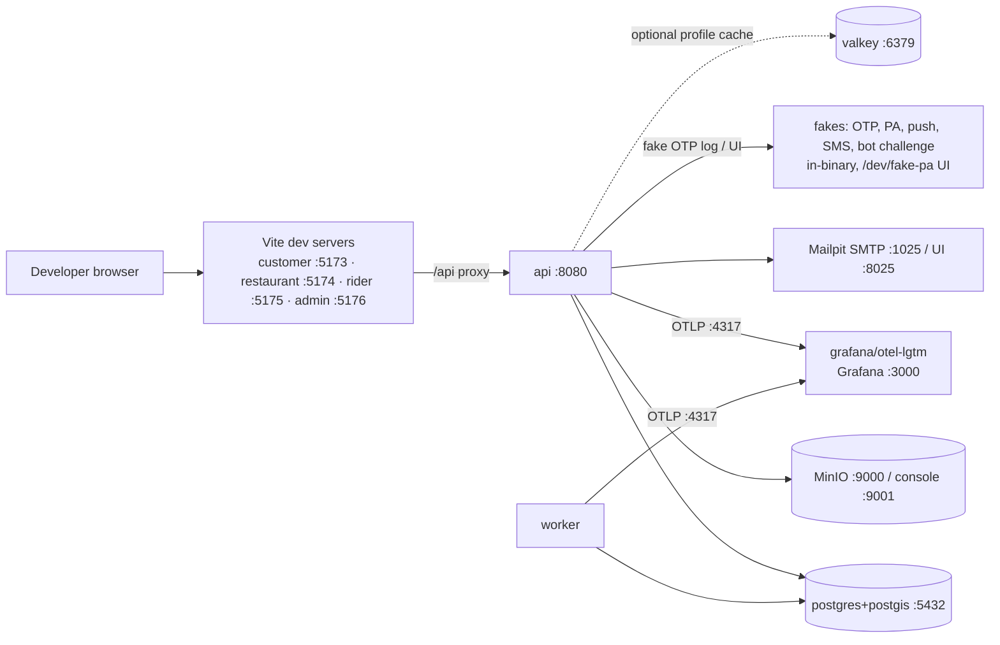

# 22 — Deployment Architecture

| | |
|---|---|
| **Purpose** | Define how rovo is deployed in every environment: the AWS production topology (network, compute, data, edge, secrets, IaC) in its two profiles `closed-pilot` and `public-launch`, staging as a scaled-down copy, and local Docker Compose (the only dev/demo environment, R24). Covers the scaling path. Cost lives in `25` §15. |
| **Owner** | DevOps Architect |
| **Status** | Draft v1.1 — reconciled with review (31) and rulings R1–R48, 2026-10-04 |
| **Depends on** | `00-planning-baseline.md` §4a/P14–P17, §8–§9 rulings; `25-free-hosting-comparison.md` (cloud choice, prices `[Cn]`/`[Sn]`, **§15 single source of cost**); `20-testing-strategy.md` §12 (load model, R45); `08-system-architecture.md` (runtime modules); `12-auth-rbac.md`, `19-security-threat-model.md` (controls); `14-payment-architecture.md` (webhooks); `17-frontend-architecture.md` (SPA build) |
| **Feeds** | `21-cicd-strategy.md`, `23-backup-disaster-recovery.md`, `24-observability-strategy.md`, `26-repository-structure.md` (`deploy/`), `29-production-readiness-checklist.md` |

**Changes in v1.1**
- **Edge (R27, R14, RV-001/RV-025):** the public `api.` host on the ALB is removed, and so is CORS. One CloudFront distribution serves `app.`, `restaurant.`, `rider.` and `admin.`, with `/api/*` (same-origin, cookies forwarded, caching off), `/media/*` and the SPA default behaviour. `api.` stays reserved for future native bearer clients and carries only PA/SMS webhooks in V1. The ALB accepts only the CloudFront origin-facing prefix list plus a secret origin-verify header. The `cdn.` host is dropped, because media is same-origin `/media/*` (doc 17).
- **Two OpenTofu profiles (R32/M17):** `closed-pilot` (RDS db.t4g.small Single-AZ + PITR + cross-Region backups, 2 small `api`, 1 `worker`, no Alloy gateway, CloudFront-included WAF only, no NAT) and `public-launch` (Multi-AZ, one NAT Gateway, sized by the doc 20 load test). Multi-AZ trigger: before Gate B or > 100 orders/day.
- **No-NAT closed pilot with explicit compensating controls, and one NAT before Gate B (R28)** (§4.3).
- **CERT-In 180-day log archive in `ap-south-1`, security events ≥ 1 year (R36/M1)** (§5, §6.3). The 3-day CloudWatch copy is gone. No Sentry.
- **4 AWS accounts (C18):** `rovo-mgmt`, `rovo-prod`, `rovo-nonprod`, `rovo-audit`. IaC root is `deploy/terraform/` (R23).
- Removed the Oracle/free preview stack (R24, RV-019). Four web apps, four Vite dev servers, PG 17 everywhere (RV-023). The SSE stream is capped at 30 min with no replay (R10).
- The cost table is replaced by references to `25` §15 (R46). Sizing follows the R45 phases, not 500–2,000 orders/day.

> Prices come from `25` §15, the single source of cost (verified 2026-10-04, excl. GST, ₹95/USD [ASSUMPTION]). The domain is a placeholder, **`rovo.example`** [ASSUMPTION]; real domain [OPEN].

---

## 1. Environments

| Env | Where | Infra definition | Data | Payments / OTP | Who |
|---|---|---|---|---|---|
| **local** | Developer laptop | `deploy/compose/compose.yaml` | Seed + synthetic | **Fake** OTP + fake PA (in-binary adapters) | Devs |
| **ci** | GitHub Actions runners | Service containers / Compose | Ephemeral | Fakes | CI |
| **demo** (optional) | **Local Compose on a developer machine + temporary card-free quick tunnel** (R24; the Oracle option in `25` §9 is reference only) | Same Compose | Synthetic only | Fakes | Stakeholders via the tunnel URL (short-lived) |
| **staging** | AWS account `rovo-nonprod`, `ap-south-1` | OpenTofu `deploy/terraform/envs/staging` (`closed-pilot` profile + staging overrides) | Synthetic + anonymised fixtures; **never prod PII** | PA **sandbox**, DLT test templates | Team, UAT testers |
| **production** | AWS account `rovo-prod`, `ap-south-1` (DR backups in `ap-south-2`) | OpenTofu `deploy/terraform/envs/prod`, profile `closed-pilot` → `public-launch` | Real | PA **live** | Customers |

The same **OCI image digests** flow local → CI → staging → production (P14). Only configuration differs (12-factor env vars + secrets).

---

## 2. AWS account & organisation layout



- **Humans** sign in through IAM Identity Center with MFA. Permission sets: `Admin` (2 people, break-glass), `Developer` (read + ECS Exec in staging only), `ReadOnly`, `Finance` (billing).
- **CI** uses GitHub OIDC → per-account IAM roles (`21` §6). There are no IAM users and no access keys.
- **SCPs:** deny leaving the org; deny regions other than `ap-south-1`, `ap-south-2`, `us-east-1` (the latter only for ACM certs used by CloudFront and global services); deny disabling CloudTrail/GuardDuty; deny public RDS.
- **Four accounts (C18), not six.** There is no separate `shared` account. **ECR** lives in `rovo-prod`, with tag immutability on. `rovo-nonprod` pulls through a cross-account repository policy (pull only). Promotion is by **digest**, with no rebuild. Each workload account holds its own OpenTofu state bucket. `rovo-mgmt` holds only the bootstrap/org state.
- `rovo-audit` (audit/backup) is write-only for the other accounts. Nobody in `rovo-prod` can shorten its retention (`23` §3.1).

---

## 3. Production topology

The diagram shows the **`closed-pilot` profile**. Differences in **`public-launch`** are listed under it (R32).



**`public-launch` differences:** RDS **Multi-AZ** (class set by the doc 20 load test). `api` and `worker` tasks move to **private-app subnets**, with egress through **one NAT Gateway** in AZ-a (R28). There are 2 `worker` tasks and the `api` tasks are larger (§5). An optional Alloy gateway task is added only if tail sampling becomes necessary (`24` §2.3). Everything else stays the same.

### 3.1 Hostnames and edge routing (R14, R27)

**One CloudFront distribution** carries all public hostnames. That is simplest whether the flat-rate plan is billed per distribution or per account (the plan scope is still [OPEN — verify at setup]). Cost and the request model are in `25` §15.1 and §15.7.

| Hostname | Behaviours | Notes |
|---|---|---|
| `app.rovo.example` (customer) | `/api/*` → ALB · `/media/*` → media bucket · `/tiles/*` → PMTiles object (doc 17) · default → web bucket prefix `customer/` | SPA fallback by a **viewer-request CloudFront Function on the default behaviour only**. It also selects the bucket prefix from `Host`. `/api/*` and `/media/*` are never rewritten |
| `restaurant.rovo.example` | same, prefix `restaurant/` | Same-origin API, host-only cookies |
| `rider.rovo.example` | same, prefix `rider/` | |
| `admin.rovo.example` | same, prefix `admin/` | WAF: stricter rate rules on `/api/v1/auth/admin/*` and a **geo match = IN** rule scoped to this host (R37). No identity-aware proxy (C4) |
| `api.rovo.example` | **Only `/api/v1/webhooks/*`** (POST) → ALB. A CloudFront Function returns 404 for any other path on this host | **No CORS, no cookies, no browser clients in V1.** Reserved for future native bearer clients (R27). PA and SMS-DLR webhooks are signature-verified in the app (doc 14/15). This settles doc 08's open item on the webhook host |

`/api/*` behaviour settings: caching disabled; origin request policy forwards all viewer headers (including `Host`), cookies and query strings; allowed methods GET/HEAD/OPTIONS/PUT/POST/PATCH/DELETE; origin protocol HTTPS to `origin-api.rovo.example` (a Route 53 alias to the ALB, never advertised); origin response timeout **120 s** (R10); a custom origin header `X-Origin-Verify: <secret>` from Secrets Manager, rotated with two valid values during overlap.

**Origin protection (RV-025):**
1. The ALB security group allows 443 only from the **CloudFront origin-facing managed prefix list**.
2. The ALB listener's default action is a fixed 403. A rule forwards to the `api` target group only when `X-Origin-Verify` matches.
3. The API derives the audience (`customer`/`restaurant`/`rider`/`admin`/`webhook`) from `Host`. It **ignores** any `X-Rovo-Audience` header unless the origin secret is present (doc 12).

There is no regional AWS WAF on the ALB. All WAF rules live on the distribution (flat-rate Pro includes WAF with 25 rules [C12]): AWS managed common, known-bad-inputs and IP reputation rule sets; rate rules for OTP send, login and order create (with CGNAT-aware limits, doc 20); and webhook paths exempted from bot rules.

### 3.2 DNS & TLS

- **Route 53** public hosted zone for `rovo.example`. Alias records point the five public hostnames at CloudFront, and `origin-api.` at the ALB. DNSSEC is enabled [OPEN: registrar support].
- **ACM** certificates: `*.rovo.example` in **us-east-1** (CloudFront requirement) and `origin-api.rovo.example` in **ap-south-1** (ALB). Both are DNS-validated and auto-renewed.
- TLS policy: ALB `ELBSecurityPolicy-TLS13-1-2-2021-06` or newer [ASSUMPTION: current name]; CloudFront `TLSv1.2_2021`. HSTS (`max-age=31536000; includeSubDomains`) is set by the API and by a CloudFront response-headers policy, together with the doc 17 §15.6 security headers.
- The v1 "Cloudflare in front of `api.`" lean variant is **withdrawn**. All traffic enters through CloudFront (R27).

### 3.3 SSE through the edge (R10)

| Hop | Timeout | Setting |
|---|---|---|
| Browser ↔ CloudFront | HTTP/2; one request per stream (`25` §15.7) | — |
| CloudFront ↔ ALB (origin response timeout = maximum gap between bytes) | default 30 s, configurable | **120 s** (≥ 120 s per R10; the 20 s heartbeat keeps it well inside) |
| ALB idle timeout | default 60 s, range 1–4000 s [C9] | **120 s** |
| ALB ↔ task | same idle timer | app sends `: ping` every **20 s** |
| App | `http.Server` `WriteTimeout` = 0 on SSE routes only; **server closes each stream after 30 min** with `retry:` (doc 08 §6.2) | Clients **refetch REST snapshots on reconnect**. No server replay (R10) |

---

## 4. Network

### 4.1 VPC layout (`ap-south-1`, 2 AZs; a 3rd AZ is reserved in the CIDR plan)

| Subnet tier | AZ-a | AZ-b | Contents | Route |
|---|---|---|---|---|
| public | 10.20.0.0/22 | 10.20.4.0/22 | ALB; **`closed-pilot`: ECS tasks with a public IPv4 used for egress only** (no inbound, §4.3); `public-launch`: the single NAT Gateway (AZ-a) | IGW |
| private-app | 10.20.16.0/20 | 10.20.32.0/20 | **`public-launch`: ECS tasks**; interface VPC endpoints (AZ-a) | NAT GW (one, AZ-a; one per AZ only at 10×) |
| private-db | 10.20.64.0/24 | 10.20.65.0/24 | RDS, ElastiCache | none (no internet) |

- **VPC endpoints (R28):** an **S3 gateway endpoint** on all route tables (no hourly charge [ASSUMPTION: AWS docs]) and **interface endpoints** for `ecr.api`, `ecr.dkr`, `secretsmanager` and `logs`. The interface endpoints sit in **one AZ (AZ-a)**, at $0.013/h each [C25]; that is accepted because the DB and NAT are single-AZ too. Endpoint policies restrict access to rovo's own account resources and buckets (exfiltration guard).
- **VPC Flow Logs: all traffic** (accepts and rejects, RV-085) go to the S3 log archive (§6.3) with 400-day retention as security events.

### 4.2 Security groups

| SG | Inbound | Outbound |
|---|---|---|
| `alb` | 443 **only from the CloudFront origin-facing managed prefix list** (no 80, no `0.0.0.0/0`) | 8080 to `api` |
| `api` | 8080 from `alb` only | 5432 → `rds`; 443 → `vpce` SG; 443 → internet (PA, SMS, Web Push, Grafana OTLP), host-filtered in the app (§4.3); 6379 → `valkey` only when enabled |
| `worker` | **none** | same as `api` |
| `vpce` | 443 from `api`, `worker`, `migrate`, `tools` | none |
| `otel` (`public-launch`, optional) | 4317/4318 from `api`, `worker` | 443 → Grafana Cloud |
| `rds` | 5432 from `api`, `worker`, `migrate`, `tools` | none |
| `valkey` | 6379 from `api`, `worker` | none |

### 4.3 Decision: no NAT in `closed-pilot`, one NAT before Gate B (R28)

A NAT Gateway costs about $42/month per AZ [C24]. In the **`closed-pilot` profile**, ECS tasks run in **public subnets with `assignPublicIp=ENABLED`**. The public IPv4 is used **for egress only**. These compensating controls are mandatory (and amend doc 19 §7.2 for the closed pilot only):

| Control | Implementation |
|---|---|
| No inbound reachability | `api` SG: 8080 from `alb` SG only. `worker`/`migrate`/`tools` SGs: no inbound rules. The public IP is not reachable from the internet. External probe test SEC-112 (doc 19) |
| ALB reachable only from CloudFront | Prefix-list SG + origin-verify header (§3.1) |
| VPC endpoints | S3 gateway; ECR, Secrets Manager and CloudWatch Logs interface endpoints with endpoint policies (§4.1). AWS API traffic does not traverse the internet |
| Egress restriction | SG egress: 443 to `0.0.0.0/0` (needed for providers), 443 to `vpce`, 5432 to `rds`; nothing else (no 80, no other ports). **App-level outbound host allow-list** in the shared HTTP client: PA API, SMS/DLT provider, Web Push services (FCM, Mozilla, Apple, Windows), Grafana Cloud OTLP. Any other host is refused and logged as a security event |
| Detection | GuardDuty with ECS runtime monitoring in prod; VPC flow logs (all) retained 400 days |
| DB isolation | RDS in private-db subnets with no route to the internet; not publicly accessible (SCP) |

**Upgrade (mandatory):** the **`public-launch` profile moves tasks to `private-app` subnets behind one NAT Gateway (single AZ)**, before Gate B. This happens earlier if a PA or SMS provider requires IP allow-listing, which `14`/`15` must confirm during onboarding [OPEN]. The provider then gets the NAT Elastic IP. One NAT per AZ only at 10× (§14).

### 4.4 Administrative access

- No bastion and no SSH. **ECS Exec** (SSM) into a dedicated `tools` task (psql, pgcli, `rovo admin` CLI) for break-glass. It is allowed only for the `Admin` permission set in prod and logged to CloudTrail + S3.
- DB GUI access goes through an SSM port-forward from the `tools` task.

---

## 5. Compute (ECS on Fargate, ARM64)

| Service | Launch | Size `closed-pilot` / `public-launch` | Count `closed-pilot` / `public-launch` | Scaling | Health | Notes |
|---|---|---|---|---|---|---|
| `api` | ECS service + ALB target group | 0.25 vCPU / 0.5 GB / 0.5 vCPU / 1 GB | 2 / 2 (one per AZ) | Target tracking: CPU 60%, ALB `RequestCountPerTarget`; min 2, max 4 / 6 | ALB → `/readyz` (DB ping + migrations at expected version); container `/livez` | Deployment circuit breaker with rollback; `minimumHealthyPercent=100`, `maximumPercent=200`; deregistration delay 30 s (SSE clients reconnect) |
| `worker` | ECS service, no LB | 0.25 vCPU / 0.5 GB | 1 / 2 (one per AZ) | Manual / River queue-latency alarm (`24` A8 → +1) | Container health cmd `rovo healthcheck --worker` (River client alive + DB ping) | `stopTimeout=120 s` so in-flight jobs finish. River's leader election runs periodic jobs once |
| `otel-gateway` | **Not deployed in `closed-pilot`** (SDKs export OTLP directly to Grafana Cloud, R32). Optional in `public-launch` | 0.25 vCPU / 0.5 GB | 0 / 0–1 | — | `:13133` health extension | Grafana Alloy: tail sampling and a second redaction layer, added only if trace volume needs it (`24` §2.3) |
| `migrate` | **One-off `RunTask`** from CI | 0.25 vCPU / 0.5 GB | 0 (ad hoc) | — | Exit code | `rovo migrate up` (goose). Gated (`21` §7) |
| `tools` | One-off / ECS Exec | 0.25 vCPU / 0.5 GB | 0 | — | — | Break-glass shell |

Container standards (P14):
- Distroless/static non-root image (UID 65532) with a read-only root filesystem.
- `SIGTERM` → graceful drain: stop accepting, close SSE with `retry`, finish requests within 25 s.
- Logs are JSON to stdout. The `awslogs` driver ships them, through the `logs` VPC endpoint, to CloudWatch Log groups of the **Infrequent Access class in `ap-south-1`**. `/rovo/prod/app` keeps them **180 days** (CERT-In, M1). `/rovo/prod/security` (auth/OTP abuse, admin sign-in, role grants, KYC access, refused outbound hosts) keeps them **400 days** (R36). The OTLP logs exporter sends the same events to Grafana Cloud (operational, 14-day/plan retention). CloudWatch is the compliance copy, and Grafana is the working copy (`24` §1.2).
- ECR image scanning on push.
- Task **IAM roles** follow least privilege:
  - `api`: S3 media/kyc prefixes, `secretsmanager:GetSecretValue` on its own secrets, KMS decrypt on its keys.
  - `worker`: the same plus SES/SNS if used. With 1 `worker` in `closed-pilot`, ECS replaces a failed task within about 2 min. River jobs, and catch-up periodic jobs (M11, doc 08), resume after that.
  - `execution role`: ECR pull + logs.

**Why ECS services and not Lambda/App Runner?** The worker needs continuous CPU (River timers), and SSE needs long-lived connections. App Runner is closed to new customers [C7]. ECS Express Mode [C7] may be used to bootstrap, but OpenTofu remains the source of truth.

---

## 6. Data tier

### 6.1 RDS for PostgreSQL

| Setting | `closed-pilot` (prod) | `public-launch` (prod) | Staging |
|---|---|---|---|
| Engine | PostgreSQL **17.x**, PostGIS **3.5.x** (3.5.6 available [C5]) via migration `CREATE EXTENSION IF NOT EXISTS postgis` (R22) | same | same |
| Class | **db.t4g.small Single-AZ** ($0.042/h [C2]) | **Multi-AZ**. Starts at db.t4g.small; the doc 20 K-2/K-6 load test sets the class (db.t4g.medium if needed) | db.t4g.micro Single-AZ |
| Multi-AZ trigger (R32) | **Mandatory before Gate B or above 100 orders/day, whichever comes first**. The conversion is an in-place modify in a low-traffic window | — | — |
| Storage | gp3 20 GB, autoscaling to 100 GB, **encrypted with CMK `rds-prod`** | gp3 30 GB, autoscaling to 200 GB | gp3 20 GB |
| Backups | Automated, **retention 14 days (PITR)**, window 21:30–22:00 UTC (03:00–03:30 IST); **cross-Region automated backup replication to `ap-south-2`, retention 7 days** [C6] | same | retention 3 days, no cross-Region (except during drills) |
| Deletion protection | On; final snapshot on delete | same | On |
| Parameters | `rds.force_ssl=1`; `shared_preload_libraries=pg_stat_statements,auto_explain`; `log_min_duration_statement=500`; `log_connections=1`; `idle_in_transaction_session_timeout=60s`; `statement_timeout` set per role. PostgreSQL logs are exported to CloudWatch Logs (180 d; connection/auth events count as security events, 400 d) | same | same, 30-day logs |
| Auth | Master secret **managed by RDS in Secrets Manager** with rotation; app roles `rovo_app` (DML), `rovo_migrator` (DDL), `rovo_readonly` | same | same |
| Monitoring | Enhanced Monitoring 60 s; Performance Insights (free retention tier, **UNVERIFIED** price) | same | basic |
| Maintenance | Sun 22:00–23:00 UTC (Mon 03:30–04:30 IST, lowest order volume [ASSUMPTION]) | same | any |

**Connection budget:** `closed-pilot` = `api` 2 × 10 + `worker` 1 × 10 (River) + 2 LISTEN connections + `migrate` 2 + `tools` 2 ≈ **36**. `public-launch` ≈ 2 × 15 + 2 × 10 + 2 + 4 ≈ **56**. Both are far below the default `max_connections` of the class [ASSUMPTION ≈ 190 for t4g.small]. **No RDS Proxy:** River and the SSE hub use `LISTEN/NOTIFY`, which needs session-pinned direct connections (doc 08 §6.2).

### 6.2 Cache (P6)

An ElastiCache **Valkey** module exists in IaC with `enabled = false`. When it is turned on: `cache.t4g.micro` (pilot, $0.016/h [C4]) → `cache.t4g.small` primary + replica (10×), TLS + AUTH token from Secrets Manager, private-db subnets.

### 6.3 S3 buckets (all: Block Public Access ON, SSE, TLS-only bucket policy)

| Bucket | Encryption | Versioning | Lifecycle | Access |
|---|---|---|---|---|
| `rovo-prod-web` (prefixes `customer/`, `restaurant/`, `rider/`, `admin/`; one per app, R14) | SSE-S3 | On | Noncurrent → delete 30 d (keeps 2 previous releases, doc 17) | CloudFront OAC only; the deploy role may write only its app's prefix |
| `rovo-prod-media-public` | SSE-S3 | On | Noncurrent → delete 90 d | CloudFront OAC (`/media/*` on every app host); app writes via presigned PUT (size/MIME constrained) |
| `rovo-prod-kyc-private` | **SSE-KMS (CMK `kyc-prod`)** | On | Retention per `12`/DPDP policy [LEGAL]; noncurrent → delete 30 d | `api` role only; **presigned GET ≤ 5 min** for authorised admin reviewers; CloudTrail data events on |
| `rovo-prod-exports` | SSE-KMS | On | Expire 30 d | Finance exports |
| `rovo-prod-logs` (CERT-In archive, operational) | SSE-S3 | Off | **Expire 180 d** (Standard → Standard-IA after 30 d) | ALB and CloudFront access logs |
| `rovo-audit-security-logs` (account `rovo-audit`, `ap-south-1`) | SSE-KMS | On + **Object Lock (compliance, 400 d)** | Expire 400 d | Org CloudTrail, AWS Config, WAF logs, VPC flow logs (all), GuardDuty findings export. Write-only for producer accounts |
| `rovo-audit-backup-dumps` (account `rovo-audit`, see `23`) | SSE-KMS | On + **Object Lock (compliance)** | 7 daily / 4 weekly / 6 monthly | Backup task `PutObject` only |

All buckets are in **ap-south-1** to keep data in India [LEGAL: DPDP]. CRR replicas live in `ap-south-2` (`23` §4). CloudFront edge caches hold only public images and SPA assets; `/api/*` is never cached.

**CERT-In archive summary (M1, R36):** every ICT log class is kept **≥ 180 days in India**, and security events **≥ 400 days**. App logs: CloudWatch Logs IA (§5). RDS logs: CloudWatch Logs. ALB/CloudFront: `rovo-prod-logs`. CloudTrail/Config/WAF/VPC flow/GuardDuty: `rovo-audit-security-logs`. Grafana's short retention is never the compliance copy. Delivery is monitored (`24` A24). Cost: `25` §15.1.

---

## 7. Secrets & configuration

| Kind | Where | How it reaches the app |
|---|---|---|
| DB credentials | Secrets Manager (RDS-managed, rotated) | ECS task definition `secrets:` → env var at task start |
| App secrets (JWT signing keys, refresh-token pepper, PA key/secret, PA webhook secret, SMS/DLT keys, Web Push VAPID private key, Grafana OTLP token, **CloudFront origin-verify secret**) | Secrets Manager `rovo/prod/<name>`, encrypted with CMK `secrets-prod` | ECS `secrets:` (by ARN + JSON key) |
| Non-secret config (`ROVO_ENV`, `CITY_DEFAULT`, feature flags, OTel endpoint, sampling ratio) | OpenTofu → task definition `environment:` | env vars |
| Local dev | `.env` (git-ignored) generated from `.env.example`; fakes need no real secrets | Compose `env_file` |

Rules:
- **Never commit secrets.** Gitleaks runs in CI (`21`).
- Secret changes roll the ECS service (new task picks up the value).
- JWT keys rotate with `kid` overlap (two active keys).
- Each env has its own PA/webhook secrets. Staging never holds live PA keys.

KMS CMKs per env: `rds`, `kyc`, `secrets`, `backups`. Key policies grant decrypt only to the matching task roles. Keys cost $1/month each [C8].

---

## 8. Deployment mechanics (summary; pipelines in `21`)

1. CI builds a multi-arch image → pushes to ECR (in `rovo-prod`) and the public GHCR mirror with tag `sha-<git sha>` → signs it (cosign keyless; **verification mandatory before production deploys**, `21` §4) → records the digest.
2. **Staging (on merge to `main`):** run the `migrate` task (expand-only migrations) → `aws ecs update-service` for `api` then `worker` with the new task-definition revision pinned to the **digest** → wait for steady state → smoke + synthetic order test.
3. **Production (on approved release tag):** the same digest goes through the same steps, behind the GitHub Environment `production` with required reviewers.
4. **Rolling update** with circuit breaker auto-rollback. SSE clients reconnect transparently.
5. **Expand/contract migrations:** a release only adds (columns nullable/defaulted, new tables, `CREATE INDEX CONCURRENTLY`). Destructive "contract" migrations ship ≥ 1 release later, after code no longer reads the old shape. This makes app rollback safe without DB rollback.
6. **Rollback:** redeploy the previous task-definition revision (`21` §8). DB down-migrations are used only for failed expand steps in staging. Prod data issues use PITR (`23`).
7. **Frontends:** `aws s3 sync` hashed assets (immutable) → upload `index.html` + `sw.js` last (no-cache) → CloudFront invalidation of `/index.html`, `/sw.js` and `/manifest.webmanifest` only. The four apps deploy to their own prefixes of the one web bucket, and all four are built with `VITE_API_BASE=/api/v1` (same-origin, no CORS).

Blue/green (CodeDeploy) is deferred: rolling + circuit breaker + backward-compatible migrations is enough at pilot.

---

## 9. Staging

- Account `rovo-nonprod`, **same OpenTofu modules** with the `closed-pilot` profile plus staging overrides: 1 `api` + 1 `worker` task, db.t4g.micro Single-AZ, no cross-Region backup (except during D3 drills), interface VPC endpoints off (S3 gateway only; switched on for pre-release capacity runs), CloudFront **Free** flat-rate plan [C12] with the same `/api/*`, `/media/*` and default behaviours on `*.staging.rovo.example`.
- **Scheduled scale-down:** EventBridge Scheduler sets ECS desired = 0 and stops RDS 21:00–07:00 IST and at weekends. Staging must be **started before UAT**, and RDS auto-starts after 7 days stopped [ASSUMPTION: RDS behaviour]. Cost: `25` §15.1.
- **Capacity runs (doc 20 §12.4):** staging is temporarily scaled to the `public-launch` shape by IaC variables, then scaled back.
- **Data:** synthetic seed + anonymised fixtures. No production restore into staging unless it has been through the anonymisation pipeline [LEGAL: DPDP purpose limitation].
- **Integrations:** PA sandbox, SMS in test mode (or fake), Web Push to test devices.
- **Access:** SPAs are public, but the API requires login. An optional WAF IP set restricts `admin.staging` to team IPs [OPEN].

---

## 10. Local development (Docker Compose)



| Service | Image | Notes |
|---|---|---|
| `postgres` | **`ghcr.io/<org>/rovo-postgres:17-3.5`** built from `postgres:17` + PGDG `postgresql-17-postgis-3` (multi-arch). The official `postgis/postgis` is amd64-only [S83] | Matches RDS major versions; init script creates roles mirroring prod |
| `migrate` | `rovo` image, `migrate up` | Runs before api/worker (`depends_on: condition: service_completed_successfully`) |
| `api`, `worker` | `rovo` image, or `go run` with Air for hot reload | Same binary, different mode |
| `minio` + `minio-init` | MinIO + `mc` | Creates buckets mirroring prod names; the S3 adapter talks to MinIO via endpoint override |
| `mailpit` | Mailpit | Captures email |
| fakes | Built into the binary behind `ROVO_OTP_PROVIDER=fake`, `ROVO_PA_PROVIDER=fake`, `ROVO_BOT_CHALLENGE=fake` (RV-020), push/SMS log sinks | Fake PA exposes a page to simulate success/failure/webhook replay |
| map tiles | Small Mahabubnagar PMTiles extract (or blank style) served from MinIO; `tileStyleUrl` configurable (RV-021) | No internet needed |
| `lgtm` | `grafana/otel-lgtm` | Loki + Grafana + Tempo + Mimir/Prometheus in one container; dashboards provisioned from `deploy/observability/` |
| `valkey` | `valkey/valkey` | `profiles: [cache]` |

`make up` / `make down` / `make seed` / `make e2e`. The whole golden flow must work **offline** (§4a).

---

## 11. Dev / demo environment (local only, R24)

There is **no cloud dev or preview environment**. Development uses the local Compose stack (§10), and CI uses GitHub-hosted runners (`21`). Neither needs a card-requiring service. For a stakeholder demo, a developer runs the local stack with fakes and synthetic data and exposes it temporarily through a **card-free quick tunnel** (e.g. `cloudflared tunnel --url`, which needs no account; verify the current terms before use). The tunnel is closed after the demo. Cloud spend starts with **staging** when the team prepares for go-live. The Oracle/free-tier research, including VM hardening, is kept for reference only in `25` §9. The v1 Oracle preview stack, `compose.preview.yaml` and the `preview` workflow are withdrawn (RV-019).

---

## 12. Infrastructure as Code layout (OpenTofu; Terraform-compatible)

```
deploy/terraform/            # R23; logical module grouping per `26` §1.4
├── modules/
│   ├── network/            # VPC, subnets, IGW, NAT toggle (0/1/per-AZ), S3 gateway + interface endpoints, flow logs (all)
│   ├── ecr/                # repos + cross-account pull policy + lifecycle (keep last 50 + all release tags)
│   ├── ecs-cluster/        # cluster, Cloud Map namespace, capacity providers (FARGATE, FARGATE_SPOT for staging)
│   ├── ecs-service/        # generic service: task def, IAM roles, SG, autoscaling, alarms, LB attachment (optional)
│   ├── ecs-oneoff-task/    # migrate/tools task definitions
│   ├── alb/                # ALB, listeners, TLS policy, idle timeout, access logs
│   ├── waf/                # CloudFront-scoped web ACL (flat-rate plan): managed rules, rate rules, admin geo-IN, webhook allow
│   ├── rds-postgres/       # instance, param group, subnet group, KMS, secrets, cross-region backup replication
│   ├── elasticache-valkey/ # enabled=false by default
│   ├── s3-bucket/          # opinionated secure bucket (BPA, TLS-only, SSE, versioning, lifecycle, object lock opt.)
│   ├── cloudfront-app/     # single distribution: 4 app hosts + api. (webhooks); /api/*, /media/*, /tiles/*, default; OAC; host→prefix + SPA function; origin-verify header; headers policy
│   ├── kms/
│   ├── secrets/            # secret shells only (values set out-of-band or by rotation)
│   ├── github-oidc/        # IAM OIDC provider + roles (plan-only, apply, deploy) per env
│   ├── dns/                # Route 53 zone/records, ACM certs (ap-south-1 + us-east-1)
│   ├── observability/      # CloudWatch alarms (last-resort), SNS → email/Telegram webhook, log groups (IA class, 180/400 d), log-archive buckets
│   └── budgets/            # AWS Budgets + cost anomaly alerts
├── envs/
│   ├── shared/             # bootstrap per account: state bucket + lock, GitHub OIDC provider; org bits (SCPs, Identity Center, budgets) in rovo-mgmt
│   ├── staging/            # account rovo-nonprod; closed-pilot profile + staging overrides
│   └── prod/               # account rovo-prod (incl. ECR); profile selected by tfvars
├── profiles/
│   ├── closed-pilot.tfvars   # R32: RDS t4g.small Single-AZ, api 2×0.25/0.5, worker 1, nat=0, otel_gateway=false, regional_waf=false
│   └── public-launch.tfvars  # Multi-AZ, nat=1, api 2×0.5/1, worker 2, class from load test
└── policies/               # OPA/conftest or Checkov config for plan checks
```

- **Profiles (R32/M17):** `tofu plan -var-file=profiles/<profile>.tfvars`. Moving `closed-pilot` → `public-launch` is a reviewed plan (Multi-AZ modify, NAT and subnet move with a rolling task replacement) executed **before Gate B or at > 100 orders/day**.
- **State:** an S3 bucket in each workload account (versioned, SSE-KMS) with locking (DynamoDB table or the S3-native lockfile, depending on the OpenTofu version in use [ASSUMPTION]). One state per env.
- **No secret values in state where avoidable.** Secrets are created as shells, and values are set via console/CLI by `Admin` or generated by RDS rotation.
- **Drift detection:** a nightly `tofu plan -detailed-exitcode` on prod (`21` §9).

---

## 13. Resource allocation summary

| Component | `closed-pilot` (prod) | `public-launch` (prod, start; final size from load test) | Staging | 10× prod |
|---|---|---|---|---|
| `api` | 2 × 0.25 vCPU / 0.5 GB ARM | 2 × 0.5 / 1 (autoscale to 6) | 1 × 0.25 / 0.5 | 4 × 1 vCPU / 2 GB |
| `worker` | 1 × 0.25 / 0.5 | 2 × 0.25 / 0.5 | 1 × 0.25 / 0.5 | 2 × 0.5 / 1 |
| `otel-gateway` | none (OTLP direct) | none, or 1 × 0.25 / 0.5 if needed | none | 2 × 0.5 / 1 |
| RDS | t4g.small **Single-AZ**, 20 GB | **Multi-AZ**, t4g.small (→ t4g.medium per K-6), 30 GB | t4g.micro SAZ, 20 GB | m7g.large MAZ, 200 GB (+ read replica optional) |
| Valkey | off | off | off | 2 × t4g.small |
| NAT | none (compensating controls, §4.3) | **1** (single AZ) | none | 1 per AZ |
| Interface VPC endpoints | 4 in 1 AZ | 4 in 1 AZ | off | 4 per AZ |

Sizing follows the R45 phase volumes (closed pilot ≈ 30 orders/day, month 1 ≈ 80, month 3 ≈ 250). The doc 20 load test (design point 2,000/day, 1,500 orders/h, 3,000 SSE) proves capacity before Gate B.

---

## 14. Scaling path

| Stage | Trigger (any) | Change |
|---|---|---|
| S0 `closed-pilot` | Gate A | As above |
| S0b `public-launch` | **Before Gate B, or > 100 orders/day** (R32); or a provider requires IP allow-listing (R28) | RDS → Multi-AZ; tasks → private-app subnets + 1 NAT; 2 workers; Grafana Pro |
| S1 Vertical DB | RDS CPU > 60% p95 at peak, CPU credits < 20%, or p95 query > 50 ms | t4g.small → t4g.medium → t4g.large → m7g.large (Multi-AZ failover-based resize, ≈ 1–2 min blip) |
| S2 Horizontal API | api CPU > 60% sustained, or > 3k SSE per task | Autoscale api to 4–6 tasks. **Enable Valkey** if rate limits/SSE fan-out must be shared beyond Postgres `LISTEN/NOTIFY` (P6) |
| S3 Network hardening | 10× | NAT per AZ; interface endpoints in every AZ |
| S3b CDN plan | CloudFront requests > 10M/month for 2 consecutive months (`25` §15.7) | App distribution → CloudFront pay-as-you-go + AWS WAF on the distribution (R27). Never move the API off the CDN |
| S3c DR readiness | After Gate B (C10) | Pre-provision `ap-south-2` (ECR replication, secret replicas, MRKs, ALB cert); first region game day (`23` §7) |
| S4 Read scaling | Admin/reporting queries > 20% of DB load | RDS read replica; route `rovo_readonly` there |
| S5 Multi-city | 2nd city launch | Same region; config/data only (multi-city-ready schema) |
| S6 Kubernetes | **Only if** ≥ 3 of: > 10 independently deployed services; need for operators/CRDs (e.g. Kafka, Flink); multi-team platform with namespaces/quotas; > 50 tasks where bin-packing savings > ops cost; a requirement for a service mesh | EKS with the same images; Helm charts generated from task definitions. **Readiness kept now:** stateless api, separate worker, migrations as job, health/readiness probes, 12-factor config, OTel, no host-local state |

---

## 15. Cost (single source: `25` §15, R46)

This document does not restate cost figures. See `25` §15.1 for the `closed-pilot`, `public-launch` and staging monthly cost, `25` §15.5 for non-AWS and one-time lines, `25` §15.6 for per-order cost by phase, and `25` §15.7 for the CDN request model.

**AWS Budgets:** one monthly budget per profile, set to the `25` §15.1 total (prod + staging) + 15%, ex-GST. Alerts at 50/80/100%, plus Cost Anomaly Detection → email + Telegram (`24` A20). A CloudFront request-count alarm fires at 70% of the plan allowance.

---

## 16. Security baseline checklist (deployment-level; threat model in `19`)

- [ ] CloudTrail org trail → `rovo-audit` S3 with Object Lock; GuardDuty (incl. ECS runtime monitoring) and AWS Config on in prod (costed in `25` §15.1, **UNVERIFIED** prices).
- [ ] CERT-In archive live: app/RDS logs 180 d in CloudWatch Logs `ap-south-1`; ALB/CloudFront 180 d; CloudTrail/WAF/VPC flow (all)/security stream 400 d (§6.3). Gate A item.
- [ ] ALB reachable only from CloudFront (prefix-list SG + origin-verify header); direct-to-ALB probe returns 403/timeout (SEC-112).
- [ ] `closed-pilot` compensating controls (§4.3) verified; `public-launch` (Multi-AZ + NAT) applied before Gate B.
- [ ] IAM Identity Center + MFA; no IAM users/keys; SCP region lock.
- [ ] RDS: not public, SSL forced, CMK encryption, deletion protection, PITR 14 d, cross-region backups.
- [ ] S3: Block Public Access at account level; OAC only; KYC SSE-KMS + CloudTrail data events.
- [ ] WAF (on CloudFront): AWS managed rules + rate rules (OTP send, login, order create), admin host geo-IN + stricter rates (R37), webhook paths exempted from bot rules but restricted by PA signature in-app.
- [ ] ECS: non-root, read-only rootfs, no privileged, ECR scan on push, task roles least-privilege, ECS Exec prod-admin-only.
- [ ] Secrets in Secrets Manager; rotation for DB; no secrets in env files committed or in Terraform vars.
- [ ] Budgets + anomaly detection on.
