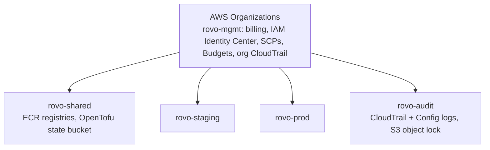
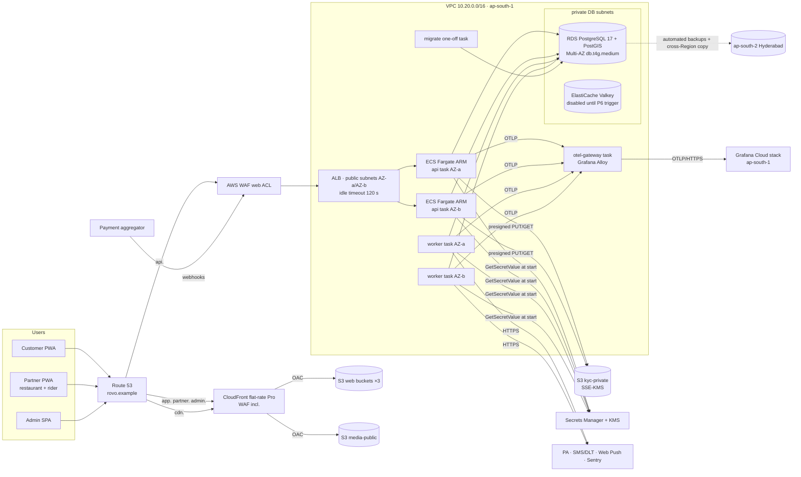
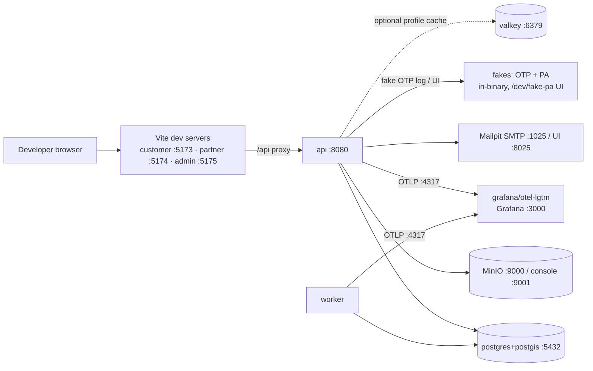

# 22 — Deployment Architecture

| | |
|---|---|
| **Purpose** | Define how rovo is deployed in every environment: the AWS production topology (network, compute, data, edge, secrets, IaC), staging as a scaled-down copy, local Docker Compose, and the free dev/preview stack. Covers the scaling path and cost. |
| **Owner** | DevOps Architect |
| **Status** | Draft v1 (aligned with baseline §4a user directive, 2026-10-04) |
| **Depends on** | `00-planning-baseline.md` §4a/P14–P17; `25-free-hosting-comparison.md` (cloud choice, prices `[Cn]`/`[Sn]`); `08-system-architecture.md` (runtime modules); `12-auth-rbac.md`, `19-security-threat-model.md` (controls); `14-payment-architecture.md` (webhooks); `17-frontend-architecture.md` (SPA build) |
| **Feeds** | `21-cicd-strategy.md`, `23-backup-disaster-recovery.md`, `24-observability-strategy.md`, `26-repository-structure.md` (`infra/`, `deploy/`), `29-production-readiness-checklist.md` |

> Prices quoted here come from `25` §15 (verified 2026-10-04, excl. GST, ₹95/USD [ASSUMPTION]). The domain is a placeholder, **`rovo.example`** [ASSUMPTION]; real domain [OPEN].

---

## 1. Environments

| Env | Where | Infra definition | Data | Payments / OTP | Who |
|---|---|---|---|---|---|
| **local** | Developer laptop | `deploy/compose/compose.yaml` | Seed + synthetic | **Fake** OTP + fake PA (in-binary adapters) | Devs |
| **ci** | GitHub Actions runners | Service containers / Compose | Ephemeral | Fakes | CI |
| **preview** (optional) | Oracle Always Free A1, Hyderabad (`25` §9) | Same Compose + `compose.preview.yaml` | Synthetic only | Fakes or PA **sandbox** | Stakeholders via Cloudflare Access |
| **staging** | AWS account `rovo-staging`, `ap-south-1` | OpenTofu `infra/envs/staging` | Synthetic + anonymised fixtures; **never prod PII** | PA **sandbox**, DLT test templates | Team, UAT testers |
| **production** | AWS account `rovo-prod`, `ap-south-1` (DR `ap-south-2`) | OpenTofu `infra/envs/prod` | Real | PA **live** | Customers |

The same **OCI image digests** flow local → CI → staging → production (P14). Only configuration differs (12-factor env vars + secrets).

---

## 2. AWS account & organisation layout



- **Humans** sign in through IAM Identity Center with MFA. Permission sets: `Admin` (2 people, break-glass), `Developer` (read + ECS Exec in staging only), `ReadOnly`, `Finance` (billing).
- **CI** uses GitHub OIDC → per-account IAM roles (`21` §6). There are no IAM users and no access keys.
- **SCPs:** deny leaving the org; deny regions other than `ap-south-1`, `ap-south-2`, `us-east-1` (the latter only for ACM certs used by CloudFront and global services); deny disabling CloudTrail/GuardDuty; deny public RDS.
- **ECR** lives in `rovo-shared`. Staging and prod pull through a cross-account repository policy, so promotion is by **digest**, with no rebuild.

---

## 3. Production topology



### 3.1 Hostnames

| Hostname | Served by | Origin | Notes |
|---|---|---|---|
| `app.rovo.example` | CloudFront | S3 `rovo-prod-web-customer` (OAC) | SPA fallback via CloudFront Function or custom error → `/index.html`; immutable hashed assets cached 1 y; `index.html` no-cache |
| `partner.rovo.example` | CloudFront | S3 `rovo-prod-web-partner` | Same |
| `admin.rovo.example` | CloudFront | S3 `rovo-prod-web-admin` | Plus WAF rule: admin API calls rate-limited harder; optional geo-restriction to IN [OPEN] |
| `cdn.rovo.example` | CloudFront | S3 `rovo-prod-media-public` | Menu and restaurant images; `Cache-Control: public, max-age=31536000, immutable` (content-hashed keys) |
| `api.rovo.example` | **ALB directly** (AWS WAF attached) | ECS `api` service | **Not behind CloudFront**: SSE is long-lived, and API volume (≈ 40M req/mo) would exceed the flat-rate Pro request allowance (10M) [C12] |

**One CloudFront flat-rate Pro plan** ($15/mo, 10M requests, 50 TB, WAF 25 rules [C12]) covers the three SPAs and `cdn.`. Plan assignment per distribution vs per account is **[OPEN] (verify at setup)**. If one plan covers only one distribution, put all four hostnames on **one distribution** with path/host behaviours, or use PAYG ($0.109/GB India [C14]).

### 3.2 DNS & TLS

- **Route 53** public hosted zone for `rovo.example`. Alias records go to CloudFront and the ALB. DNSSEC is enabled [OPEN: registrar support].
- **ACM** certificates: `*.rovo.example` in **us-east-1** (CloudFront requirement) and in **ap-south-1** (ALB), DNS-validated and auto-renewed.
- TLS policy: ALB `ELBSecurityPolicy-TLS13-1-2-2021-06` or newer [ASSUMPTION: current name]; CloudFront `TLSv1.2_2021`. HSTS (`max-age=31536000; includeSubDomains`) is set by the API and by a CloudFront response-headers policy.
- **Optional Cloudflare in front (not required by §4a).** Turn on the proxy for `api.` to get the free WAF/DDoS layer instead of AWS WAF (the "lean" variant in `25` §15.1). In that case the ALB SG allows only Cloudflare IP ranges plus a shared-secret origin header, and Cloudflare's 125 s proxy read timeout applies [S56]. That is fine with 20 s heartbeats.

### 3.3 SSE through the edge

| Hop | Timeout | Setting |
|---|---|---|
| Client ↔ ALB | ALB idle timeout default 60 s, range 1–4000 s [C9] | **120 s** |
| ALB ↔ task | same idle timer | app sends `: ping` comment every **20 s** |
| ALB HTTP client keepalive | default 3600 s [C9] | keep default (forces reconnect hourly → rebalances SSE across tasks) |
| App | `http.Server` `WriteTimeout` = 0 on SSE routes only; per-stream deadline 55 min; `retry: 3000` | Clients reconnect with `Last-Event-ID` |

---

## 4. Network

### 4.1 VPC layout (`ap-south-1`, 2 AZs; a 3rd AZ is reserved in the CIDR plan)

| Subnet tier | AZ-a | AZ-b | Contents | Route |
|---|---|---|---|---|
| public | 10.20.0.0/22 | 10.20.4.0/22 | ALB; **pilot: ECS tasks with public IPv4** | IGW |
| private-app | 10.20.16.0/20 | 10.20.32.0/20 | **10×: ECS tasks** | NAT GW per AZ |
| private-db | 10.20.64.0/24 | 10.20.65.0/24 | RDS, ElastiCache | none (no internet) |

- **S3 gateway VPC endpoint** on all route tables keeps image/KYC traffic off the internet and NAT. Gateway endpoints for S3 have no hourly charge [ASSUMPTION: AWS docs, not fetched in this pass].
- **VPC Flow Logs** go to S3 (rejects only) to keep cost low.

### 4.2 Security groups

| SG | Inbound | Outbound |
|---|---|---|
| `alb` | 443 from `0.0.0.0/0` (or Cloudflare ranges in lean variant); 80 → redirect | 8080 to `api` |
| `api` | 8080 from `alb` only | 5432 → `rds`; 6379 → `valkey`; 4317/4318 → `otel`; 443 → internet (PA, SMS, Sentry) |
| `worker` | **none** | same as api |
| `otel` | 4317/4318 from `api`, `worker` | 443 → Grafana Cloud |
| `rds` | 5432 from `api`, `worker`, `migrate`, `tools` | none |
| `valkey` | 6379 from `api`, `worker` | none |

### 4.3 Decision: no NAT Gateway at pilot [ASSUMPTION accepted, revisit at 10×]

A NAT Gateway costs $0.056/h + $0.056/GB [C24], about **$41/month per AZ**, which would be about 13–23% of the whole pilot bill. At pilot, ECS tasks run in **public subnets with `assignPublicIp=ENABLED`** ($0.005/h per IPv4 [C25]). Their SGs allow **no inbound except from the ALB SG** (the worker allows none). The DB stays in private subnets with no route to the internet, which satisfies §4a "private networking for DB/cache".
**Upgrade trigger:** a security review requires egress IP pinning (e.g. a PA or SMS provider requires IP allow-listing [OPEN, check with `14`/`15`]), or the move to 10× sizing. Then tasks move to `private-app` with a NAT per AZ, and the provider gets the NAT Elastic IPs.

### 4.4 Administrative access

- No bastion and no SSH. **ECS Exec** (SSM) into a dedicated `tools` task (psql, pgcli, `rovo admin` CLI) for break-glass. It is allowed only for the `Admin` permission set in prod and logged to CloudTrail + S3.
- DB GUI access goes through an SSM port-forward from the `tools` task.

---

## 5. Compute (ECS on Fargate, ARM64)

| Service | Launch | Size (pilot) | Count (pilot) | Scaling | Health | Notes |
|---|---|---|---|---|---|---|
| `api` | ECS service + ALB target group | 0.5 vCPU / 1 GB | 2 (one per AZ) | Target tracking: CPU 60%, ALB `RequestCountPerTarget`; min 2, max 6 | ALB → `/readyz` (DB ping + migrations at expected version); container `/livez` | Deployment circuit breaker with rollback; `minimumHealthyPercent=100`, `maximumPercent=200`; deregistration delay 30 s (SSE clients reconnect) |
| `worker` | ECS service, no LB | 0.25 vCPU / 0.5 GB | 2 | Manual / queue-depth alarm (River `available` jobs > 500 for 5 min → +1) | Container health cmd `rovo healthcheck --worker` (River client alive + DB ping) | `stopTimeout=120 s` so in-flight jobs finish. River's leader election runs periodic jobs once |
| `otel-gateway` | ECS service, Cloud Map DNS `otel.rovo.internal` | 0.25 vCPU / 0.5 GB | 1 | — | `:13133` health extension | Grafana Alloy: batching, PII-attribute scrubbing, tail sampling (`24`) |
| `migrate` | **One-off `RunTask`** from CI | 0.25 vCPU / 0.5 GB | 0 (ad hoc) | — | Exit code | `rovo migrate up` (goose). Gated (`21` §7) |
| `tools` | One-off / ECS Exec | 0.25 vCPU / 0.5 GB | 0 | — | — | Break-glass shell |

Container standards (P14):
- Distroless/static non-root image (UID 65532) with a read-only root filesystem.
- `SIGTERM` → graceful drain: stop accepting, close SSE with `retry`, finish requests within 25 s.
- Logs are JSON to stdout. The `awslogs` driver ships to CloudWatch with **3-day retention** (safety copy), while the OTel path goes to Grafana.
- ECR image scanning on push.
- Task **IAM roles** follow least privilege:
  - `api`: S3 media/kyc prefixes, `secretsmanager:GetSecretValue` on its own secrets, KMS decrypt on its keys.
  - `worker`: the same plus SES/SNS if used.
  - `execution role`: ECR pull + logs.

**Why ECS services and not Lambda/App Runner?** The worker needs continuous CPU (River timers), and SSE needs long-lived connections. App Runner is closed to new customers [C7]. ECS Express Mode [C7] may be used to bootstrap, but OpenTofu remains the source of truth.

---

## 6. Data tier

### 6.1 RDS for PostgreSQL

| Setting | Production | Staging |
|---|---|---|
| Engine | PostgreSQL **17.x**, PostGIS **3.5.x** (3.5.6 available [C5]) via migration `CREATE EXTENSION IF NOT EXISTS postgis` | same |
| Class | **db.t4g.medium Multi-AZ** ($0.167/h [C2]); lean: db.t4g.small MAZ | db.t4g.micro Single-AZ ($0.021/h [C2]) |
| Storage | gp3 50 GB, storage autoscaling to 200 GB, **encrypted with CMK `rds-prod`** | gp3 20 GB |
| Backups | Automated, **retention 14 days (PITR)**, window 21:30–22:00 UTC (03:00–03:30 IST); **cross-Region automated backup replication to `ap-south-2`, retention 7 days** [C6] | retention 3 days, no cross-region |
| Deletion protection | On; final snapshot on delete | On |
| Parameters | `rds.force_ssl=1`; `shared_preload_libraries=pg_stat_statements,auto_explain`; `log_min_duration_statement=500`; `idle_in_transaction_session_timeout=60s`; `statement_timeout` set per role | same |
| Auth | Master secret **managed by RDS in Secrets Manager** with rotation; app roles `rovo_app` (DML), `rovo_migrator` (DDL), `rovo_readonly` | same |
| Monitoring | Enhanced Monitoring 60 s; Performance Insights (free retention tier, **UNVERIFIED** price) | basic |
| Maintenance | Sun 22:00–23:00 UTC (Mon 03:30–04:30 IST, lowest order volume [ASSUMPTION]) | any |

**Connection budget:** `api` 2 × 15 + `worker` 2 × 10 (River) + `migrate` 2 + `tools` 2 + exporter 1 = **55**, which is far below t4g.medium's default `max_connections` [ASSUMPTION ≈ 400]. **No RDS Proxy:** River uses `LISTEN/NOTIFY`, which needs session-pinned connections, and the connection count is small.

### 6.2 Cache (P6)

An ElastiCache **Valkey** module exists in IaC with `enabled = false`. When it is turned on: `cache.t4g.micro` (pilot, $0.016/h [C4]) → `cache.t4g.small` primary + replica (10×), TLS + AUTH token from Secrets Manager, private-db subnets.

### 6.3 S3 buckets (all: Block Public Access ON, SSE, TLS-only bucket policy)

| Bucket | Encryption | Versioning | Lifecycle | Access |
|---|---|---|---|---|
| `rovo-prod-web-{customer,partner,admin}` | SSE-S3 | On | Noncurrent → delete 30 d | CloudFront OAC only |
| `rovo-prod-media-public` | SSE-S3 | On | Noncurrent → delete 90 d | CloudFront OAC; app writes via presigned PUT (size/MIME constrained) |
| `rovo-prod-kyc-private` | **SSE-KMS (CMK `kyc-prod`)** | On | Retention per `12`/DPDP policy [LEGAL]; noncurrent → delete 30 d | `api` role only; **presigned GET ≤ 5 min** for authorised admin reviewers; CloudTrail data events on |
| `rovo-prod-exports` | SSE-KMS | On | Expire 30 d | Finance exports |
| `rovo-prod-logs` | SSE-S3 | Off | Expire 90 d | ALB/CloudFront/Flow logs |
| `rovo-prod-backup-dumps` (see `23`) | SSE-KMS | On + **Object Lock (governance)** | 7 daily / 4 weekly / 6 monthly | Backup task only |

All buckets are in **ap-south-1** to keep data in India [LEGAL: DPDP]. CloudFront edge caches hold only public images and SPA assets.

---

## 7. Secrets & configuration

| Kind | Where | How it reaches the app |
|---|---|---|
| DB credentials | Secrets Manager (RDS-managed, rotated) | ECS task definition `secrets:` → env var at task start |
| App secrets (JWT signing keys, refresh-token pepper, PA key/secret, PA webhook secret, SMS/DLT keys, Web Push VAPID private key, Sentry DSN, Grafana OTLP token) | Secrets Manager `rovo/prod/<name>`, encrypted with CMK `secrets-prod` | ECS `secrets:` (by ARN + JSON key) |
| Non-secret config (`ROVO_ENV`, `CITY_DEFAULT`, feature flags, OTel endpoint, sampling ratio) | OpenTofu → task definition `environment:` | env vars |
| Local dev | `.env` (git-ignored) generated from `.env.example`; fakes need no real secrets | Compose `env_file` |
| Preview | `.env` on the VM (root 600), written by deploy job from GitHub **Environment** secrets | Compose `env_file` |

Rules:
- **Never commit secrets.** Gitleaks runs in CI (`21`).
- Secret changes roll the ECS service (new task picks up the value).
- JWT keys rotate with `kid` overlap (two active keys).
- Each env has its own PA/webhook secrets. Staging never holds live PA keys.

KMS CMKs per env: `rds`, `kyc`, `secrets`, `backups`. Key policies grant decrypt only to the matching task roles. Keys cost $1/month each [C8].

---

## 8. Deployment mechanics (summary; pipelines in `21`)

1. CI builds a multi-arch image → pushes to ECR (`rovo-shared`) with tag `sha-<git sha>` → signs it (cosign keyless, optional) → records the digest.
2. **Staging (on merge to `main`):** run the `migrate` task (expand-only migrations) → `aws ecs update-service` for `api` then `worker` with the new task-definition revision pinned to the **digest** → wait for steady state → smoke + synthetic order test.
3. **Production (on approved release tag):** the same digest goes through the same steps, behind the GitHub Environment `production` with required reviewers.
4. **Rolling update** with circuit breaker auto-rollback. SSE clients reconnect transparently.
5. **Expand/contract migrations:** a release only adds (columns nullable/defaulted, new tables, `CREATE INDEX CONCURRENTLY`). Destructive "contract" migrations ship ≥ 1 release later, after code no longer reads the old shape. This makes app rollback safe without DB rollback.
6. **Rollback:** redeploy the previous task-definition revision (`21` §8). DB down-migrations are used only for failed expand steps in staging. Prod data issues use PITR (`23`).
7. **Frontends:** `aws s3 sync` hashed assets (immutable) → upload `index.html` + `sw.js` last (no-cache) → CloudFront invalidation of `/index.html`, `/sw.js` and `/manifest.webmanifest` only.

Blue/green (CodeDeploy) is deferred: rolling + circuit breaker + backward-compatible migrations is enough at pilot.

---

## 9. Staging

- Separate AWS account `rovo-staging`, **same OpenTofu modules** with `envs/staging/terraform.tfvars` overrides: 1 `api` + 1 `worker` task, db.t4g.micro Single-AZ, no cross-region backup, CloudFront Free flat-rate plan [C12] (or PAYG), AWS WAF with only a managed common rule set.
- **Scheduled scale-down:** EventBridge Scheduler sets ECS desired = 0 and stops RDS 21:00–07:00 IST and at weekends. Staging must be **started before UAT**, and RDS auto-starts after 7 days stopped [ASSUMPTION: RDS behaviour]. Cost is ≈ $40–64/month (`25` §15.1).
- **Data:** synthetic seed + anonymised fixtures. No production restore into staging unless it has been through the anonymisation pipeline [LEGAL: DPDP purpose limitation].
- **Integrations:** PA sandbox, SMS in test mode (or fake), Web Push to test devices.
- **Access:** SPAs are public, but the API requires login. An optional WAF IP set restricts `admin.staging` to team IPs [OPEN].

---

## 10. Local development (Docker Compose)



| Service | Image | Notes |
|---|---|---|
| `postgres` | **`ghcr.io/<org>/rovo-postgres:17-3.5`** built from `postgres:17` + PGDG `postgresql-17-postgis-3` (multi-arch). The official `postgis/postgis` is amd64-only [S83] | Matches RDS major versions; init script creates roles mirroring prod |
| `migrate` | `rovo` image, `migrate up` | Runs before api/worker (`depends_on: condition: service_completed_successfully`) |
| `api`, `worker` | `rovo` image, or `go run` with Air for hot reload | Same binary, different mode |
| `minio` + `minio-init` | MinIO + `mc` | Creates buckets mirroring prod names; the S3 adapter talks to MinIO via endpoint override |
| `mailpit` | Mailpit | Captures email |
| fakes | Built into the binary behind `ROVO_OTP_PROVIDER=fake`, `ROVO_PA_PROVIDER=fake` | Fake PA exposes a page to simulate success/failure/webhook replay |
| `lgtm` | `grafana/otel-lgtm` | Loki + Grafana + Tempo + Mimir/Prometheus in one container; dashboards provisioned from `deploy/observability/` |
| `valkey` | `valkey/valkey` | `profiles: [cache]` |

`make up` / `make down` / `make seed` / `make e2e`. The whole golden flow must work **offline** (§4a).

---

## 11. Dev/preview environment (free tier)

The free preview stack is defined in `25` §9: Oracle Always Free A1 (Hyderabad), the same Compose + `compose.preview.yaml`, Cloudflare Tunnel + Access, Workers Static Assets.

VM hardening (preview only):
- Ubuntu LTS minimal; `unattended-upgrades` for security updates.
- SSH key-only, `PermitRootLogin no`, SSH reachable **only via Cloudflare Access / Oracle Bastion**; Oracle security list has **no ingress** (Tunnel is outbound-only [S58]).
- `ufw default deny incoming`; fail2ban (defence in depth); Docker rootless or userns-remap; containers non-root.
- Resource limits in Compose: postgres 3 GB, api 1 GB, worker 512 MB, minio 512 MB, lgtm 2 GB, cloudflared 128 MB. That is ≈ 7.2 GB of 12 GB.
- **Oracle idle-reclaim guard:** RAM use above 20% keeps the instance non-idle by design [S1].

---

## 12. Infrastructure as Code layout (OpenTofu; Terraform-compatible)

```
infra/
├── modules/
│   ├── network/            # VPC, subnets, IGW, (NAT toggle), S3 gateway endpoint, flow logs
│   ├── ecr/                # repos + cross-account pull policy + lifecycle (keep last 50 + all release tags)
│   ├── ecs-cluster/        # cluster, Cloud Map namespace, capacity providers (FARGATE, FARGATE_SPOT for staging)
│   ├── ecs-service/        # generic service: task def, IAM roles, SG, autoscaling, alarms, LB attachment (optional)
│   ├── ecs-oneoff-task/    # migrate/tools task definitions
│   ├── alb/                # ALB, listeners, TLS policy, idle timeout, access logs
│   ├── waf/                # web ACL: AWS managed common/known-bad-inputs/IP reputation, rate rules, webhook allow
│   ├── rds-postgres/       # instance, param group, subnet group, KMS, secrets, cross-region backup replication
│   ├── elasticache-valkey/ # enabled=false by default
│   ├── s3-bucket/          # opinionated secure bucket (BPA, TLS-only, SSE, versioning, lifecycle, object lock opt.)
│   ├── cloudfront-spa/     # distribution + OAC + SPA rewrite function + headers policy
│   ├── cloudfront-media/
│   ├── kms/
│   ├── secrets/            # secret shells only (values set out-of-band or by rotation)
│   ├── github-oidc/        # IAM OIDC provider + roles (plan-only, apply, deploy) per env
│   ├── dns/                # Route 53 zone/records, ACM certs (ap-south-1 + us-east-1)
│   ├── observability/      # CloudWatch alarms (last-resort), SNS → email/Telegram webhook, log groups
│   └── budgets/            # AWS Budgets + cost anomaly alerts
├── envs/
│   ├── shared/             # ECR, state bucket (bootstrap)
│   ├── staging/            # main.tf, terraform.tfvars, backend.tf
│   └── prod/
└── policies/               # OPA/conftest or Checkov config for plan checks
```

- **State:** S3 bucket in `rovo-shared` (versioned, SSE-KMS) with locking (DynamoDB table or the S3-native lockfile, depending on the OpenTofu version in use [ASSUMPTION]). One state per env.
- **No secret values in state where avoidable.** Secrets are created as shells, and values are set via console/CLI by `Admin` or generated by RDS rotation.
- **Drift detection:** a nightly `tofu plan -detailed-exitcode` on prod (`21` §9).

---

## 13. Resource allocation summary

| Component | Pilot prod | Staging | 10× prod |
|---|---|---|---|
| `api` | 2 × 0.5 vCPU / 1 GB ARM | 1 × 0.25 / 0.5 | 4 × 1 vCPU / 2 GB |
| `worker` | 2 × 0.25 / 0.5 | 1 × 0.25 / 0.5 | 2 × 0.5 / 1 |
| `otel-gateway` | 1 × 0.25 / 0.5 | shared with staging app (1 × 0.25 / 0.5) | 2 × 0.5 / 1 |
| RDS | t4g.medium MAZ, 50 GB | t4g.micro SAZ, 20 GB | m7g.large MAZ, 200 GB (+ read replica optional) |
| Valkey | off | off | 2 × t4g.small |
| NAT | none | none | 1 per AZ |

---

## 14. Scaling path

| Stage | Trigger (any) | Change |
|---|---|---|
| S0 Pilot | — | As above |
| S1 Vertical DB | RDS CPU > 60% p95 at peak, CPU credits < 20%, or p95 query > 50 ms | t4g.medium → t4g.large → m7g.large (Multi-AZ failover-based resize, ≈ 1–2 min blip) |
| S2 Horizontal API | api CPU > 60% sustained, or > 3k SSE per task | Autoscale api to 4–6 tasks. **Enable Valkey** if rate limits/SSE fan-out must be shared beyond Postgres `LISTEN/NOTIFY` (P6) |
| S3 Network hardening | Egress IP allow-listing needed, or 10× | Private-app subnets + NAT per AZ |
| S4 Read scaling | Admin/reporting queries > 20% of DB load | RDS read replica; route `rovo_readonly` there |
| S5 Multi-city | 2nd city launch | Same region; config/data only (multi-city-ready schema) |
| S6 Kubernetes | **Only if** ≥ 3 of: > 10 independently deployed services; need for operators/CRDs (e.g. Kafka, Flink); multi-team platform with namespaces/quotas; > 50 tasks where bin-packing savings > ops cost; a requirement for a service mesh | EKS with the same images; Helm charts generated from task definitions. **Readiness kept now:** stateless api, separate worker, migrations as job, health/readiness probes, 12-factor config, OTel, no host-local state |

---

## 15. Cost table (from `25` §15; excl. GST)

| Environment | ≈ USD/month | ≈ INR/month |
|---|---|---|
| Production pilot, lean | 178 | 16,900 |
| Production pilot, recommended | 320 | 30,600 |
| Staging (scheduled down / always on) | 40 / 64 | 3,800 / 6,100 |
| Preview (Oracle free) | 0 | 0 |
| CI (public repo) | 0 | 0 |
| **Total recommended (prod + staging scheduled)** | **≈ 360** | **≈ ₹34,200** (+18% GST ≈ ₹40,400) |
| Production at 10× (on-demand) | ≈ 1,415 | ≈ 1.34 lakh |

AWS Budgets: monthly budget at ₹40k with alerts at 50/80/100% + Cost Anomaly Detection → email + Telegram (`24`).

---

## 16. Security baseline checklist (deployment-level; threat model in `19`)

- [ ] CloudTrail org trail → `rovo-audit` S3 with Object Lock; GuardDuty on (cost **UNVERIFIED**; enable at least in prod).
- [ ] IAM Identity Center + MFA; no IAM users/keys; SCP region lock.
- [ ] RDS: not public, SSL forced, CMK encryption, deletion protection, PITR 14 d, cross-region backups.
- [ ] S3: Block Public Access at account level; OAC only; KYC SSE-KMS + CloudTrail data events.
- [ ] WAF: AWS managed rules + rate rules (OTP send, login, order create), webhook paths exempted from bot rules but restricted by PA signature in-app.
- [ ] ECS: non-root, read-only rootfs, no privileged, ECR scan on push, task roles least-privilege, ECS Exec prod-admin-only.
- [ ] Secrets in Secrets Manager; rotation for DB; no secrets in env files committed or in Terraform vars.
- [ ] Budgets + anomaly detection on.
