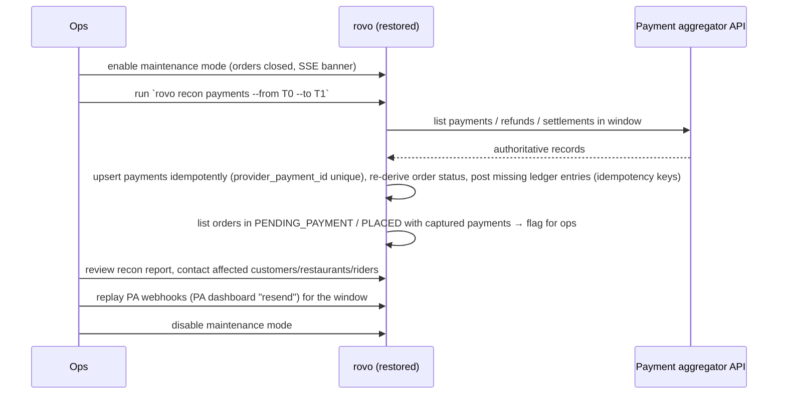

# 23 — Backup & Disaster Recovery

| | |
|---|---|
| **Purpose** | Set RPO/RTO targets and define backups (database, object storage, configuration, secrets), immutability, restore drills and DR runbooks for rovo on AWS (`ap-south-1` primary, `ap-south-2` DR). Also covers payment reconciliation after a restore and DPDP considerations. |
| **Owner** | DevOps Architect |
| **Status** | Draft v1.1 — reconciled with review (31) and rulings R1–R54, 2026-10-04 |
| **Depends on** | `22-deployment-architecture.md` (accounts, RDS, S3, KMS); `14-payment-architecture.md` (PA as source of truth, ledger); `10-database-schema.md` (tables, retention); `12-auth-rbac.md`/`19-security-threat-model.md` (ransomware, insider); `24-observability-strategy.md` (backup alerts); `25` (verified prices `[Cn]`; **§15 single source of cost**, R46) |
| **Feeds** | `01-product-requirements.md` (NFR-AVAIL RPO/RTO), `29-production-readiness-checklist.md`, `30-risks-assumptions-decisions.md` |

**Changes in v1.1**
- Targets are split by IaC profile (R32). `closed-pilot` runs RDS **Single-AZ** with PITR + cross-Region automated backups. `public-launch` runs Multi-AZ, mandatory before Gate B or > 100 orders/day.
- **C10:** DR pre-provisioning in `ap-south-2` (ECR replication, Secrets Manager replicas, multi-Region KMS keys, ALB certificate) and region game days are **deferred until after Gate B**. Kept: cross-Region backups, CRR of KYC/media/dumps, IaC, documented restore. The region-outage RTO is relaxed for the closed pilot accordingly.
- **R50 restore cadence:** weekly automated restore-and-verify (once cloud exists), a monthly timed manual drill against the runbook, and a quarterly cross-Region restore after Gate B (§7).
- **RV-074:** the DR-4 "stand up on GCP in 8 h" claim is dropped. Rebuilding on another cloud takes weeks.
- **C18:** 4 accounts (`rovo-mgmt`, `rovo-prod`, `rovo-nonprod`, `rovo-audit` = audit/backup). IaC paths are `deploy/terraform/` (R23).
- WhatsApp OTP fallback removed (C2). Erasure ledger = `erasure_requests` table (doc 10, M4/M15). Oracle preview text removed (R24). Cost lines moved to `25` §15 (R46).

---

## 1. Targets

| Scenario | RPO (max data loss) | RTO (time to restore service) | Mechanism |
|---|---|---|---|
| Single task/instance failure | 0 | < 2 min | ECS replaces tasks (`closed-pilot`: 2 api across 2 AZs + 1 worker; `public-launch`: 2 + 2) |
| **AZ failure, `closed-pilot`** (Single-AZ DB, allowed by NFR-AVAIL-003 / R32) | **≤ 5 min** (PITR latest restorable time [ASSUMPTION ≈ 5 min]) | **≤ 2 h** (restore to a new instance in the healthy AZ, repoint the secret, restart; or wait for AZ recovery if AWS ETA is shorter) | DR-1b |
| **AZ failure, `public-launch`** (Multi-AZ) | **0** (synchronous standby) | **1–3 min** (Multi-AZ failover [ASSUMPTION: AWS typical]) | RDS Multi-AZ DB instance (DR-1a) |
| **Logical corruption / accidental delete / bad migration** | **≤ 5 min** before the incident (PITR granularity) | **≤ 2 h** | RDS PITR to a new instance + selective repair or cut-over |
| **Region outage (Mumbai), before Gate B** | **≤ 30 min** [ASSUMPTION: cross-Region backup replication lag; measured in drills] | **≤ 8 h, best effort** — nothing is pre-provisioned in `ap-south-2` (C10), so everything is built by IaC at DR time, and provider secrets are re-entered from the break-glass vault | Cross-Region automated backups to Hyderabad [C6] + IaC rebuild (DR-3) |
| **Region outage, after Gate B** (DR pre-provisioning done, first game day passed) | ≤ 30 min | **≤ 4 h** | Same, with ECR replica, secret replicas, MRKs, ALB cert pre-provisioned |
| **AWS account compromise / suspension** | **≤ 24 h** (nightly logical dump) | **≤ 8 h** in a new AWS account in the same organisation [ASSUMPTION; untested until a drill] | Object-Locked dumps in the separate `rovo-audit` account; rebuild in a clean account (DR-4) |
| **Whole AWS organisation unavailable** | ≤ 24 h | **Weeks**, not hours (RV-074): there is no GCP IaC and no rehearsal. The app is portable; the infrastructure is not | L4 dump + images (GHCR mirror) |
| Observability vendor outage | n/a (telemetry loss tolerated) | n/a | CloudWatch last-resort alarms and the CERT-In archive stay in AWS (`24`) |

These targets are **pilot targets**. Doc 01 NFR-AVAIL should reference this table rather than restate it (register row 70). They are reviewed when orders exceed 5,000/day, and possibly tightened with an RDS cross-Region **read replica** in Hyderabad (RPO seconds, RTO < 1 h) at extra cost.

---

## 2. What must be protected

| Asset | Criticality | Primary copy | Backup copies |
|---|---|---|---|
| PostgreSQL (orders, ledger, users, zones, audit log) | **Critical** | RDS `ap-south-1` (Single-AZ `closed-pilot` → Multi-AZ `public-launch`) | PITR 14 d; cross-Region automated backups 7 d (`ap-south-2`); manual snapshots; nightly logical dumps (Object Lock, separate account, both India regions) |
| KYC documents (S3 `kyc-private`) | **Critical + sensitive** [LEGAL] | S3 `ap-south-1`, versioned, SSE-KMS | S3 Cross-Region Replication → `ap-south-2` bucket in `rovo-audit` (versioned, Object Lock governance), encrypted with a regional CMK in `ap-south-2` |
| Public media (menu/restaurant images) | Medium (re-uploadable) | S3 `media-public`, versioned | CRR → `ap-south-2` (cheap; avoids re-onboarding 50 restaurants) |
| SPA builds | Low | S3 web buckets | Rebuildable from git tag |
| Container images | Medium | ECR in `rovo-prod` (`ap-south-1`) | **GHCR public mirror** (same multi-arch digest). ECR cross-Region replication → `ap-south-2` is **deferred until after Gate B (C10)** |
| IaC + app code | Critical | GitHub | Weekly mirror to a second git host [OPEN: Codeberg/GitLab]; every developer clone |
| OpenTofu state | High | S3 (versioned) in each workload account | CRR → `ap-south-2` (cheap; kept) |
| Secrets (PA keys, webhook secrets, JWT keys, DLT/SMS keys, origin-verify secret) | Critical | Secrets Manager (`ap-south-1`) | Secrets Manager multi-Region replicas → `ap-south-2` **deferred until after Gate B (C10)**. Until then: a break-glass offline copy of *provider-issued* secrets in a shared password-manager vault owned by 2 founders |
| KMS keys | Critical | KMS | Regional CMKs in `ap-south-2` (in `rovo-audit`) encrypt the CRR and backup replicas there. **Multi-Region keys are deferred until after Gate B (C10).** JWT keys are regenerated on region failover (users re-login) |
| Dashboards/alerts | Low | Grafana Cloud | As code in git (`deploy/observability/`) |

---

## 3. PostgreSQL backup design

### 3.1 Layers

| Layer | What | Retention | Purpose |
|---|---|---|---|
| L1 | **RDS automated backups** (daily snapshot + transaction logs) → **PITR** | **14 days** | Any-second restore within window |
| L2 | **Cross-Region automated backup replication** Mumbai → Hyderabad (supported for Single-AZ and Multi-AZ DB instances [C6]); on in both profiles (R32) | **7 days** | Region loss; PITR in DR region |
| L3 | **Manual snapshots**: before each release with migrations (`pre-vX.Y.Z`) and monthly (`monthly-YYYY-MM`), copied to `ap-south-2` | pre-release 30 d; monthly **6 months** | Long-horizon restore, audits |
| L4 | **Logical dump**: nightly `pg_dump -Fc --no-owner` (plus `pg_dumpall --globals-only` without passwords) from a scheduled ECS task (EventBridge Scheduler 03:15 IST) → S3 `rovo-audit/backup-dumps-aps1` (**Object Lock, compliance mode**) with **S3 CRR → `ap-south-2`** | **7 daily / 4 weekly / 6 monthly** (lifecycle by prefix) | Provider-independent (restorable on GCP/any PG 17 + PostGIS), protects against account-level loss and snapshot-level issues; enables single-table restore |

- **Encryption:** RDS/snapshots use CMK `rds`. Cross-Region copies are re-encrypted with the DR-region key (no MRK until after Gate B, C10). Dumps are encrypted client-side with **age** (recipient key; private key offline with 2 custodians) **and** server-side SSE-KMS (`backups` key; the regional key in `ap-south-2` for replicas). Two independent keys mean S3/KMS compromise alone cannot read dumps.
- **Integrity:** each dump has a SHA-256 manifest. The dump job runs `pg_restore --list` as a sanity check and records size, row counts of key tables and the duration as metrics (`24`: alert "backup failed / not run in 26 h / size −30% vs 7-day median").
- **Separate account:** the dump bucket lives in `rovo-audit`. The prod backup task role can **only `PutObject`** (no delete/overwrite; Object Lock blocks it anyway). Nobody in `rovo-prod` can shorten retention.

### 3.2 Cost

The backup and DR lines (L2 cross-Region copies, L3 snapshots, L4 dumps, CRR replicas, and the deferred DR pre-provisioning at ≈ $7/month once enabled) are costed in **`25` §15.1 and §15.5**, the single source of cost (R46). At pilot scale they are a few dollars a month.

---

## 4. Object storage protection

- **Versioning** on all data buckets (`22` §6.3). Lifecycle: noncurrent versions expire after 30 d (KYC), 90 d (media).
- **S3 CRR** for `kyc-private` and `media-public` → `ap-south-2` buckets in `rovo-audit`, with replica-modification sync off and **delete-marker replication OFF**, so deletes in prod do not propagate.
- **KYC deletion workflow:** KYC retention/erasure (DPDP [LEGAL]) is executed by an app job that deletes current + noncurrent versions in prod. The DR replica gets a matching **erasure manifest** that a scheduled job in `rovo-audit` applies, so erasure is honoured everywhere within 30 days [LEGAL: confirm acceptable window].
- **Bucket policies** deny `s3:DeleteObjectVersion` and `s3:PutLifecycleConfiguration` to every principal except the `BackupAdmin` permission set (MFA required).

---

## 5. Ransomware / malicious-insider considerations

| Threat | Control |
|---|---|
| Attacker with prod admin deletes RDS + snapshots | RDS deletion protection; SCP denies `rds:DeleteDBSnapshot` outside `BackupAdmin`; **L4 dumps in a separate account with Object Lock compliance mode** cannot be deleted before expiry by anyone, root included |
| Attacker encrypts/overwrites S3 objects | Versioning + CRR to the audit account (no delete-marker replication) + Object Lock on backup buckets |
| Attacker deletes KMS keys | KMS deletion has a mandatory waiting period (set **30 days**); alarm on `ScheduleKeyDeletion` (`24`) |
| Compromised CI | OIDC roles cannot touch backups or KMS key policies; infra apply needs 2 approvals (`21` §7.3) |
| Account suspended by provider (billing/abuse) | Billing via card + backup payment method; Budgets alerts; `rovo-audit` owned by the same org but with an independent root email + MFA; worst case: rebuild from L4 dumps (portable) in a new account, or on another cloud in **weeks** (RV-074) |

---

## 6. Payment provider as source of truth after restore

Any restore that loses data (PITR point < incident time, region failover with replication lag, dump restore) creates a **reconciliation window** `[restore_point − 15 min, cutover_time]`.

- **COD and rider cash:** cash collections recorded in the window may be lost from the DB. The rider PWA keeps an **outbox of submitted COD confirmations** (IndexedDB) and re-submits on reconnect/sync (`18`). Ops also runs a **cash-in-hand attestation** with riders for the window.
- **Restaurant payouts:** payouts are manual in V1 (`14`). The payout register (bank/UPI references) is re-entered from bank statements for the window.
- **Comms:** template messages for customers whose orders are affected (refund/cancel), plus a restaurant partner notice.
- Requirement for `14`/`10`: every payment/ledger write is **idempotent on the provider's IDs**. That makes reconciliation a replay, not a merge.

---

## 7. Restore drills

Cadence per **R50** and **C10**. Before AWS exists (local-only development), D2 runs against a local PG 17 + PostGIS container in CI using a synthetic dump.

| Drill | Frequency | Procedure (scripted in `deploy/dr/`) | Success criteria |
|---|---|---|---|
| **D0 Automated restore-and-verify** (R50) | **Weekly, automated** (`21` §9, once staging/prod exist). Shared with doc 20 §15.3 | Restore the latest backup into an **ephemeral** instance in `rovo-nonprod`. Alternate between the latest RDS snapshot/PITR and the latest L4 dump. Run the verification SQL (row counts vs prod metrics, `SELECT postgis_full_version()`, ledger balance invariants, latest order timestamp, erasure replay). Record duration. **Destroy** | Invariants pass; duration recorded; alert A16 on failure |
| **D1 Timed manual DR drill** (R50) | **Monthly**, rotating the runbook: DR-2 PITR cut-over, DR-1b single-AZ restore, D2 L4 dump restore (age decrypt by a key custodian) | An operator follows the written runbook step by step against a clone in `rovo-nonprod`, with a timer | Restore ≤ 60 min (PITR) / ≤ 90 min (dump); runbook gaps fixed |
| **D3 Cross-Region restore** (R50) | **Quarterly, from Gate B onwards** (C10). Before Gate B, the weekly D0 restores from the `ap-south-2` replicated automated backup once a month, which proves L2 works without a game day | Restore the replicated backup in `ap-south-2` and run verification | Restore succeeds; replication lag measured (RPO evidence) |
| **D3b Region failover game day** | **After Gate B** (C10): once after DR pre-provisioning, then semi-annual (RV-071), in staging | Execute DR-3 end-to-end in `ap-south-2`, including repointing `origin-api.*staging*` | RTO ≤ 4 h measured |
| **D4 App rollback** | Monthly in staging (automated) | `ecs-rollback.sh` | ≤ 10 min |
| **D5 Payment reconciliation** | Once before Gate A, then semi-annual, in staging with PA sandbox | Delete the last 30 min of payments in a staging clone → run §6 → compare | 100% of sandbox payments reconciled |
| **D6 KYC object restore** | Semi-annual | Restore a deleted object version + read from the CRR replica | Object retrievable; access logged |

Drill output (date, operator, timings, issues) goes into `docs/ops/drills/YYYY-MM.md` (Phase 2) and as a Grafana annotation. If a drill misses its target, the gap is fixed before the next release.

**Privacy rule for drills:** prod data restored for drills stays in the `rovo-nonprod` account **only for the drill's duration** (auto-destroy ≤ 6 h). Access is limited to the drill operator. It is never used for testing features [LEGAL: DPDP purpose limitation].

---

## 8. DR runbooks (summaries; full step-by-step scripts in Phase 2)

### DR-1a AZ failure (`public-launch`, Multi-AZ)
Automatic: RDS Multi-AZ failover, ECS reschedules tasks in the healthy AZ, ALB stops routing to the unhealthy AZ.
Manual: confirm in dashboards; if ECS capacity is short in the remaining AZ, temporarily raise desired count. If the lost AZ hosted the single NAT/interface endpoints (R28), tasks lose provider egress: switch on the COD-only flag if the PA is unreachable, and apply the IaC variable that moves the NAT/endpoints to the healthy AZ (≈ 10 min).

### DR-1b AZ failure (`closed-pilot`, Single-AZ DB)
1. If the DB's AZ is impaired and AWS gives no short ETA (> 30 min), enable maintenance mode.
2. `aws rds restore-db-instance-to-point-in-time --use-latest-restorable-time` into the healthy AZ's subnet → repoint the `DATABASE_URL` secret → restart services.
3. Run §6 reconciliation for the gap (≤ 5 min). Target RTO ≤ 2 h.

### DR-2 Logical corruption / accidental delete / bad migration
1. Declare an incident (`24` on-call). Enable **maintenance mode** if writes would compound the damage.
2. Identify T_bad from audit log / CloudTrail / app logs.
3. `aws rds restore-db-instance-to-point-in-time --restore-time <T_bad − 1 min>` → `rovo-prod-pitr-<ts>` (same subnet group/SG, Single-AZ).
4. Decide:
   - **(a) Selective repair:** copy the affected rows/tables from the PITR instance into prod (`postgres_fdw` or dump/restore of specific tables) inside a transaction, with a reviewed script.
   - **(b) Full cut-over:** point the `DATABASE_URL` secret at the restored instance (enable Multi-AZ on it first in `public-launch`), restart services, then run §6 reconciliation for the gap.
5. Keep the old instance for 7 days (forensics), then delete with a final snapshot.

### DR-3 Region outage (Mumbai → Hyderabad)
**Before Gate B (C10):** only the S3 CRR buckets and replica keys (in `rovo-audit`) and the replicated automated backups exist in `ap-south-2`. Everything else is created by IaC at DR time. Images are pulled from the GHCR mirror by digest (or pushed by CI to a new `ap-south-2` ECR repo). Provider secrets are re-entered from the break-glass vault, and JWT keys are regenerated. **After Gate B:** pre-provision VPC + subnets + SGs (IaC, $0), ECR replica, Secrets replicas, KMS MRKs and the ACM cert for the ALB (cost `25` §15.5).
1. Decide failover (Mumbai down > 30 min with no AWS ETA, or AWS Health confirms a regional event). Decision by: on-call + 1 founder.
2. `aws rds restore-db-instance-to-point-in-time --source-db-instance-automated-backups-arn <replicated ARN> --use-latest-restorable-time` in `ap-south-2` → enable Multi-AZ later.
3. `tofu apply -var-file=profiles/closed-pilot.tfvars -var region=ap-south-2 -var dr_mode=true` in `deploy/terraform/envs/prod` with a separate DR state key (VPC, ECS cluster, services pinned to the release digest, ALB, CloudFront origin change).
4. Point app config at the DR S3 replica buckets (KYC, media) via `ROVO_S3_*` vars, and switch the CloudFront `/media/*` origin to the DR media bucket.
5. Route 53: repoint `origin-api.` (the CloudFront `/api/*` origin, TTL 60 s pre-set) to the DR ALB. The ALB uses the same CloudFront prefix-list SG and origin-verify secret. The public hostnames do not change, because CloudFront is global. If Mumbai S3 is down, CI re-syncs the SPA builds of the release tag to a DR web bucket and the default behaviour's origin is switched [OPEN: CloudFront origin groups at setup].
6. Run §6 reconciliation for the replication-lag window. Announce to partners.
7. **Fail-back** later: logical dump/restore or RDS cross-Region backup in the other direction (Hyderabad → Mumbai supported [C6]), in a planned window.

### DR-4 AWS account compromise or suspension
1. Contain: Identity Center session revocation, root credential rotation, SCP deny-all on `rovo-prod` (from `rovo-mgmt`).
2. If `rovo-prod` is unusable: create a new prod account (`rovo-prod-2`) from Organizations → `tofu apply` → restore the **L4 dump** from `rovo-audit` (Object Lock guarantees integrity) → restore KYC from the CRR replica → DNS cut-over.
3. If the whole AWS organisation is unavailable: rebuild on the **GCP alternative** (Cloud Run + Cloud SQL, `25` §16) from the same images (GHCR mirror) and the L4 dump. This is **a matter of weeks, not hours**: there is no GCP IaC, no tested GCS adapter and no rehearsal (RV-074). A one-off GCP restore rehearsal is optional before scaling beyond one city. A copy of the latest weekly dump may also be exported to a non-AWS store in India for this case [OPEN: cost ≈ $0; residency [LEGAL]].

### DR-5 Ransomware / mass deletion
Treat as DR-4 + DR-2: assume prod credentials are compromised, restore from immutable L4 / CRR versions, rotate all secrets (PA keys via the PA dashboard, JWT keys → force re-login), and notify per DPDP breach rules [LEGAL].

### DR-6 Third-party outages (non-AWS)
PA down: COD-only mode flag (`14`). SMS/OTP provider down: secondary SMS aggregator (`15`; WhatsApp OTP is cut, C2). Grafana Cloud down: CloudWatch last-resort alarms and the CERT-In archive (`24`).

---

## 9. Data-protection (DPDP) notes [LEGAL]

- Backups contain personal data. Retention of backups (max 6 months for monthly dumps) must align with the retention schedule in `10`/`12` and the privacy notice.
- **Erasure requests vs immutable backups:** the platform keeps an **erasure ledger**, the `erasure_requests` table in doc 10 (user IDs + timestamp, no PII; M4), driven by the per-table/bucket erasure map (M15). Any restore **replays the erasure ledger** before the restored DB serves traffic. Object-Locked dumps expire naturally within ≤ 6 months. Confirm with counsel that this is acceptable.
- All backup copies stay in **India regions** (`ap-south-1`, `ap-south-2`). The optional non-AWS emergency copy (DR-4 step 3) must also be in India, or be approved by counsel.
- Access to backups is logged (CloudTrail data events on dump buckets) and reviewed quarterly.

---

## 10. Dev/preview & local

- **Dev/demo:** local Docker Compose only (R24). Synthetic data, rebuilt from seed, so no backups are needed. There is no cloud preview environment.
- **Local:** `make db-dump` / `make db-restore` helpers. Developers **never** pull prod dumps.
