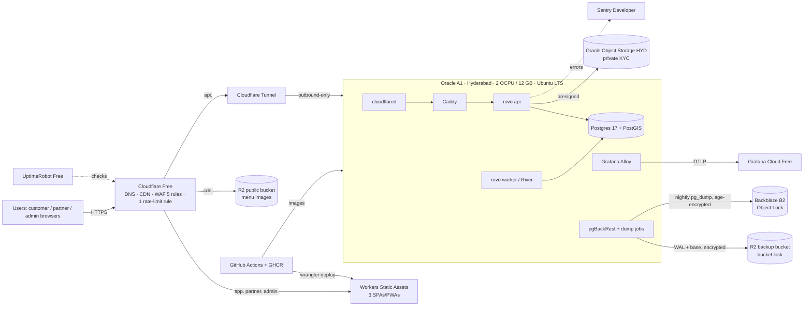

# 25 — Free Hosting Comparison & Recommendation

| | |
|---|---|
| **Purpose** | Check the current (2026-10-04) free tiers for every hosting layer rovo needs, cite each one, score the options, and recommend a **primary** stack, a **fallback** stack and a **first paid step** stack, with a capacity check against V1 load. |
| **Owner** | DevOps Architect |
| **Status** | Draft v1 |
| **Depends on** | `00-planning-baseline.md` (P4–P6, P14–P17), `08-system-architecture.md` (runtime topology), `10-database-schema.md` (data volume drivers), `14-payment-architecture.md` (webhooks), `17-frontend-architecture.md` (static SPA/PWA build output) |
| **Feeds** | `21-cicd-strategy.md`, `22-deployment-architecture.md`, `23-backup-disaster-recovery.md`, `24-observability-strategy.md`, `29-production-readiness-checklist.md`, `30-risks-assumptions-decisions.md` |

> **How to read citations.** `[Sn]` points to the source list in §11. Every source was fetched (or, where marked *search*, seen only in a search result) on **2026-10-04**. Free tiers change often and sometimes without notice (see the Oracle change in §2.1). **Check every number again on the day an account is created**, and again each quarter (§9.4).
> Anything I could not confirm from a primary source is labelled **UNVERIFIED**.

---

## 0. Executive summary

1. **Always-on compute is the deciding constraint.** rovo's `worker` runs River timers (45 s rider-offer expiry, 3-min restaurant-accept timeout), and the `api` keeps SSE connections open. Any platform that sleeps, scales to zero or throttles CPU between requests fails the golden flow. That rules out Render Free (spins down after 15 min [S12]), Koyeb Free (scales to zero after 1 h, Frankfurt/Washington only [S13]), Neon Free (compute suspends after 5 min and this "cannot be turned off" [S35]) and Cloud Run with request-based billing (CPU "only allocated during request processing" [S10]).
2. **Oracle Cloud Always Free is still the only realistic $0, always-on, India-region VM, but it is now smaller.** Oracle's own docs give A1 Always Free as **1,500 OCPU-h + 9,000 GB-h per month, equal to 2 OCPU / 12 GB** for Always Free tenancies [S1]. That is half the old 4 OCPU / 24 GB. InfoQ reports the cut took effect on 2026-06-15 without announcement [S6]. Oracle's machine-readable price list (updated 2026-10-01) still shows the A1 free band as 0–3,000 OCPU-h and 0–18,000 GB-h [S4], so **whether Pay-As-You-Go tenancies keep 4/24 is [OPEN]**. Oracle has India regions in **Hyderabad (ap-hyderabad-1)** and **Mumbai (ap-mumbai-1)**, one availability domain each [S3]. Always Free resources exist **only in the home region**, which you choose at sign-up [S2].
3. **PostGIS limits the managed-DB choices.** Supabase (Mumbai region, PostGIS) and Neon (PostGIS, Singapore but **no India region**) qualify. CockroachDB does not ("Not all PostGIS spatial functions are supported" [S43]). Prisma Postgres, Nile and Xata do not document PostGIS (**UNVERIFIED → excluded**).
4. **New finding: the official `postgis/postgis` Docker image is amd64-only** (tag `17-3.5`, updated 2026-08-31 [S83]). Oracle A1 is ARM, so we must **build our own `postgres:17` + PGDG `postgresql-17-postgis-3` image** in CI, or use the community multi-arch `imresamu/postgis` [S84] (decision in `22`).
5. **Recommendation**
   - **Primary ($0/month):** Cloudflare Free (DNS, CDN, WAF, Tunnel, Access) + Cloudflare Workers Static Assets for the 3 SPAs + **one Oracle A1 VM in Hyderabad (2 OCPU/12 GB, 200 GB block)** running Docker Compose (api, worker, Postgres 17 + PostGIS, Alloy, cloudflared, backups) + R2 (public images, backups) + Oracle Object Storage Hyderabad (KYC docs, kept in India) + Backblaze B2 (second backup copy, Object Lock) + Grafana Cloud Free + Sentry Developer + UptimeRobot Free + GitHub Actions/GHCR (public repo).
   - **Fallback (cold standby, $0 while idle, about ₹1,150–2,300/month when active):** the same Compose bundle rebuilt from IaC on a **DigitalOcean Bangalore (BLR1)** Droplet [S22, S23], or **AWS Lightsail Mumbai** [S21], restored from R2/B2 backups. No free managed combination works as a production fallback (§3.3).
   - **First paid step (about ₹3,000–4,300/month):** DigitalOcean BLR1: Droplet 2–4 GB for api/worker plus **Managed PostgreSQL** (PostGIS supported [S25], daily backups + 7-day PITR [S26]) at $15.15/month [S24]. The Oracle free VM becomes staging and a warm DR target. A cheaper interim (₹0–2,650/month) is to upgrade Oracle to PAYG and pay for A1 above the free band (§7).
6. **Baseline check:** **P6 (no Redis at V1) holds and is reinforced.** Upstash Free is 500K commands/month [S44], about 11 commands/minute, so it cannot serve rate limiting. **P17 partly holds.** Oracle is still the primary, but at half the size, with capacity, home-region and account-suspension risks. **The P17 managed-free fallback does not hold** (§3.3).

---

## 1. Requirements recap (from baseline)

| Need | Source | Hosting consequence |
|---|---|---|
| Go modular monolith, `api` + `worker` modes | P1 | 1–2 long-running containers; any Docker host |
| River jobs incl. 45 s / 3 min timers | P4, P11 | **Always-on CPU** for the worker; no sleep or scale-to-zero |
| SSE for customers, partners, riders | P3 | Long-lived HTTP; proxy must allow streaming (Cloudflare proxy read timeout 125 s [S56], so heartbeats every ≤ 30 s) |
| PostgreSQL 17+ with PostGIS | P5 | Managed DB with PostGIS, or self-hosted |
| Redis optional | P6 | Not needed at V1; self-host Valkey if needed |
| 3 static SPAs/PWAs | P7 | Any static CDN; must allow commercial use |
| Object storage (public images, private KYC) | P10/P12 context | S3-compatible; private bucket + presigned URLs; data residency [LEGAL] |
| OTel, logs, errors, uptime | P15 | Free hosted backend with enough volume |
| CI/CD, container registry | P16 | GitHub Actions + GHCR |
| Latency to Mahabubnagar | §1 | India region strongly preferred (Hyderabad is about 100 km away) |

---

## 2. Backend compute

### 2.1 Comparison table

| Provider / tier | Free resources (verified) | Always-on? | India / SG region | Card | Key terms & risks | Verdict |
|---|---|---|---|---|---|---|
| **Oracle Cloud Always Free – Ampere A1** | 1,500 OCPU-h + 9,000 GB-h/month = **2 OCPU / 12 GB** for Always Free tenancies; 1–2 A1 instances; **200 GB** block storage total (boot + block); 5 volume backups; **10 TB/month** outbound; 2× AMD E2.1.Micro (1/8 OCPU, 1 GB) [S1] | **Yes** (normal VM) | **Hyderabad, Mumbai** (1 AD each); also Singapore ×2 [S3]. Always Free only in the **home region**, chosen at sign-up [S2] | Required for sign-up; "not charged unless you upgrade" [S2] | **Idle reclamation**: instance is idle if over 7 days CPU p95 < 20% **and** network < 20% **and** memory < 20% (A1) [S1]. Allowance cut from 4/24 to 2/12, effective 2026-06-15, no notice [S6, S7]. A1 capacity is "out of host capacity" in busy regions [S1]. Community reports of tenancies disabled without warning [S8 *search*]. Commercial use on Always Free: **UNVERIFIED** (Oracle T&Cs not fetched) [LEGAL] | **Primary** |
| Oracle PAYG (upgraded tenancy) | Price list free band: A1 0–3,000 OCPU-h, 0–18,000 GB-h; then **$0.01/OCPU-h, $0.0015/GB-h**; APAC egress free to 10,240 GB then $0.025/GB [S4]. Compute pricing page also says "first 3K OCPU-hrs and first 18K GB-hrs each month is free" [S5] | Yes | Same | Yes | Docs [S1] say 2/12 for "Always Free tenancies". Price list [S4, S5] still says 3,000/18,000. **Which applies to PAYG is [OPEN]**. Exemption of PAYG from idle reclamation: **UNVERIFIED** (docs only say "Idle Always Free compute instances may be reclaimed") | **Recommended upgrade with a budget alert** (§9) |
| Google Cloud Run (asia-south1 Mumbai = Tier 1 [S9]) | Instance-based: 240,000 vCPU-s + 450,000 GiB-s/month; request-based: 180,000 vCPU-s + 360,000 GiB-s + 2M requests [S9] | **No** under request-based billing: "CPU is only allocated during request processing" [S10]. Instance-based + min-instances keeps CPU, but 240k vCPU-s ≈ **66.7 vCPU-h ≈ 9% of a month** | Mumbai, Delhi, Singapore [S9] | Yes (billing account) | Google's own example: a 1 vCPU/512 MiB worker pool running all month costs **$11.61** (europe-west1) [S9]. Free tier is a spending discount at Tier 1 pricing [S9] | Paid option only |
| GCP Compute e2-micro Always Free | 1 non-preemptible e2-micro/month, 30 GB-month disk, 1 GB egress from North America [S11] | Yes | **US only** (us-west1, us-central1, us-east1) [S11] | Yes | 1 GB RAM (e2-micro), US latency (about 250 ms RTT [ASSUMPTION]) | Reject (latency, RAM) |
| Render Free web service | 750 instance-h/month; spins down after **15 min** with no inbound traffic, about 1 min to spin up; no persistent disk; free Postgres **expires after 30 days** [S12] | **No** | — | No | May suspend for high outbound traffic [S12] | Reject |
| Koyeb Free | 1 instance: 512 MB, 0.1 vCPU, 2 GB SSD; **Frankfurt or Washington D.C. only**; scale to zero after **1 h** idle; cannot be a Worker service [S13]. Free Postgres only 5 h compute [S14] | **No** | No India; SG on paid Eco [S13] | UNVERIFIED | — | Reject |
| Fly.io | "**New organizations don't have a free tier**"; trial = 2 h machine runtime or 7 days [S15]. shared-cpu-1x 256 MB $2.19/mo (SG ×1.27 ≈ $2.78) [S15] | Paid | SG yes; Mumbai not listed [S15] | No (trial) | — | Paid only |
| Railway | Trial $5 one-time (30 days); Free plan **$1/month credit**, 1 vCPU / 0.5 GB per service; Hobby $5/mo [S16] | $1 credit ≈ 0.1 GB RAM-month at about $10/GB-month [S16] | Region list not on pricing page (**UNVERIFIED**) | No (trial) | — | Reject (credit too small) |
| Northflank Developer Sandbox | 2 services, 2 jobs, 1 addon; "Always-on compute – no sleeping" [S17] | Yes | US/EU/"Asia East"; India not listed [S17] | **Payment method mandatory** [S18] | "**should not be used for production applications**" [S18] | Reject (ToS) |
| AWS Free Tier (post-July-2025 model) | $100 credit + up to $100 more; Free plan ends after **6 months** or when credits run out [S19, S20] | Yes while credits last | Mumbai, Hyderabad (AWS regions) | Yes | "The account closes on its own 6 months after you open it" (Free plan) [S20] | Reject for long-term; fine for experiments |
| Azure free account | 12-month free services + always-free services [S29]; specific VM/PG quotas **UNVERIFIED** (page is JS-rendered) | Yes for 12 months (UNVERIFIED) | Central/South/West India | Yes | Time-limited | Not evaluated further |

### 2.2 Low-cost paid reference (fallback and first paid step)

| Provider | Plan | Specs | USD/month | ≈ INR/month* | Region | Source |
|---|---|---|---|---|---|---|
| DigitalOcean | Basic Droplet | 1 vCPU / 2 GB / 50 GB / 2 TB | $12 | ₹1,140 | **BLR1 Bangalore**, SGP1 [S23] | [S22] |
| DigitalOcean | Basic Droplet | 2 vCPU / 4 GB / 80 GB / 4 TB | $24 | ₹2,280 | BLR1 | [S22] |
| DigitalOcean | Managed PostgreSQL 1 GB | 1 GB RAM, 10–30 GiB | $15.15 | ₹1,440 | BLR1 [S23] | [S24]; PostGIS listed for PG17 [S25]; daily backup + 7-day PITR [S26] |
| AWS Lightsail | 2 GB bundle | 2 vCPU / 2 GB / 60 GB / 3 TB (Mumbai: **half** transfer) | $12 | ₹1,140 | Mumbai | [S21] |
| AWS Lightsail | 4 GB bundle | 2 vCPU / 4 GB / 80 GB / 4 TB (Mumbai half) | $24 | ₹2,280 | Mumbai | [S21] |
| Hetzner | CX23 / CAX11 (DE/FI) | 2 vCPU / 4 GB / 40 GB | €5.49 / €5.99 after 2026-06-15 increase | ₹600–660 | DE/FI; **Singapore pricing for these plans UNVERIFIED** | [S28] |
| Oracle PAYG | A1 2 OCPU / 12 GB above the free band | — | 2×730×$0.01 + 12×730×$0.0015 = **$27.74** | ₹2,635 | Hyderabad | [S4] |

\*INR at **₹95 / USD** and **₹110 / EUR** [ASSUMPTION]. Forecast sites put October 2026 around ₹95 [S85 *search*]. Recompute at purchase time; Indian card payments abroad may add GST on foreign services and forex markup [LEGAL].

---

## 3. PostgreSQL (PostGIS mandatory)

### 3.1 Comparison table

| Option | Free limits (verified) | PostGIS | Region | Sleep / cold start | Backups / PITR (free) | Connections / River fit | Verdict |
|---|---|---|---|---|---|---|---|
| **Self-hosted on Oracle A1** (Docker) | Bounded by the VM: about 4 GB RAM for PG, up to about 100 GB block volume | Yes (custom ARM image, §0.4) | Hyderabad | None | **We build it**: pgBackRest → R2 + pg_dump → B2 (`23`) | Unlimited; LISTEN/NOTIFY works | **Primary** |
| Supabase Free | 2 active projects; **500 MB DB**; Nano: shared CPU, 0.5 GB RAM, 60 direct connections, 200 pooler clients; 5 GB egress; 1 GB file storage [S30, S34] | Yes, install into `extensions` schema [S32] | **Mumbai (ap-south-1)**, Singapore [S31] | "Free projects are **paused after 1 week of inactivity**" [S30] | **No backups, no PITR** on Free [S30] | Direct connection is IPv6 unless you buy the IPv4 add-on; shared pooler is IPv4. **Transaction mode breaks LISTEN/NOTIFY** and prepared statements, so River must use **session mode (5432)** or direct [S33] | Best managed fallback, but 500 MB and no backups make it a pilot-only stopgap |
| Neon Free | 100 CU-h/project/month; 1 GB/project; up to 2 CU; 6 h history; 5 GB egress [S35] | Yes (PG17: PostGIS 3.5.7) [S37] | **No India**; Singapore `aws-ap-southeast-1` [S36] | Scale-to-zero after 5 min, "cannot be turned off" on Free [S35] | 6 h history window [S35] | River polling keeps compute awake: 0.25 CU × 730 h = **182 CU-h > 100** | Reject for prod; useful for **CI preview branches** |
| Aiven Free PostgreSQL | 1 CPU, 1 GB RAM, 1 GB storage; backups included; no card [S38] | Yes [S38] | "No choice of cloud provider or specific cloud region" (Developer tier text) [S39] | Powered off after inactivity, with prior notice [S39] | Included [S38] | — | Reject (1 GB, region not selectable, "not recommended for high-traffic production" [S38]) |
| Prisma Postgres Free | 200k operations/month, 500 MB, 50 DBs [S40] | **Not documented (UNVERIFIED)** | UNVERIFIED | — | — | — | Reject |
| Xata | Managed: 14-day trial only; free tier is self-hosted OSS [S41] | Not documented | — | — | — | — | Reject |
| Nile Free | 1 GB, 50M query tokens, 500 connections, always-on [S42] | **Not documented (UNVERIFIED)** | "All" regions (no list) | No cold start [S42] | — | — | Reject (PostGIS unverified) |
| CockroachDB | — | **Partial**: "Not all PostGIS spatial functions are supported"; no KNN, no custom SRIDs [S43] | — | — | — | — | Reject (no PostGIS parity) |
| DigitalOcean Managed PG (paid) | $15.15/mo, 1 GB RAM [S24] | Yes [S25] | Bangalore [S23] | None | Daily + PITR 7 days [S26] | — | **First paid step** |
| Supabase Pro (paid) | $25/mo; 8 GB disk; $10 compute credit (Micro, 1 GB) [S30, S34] | Yes | Mumbai | None | PITR add-on **$100/mo per 7 days** [S30] | as above | Alternative first paid step |

### 3.2 Why self-hosted Postgres on the VM is acceptable for a pilot

- Same latency domain as the API (localhost socket), no connection-pooler surprises, no LISTEN/NOTIFY restrictions, and all extensions (PostGIS, `pg_stat_statements`) available.
- The cost is operational: we own backups, upgrades and restore drills. `23` makes this explicit (pgBackRest continuous WAL archiving with RPO ≤ 5–15 min, monthly drills).
- Exit path: `pg_dump`/pgBackRest restore into DO Managed PG or Supabase Pro takes hours, not weeks, because we use only standard Postgres + PostGIS.

### 3.3 Why the baseline's "managed free fallback" does not work

| Fallback combo (P17 idea) | Failure |
|---|---|
| Supabase Free + Render Free | Render sleeps after 15 min [S12]: worker timers stop and SSE drops |
| Neon Free + Koyeb Free | Neon has no India region [S36] and mandatory suspend [S35]; Koyeb free only in Frankfurt/DC and scales to zero [S13] |
| Supabase Free + Cloud Run (free) | Request-based billing removes CPU between requests [S10]; instance-based free allowance ≈ 67 vCPU-h/month [S9] |
| Supabase Free + Northflank Sandbox | Sandbox ToS: "should not be used for production applications" [S18] |
| Supabase Free + Fly.io | No free tier for new orgs [S15] |

**Conclusion:** the honest fallback is a **cold-standby recipe on a cheap paid India VM** that costs nothing until activated. It is rebuilt from the same Compose files plus the latest backup (see §6 and `23`).

---

## 4. Redis / cache (P6 check)

| Option | Free limits (verified) | Region | Notes | Verdict |
|---|---|---|---|---|
| Upstash Redis Free | **500K commands/month**, 256 MB, 10 GB bandwidth; up to 10 free DBs; PAYG $0.2/100K commands [S44, S45] | Mumbai `ap-south-1` available [S46 *search*] | 500K/month ≈ **11.6 commands/minute**. One rate-limit check per API request would use it up in hours at V1 load | Reject for rate limiting/pub-sub |
| Redis Cloud Free | **30 MB**, single DB, best-effort SLA [S47] | Region choice UNVERIFIED | Too small for anything except a toy cache | Reject |
| Aiven for Valkey Free | Exists [S39]; specs UNVERIFIED; no region choice; powered off when inactive | — | — | Reject |
| **Self-hosted Valkey on the VM** | Bounded by RAM (256 MB container) | Same VM | Free, same latency, no quotas. **Enable only when** >1 API replica or proven need (P6) | **Use when needed** |

**P6 verdict: HOLDS.** V1 uses in-process implementations plus Postgres (`LISTEN/NOTIFY` for worker→API SSE fan-out, `UNLOGGED` or regular tables for rate-limit buckets). A Valkey container is pre-declared in Compose but disabled (`profiles: [cache]`).

---

## 5. Object storage

| Option | Free limits (verified) | Egress | Region / residency | Immutability | Use in rovo |
|---|---|---|---|---|---|
| **Cloudflare R2** | **10 GB-month**, **1M Class A**, **10M Class B**/month (Standard class only) [S48] | **Free** [S48] | Location hints: wnam, enam, weur, eeur, **apac**, oc; jurisdictions only EU/FedRAMP/US; **no India** [S50] | **Bucket locks** (retention per prefix, up to 1,000 rules) [S49]; free-plan eligibility not stated (**UNVERIFIED**) | **Public menu/restaurant images** (served via `cdn.` custom domain + Cloudflare cache); **primary backup repo** (pgBackRest) |
| **Oracle Object Storage (Always Free)** | Always-Free-only account: **20 GB** combined, **50,000 API requests/month**. Paid/trial: 10 GB Standard + 10 GB IA + 10 GB Archive [S1] | Counts toward 10 TB [S1] | **Hyderabad** (home region) | Retention rules exist (feature not verified in this pass) | **Private KYC documents** (keeps them in India [LEGAL]); low request volume fits 50k/month |
| **Backblaze B2** | **First 10 GB free**; then $6.95/TB-month; Class A/B/C calls free; egress free up to 3× stored [S51] | 3× free | US West named; Asian region not listed [S51] | **Object Lock at no extra cost**, governance/compliance modes; can be enabled on an existing bucket, cannot be disabled [S52] | **Second, independent backup copy** (nightly encrypted `pg_dump` + KYC mirror) |
| Supabase Storage Free | 1 GB, 50 MB max upload [S30] | within 5 GB egress | Mumbai | — | Not used |
| AWS S3 | Covered only by credits on the 6-month Free plan [S19] | — | Mumbai/Hyderabad | Object Lock | Not used at V1 |

---

## 6. Static frontends (customer, partner, admin SPAs)

| Option | Free limits (verified) | Commercial use on free | Notes | Verdict |
|---|---|---|---|---|
| **Cloudflare Workers Static Assets** | "Requests to static assets are **free and unlimited**" [S54]; 20,000 files/version, 25 MiB/file [S55]. Worker script requests capped at 100,000/day on Free [S55] | Allowed (no restriction found) | Do **not** set `run_worker_first`, or requests count against the 100k/day quota and can return 429 [S54] | **Primary** |
| Cloudflare Pages | 500 builds/month, 1 concurrent, 20 min timeout, 20,000 files, 25 MiB/file, 100 projects [S53] | Allowed | Equivalent; we build in GitHub Actions and upload with `wrangler`, so the build quota is irrelevant | Equivalent alternative |
| Vercel Hobby | 100 GB Fast Data Transfer, 1M invocations [S62] | **No**: "Hobby teams are restricted to non-commercial personal use only"; any payment processing counts as commercial [S62] | — | **Reject (ToS)** |
| Netlify Free | **300 credits/month**; bandwidth = 20 credits/GB; production deploy = 15 credits [S63, S64] | Not stated | When credits run out, "**all of your web projects … are paused**" until the next cycle; Free cannot buy credits [S64]. 300 credits ≈ 15 GB with zero deploys | Reject (hard pause) |
| GitHub Pages | 1 GB site, 100 GB/month soft bandwidth [S65] | **No**: not for "online business, e-commerce site … commercial transactions … SaaS" [S65] | — | **Reject (ToS)** |
| Firebase Hosting (Spark) | 10 GB storage, **360 MB/day** transfer (≈ 10.8 GB/month) [S66] | Not stated | Small transfer cap | Reject (cap) |

---

## 7. CI/CD, DNS/CDN/WAF, monitoring, email

### 7.1 CI/CD and registry

| Item | Verified terms | Implication |
|---|---|---|
| GitHub Actions, **public repo** | "The use of standard GitHub-hosted runners is free: In public repositories" [S67]. Public arm64 runners `ubuntu-24.04-arm`: **4 CPU / 16 GB** [S68] | Unlimited standard minutes; **native arm64 builds** for Oracle A1 at no cost. rovo is Apache-2.0, so the repo is public |
| GitHub Actions, private repo (if ever) | GitHub Free: **2,000 min/month**, 500 MB artifacts; private arm64 runners 2 CPU / 8 GB [S67, S68] | Our estimate is about 2,100+ min/month (§10.6), so it would **not fit** |
| Larger runners | "always charged for, even when used by public repositories" [S67] | Avoid |
| Self-hosted runner fee | $0.002/min announced Dec 2025, **postponed** [S70 *search*] | Not needed |
| GHCR | "Container image storage and bandwidth for the Container registry is currently free"; public packages free [S69] | Public images are free; "currently" means the terms can change, so keep a mirror path (Docker Hub / OCIR) |

### 7.2 DNS / CDN / WAF / Zero-Trust (Cloudflare Free)

| Feature | Verified | Source |
|---|---|---|
| WAF custom rules | **5** on Free | [S59] |
| Rate-limiting rules | **1** rule, IP-only, 10 s period | [S60] |
| Proxy read timeout | **125 s** (not configurable below Enterprise); idle timeout 900 s | [S56] |
| Cloudflare Tunnel | "available on all plans"; outbound-only `cloudflared` | [S57 *search*, S58] |
| Zero Trust / Access | Free up to **50 users** | [S61 *search*] |
| Unmetered DDoS, Universal SSL, CDN | Marketing page; per-feature numbers not on fetched page | [cloudflare.com/plans/free — fetched, details not shown] |
| SLA on Free | **None found** (UNVERIFIED; assume none) | — |

### 7.3 Observability & alerting

| Service | Free limits (verified) | Commercial on free | Verdict |
|---|---|---|---|
| **Grafana Cloud Free** | **10k active metric series**, **50 GB logs**, **50 GB traces**, 50 GB profiles, **14-day retention**, 3 active users, 3 IRM users, 100k synthetic API checks + 10k browser checks, 50k frontend sessions [S71, S72]. Regions incl. AWS **ap-south-1 (Mumbai)** and ap-southeast-1 [S73] (free-tier eligibility per region **UNVERIFIED**). Behaviour on overage and inactive-stack policy **UNVERIFIED** | No restriction found | **Primary** |
| **Sentry Developer** | 5k errors, 5M spans, 50 replays, 1 cron monitor, 1 uptime monitor, **1 user**, 30-day lookback [S75] | No restriction found | **Use for FE + BE errors** (sampled) |
| **UptimeRobot Free** | 50 monitors, **5-min interval**, 1 status page [S76]; ToS: "**available for any use, including commercial and business use**" [S77] | **Allowed** | **Use** (external uptime) |
| Better Stack Free | 10 monitors, 30 s checks, 3 GB logs/3 days [S78] | Free tier "covers **personal projects**" [S78] | Reject (ToS) |
| Axiom Personal | 500 GB ingest/month, 30-day retention [S79] | Positioned "for individual developers" (no explicit ban) | Backup option for logs |
| Honeycomb Free | 20M events/month, 2 triggers, no SLOs [S80] | Not stated | Not needed |
| New Relic Free | 100 GB/month ingest, 1 full-platform user; ingest **stops** at limit [S81] | Not stated | Alternative if Grafana changes terms |
| Alert channels | Grafana contact points include **Telegram, Discord, Email, Slack, Webhook** [S74] | — | Telegram + email (`24`) |

### 7.4 Transactional email (brief, Solution Architect owns `15`)

| Service | Verified | Note |
|---|---|---|
| Oracle Email Delivery (Always Free) | **3,000 emails/month** [S1] | Same provider as the VM, which is a correlated-failure risk |
| Resend Free | 3,000/month, **100/day**, 3 domains [S82] | Fine for admin/ops mail |
| Brevo Free | **UNVERIFIED** (page content not retrievable) | — |

---

## 8. Scoring matrix

Weights reflect rovo's constraints. Scores run 1 (poor) to 5 (best). The weighted total is out of 5.

| Criterion (weight) | A. Oracle A1 self-host | B. Supabase Free + Cloud Run (free) | C. Neon Free + Render Free | D. GCP e2-micro (US) self-host | E. DO BLR1 Droplet + DO Managed PG (paid) | F. Lightsail Mumbai (paid) |
|---|---|---|---|---|---|---|
| Always-on compute (25%) | 5 | 1 | 1 | 5 | 5 | 5 |
| Latency to Mahabubnagar (15%) | 5 (Hyderabad) | 4 (Mumbai) | 2 (SG DB) | 1 (US) | 4 (Bangalore) | 4 (Mumbai) |
| Free headroom vs V1 load (15%) | 4 (2/12, 200 GB, 10 TB) | 2 (500 MB DB) | 1 | 1 (1 GB RAM) | n/a → 3 (paid, sized) | n/a → 3 |
| Reliability / account risk (15%) | 2 (no SLA, reclamation, suspension reports, silent limit cuts) | 2 | 2 | 3 | 4 (paid, support) | 4 |
| PostGIS & data control (10%) | 5 | 4 | 4 | 5 | 4 | 4 (self-host) |
| Ops effort, inverse (10%) | 2 (we run PG + backups) | 4 | 4 | 2 | 4 (managed PG) | 3 |
| Lock-in / migration ease (10%) | 5 (plain Docker + PG) | 3 | 3 | 5 | 4 | 4 |
| **Monthly cost** | **₹0** | ₹0 (but broken) | ₹0 (broken) | ₹0 | **≈ ₹2,850–4,300** | ≈ ₹2,280–3,700 |
| **Weighted score** | **4.15** | 2.45 | 1.95 | 3.05 | 4.05 | 3.95 |

Calculation for A: 0.25×5 + 0.15×5 + 0.15×4 + 0.15×2 + 0.10×5 + 0.10×2 + 0.10×5 = 1.25+0.75+0.60+0.30+0.50+0.20+0.50 = **4.10**. Rounding the row gives 4.10–4.15, and the order is unchanged.

---

## 9. Recommendation

### 9.1 Primary stack: "Free pilot" (₹0/month + domain)

| Layer | Choice | Key verified limit |
|---|---|---|
| DNS/CDN/WAF | Cloudflare Free | 5 custom rules, 1 rate-limit rule, 125 s proxy read timeout [S56, S59, S60] |
| Ingress | Cloudflare Tunnel (no inbound ports) + Access for admin/staging | Tunnel on all plans [S57]; Access ≤ 50 users [S61] |
| Frontends | Workers Static Assets (×3) | Unlimited static requests [S54] |
| Compute + DB | Oracle A1 Hyderabad, 2 OCPU/12 GB, 200 GB block | [S1, S3] |
| Public images | R2 | 10 GB, 1M A / 10M B, free egress [S48] |
| KYC docs | Oracle Object Storage (Hyderabad) | 20 GB / 50k req/month (Always-Free-only); 10 GB Std if PAYG [S1] |
| Backups | R2 (pgBackRest) + B2 (dump) | B2 10 GB free, Object Lock free [S51, S52] |
| Observability | Grafana Cloud Free + Sentry Developer + UptimeRobot Free | §7.3 |
| CI/CD | GitHub Actions (public) + GHCR | Free standard runners incl. arm64 [S67, S68]; GHCR free [S69] |

**Mandatory mitigations for running real money on this stack:**

1. **Upgrade the Oracle tenancy to PAYG** with a **budget alert at $1** and compartment quotas that cap A1 at the free band. This adds a card and a billing relationship, and in community experience reduces capacity and reclamation problems. Both effects are **UNVERIFIED**; the [OPEN] question is whether PAYG keeps the 3,000/18,000 band [S4].
2. **Avoid idle reclamation by design:** reclamation needs CPU p95 **and** network **and** memory all below 20% over 7 days [S1]. Postgres `shared_buffers` + page cache + containers keep RAM use above 20% of 12 GB (> 2.4 GB) as a side effect. Alert if RAM use falls below 30% (`24`). Do **not** run "CPU-burner" scripts, which would likely breach the fair-use spirit.
3. **Choose the home region carefully at sign-up:** Hyderabad first, Mumbai second. Always Free only exists in the home region [S2]. Retry A1 creation if "out of host capacity" [S1].
4. **Assume the provider can disappear at any time.** Keep backups at **two other providers** (R2 + B2), keep IaC/Compose in git, and practise the cold-standby rebuild on DO/Lightsail (`23` §DR-2) quarterly. RTO target ≤ 4 h.
5. **Payment truth lives at the PA** (Razorpay etc.). After any restore, reconcile against PA settlement reports (`14`, `23`).
6. Run a **legal review** of the Oracle Cloud Services Agreement for commercial use on Always Free, and of DPDP cross-border transfer for backups in R2/B2 [LEGAL].

### 9.2 Fallback stack: "Cold standby on paid India VM" (₹0 idle; ≈ ₹1,150–2,300/month active)

| Layer | Fallback |
|---|---|
| Compute + DB | **DigitalOcean BLR1** Basic Droplet 2 GB ($12) or 4 GB ($24) [S22, S23]; alternative **Lightsail Mumbai** $12/$24 (half transfer in Mumbai) [S21]. The same Compose bundle with **amd64** images (that is why we build multi-arch, `21`) |
| Everything else | Unchanged: Cloudflare, Workers Static Assets, R2, B2, Grafana, Sentry, UptimeRobot are all independent of Oracle |
| KYC store | Restore from B2 mirror to R2 private bucket (`apac` hint) or DO Spaces (UNVERIFIED pricing) until Oracle access returns [LEGAL] |
| Activation | `23` §DR-2 runbook: provision → restore → DNS/Tunnel cut-over; target ≤ 4 h |

**Free managed fallback (degraded, emergency only, not recommended):** Supabase Free (Mumbai, 500 MB, no backups) + api/worker on a GCP e2-micro (US, 1 GB). It technically runs but adds about 250 ms per DB round-trip [ASSUMPTION]. Use only if no card is available.

### 9.3 First paid step: "Pilot+ (≈ ₹2,850–4,300/month)"

**When:** any of: DB > 40 GB or growth > 5 GB/month; sustained CPU > 60% at peak; > 3,000 orders/day; first Oracle incident (capacity, suspension, silent limit change); investor/partner requiring an SLA; team > 3 on-call people.

| Item | Plan | USD | INR (₹95) | Source |
|---|---|---|---|---|
| App VM | DO BLR1 Basic 4 GB / 2 vCPU | 24.00 | 2,280 | [S22] |
| (or lean) | DO BLR1 Basic 2 GB / 1 vCPU | 12.00 | 1,140 | [S22] |
| Database | DO Managed PostgreSQL 1 GB (PostGIS, daily + 7-day PITR) | 15.15 | 1,440 | [S24–S26] |
| VM backups | DO weekly backups (20% of Droplet) | 2.40–4.80 | 230–455 | [S27] |
| Staging + DR target | Oracle A1 Always Free (existing) | 0 | 0 | [S1] |
| R2 above 10 GB | $0.015/GB-month | ≈ 0.15 | ≈ 15 | [S48] |
| Observability | Grafana Free; Sentry Team $26 only when 5k errors/1 user hurts | 0 (→ 26) | 0 (→ 2,470) | [S71, S75] |
| **Total** | | **≈ $30–44** | **≈ ₹2,850–4,200** (+ ₹2,470 if Sentry Team) | |

**Cheaper interim (₹0–2,650):** stay on Oracle, upgrade to PAYG and grow A1 to 4 OCPU / 24 GB. If the PAYG free band is still 3,000/18,000 this costs $0, otherwise about $27.74/month [S4]. It does not reduce single-provider risk.

**Later steps** (see `22` §Scaling): 2nd app VM + Valkey → managed PG HA → Kubernetes only when the K8s readiness checklist is met.

### 9.4 Re-verification cadence

- Before creating each account: re-fetch the pages in §11 and record the date in `30-risks-assumptions-decisions.md`.
- Quarterly: a scripted check in CI (`21` §Scheduled jobs) that fetches the R2, Grafana, Oracle docs and price list and diffs key numbers. Open an issue on change.

---

## 10. Capacity estimate (does the free stack fit?)

### 10.1 Load assumptions [ASSUMPTION]

| Parameter | Low | High (peak target) |
|---|---|---|
| Restaurants | 50 | 50 |
| Riders (online at peak) | 40 | 100 |
| Orders/day | 500 | 2,000 |
| Dinner peak share | 25% of daily over 2.5 h | same |
| Peak orders/min | ≈ 0.8 | **≈ 3.3** |
| Customer sessions/day | 5,000 | 20,000 |
| API requests/session | 60 | 60 |
| Rider location pings | every 30 s while online, 10 h/day | same |
| SSE concurrent connections | 300 | **≈ 1,500** (customers tracking + 50 partner inboxes + 100 riders) |

### 10.2 Compute

- API requests/day: 20,000 × 60 = **1.2M/day**, plus rider pings 100 × 120/h × 10 h = 120k/day. Peak about **50 req/s**. A Go service on 1 OCPU A1 handles this with large headroom [ASSUMPTION; to be load-tested per `20`].
- SSE: 1,500 idle goroutines ≈ 15–30 MB of RAM. Each passes through Cloudflare Tunnel; heartbeat every 25 s to stay under the 125 s read timeout [S56].
- Worker: River at 2,000 orders/day ≈ 20–40k jobs/day, trivial.
- **Fits 2 OCPU / 12 GB.** RAM plan is in `22` §Resource allocation (about 9.5 GB committed, 2.5 GB headroom).

### 10.3 Database size growth

| Data | Per unit | High scenario/day | Per month | Retention policy |
|---|---|---|---|---|
| Orders + items + status history + delivery + offers + payments + ledger rows + notifications (incl. indexes) | ≈ 10 KB/order [ASSUMPTION] | 20 MB | **≈ 600 MB** | Keep (financial records, `10` retention) |
| Rider location history | ≈ 150 B/ping incl. index | 120k pings → 18 MB | 540 MB if kept | **Keep 7 days raw** (≈ 126 MB steady) + latest position on `riders` row |
| Outbox + River jobs | ≈ 1 KB | 40–80 MB churn | — | Prune completed after 7 days |
| Audit log | ≈ 0.5 KB × 20/order | 20 MB | ≈ 600 MB | Keep 1 year then archive to R2 [ASSUMPTION; `12`] |
| **Total live DB growth** | | | **≈ 1.2–1.4 GB/month (high), ≈ 0.4 GB (low)** | |

- Year-1 DB size ≈ **8–17 GB** (high), which fits easily on the planned 100 GB data volume.
- **Supabase Free (500 MB) would overflow in under 2 weeks** at the high scenario. That confirms it is unsuitable even as a fallback beyond emergencies.

### 10.4 Object storage

| Item | Calculation | Size |
|---|---|---|
| Menu images | 50 restaurants × 80 items × (thumb 30 KB + full 120 KB WebP) | ≈ 600 MB |
| Restaurant covers/logos | 50 × 400 KB | 20 MB |
| **R2 public total** | | **≈ 0.65 GB** (10 GB free [S48]) |
| KYC (riders) | 100 riders × 4 docs × 1 MB (+ churn 30%/yr) | ≈ 520 MB/yr |
| KYC (restaurants) | 50 × 5 × 1 MB | 250 MB |
| **Oracle OS KYC total** | | **≈ 0.8 GB/yr** (20 GB free [S1]) |
| R2 ops | Uploads ≪ 10k/month (Class A). Image GETs: 20k sessions × 30 images = 600k/day, but at a ≥ 95% CDN hit ratio, origin GETs ≈ 0.9M/month (Class B free 10M) | Fits |
| Oracle OS requests | KYC upload + reviewer views ≈ 2–5k/month vs 50k free [S1] | Fits |

### 10.5 Backups

| Item | Calculation | Size |
|---|---|---|
| WAL volume | ≈ 300–500 MB/day raw (rider updates dominate) → zstd ≈ 100 MB/day [ASSUMPTION] | 7-day window ≈ **0.7 GB** |
| Base backups | Weekly full (≈ 3 GB compressed at month 12) × 2 kept + daily diffs | ≈ 4–7 GB at month 12 |
| **R2 backup bucket** | + images 0.65 GB | **≈ 6–9 GB by month 12**, close to the 10 GB free line. Plan $0.015/GB overage (≈ ₹15/month) or move older fulls to B2 |
| R2 Class A for WAL | `archive_timeout=300` → 288 segments/day ≈ 8,640 PUTs/month (+ multipart overhead) | ≪ 1M |
| B2 | Nightly `pg_dump -Fc` ≈ 0.3–2 GB × retention (7 daily + 4 weekly + 6 monthly, deduplicated by being small) | **≈ 8–15 GB by month 12**, over the 10 GB free line → ≈ $0.04/month overage |

### 10.6 Bandwidth, logs, metrics, traces, CI

| Budget item | Estimate (high) | Free limit | Fits? |
|---|---|---|---|
| VM egress (JSON API + SSE) | 1.2M req × ≈ 4 KB ≈ 5 GB/day → **150 GB/month** | 10 TB [S1] | Yes |
| Static frontends | ≈ 20k sessions × 1.5 MB first load (cached PWA after) ≈ 300 GB/month worst case | Unlimited static requests [S54] | Yes |
| Logs to Grafana | 1.3M request logs × 400 B + worker/app logs ≈ 0.7 GB/day → **≈ 21 GB/month** (health-check and SSE-heartbeat logs dropped, `24`) | 50 GB [S71] | Yes, with about 2× headroom |
| Metrics active series | Budget **≈ 5,000** (route-grouped RED ≈ 1,500, node ≈ 800, postgres ≈ 800, Go runtime ≈ 150, River ≈ 200, business ≈ 400, Alloy self ≈ 300) | 10k [S71] | Yes, **only with the cardinality rules in `24`** |
| Traces | 1.3M req × ≈ 6 spans × 1 KB ≈ 7.8 GB/day at 100% → **10% head sampling + errors/slow tail** ≈ 25 GB/month | 50 GB [S71] | Yes |
| Errors (Sentry) | Backend errors ≪ 1k/month; frontend unknown, so **client-side sample 25% + dedupe** | 5k [S75] | Probably; watch it |
| CI minutes | Public repo: unlimited standard runners [S67]. (If private: ≈ 60 PRs × 25 job-min + 40 main/tag builds × 20 = **2,300 min** > 2,000 [S67]) | Unlimited (public) | Yes (public only) |
| Grafana users | Founders + 1 ops | 3 [S71] | Tight; use shared viewer and Telegram alerts |

**Verdict: the primary free stack fits V1 high-scenario load for at least 12 months.** The first limits to hit are **R2/B2 10 GB (backups)** around months 9–12 (overage costs pennies), and **Grafana 3 users / Sentry 1 user** (people, not load).

---

## 11. Sources (all accessed 2026-10-04)

| # | URL | Notes |
|---|---|---|
| S1 | https://docs.oracle.com/en-us/iaas/Content/FreeTier/freetier_topic-Always_Free_Resources.htm | A1 1,500 OCPU-h / 9,000 GB-h = 2/12; 200 GB block; 10 TB egress; idle-reclaim criteria; Object Storage 20 GB / 50k req; Email 3,000/mo |
| S2 | https://docs.oracle.com/en-us/iaas/Content/FreeTier/freetier.htm | Home region only; card required; $300/30-day trial |
| S3 | https://docs.oracle.com/en-us/iaas/Content/General/Concepts/regions.htm | ap-hyderabad-1, ap-mumbai-1 (1 AD each) |
| S4 | https://apexapps.oracle.com/pls/apex/cetools/api/v1/products/?currencyCode=USD | Price list, lastUpdated 2026-10-01: A1 $0.01/OCPU-h, $0.0015/GB-h with free bands 3,000 / 18,000 |
| S5 | https://www.oracle.com/cloud/compute/pricing/ | "first 3K OCPU-hrs and the first 18K GB-hrs each month is free" (conflicts with S1) |
| S6 | https://infoq.com/news/2026/07/oracle-cloud-free-tier-limits/ | 4/24 → 2/12 effective 2026-06-15, no announcement |
| S7 | https://terminalbytes.com/oracle-cloud-free-tier-changes-2026 | Inconsistent enforcement; PAYG guidance contradictory |
| S8 | https://lowendspirit.com/discussion/10956/oracle-free-tier-changing-be-careful-confirmed | *search* only; community reports of disabled tenancies |
| S9 | https://cloud.google.com/run/pricing | Free tier numbers; asia-south1 Tier 1; worker-pool example $11.61 |
| S10 | https://cloud.google.com/run/docs/configuring/billing-settings | "With request-based billing, CPU is only allocated during request processing" |
| S11 | https://cloud.google.com/free/docs/free-cloud-features | e2-micro US regions only; $300/90-day trial |
| S12 | https://render.com/docs/free | 15-min spin-down; 750 h; Postgres expires in 30 days |
| S13 | https://www.koyeb.com/docs/reference/instances | Free: Frankfurt/Washington, scale-to-zero after 1 h |
| S14 | https://www.koyeb.com/pricing | Free Postgres 5 h |
| S15 | https://docs.fly.io/about/pricing | No free tier for new orgs |
| S16 | https://railway.com/pricing | $5 trial; $1/month Free plan |
| S17 | https://northflank.com/pricing | Sandbox always-on, regions |
| S18 | https://northflank.com/docs/v1/application/billing/pricing-on-northflank | Sandbox "should not be used for production" ; payment method mandatory |
| S19 | https://docs.aws.amazon.com/awsaccountbilling/latest/aboutv2/free-tier.html | Free vs Paid plan; $100 + $100 credits; 6 months |
| S20 | https://aws.amazon.com/free/ | Account closes after 6 months (Free plan) |
| S21 | https://aws.amazon.com/lightsail/pricing/ | Bundles; Mumbai half transfer; DB $15 |
| S22 | https://www.digitalocean.com/pricing/droplets | $4/$6/$12/$24 Basic |
| S23 | https://docs.digitalocean.com/platform/regional-availability/ | BLR1 Droplets + Managed PG |
| S24 | https://www.digitalocean.com/pricing/managed-databases | PG $15.15/mo |
| S25 | https://docs.digitalocean.com/products/databases/postgresql/details/supported-extensions/ | PostGIS supported (PG17) |
| S26 | https://docs.digitalocean.com/products/databases/postgresql/details/features/ | Daily backups + 7-day PITR |
| S27 | https://www.digitalocean.com/pricing/backups | Weekly 20%, daily 30% |
| S28 | https://northflank.com/blog/hetzner-cloud-server-price-increases | Hetzner prices after 2026-06-15 |
| S29 | https://azure.microsoft.com/en-us/pricing/free-services | Quotas not retrievable (JS); UNVERIFIED |
| S30 | https://supabase.com/pricing | Free: 500 MB DB, pause after 1 week, no backups; Pro $25; PITR $100 |
| S31 | https://supabase.com/docs/guides/platform/regions | Mumbai ap-south-1 |
| S32 | https://supabase.com/docs/guides/database/extensions/postgis | PostGIS available |
| S33 | https://supabase.com/docs/guides/database/connecting-to-postgres | IPv6 direct; LISTEN/NOTIFY not in transaction mode |
| S34 | https://supabase.com/docs/guides/platform/compute-and-disk | Nano 0.5 GB, 60 conns |
| S35 | https://neon.com/pricing | Free 100 CU-h, 1 GB, scale-to-zero forced; Launch $0.106/CU-h |
| S36 | https://neon.com/docs/introduction/regions | No India; Singapore yes |
| S37 | https://neon.com/docs/extensions/pg-extensions | PostGIS 3.5.7 on PG17 |
| S38 | https://aiven.io/free-postgresql-database | 1 CPU/1 GB/1 GB; PostGIS; power-off on inactivity |
| S39 | https://aiven.io/docs/platform/concepts/free-plan | Free services list incl. Valkey; region not selectable |
| S40 | https://www.prisma.io/pricing | 200k ops, 500 MB |
| S41 | https://xata.io/pricing | 14-day trial; OSS self-host |
| S42 | https://www.thenile.dev/pricing | 1 GB, no PostGIS mention |
| S43 | https://docs.cockroachlabs.com/docs/stable/spatial-data-overview | Partial PostGIS |
| S44 | https://upstash.com/pricing/redis | 500K commands/month, 256 MB |
| S45 | https://upstash.com/docs/redis/overall/pricing | 10 free DBs |
| S46 | https://upstash.com/docs/redis/features/globaldatabase | *search*: ap-south-1 Mumbai available |
| S47 | https://redis.io/pricing/ | Free 30 MB |
| S48 | https://developers.cloudflare.com/r2/pricing/ | 10 GB, 1M A, 10M B, free egress |
| S49 | https://developers.cloudflare.com/r2/buckets/bucket-locks/ | Bucket locks |
| S50 | https://developers.cloudflare.com/r2/reference/data-location/ | No India location/jurisdiction |
| S51 | https://www.backblaze.com/cloud-storage/pricing | 10 GB free; $6.95/TB |
| S52 | https://www.backblaze.com/docs/cloud-storage-object-lock | Object Lock no extra cost |
| S53 | https://developers.cloudflare.com/pages/platform/limits/ | Pages limits |
| S54 | https://developers.cloudflare.com/workers/static-assets/billing-and-limitations/ | Static asset requests free & unlimited |
| S55 | https://developers.cloudflare.com/workers/platform/limits/ | 100k req/day; 20k files; 25 MiB |
| S56 | https://developers.cloudflare.com/fundamentals/reference/connection-limits/ | 125 s proxy read; 900 s idle |
| S57 | https://developers.cloudflare.com/tunnel/ | *search*: "available on all plans" |
| S58 | https://developers.cloudflare.com/cloudflare-one/faq/cloudflare-tunnels-faq/ | Tunnel FAQ; large-file/video terms |
| S59 | https://developers.cloudflare.com/waf/custom-rules/ | 5 custom rules (Free) |
| S60 | https://developers.cloudflare.com/waf/rate-limiting-rules/ | 1 rule, IP, 10 s (Free) |
| S61 | https://blog.cloudflare.com/teams-plans/ | *search*: Zero Trust free ≤ 50 users |
| S62 | https://vercel.com/docs/limits/fair-use-guidelines | Hobby non-commercial only (page last_updated 2026-09-14) |
| S63 | https://www.netlify.com/pricing/ | 300 credits |
| S64 | https://docs.netlify.com/manage/accounts-and-billing/billing/billing-for-credit-based-plans/how-credits-work/ | Projects paused when credits exhausted |
| S65 | https://docs.github.com/en/pages/getting-started-with-github-pages/github-pages-limits | No commercial / e-commerce use |
| S66 | https://firebase.google.com/pricing | Hosting 10 GB, 360 MB/day |
| S67 | https://docs.github.com/en/billing/concepts/product-billing/github-actions | Public repos free; 2,000 min private; larger runners always billed |
| S68 | https://docs.github.com/en/actions/reference/runners/github-hosted-runners | arm64 4 CPU/16 GB public |
| S69 | https://docs.github.com/en/billing/concepts/product-billing/github-packages | GHCR currently free |
| S70 | https://www.techzine.eu/news/devops/137396/github-bends-to-criticism-and-delays-paid-self-hosting-of-runners/ | *search*: self-hosted fee postponed |
| S71 | https://grafana.com/pricing/ | Free: 10k series, 50 GB logs/traces, 14 d, 3 users |
| S72 | https://grafana.com/products/cloud/free-tier/ | 14-day retention |
| S73 | https://grafana.com/docs/grafana-cloud/security-and-account-management/regional-availability/ | ap-south-1 Mumbai region exists |
| S74 | https://grafana.com/docs/grafana/latest/alerting/configure-notifications/manage-contact-points/ | Telegram/Discord/Email contact points |
| S75 | https://sentry.io/pricing/ | Developer: 5k errors, 1 user |
| S76 | https://uptimerobot.com/pricing/ | 50 monitors, 5 min |
| S77 | https://uptimerobot.com/terms/ | "available for any use, including commercial" |
| S78 | https://betterstack.com/pricing | Free = personal projects |
| S79 | https://axiom.co/pricing | 500 GB/mo, 30 d |
| S80 | https://www.honeycomb.io/pricing | 20M events |
| S81 | https://newrelic.com/pricing | 100 GB, 1 full user |
| S82 | https://resend.com/pricing | 3,000/mo, 100/day |
| S83 | https://hub.docker.com/v2/repositories/postgis/postgis/tags/?name=17-3.5 | `17-3.5` amd64 only (2026-08-31) |
| S84 | https://hub.docker.com/v2/repositories/imresamu/postgis/tags/?name=17-3.5 | amd64 + arm64 |
| S85 | https://coincodex.com/forex/usd-inr/forecast | *search*: ≈ ₹95/USD Oct-2026 forecast (assumption basis only) |

---

## 12. Challenges to baseline

| Baseline item | Finding | Proposed change |
|---|---|---|
| P17 primary "Oracle Always Free ARM VM" | Holds, but at **2 OCPU / 12 GB** (not 4/24), with silent-change, capacity and suspension risks | Keep; add the mandatory mitigations in §9.1; size the Compose stack for 12 GB |
| P17 fallback "managed free tiers" | **Breaks**: none give always-on India compute for free (§3.3) | Replace with "cold standby on paid India VM" (§9.2) |
| P6 Redis not required | **Holds**; free Redis quotas far too small | Self-host Valkey when needed |
| P14 Docker images | Official PostGIS image is **amd64-only** | Build our own multi-arch `rovo-postgres` image (`21`, `22`) |
| P16 "Free for public repo" | Holds; also native arm64 runners free for public repos | Use native arm64 runners, not QEMU |
| P15 Grafana + Sentry | Hold; Sentry 1 user, Grafana 3 users are the tight limits | Telegram alert routing; shared viewer account |
| P7 static frontends | Holds; Cloudflare Workers Static Assets/Pages are free with commercial use allowed; Vercel Hobby and GitHub Pages forbid it | — |
