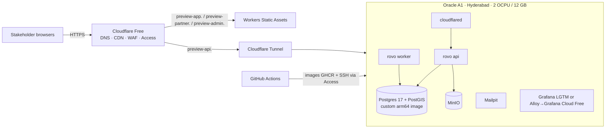

# 25 — Hosting Comparison: Free Tiers (dev/preview) & Production Cloud

| | |
|---|---|
| **Purpose** | (A) Check current free tiers for the **dev/preview/demo** environment and recommend a free stack for it. (B) Compare the three hyperscalers' **India regions** for **staging + production** and recommend one primary production cloud and one alternative, with monthly INR estimates at pilot scale and at 10× growth. |
| **Owner** | DevOps Architect |
| **Status** | Draft v1.1 — reconciled with review (31) and rulings R1–R48, 2026-10-04 |
| **Depends on** | `00-planning-baseline.md` (§4a, P4–P7, P14–P17, §8–§9 rulings), `08-system-architecture.md`, `10-database-schema.md` (data volumes), `14-payment-architecture.md` (webhooks), `17-frontend-architecture.md`, **`20-testing-strategy.md` §12.1 (load model — single source, R45)** |
| **Feeds** | `01-product-requirements.md` (cost figures are referenced, not restated — R46), `21-cicd-strategy.md`, `22-deployment-architecture.md`, `23-backup-disaster-recovery.md`, `24-observability-strategy.md`, `29-production-readiness-checklist.md`, `30-risks-assumptions-decisions.md` |

**Changes in v1.1**
- **§15 is the single source of cost (R46)**, ex-GST. Rebuilt around the two OpenTofu profiles (R32/M17): **`closed-pilot` ≈ $165 → ₹15,700/month** and **`public-launch` ≈ $299 → ₹28,400/month** (prod), plus stoppable staging ≈ ₹4,500–6,300.
- API traffic now goes through CloudFront on every app host (R27). AWS WAF on the ALB is removed; the CloudFront-included WAF is used. Added the **CDN request-volume model and request-reduction measures** (§15.7, M13).
- No-NAT closed pilot with compensating controls; one NAT Gateway in `public-launch` (R28). VPC interface endpoints are costed at the verified Mumbai price.
- Added the missing cost lines from RV-014 (§15.5): CERT-In log archive (M1), GuardDuty/Config, public IPv4, DLT, Google Play, counter devices and device lab (M3), support telephony (M9). Cut items are listed at ₹0 with their ruling: ClamAV (C5), IAP (C4), Sentry (R36), DR pre-provisioning (C10, deferred).
- Added a **per-order cloud cost table by phase** (§15.6), using the R45 volumes.
- The §10 load model is now reference-only. **Doc 20 §12.1 owns the load model (R45).** The 500–2,000 orders/day "pilot" figures no longer size the pilot infrastructure.
- Grafana Cloud (incl. Faro) and **no Sentry** (R36). Oracle/free-tier research stays reference only (R24).

> **Scope change (user directive, baseline §4a, 2026-10-04).** Production and staging run on a **standard hyperscaler in an India region with managed services**. Free tiers and local Docker are only for **local / CI / dev-preview / demo**. Part A below is the free-tier research, now scoped to dev/preview. Part B is the production decision.
>
> **How to read citations.** `[Sn]` (free tiers) and `[Cn]` (production cloud) point to the source lists in §11 and §17. All were fetched (or, where marked *search*, seen only in a search result) on **2026-10-04**. For AWS, prices come from the **official AWS Price List API** offer files (publication dates shown). For Azure they come from the **Azure Retail Prices API**. For GCP they come from the official pricing pages' embedded per-region tables. Anything not confirmed from a primary source is labelled **UNVERIFIED**. INR uses **₹95/USD [ASSUMPTION]**. **Prices exclude 18% GST**, which applies to Indian-billed cloud services [LEGAL/ASSUMPTION].

---

## 0. Executive summary

> **USER DIRECTIVE (2026-10-04, overrides the dev/preview recommendation below):** free tiers that require credit-card details (Oracle Always Free, AWS/GCP/Azure free tiers, Fly, etc.) are **not to be used during development**. The approved development environment is **local Docker Compose** (`deploy/compose`) on developer machines, plus GitHub Actions CI (public repo, no card). A shared demo, when needed, is run from a developer machine running that Compose stack and exposed temporarily with a card-free tunnel (e.g. a Cloudflare Quick Tunnel, which needs no account; verify current terms before use). The Oracle/free-tier research below is kept **for reference only**. Cloud spend (and card details) start with **staging on AWS** when the team prepares for go-live.

**Production (Part B)**

1. **Primary production cloud: AWS, Mumbai `ap-south-1`, with DR in Hyderabad `ap-south-2`.**
   - ECS on **Fargate (ARM/Graviton)**: an always-on `api` service behind an ALB (SSE OK, idle timeout configurable 1–4000 s [C9]) and a separate always-on `worker` service. Fargate ARM in Mumbai costs $0.02383/vCPU-h and $0.00261/GB-h [C1].
   - **RDS for PostgreSQL 17 with PostGIS 3.5.6** [C5]. The `closed-pilot` profile uses **Single-AZ db.t4g.small** ($0.042/h) with PITR and cross-Region backups. **Multi-AZ is mandatory before Gate B or above 100 orders/day**, whichever comes first (`public-launch` profile, R32) [C2].
   - RDS **cross-Region automated backups Mumbai → Hyderabad are supported** [C6].
   - S3 + **CloudFront flat-rate Pro ($15/mo, includes WAF)** [C12] serves the SPAs, `/media/*` **and `/api/*` on every app host** (R27). There is no AWS WAF on the ALB, which accepts only CloudFront. Secrets Manager ($0.40/secret [C8]); KMS ($1/key [C8]).
   - Hyderabad offers the same Fargate, RDS and ElastiCache prices [C1, C2, C4].
2. **Alternative: GCP `asia-south1` (Mumbai) with DR in `asia-south2` (Delhi).**
   - Cloud Run with **instance-based billing** for `api` and a **Cloud Run worker pool** for `worker` [S9]; Cloud SQL PostgreSQL 17 + PostGIS 3.5.2 [C16].
   - About 33% more expensive at pilot scale: ≈ ₹40,600 vs ₹30,600 (always-on Cloud Run vCPU ≈ $47/month vs Fargate ARM ≈ $17/month per vCPU; Cloud SQL HA ≈ $118/month for 1 vCPU) [S9, C15].
   - It has the strongest startup credit offer ($2k pre-funded; $200k Seed–Series A [C20]).
3. **Azure** (Central India) is viable: Container Apps with min replicas; PG Flexible with PostGIS 3.6.1 [C18]. However, **zone-redundant HA is not supported on Burstable** [C19], so HA starts at General Purpose (D2ds_v5 ≈ $183/month per node [C17]). That makes it the most expensive HA option at pilot scale.
4. **AWS App Runner is closed to new customers.** AWS points to ECS Express Mode instead [C7], so App Runner is excluded.
5. **Cost (excl. GST; §15 is the single source, R46)**

   | Configuration | ≈ USD/month | ≈ INR/month |
   |---|---|---|
   | AWS prod, **`closed-pilot` profile** (Single-AZ db.t4g.small, 2 small api + 1 worker, no NAT, VPC endpoints, CloudFront Pro incl. WAF, Grafana Free, CERT-In archive) | $165 | **₹15,700** |
   | AWS prod, **`public-launch` profile** (Multi-AZ db.t4g.small to start, sized by the doc 20 load test; 1 NAT; Grafana Pro) | $299 | **₹28,400** (₹34,700 if the load test needs db.t4g.medium) |
   | AWS staging (scaled down, stoppable) | $47–66 | ₹4,500–6,300 |
   | AWS **10× growth** | $1,415 | **₹1.34 lakh** (before Savings Plans/RIs) |

   Details, the missing cost lines and the per-order cost are in §15. AWS Activate Founders gives **up to $5,000** in credits (initial $1,000) to self-funded startups [C21]. CloudFront flat-rate plans "may not be combined with any other offers, promotions, or discounts" [C12], so credits may not offset the $15 plan.

**Dev / preview / demo (Part A)**

6. Always-on compute decides this too (River timers, SSE). Render, Koyeb, Neon Free and Cloud Run request-based all sleep or throttle [S10, S12, S13, S35].
   - *(Reference only. Superseded by R24: development and demos use local Docker Compose plus a card-free quick tunnel.)* Former free preview stack: Oracle Cloud Always Free A1 VM (Hyderabad; now **2 OCPU / 12 GB**, cut from 4/24 on 2026-06-15 [S1, S6]) running the same Docker Compose as local dev, + Cloudflare Free (Tunnel, Workers Static Assets) + R2 + Grafana Cloud Free + Sentry Developer.
   - **Fallback:** demo on the AWS staging environment (stopped when idle) or a ₹1,150/month DO Bangalore droplet.
7. **New finding:** the official `postgis/postgis` Docker image is **amd64-only** [S83]. Local/preview ARM hosts need our own `postgres:17` + PGDG PostGIS image (or `imresamu/postgis`, multi-arch [S84]). Production is unaffected because it uses managed RDS.
8. **Baseline check:**
   - **P6 (no Redis at V1) holds.** Free Redis tiers are tiny (Upstash 500K commands/month [S44]); in production, ElastiCache Valkey t4g.micro is $0.016/h [C4] when needed.
   - **P17 is superseded as directed.** Oracle and other free tiers are now dev/preview only.
   - **P15 decision (R36):** Grafana Cloud (ap-south-1 region), including Faro for frontend errors and RUM, is the production telemetry backend. **No Sentry in V1.** CERT-In logs are archived for 180 days in CloudWatch Logs / S3 in `ap-south-1`. CloudWatch is limited to AWS-vended metrics and alarms, because CloudWatch custom metrics at $0.30/metric-month [C11] would cost ≈ $1,500/month for ≈ 5,000 OTel series vs $0–19 on Grafana (see `24` §1.1).

---

# Part A — Free tiers for local / CI / dev-preview / demo

## 1. Requirements recap (from baseline)

| Need | Source | Hosting consequence |
|---|---|---|
| Go modular monolith, `api` + `worker` modes | P1 | 1–2 long-running containers; any Docker host |
| River jobs incl. 45 s / 3 min timers | P4, P11 | **Always-on CPU** for the worker; no sleep or scale-to-zero |
| SSE for customers, partners, riders | P3 | Long-lived HTTP; proxy must allow streaming (Cloudflare proxy read timeout 125 s [S56], so heartbeats every ≤ 30 s) |
| PostgreSQL 17+ with PostGIS | P5 | Managed DB with PostGIS, or self-hosted |
| Redis optional | P6 | Not needed at V1; self-host Valkey if needed |
| 4 static SPAs/PWAs (`app.`, `restaurant.`, `rider.`, `admin.`; R14) | P7 | Any static CDN; must allow commercial use |
| Object storage (public images, private KYC) | P10/P12 context | S3-compatible; private bucket + presigned URLs; data residency [LEGAL] |
| OTel, logs, errors, uptime | P15 | Free hosted backend with enough volume |
| CI/CD, container registry | P16 | GitHub Actions + GHCR |
| Latency to Mahabubnagar | §1 | India region strongly preferred (Hyderabad is about 100 km away) |

---

## 2. Backend compute

### 2.1 Comparison table

| Provider / tier | Free resources (verified) | Always-on? | India / SG region | Card | Key terms & risks | Verdict |
|---|---|---|---|---|---|---|
| **Oracle Cloud Always Free – Ampere A1** | 1,500 OCPU-h + 9,000 GB-h/month = **2 OCPU / 12 GB** for Always Free tenancies; 1–2 A1 instances; **200 GB** block storage total (boot + block); 5 volume backups; **10 TB/month** outbound; 2× AMD E2.1.Micro (1/8 OCPU, 1 GB) [S1] | **Yes** (normal VM) | **Hyderabad, Mumbai** (1 AD each); also Singapore ×2 [S3]. Always Free only in the **home region**, chosen at sign-up [S2] | Required for sign-up; "not charged unless you upgrade" [S2] | **Idle reclamation**: instance is idle if over 7 days CPU p95 < 20% **and** network < 20% **and** memory < 20% (A1) [S1]. Allowance cut from 4/24 to 2/12, effective 2026-06-15, no notice [S6, S7]. A1 capacity is "out of host capacity" in busy regions [S1]. Community reports of tenancies disabled without warning [S8 *search*]. Commercial use on Always Free: **UNVERIFIED** (Oracle T&Cs not fetched) [LEGAL] | **Preview primary** |
| Oracle PAYG (upgraded tenancy) | Price list free band: A1 0–3,000 OCPU-h, 0–18,000 GB-h; then **$0.01/OCPU-h, $0.0015/GB-h**; APAC egress free to 10,240 GB then $0.025/GB [S4]. Compute pricing page also says "first 3K OCPU-hrs and first 18K GB-hrs each month is free" [S5] | Yes | Same | Yes | Docs [S1] say 2/12 for "Always Free tenancies". Price list [S4, S5] still says 3,000/18,000. **Which applies to PAYG is [OPEN]**. Exemption of PAYG from idle reclamation: **UNVERIFIED** (docs only say "Idle Always Free compute instances may be reclaimed") | Optional for preview (adds card + budget alert) |
| Google Cloud Run (asia-south1 Mumbai = Tier 1 [S9]) | Instance-based: 240,000 vCPU-s + 450,000 GiB-s/month; request-based: 180,000 vCPU-s + 360,000 GiB-s + 2M requests [S9] | **No** under request-based billing: "CPU is only allocated during request processing" [S10]. Instance-based + min-instances keeps CPU, but 240k vCPU-s ≈ **66.7 vCPU-h ≈ 9% of a month** | Mumbai, Delhi, Singapore [S9] | Yes (billing account) | Google's own example: a 1 vCPU/512 MiB worker pool running all month costs **$11.61** (europe-west1) [S9]. Free tier is a spending discount at Tier 1 pricing [S9] | Paid option only |
| GCP Compute e2-micro Always Free | 1 non-preemptible e2-micro/month, 30 GB-month disk, 1 GB egress from North America [S11] | Yes | **US only** (us-west1, us-central1, us-east1) [S11] | Yes | 1 GB RAM (e2-micro), US latency (about 250 ms RTT [ASSUMPTION]) | Reject (latency, RAM) |
| Render Free web service | 750 instance-h/month; spins down after **15 min** with no inbound traffic, about 1 min to spin up; no persistent disk; free Postgres **expires after 30 days** [S12] | **No** | — | No | May suspend for high outbound traffic [S12] | Reject |
| Koyeb Free | 1 instance: 512 MB, 0.1 vCPU, 2 GB SSD; **Frankfurt or Washington D.C. only**; scale to zero after **1 h** idle; cannot be a Worker service [S13]. Free Postgres only 5 h compute [S14] | **No** | No India; SG on paid Eco [S13] | UNVERIFIED | — | Reject |
| Fly.io | "**New organizations don't have a free tier**"; trial = 2 h machine runtime or 7 days [S15]. shared-cpu-1x 256 MB $2.19/mo (SG ×1.27 ≈ $2.78) [S15] | Paid | SG yes; Mumbai not listed [S15] | No (trial) | — | Paid only |
| Railway | Trial $5 one-time (30 days); Free plan **$1/month credit**, 1 vCPU / 0.5 GB per service; Hobby $5/mo [S16] | $1 credit ≈ 0.1 GB RAM-month at about $10/GB-month [S16] | Region list not on pricing page (**UNVERIFIED**) | No (trial) | — | Reject (credit too small) |
| Northflank Developer Sandbox | 2 services, 2 jobs, 1 addon; "Always-on compute – no sleeping" [S17] | Yes | US/EU/"Asia East"; India not listed [S17] | **Payment method mandatory** [S18] | "**should not be used for production applications**" [S18] | Reject (ToS) |
| AWS Free Tier (post-July-2025 model) | $100 credit + up to $100 more; Free plan ends after **6 months** or when credits run out [S19, S20] | Yes while credits last | Mumbai, Hyderabad (AWS regions) | Yes | "The account closes on its own 6 months after you open it" (Free plan) [S20] | Reject for long-term; fine for experiments |
| Azure free account | 12-month free services + always-free services [S29]; specific VM/PG quotas **UNVERIFIED** (page is JS-rendered) | Yes for 12 months (UNVERIFIED) | Central/South/West India | Yes | Time-limited | Not evaluated further |

### 2.2 Low-cost paid VM reference (preview fallback only)

| Provider | Plan | Specs | USD/month | ≈ INR/month* | Region | Source |
|---|---|---|---|---|---|---|
| DigitalOcean | Basic Droplet | 1 vCPU / 2 GB / 50 GB / 2 TB | $12 | ₹1,140 | **BLR1 Bangalore**, SGP1 [S23] | [S22] |
| DigitalOcean | Basic Droplet | 2 vCPU / 4 GB / 80 GB / 4 TB | $24 | ₹2,280 | BLR1 | [S22] |
| DigitalOcean | Managed PostgreSQL 1 GB | 1 GB RAM, 10–30 GiB | $15.15 | ₹1,440 | BLR1 [S23] | [S24]; PostGIS listed for PG17 [S25]; daily backup + 7-day PITR [S26] |
| AWS Lightsail | 2 GB bundle | 2 vCPU / 2 GB / 60 GB / 3 TB (Mumbai: **half** transfer) | $12 | ₹1,140 | Mumbai | [S21] |
| AWS Lightsail | 4 GB bundle | 2 vCPU / 4 GB / 80 GB / 4 TB (Mumbai half) | $24 | ₹2,280 | Mumbai | [S21] |
| Hetzner | CX23 / CAX11 (DE/FI) | 2 vCPU / 4 GB / 40 GB | €5.49 / €5.99 after 2026-06-15 increase | ₹600–660 | DE/FI; **Singapore pricing for these plans UNVERIFIED** | [S28] |
| Oracle PAYG | A1 2 OCPU / 12 GB above the free band | — | 2×730×$0.01 + 12×730×$0.0015 = **$27.74** | ₹2,635 | Hyderabad | [S4] |

\*INR at **₹95 / USD** and **₹110 / EUR** [ASSUMPTION]. Forecast sites put October 2026 around ₹95 [S85 *search*]. Recompute at purchase time; Indian card payments abroad may add GST on foreign services and forex markup [LEGAL].

---

## 3. PostgreSQL (PostGIS mandatory)

### 3.1 Comparison table

| Option | Free limits (verified) | PostGIS | Region | Sleep / cold start | Backups / PITR (free) | Connections / River fit | Verdict |
|---|---|---|---|---|---|---|---|
| **Self-hosted on Oracle A1** (Docker) | Bounded by the VM: about 4 GB RAM for PG, up to about 100 GB block volume | Yes (custom ARM image, §0 item 7) | Hyderabad | None | Optional nightly `pg_dump` to R2 (preview data is disposable) | Unlimited; LISTEN/NOTIFY works | **Preview primary** |
| Supabase Free | 2 active projects; **500 MB DB**; Nano: shared CPU, 0.5 GB RAM, 60 direct connections, 200 pooler clients; 5 GB egress; 1 GB file storage [S30, S34] | Yes, install into `extensions` schema [S32] | **Mumbai (ap-south-1)**, Singapore [S31] | "Free projects are **paused after 1 week of inactivity**" [S30] | **No backups, no PITR** on Free [S30] | Direct connection is IPv6 unless you buy the IPv4 add-on; shared pooler is IPv4. **Transaction mode breaks LISTEN/NOTIFY** and prepared statements, so River must use **session mode (5432)** or direct [S33] | Possible preview DB; 500 MB and no backups |
| Neon Free | 100 CU-h/project/month; 1 GB/project; up to 2 CU; 6 h history; 5 GB egress [S35] | Yes (PG17: PostGIS 3.5.7) [S37] | **No India**; Singapore `aws-ap-southeast-1` [S36] | Scale-to-zero after 5 min, "cannot be turned off" on Free [S35] | 6 h history window [S35] | River polling keeps compute awake: 0.25 CU × 730 h = **182 CU-h > 100** | Reject for prod; useful for **CI preview branches** |
| Aiven Free PostgreSQL | 1 CPU, 1 GB RAM, 1 GB storage; backups included; no card [S38] | Yes [S38] | "No choice of cloud provider or specific cloud region" (Developer tier text) [S39] | Powered off after inactivity, with prior notice [S39] | Included [S38] | — | Reject (1 GB, region not selectable, "not recommended for high-traffic production" [S38]) |
| Prisma Postgres Free | 200k operations/month, 500 MB, 50 DBs [S40] | **Not documented (UNVERIFIED)** | UNVERIFIED | — | — | — | Reject |
| Xata | Managed: 14-day trial only; free tier is self-hosted OSS [S41] | Not documented | — | — | — | — | Reject |
| Nile Free | 1 GB, 50M query tokens, 500 connections, always-on [S42] | **Not documented (UNVERIFIED)** | "All" regions (no list) | No cold start [S42] | — | — | Reject (PostGIS unverified) |
| CockroachDB | — | **Partial**: "Not all PostGIS spatial functions are supported"; no KNN, no custom SRIDs [S43] | — | — | — | — | Reject (no PostGIS parity) |
| DigitalOcean Managed PG (paid) | $15.15/mo, 1 GB RAM [S24] | Yes [S25] | Bangalore [S23] | None | Daily + PITR 7 days [S26] | — | **First paid step** |
| Supabase Pro (paid) | $25/mo; 8 GB disk; $10 compute credit (Micro, 1 GB) [S30, S34] | Yes | Mumbai | None | PITR add-on **$100/mo per 7 days** [S30] | as above | Not needed (production uses hyperscaler, Part B) |

### 3.2 Why self-hosted Postgres on the VM is acceptable for preview (and not for production)

- For preview it is the same latency domain as the API, has no pooler surprises or LISTEN/NOTIFY restrictions, and gives all extensions. It is also **identical to local dev Compose**.
- For production, §4a requires managed Postgres with automated backups, PITR and Multi-AZ. Self-hosting would make us own backups, failover and upgrades, so **production uses RDS (Part B)**.

### 3.3 Why the baseline's "managed free fallback" does not work

| Fallback combo (P17 idea) | Failure |
|---|---|
| Supabase Free + Render Free | Render sleeps after 15 min [S12]: worker timers stop and SSE drops |
| Neon Free + Koyeb Free | Neon has no India region [S36] and mandatory suspend [S35]; Koyeb free only in Frankfurt/DC and scales to zero [S13] |
| Supabase Free + Cloud Run (free) | Request-based billing removes CPU between requests [S10]; instance-based free allowance ≈ 67 vCPU-h/month [S9] |
| Supabase Free + Northflank Sandbox | Sandbox ToS: "should not be used for production applications" [S18] |
| Supabase Free + Fly.io | No free tier for new orgs [S15] |

**Conclusion:** no free managed combination gives always-on India compute. For preview the fallback is a cheap paid VM or the stoppable AWS staging environment (§9.2).

---

## 4. Redis / cache (P6 check)

| Option | Free limits (verified) | Region | Notes | Verdict |
|---|---|---|---|---|
| Upstash Redis Free | **500K commands/month**, 256 MB, 10 GB bandwidth; up to 10 free DBs; PAYG $0.2/100K commands [S44, S45] | Mumbai `ap-south-1` available [S46 *search*] | 500K/month ≈ **11.6 commands/minute**. One rate-limit check per API request would use it up in hours at V1 load | Reject for rate limiting/pub-sub |
| Redis Cloud Free | **30 MB**, single DB, best-effort SLA [S47] | Region choice UNVERIFIED | Too small for anything except a toy cache | Reject |
| Aiven for Valkey Free | Exists [S39]; specs UNVERIFIED; no region choice; powered off when inactive | — | — | Reject |
| **Self-hosted Valkey on the VM** | Bounded by RAM (256 MB container) | Same VM | Free, same latency, no quotas. **Enable only when** >1 API replica or proven need (P6) | **Use when needed** |

**P6 verdict: HOLDS.** V1 uses in-process implementations plus Postgres (`LISTEN/NOTIFY` for worker→API SSE fan-out, `UNLOGGED` or regular tables for rate-limit buckets). A Valkey container is pre-declared in Compose but disabled (`profiles: [cache]`).

---

## 5. Object storage

| Option | Free limits (verified) | Egress | Region / residency | Immutability | Use in rovo |
|---|---|---|---|---|---|
| **Cloudflare R2** | **10 GB-month**, **1M Class A**, **10M Class B**/month (Standard class only) [S48] | **Free** [S48] | Location hints: wnam, enam, weur, eeur, **apac**, oc; jurisdictions only EU/FedRAMP/US; **no India** [S50] | **Bucket locks** (retention per prefix, up to 1,000 rules) [S49]; free-plan eligibility not stated (**UNVERIFIED**) | **Public menu/restaurant images** (served via `cdn.` custom domain + Cloudflare cache); **primary backup repo** (pgBackRest) |
| **Oracle Object Storage (Always Free)** | Always-Free-only account: **20 GB** combined, **50,000 API requests/month**. Paid/trial: 10 GB Standard + 10 GB IA + 10 GB Archive [S1] | Counts toward 10 TB [S1] | **Hyderabad** (home region) | Retention rules exist (feature not verified in this pass) | **Private KYC documents** (keeps them in India [LEGAL]); low request volume fits 50k/month |
| **Backblaze B2** | **First 10 GB free**; then $6.95/TB-month; Class A/B/C calls free; egress free up to 3× stored [S51] | 3× free | US West named; Asian region not listed [S51] | **Object Lock at no extra cost**, governance/compliance modes; can be enabled on an existing bucket, cannot be disabled [S52] | **Second, independent backup copy** (nightly encrypted `pg_dump` + KYC mirror) |
| Supabase Storage Free | 1 GB, 50 MB max upload [S30] | within 5 GB egress | Mumbai | — | Not used |
| AWS S3 | Covered only by credits on the 6-month Free plan [S19] | — | Mumbai/Hyderabad | Object Lock | Not used at V1 |

---

## 6. Static frontends (customer, partner, admin SPAs)

| Option | Free limits (verified) | Commercial use on free | Notes | Verdict |
|---|---|---|---|---|
| **Cloudflare Workers Static Assets** | "Requests to static assets are **free and unlimited**" [S54]; 20,000 files/version, 25 MiB/file [S55]. Worker script requests capped at 100,000/day on Free [S55] | Allowed (no restriction found) | Do **not** set `run_worker_first`, or requests count against the 100k/day quota and can return 429 [S54] | **Preview primary** (prod: S3 + CloudFront, Part B) |
| Cloudflare Pages | 500 builds/month, 1 concurrent, 20 min timeout, 20,000 files, 25 MiB/file, 100 projects [S53] | Allowed | Equivalent; we build in GitHub Actions and upload with `wrangler`, so the build quota is irrelevant | Equivalent alternative |
| Vercel Hobby | 100 GB Fast Data Transfer, 1M invocations [S62] | **No**: "Hobby teams are restricted to non-commercial personal use only"; any payment processing counts as commercial [S62] | — | **Reject (ToS)** |
| Netlify Free | **300 credits/month**; bandwidth = 20 credits/GB; production deploy = 15 credits [S63, S64] | Not stated | When credits run out, "**all of your web projects … are paused**" until the next cycle; Free cannot buy credits [S64]. 300 credits ≈ 15 GB with zero deploys | Reject (hard pause) |
| GitHub Pages | 1 GB site, 100 GB/month soft bandwidth [S65] | **No**: not for "online business, e-commerce site … commercial transactions … SaaS" [S65] | — | **Reject (ToS)** |
| Firebase Hosting (Spark) | 10 GB storage, **360 MB/day** transfer (≈ 10.8 GB/month) [S66] | Not stated | Small transfer cap | Reject (cap) |

---

## 7. CI/CD, DNS/CDN/WAF, monitoring, email

### 7.1 CI/CD and registry

| Item | Verified terms | Implication |
|---|---|---|
| GitHub Actions, **public repo** | "The use of standard GitHub-hosted runners is free: In public repositories" [S67]. Public arm64 runners `ubuntu-24.04-arm`: **4 CPU / 16 GB** [S68] | Unlimited standard minutes; **native arm64 builds** for Oracle A1 at no cost. rovo is Apache-2.0, so the repo is public |
| GitHub Actions, private repo (if ever) | GitHub Free: **2,000 min/month**, 500 MB artifacts; private arm64 runners 2 CPU / 8 GB [S67, S68] | Our estimate is about 2,100+ min/month (§10.6), so it would **not fit** |
| Larger runners | "always charged for, even when used by public repositories" [S67] | Avoid |
| Self-hosted runner fee | $0.002/min announced Dec 2025, **postponed** [S70 *search*] | Not needed |
| GHCR | "Container image storage and bandwidth for the Container registry is currently free"; public packages free [S69] | Public images are free; "currently" means the terms can change, so keep a mirror path (Docker Hub / OCIR) |

### 7.2 DNS / CDN / WAF / Zero-Trust (Cloudflare Free)

| Feature | Verified | Source |
|---|---|---|
| WAF custom rules | **5** on Free | [S59] |
| Rate-limiting rules | **1** rule, IP-only, 10 s period | [S60] |
| Proxy read timeout | **125 s** (not configurable below Enterprise); idle timeout 900 s | [S56] |
| Cloudflare Tunnel | "available on all plans"; outbound-only `cloudflared` | [S57 *search*, S58] |
| Zero Trust / Access | Free up to **50 users** | [S61 *search*] |
| Unmetered DDoS, Universal SSL, CDN | Marketing page; per-feature numbers not on fetched page | [cloudflare.com/plans/free — fetched, details not shown] |
| SLA on Free | **None found** (UNVERIFIED; assume none) | — |

### 7.3 Observability & alerting

| Service | Free limits (verified) | Commercial on free | Verdict |
|---|---|---|---|
| **Grafana Cloud Free** | **10k active metric series**, **50 GB logs**, **50 GB traces**, 50 GB profiles, **14-day retention**, 3 active users, 3 IRM users, 100k synthetic API checks + 10k browser checks, 50k frontend sessions [S71, S72]. Regions incl. AWS **ap-south-1 (Mumbai)** and ap-southeast-1 [S73] (free-tier eligibility per region **UNVERIFIED**). Behaviour on overage and inactive-stack policy **UNVERIFIED** | No restriction found | **Dev/preview; Pro tier also chosen for production telemetry (§14.6)** |
| **Sentry Developer** | 5k errors, 5M spans, 50 replays, 1 cron monitor, 1 uptime monitor, **1 user**, 30-day lookback [S75] | No restriction found | **Not used in V1** (R36: Faro on Grafana Cloud covers frontend errors; re-evaluate after the pilot) |
| **UptimeRobot Free** | 50 monitors, **5-min interval**, 1 status page [S76]; ToS: "**available for any use, including commercial and business use**" [S77] | **Allowed** | **Use** (external uptime) |
| Better Stack Free | 10 monitors, 30 s checks, 3 GB logs/3 days [S78] | Free tier "covers **personal projects**" [S78] | Reject (ToS) |
| Axiom Personal | 500 GB ingest/month, 30-day retention [S79] | Positioned "for individual developers" (no explicit ban) | Backup option for logs |
| Honeycomb Free | 20M events/month, 2 triggers, no SLOs [S80] | Not stated | Not needed |
| New Relic Free | 100 GB/month ingest, 1 full-platform user; ingest **stops** at limit [S81] | Not stated | Alternative if Grafana changes terms |
| Alert channels | Grafana contact points include **Telegram, Discord, Email, Slack, Webhook** [S74] | — | Telegram + email (`24`) |

### 7.4 Transactional email (brief, Solution Architect owns `15`)

| Service | Verified | Note |
|---|---|---|
| Oracle Email Delivery (Always Free) | **3,000 emails/month** [S1] | Same provider as the VM, which is a correlated-failure risk |
| Resend Free | 3,000/month, **100/day**, 3 domains [S82] | Fine for admin/ops mail |
| Brevo Free | **UNVERIFIED** (page content not retrievable) | — |

---

## 8. Scoring matrix (dev/preview hosting only — production is Part B)

Weights reflect rovo's constraints. Scores run 1 (poor) to 5 (best). The weighted total is out of 5.

| Criterion (weight) | A. Oracle A1 self-host | B. Supabase Free + Cloud Run (free) | C. Neon Free + Render Free | D. GCP e2-micro (US) self-host | E. DO BLR1 Droplet + DO Managed PG (paid) | F. Lightsail Mumbai (paid) |
|---|---|---|---|---|---|---|
| Always-on compute (25%) | 5 | 1 | 1 | 5 | 5 | 5 |
| Latency to Mahabubnagar (15%) | 5 (Hyderabad) | 4 (Mumbai) | 2 (SG DB) | 1 (US) | 4 (Bangalore) | 4 (Mumbai) |
| Free headroom vs V1 load (15%) | 4 (2/12, 200 GB, 10 TB) | 2 (500 MB DB) | 1 | 1 (1 GB RAM) | n/a → 3 (paid, sized) | n/a → 3 |
| Reliability / account risk (15%) | 2 (no SLA, reclamation, suspension reports, silent limit cuts) | 2 | 2 | 3 | 4 (paid, support) | 4 |
| PostGIS & data control (10%) | 5 | 4 | 4 | 5 | 4 | 4 (self-host) |
| Ops effort, inverse (10%) | 2 (we run PG + backups) | 4 | 4 | 2 | 4 (managed PG) | 3 |
| Lock-in / migration ease (10%) | 5 (plain Docker + PG) | 3 | 3 | 5 | 4 | 4 |
| **Monthly cost** | **₹0** | ₹0 (but broken) | ₹0 (broken) | ₹0 | **≈ ₹2,850–4,300** | ≈ ₹2,280–3,700 |
| **Weighted score** | **4.15** | 2.45 | 1.95 | 3.05 | 4.05 | 3.95 |

Calculation for A: 0.25×5 + 0.15×5 + 0.15×4 + 0.15×2 + 0.10×5 + 0.10×2 + 0.10×5 = 1.25+0.75+0.60+0.30+0.50+0.20+0.50 = **4.10**. Rounding the row gives 4.10–4.15, and the order is unchanged.

---

## 9. Dev / preview / demo recommendation

> **USER DIRECTIVE (2026-10-04, overrides the dev/preview recommendation below):** free tiers that require credit-card details (Oracle Always Free, AWS/GCP/Azure free tiers, Fly, etc.) are **not to be used during development**. The approved development environment is **local Docker Compose** (`deploy/compose`) on developer machines, plus GitHub Actions CI (public repo, no card). A shared demo, when needed, is run from a developer machine running that Compose stack and exposed temporarily with a card-free tunnel (e.g. a Cloudflare Quick Tunnel, which needs no account; verify current terms before use). The Oracle/free-tier research below is kept **for reference only**. Cloud spend (and card details) start with **staging on AWS** when the team prepares for go-live.

> Per §4a these stacks **must not carry real customers, real money or real KYC data**. Preview uses the **fake OTP and fake payment providers**, or PA **sandbox** keys, and synthetic seed data only.

### 9.1 Primary preview stack (₹0/month + domain)

| Layer | Choice | Key verified limit |
|---|---|---|
| Compute + DB | Oracle Always Free A1 (Hyderabad), **same `compose.yaml` as local dev** plus a `preview` override | 2 OCPU/12 GB, 200 GB block, 10 TB egress [S1]; idle-reclaim rule [S1] |
| Ingress | Cloudflare Tunnel; **Cloudflare Access** in front of everything (stakeholders log in by email OTP) | Tunnel on all plans [S57]; Access ≤ 50 users [S61] |
| Frontends | Workers Static Assets | Unlimited static requests [S54] |
| Object storage | MinIO on the VM (mirrors local dev); R2 optional | R2 10 GB free [S48] |
| Observability | Local LGTM container, or Grafana Cloud Free stack `rovo-dev` | 10k series / 50 GB logs [S71] |
| Errors | Sentry Developer project `rovo-preview` | 5k errors, 1 user [S75] |
| CI/registry | GitHub Actions + GHCR (public repo) | Free standard + arm64 runners [S67, S68]; GHCR free [S69] |

Data-loss tolerance for preview is "rebuild from seed". Backups are optional (a nightly `pg_dump` to R2 for convenience only).

### 9.2 Fallback preview options

| Option | Cost | When |
|---|---|---|
| Spin up **AWS staging** (§15) for the demo and stop it afterwards | ≈ ₹100–200 per demo day | Oracle capacity unavailable or account issue |
| DigitalOcean BLR1 droplet 2 GB with the same Compose | $12 ≈ ₹1,140/month [S22, S23] | Need a persistent preview without Oracle |
| Laptop + `cloudflared` quick tunnel | ₹0 | Ad-hoc demo |

Oracle-specific risks (limit cut without notice [S6], capacity [S1], account suspension reports [S8]) are **acceptable for preview only**, because nothing of value lives there.

### 9.3 Re-verification cadence

Re-fetch every page in §11 and §17 before creating an account, then quarterly. A scheduled CI job (`21` §9) diffs key numbers and opens an issue on change.

## 10. Capacity model (reference only — the load model is owned by doc 20)

> **v1.1 (R45):** the **single load model is `20-testing-strategy.md` §12.1**. Planning volumes are: closed pilot ≈ 30 orders/day; month 1 ≈ 80/day; month 3 ≈ 250/day. The design point is 2,000 orders/day with a 500 orders/h peak. The load test runs at 3× (1,500 orders/h) with 3,000 concurrent SSE connections. **Infrastructure is sized to the phase (R32), and the load test proves its capacity.** The table below is the original Part A data-volume check. It is kept because §10.3–§10.6 storage and telemetry volumes are still useful at the design point. It **no longer sizes the pilot infrastructure**: §15 uses the R45 phase volumes and the §15.7 request model.

### 10.1 Load assumptions [ASSUMPTION — superseded by doc 20 §12.1 / R45]

| Parameter | Mid (≈ 500/day) | Design point (2,000/day, doc 20) |
|---|---|---|
| Restaurants | 50 | 50 |
| Riders (online at peak) | 40 | 100 |
| Orders/day | 500 | 2,000 |
| Dinner peak share | 25% of daily over 2.5 h | same |
| Peak orders/min | ≈ 0.8 | **≈ 3.3** |
| Customer sessions/day | 5,000 | 20,000 |
| API requests/session | 60 | 60 |
| Rider location pings | every 30 s while online, 10 h/day | same |
| SSE concurrent connections | 300 | ≈ 1,500 expected (customers tracking + restaurant inboxes + riders); **load test 3,000 (R45)** |

### 10.2 Compute

- API requests/day: 20,000 × 60 = **1.2M/day**, plus rider pings 100 × 120/h × 10 h = 120k/day. Peak about **50 req/s**. A Go service on 1 OCPU A1 handles this with large headroom [ASSUMPTION; to be load-tested per `20`].
- SSE: 1,500 idle goroutines ≈ 15–30 MB of RAM. Each passes through Cloudflare Tunnel; heartbeat every 25 s to stay under the 125 s read timeout [S56].
- Worker: River at 2,000 orders/day ≈ 20–40k jobs/day, trivial.
- **Fits 2 OCPU / 12 GB.** RAM plan is in `22` §Resource allocation (about 9.5 GB committed, 2.5 GB headroom).

### 10.3 Database size growth

| Data | Per unit | High scenario/day | Per month | Retention policy |
|---|---|---|---|---|
| Orders + items + status history + delivery + offers + payments + ledger rows + notifications (incl. indexes) | ≈ 10 KB/order [ASSUMPTION] | 20 MB | **≈ 600 MB** | Keep (financial records, `10` retention) |
| Rider location history | ≈ 150 B/ping incl. index | 120k pings → 18 MB | 540 MB if kept | **Keep 7 days raw** (≈ 126 MB steady) + latest position on `riders` row |
| Outbox + River jobs | ≈ 1 KB | 40–80 MB churn | — | Prune completed after 7 days |
| Audit log | ≈ 0.5 KB × 20/order | 20 MB | ≈ 600 MB | Keep 1 year then archive to R2 [ASSUMPTION; `12`] |
| **Total live DB growth** | | | **≈ 1.2–1.4 GB/month (high), ≈ 0.4 GB (low)** | |

- Year-1 DB size ≈ **8–17 GB** (high), which fits easily on the planned 100 GB data volume.
- **Supabase Free (500 MB) would overflow in under 2 weeks** at the high scenario. That confirms it is unsuitable even as a fallback beyond emergencies.

### 10.4 Object storage

| Item | Calculation | Size |
|---|---|---|
| Menu images | 50 restaurants × 80 items × (thumb 30 KB + full 120 KB WebP) | ≈ 600 MB |
| Restaurant covers/logos | 50 × 400 KB | 20 MB |
| **R2 public total** | | **≈ 0.65 GB** (10 GB free [S48]) |
| KYC (riders) | 100 riders × 4 docs × 1 MB (+ churn 30%/yr) | ≈ 520 MB/yr |
| KYC (restaurants) | 50 × 5 × 1 MB | 250 MB |
| **Oracle OS KYC total** | | **≈ 0.8 GB/yr** (20 GB free [S1]) |
| R2 ops | Uploads ≪ 10k/month (Class A). Image GETs: 20k sessions × 30 images = 600k/day, but at a ≥ 95% CDN hit ratio, origin GETs ≈ 0.9M/month (Class B free 10M) | Fits |
| Oracle OS requests | KYC upload + reviewer views ≈ 2–5k/month vs 50k free [S1] | Fits |

### 10.5 Backups

| Item | Calculation | Size |
|---|---|---|
| WAL volume | ≈ 300–500 MB/day raw (rider updates dominate) → zstd ≈ 100 MB/day [ASSUMPTION] | 7-day window ≈ **0.7 GB** |
| Base backups | Weekly full (≈ 3 GB compressed at month 12) × 2 kept + daily diffs | ≈ 4–7 GB at month 12 |
| **R2 backup bucket** | + images 0.65 GB | **≈ 6–9 GB by month 12**, close to the 10 GB free line. Plan $0.015/GB overage (≈ ₹15/month) or move older fulls to B2 |
| R2 Class A for WAL | `archive_timeout=300` → 288 segments/day ≈ 8,640 PUTs/month (+ multipart overhead) | ≪ 1M |
| B2 | Nightly `pg_dump -Fc` ≈ 0.3–2 GB × retention (7 daily + 4 weekly + 6 monthly, deduplicated by being small) | **≈ 8–15 GB by month 12**, over the 10 GB free line → ≈ $0.04/month overage |

### 10.6 Bandwidth, logs, metrics, traces, CI

| Budget item | Estimate (high) | Free limit | Fits? |
|---|---|---|---|
| VM egress (JSON API + SSE) | 1.2M req × ≈ 4 KB ≈ 5 GB/day → **150 GB/month** | 10 TB [S1] | Yes |
| Static frontends | ≈ 20k sessions × 1.5 MB first load (cached PWA after) ≈ 300 GB/month worst case | Unlimited static requests [S54] | Yes |
| Logs to Grafana | 1.3M request logs × 400 B + worker/app logs ≈ 0.7 GB/day → **≈ 21 GB/month** (health-check and SSE-heartbeat logs dropped, `24`) | 50 GB [S71] | Yes, with about 2× headroom |
| Metrics active series | Budget **≈ 5,000** (route-grouped RED ≈ 1,500, node ≈ 800, postgres ≈ 800, Go runtime ≈ 150, River ≈ 200, business ≈ 400, Alloy self ≈ 300) | 10k [S71] | Yes, **only with the cardinality rules in `24`** |
| Traces | 1.3M req × ≈ 6 spans × 1 KB ≈ 7.8 GB/day at 100% → **10% head sampling + errors/slow tail** ≈ 25 GB/month | 50 GB [S71] | Yes |
| Errors (Sentry) | Backend errors ≪ 1k/month; frontend unknown, so **client-side sample 25% + dedupe** | 5k [S75] | Probably; watch it |
| CI minutes | Public repo: unlimited standard runners [S67]. (If private: ≈ 60 PRs × 25 job-min + 40 main/tag builds × 20 = **2,300 min** > 2,000 [S67]) | Unlimited (public) | Yes (public only) |
| Grafana users | Founders + 1 ops | 3 [S71] | Tight; use shared viewer and Telegram alerts |

**Verdict:** a free stack *could* technically carry V1 load for about 12 months, but §4a forbids it for production. For production the same volumes drive the AWS sizing in §15 (RDS 50 GB gp3 at pilot, ≈ 21 GB/month logs, < 10k metric series, ≈ 25 GB/month traces). The first limits to hit are **R2/B2 10 GB (backups)** around months 9–12 (overage costs pennies), and **Grafana 3 users / Sentry 1 user** (people, not load).

---

## 11. Sources (all accessed 2026-10-04)

| # | URL | Notes |
|---|---|---|
| S1 | https://docs.oracle.com/en-us/iaas/Content/FreeTier/freetier_topic-Always_Free_Resources.htm | A1 1,500 OCPU-h / 9,000 GB-h = 2/12; 200 GB block; 10 TB egress; idle-reclaim criteria; Object Storage 20 GB / 50k req; Email 3,000/mo |
| S2 | https://docs.oracle.com/en-us/iaas/Content/FreeTier/freetier.htm | Home region only; card required; $300/30-day trial |
| S3 | https://docs.oracle.com/en-us/iaas/Content/General/Concepts/regions.htm | ap-hyderabad-1, ap-mumbai-1 (1 AD each) |
| S4 | https://apexapps.oracle.com/pls/apex/cetools/api/v1/products/?currencyCode=USD | Price list, lastUpdated 2026-10-01: A1 $0.01/OCPU-h, $0.0015/GB-h with free bands 3,000 / 18,000 |
| S5 | https://www.oracle.com/cloud/compute/pricing/ | "first 3K OCPU-hrs and the first 18K GB-hrs each month is free" (conflicts with S1) |
| S6 | https://infoq.com/news/2026/07/oracle-cloud-free-tier-limits/ | 4/24 → 2/12 effective 2026-06-15, no announcement |
| S7 | https://terminalbytes.com/oracle-cloud-free-tier-changes-2026 | Inconsistent enforcement; PAYG guidance contradictory |
| S8 | https://lowendspirit.com/discussion/10956/oracle-free-tier-changing-be-careful-confirmed | *search* only; community reports of disabled tenancies |
| S9 | https://cloud.google.com/run/pricing | Free tier numbers; asia-south1 Tier 1; worker-pool example $11.61 |
| S10 | https://cloud.google.com/run/docs/configuring/billing-settings | "With request-based billing, CPU is only allocated during request processing" |
| S11 | https://cloud.google.com/free/docs/free-cloud-features | e2-micro US regions only; $300/90-day trial |
| S12 | https://render.com/docs/free | 15-min spin-down; 750 h; Postgres expires in 30 days |
| S13 | https://www.koyeb.com/docs/reference/instances | Free: Frankfurt/Washington, scale-to-zero after 1 h |
| S14 | https://www.koyeb.com/pricing | Free Postgres 5 h |
| S15 | https://docs.fly.io/about/pricing | No free tier for new orgs |
| S16 | https://railway.com/pricing | $5 trial; $1/month Free plan |
| S17 | https://northflank.com/pricing | Sandbox always-on, regions |
| S18 | https://northflank.com/docs/v1/application/billing/pricing-on-northflank | Sandbox "should not be used for production" ; payment method mandatory |
| S19 | https://docs.aws.amazon.com/awsaccountbilling/latest/aboutv2/free-tier.html | Free vs Paid plan; $100 + $100 credits; 6 months |
| S20 | https://aws.amazon.com/free/ | Account closes after 6 months (Free plan) |
| S21 | https://aws.amazon.com/lightsail/pricing/ | Bundles; Mumbai half transfer; DB $15 |
| S22 | https://www.digitalocean.com/pricing/droplets | $4/$6/$12/$24 Basic |
| S23 | https://docs.digitalocean.com/platform/regional-availability/ | BLR1 Droplets + Managed PG |
| S24 | https://www.digitalocean.com/pricing/managed-databases | PG $15.15/mo |
| S25 | https://docs.digitalocean.com/products/databases/postgresql/details/supported-extensions/ | PostGIS supported (PG17) |
| S26 | https://docs.digitalocean.com/products/databases/postgresql/details/features/ | Daily backups + 7-day PITR |
| S27 | https://www.digitalocean.com/pricing/backups | Weekly 20%, daily 30% |
| S28 | https://northflank.com/blog/hetzner-cloud-server-price-increases | Hetzner prices after 2026-06-15 |
| S29 | https://azure.microsoft.com/en-us/pricing/free-services | Quotas not retrievable (JS); UNVERIFIED |
| S30 | https://supabase.com/pricing | Free: 500 MB DB, pause after 1 week, no backups; Pro $25; PITR $100 |
| S31 | https://supabase.com/docs/guides/platform/regions | Mumbai ap-south-1 |
| S32 | https://supabase.com/docs/guides/database/extensions/postgis | PostGIS available |
| S33 | https://supabase.com/docs/guides/database/connecting-to-postgres | IPv6 direct; LISTEN/NOTIFY not in transaction mode |
| S34 | https://supabase.com/docs/guides/platform/compute-and-disk | Nano 0.5 GB, 60 conns |
| S35 | https://neon.com/pricing | Free 100 CU-h, 1 GB, scale-to-zero forced; Launch $0.106/CU-h |
| S36 | https://neon.com/docs/introduction/regions | No India; Singapore yes |
| S37 | https://neon.com/docs/extensions/pg-extensions | PostGIS 3.5.7 on PG17 |
| S38 | https://aiven.io/free-postgresql-database | 1 CPU/1 GB/1 GB; PostGIS; power-off on inactivity |
| S39 | https://aiven.io/docs/platform/concepts/free-plan | Free services list incl. Valkey; region not selectable |
| S40 | https://www.prisma.io/pricing | 200k ops, 500 MB |
| S41 | https://xata.io/pricing | 14-day trial; OSS self-host |
| S42 | https://www.thenile.dev/pricing | 1 GB, no PostGIS mention |
| S43 | https://docs.cockroachlabs.com/docs/stable/spatial-data-overview | Partial PostGIS |
| S44 | https://upstash.com/pricing/redis | 500K commands/month, 256 MB |
| S45 | https://upstash.com/docs/redis/overall/pricing | 10 free DBs |
| S46 | https://upstash.com/docs/redis/features/globaldatabase | *search*: ap-south-1 Mumbai available |
| S47 | https://redis.io/pricing/ | Free 30 MB |
| S48 | https://developers.cloudflare.com/r2/pricing/ | 10 GB, 1M A, 10M B, free egress |
| S49 | https://developers.cloudflare.com/r2/buckets/bucket-locks/ | Bucket locks |
| S50 | https://developers.cloudflare.com/r2/reference/data-location/ | No India location/jurisdiction |
| S51 | https://www.backblaze.com/cloud-storage/pricing | 10 GB free; $6.95/TB |
| S52 | https://www.backblaze.com/docs/cloud-storage-object-lock | Object Lock no extra cost |
| S53 | https://developers.cloudflare.com/pages/platform/limits/ | Pages limits |
| S54 | https://developers.cloudflare.com/workers/static-assets/billing-and-limitations/ | Static asset requests free & unlimited |
| S55 | https://developers.cloudflare.com/workers/platform/limits/ | 100k req/day; 20k files; 25 MiB |
| S56 | https://developers.cloudflare.com/fundamentals/reference/connection-limits/ | 125 s proxy read; 900 s idle |
| S57 | https://developers.cloudflare.com/tunnel/ | *search*: "available on all plans" |
| S58 | https://developers.cloudflare.com/cloudflare-one/faq/cloudflare-tunnels-faq/ | Tunnel FAQ; large-file/video terms |
| S59 | https://developers.cloudflare.com/waf/custom-rules/ | 5 custom rules (Free) |
| S60 | https://developers.cloudflare.com/waf/rate-limiting-rules/ | 1 rule, IP, 10 s (Free) |
| S61 | https://blog.cloudflare.com/teams-plans/ | *search*: Zero Trust free ≤ 50 users |
| S62 | https://vercel.com/docs/limits/fair-use-guidelines | Hobby non-commercial only (page last_updated 2026-09-14) |
| S63 | https://www.netlify.com/pricing/ | 300 credits |
| S64 | https://docs.netlify.com/manage/accounts-and-billing/billing/billing-for-credit-based-plans/how-credits-work/ | Projects paused when credits exhausted |
| S65 | https://docs.github.com/en/pages/getting-started-with-github-pages/github-pages-limits | No commercial / e-commerce use |
| S66 | https://firebase.google.com/pricing | Hosting 10 GB, 360 MB/day |
| S67 | https://docs.github.com/en/billing/concepts/product-billing/github-actions | Public repos free; 2,000 min private; larger runners always billed |
| S68 | https://docs.github.com/en/actions/reference/runners/github-hosted-runners | arm64 4 CPU/16 GB public |
| S69 | https://docs.github.com/en/billing/concepts/product-billing/github-packages | GHCR currently free |
| S70 | https://www.techzine.eu/news/devops/137396/github-bends-to-criticism-and-delays-paid-self-hosting-of-runners/ | *search*: self-hosted fee postponed |
| S71 | https://grafana.com/pricing/ | Free: 10k series, 50 GB logs/traces, 14 d, 3 users |
| S72 | https://grafana.com/products/cloud/free-tier/ | 14-day retention |
| S73 | https://grafana.com/docs/grafana-cloud/security-and-account-management/regional-availability/ | ap-south-1 Mumbai region exists |
| S74 | https://grafana.com/docs/grafana/latest/alerting/configure-notifications/manage-contact-points/ | Telegram/Discord/Email contact points |
| S75 | https://sentry.io/pricing/ | Developer: 5k errors, 1 user |
| S76 | https://uptimerobot.com/pricing/ | 50 monitors, 5 min |
| S77 | https://uptimerobot.com/terms/ | "available for any use, including commercial" |
| S78 | https://betterstack.com/pricing | Free = personal projects |
| S79 | https://axiom.co/pricing | 500 GB/mo, 30 d |
| S80 | https://www.honeycomb.io/pricing | 20M events |
| S81 | https://newrelic.com/pricing | 100 GB, 1 full user |
| S82 | https://resend.com/pricing | 3,000/mo, 100/day |
| S83 | https://hub.docker.com/v2/repositories/postgis/postgis/tags/?name=17-3.5 | `17-3.5` amd64 only (2026-08-31) |
| S84 | https://hub.docker.com/v2/repositories/imresamu/postgis/tags/?name=17-3.5 | amd64 + arm64 |
| S85 | https://coincodex.com/forex/usd-inr/forecast | *search*: ≈ ₹95/USD Oct-2026 forecast (assumption basis only) |

---

---

## 12. Why free tiers are not acceptable for production (risk summary)

| Risk | Evidence | Impact on a real-money business |
|---|---|---|
| No SLA, no support | No SLA found for Cloudflare Free / Oracle Always Free; Sentry/Grafana free = community support [S71, S75] | Outage resolution depends on goodwill |
| Silent limit changes | Oracle A1 halved without notice [S6, S7] | Capacity can disappear overnight |
| Account suspension / reclamation | Oracle idle-reclaim rules [S1]; community reports of disabled tenancies [S8] | Total loss of the environment; payments mid-flight |
| Commercial-use restrictions | Vercel Hobby, GitHub Pages, Better Stack Free, Northflank Sandbox forbid or discourage it [S18, S62, S65, S78] | ToS breach → takedown |
| Hard pauses on quota exhaustion | Netlify pauses all projects [S64]; New Relic stops ingest [S81] | Self-inflicted outage at peak |
| No managed PITR / Multi-AZ | Supabase Free: no backups [S30] | Data loss beyond RPO |

Mitigations (backups to other providers, IaC rebuild, PA as source of truth) make free tiers fine for **preview**. They do not meet §4a for **production**.

---

# Part B — Production cloud comparison (staging + production)

## 13. Production requirements (from baseline §4a)

| Requirement | Implication for the platform |
|---|---|
| Always-on `worker` (River timers 45 s / 3 min) + SSE on `api` | Container service with min replicas ≥ 1 and **CPU allocated outside requests**; LB idle timeout > SSE heartbeat (send heartbeats every 20–25 s) |
| Managed PostgreSQL 17 + **PostGIS**, automated backups + **PITR**, Multi-AZ (or documented single-AZ) | RDS / Cloud SQL / PG Flexible |
| Private networking for DB/cache | VPC with private DB subnets; no public DB endpoint |
| S3-compatible object storage, CDN, WAF/rate limiting | Native object storage + CDN + WAF |
| Secrets manager + KMS | Native |
| OIDC from GitHub Actions, no long-lived keys | Native OIDC federation (AWS IAM OIDC provider / GCP Workload Identity Federation / Azure federated credentials) |
| India data residency (DPDP-friendly) [LEGAL] | Primary + DR region both in India |
| Budgets & alerts | Native budgets |
| Same images local → CI → staging → prod; IaC (Terraform/OpenTofu) | All three have mature Terraform providers |

## 14. Service-by-service comparison (India regions)

### 14.1 Region availability & DR pairing

| | AWS | GCP | Azure |
|---|---|---|---|
| India regions | Mumbai `ap-south-1`, Hyderabad `ap-south-2` | Mumbai `asia-south1`, Delhi `asia-south2` [S9] | Central India (Pune), South India (Chennai), West India [ASSUMPTION: names per Azure portal] |
| Core services in 2nd India region | **Verified via Price List API**: Fargate, RDS PostgreSQL (t4g same price), ElastiCache Valkey, WAF, Secrets Manager, KMS, S3 all have `ap-south-2` offer files [C1, C2, C4] | Cloud Run lists Delhi (asia-south2) [S9]; Cloud SQL Delhi **UNVERIFIED** | **UNVERIFIED** for South India |
| Managed DB cross-region backup between India regions | **RDS cross-Region automated backups: Mumbai → Hyderabad and Hyderabad → Mumbai supported** (incl. Multi-AZ DB instances) [C6] | Cloud SQL cross-region replicas/backups: **UNVERIFIED** in this pass | Geo-redundant backup to paired region: **UNVERIFIED** |
| Distance to Mahabubnagar | Hyderabad ≈ 100 km; Mumbai ≈ 600 km [ASSUMPTION] | Mumbai / Delhi | Pune / Chennai |

### 14.2 Managed containers (always-on worker + SSE)

| Option | Always-on worker? | SSE fit | Pricing (India, verified) | Notes |
|---|---|---|---|---|
| **AWS ECS on Fargate** | Yes: an ECS *service* with desiredCount ≥ 1, no request coupling | ALB idle timeout default 60 s, **range 1–4000 s** [C9] | **ARM**: $0.02383/vCPU-h, $0.00261/GB-h; x86: $0.04256/vCPU-h, $0.004655/GB-h (Mumbai, offer 2026-09-11) [C1] | Separate `api` and `worker` services; migrations as one-off `RunTask`. ECS Express Mode simplifies the ALB + service setup [C7] |
| AWS App Runner | — | — | — | **Closed to new customers**; AWS recommends ECS Express Mode [C7] → **excluded** |
| AWS EKS | Yes | Yes | Control-plane fee **UNVERIFIED** in this pass | Overkill for V1 (P14) |
| **GCP Cloud Run services, instance-based billing** | Yes, with min instances; CPU allocated for the whole instance lifecycle [S10] | Yes | Tier 1 (asia-south1 is Tier 1 [S9]): **$0.000018/vCPU-s, $0.000002/GiB-s** ≈ **$47.30/vCPU-month**, $5.26/GiB-month [S9] | Request-based billing throttles CPU outside requests [S10], so `api` must use instance-based |
| **GCP Cloud Run worker pools** | Yes (built for background work) | n/a | **$0.000011244/vCPU-s, $0.000001235/GiB-s** ≈ $29.55/vCPU-month [S9] | Ideal for `worker` |
| GKE Autopilot | Yes | Yes | **UNVERIFIED** | Overkill for V1 |
| **Azure Container Apps (consumption)** | Yes, min replicas ≥ 1; idle rate when vCPU < 0.01 and < 1,000 B/s [C22] | Yes (ingress timeouts **UNVERIFIED**) | Central India: active $0.000024/vCPU-s, idle $0.000003/vCPU-s, memory $0.000003/GiB-s; free grant 180k vCPU-s + 360k GiB-s + 2M req/month [C17, C22] | Good fit; worker billed mostly at idle rate |

### 14.3 Managed PostgreSQL + PostGIS

| | AWS RDS for PostgreSQL | GCP Cloud SQL for PostgreSQL | Azure DB for PostgreSQL Flexible |
|---|---|---|---|
| PostGIS on PG17 | **3.5.6** (latest minors) [C5] | **3.5.2** [C16] | **3.6.1** [C18] |
| Smallest sensible prod size (Mumbai/Central India, on-demand) | db.t4g.small (2 vCPU burst, 2 GiB): **$0.042/h Single-AZ, $0.084/h Multi-AZ**; db.t4g.medium (4 GiB): **$0.084 / $0.167**; db.m7g.large (8 GiB): $0.240 / $0.479 [C2] | Enterprise: **$0.0496/vCPU-h, $0.0084/GiB-h; HA ×2** ($0.0991, $0.0168). db-f1-micro $9.20/mo, db-g1-small $30.66/mo (shared core) [C15] | Burstable B1ms **$0.0245/h**, B2s $0.098/h; General Purpose Ddsv5 **$0.125/vCore-h** (2 vCore $0.251/h) [C17] |
| Storage | gp3 **$0.131/GB-mo** (SAZ), **$0.262** (MAZ) [C2] | SSD **$0.204/GiB-mo**, HA **$0.408** [C15] | **$0.131/GB-mo** [C17] |
| Backup storage beyond free | $0.095/GB-mo [C2] | $0.096/GiB-mo [C15] | $0.095/GB-mo (LRS) [C17] |
| HA | Multi-AZ DB instance (sync standby) | Regional (HA) instance | Zone-redundant HA, **not on Burstable** [C19]; zonal/zone-redundant SLA ≈ 99.95% / 99.99% [C19] |
| PITR | Yes (automated backups) | Yes | Yes |
| Cross-region DR in India | **Verified** Mumbai ↔ Hyderabad [C6] | UNVERIFIED | UNVERIFIED |
| Cheapest **HA** config (≈/month) | t4g.small MAZ ≈ **$61** | 1 vCPU/3.75 GB HA ≈ **$118** | D2ds_v5 HA ≈ **$366** (2 × $183) |

### 14.4 Cache (only when P6 triggers)

| AWS ElastiCache | GCP Memorystore | Azure Cache/Managed Redis |
|---|---|---|
| **Valkey cache.t4g.micro $0.016/h (≈ $11.7/mo)**; t4g.small $0.0328/h; Redis OSS t4g.micro $0.020/h (Mumbai) [C4] | UNVERIFIED | UNVERIFIED |

### 14.5 Object storage, CDN, WAF, secrets, KMS, LB, NAT

| Item | AWS (Mumbai unless noted) | GCP | Azure |
|---|---|---|---|
| Object storage | S3 Standard **$0.025/GB-mo** (first 50 TB); PUT $0.005/1k; GET $0.004/10k [C13]; S3 API native | GCS (S3 interop via XML API + HMAC) **UNVERIFIED prices** | Blob Storage, **not S3-API compatible**, so it needs a second storage adapter (portability cost) |
| CDN | CloudFront PAYG India: **$0.109/GB** (first 10 TB), HTTPS $0.012/10k requests [C14]. **Flat-rate plans:** Free $0 (1M req, 100 GB); **Pro $15** (10M req, 50 TB, **WAF 25 rules**, 50 GB S3); Business $200 (125M req, 50 TB, 50 WAF rules, bot mgmt); "no overage charges" [C12] | Cloud CDN **UNVERIFIED** | Front Door **UNVERIFIED** |
| WAF | AWS WAF regional: **$5/web ACL, $1/rule, $0.60/M requests** [C10] | Cloud Armor **UNVERIFIED** | Front Door/App GW WAF **UNVERIFIED** |
| Load balancer | ALB **$0.0239/h + $0.008/LCU-h** [C3] | External App LB: **$0.025/h first 5 forwarding rules**, $0.008/GiB processed in+out [C23] | UNVERIFIED |
| NAT | NAT Gateway **$0.056/h + $0.056/GB** [C24]; public IPv4 **$0.005/h** per address [C25] | Cloud NAT UNVERIFIED | UNVERIFIED |
| Secrets | Secrets Manager **$0.40/secret-month, $0.05/10k API** [C8] | Secret Manager: 6 active versions + 10k accesses free/month [C26] | Key Vault UNVERIFIED |
| KMS | **$1/key-month**, $0.03/10k requests, 20k free requests/month [C8] | Cloud KMS UNVERIFIED | Key Vault keys UNVERIFIED |
| Container registry | ECR **$0.10/GB-mo** [C27] | Artifact Registry UNVERIFIED | ACR UNVERIFIED |

### 14.6 Observability (native vs Grafana Cloud)

| | AWS native | GCP native | Grafana Cloud |
|---|---|---|---|
| Logs | CloudWatch Logs ingest **$0.67/GB** (Standard), $0.335 (IA), storage $0.03/GB-mo (Mumbai) [C11] | Cloud Logging **$0.50/GiB**, first **50 GiB/project/month free**, 30 days incl. [C28] | Free: 50 GB/mo, 14 d; Pro $19/mo platform fee + usage [S71] |
| Metrics | CloudWatch custom metrics **$0.30/metric-month** (first 10k) [C11]; 5,000 OTel series ≈ **$1,500/month** | Managed Prometheus UNVERIFIED | Free: 10k active series [S71] |
| Traces | X-Ray UNVERIFIED | Cloud Trace UNVERIFIED | Free: 50 GB/mo [S71] |
| Alarms | $0.10/alarm-month (10 free) [C11] | — | Alerting incl.; Telegram/Discord/email contact points [S74] |
| Region | In-region | In-region | Stack region **AWS ap-south-1 (Mumbai) available** [S73] |

**Decision (P15):** **OTel → Grafana Cloud (Mumbai stack) for app logs, metrics and traces**, plus CloudWatch only for AWS-vended metrics and the few alarms that must fire even if Grafana is down (RDS storage, ALB 5xx, ECS task count). Rationale: custom-metric cost on CloudWatch, vendor neutrality (OTLP), and one pane for local LGTM ↔ prod. Details in `24`.

### 14.7 Startup credits (all fetched 2026-10-04)

| Program | Verified amounts | Eligibility (as stated) |
|---|---|---|
| **AWS Activate** | Founders: **up to $5,000** (initial $1,000) self-funded; Portfolio: **up to $200,000** via an Activate Provider [C21] | Pre-Series B, founded < 10 years, AWS Paid Tier account [C21] |
| **Google for Startups Cloud Program** | Pre-funded: **$2,000** (1 year); Seed–Series A: **up to $200,000** (Y1 100% up to $100k, Y2 20% up to $100k), up to $350k for AI-first [C20] | Founded within 5 years; ≤ $5k prior credits [C20] |
| **Microsoft for Startups** | "**up to $150,000** in credits" [C29] | Detailed eligibility **UNVERIFIED** |

### 14.8 Portability / lock-in

| Concern | AWS | GCP | Azure |
|---|---|---|---|
| App code coupling | None (PG wire, S3 API, OTLP, env vars) | None (GCS S3-interop for object storage, UNVERIFIED edge cases) | **Blob adapter needed** (non-S3 API) |
| Runtime definition | ECS task definitions (proprietary JSON, thin) | Cloud Run (Knative-shaped YAML; most portable to K8s) | ACA (proprietary, K8s-based) |
| Exit path | pg_dump / logical replication; images portable; Terraform rewrite of infra modules only | same | same |

## 15. Cost estimates (on-demand, excl. GST; ₹95/USD) — single source of cost (R46)

> **This section is the only place where rovo's cost numbers live (R46).** Other documents (01, 22, 23, 24, 29) reference these sub-sections and do not restate the figures. All figures **exclude 18% GST**, which is treated as ITC-recoverable [LEGAL/ASSUMPTION]. Volumes per phase come from R45 / doc 20 §12.1. Profiles come from R32 (`closed-pilot`, `public-launch`). Unit prices are cited per line.

### 15.1 AWS production profiles (R32 / M17)

**Profile summary**

| | `closed-pilot` (Gate A → before Gate B) | `public-launch` (mandatory before Gate B, or > 100 orders/day) |
|---|---|---|
| RDS | db.t4g.small **Single-AZ**, PITR 14 d, cross-Region automated backups | **Multi-AZ**. Starts at db.t4g.small; the class is set by the doc 20 K-2/K-6 load test (db.t4g.medium if needed) |
| `api` | 2 × 0.25 vCPU / 0.5 GB (one per AZ) | 2 × 0.5 vCPU / 1 GB, autoscale to 6 |
| `worker` | 1 × 0.25 vCPU / 0.5 GB | 2 × 0.25 vCPU / 0.5 GB (one per AZ) |
| Telemetry path | OTLP **directly** to Grafana Cloud; **no Alloy gateway task** | Direct. Add a 1-task Alloy gateway (+$5.30) only if tail sampling becomes necessary (`24` §2.3) |
| Edge / WAF | CloudFront flat-rate Pro with its **included WAF only**; no regional AWS WAF | Same; fallback CloudFront pay-as-you-go (§15.7) |
| Egress | **No NAT**: tasks in public subnets with compensating controls (R28, `22` §4.3) | **One NAT Gateway** (single AZ); tasks in private-app subnets |
| VPC endpoints | S3 gateway + interface endpoints for ECR (api, dkr), Secrets Manager, CloudWatch Logs, in **one AZ** | Same (kept for endpoint policies and to cut NAT data) |
| Grafana Cloud | Free (≤ 3 users, 14-day retention; CERT-In archive is in AWS) | Pro |

**`closed-pilot` monthly cost (prod account)**

| Line item | Sizing | Calculation (verified unit prices) | USD/mo |
|---|---|---|---|
| ECS Fargate ARM — `api` | 2 × 0.25 vCPU / 0.5 GB | 2 × (0.25×0.02383 + 0.5×0.00261) × 730 [C1] | 10.60 |
| ECS Fargate ARM — `worker` | 1 × 0.25 vCPU / 0.5 GB | 1 × 5.30 [C1] | 5.30 |
| Public IPv4 | 3 task ENIs (egress only, no inbound) + 2 ALB | 5 × 0.005 × 730 [C25] | 18.25 |
| ALB | 1 ALB, ≈ 0.45 LCU avg | 0.0239×730 + 0.45×0.008×730 [C3] | 20.00 |
| VPC interface endpoints | 4 endpoints (ecr.api, ecr.dkr, secretsmanager, logs) × 1 AZ + < 5 GB | 4 × 0.013 × 730 + data $0.01/GB [C25] | 38.00 |
| S3 gateway endpoint | — | no charge [ASSUMPTION: AWS docs] | 0.00 |
| RDS PostgreSQL | **db.t4g.small Single-AZ** | 0.042 × 730 [C2] | 30.66 |
| RDS storage | 20 GB gp3 Single-AZ | 20 × 0.131 [C2] | 2.62 |
| Cross-Region automated backups (→ Hyderabad) | ≈ 5 GB | 5 × 0.095 [C2] + transfer (UNVERIFIED ≈ $0.5) | 1.00 |
| Manual snapshots + nightly logical dumps (`23` L3/L4) | ≈ 5 GB across both regions | snapshot $0.095/GB, S3 $0.025/GB [C2, C13] | 1.50 |
| CloudFront flat-rate **Pro** (incl. WAF, 25 rules) | 4 app hosts + `api.` webhooks on one distribution; ≈ 1.3M req/mo (§15.7) | flat [C12] | 15.00 |
| S3 | ≈ 5 GB (web, media, KYC, exports) + requests | 5 × 0.025 + ≈ $0.9 [C13] | 1.00 |
| Secrets Manager + KMS | 10 secrets, 4 CMKs (`rds`, `kyc`, `secrets`, `backups`) | 10×0.40 + 4×1 [C8] | 8.00 |
| CloudWatch alarms + vended metrics | ≈ 15 alarms (10 free) | 5 × 0.10 + GetMetricData (UNVERIFIED) [C11] | 1.00 |
| **CERT-In log archive (M1)** | App logs ≈ 2 GB/mo → CloudWatch Logs **Infrequent Access** class, 180 d; ALB/CloudFront/VPC-flow (all)/WAF/CloudTrail → S3 `ap-south-1`, 180 d (security subset 400 d) | 2 × 0.335 + storage ≈ 12 GB × 0.03 + S3 ≈ 40 GB × 0.025 [C11, C13]; flow-log delivery UNVERIFIED | 3.00 |
| GuardDuty (incl. ECS runtime monitoring) + AWS Config (limited recorder) | prod only | **UNVERIFIED** [ASSUMPTION] | 8.00 |
| ECR + Route 53 | ≈ 3 GB; 1 hosted zone | 3 × 0.10 [C27] + ≈ $1 (UNVERIFIED) | 1.30 |
| Grafana Cloud | **Free** | [S71] | 0.00 |
| UptimeRobot | Free, commercial use allowed | [S76, S77] | 0.00 |
| **Total: `closed-pilot` (prod)** | | | **≈ $165 → ₹15,700** |

**`public-launch` monthly cost (prod account, starting size; final size set by the doc 20 load test)**

| Line item | Sizing | Calculation | USD/mo |
|---|---|---|---|
| Fargate ARM `api` | 2 × 0.5 vCPU / 1 GB | 2 × (0.5×0.02383 + 1×0.00261) × 730 [C1] | 21.21 |
| Fargate ARM `worker` | 2 × 0.25 vCPU / 0.5 GB | [C1] | 10.60 |
| NAT Gateway | **1** (single AZ, R28) + ≈ 30 GB processed | 0.056×730 + 30×0.056 [C24] | 42.56 |
| Public IPv4 | 2 ALB + 1 NAT EIP | 3 × 3.65 [C25] | 10.95 |
| VPC interface endpoints | 4 × 1 AZ (co-located with the NAT AZ) + data | [C25] | 38.50 |
| ALB | ≈ 1 LCU | 17.45 + 1×0.008×730 [C3] | 23.29 |
| RDS | **db.t4g.small Multi-AZ** | 0.084 × 730 [C2] | 61.32 |
| RDS storage | 30 GB gp3 Multi-AZ | 30 × 0.262 [C2] | 7.86 |
| Cross-Region backups | ≈ 10 GB | [C2] | 1.50 |
| Snapshots + logical dumps (`23` L3/L4) | | | 2.00 |
| CloudFront flat-rate **Pro** (incl. WAF) | ≈ 2.4–6M req/mo (§15.7) | flat [C12] | 15.00 |
| S3 | | [C13] | 1.50 |
| Secrets Manager + KMS | 10 secrets, 4 CMKs | [C8] | 8.00 |
| CloudWatch alarms + vended metrics | | [C11] | 1.50 |
| CERT-In log archive (M1) | app logs ≈ 10–15 GB/mo IA + S3 logs ≈ 10 GB/mo, 180/400 d steady state | [C11, C13] | 11.00 |
| GuardDuty + Config | | **UNVERIFIED** | 12.00 |
| ECR + Route 53 | | | 1.30 |
| Grafana Cloud **Pro** | > 3 users, IRM on-call | $19 platform fee [S71] | 19.00 |
| Paid phone-call escalation for unacked P1 (UptimeRobot or Grafana IRM paid tier; `24` §10) | | **UNVERIFIED** [ASSUMPTION] | 10.00 |
| **Total: `public-launch` (prod)** | | | **≈ $299 → ₹28,400** |
| *If K-2/K-6 requires db.t4g.medium Multi-AZ + 50 GB* | | +0.083×730 + 20×0.262 | *+$66 → ≈ $365 → ₹34,700* |
| *Optional Alloy gateway task (`24` §2.3)* | 1 × 0.25 vCPU / 0.5 GB | | *+$5.30* |

**Staging (account `rovo-nonprod`; `closed-pilot` profile with staging overrides):** 1 `api` + 1 `worker` (0.25 vCPU / 0.5 GB) $10.60; 4 public IPv4 $14.60; ALB ≈ $18.50; RDS db.t4g.micro Single-AZ $15.33 + 20 GB $2.62; secrets + 2 CMKs ≈ $4; logs (same 180-day policy, tiny volume) ≈ $0.50; CloudFront **Free** flat-rate plan $0. Interface endpoints are **off** (S3 gateway only) and switched on by an IaC variable for pre-release capacity runs. Always-on ≈ **$66 → ₹6,300**. Scheduled down nights and weekends (≈ 42% of hours on) ≈ **$47 → ₹4,500**. Each pre-release capacity run at production shape (doc 20 §12.4) costs ≈ ₹500–1,000 [ASSUMPTION].

**Credits:** AWS Activate Founders ($1,000 initial, up to $5,000 [C21]) covers roughly 5–10 months of `closed-pilot` + staging. Flat-rate CloudFront is excluded from credit offsets [C12].

**Budget alerts (AWS Budgets, `22` §15):** monthly budget = profile total (prod + staging) + 15%. That is ≈ ₹23k for `closed-pilot` and ≈ ₹38k for `public-launch`, ex-GST, with alerts at 50/80/100% plus Cost Anomaly Detection.

### 15.2 AWS: 10× growth (≈ 5,000–20,000 orders/day, ~1,000 riders, ~15k SSE connections)

| Line item | Sizing | Calculation | USD/mo |
|---|---|---|---|
| Fargate ARM `api` | 4 × 1 vCPU / 2 GB | 4 × (0.02383 + 2×0.00261) × 730 | 84.83 |
| Fargate ARM `worker` | 2 × 0.5 vCPU / 1 GB | | 21.21 |
| NAT Gateway (tasks move to private subnets) | 2 AZ × NAT + 500 GB processed | 2×0.056×730 + 500×0.056 [C24] | 109.76 |
| Public IPv4 (ALB/NAT) | 3 | 3 × 3.65 | 10.95 |
| ALB | ≈ 6 LCU | 17.45 + 6×0.008×730 | 52.49 |
| RDS | **db.m7g.large Multi-AZ** + 200 GB gp3 MAZ | 0.479×730 + 200×0.262 [C2] | 402.07 |
| Cross-region backups | ≈ 150 GB | 150 × 0.095 | 14.25 |
| ElastiCache Valkey (P6 trigger: > 1 api replica) | 2 × cache.t4g.small (primary + replica) | 2 × 0.0328 × 730 [C4] | 47.89 |
| AWS WAF | ≈ 400M req | 5 + 10 + 400 × 0.60 [C10] | 255.00 |
| CloudFront flat-rate **Business** | up to 125M req, 50 TB, WAF + bot mgmt | flat [C12] | 200.00 |
| S3 + Secrets + KMS + ECR + CloudWatch + Route 53 | | estimates from §14.5 rates | ≈ 40.00 |
| Grafana Cloud Pro usage (≈ 210 GB logs, ≈ 100 GB traces) | | $19 + usage **UNVERIFIED** [ASSUMPTION ≈ $130] | ≈ 150.00 |
| Sentry Team | | [S75] | 26.00 |
| **Total (on-demand)** | | | **≈ $1,415 → ₹1.34 lakh** |

Levers (not priced here, **UNVERIFIED %**): RDS Reserved Instances and Compute Savings Plans for Fargate (typically 20–40%); moving WAF to CloudFront in front of ALB on a flat-rate plan; sampling logs harder. At 10×, consider a **read replica** for admin/reporting queries.

### 15.3 GCP alternative (asia-south1)

| Line item | Pilot | 10× |
|---|---|---|
| Cloud Run `api` instance-based | 2 × 1 vCPU / 1 GiB: 2 × 2,628,000 s × (0.000018 + 0.000002) − free tier ≈ **$99.9** [S9] | 4 × 2 vCPU / 2 GiB ≈ **$420** |
| Cloud Run worker pool | 2 × 1 vCPU / 1 GiB − free tier ≈ **$60.4** [S9] | 2 × 1 vCPU ≈ $65.6 |
| Cloud SQL Enterprise HA | 1 vCPU / 3.75 GB HA: 72.343 + 3.75×12.264 = **$118.3** + 50 GiB SSD HA × 0.408 = $20.4 [C15] | 2 vCPU / 8 GB HA $242.8 + 200 GiB × 0.408 = $81.6 → $324.4 |
| Backups | ≈ $1.5 [C15] | ≈ $15 |
| External App LB | $18.25 + data ≈ $2.4 [C23] | ≈ $50 |
| Cloud Armor, Cloud CDN, Memorystore, KMS | **UNVERIFIED** ≈ $60 | **UNVERIFIED** ≈ $600 |
| Observability (Grafana Pro + Sentry Team) | $45 | ≈ $175 |
| **Total** | **≈ $427 → ₹40,600** | **≈ $1,650 → ₹1.57 lakh** |

CUDs: Cloud Run instance-based 1-year $0.00001494/vCPU-s (−17%) [S9]; Cloud SQL 1-year $0.0372/vCPU-h (−25%) [C15].

### 15.4 Azure (Central India), for completeness

| Line item | Pilot |
|---|---|
| Container Apps `api` 2 × 0.5 vCPU / 1 GiB, active | 2 × (0.5×2,628,000×0.000024 + 1×2,628,000×0.000003) = **$78.8** [C17] |
| Container Apps `worker` 2 × 0.25 vCPU / 0.5 GiB (conservatively all active) − free grant | $39.4 − $5.4 = **$34.0** [C17, C22] |
| PG Flexible **HA** (General Purpose D2ds_v5 × 2) + 64 GB × 2 | 2 × 0.251 × 730 + 2 × 64 × 0.131 = **$383.2** [C17] (Burstable cannot do zone-redundant HA [C19]) |
| Front Door/WAF, Key Vault, Log Analytics | **UNVERIFIED** ≈ $55+ |
| **Total (HA)** | **≈ $551 → ₹52,300**; non-HA lean (B2s) ≈ $244 → ₹23,200 |

## 16. Production recommendation

### 16.1 Scoring (weights reflect §4a non-negotiables)

| Criterion (weight) | AWS | GCP | Azure |
|---|---|---|---|
| Always-on containers + SSE fit (20%) | 5 (ECS services) | 5 (instance-based + worker pools) | 4 |
| Managed PG + PostGIS + HA + PITR (20%) | 5 (t4g Multi-AZ, PostGIS 3.5.6) | 4 (HA from 1 dedicated vCPU) | 4 (HA needs GP tier) |
| Pilot cost (20%) | 5 (≈ ₹17k–31k) | 3 (≈ ₹41k) | 2 (≈ ₹52k HA) |
| India DR pair, verified (15%) | 5 (Mumbai↔Hyderabad backups verified [C6]) | 3 (Delhi; DB DR UNVERIFIED) | 3 (UNVERIFIED) |
| Ops simplicity (10%) | 4 | 5 | 4 |
| Portability (10%) | 4 (S3 native) | 4 | 3 (Blob ≠ S3) |
| Credits (5%) | 4 ($1k–5k self-funded) | 5 ($2k / $200k) | 4 (≤ $150k, eligibility UNVERIFIED) |
| **Weighted** | **4.75** | **4.00** | **3.35** |

### 16.2 Decision

- **Primary: AWS.** Production in `ap-south-1` (Mumbai, 2 AZs used), DR in `ap-south-2` (Hyderabad). ECS Fargate (ARM) `api` + `worker` services, RDS PostgreSQL 17 + PostGIS Multi-AZ, S3 + CloudFront (flat-rate Pro), AWS WAF on ALB, Secrets Manager, KMS, ECR, GitHub OIDC → IAM roles, OpenTofu. Topology in `22`, pipelines in `21`, DR in `23`, telemetry in `24`.
  - **[OPEN]** Swapping primary/DR (Hyderabad primary is about 100 km from Mahabubnagar) is a valid choice with identical verified prices [C1, C2]. Mumbai is preferred for broader service/feature availability and capacity [ASSUMPTION]. Decide before the first `tofu apply`.
- **Alternative: GCP** (`asia-south1` + `asia-south2`). Cloud Run instance-based `api` + worker pool `worker` + Cloud SQL HA. Choose it if Google for Startups Seed–Series A credits ($200k [C20]) are secured, since they would outweigh the about ₹10k/month premium.
- **Pilot DB sizing decision:** Multi-AZ from day one (§4a non-negotiable). Lean = db.t4g.small MAZ; recommended = db.t4g.medium MAZ. Upgrade trigger: CPU credit balance trending to 0, or p95 query latency > 50 ms at peak.
- **What we are not doing in V1:** EKS/GKE (no team capacity; P14), Aurora (cost floor; RDS is enough), multi-region active-active (single-city pilot), NAT Gateway at pilot (cost; tasks in public subnets with locked SGs, revisited at 10×).

## 17. Production-cloud sources (all accessed 2026-10-04)

| # | URL | What it verifies |
|---|---|---|
| C1 | https://pricing.us-east-1.amazonaws.com/offers/v1.0/aws/AmazonECS/current/ap-south-1/index.json (pub. 2026-09-11); `/ap-south-2/` | Fargate Mumbai/Hyderabad: ARM $0.02383/vCPU-h, $0.00261/GB-h; x86 $0.04256, $0.004655 |
| C2 | https://pricing.us-east-1.amazonaws.com/offers/v1.0/aws/AmazonRDS/current/ap-south-1/index.json (pub. 2026-10-01); `/ap-south-2/` | RDS PG t4g/m7g/r7g SAZ/MAZ hourly; gp3 $0.131/$0.262; backup $0.095 |
| C3 | https://pricing.us-east-1.amazonaws.com/offers/v1.0/aws/AWSELB/current/ap-south-1/index.json (pub. 2026-09-11) | ALB $0.0239/h, $0.008/LCU-h |
| C4 | https://pricing.us-east-1.amazonaws.com/offers/v1.0/aws/AmazonElastiCache/current/ap-south-1/index.json; `/ap-south-2/` | Valkey t4g.micro $0.016/h, t4g.small $0.0328/h |
| C5 | https://docs.aws.amazon.com/AmazonRDS/latest/PostgreSQLReleaseNotes/postgresql-extensions.html | PostGIS 3.5.6 on RDS PG17 |
| C6 | https://docs.aws.amazon.com/AmazonRDS/latest/UserGuide/USER_ReplicateBackups.html | Cross-Region automated backups Mumbai ↔ Hyderabad; Multi-AZ DB instances supported |
| C7 | https://docs.aws.amazon.com/apprunner/latest/dg/apprunner-availability-change.html | App Runner closed to new customers; ECS Express Mode recommended |
| C8 | https://pricing.us-east-1.amazonaws.com/offers/v1.0/aws/AWSSecretsManager/current/ap-south-1/index.json; `/awskms/` | $0.40/secret; KMS $1/key, $0.03/10k, 20k free |
| C9 | https://docs.aws.amazon.com/elasticloadbalancing/latest/application/edit-load-balancer-attributes.html | ALB idle timeout default 60 s, range 1–4000 s |
| C10 | https://pricing.us-east-1.amazonaws.com/offers/v1.0/aws/awswaf/current/ap-south-1/index.json (pub. 2026-09-14) | WAF $5/ACL, $1/rule, $0.60/M req |
| C11 | https://pricing.us-east-1.amazonaws.com/offers/v1.0/aws/AmazonCloudWatch/current/ap-south-1/index.json (pub. 2026-09-22) | Logs $0.67/GB; metrics $0.30; alarms $0.10 |
| C12 | https://aws.amazon.com/cloudfront/pricing/ | Flat-rate Free/Pro $15/Business $200/Premium $1,000 incl. WAF |
| C13 | https://pricing.us-east-1.amazonaws.com/offers/v1.0/aws/AmazonS3/current/ap-south-1/index.json (pub. 2026-09-28) | S3 $0.025/GB; request prices |
| C14 | https://pricing.us-east-1.amazonaws.com/offers/v1.0/aws/AmazonCloudFront/current/index.json | CloudFront India $0.109/GB first 10 TB; $0.012/10k HTTPS |
| C15 | https://cloud.google.com/sql/pricing | Cloud SQL Mumbai: $0.0496/vCPU-h, $0.0084/GiB-h, HA ×2; SSD $0.204/$0.408; backups $0.096; f1-micro/g1-small; CUD rates |
| C16 | https://docs.cloud.google.com/sql/docs/postgres/extensions | PostGIS 3.5.2 on Cloud SQL PG17 |
| C17 | https://prices.azure.com/api/retail/prices (filters: Container Apps / PostgreSQL, `centralindia`) | ACA $0.000024 active / $0.000003 idle vCPU-s, $0.000003 GiB-s; PG B1ms $0.0245/h, D2ds_v5 $0.251/h, storage $0.131 |
| C18 | https://learn.microsoft.com/en-us/azure/postgresql/extensions/concepts-extensions-versions | PostGIS 3.6.1 on Azure PG17 |
| C19 | https://learn.microsoft.com/en-us/azure/postgresql/high-availability/concepts-high-availability | Zone-redundant HA not supported on Burstable; SLA 99.95%/99.99% |
| C20 | https://cloud.google.com/startup/benefits | $2,000 pre-funded; up to $200k (Y1 100% ≤ $100k; Y2 20% ≤ $100k); $350k AI |
| C21 | https://aws.amazon.com/startups/credits | Activate Founders up to $5,000 (initial $1,000); Portfolio up to $200,000 |
| C22 | https://azure.microsoft.com/en-us/pricing/details/container-apps/ | Free grant 180k vCPU-s, 360k GiB-s, 2M req; active/idle thresholds |
| C23 | https://cloud.google.com/vpc/network-pricing | LB forwarding rules $0.025/h (first 5); $0.008/GiB processed |
| C24 | https://pricing.us-east-1.amazonaws.com/offers/v1.0/aws/AmazonEC2/current/ap-south-1/index.csv | NAT Gateway $0.056/h + $0.056/GB (Mumbai) |
| C25 | https://pricing.us-east-1.amazonaws.com/offers/v1.0/aws/AmazonVPC/current/ap-south-1/index.json (pub. 2026-09-17) | Public IPv4 $0.005/h |
| C26 | https://cloud.google.com/secret-manager/pricing | Free: 6 active versions, 10k accesses/month |
| C27 | https://pricing.us-east-1.amazonaws.com/offers/v1.0/aws/AmazonECR/current/ap-south-1/index.json | ECR $0.10/GB-mo |
| C28 | https://cloud.google.com/stackdriver/pricing | Cloud Logging $0.50/GiB, 50 GiB/project free |
| C29 | https://www.microsoft.com/en-us/startups | "up to $150,000 in credits" |

---

## 18. Challenges to baseline

| Baseline item | Finding | Proposed change |
|---|---|---|
| §4a hyperscaler production | Adopted. **AWS Mumbai + Hyderabad DR** primary; GCP alternative | Record as ADR in `09` |
| P6 Redis not required | **Holds.** Free Redis tiers are unusable; ElastiCache Valkey t4g.micro ≈ $11.7/mo when triggered [C4] | Trigger = 2nd `api` replica needing shared rate limits/SSE fan-out *beyond* Postgres LISTEN/NOTIFY, or measured need |
| P14 multi-arch images | Holds; ARM Fargate is ≈ 44% cheaper per vCPU than x86 [C1]. Official `postgis/postgis` image is amd64-only [S83] (local/preview only) | Build `api`/`worker` for arm64+amd64; prod runs arm64 |
| P15 observability | Cloud-native metrics are cost-prohibitive for OTel series [C11] | Grafana Cloud (Mumbai) for app telemetry; CloudWatch for vended metrics + last-resort alarms |
| P16 registry | Use ECR for prod/staging (in-region, IAM-scoped) and GHCR for public/preview images | — |
| P17 | Superseded. Oracle/Cloudflare free stack = **dev/preview only** | — |
| App Runner (if anyone suggests it) | Closed to new customers [C7] | Use ECS (optionally Express Mode) |
| Single-region assumption | RDS backups replicate cross-region Mumbai → Hyderabad [C6] | DR plan in `23` |
