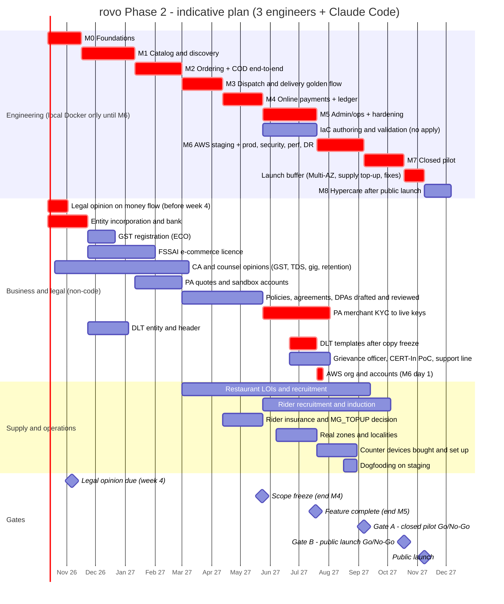

# 28 — Milestones & Dependencies (Phase 2)

| Field | Value |
|---|---|
| **Purpose** | Sequence the Phase 2 backlog (doc 27) into milestones M0–M8 with exit criteria, show dependencies (code and non-code), give an honest calendar for a small team, and name the critical path. |
| **Owner** | Release Architect |
| **Status** | Draft v1 (2026-10-04) — conforms to baseline §8 (R1–R26) and §9 (R27–R48, cuts C1–C20, missing items M1–M17) |
| **Depends on** | `00-planning-baseline.md` (§4a, §8, §9); `02-v1-scope.md` (§5 gates, as amended by R47); `20-testing-strategy.md` (§17 UAT/pilot, §22 release gates, load model per R45); `21`–`25` (CI/CD, deployment, DR, observability, cost per R46); `27-implementation-backlog.md`; `31-review-report.md`. |
| **Feeds** | `29-production-readiness-checklist.md`, `30-risks-assumptions-decisions.md`, `32-final-plan-summary.md`, `33-phase2-implementation-prompt.md`. |

---

## 1. Planning assumptions (state them, then challenge them at M0 exit)

| # | Assumption | Consequence if wrong |
|---|---|---|
| PA-1 | **Team:** 3 full-time engineers (backend lead in Go; frontend lead in React/PWA; full-stack engineer who also owns DevOps/IaC), each using **Claude Code** for most code and test generation. Part-time: product/ops lead (≈ 0.5), Telugu-speaking UX/content reviewer (≈ 0.2), finance admin from M4 (≈ 0.3), counsel + CA (engaged per task). Ops/support agents and field staff join from M5–M6. | With 2 engineers the M0–M5 phase stretches from ≈ 40 to ≈ 60 weeks (§3.3). |
| PA-2 | **Throughput:** 4 ideal engineer-days per engineer per week (rest = meetings, reviews, support of non-code work) ⇒ ≈ 12 ideal days/week for the team. | Measured at M0 exit; re-plan if actual < 10/week. |
| PA-3 | **Effort:** doc 27 Appendix B sizes (S = 1, M = 2.5, L = 5 ideal days with Claude Code) ⇒ ≈ 481 ideal days for M0–M5, ≈ 63 for M6. | Weights are a hypothesis; without AI assistance multiply by 1.6–2. |
| PA-4 | **Development M0–M5 runs entirely on local Docker Compose with fakes** (user directive, R24): no cloud account, no cloud spend, no card-requiring free tier. PA sandbox is reached from local through a card-free tunnel only for adapter testing. AWS accounts are opened on **day 1 of M6**. IaC is written and validated (no `apply`) during M5. | Any earlier cloud need is a directive change and must be approved by the user. |
| PA-5 | **Holidays** inside the plan: Diwali (≈ 8 Nov 2026), year-end, Sankranti (≈ 14–15 Jan 2027), Ugadi (≈ Mar 2027), Dasara (≈ Oct 2027), Diwali (≈ 29 Oct 2027) `[ASSUMPTION – verify dates]`. Absorbed in milestone durations; the public launch is placed **after Diwali 2027**. | Festival weeks are also demand peaks — a pilot during Dasara is a useful stress test but needs ops staffing. |
| PA-6 | **Phase 2 starts Monday 2026-10-12** (one week after this plan). | Shift all dates by the delay. |
| PA-7 | Planning volumes (R45): closed pilot ≈ 30 orders/day; month 1 ≈ 80/day; month 3 ≈ 250/day; design point 2,000/day, 500/h peak; load test at 1,500/h + 3,000 SSE. | Infra profile choice (R32) and costs (R46) follow these. |

---

## 2. Milestones and exit criteria

Each milestone ends with a demo, a bug bash (doc 20 §17) and the exit checklist below. A milestone exits only when every P0 story planned for it meets the Definition of Done (doc 20 §22.1). Unfinished P1 parts move or are cut (doc 27 Appendix D).

### M0 — Foundations (5 weeks: 2026-10-12 → 2026-11-15)
Scope: E00, E01, E02-S01/S02/S04/S05, E16-S01 (doc 27). Non-code start: E28-S01 (entity), **E28-S02(a) legal opinion on money flow — due before Phase-2 week 4 (R35)**, E28-S11 domain.

Exit criteria:
1. `make bootstrap && make dev` brings up the full local stack in ≤ 15 min on amd64 and arm64 (multi-arch PostGIS image).
2. OpenAPI 3.1-vs-3.0.3 decision recorded in week 1 (R20); codegen drift and oasdiff gates live.
3. CI on every PR: lint, unit, integration (testcontainers), security scans, arch rules; ≤ 12 min.
4. Testhooks build (`/_test/*`, fake clock, seedable IDs) proven by an E2E that advances the clock and sees a River timer fire (R19); prod image provably lacks the tag.
5. Phone OTP login with fake provider, sessions, CSRF and the generated authz matrix running.
6. **Velocity checkpoint:** actual ideal-days/week measured; this plan re-baselined if < 10.
7. Legal opinion on PA money flow received or escalated (it decides whether E08-S07 and PA linked-account KYC are on the critical path).

### M1 — Catalog & discovery (8 weeks: 2026-11-16 → 2027-01-10)
Scope: E03, E04-S01..S03, E05-S01..S07, E06-S01/S02, E14-S01, E15, E16-S02/S03, E17-S01..S04, E18-S02, E20-S01/S02, E02-S03/S06/S07, E22-S02.

Exit criteria:
1. Ops (admin app) can create a restaurant end-to-end on behalf of an owner: application, KYC images, approval, menu with Telugu names and images, hours (assisted onboarding).
2. A guest customer picks language and location, sees only serviceable restaurants with fee + ETA, searches, opens a menu, customises items and gets a server quote with the correct bill (golden quote tables pass, R8/R12/R18).
3. Serviceability boundary fixtures (holes, 7.0/7.1 km, paused zone, service hours) pass.
4. en + te key parity enforced in CI; 360 px screens reviewed in both locales.
5. Audit log written for every admin change (append-only grants).

### M2 — Ordering + COD end-to-end on local (7 weeks: 2027-01-11 → 2027-02-28)
Scope: E07-S01..S09, E11-S01..S04, E06-S04/S05, E02-S09, E16-S04, E17-S05/S06/S08, E18-S03, E21-S01..S03, E21-S05.

Exit criteria:
1. On local Compose with fakes: customer logs in at checkout, places a **COD** order with idempotency; restaurant device rings (looping alarm, push), accepts with prep time; R3 auto-`PREPARING`; ready; the order is completed through admin "status on behalf" (dispatch arrives in M3).
2. **R1 ladder** verified on the fake clock: repeat every 30 s, owner SMS (fake) at 60 s, ops flag at 90 s, `CANCELLED`/`SYSTEM`/`RESTAURANT_UNRESPONSIVE` at 180 s, 30-min auto-pause; device heartbeat loss (3 min) auto-pauses.
3. Customer cancel rules (R2) and coupon redemption/restore pass F-5 and coupon concurrency tests.
4. SSE stream with 20 s heartbeat, refetch-on-reconnect and polling fallback (F-13); LISTEN watchdog recovers within 30 s.
5. Transition-table coverage 100% for orders; chaos C-1 and C-8 pass locally.

### M3 — Dispatch & delivery golden flow (6 weeks: 2027-03-01 → 2027-04-11)
Scope: E04-S04, E07-S10, E09-S01/S03/S04, E10, E12, E14-S02, E19-S01..S03, E20-S03, E21-S04, E23-S01, E26-S01.

Exit criteria:
1. **Golden flow, COD variant, green nightly 5 days in a row** (E26-S01): customer → restaurant → rider offer (45 s cascade, two staleness tiers R34) → pickup → delivery → cash collected (ledger) → rating, in en and te.
2. F-3 (no rider → manual assign), F-7 (cash limit), F-8 (cascade), F-12 (undeliverable with support approval, R5) green.
3. Ledger invariants INV-L1..L3 hold after every E2E run; rider cash-in-hand equals ledger.
4. Live ops board shows SLA flags within 5 s; local dashboards show every alert metric.
5. **Non-code:** PA sandbox accounts exist (E28-S05) so M4 can start the real adapter; restaurant LOIs started.

### M4 — Online payments + ledger/settlement (6 weeks: 2027-04-12 → 2027-05-23) — **scope freeze at exit**
Scope: E08, E09-S02/S05/S06/S07, E13-S01, E06-S03, E02-S08, E04-S06, E17-S07, E18-S04, E19-S04, E20-S04, E26-S02.

Exit criteria:
1. Online golden flow green with fakepay **and** against the PA sandbox via tunnel (contract suite on recorded fixtures in CI).
2. F-1, F-4a..e (delayed, duplicate, out-of-order, failed-then-retried, never-arriving webhooks), F-14 green; never two captures; refund ≤ captured under concurrency.
3. A full weekly cycle on local: statements → payout batch → maker-checker approval (R31) → bank CSV → UTRs → `PAID`; COD compensation by UPI refund or coupon (R29); `MG_TOPUP` adjustment posts once.
4. Invoices and statements match the **CA-signed golden set** (M14); PA sample settlement file reconciles 100% (planted mismatch caught).
5. Money-flow model configured per the legal opinion (split settlement built or stubbed).
6. **Scope freeze:** after M4 exit, additions follow doc 02 §6 "one in, one out".

### M5 — Admin/ops + notifications hardening (8 weeks: 2027-05-24 → 2027-07-18) — **feature complete at exit**
Scope: E13-S02..S04, E14-S03..S07, E11-S05, E04-S05, E05-S08, E07-S11 (P1), E17-S09/S10, E18-S01/S05, E20-S05..S07, E22-S01/S03, E23-S02/S03, E24-S02 (IaC authored, validated, no apply), E26-S03/S06/S08, E27, E02-S10 (P1).

Exit criteria:
1. All P0 stories of M0–M5 done; all F-1..F-14 green nightly; authz matrix + IDOR suites green.
2. Support console resolves missing-item / late / payment tickets end to end; grievance clock visible; KPIs equal CSV exports.
3. DPDP: deletion with erasure map, data-access queue, retention jobs with catch-up, consent re-prompt.
4. SMS adapter integrated with DLT template IDs (templates filed with operators right after **copy freeze in week 4 of M5**).
5. `te-pending` empty and native-speaker sign-off; device lab bought and first matrix pass; k6 K-1/K-2 at 1× locally.
6. OpenTofu for **both profiles** (`closed-pilot`, `public-launch`) validates with policy checks; budgets per R46 written.
7. **Non-code:** policies/agreements in counsel review; PA KYC submitted; rider insurance and `MG_TOPUP` decision made; rider recruitment started.

### M6 — Cloud staging + production on AWS, security/perf/DR (7 weeks: 2027-07-19 → 2027-09-05)
Scope: E24-S01, S03..S09, E22-S04..S06, E23-S04..S06, E25, E26-S04/S05/S07, E29-S01/S02/S04/S05/S09, start of E29-S06 (dogfooding).

Exit criteria (= **Gate A** inputs; full list in doc 29):
1. AWS org (4 accounts), guardrails, budgets live; staging and production built **only** from OpenTofu with the `closed-pilot` profile; CI/CD deploys signed images by digest with OIDC.
2. Golden flow (COD + PA sandbox) green on staging in en and te; post-deploy synthetic order green.
3. Capacity report: 3× peak (1,500 orders/h, 3,000 SSE) on public-launch shape and pilot-shape run (R45); chaos C-3b/C-3c/C-9b pass.
4. Restore drill (PITR or dump) done within 7 days of Gate A with RTO/RPO in target; CERT-In 180-day India log archive live (M1/R36).
5. External pentest: 0 open High/Critical; ASVS L2 self-assessment filed; IR tabletop done.
6. A11y audit of P0 flows: 0 critical/serious.
7. Production live with PA **live keys** and one real settlement reconciled; DLT templates approved and real OTPs delivered on Jio/Airtel/Vi/BSNL.
8. ≥ 10 restaurants with tested counter devices and ≥ 10 riders onboarded in prod, 1 zone drawn (R47); support line staffed; runbooks rehearsed; 2-week dogfooding complete.

### M7 — Closed pilot (6 weeks: 2027-09-06 → 2027-10-17)
Scope: E29-S06 (pilot), E24-S10 (switch to `public-launch` profile before Gate B or at > 100 orders/day), E11-S06 voice escalation if > 5% of orders reach 90 s (R43), pilot fixes (≈ 40% of engineering capacity reserved), supply growth to Gate B targets.

Exit criteria (= **Gate B** inputs):
1. Last 14 days of pilot meet doc 29 §G (pilot performance) incl. acceptance, delivery time, cancellations, COD reconciliation 100% for two weekly closes, two payout cycles with zero statement/payout mismatches, crash-free ≥ 99.5%.
2. `public-launch` profile applied (Multi-AZ, NAT, ≥ 2 API + ≥ 2 workers); AZ-failover test documented.
3. ≥ 40 restaurants live with category coverage; rider pool sized by demand model (≈ 1 online rider per 3 peak-hour orders, R47).
4. All P0 LEG items closed or risk-accepted in writing by counsel/CA.

### M8 — Public launch in Mahabubnagar (launch 2027-11-08 after a 3-week buffer; hypercare to 2027-12-05)
Scope: E29-S07, E29-S08 (P1). The 3-week buffer (2027-10-18 → 11-07) absorbs supply top-up, Gate B fixes and the Diwali week.

Exit criteria (end of hypercare): SLOs met for 4 weeks; no open S1/S2; daily reconciliation clean; doc 01 §4 targets re-baselined from pilot data; V1.1 backlog ranked (doc 02 §3).

---

## 3. Calendar and capacity

### 3.1 Summary

| Milestone | Start | End | Weeks | Planned effort (ideal days) | Capacity at 12/week |
|---|---|---|---|---|---|
| M0 | 2026-10-12 | 2026-11-15 | 5 | 63 | 60 |
| M1 | 2026-11-16 | 2027-01-10 | 8 | 101 | 96 (Diwali + year-end inside) |
| M2 | 2027-01-11 | 2027-02-28 | 7 | 82.5 | 84 (Sankranti inside) |
| M3 | 2027-03-01 | 2027-04-11 | 6 | 73.5 | 72 |
| M4 | 2027-04-12 | 2027-05-23 | 6 | 71 | 72 |
| M5 | 2027-05-24 | 2027-07-18 | 8 | 90 | 96 |
| **M0–M5 (local only)** | | | **40** | **≈ 481** | **≈ 480** |
| M6 | 2027-07-19 | 2027-09-05 | 7 | 62.5 | 84 (slack absorbs external waits: pentest slot, PA/DLT approvals) |
| M7 | 2027-09-06 | 2027-10-17 | 6 | 3.5 + pilot fixes | 72 |
| Buffer | 2027-10-18 | 2027-11-07 | 3 | — | — |
| **M8 launch** | **2027-11-08** | hypercare → 2027-12-05 | 4 | — | — |

**Honest reading:** M0–M5 has **no slack** at the assumed throughput. The only explicit buffers are M6's spare capacity and the 3-week pre-launch buffer. If M0 velocity is below 12 ideal days/week, the plan moves out roughly one week per 12 ideal days of shortfall, or scope is cut (P1 parts first, then the list in §5).

### 3.2 Gantt (indicative)



### 3.3 Team-size variants

| Variant | M0–M5 | Gate A | Public launch | Notes |
|---|---|---|---|---|
| **3 engineers (base)** | ≈ 40 weeks | ≈ Sep 2027 | ≈ Nov 2027 (after Diwali) | As above |
| 2 engineers | ≈ 60 weeks | ≈ Jan 2028 | ≈ Mar 2028 | Or cut: admin polish (E20-S07 parts), E02-S10, E07-S11, E17-S10, E11-S06, partner self-registration UI (E18-S01; ops-assisted onboarding only) — saves ≈ 25 ideal days |
| 4 engineers | ≈ 31–33 weeks (15% coordination overhead) | ≈ Jul 2027 | ≈ Sep 2027 | Non-code items (PA live, DLT, FSSAI) and supply recruitment become the binding constraint, not code |

---

## 4. Critical path

### 4.1 The path

```
M0 → M1 → M2 → M3 → M4 → M5 (all local)
   → M6: AWS org/accounts (day 1) → IaC apply (closed-pilot profile) → staging → prod
         → capacity test + pentest fixes + restore drill + CERT-In archive
   → Gate A (also needs: PA live + real settlement, DLT templates + 4-operator OTP test,
             published policies, grievance officer, ≥ 10 restaurants with devices, ≥ 10 riders)
   → M7 pilot (≥ 4 weeks incl. 2 weekly payout cycles; last 14 days measured)
   → switch to public-launch profile (Multi-AZ, NAT, 2+2 tasks)
   → Gate B (≥ 40 restaurants, demand-sized rider pool, all P0 LEG closed/risk-accepted)
   → buffer → public launch → 4-week hypercare
```

### 4.2 Non-code items on or near the critical path

| Item (doc 27) | Must be done by | Lead time `[ASSUMPTION]` | Slack in base plan | Why it matters |
|---|---|---|---|---|
| **Legal opinion on money flow** (E28-S02a) | Phase-2 week 4 (2026-11-06) | ≤ 3 weeks | 0 | Decides split settlement (E08-S07) and whether PA linked-account KYC per restaurant joins onboarding (R35). |
| Entity + bank (E28-S01) | 2026-11-23 | 4–6 weeks | ≈ 6 months before PA KYC | Prerequisite for GST, FSSAI, DLT, PA, AWS. |
| GST ECO registration (E28-S03) | before PA KYC (May 2027) | 2–4 weeks | large | Invoices need GSTIN (E06-S03). |
| FSSAI e-commerce licence (E28-S04) | Gate A | 6–10 weeks | large | LEG-FSSAI-001; displayed in app. |
| PA sandbox accounts (E28-S05) | end of M3 (2027-04-11) | days | ≈ 4 weeks | Real adapter work starts in M4. |
| **PA KYC → live keys → first real settlement** (E28-S05) | Gate A (2027-09-06) | 4–8 weeks (+ linked-account KYC if split) | ≈ 3–5 weeks | Needs entity, bank, GSTIN, a public website with policies (E28-S07). |
| **DLT templates** (E28-S06) | M6 week 3 (real OTP tests) | 1–7 working days each, after copy freeze in M5 week 4 | ≈ 3 weeks | No real OTP ⇒ no login in production. |
| Policies/agreements/DPAs (E28-S07) | PA KYC submission (M5 start) and Gate A publication | 6–8 weeks of counsel time | ≈ 2 weeks | PA KYC needs the website policies. |
| Grievance officer, CERT-In PoC, support line (E28-S08, E29-S05) | Gate A | 1–2 weeks | ≈ 4 weeks | LEG-CP-001/002, SEC-167, M9. |
| AWS accounts, payment method, budget approval (E28-S11) | M6 day 1 (2027-07-19) | 1 week | 0 (user directive puts it at M6) | Everything in M6 depends on it; prepare paperwork in M5. |
| **Supply** (E29-S03, E29-S09) | Gate A: ≥ 10 restaurants with tested counter devices, ≥ 10 riders; Gate B: ≥ 40 restaurants, demand-sized riders | Months of field work (≈ 2–3 restaurants/week realistic with bulk CSV import) | Gate B: ≈ 0–2 weeks | **Most likely real critical path to Gate B.** Start LOIs in M3; onboarding into prod only from M6 week 4. |
| Rider insurance & `MG_TOPUP` decision (E28-S10) | before rider recruitment (M5) | 4–6 weeks | ≈ 4 weeks | Rider supply viability (R47). |

---

## 5. Dependency graph (epic level)

```mermaid
flowchart LR
    classDef crit fill:#fde2e1,stroke:#c0392b,stroke-width:2px,color:#000
    classDef noncode fill:#fff4d6,stroke:#b7791f,stroke-dasharray:4 3,color:#000
    classDef gate fill:#e3f2e1,stroke:#2f855a,stroke-width:2px,color:#000

    subgraph M0["M0 Foundations"]
      E00[E00 repo, compose, CI, OpenAPI spike, testhooks]
      E01[E01 platform: config, OTel, DB, River, HTTP, idempotency, rate limits, clock]
      E02a[E02 identity core: OTP, tokens, authz]
      E16a[E16 api-client]
    end
    subgraph M1["M1 Catalog and discovery"]
      E03[E03 geo and serviceability]
      E04a[E04 restaurant application and KYC]
      E05[E05 catalog and menu]
      E06a[E06 fee config and quote engine]
      E15[E15 media]
      E14a[E14 audit log]
      UI1[E16 ui/i18n + E17 browse + E18 menu + E20 shell]
    end
    subgraph M2["M2 Ordering + COD local"]
      E07[E07 order state machine, timers]
      E11[E11 SSE, notifications, alert loop]
      E06b[E06 coupons, commission]
      UI2[E17 checkout/tracking + E18 inbox + E21 PWA]
    end
    subgraph M3["M3 Dispatch and delivery"]
      E10[E10 dispatch and delivery]
      E09a[E09 ledger core, COD cash, rider pay]
      E12[E12 ratings]
      UI3[E19 rider app + E20 live board]
    end
    subgraph M4["M4 Online payments and money"]
      E08[E08 payments: fake PA, sandbox adapter, refunds, recon]
      E09b[E09 settlement, payouts, adjustments]
      E13a[E13 maker-checker]
      UI4[E20 finance console]
    end
    subgraph M5["M5 Admin, ops, hardening"]
      E13b[E13 tickets, resolutions]
      E14b[E14 reports, config, KPIs]
      E27[E27 privacy and retention]
      E22a[E22 web security, test suites]
      E24a[E24 IaC authoring, two profiles]
      E26a[E26 load suite, device lab, Telugu QA]
    end
    subgraph M6["M6 AWS staging + prod"]
      E24b[E24 AWS org, apply, pipelines]
      E23[E23 cloud telemetry, CERT-In archive, SLOs]
      E25[E25 backups, DR runbooks, restore drill]
      E26b[E26 capacity test, chaos, a11y audit]
      E22b[E22 pentest, IR readiness]
      E29a[E29 runbooks, training, support line, devices]
    end

    L1[E28-S01 entity and bank]:::noncode
    L2[E28-S02 legal opinion on money flow, week 4]:::noncode
    L3[E28-S03 GST ECO registration]:::noncode
    L4[E28-S04 FSSAI e-commerce licence]:::noncode
    L5[E28-S05 PA sandbox then KYC and live keys]:::noncode
    L6[E28-S06 DLT entity, header, templates]:::noncode
    L7[E28-S07 policies, agreements, DPAs]:::noncode
    L8[E28-S08 grievance officer, CERT-In PoC]:::noncode
    L11[E28-S11 domain, AWS payment method, budget]:::noncode
    SUP[E29-S03 supply: 10 then 40 restaurants, riders]:::noncode

    GA{{Gate A closed pilot}}:::gate
    PIL[M7 closed pilot on closed-pilot profile]:::crit
    PL[E24-S10 public-launch profile Multi-AZ]:::crit
    GB{{Gate B public launch}}:::gate
    M8[M8 launch and hypercare]:::crit

    M0 --> M1 --> M2 --> M3 --> M4 --> M5 --> M6 --> GA --> PIL --> PL --> GB --> M8
    L1 --> L3 & L4 & L6 & L5
    L2 --> E09b & E08
    L3 --> L5
    L7 --> L5
    L5 -->|sandbox by end M3| E08
    L5 -->|live keys| GA
    L6 --> GA
    L4 --> GA
    L8 --> GA
    L11 --> E24b
    SUP --> GA
    SUP --> GB
    E24b --> E23 & E25 & E26b & E22b

    class M0,M1,M2,M3,M4,M5,M6 crit
```



Key story-level dependencies (full list in doc 27 "Deps" column):

| From | To | Reason |
|---|---|---|
| E00-S06 (OpenAPI spike) | every API story | Spec-first codegen (R20). |
| E00-S09 + E01-S08 (testhooks, clock) | every timer story (E07-S04/S07, E10-S03, E11-S04, E09-S05) | Deterministic time (R19). |
| E01-S04 (River, `InsertManyTx`, catch-up) | E07-S07, E11-S02, E09-S05, E27-S03 | R22, R42, M11. |
| E06-S02 (quote) | E07-S03 (place order) | R12. |
| E07-S02 (order machine) | E10-S02 (delivery machine) | Coupled transitions (doc 13 §3). |
| E09-S01 (ledger core) | E09-S03 (COD cash, M3), E08-S05 (refunds), E09-S05 (settlement) | Money traceability. |
| E13-S01 (maker-checker) | E09-S06, E04-S06, E02-S08, E06-S01/S05 | R31 families. |
| E28-S02 (legal opinion) | E08-S07, E06-S03, E09-S02 | R25, R35, M14. |
| E28-S05 (PA sandbox) | E08-S04, E08-S08 | Real adapter and settlement files. |
| E24-S01 (AWS org) | all of M6 | R24: no cloud before M6. |

---

## 6. Release train and gates

| Gate | When | Decision owner | Inputs |
|---|---|---|---|
| Legal opinion checkpoint | 2026-11-06 | Lead + founders | E28-S02(a) |
| M0 velocity checkpoint | 2026-11-15 | Release Architect | Measured throughput; re-baseline §3 |
| Scope freeze | 2027-05-23 (M4 exit) | Product + Lead + Release | Doc 02 §6 thereafter |
| Copy freeze (DLT/legal text) | M5 week 4 (≈ 2027-06-20) | Product + UX | Templates filed (E28-S06) |
| Feature complete | 2027-07-18 (M5 exit) | Lead | All P0 stories done |
| **Gate A** (closed pilot) | ≈ 2027-09-06 | Go/No-Go board (doc 29 §15) | Doc 29 items tagged A |
| **Gate B** (public launch) | ≈ 2027-10-18 | Go/No-Go board | Doc 29 items tagged A + B |
| Launch | 2027-11-08 | Founders | Gate B "Go" + launch-day plan |

Release cadence: `main` deploys to staging continuously from M6; production releases by approved tag (doc 21 §7.2), avoiding meal peaks; weekly release train during pilot, hotfixes as needed.

---

## 7. What would change this plan

- **Velocity below assumption** at M0 exit → re-baseline; apply the 2-engineer cut list in §3.3.
- **Legal opinion mandates split settlement** → E08-S07 full scope (L) in M4, and PA linked-account KYC per restaurant on the Gate A/B supply path (add ≈ 1–3 days per restaurant).
- **PA live approval slips** beyond 2027-09-06 → Gate A slips (a COD-only pilot is possible only with a written Lead decision; it does not test G1 for online).
- **Supply short of 40 restaurants** at 2027-10-18 → use the 3-week buffer; if still short, launch is postponed, not the bar lowered (R47).
- **User relaxes the local-only directive** → staging could start in M4, de-risking M6 by ≈ 2–3 weeks (decision for the user, logged in doc 30).
