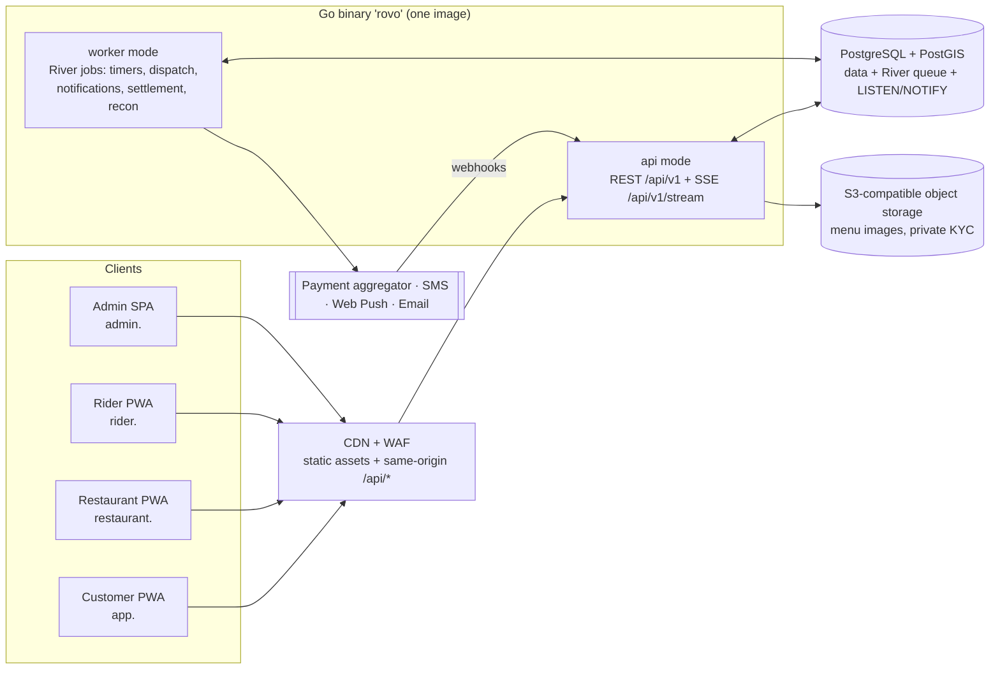

# 32 — Final Plan Summary (Phase 1 close-out)

| | |
|---|---|
| **Purpose** | Condensed, decision-level summary of the Phase 1 plan (sections A–J). It is the entry point for stakeholders and for Phase 2. |
| **Owner** | Lead Architect |
| **Status** | Final v1 — 2026-10-04 |
| **Dependencies** | `00`–`31`. On any conflict, `00` §8/§9 rulings (R1–R56) win. |

**How the plan was produced.** Ten specialist planning agents worked on it:
- Product, UX, Solution, Backend, Frontend, DevOps, Security and QA each drafted their own area independently (docs 01–26), from a shared baseline (`00`).
- The Release Architect produced the backlog, milestones, readiness checklist and risk register (27–30).
- The Reviewer red-teamed everything (31): 86 findings, 5 of them Blockers.

The Lead resolved every conflict explicitly (R1–R56) and reconciled all documents to v1.1. Two user directives shaped the hosting plan:
1. Production must run on a standard, managed cloud, not free or non-standard hosting.
2. Development runs on local Docker only, with no free tier that asks for card details.

---

## A. Recommended Architecture

**A modular monolith in Go, REST/OpenAPI-first, on PostgreSQL + PostGIS, with four static React PWAs.** Simplicity was chosen over fashionable distribution (ADR-001…026, `09`).

| Concern | Decision | Why / trade-off |
|---|---|---|
| Style | **Modular monolith**, 15 modules (identity, users, geo, catalog, pricing, promotions, ordering, payments, dispatch, ledger, ratings, notifications, support, adminaudit, reporting). Compiler-enforced boundaries (nested `internal/`), go-arch-lint/depguard; vendor SDKs only in `adapters/` | 2–3 engineers, one city. Microservices would multiply ops cost without benefit. Modules can be extracted later along these seams. |
| Language | **Go** (latest stable), stdlib `net/http` router, `slog`, pgx, sqlc, goose | Low memory, fast, simple deploys, strong concurrency for SSE and timers. |
| API | **REST/JSON, OpenAPI 3.1 spec-first** (restricted subset; 3.0.3 fallback after a week-1 tooling spike), oapi-codegen strict server + generated TS client. **No gRPC in V1** | One contract for web now and native apps later. gRPC adds nothing without internal network hops. |
| Async | **River** (Postgres-backed jobs). The transactional job insert **is** the outbox: one job per subscriber via `InsertManyTx`. **No Kafka/NATS, no outbox table** | Exactly-once-ish with idempotent handlers and no extra infrastructure. |
| Real-time | **SSE** single stream, 20 s heartbeat, `reauth` event, 30-min stream cap, refetch on reconnect; LISTEN/NOTIFY between processes; **Web Push** for backgrounded apps | One-way updates are enough. Simpler than WebSockets through CDNs. |
| Cache | **No Redis at V1.** Interfaces with in-memory/Postgres implementations; rate limits in Postgres. Managed Redis is a config change when > 1 replica needs it | Fewer moving parts. |
| Frontend | **Four Vite + React + TS PWAs** (`customer`, `restaurant`, `rider`, `admin`) as static assets; TanStack Router/Query, Tailwind + Radix, i18next (en/te). **Next.js evaluated and rejected**; build-time prerender cut | No frontend server to run or pay for; better PWA app shell. SEO later via Go-served share pages (P1). |
| Dispatch | Rule-based offers: tier 1 fresh location ≤ 3 min, tier 2 stale ≤ 15 min via push; 45 s offer timeout cascade; manual admin assign; one active delivery per rider | No route optimisation or live GPS in V1. |
| Geo | PostGIS zones (polygons) + localities; haversine × 1.3 road factor; no paid maps or geocoding (MapLibre + open tiles, pin-drop + landmark) | Cost; Indian addressing relies on landmarks. |
| Observability | OpenTelemetry → Grafana Cloud (incl. Faro for frontend); CERT-In 180-day log archive in India | Vendor-neutral OTLP. |
| Containers | OCI images (multi-arch); Docker Compose locally; ECS Fargate in production; **Kubernetes-ready, no Kubernetes in V1** | Same image everywhere. |

## B. Recommended Hosting Stack

The original brief asked for a free primary and fallback stack. Research of free tiers (verified 2026-10-04, doc 25 Part A, sources S1–S85) showed:
- **No free tier offers always-on compute + PostGIS + background workers without a card.** Render, Koyeb and Neon free tiers sleep. Fly.io has no free tier. Northflank's sandbox forbids production use.
- The best free option, Oracle Always Free, needs a card. Oracle also halved its free allowance without notice in June 2026.

Following the user directives, the recommendation is therefore:

| Use | Primary | Fallback |
|---|---|---|
| **Development (M0–M5)** | **Local Docker Compose** (₹0, no card): Postgres+PostGIS (own multi-arch image), MinIO, Mailpit, Grafana LGTM, fake OTP / payment aggregator (PA) / push providers. CI on GitHub Actions (public repo, free). | Shared demos: run the local stack and expose it temporarily through a card-free tunnel. Oracle/other free tiers: **reference only**. |
| **Staging + production (from M6)** | **AWS ap-south-1 Mumbai** (DR backups to ap-south-2 Hyderabad): • Compute: ECS Fargate ARM, separate `api` and `worker` services • Database: RDS PostgreSQL 17 + PostGIS; Single-AZ db.t4g.small in the closed pilot, Multi-AZ before public launch • Edge: S3 + CloudFront flat-rate Pro (WAF included), `/api/*` same-origin • Platform: Secrets Manager, KMS, OpenTofu IaC, GitHub OIDC | **GCP** (Mumbai/Delhi): Cloud Run with instance billing + worker pool, Cloud SQL HA. ≈ 33% dearer at pilot unless Google startup credits apply. Azure was ranked third (dearer HA; Blob is not S3-compatible). |

**Monthly cost** (ex-GST, doc 25 §15):

| Item | Cost |
|---|---|
| `closed-pilot` profile | ≈ **₹15,700** |
| `public-launch` profile | ≈ **₹28,400** |
| Staging (scheduled down) | ≈ ₹4,500 |

**Cloud cost per order** (prod + staging):

| Phase | Volume | Cloud ₹/order |
|---|---|---|
| Closed pilot | 30 orders/day | ≈ ₹22 |
| Month 1 | 80 orders/day | ≈ ₹14 |
| Month 3 | 250 orders/day | ≈ ₹4.4 (meets the ≤ ₹6 target) |
| Design point | 2,000 orders/day | ≈ ₹1 |

**Other costs:**
- **Payment aggregator fees** are the largest variable cost, about 2% (≈ ₹7 on a ₹361 basket). The written PA rate is a go/no-go criterion at selection (Cashfree vs Razorpay).
- **SMS sender (DLT) registration** is ₹5,900 one-time.

## C. V1 Feature List

The golden flow is: Customer → Restaurant → Order → Delivery Partner → Pickup → Delivery → Payment/Settlement → Rating. Detail and IDs are in `01`/`02`; the 197 stories are in `27`.

- **Customer (`app.`)**
  - Phone OTP login, deferred to checkout (guests can browse).
  - Language: en/te.
  - Serviceability check and waitlist.
  - Addresses: map pin + required landmark.
  - Discovery: categories, veg-only, sort/filter, search with synonyms.
  - Restaurant and menu pages with veg/non-veg/egg markers and a fee disclosure.
  - Item customisation: variants and add-on groups.
  - Cart: single restaurant, stateless signed quote, "what changed" re-confirm.
  - Checkout:
    - COD: cap ₹1,000, or ₹600 on a first order.
    - UPI/card through the payment aggregator.
    - Bill: GST lines and a rupee round-off.
  - Order tracking by status milestones (no live map).
  - Delivery OTP for prepaid orders of ₹300 or more.
  - Cancellation: free while `PLACED` or within 60 s of placing.
  - Order history and reorder.
  - Ratings: restaurant stars and tags, rider thumbs up/down.
  - One coupon per order.
  - Help tickets.
  - Web Push.
- **Restaurant (`restaurant.`)**
  - Self-signup and onboarding: FSSAI, PAN, bank, GSTIN optional; images only.
  - Admin approval.
  - Profile, operating hours, holidays, pause.
  - Menu management (with an ops-side bulk CSV import) and item availability.
  - Order inbox:
    - "Start shift" unlocks the alarm, keeps the screen awake, and enables push.
    - Accept within 180 s, choosing a prep time; reject with a reason.
    - Escalation: push every 30 s, owner SMS at 60 s, ops at 90 s, system cancel and auto-pause at 180 s.
  - Preparing → ready; handover by order-code match.
  - Basic analytics (today/week) and payout statements.
- **Delivery partner (`rider.`)**
  - Registration and KYC: DL, RC, PAN, bank/UPI; no full Aadhaar.
  - Approval.
  - Online/offline with foreground location.
  - Offers with a 45 s countdown; accept/decline.
  - Google Maps deep links.
  - Arrival → pickup → drop.
  - COD collection, with a cash-in-hand limit of ₹2,000.
  - `tel:` contact only during an active delivery (logged).
  - Undeliverable flow with support approval.
  - Earnings, history, cash deposits.
  - SOS.
- **Admin (`admin.`)**
  - Dashboard and live order board with interventions: reassign, manual assign, cancel, refund.
  - Users, restaurants and riders: approval, KYC review, suspension.
  - Commissions (effective-dated), zones and fee configuration.
  - Coupons: platform- or restaurant-funded.
  - Disputes/tickets.
  - Weekly settlement and payout batches with UTR.
  - COD reconciliation.
  - Reports (CSV) and an append-only audit log.
  - Maker-checker for 5 money/privilege action families.
  - TOTP mandatory.
- **Deferred:** multi-city operations, AI recommendations, loyalty, subscriptions, advanced analytics, route optimisation, live GPS, native apps, microservices.
- **Also cut to V1.1+:** surge pricing, WhatsApp OTP, tipping, masked calling, automated payouts, scheduled/group orders, wallets, review moderation queue, Telugu romanisation search, prerendering, identity-aware proxy (IAP) for admin, ClamAV.

## D. Database Design Summary

Doc `10`; **90 tables** plus River's own.

- **Database:** PostgreSQL 17 (18 if offered) + PostGIS. Extensions are limited to postgis, btree_gist, citext, pg_trgm and pgcrypto.
- **Keys and types:**
  - UUIDv7 keys generated in the app.
  - Human order codes like `RV-7K3P9Q`.
  - `timestamptz` in UTC; city timezone for operating hours.
- **Money:** `BIGINT` paise plus a currency column. No floats.
- **Statuses:** `TEXT` with `CHECK` constraints, canonical uppercase names.
- **Translations:** `*_i18n` JSONB; the API returns `nameI18n` and `displayName`.
- **Multi-city ready:** a `cities` table and `city_id` on zones, localities, restaurants, riders, orders, pricing configs, coupons and admin scopes.
- **Geo:** zones are `geometry` polygons; points are `geography`; GiST indexes.
- **Orders:** full snapshots (restaurant, address, items, bill lines including `ROUND_OFF` and tax lines), a `version` column for optimistic locking, and append-only status history.
- **Ledger:** double-entry `ledger_journals`/`ledger_postings`. A DB trigger rejects unbalanced journals. Accounts cover customer, platform revenue, restaurant payable, rider payable, rider cash-in-hand, gateway clearing, GST/TDS payable and refunds. Payouts, `cod_deposits`, PA `transfers`/`pa_settlements` and `recon_exceptions` sit alongside.
- **Module ownership:** each table belongs to one module. FKs run within a module, to `cities`/`users`, and to `orders` on money paths only.
- **Supporting tables:**
  - `approval_requests` (maker-checker), `reason_codes`, `restaurant_devices` (heartbeat), `rider_availability`.
  - `rate_limit_buckets`, `idempotency_keys`, `erasure_requests` (DPDP), `audit_logs` (append-only, enforced by grants), `app_config` (owns tunables).
- **Partitioning:** none on day one. Retention jobs handle growth; a table is partitioned only past about 10M rows.
- **Migrations:** expand/contract only.

## E. API Summary

Doc `11`; about 270 operations catalogued (a superset — only operations needed by P0 stories in `27` are built, in golden-flow order).

- **Conventions:**
  - Paths:
    - `/api/v1` served same-origin on each app host; no CORS.
    - The `api.` host only receives inbound provider webhooks in V1 (R55); later it serves native apps with bearer tokens.
  - Requests and responses:
    - camelCase JSON; money as `{amountPaise, currency}`; RFC 3339 times.
    - Cursor pagination.
    - RFC 9457 problem+json errors with stable codes.
  - Write safety:
    - `Idempotency-Key` required on creating POSTs.
    - `version`/ETag for concurrency.
  - Rate-limit headers; `Accept-Language` en/te.
- **Groups:**
  - `public` (serviceability, restaurants, menu, search)
  - `auth` (OTP request/verify, refresh, logout, admin login + TOTP)
  - `customer` (profile, addresses, `POST /cart/quote` → signed `quoteId`, `POST /orders`, payments, cancel, rating, tickets)
  - `partner/restaurants/{rid}/…` (onboarding, profile, hours, pause, menu, orders accept/reject/status, analytics, statements)
  - `rider/…` (onboarding, availability, batched location pings, offers accept/decline, delivery transitions, COD, earnings, deposits)
  - `admin/…` (dashboard, users, approvals, order interventions, manual assign, refunds, commissions, coupons, zones/fees, tickets, payouts, reports, audit)
  - `webhooks/payments/{provider}` (HMAC + fetch-to-confirm, idempotent)
  - `GET /stream` (SSE)
  - push subscription endpoints
- **Ten most critical operations:**
  1. `POST /auth/otp/verify`
  2. `GET /public/restaurants`
  3. `POST /cart/quote`
  4. `POST /orders`
  5. `POST /webhooks/payments/{provider}`
  6. `POST /partner/restaurants/{rid}/orders/{oid}/accept`
  7. `POST /rider/offers/{id}/accept`
  8. `POST /rider/deliveries/{id}/picked-up` and `/delivered`
  9. `GET /stream`
  10. Admin cancel and manual assign

## F. Security Model

Docs `12` and `19`: 98 threats, SEC-001…192 (four withdrawn in v1.1).

- **Identity:** one `users` identity with scoped role assignments.
  - Roles: `CUSTOMER`, `RESTAURANT_OWNER`, `RESTAURANT_STAFF`, `RIDER`, `ADMIN_SUPER/OPS/SUPPORT/FINANCE` (city-scoped), and an internal `SYSTEM` principal.
  - Admins are separate identities from consumer and partner accounts.
  - `RIDER` and `RESTAURANT_*` roles are mutually exclusive.
- **Authentication:**
  - Phone OTP for consumers and partners:
    - Indian mobile numbers only, Postgres-backed rate limits, Turnstile, and an SMS budget breaker against SMS pumping.
    - OTPs are hashed and compared in constant time.
  - Admins: argon2id password + **mandatory TOTP**; passkeys are P1.
  - WAF rate and geo rules on the admin host.
- **Sessions:**
  - Ed25519 access JWT: 10 min, or 5 min for admin.
  - Opaque rotating refresh tokens with family revocation on reuse.
  - Server-side session checks for partners and admins.
  - Device-bound long sessions for restaurant counter devices: 30 days sliding, 90 days absolute.
- **Web protections:**
  - Host-only cookies: `SameSite=Lax`, or `Strict` for admin.
  - CSRF: no token. Instead, same-origin plus Go `CrossOriginProtection`, an `X-Rovo-Client` header and JSON-only bodies.
  - The audience is derived server-side from the host, never trusted from the client.
  - No CORS.
- **Authorisation:**
  - Deny by default. RBAC matrix in middleware; ownership checks in domain services (restaurant scope, assigned rider, own orders, city scope).
  - Authorisation-matrix and IDOR tests.
  - Maker-checker for refunds/adjustments, payout release, commission/fee changes, payout-account changes and role grants. Break-glass access requires a 24 h post-review.
- **Money:**
  - The quote is server-authoritative and signed.
  - Webhooks are verified by HMAC, replay protection, and amount/currency/order matching.
  - Payout-account changes require re-auth, a 48 h cooling-off period and finance approval.
- **Data protection:**
  - KYC files are images only, re-encoded, stored with SSE-KMS, and viewed through short-lived signed URLs with audit.
  - Field-level encryption for bank account numbers and TOTP secrets.
  - Logs have PII redacted.
  - DB roles are separated (app / migrator / read-only).
  - No public DB endpoint; TLS everywhere.
- **Supply chain:** pinned dependencies, SHA-pinned Actions, govulncheck, osv-scanner, CodeQL, gitleaks, Trivy, SBOM, signed images; GitHub OIDC, no long-lived cloud keys.
- **Compliance [LEGAL]:**
  - **DPDP:** notice and consent, purpose limitation, a per-table erasure map, a grievance officer, breach notification. Core obligations apply from May 2027.
  - **CERT-In:** 6-hour incident reporting and 180-day log retention in India.
  - **PCI:** the hosted PA checkout keeps rovo SAQ-A-like.
  - **Network:** the closed pilot runs without a NAT gateway, under compensating controls; one NAT gateway is added before public launch.

## G. Testing Strategy

Doc `20`.

- **Risk focus:**
  - Paisa-exact money.
  - Duplicate, out-of-order or missing payment webhooks.
  - State-machine races.
  - Timers firing on time.
  - IDOR.
  - OTP abuse.
  - SSE behind the CDN.
  - Telugu on low-end Android.
- **Testability hooks (mandatory from sprint 1):**
  - Injected clock wired into River test time.
  - Seedable IDs.
  - Protocol-faithful fakes: PA with a webhook simulator, OTP/SMS sink, push.
  - A `/_test/*` API, compiled only with the `testhooks` tag. CI proves the production image has no test hooks.
- **Test pyramid:**
  - **Go unit tests:** table-driven; pure state transitions and pricing.
  - **Property tests** (`rapid`): journals balance, refunds never exceed the captured amount, every serviceable point has exactly one fee slab.
  - **Integration:** testcontainers with PostGIS; Mahabubnagar fixtures; migrations up/down.
  - **Contract:**
    - kin-openapi response validation; oasdiff.
    - PA fixtures and sample settlement files.
    - CA-signed golden invoices.
  - **Authorisation:** matrix tests.
  - **Frontend:** Vitest, Testing Library, MSW, axe; i18n completeness and pseudo-locale.
  - **E2E:** Playwright with four actors running the **golden flow** plus failure flows: reject/refund, 180 s timeout, no rider, offer cascade, webhook chaos, cancel windows, COD cash limit, undeliverable.
  - **Performance:** k6 against the R45 load model; capacity proven on staging at production shape (1,500 orders/h + 3,000 SSE).
  - **Resilience:** kill the worker, restart the DB, provider timeouts.
  - **Security:** ZAP baseline.
  - **Backups:** weekly automated restore-verify and a monthly DR drill.
  - **Devices:** a real-device matrix of entry-level Androids; Telugu native-speaker review.
- **Gates:**
  - Coverage: ≥ 90% for pricing, ledger and state machines; ≥ 70% for Go overall.
  - Flaky-test quarantine is forbidden; fix the root cause.
  - Every PR must pass lint, unit, integration and contract tests.
  - The golden-flow E2E runs on every merge to main from M3.

## H. Deployment Strategy

Docs `21`–`24`.

- **Environments:**
  - `local`: Compose.
  - `ci`: GitHub Actions.
  - Optional demo: local stack + tunnel.
  - `staging` (AWS nonprod, scheduled down) and `production` (AWS prod), both from the same OpenTofu modules (`deploy/terraform/`) with profiles `closed-pilot` and `public-launch`.
  - Four AWS accounts: mgmt, prod, nonprod, audit/backup.
- **Pipeline:**
  - **PR:** lint, tests, scans, multi-arch images.
  - **Push to `main`:** image to ECR, migrations as a one-off ECS task (expand/contract), rolling deploy of `api` and `worker` to staging, then smoke + golden flow + ZAP.
  - **Production:** deploy on an approved tag through a GitHub Environment with required reviewers.
  - **Frontends:** S3 sync + CloudFront invalidation.
  - **Rollback:** previous task definition; migrations are always backward compatible.
- **Edge:** CloudFront serves the SPAs and routes `/api/*` to the ALB, which accepts only CloudFront traffic. SSE needs an idle timeout of at least 120 s.
- **Backup and DR:**

  | Phase | RPO | RTO | Measures |
  |---|---|---|---|
  | Closed pilot | ≤ 5 min (PITR) | ≤ 4 h (single-AZ restore) | Cross-region automated backups to Hyderabad; immutable dumps in the audit/backup account |
  | After Gate B | ≤ 5 min | ≤ 1 h | Multi-AZ |

  Drills follow R50. The payment aggregator is the source of truth for reconciliation after a restore.
- **Observability:**
  - OTel → Grafana Cloud.
  - SLOs: 99.5% monthly in the pilot, 99.9% from Gate B.
  - 21 alerts, including order unaccepted > 90 s, no riders online in a zone, webhook failures, River queue latency, LISTEN/NOTIFY queue usage, missed settlement and backup failure.
  - Telegram on-call; external uptime checks.

## I. Implementation Milestones

Doc `28`. Assumes 3 engineers using Claude Code (≈ 547 ideal days); Phase 2 starts 2026-10-12.

| Milestone | Weeks | Exit highlight |
|---|---|---|
| M0 Foundations | 5 | Repo, Compose, CI, OpenAPI spike, platform packages, testhooks; velocity checkpoint |
| M1 Catalog & discovery | 8 | Identity/OTP, geo/serviceability, catalog/menu, discovery UI (en/te) |
| M2 Ordering + COD (local) | 7 | Quote → order → restaurant accept/prepare/ready → COD end-to-end |
| M3 Dispatch & delivery | 6 | Offers/cascade/manual assign, rider app; **golden flow E2E green** |
| M4 Online payments + ledger | 6 | PA fake → sandbox adapter, webhooks, refunds, ledger, settlement, payouts, COD cash; **scope freeze** |
| M5 Admin/ops hardening | 8 | Admin console, notifications/escalation, ratings, support, reports, audit; IaC written and validated; **feature complete** |
| M6 AWS staging + prod | 7 | Accounts on day 1, IaC apply, pentest fixes, capacity test, restore drill, CERT-In archive → **Gate A** (≈ 2027-09-06) |
| M7 Closed pilot | 6 | ≥ 10 restaurants / ≥ 10 riders / 1 zone, 2 payout cycles → **Gate B** (≈ 2027-10-18) |
| M8 Public launch | 3 buffer + hypercare | Launch ≈ **2027-11-08**; 4-week hypercare |

**Critical path.** The code path runs M0→M5 (no slack), then AWS on M6 day 1, then the gates. The real Gate B risk is **supply**: 40 restaurants with counter devices.

Non-code items on the critical path, starting in Phase 2 week 1:
- **Legal opinion on the restaurant money flow** (split settlement vs collect-and-payout), due by week 4.
- Company and bank account.
- GST e-commerce operator registration.
- FSSAI.
- Payment aggregator KYC through to live keys.
- SMS sender (DLT) templates.
- Policies and grievance officer.
- Rider insurance and minimum guarantee.
- AWS payment method.

With 2 engineers, launch is about March 2028.

## J. Phase 2 Implementation Prompt

The full prompt is in **[`33-phase2-implementation-prompt.md`](33-phase2-implementation-prompt.md)**. It is self-contained:
- reading order and precedence rule;
- hard constraints: local Docker only, no cloud or card, IaC authored but not applied, V1 scope only, money in paise, injected clock, testhooks;
- the architecture and domain rules to implement exactly;
- milestone-ordered work plan M0–M5, with a stop before M6;
- definition of done (golden flow and failure flows green on local);
- defaults for every open human decision;
- reporting cadence.

Paste the block between the horizontal rules in doc 33 into a new Claude Code session at the repository root.

---

### Open decisions requiring humans

Full list: `30` §(d), 50 items. The ones that matter first:
1. Payment aggregator selection and written rates.
2. Legal opinion on the money flow (R35).
3. GST presentation of fees and discount treatment, with a CA.
4. Real zone polygon and locality list.
5. Domain name. (Brand logo approved on 2026-10-05; see `docs/brand/`.)
6. Rider minimum guarantee and insurance.
7. Whether the ~13-month timeline to public launch is acceptable, or whether to add engineers or shrink V1 (OQ-31).
8. Whether AWS staging may start before M6 (OQ-32; current directive: no).
