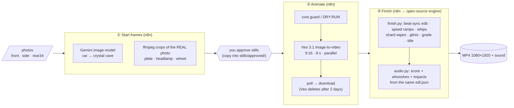

# Škoda Superb — AI-shot pipeline in n8n

Turns your 3 photos into a beat-synced, motion-designed vertical video:



* **n8n** orchestrates and calls the Google APIs. **FFmpeg + OpenCV + NumPy** do every pixel of the edit; nothing proprietary in the finishing.
* The one non-open-source step is the **image/video generation** (Gemini + Veo, your API key, your billing).

## What you need
1. Docker Desktop (or any Docker engine).
2. A **Gemini API key from a billing-enabled Google Cloud project** (AI Studio → "Get API key"). Veo is paid-tier only, and Flow credits are *not* the same as API billing. **Set a budget alert/cap on that project.**
3. Your photos in `data/inputs/` named exactly `front.jpg`, `side.jpg`, `rear34.jpg`.

## Setup (5 minutes)
```bash
cp .env.example .env            # fill GEMINI_API_KEY and N8N_ENCRYPTION_KEY (openssl rand -hex 24)
docker compose up -d --build
docker compose exec n8n bash /data/scripts/setup_n8n.sh   # stores the key in n8n's encrypted credential store + imports the 3 workflows
# optional free check that your key + model names are valid (no generation, no spend):
GEMINI_API_KEY=... bash scripts/smoke_test.sh
```
Open <http://localhost:5678>. (Create the owner account when n8n asks.) Never paste your key into a chat.

## Run it
| Step | Workflow | What it does | Cost |
|---|---|---|---|
| 1 | **01 · Start frames** | 6 AI "cave" stills + 3 real-photo macro crops → `data/stills/` + `_contact_sheet.jpg` | ≈ $0.40 |
| – | *you* | look at the contact sheet; copy the good stills into `data/stills/approved/` (redo bad ones by re-running 01) | – |
| 2 | **02 · Animate** | **Starts in DRY-RUN** and just prints the cost. Open the *Config* node, set `dry_run: false`, run again → 9 Veo clips in parallel → `data/clips/` | see below |
| 3 | **03 · Finish** | edit + motion design + score → `data/out/…mp4` (`preview: true` = fast half-res draft first) | $0 |

Test one clip first: in workflow 02's *Config* set `only: ['S01_reveal_orbit']` (≈ $1).

### Cost (Veo 3.1 prices from Google's pricing page, Oct 2026 — check before running)
| Setting | per second | 9 clips × 8 s |
|---|---|---|
| `veo-3.1-fast` 1080p (default) | $0.12 | **$8.64** |
| `veo-3.1-lite` 1080p | $0.08 | $5.76 |
| `veo-3.1-generate` (standard) 1080p | $0.40 | $28.80 |
| **Draft**: fast 720p × 4 s (`config/shots.draft.json` + `edl.draft.json`) | $0.10 | $3.60 |

Only ~1–3 s of each clip ends up in the 14 s edit, so draft quality is a good way to validate the whole chain cheaply.

## Art-direct it (two files)
* `config/shots.json` — every still prompt, camera/video prompt, crop framing, models, resolution. `crop_only` shots use your **real pixels** (plate/lamp/wheel) as the start frame so the number plate cannot be re-invented; `ai_scene` shots put the real car into the cave with an identity rule ("keep wheels, grille, plate…").
* `config/edl.json` — the cut: which clip, where to start (`src_in`, seconds), how many beats, speed ramps, punch/shake/flash, sweeps, shard wipes, whip direction, title. 90 BPM, 1 beat = 20 frames. `audio.py` reads the same file, so the sound re-syncs when you re-cut.

## Rehearse for free (mock Google API)
```bash
python3 tests/mock_gemini.py --port 8099          # fake Gemini/Veo: same endpoints, response shapes, async polling
```
In each workflow's *Config* node set `api_base` to `http://host.docker.internal:8099/v1beta`. Every workflow runs with a dummy key and no spend.
`MOCK_FAIL_PROMPT_CONTAINS="alloy wheel"` makes the mock safety-block one shot to see the failure path.

## Verified vs. not verified (honest status)
| | Status |
|---|---|
| 3 workflows execute in real **n8n 2.35.7** against the mock API | ✅ ran end-to-end (stills, 9 parallel Veo jobs finishing on different polls, downloads, failed-clip note, finish) |
| Dry-run cost guard; missing/failed-clip check | ✅ |
| One-command `setup_n8n.sh` into an empty n8n | ✅ |
| `finish.py` / `audio.py` | ✅ run on **stand-in footage** (re-timed earlier renders). Timing, ramps, whips, wipes, title, loudness (−14.1 LUFS) work; the **look on real Veo footage is untested** |
| **Real Google API calls** | ⚠️ **not run** (no key in my sandbox). Request/response shapes follow Google's published docs (Veo `predictLongRunning` + `inlineData` start frame, poll, `generateVideoResponse…video.uri`; Gemini `generateContent` image output). `smoke_test.sh` checks key + model ids for free. If Google changed a field name, the error shows in the n8n node that failed |
| Docker image | ⚠️ `Dockerfile` not built (no Docker daemon in my sandbox); the identical install steps ran natively |
| AI quality | ⚠️ Gemini/Veo can drift on car details. Built-in mitigations: `crop_only` real-pixel macros, identity rule, negative prompt, still-approval gate, per-shot re-run (`only`). Check the plate in every clip |

## Troubleshooting
* **`Unrecognized node type: n8n-nodes-base.executeCommand`** → env `NODES_EXCLUDE="[]"` (already set in the Dockerfile; n8n 2.x disables it by default).
* **"access to the file is not allowed"** → `N8N_RESTRICT_FILE_ACCESS_TO=/data` (set) and keep files under `/data`.
* **404 / model not found** → run `scripts/smoke_test.sh`; fix `image_model` / `veo.model` in `shots.json` (names change; the preflight node also warns).
* **400 about `negativePrompt`** → set `"send_negative_prompt": false` in `shots.json`.
* **403** → wrong key, or the project has no billing.
* **Clip missing + `*.FAILED.txt`** → usually Google's safety filter; soften the prompt, run 02 again with `only: ['<shot id>']`.
* Veo keeps results **2 days** — workflow 02 downloads immediately.
* `rear34.jpg` is a cropped photo; the AI may invent the missing parts — drop shot `S06` if it looks wrong and re-cut `edl.json`.

## Rebuild the workflows
`python3 tools/build_workflows.py` regenerates `workflows/*.json` (single source of truth).
